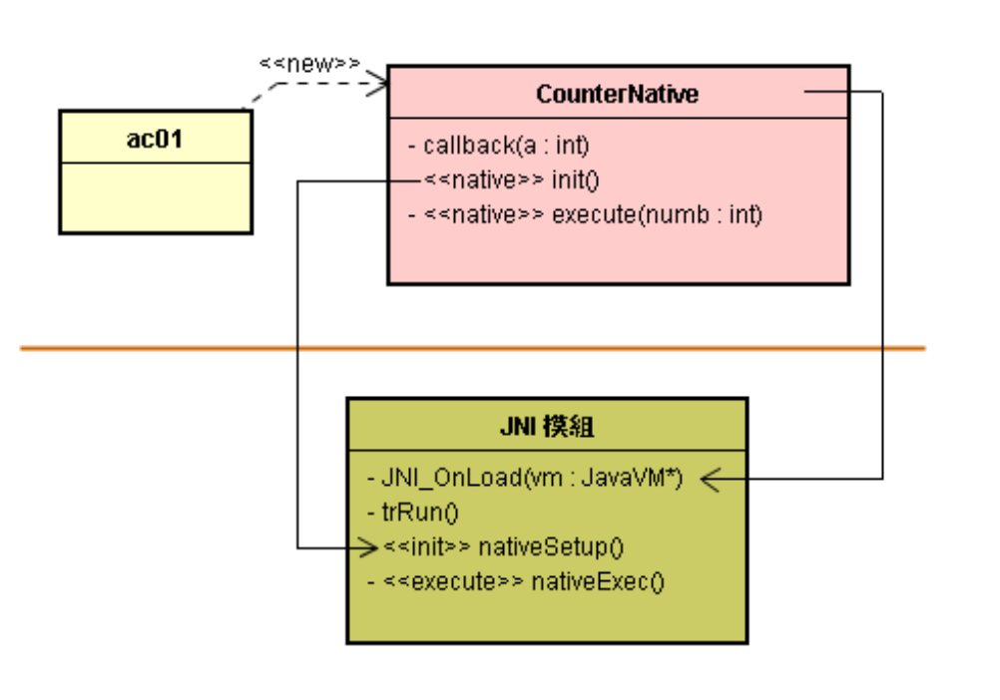

# 本地线程进入 java 层

# 1. 如何诞生 Native 层的子线程？

* 由于在创建 C 层新线程时，VM 尚不知道它的存在，没有替它创建专属的 JNIEnv 对象，无法调用到 Java 层函数。
* 此时，可以向 VM 登记而取得 JNIEnv 对象后，此线程就能进入 Java 层了。
* 使用 pthread_create() 函数来创建本地的子线程。

# 2. Native 线程进入 Java 层

* C 层新线程没有 JNIEnv 对象，无法调用到 Java 层函数。可以向 VM 登记而取得 JNIEnv 对象后，此线程就能进入 Java 层了。



* VM 载入 JNI 模块时，调用 JNI_OnLoad() 函数，其定义 init() 成为 nativeSetup() 的别名。

| 别名      | 参数 | 本名                                                     |
| --------- | ---- | -------------------------------------------------------- |
| init()    | ()V  | Java_com_misoo_counter_<br />CounterNative_nativeSetup() |
| execute() | ()V  | Java_com_misoo_counter<br />_CounterNative_nativeExec()  |

* 所以，Java 调用 init() 时，会转而调用 C 层的 nativeSetup() 函数。


* 也定义 execute() 成为 nativeExec() 的别名。

* 所以，Java 调用 execute() 时，会转而调用 C 层的nativeExec() 函数。

* 此时，nativeExec() 诞生一个新线程去执行 trRun() 函数。

* 然后，新线程进入 Java 层去执行 callback() 函数。

* 在执行 trRun() 时，新线程向 VM 登记而取得 JNIEnv 对象，才能调用 callback() 函数，进入 Java 层执行了。例如，使用指令：

  ```c
  jvm->AttachCurrentThread(&env, NULL);
  ```

* 就向 VM 登记，要求 VM 诞生 JNIEnv 对象，并将其指针值存入 env 里。有了 env 值，就能调用 Java 层的函数了。

```c++
/* com.misoo.counter.CounterNative.cpp */
#include <stdio.h>
#include <pthread.h>
#include "com_misoo_counter_CounterNative.h"
jmethodID mid;
jclass mClass;
JavaVM *jvm;
pthread_t thread;
int n, sum;
void* trRun( void* );

void JNICALL Java_com_misoo_counter_CounterNative_nativeSetup(JNIEnv *env, jobject thiz) {
	jclass clazz = env->GetObjectClass(thiz);
	mClass = (jclass)env->NewGlobalRef(clazz);
	mid = env->GetStaticMethodID(mClass, "callback", "(I)V");
}

void JNICALL Java_com_misoo_counter_CounterNative_nativeExec(JNIEnv *env, jobject thiz, jint numb){
	n = numb;
  // 创建线程
	pthread_create( &thread, NULL, trRun, NULL);
}

void* trRun( void* ){
	int status;
	JNIEnv *env; 
  bool isAttached = false;
  // 取得 JNIEnv 对象
	status = jvm->GetEnv((void **) &env, JNI_VERSION_1_4);
	if(status < 0) {
		status = jvm->AttachCurrentThread(&env, NULL);
		if(status < 0) return NULL;
		isAttached = true;
	}  
	sum = 0;
	for(int i = 0; i<=n; i++) sum += i;
  // 调用 java 方法
	env->CallStaticVoidMethod(mClass, mid, sum);
	if(isAttached) jvm->DetachCurrentThread();
	return NULL;
}
static const char *classPathName = "com/misoo/counter/CounterNative";
// 对应表
static JNINativeMethod methods[] = {
	{"init", "()V",
		(void *)Java_com_misoo_counter_CounterNative_nativeSetup},
	{"execute", "(I)V",
		(void *)Java_com_misoo_counter_CounterNative_nativeExec}
};

static int registerNativeMethods(JNIEnv* env, const char* className, JNINativeMethod* gMethods, int numMethods){
	jclass clazz = env->FindClass(className);
	env->RegisterNatives(clazz, gMethods, numMethods);
	return JNI_TRUE;
}

static int registerNatives(JNIEnv* env){
  registerNativeMethods(env, classPathName, methods, sizeof(methods) / sizeof(methods[0]));
	return JNI_TRUE;
}

jint JNI_OnLoad(JavaVM* vm, void* reserved){
	JNIEnv *env; jvm = vm;
	if (registerNatives(env) != JNI_TRUE) return -1;
	return JNI_VERSION_1_4;
}
```

* 指令：

  ```c++
  pthread_create( &thread, NULL, trRun, NULL);
  ```

* 例如，当你创建一个本地 C 层的新线程时，可以使用指令：

  ```c++
  jvm->AttachCurrentThread(&env, NULL);
  ```

* 就向 VM 登记，要求 VM 诞生 JNIEnv 对象，并将其指针值存入 env 里。

* 有了 env 值，就能执行指令：

  ```c++
  env->CallStaticVoidMethod(mClass, mid, sum);
  ```

* 其调用 Java 层的函数了。

# 3. Native 多线程的安全

* C++ 代码中主线程和子线程都调用同一 Callback 函数，会有线程安全问题。

* 于是，在 Callback() 函数里，使用

  ```c++
  env->MonitorEnter()和env->MonitorExit(mSyncObj);
  ```

  指令来让各线程能达到同步。