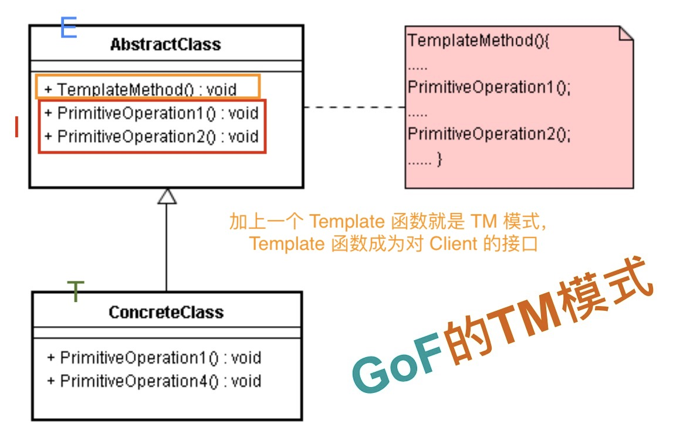
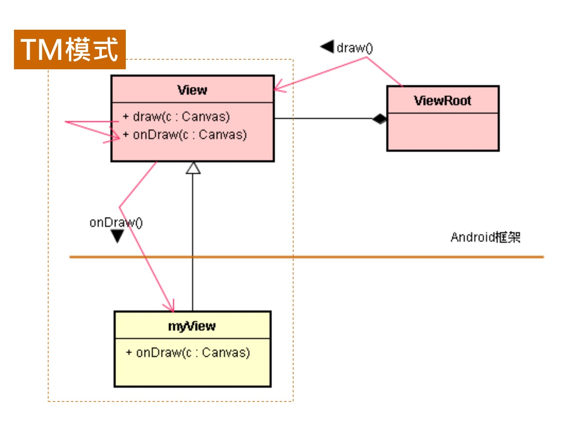
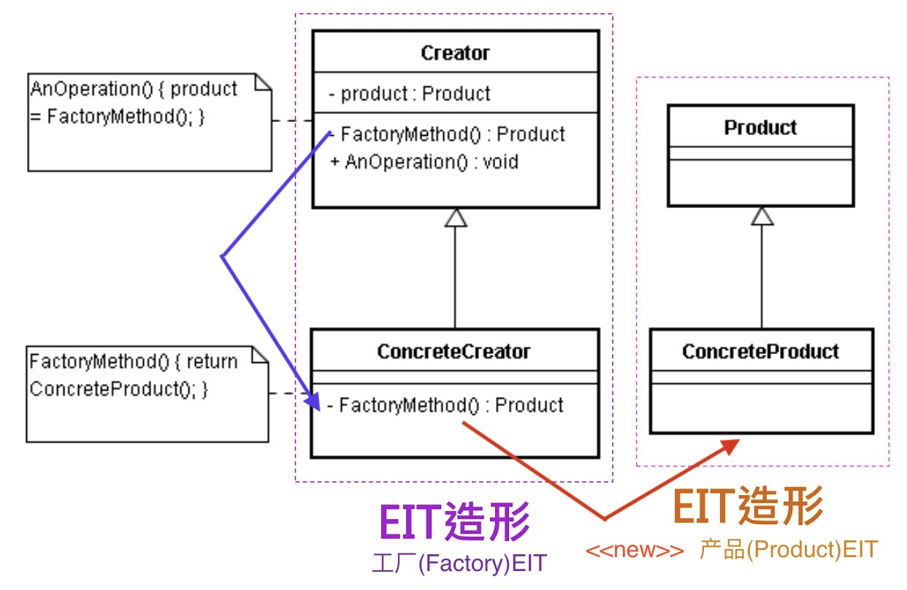
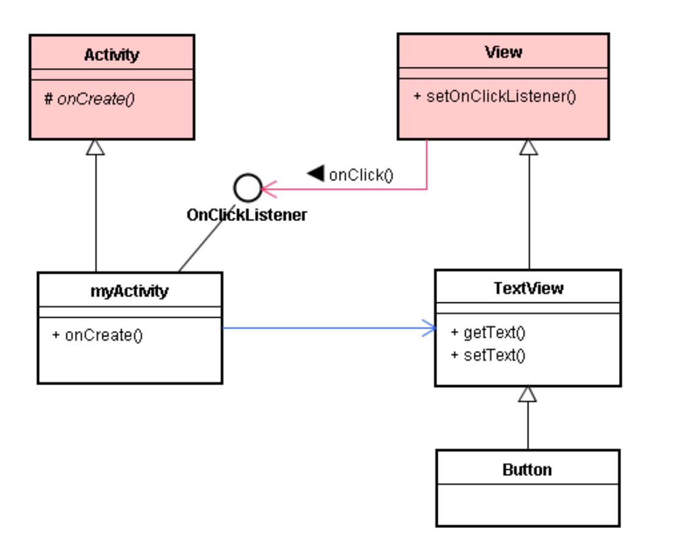
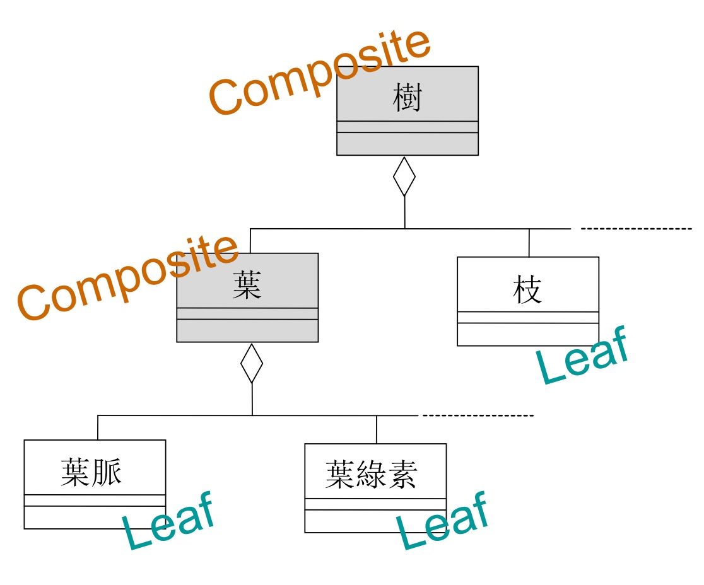
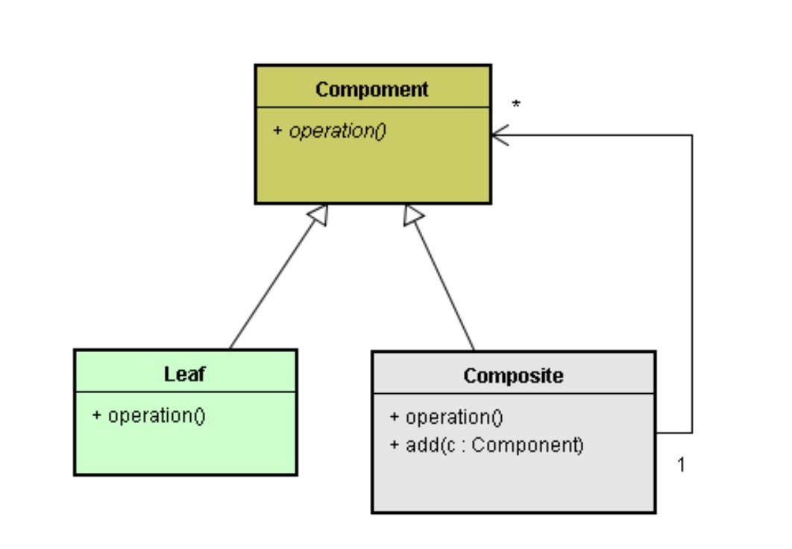
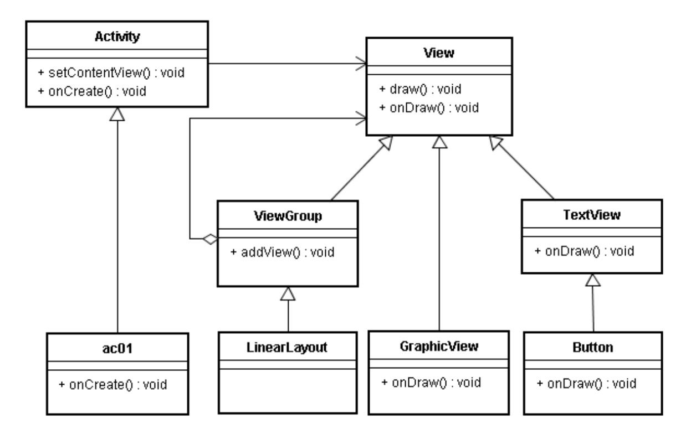

# 简介设计模式

# 1. 模式（Pattern）是较大的结构

# 2. 结构形式愈大，通用性愈小

EIT 的结构形式小，通用性大，设计模式的结构形式大，通用性小。

# 3. 从 EIT 造形组合出设计模式

* 相对上

  -- EIT 造形属于原子层级；

  -- 设计模式（Design Pattern）属于分子层级。

# 4. 介绍 GoF 设计模式

* 裁缝有样式、围棋有棋谱、烹饪有食谱、武功有招式、战争有兵法，... 皆是专家和高手的经验心得，统称为：模式（Pattern）。
* 模式告诉你理想的方案像什么，有那些特性：同时也告诉你些规则，让你依循之，而产生适合于环境的具体方案。

# 5. GoF 的 Template Method 模式

## 5.1. Template Method 模式

* 控制反转（IoC：Inversion of Control）是 < 基类/子类 > 结构里的重要机制。Template Method 模式是实现 IoC 的一种基本模式。

# 6. 范例：Android + TM 模式

* 绘图的 draw() 和 onDraw() 方法就是 TM 模式。

# 7. GoF 的 Factory Method 模式

# 8. 范例：Android + FM 模式

* 在 Android 框架里，处处可见 Factory Method 模式。例如，Activity、Service 等抽象类别里都定义了 onCreate() 函数，它就是一个典型的 FactoryMethod 函数。

模式.png)

# 9. GoF 的 Observer 模式

* 定义对象间的 1:N 依赖关系，以便当一个主体对象（如A）的状态发生改变时，所有依赖于它的众多对象（如 B、C、D...）都得到通知，然后可向主题对象(A)取得最新状态内容。

* 如果 Observer 是个纯粹抽象类别（Pure Abstract Class），它扮演接口角色，就相当于 Java 语言的 interface 机制。

* 虽然父类别 Observer 已经变为 IObserver 接口了，其卡榫函数还是存在那里，知识形式有些变化而已。

# 10. 范例：Android + Observer 模式

* Android 的 View 体系，其对象（又称为控件）会呈现于 UI 画面上。
* 当用户按下该控件，引发控件的状态改变了，就会透过 onClickListener 接口来通知所有的 Listener 对象。

# 11. GoF 的 Composite 模式

* 此模式能建立多层级的包含关系（即多层级 Whole-part 关系）。

* 从上图中，可看出这些对象可依其角色而分为两类：

1. Leaf 物件：如上图里的 [白色]类别之对象，它们不具备 Whole 之角色，只具有 Part 之角色。这统称为 [基本组件]（Primitive Component）。
2. Composite 物件：如上图中的 [灰色]类别之对象，它们具有 Whole 之角色，也可能具有 Part 之角色。这统称为 [复合组件]（Composite Component）。

# 12. 范例：Android + Composite 模式

* Android 的 View 就是 Compoment 模式

* 在 Android 平台里，像 Button 或 ImageButton 等屏幕控件皆通称为 View。
* 多个 View 能组合在一起，就会各种排列方式，即称为 [布局] (Layout)。
* 这 Layout 类别就是从 ViewGroup 父类别衍生出来的。

