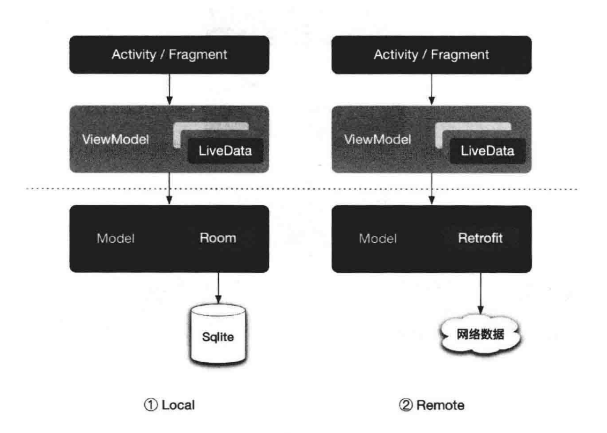
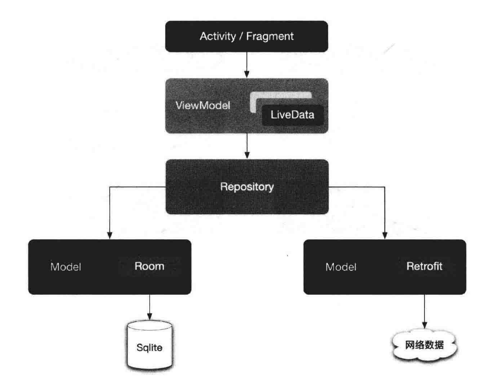
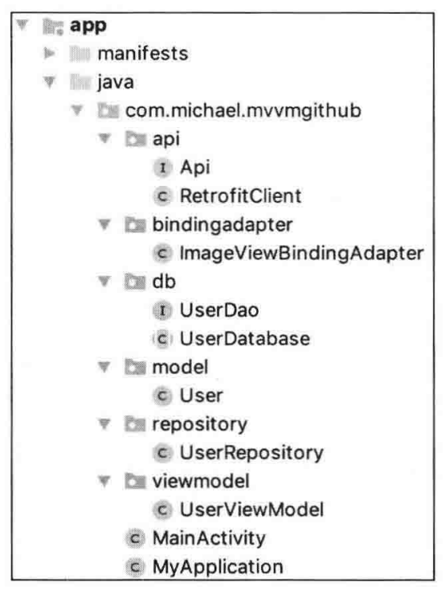

# 第 10 章 MVVM 架构

### 10.1. MVVM 架构与 Jetpack

MVVM 即 Model-View-ViewModel 的缩写。它的出现是为了将图形界面与业务逻辑、数据模型进行解耦。MVVM 也是 Google 推崇的一种 Android 项目架构模型。在前面的章节中所学习的 Jetpack 组件，大部分都是为了能够更好地架构 MVVM 应用程序而设计的。

### 10.2. 数据模型驱动界面更新

MVVM 架构的应用程序采用了数据模型驱动界面更新的设计方案。因此，在了解 MVVM 之前，需要先了解数据模型驱动界面更新的概念。希望数据在发生变化时，界面能够自动得到通知并进行更新，这就是数据模型启动界面更新。对于普通应用程序，数据的来源无非就两种，一种来源于本地，通常是本地数据库；另外一种来源于远程服务端，即网络数据。



从图可以看出，ViewModel 曾的数据既可以来源于本地数据库，也可以来源于远程服务器。在实际开发过程中，为了更好的用户体验，通常会将本地数据库和远程服务器这两种方式进行结合。若在 ViewModel 层对本地数据和网络数据进行业务逻辑处理，势必会增加 ViewModel 的复杂度。因此，可以在 ViewModel 层和 Model 层之间引入 Repository 层。在 Repository 层处理本地数据和网络数据之间的业务逻辑，让 Repository 层对 ViewModel 层负责，使 ViewModel 只需要关心自己的业务逻辑，而不用关心数据的具体来源，这便是 Repository 层存在的意义。引用 Repository 层后的架构如下：



请永远记住，MVVM 架构中每一层的职责都是清晰的、明确的，且只对其上一层负责。这样从长远来看，随着代码量的增加，不容易让项目陷入技术债务中。并且由于每一层的职责单一，每个模块也更容易进行独立测试。

### 10.3. 简单回顾 Jetpack 组件

LifeCycle：有了 LifeCycle 组件，当系统组件 Activity、Fragment、Service 和 Application 的生命周期发生变化时，自定义组件能够及时得到通知。LifeCycle 使自定义组件与系统组件进一步解耦。

Navigation：处理导航图所需的一切，包括页面的跳转、参数的传递、动画效果的设置，以及 App bar 的设置等。导航图让我们可以站在 “上帝的视角”，俯瞰应用程序所有界面之间的关系。

ViewModel：顾名思义，ViewModel 负责处理和存放 View 与 Model 之间的业务逻辑。它直接对 UI 界面所需的数据负责，让视图和数据进行分离。并且，ViewModel 与生命周期相关，它能自动处理由于屏幕旋转导致界面重新创建所带来的数据重新获取问题。

LiveData：LiveData 在 MVVM 结构的层与层之间扮演者桥梁的作用。当数据发生变化时，通过 LiveData 让数据的订阅者得到通知。

Room：Google 官方的 ORM 数据库，原生支持 LiveData。在搭配 LiveData 使用时，当 Room 数据库中的数据发生变化，LiveData 使数据的订阅者能够及时得到通知，而无需从数据库重新获取数据。

WorkManager：为应用程序中那些不需要及时完成的任务提供同意的解决方案。

DataBinding：进一步解耦 UI 界面。DataBinding 的出现让 findViewById 不复存在，使布局文件能够承担更多的工作，甚至能承担一些简单的业务逻辑，这减轻了 Activity/Fragment 的工作量。

Paging：为常见的 3 种分页机制提供了统一的解决方案，使工程师能够将更多的精力专注在业务代码上。

### 10.4. 使用 Jetpack 组件构建 MVVM 应用程序

本节将用到的 Jetpack 组件有 LiveData、Room、ViewModel 和 DataBinding。对于演示如何构建一个简单的 MVVM 应用程序，这已经足够了。这里没有强行引入其他组件，例如 Navigation、Paging 等，这些组件有其特殊的用途，对于架构一个完整的应用程序是必要的。但在本节中，主要目的是演示什么是 MVVM、什么是数据模型驱动视图更新。力求通过最简单的案例将其解释清楚。

1. 案例分析

   假设需要通过 GitHub API 获取某个特定用户的个人信息并进行展示。

2. API 接口

   ```
   api.github.com/users/michaelye
   ```

3. 项目工程结构

   

   结合项目的工程结构图，可以大致将项目分为以下几个层级。

   * Model：使用 Room 数据库存储用户个人信息。
   * API：通过 Retrofit 库请求 Github API。
   * Application：在其中实例化 Room 和 Retrofit 对象，以便统一管理和全局调用。
   * Repository：构建 Repository 层，用于处理 Room 中的数据与 API 接口的来的网络数据之间的业务关系。
   * ViewModel：从 Repository 层中获取数据，ViewModel 不需要关心数据的来源是 Room 还是 API 接口。
   * View：Activity 和布局文件，将会用到 DataBinding 组件。

4. 代码分析

   a. 准备工作。

   由于需要勤秋网络数据，因此需要在 Manifest 文件中开启网络权限。

   ```
   <uses-permission android:name="android.permission.INTERNET">
   ```

   在 app 的 build.gradle 文件中启用 DataBinding，并为所需组件添加相关依赖。注意，除了 Jetpack 组件，这里还用到了用于 API 请求的 Retrofit 库、用于图片加载的 Picasso 库、下拉刷新组件，以及用于生成圆形头像的组件 CircleImageView。

   ```groovy
   android {
   	...
   	dataBinding{
   			enabled = true
   	}
   }
   
   dependencies {
   	...
   	implementation 'androidx.lifecycle.lifecycle-extensions:2.2.0'
   	implementation 'com.squareup.retrofit2:retrofit:2.6.2'
   	implementation 'com.squareup.retrofit2:converter-gson:2.4.0'
   	implementation 'com.squareup.picasso:picasso:2.71828'
   	implementation "androidx.room:room-runtime:2.2.2"
   	annotationProcessor "andriodx.room:room-compiler:2.2.2"
   	implementation 'androidx.swiperefreshlayout:swiperefreshlayout:1.0.0'
   	implementation 'de.hdodenhof:circleimageview:3.0.1'
   }
   ```

   b. Model 层。

   首先需要定义 User 模型，该模型在整个应用程序中都需要被用到，包括数据库、API 接口和 View。模型中的字段来源于 GitHub API 接口所返回的数据，其中只保留所需要的字段。

   ```java
   @Entity(tableName = "user")
   public class User{
   	@PrimaryKey()
   	@ColumnInfo(name="id", typeAffinity = ColumnInfo.INTEGER)
   	public int id;
   	
   	@ColumnInfo(name="name", typeAffinity = ColumnInfo.TEXT)
   	public String name;
   	
   	@ColumnInfo(name="avatar", typeAffinity = ColumnInfo.TEXT)
   	@SerializedName("avatar_url")
   	public String avatar;
   	
   	@ColumnInfo(name="followers", typeAffinity = ColumnInfo.INTEGER)
   	public String followers;
   	
   	@ColumnInfo(name="following", typeAffinity = ColumnInfo.INTEGER)
   	public String following;
   	
   	@ColumnInfo(name="blog", typeAffinity = ColumnInfo.TEXT)
   	public String blog;
   	
   	@ColumnInfo(name="company", typeAffinity = ColumnInfo.TEXT)
   	public String company;
   	
   	@ColumnInfo(name="bio", typeAffinity = ColumnInfo.TEXT)
   	public String bio;
   	
   	@ColumnInfo(name="location", typeAffinity = ColumnInfo.TEXT)
   	public String location;
   	
   	@ColumnInfo(name="htmlUrl", typeAffinity = ColumnInfo.TEXT)
   	@SerializedName("html_url")
   	public String htmlUrl;
   	
   	public User(int id, String name, String avatar, int followers,
   								int following, String blog, String company,
   								String bio, String location, String htmlUrl){
   		this.id = id;
   		this.name = name;
   		this.avatar = avatar;
   		this.followers = followers;
   		this.following = following;
   		this.blog = blog;
   		this.company = company;
   		this.bio = bio;
   		this.location = location;
   		this.htmlUrl = htmlUrl;
   	}
   }
   ```

   创建 Room 数据库。

   ```java
   @Database(entities = {User.class}, version = 1)
   public abstract class UserDatabase extends RoomDatabase{
   	private static final String DATABASE_NAME = "user_db";
   	
   	private static UserDatabase databaseInstance;
   	
   	public static synchronized UserDatabase getInstance(Context context){
   		if(databaseInstance == null){
   			databaseInstance = Room
   						.databaseBuilder(context.getApplicationContext(),
   								UserDatabase.class, DATABASE_NAME).build();
   		}
   		return databaseInstance;
   	
   	}
   	
   	public abstract UserDao userDao();
   }
   ```

   创建用于访问 User 表的 Dao 文件。注意，在查询方法中返回的是 LiveData 包装过的 User，这样，当 Room 中的数据发生变化时，能够自动通知数据观察者。

   ```
   @Dao
   public interface UserDao{
   	@Insert(onconflict = OnConflictStarategy.REPLACE)
   	void insertUser(User user);
   	
   	@Delete
   	void deleteStudent(User user);
   	
   	@Query("SELECT * FROM user WHERE name = :name")
   	LiveData<User> getUserByName(String name);
   }
   ```

   c. API 层。

   定义 Api 接口。

   ```java
   public interface Api{
   	@GET("users/{userId}")
   	Call<User> getUser(
   		@Path("userId") String userId
   	);
   }
   ```

   实例化 Retrofit 对象。

   ```
   public class RetrofitClient{
   	private static final String BASE_URL = "https://***.github.com/";
   	private static RetrofitClient retrofitClient;
   	private Retrofit retrofit;
   	
   	private RetrofitClient(){
   		if(retrofitClient == null){
   			retrofitClient = new RetrofitClient();
   		}
   		return retrofitClient;
   	}
   	
   	public Api getApi(){
   		return retrofit.create(Api.class);
   	}
   }
   ```

   d. Application 层。

   既然已经定义好了 Room 和 Retrofit，便可以在 Application 中对其进行实例化了。这样做的好处在于，方便统一管理和全局调用这两个对象，并且不用担心这两个对象的生命周期问题，数据库和 Retrofit 对象通常伴随着这个应用程序的生命周期。因此，在 Application 中进行实例化是一个比较好的做法。

   ```
   public class MyApplication extends Application{
   	@Override
   	public void onCreate(){
   		super.onCreate();
   		userDatabase = UserDatabase.getInstance(this);
   		api = RetrofitClient.getInstance().getApi();
   	}
   	
   	private static UserDatabase userDatabase;
   	private static Api api;
   	
   	public static Api getApi(){
   		return api;
   	}
   	
   	public static UserDatabase getUserDatabase(){
   		return userDatabase;
   	}
   }
   ```

   e. Repository 层。

   在该层请求网络数据，并将得到的数据写入 Room 数据库。需要注意的是，该类只对 ViewModel 负责。它提供了两个方法 getUser() 和 refresh()。当 ViewModel 需要数据时，它不用关心数据是来自网络还是本地数据库。在 getUser() 方法中，数据直接来源于 Room 数据库。并且在每次调用该方法时，都会调用 refresh() 方法更新一次数据。refresh() 方法也被下拉刷新组件所调用。

   当网络数据请求成功后，会直接将其写入 Room 数据库。神奇的地方在于，由于使用了 LiveData，当数据有变化时，ViewModel 会自动得到通知，因此，不用担心数据更新问题。

   ```java
   public class UserRepository{
   	private String TAG = this.getClass().getName();
   	private UserDao userDao;
   	private Api api;
   	
   	public UserRepository(UserDao userDao, Api api){
   		this.api = api;
   		this.userDao = userDao;
   	}
   	
   	public LiveData<User> getUser(final String name){
   		refresh(name);
   		return userDao.getUserByName(name);
   	}
   	
   	public void refresh(String userName){
   		api.getUser(userName).enqueue(new Callback<User>(){
   			@Override
   			public void onResponse(Call<User> call,
   										Response<User> response){
   				if(response.body() != null){
   					insertUser(response.body());
   				}
   			}
   			
   			@Override
   			public void onFailure(Call<User> call, Throwable t){}
   		});
   	}
   	
   	private void insertUser(final User user){
   		AsyncTask.execute(new Runnable(){
   			@Override
   			public void run(){
   				userDao.insertUser(user);
   			}
   		});
   	}
   }
   ```

   f. ViewModel 层

   在 ViewModel 的构造器中，实例化 Repository 对象，并将数据库对象和 Retrofit 对象以构造器参数的形式传入 Repository 中。最后，同样还是利用 LiveData，将 User 数据传递到上一层，即 View 层。

   ```java
   public class UserViewModel extends AndroidViewModel{
   	private LiveData<User> user;
   	
   	private UserRepository userRepository;
   	
   	private String userName = "MichaelYe";
   	
   	public UserViewModel(Application application){
   		super(application);
   		UserDatabase database = MyApplication.getUserDatabase();
   		UserDao userDao = database.userDao();
   		userRepository = new UserRepository(userDao, MyApplication.getApi());
   		user = userRepository.getUser(userName);
   	}
   	
   	public LiveData<User> getUser(){
   		return user;
   	}
   	
   	public void refresh(){
   		userRepository.refresh(userName);
   	}
   }
   ```

   g. View 层

   在 Activity 中，使用了 DataBinding 组件和下拉刷新组件。当 User 数据发生变化时，自动通过回调方法得到通知，在接收到通知后，将数据交给布局文件进行处理。

   ```java
   public class MainActivity extends AppCompatActivity{
   	@Override
   	protected void onCreate(Bundle savedInstanceState){
   		super.onCreate(savedInstance);
   		final ActivityMainBinding activityMainBinding =
   						DataBindingUtil.setContentView(this,R.layout.activity_main);
   		final UserViewModel userViewModel = 
   				new ViewModelProvider(this).get(UserViewModel.class);
   		userViewModel.getUser().observe(this, new Observer<User>(){
   			@Override
   			public void onChanged(User user){
   				if(user != null){
   					activityMainBinding.setUser(user);
   				}
   			}
   		});
   		
   		final SwipeRefreshLayout swipeRefresh = 
   															activityMainBinding.swipeRefresh;
   		swipeRefresh.setOnRefreshListener(
   							new SwipeRefreshLayout.onRefreshListener(){
   				@Override
   				public void onRefresh(){
   					userViewModel.refresh();
   					swipeRefresh.setRefreshing(false);
   				}
   		});
   	}
   }
   ```

   在布局文件中处理 Activity 传递来的数据对象。其中用到了 CircleImageView 组件，用于生成圆形头像。

   ```xml
   <?xml version="1.0" encoding="utf-8"?>
   <layout xmlns:android="http://******.android.com/apk/res/android">
   
   	<data>
   		<variable
   			name="user"
   			type="com.michael.mvvmgithub.model.User" />
   	</data>
   	
   	<androidx.swiperefreshlayout.widget.SwipeRefreshLayout
   		android:id="@+id/swipeRefresh"
   		android:layout_width="match_parent"
   		android:layout_height="match_parent">
   	
   		<RelativeLayout
   			android:layout_width="match_parent"
   			android:layout_height="wrap_content"
   			android:background="#dfdfdf">
   		
   			<ImageView
   				android:layout_width="wrap_content"
   				android:layout_height="wrap_content"
   				android:scaleType="fitStart"
   				android:src="@drawable/background" />
   				
   			<View
   				android:layout_width="match_parent"
   				android:layout_height="match_parent"
   				android:layout_marginTop="128dp"
   				andriod:layout_marginLeft="28dp"
   				android:layout_marginRight="28dp"
   				android:background="@android:color/white"/>
   			
   			<LinearLayout
   				xmlns:app="http://******.android.com/apk/res-auto"
   				xmlns:tools="http://******.android.com/tools"
   				android:layout_width="match_parent"
   				android:layout_height="match_parent"
   				android:gravity="center_horizontal"
   				android:layout_marginTop="80dp"
   				android:orientation="vertical"
   				tools:context=".MainActivity">
   				
   				<de.hdodenhof.circleimageview.CircleImageView
   					android:id="@+id/profile_image"
   					android:layout_width="96dp"
   					android:layout_height="96dp"
   					app:image="@{user.avatar}"
   					app:civ_border_width="2dp"
   					app:civ_border_color="#cccccc" />
   				
   				<TextView
   					android:layout_width="wrap_content"
   					android:layout_height="wrap_content"
   					android:text="@{user.name}"
   					android:textSize="22sp"
   					android:textStyle="bold"
   					android:layout_marginTop="8dp"
   					app:layout_constraintBottom_toBottomOf="parent"
   					app:layout_constraintLeft_toLeftOf="parent"
   					app:layout_constraintRight_toRightOf="parent"
   					app:layout_constraintTop_toTopOf="parent"/>
   					
   				<TextView
   					android:layout_width="wrap_content"
   					android:layout_height="wrap_content"
   					android:layout_marginTop="8dp"
   					android:textSize="16sp"
   					android:text="@{user.bio}" />
   				
   				<TextView
   					android:layout_width="wrap_content"
   					andriod:layout_height="wrap_content"
   					android:layout_marginTop="8dp"
   					android:textSize="16sp"
   					android:text="@{@string/location(user.location)}" />
   					
   				<LinearLayout
   					android:layout_width="wrap_content"
   					android:layout_height="wrap_content"
   					android:layout_marginTop="8dp"
   					andriod:orientation="horizontal">
   					
   					<TextView
   						android:layout_width="wrap_content"
   						android:layout_height="wrap_content"
   						android:textSize="16sp"
   						android:text="@{@string/followers(Integer.toString(user.followers))}"/>
   						
   						
   					<TextView
   						android:layout_width="wrap_content"
   						android:layout_height="wrap_content"
   						android:layout_marginLeft="12dp"
   						andriod:textSize="16sp"
   						android:text="@{@string/following(Integer.toString(user.following))}" />
   						
   				</LinearLayout>
   				
   				<TextView
   					android:layout_width="wrap_content"
   					android:layout_height="wrap_content"
   					android:layout_marginTop="8dp"
   					android:textSize="16sp"
   					android:text="@{user.htmlUrl}" />
   				
   				<TextView
   					android:layout_width="wrap_content"
   					android:layout_height="wrap_content"
   					android:layout_marginTop="8dp"
   					android:textSize="16sp"
   					android:text="@{user.blog}" />
   					
   			</LinearLayout>
   		</RelativeLayout>
   	</androidx.swiperefreshlayout.widget.SwipeRefreshLayout>
   </layout>
   ```

   在布局文件中，还通过自定义 BindingAdapter，实现图片的加载。具体的加载工作，交给 Picasso 完成。

   ```java
   public class ImageViewBinding{
   	@BindingAdapter(value={"image","defaultImageResource"},requireAll = false)
   	public static void setImage(ImageView imageView, String imageUrl, int imageResource){
   		if(!TextUtils.isEmpty(imageUrl)){
   			Picasso.get()
   						 .load(imageUrl)
   						 .placeholder(R.drawable.ic_default)
   						 .error(R.drawable.ic_error)
   						 .into(imageView);
   		} else {
   			imageView.setImageResource(imageResource);
   		}
   	}
   }
   ```

### 10.5. 总结

数据驱动视图，主要利用了 LiveData 来实现层层通知。很重要的一点是，需要保证数据的单一来源，对于要展示的数据，只通过数据库获取。从网络获取的数据不直接进行展示，而是将其写入数据库后，再由数据库通知外界进行更新。另外，层与层之间严禁跨层沟通，下一层只对其直接的上一层负责。这样虽然项目写起来会比较耗费时间，在小型项目中会显得臃肿。但是一旦代码量大量增加时，这样的做法能够让你避免陷入技术债务，也方便对每一层进行单元测试，因为层与层之间的关系是相对独立的。

Jetpack 的各组件可以结合使用，也可以单独使用。架构符合 mvvm 规范的应用程序，并非一定要用到所有的 Jetpack 组件，但 Google 在 Jetppack 各组件的研发过程中，确实考虑了结合使用的情形。例如，Room 组件可以单独使用，但它原生就支持 LiveData，因此，结合 LiveData 使用效果会更强大。

值得注意的是，关于架构 MVVM 应用程序，Google 官方还推荐使用一个名为 Dagger 的依赖注入库。Dagger 库原是 Square 公司的项目，现由 Google 维护。Dagger 库的作用是解耦对象之间的依赖关系。

架构应用程序不可能有十全十美的解决方案，Google 推出 Jetpack 是希望能解决工程师的困扰，为大家指明一个大致的方向，但它不一定就是一个完美的方案。由于产品形态各异，项目的架构不可能有统一的解决方案。学习 Jetpack 是必要的，它让我们了解了 Google 官方有哪些解决方案，但它不是"万能钥匙"。在世纪开发中需要考虑的因素太多，建议可以在自己的项目中引入部分 Jetpack 组件进行尝试，以判断是否符合当前项目的需求。
