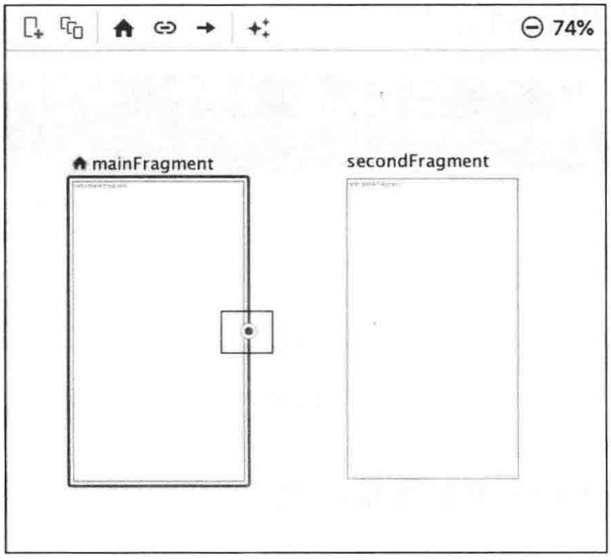

# 第 3 章 Navigation

### 3.1. Navigation 的诞生

单个 Activity 嵌套多个 Fragment 的 UI 架构模式，已经被大多数 Android 工程师 所接受和采用。但是，对 Fragment 的管理一直是一件比较麻烦的事情 。工程师 需要通过 FragmentManager 和 FragmentTransaction 来管理 Fragment 之间的切换。页面的切换通常还包括对应用程序 App bar 的管理、Fragment 间的切换动画，以及 Fragment 间的参数传递。纯代码的方式使用起来不是特别友好，并且Fragment 和 App bar 在管理和使用的过程中显得很混乱。

为此，Jetpack 提供了一个名为 Navigation 的组件，旨在方便管理页面和 App bar。它具有以 下优势。

* 可视化的页面导航图 ，类似于 Apple Xcode 中 的 StoryBoard ，便于我们理清页面间的关系。
* 通过 destination 和 action 完成页面间的导航。
* 方便添加页面切换动画。
* 页面间类型安全的参数传递。
* 通 过 Navigation UI 类 ， 对菜单、底部导航、抽屉莱单导航进行统一的管理。
* 支持深层链接 DeepLink 。

### 3.2. Navigation 的主要元素

Navigation 中的主要元素：

1. Navigation Graph。这是一种新型的 XML 资源文件，其中包含应用程序所有的页面，以及页面间的关系。

2. NavHost Fragment 。这是一个特殊的 Fragment ，可以认为它是其他Fragment 的 “容器”，Navigation Graph 中的 Fragment 正是通过NavHostFragment 进行展示的。
3. NavController 。这是一个 Java/Kotlin 对象，用于在代码中完成 Navigation Graph 中具体的页面切换工作。

当你想切换 Fragment 时，使用 NavController 对象，告诉它你想要去 Navigation Graph 中的哪个 Fragment ，NavController 会将你想去的 Fragment 展示在 NavHostFragment 中。

### 3.3. 使用 Navigation

#### 3.3.1. 创建 NavigationGraph

新建一个 Android 项目后，依次选中 res 文件夹 -> New -> Android Resource File, 新建一个 Navigation Graph 文件。将 Filename 设置为 “nav_graph"，Resource type 设置为 “Navigation”。

单击 “OK” 按钮，NavigationGraph 就创建完成了。

所生成的 nav_graph.xml 文件与普通布局文件类似，也有 Design 和 Text 面板。 在此，能在 Destinations 面板中，看见 “No NavHostFragments found” 的提示。

需要注意的是，Navigation 的使用需要依赖于相关支持库，因此 Android Studio
可能会询问你，是否自动添加相关依赖，单击 OK 即可。

当然，也可以在 build.gradle 文件中手动添加依赖，示例如下。

```groovy
dependencies {
	def nav_version = "2.3.0-alpha05"
	implementation "android.navigation:navigation-fragment: $nav"
	implementation "androidx.navigation:navigation-ui:Snav"
}
```

#### 3.3.2. 添加 NavHostFragment

NavHostFragment 是 一个特殊的 Fragment，需要将其添加到 Activity 的布
局文件中，作为其他 Fragment 的容器。

```xml
<?xml version="1.0" encoding="utf-8"?> 
<RelativeLayout
	xmins:android="http://*******.android.com/apk/res/android" 
  xmins: app="http: //*******.android.com/apk/res-auto" 
  xmins:tools="http://** *.android.com/tools"
  android:layout_width="mat ch_parent"
  android:layout height="match parent" 
  tools:context=" MainActivity">

  <fragment
			android:id="(+id/navh o s tfragment"
			android: name="android.navigation. fragment .NavHostFragment" 
      android:layout_width-"match parent"
			android: layout_height="match_parent" 
      app: defaultNavHost="true"
      app: navGraph="@navigation/navgraph" />
</RelativeLayout>
```

请注意，下面这一行代码在告诉系统，这是 一个特殊的 Fragment。

```xml
android:name = "android.navigation.fragment.NavHostFragment"
```

将 app:defaultNavHost 属性设置为 true，则该 Fragment 会自动处理系统返回键。 即当用户按下手机的返回按钮时，系统能自动将当前所展示的 Fragment 退出。

```xml
app: defaultNavHost="true"
```

app:navGraph 属性用于设置该 Fragment 对应的导航图。

```xml
app: navGraph="@navigation/nav_graph"
```

添加 NavHostPragment 之后，再回到导航图上。此时，在 Destinations 面板中 可以看见刚才设置的 NavHostFragment 。

#### 3.3.3. 创建 destination

依次单击加号按钮、“Crcatenewdestination” 按钮，创建—个destination。

destination 是“目的地” 的意思，代表着想去的页面。它可以是 Fragment 或Activity，但最常见的是 Fragment，因为 Navigation 组件的作用是方便开发者在 一个 Activity 中管理多个 Fragment。在此，通过 destination 创建 一个名为 MainFragment 的 Fragment 。

接着，再次单击加号按钮，此时出现了刚才创建的 MainFragment 对应的布局文件 fragment_main。单击该文件。

面板中出现了一个 mainFragment 。“ Start” 表示该 MainFragment 是起始Fragment ，即 NavHostFragment 容器首先展示的 Fragment。

查看布局文件的内容：

```xml
<?xm1version="1.0" encoding="utf-8"?> 
<navigation
		xmlns: android="http://******.android.com/apk/res/android" 		
    xmins: app="http://******* .android.com/apk/res-auto"
		xmIns:tools="http://*******.android.com/tools"
		android:id="@+id/nav_graph"
		app:startDestination="@id/mainFragment">

  <fragment 
     android:id="@+id/mainFragment"
     android: name="com .michael.navigationbasicdemo.MainFragment" 			android:label="fragmentmain"
		 tools:1ayout = "@layout/fragment_main" /> 
</navigation>
```

可以看到，在 navigation 标签下有 一个 startDestination 属性，该属性指定起始 destination 为 mainFragment。

```xml
app:startDestination="@id/mainFragment"
```

运行程序，可以看到一个空白的 Fragment，即 destination 所指定的 mainFragment。

#### 3.3.4. 完成 Fragment 页面切换

接下来看看 Navigation 如何实现 Fragment 页面的切换。

与创建 MainFragment 的方式类似，先创建一个 SecondFragment。

单击 mainFragment，用鼠标选中其右侧的圆圈，并拖拽至右边的 secondFragment，松开鼠标。



此时出现一个从 mainFragment 指向 secondFragment 的箭头。

切换到 Text 面板，查看布局文件。可以看到多了一个 \<action/> 标签，app:destination 属性表示它的目的地是 secondFragment。

```xml
<?xmI version="1.0" encoding-"utf-8"?>
<navigation
	xmlns:android="http://*******.android.com/apk/res/android"
  xmlns:app="http://*******.android.com/apk/res-auto"
	xmlns:tools="http://**** android.com/tools"
  android:id="@+id/nav_graph" 
  app:startDestination-"@id/mainFragment">
	
  <fragment 
      android:id="@+id/mainFragment"
      android:name="com .michael.navigationbasicdemo.MainFragment" 			 android:label="fragment_main" 
      tools:layout="(layout/fragmentmain">
    
    <action
        android:id="C+id/action_mainFragment_to_secondFragment" 					app:destination="@id/secondFragment"/>
  </fragment>
  
  <fragment
     android:id="(+id/secondFragment" 
     android:name="com.michael.navigationbasicdemo.SecondFragment" 
     android: label=" fragmentsecond" 
     tools:layout="(layout/fragment_second" />

</navigation>
```

#### 3.3.5. 使用 NavCOntroller 完成导航

还需要通过 NavController 对象，在代码中完成具体的页面跳转工作。

在 MainFragment 的布局文件中添加一个Button。

```xml
<?xm1 version="1.0" encoding="utf-8"?>
<RelativeLayout
    xmlns:android="http://*******.android.com/apk/res/android"
    xmlns:tools="http://*******.android.com/tools" 
    android:layout_width="match_parent"
    android:layout_height="match_parent"
    tools:context=".MainFragment">
  
  <TextView 
      android:id="@+id/tvTitle"
      android:layout_wiath="wrap_content"
      android:layout_height="wrap_content"
      android:layout_centerInParent="true" 
      android:textSize="18sp"
      android:text="MainFragment" />

  <Button
      android:id="@+id/btnToSecondFragment"
      android:layout_width="match_parent"
      android:layout_height="wrap_content" 
      android:layout_below="@+id/tvTitle"
      android:textAllCaps="false" 
      android:text="to SecondFragment"/>
</RelativeLayout>
```

接着打开 MainFragment ，响应这个按钮的单击事件，完成具体的页面切换。需要注意的是，有两种方式可以完成页面的跳转，代码如下所示。

```java
@Override
public View onCreateView (LayoutInflater inflater, ViewGroup container,Bundle savedInstanceState) {
	View view = inflater.inflate(R.layout.fragment_main, container,false);

  // 方法1 
  view.findViewById(R.id.btnToSecondFragment)
    .setOnClickListener (new View.OnClickListener () {
      @Override
      public void onClick (View v){
        Navigation.findNavController(v)
          .navigate(R.id.action_mainFragment_to_secondFragment);
      }
    });

  // 方法2 
  view.findViewById(R.id.btnToSecondFragment).setOnClickListener(
    Navigation.createNavigateOnClickListener(
      R.id.action_mainFragment_to_secondFragment)
  );

  return view;
}
```

运行应用程序可以看到 Fragment 完成了切换，但切换没有动画效果，显得很生硬。Navigation 组件考虑到了这 一点，通过 Android Studio，可以便捷地为页面 切换添加动画。

#### 3.3.6. 添加页面切换动画效果

首先，在 res/anim 文件夾下加人常见的动画文件。
接着，打开导航文件的 Design 面板，选中箭头，并在右边的 Animations 面板
中为其设置动画文件。

切换到 Text 面板，查看布局文件。可以看到它在 \<action/> 标签中自动为我们添加了动画的相关代码。实际上，也可以直接在此编写代码，Design 面板只是使用了可视化的方式以方便操作。

```xml
<?xm1 version="1.onencoding="utf-8”2>
<navigation
	xmlns:android="http://*******.android.com/apk/res/android"
	xmlns:app="http://*******.android.com/apk/res-auto"
	xmlns:tools="http://*******.android.com/tools"
	android:id ="@+id/nav_graph"
	app:startDestination="@id/mainFragment">

	 <fragment
			android:id="@+id/mainFragment"
			android:name="com.michael.navigationbasicdemo.MainFragment" 			android:label=" fragmentmain"
			tools:layout="@layout/fragment main">
		
			<action
					android:id="@+id/action_mainFragment_to_secondFragment" 					app:destination="@id/secondFragment"
					app:popEnterAnim="@anim/slide_in_left"
					app:popExitAnim="@anim/slide_out_right" 
					app:enterAnim="@anim/slide_in_right"
					app:exitAnim="@anim/slide_out_left"/>

	 </fragment>

	 <fragment
			android:id="@+id/secondFragment"
		  android:name="com.michael.navigationbasicdemo.SecondFragment"
			android:label="fragment second"
			tools: layout="@layout/fragmentsecond" />

</navigation>			
```

当然，还可以通过 NavOptions 对象在 Java 或 Kotlin 代码中，以代码的方式为 Fragment 添加页面切换动画，但导航图是比较方便和直观的方式。

运行应用程序，此时切换页面便可以看到动画效果。

### 3.4. 使用 safe args 插件传递参数

#### 3.4.1. 常见的传递参数的方式

Fragment 的切换经常需要伴随着参数的传递，为了配合 Navigation 组件在切换 Fragment 时传递参数，Android Studio 为开发者提供了safe args 插件。在介绍 safe
args 插件之前，先来看看 Fragment 间最常见的传递参数和按收参数的方式。

传递参数：

```java
Bundle bundle = new Bundle(); 
bundle.putString ("user name","Michael");
bundle.putInt ("age", 30) ;
Navigation.findNavController(v)
	.navigate(R.id.action_mainFragment_to_secondFragment, bundle);
```

接收参数：

```
Bundle bundle = getArguments () ; 
if (bundle != null) {
	String userName = bundle.getString("user_name"); 
	int age = bundle.getInt("age");
	TextView tvSub = view.findViewById(R.id.tvSub); 
	tvSub.setText(userName + age) ;
}
```

#### 3.4.2. 使用 safe args 传递参数

首先，需要安装 safe args 插件。在 Project 的 build.gradle 文件中添加 safeargs 插件。

```groovy
dependencies {
		def nav = "2.3.0-alpha01"
		classpath "androidx.navigation:navigation-safe-args-gradle-plugin:$nav"
}
```

接着，需要引用该插件。在 app 的 build.gradle 文件中添加对 safeargs 的依赖。

```groovy
apply plugin: 'androidx.navigat ion.safeargs'
```

在导航图中添加 \<agument/> 标签。可以直接在 Text 中编写 XML 代码，也可以通过 Design 面板进行添加。

```xml
<fragment
	android:id="@+id/mainFragment"
	android: name="com .michael.safeargsdemo.MainFragment" 
  android:label="fragment main" 
  tools:layout="@layout/fragmentmain">
  
  <action
     android:id="@+id/action_mainFragment_to_secondFragment" 
     app:destination="@id/secondFragment" 
     app:popEnterAnim="@anim/slide_in_left"
     app:popExitAnim="@anim/slide_out_right"
     app:enterAnim="@anim/slide_in_right" 
     app:exitAnim-"Canim/slide_out_left"/>
  
  <!--添加参数 --> 
  <argument
     android:name="user_name"
     app:argType="string" 
     android:defaultValue='"unknown"' />

  <!-- 添加参数 --> 
  <argument
      android:name="age"
      app:argType="integer" 
      android:defaultValue="0"/>
</fragment>
```

添加 \<argument/> 标签之后，便可以在 app/generatedJava 目录下看到 safe args 插件生成的代码文件了，在这些代码文件中包含了参数所对应的 Getter 和 Setter 方法。

最后，需要在 Fragment 中利用所生成的代码文件，在 Fragment 之间进行参数传递。

传递参数：

```java
Bundle bundle = new MainFragmentArgs.Builder()
																		.setUserName("Michael")
																		.setAge(30)
																		.build() 
																		.toBundle() ;
Navigation.findNavController(v)
					.navigate (R.id.action_mainFragment_to_secondFragment,bundle);
```

接收参数：

```java
Bundle bundle = getArguments (); 
if (bundle != null) {
		String userName = MainFragmentArgs
														.fromBundle(getArguments()).getUserName();
		int age = MainFragmentArgs.fromBundle(getArguments()).getAge();
		TextView tvSub = view.findViewById (R.id.tvSub); 
		tvSub.setText(userName + age);
}
```

正如插件 safe args 名字所代表的意思，它的主要好处在于安全的参数类型。 Getter 和 Setter 的方式令参数的操作更友好，更直观，且更安全。

### 3.5. NavigationUI 的使用方法

#### 3.5.1. NavigationUI 存在的意义

导航图是 Navigation 组件中很重要的一部分，它可以帮助我们快速了解页面之间的关系，再通过NavController 便可以完成页面的切换工作。而在页面的切换过程中，通常还伴随着 App bar 中 menu 菜单的变化。对于不同的页面，App bar 中的 menu 菜单很可能是不一样的。App bar 中的各种按钮和菜单，同样承担着页面切换的工作。例如，当 ActionBar 左边的返回按钮被单击时，需要响应该事 件，返回到上一个页面。既然 Navigation 和 App bar 都需要处理页面切换事件，那么，为了方便管理，Jetpack 引人了 NavigationUI 组件，使 App bar 中的按钮和菜单能够与导航图中的页面关联起來。

#### 3.5.2. 案例分析

假设有两个页面：MainFragment 和 SettingsFragment。这两个 Fragment 同属于 MainActivity。希望 MainFragment 的 ActionBar 右边有一个按钮，通过该按钮，可以跳转到 SettingsFragment。 而在 SettingsFragment 的 ActionBar 左侧有一个返回按钮，通过该按钮，可以返回MainFragment。

通过项目的导航图文件 graph/main_activity.xml，可以清晰地看到页面间的关系。MainActivity 包含了 MainFragment 和 SettingsFragment。默认加载的是 MainFragment 。代码如下所示。

```xml
<?xm1 version="1.0" encoding="utf-8"?> 
<navigation
     android:id="@+id/graph_main_activity"
     xmins:android="http://*******.android.com/apk/res/android" 
     xmlns:app="http://*******.android.com/apk/res-auto"
     app:startDestination="@id/mainFragment">

  <fragment
      android:id="@+id/mainFragment"
      android:name="com.michael.navigationuimenudemo.MainFragment" 
      android:label="MainFragment"/>

  <fragment 
      android:id="@+id/settingsFragment"
      android:name="com .michael.navigationuimenudemo.SettingsFragment"
      android:label="SettingsFragment"/> 
</navigation>
```

在 menu_setings.xml 文件中，为 ActionBar 添加菜单。注意，\<item/> 的 id 与导航图中SettingsFragment 的 id 是一致的，这表示，当该 \<item/> 被单击时，将会跳转到 id 所对应的Fragment ，即 SettingsFragment 代码如下所示。

```xml
<?xm1 version="1.0" encoding-"utf-8"?>
<menu xmlns:android="http://*******.android.com/apk/res/android">
  <item 
        android:id="@id/settingsFragment"
        android:icon="@drawable/ic_launcher_foreground"
        android:title="设置界面" />
</menu>
```

在 MainActivity 中实例化菜单。代码如下所示。

```java
@Override
public boolean onCreateOptionsMenu(Menu menu)
{
  super.onCreateOptionsMenu(menu);
  getMenuInflater().inflate(R.menu.menu_settings,menu) ; 
  return true;
}
```

该如何在代码中响应菜单单击事件呢？在没有 NavigationUI 组件之前， 需要判断被单击的莱单项，接着编写相应的代码，跳转到对应的页面。现在有了NavigationUI 组件，它能自动帮我们处理好跳转逻辑。代码如下所示。

```java
public class MainActivity extends AppcompatActivity {
  private AppBarConfiguration appBarConfiguration; 
  private NavController navController;

  @Override
  protected void onCreate (Bundle savedInstanceState) {
    navController = Navigation.findNavController (this, R.id.nav_host_fragment);
    appBarConfiguration = new AppBarConfiguration
      													.Builder(navController.getGraph()).build();
    NavigationUI.setupActionBarWithNavController(this,
                                navController,appBarConfiguration);
  }
  
  @Override
  public boolean onOptionsItemSelected(MenuItem item) {
     return NavigationUI.onNavDestinationSelected(item, navController) ||
       super.onOptionsItemSelected(item);
  }
  
  @Override
  public boolean onSupportNavigateUp(){
    return NavigationUI.navigateUp(navController,
									appBarConfiguration) || super.onSupportNavigateUp();
  }
}
```

由于在导航图和菜单的布局文件中，已经为 SettingsFragment 设置好了相同的 id (即settingsFragment )。因此，在 onOptionsltemSelected() 方法中，通过 NavigationUI 便可以自动完成页面跳转。

同样，覆盖 onSupporfNavigateUp() 方法，当在 SettingsFragment 中单击 ActionBar 左边的返回按钮时，NavigationUI 可以帮助我们从 SettingsFragment 回到 MainFragment。

AppBarConfiguration 用于 Appbar 的配置，NavController 用于页面的导航和切换。再通过下面这行代码，将 App bar 和 NavController 绑定起来。

需要注意的是，在示例中，Appbar 是在 MainActivity 中进行管理的。 当从 MainFragment 跳转到SettingsFragment 时，需要在 SettingsFragment 中覆盖 onCreateOptionsMenu() 方法，并在该方法中清除 MainFragment 所对应的 menu。 代码如下所示。

```java
public class SettingsFragment extends Fragment {
	...
	
	@Override
  public void onCreateOptionsMenu (Menu menu, MenuInflater inflater) {
    menu.clear();// 清除menu 
    super.onCreateOptionsMenu (menu, inflater);
  }
}
```

虽然 NavigationUI 帮我们完成了页面的切换，但希望在页面切换时能够收到通知，做一些自定义操 作该怎么办呢？ Jetpack 也考虑到了这一点 。 可以利用 NavController 提供的一个名为OnDestinationChangedListener 的接口，对页面切换事件进行监听。代码如下所示。

```java
navController.addOnDestinationChangedListener(new NavController
																							.OnDestinationChangedListener()
{
  @Override
  public void onDestinationChanged(NavController controller, NavDestination 																											destination, Bundle arguments)	{
    // 收到切换事件
  }
});
```

#### 3.5.3. 扩展延伸

NavigationUI 对 3 种类型的 Appbar 提供了支持。以上代码以 ActionBar 为例，稍作修改，便可以支持另外两种 App bar。这 3 种 Appbar如下所示。

* ActionBar。
* Toolbar。
* CollapsingToolbarLayout。

除了最常见的 menu 菜单，NavigationUI 还可以配合另外两种菜单使用。

*  App bar 左侧的抽屉菜单（DrawLayout + NavigationView）。
* 底部菜单 (BottomNavigationView) 。

### 3.6. 深层链接 DeepLink

#### 3.6.1. DeepLink 的两种应用场景

Navigation 组件还有一个非常重要和实用的特性 DeepLink，即深层链接。通过该特性，可以利用 PendingIntent 或一个真实的 URL 链接，直接跳转到应用程序中的某个页面（Activity/Fragment）。

常见的两种应用场景如下：

* PendingIntent 的方式。当应用程序接收到某个通知推送，希望用户在单击该通知时，能够直接跳转到展示该通知内容的页面，那么可以通过 PendingIntent 来完成此操作。
* URL 的方式。当用户通过手机浏览器浏览网站上的某个页面时，可以在网页上放置一个类似于 “在应用内打开” 的按钮。如果用户的手机安装有应用程序，那么通过 DeepLink 就能打开相应的页面；如果没有安装，那么网站可以导航到应用程序的下载页面，从而引导用户安装应用程序。

#### 3.6.2. PendingIntent 的方式

1. 通过 sendNotification() 方法向通知栏发送一条通知，模拟用户收到一条推送的情况。注意，需要在代码中设置一个 PendingIntent。

```java
private void sendNotification(){
	if(getActivity() == null){
		return;
	}
	
	if(Build.VERSION.SDK_INT >= Build.VERSION_CODES.0){
		int importance = NotificationManager.IMPORTANCE_DEFAULT;
		NotificationChannel channel = new NotificationChannel(CHANNEL_ID, "ChannelName", importance);
		channel.setDescription("description");
		NotificationManager notificationManager = getActivity().getSystemService(
																		NotificationManager.class);
		notificationManager.createNotificationChannel(channel);
	}
	
	NotificationCompat.Builder builder = new NotificationCompat
										.Builder(getActivity(), CHANNEL_ID)
										.setSmallIcon(R.drawable.ic_launcher_foreground)
										.setContentTitle("DeepLinkDemo")
										.setContentText("Hello World!")
										.setPriority(NotificationCompat.PRIORITY_DEFAULT)
										.setContentIntent(getPendingIntent()) // 设置 PendingIntent
										.setAutoCancel(true);
										
	NotificationManagerCompat notificationManager = 
					NotificationManagerCompat.from(getActivity());
	
	notificationManager.notify(notificationId, builder.build());
}
```

2. 构建 PendingIntent 对象。在其中进行设置，当通知被单击时需要跳转到目的地（destination），以及传递的参数。

```java
/**
* 通过 PendingIntent 设置当通知被单击时需要跳转到的 destination
* 以及传递的参数
* */
private PendingIntent getPendingIntent(){
  if(getActivity() != null) {
    Bundle bundle = new Bundle();
    bundle.putString("params","ParamsFromNotification_HelloMichael");
    return Navigation
      				.findNavController(getActivity(), R.id.sendnotification)
      				.createDeepLink()
      				.setGraph(R.navigation.graph_deep_link_activity)
      				.setDestination(R.id.deepLinkSettingsFragment)
      				.setArguments(bundle)
      				.createPendingIntent();
  }
  return null;
}
```

当通知被触发时，系统会自动打开在 PendingIntent 中设置好的目的地。

#### 3.6.3. URL 的方式

1. 在导航图中为页面添加 \<deeplink/> 标签。在 app:uri 属性中填入的是网站的相应 Web 页面地址，后面的参数会通过 Bundle 对象传递到页面中。

   ```xml
   <fragment
   	android:id = "@id/deepLinkSettingsFragment"
   	android:name = "com.michael.deeplinkdemo.DeepLinkSettingsFragment"
   	android:label = "fragment_deep_link_settings"
   	tools:layout = "@layout/fragment_deep_link_settings" >
   	
   	<!-- 为 destination 添加 <deepLink/> 标签 -->
     <deepLink app:uri = "www.YourWebsite.com/{params}" />
   
   </fragment>
   ```

2. 为 Activity 设置 \<nav-graph/> 标签。当用户在 Web 页面中访问网站时，应用程序便能得到监听。

   ```xml
   <activity android:name = ".DeepLinkActivity">
   	
   	<!-- 为 Activity 设置 <nav-graph /> 标签 -->
   	<nav-graph android:value = "@navigation/graph_deep_link_activity" />
   	
   </activity>
   ```

3. 测试。可以在 Google app 中输入相应的 Web 地址；也可以通过 adb 工具，使用命令行来完成操作，如下所示。

   ```
   adb shell am start -a android.intent.action.VIEW 
   			-d "http://www.YourWebsite.com/ParamsFromUrl_HelloMichael"
   ```

   执行该命令，若是首次打开，系统可能会出现选择执行该任务的应用程序。

   选择自己的应用程序，手机便能直接打开 deepLinkSettings Fragment 页面。接着，在该 Fragment 中，可以通过 Bundle 对象获取相应的参数，即 URL 链接后面的字符串，进而完成后续的操作。

   ```java
   @Override
   public View onCreateView(LayoutInflater inflater,
   													ViewGroup container, Bundle savedInstanceState) {
   		View view = inflater.infalte(R.layout.fragment_deep_link_settings,
   																									container, false);							
   		Bundle bundle = getArguments();
   		if(bundle != null){
   			String params = bundle.getString("params");
   			TextView tvDesc = view.findViewById(R.id.tvDesc);
   			if(!TextUtils.isEmpty(params)){
   				tvDesc.setText(params);
   			}
   		}
   		
   		return view;
   }
   ```

### 3.7. 总结

Navigation 组件为页面切换和 App bar 的变化提供了统一的解决方案。配合 Android Studio，可以通过图形化的方式管理配置页面切换，甚至加入动画效果。页面切换通常还会伴随着参数传递，Android Studio 提供了 safe args 插件，通过该插件，可以以更安全的方式向页面间传递参数。对于 App bar 中的菜单，Jetpack 提供了 NavigationUI 组件，该组件使 App bar 中的菜单能够与页面切换对应起来。最后，通过 DeepLink，可以使用 PendingIntent 或 URL 的方式跳转到应用程序中的某个特定的页面。
