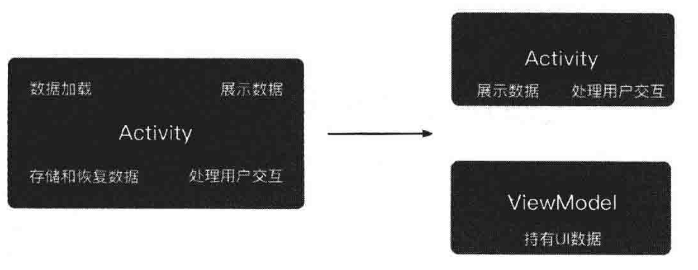
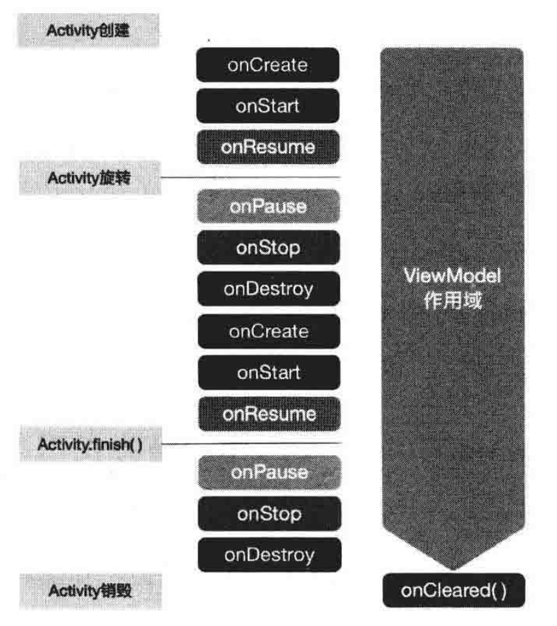

# 第 4 章 ViewModel

### 4.1. 视图与数据模型之间的桥梁 ViewModel

在页面（Activity/Fragment）功能较为简单的情况下，通常会将 UI 交互、与数据获取等相关的业务逻辑全部写在页面中。但是在页面功能复杂的情况下，这样做是不合适的，因为它不符合 “单一功能原则”。页面只应该负责处理用户与 UI 控件的交互，并将数据展示到屏幕上，与数据相关的业务逻辑应该单独处理和存放。

为了更好地将职能划分清楚，Android 提供了 ViewModel 类，专门用于存放应用程序页面所需的数据。如图所示，ViewModel 将页面所需的数据从页面中剥离出来，页面只需要处理用户交互和展示数据。



ViewModel 这个名字可以这样理解：它是介于 View（视图）和 Model（数据模型）之间的一个东西。它起到了桥梁的作用，使视图和数据既能够分离开，也能够保持通信。

### 4.2. ViewModel 的生命周期特性

由于 Android 平台的特殊性，若应用程序支持横竖屏切换，那么当用户旋转手机屏幕时，还需要考虑过数据的存储与恢复。如果数据不进行存储，则通常还需要去重新获取一次数据。

幸运的是，ViewModel 能解决这个问题。ViewModel 独立于配置变化。这意味着，屏幕旋转所导致的 Activity 重建，并不会影响 ViewModel 的生命周期。



### 4.3. ViewModel 的基本使用方法

通过一个具体的案例来学习如何在项目中使用 ViewModel。

1. 在 app 的 build.gradle 中添加依赖。

```groovy
dependencies{
	implementation "androidx.lifecycle:lifecycle-viewmodel: 2.2.0"
}
```

2. 写一个继承自 ViewModel 的类，将其命名为 TimerViewModel。

```java
public class TimerViewModel extends ViewModel {
	@Override
	protected void onCleared (){
		super.onCleared () ;
	}
}
```

ViewModel 是一个抽象类，其中只有一个 onCleared() 方法。当 ViewModel 不再被需要，即与之相关的 Activity 都被销毁时，该方法会被系统调用。可以在该方法中执行一些资源释放的相关操作。注意，由于屏幕旋转而导致的 Activity 重建，并不会调用该方法。

3. ViewModel 最重要的作用是将视图与数据分离，并独立于 Activity 的重建。为了验证这一点，在 ViewModel 中创建一个计时器 Timer，每隔 1s，通过接口 onTimeChangeListener 通知它的调用者。完整的 TimerViewModel 类示例代码如下：

```java
public class TimerViewModel extends ViewModel {
	private Timer timer;
	private int currentSecond;
  
  /**
	 * 开始计时
	 **/
	public void startTiming(){
		if (timer == null) {
			currentSecond = 0;
			timer = new Timer () ;
			TimerTask timerTask = new TimerTask (){
				@Override
				public void run(){
          currentSecond++;
					if (onTimeChangeListener != null) {
							onTimeChangeListener 
            		.onTimeChanged (currentSecond) ;
          }
        }
      };
      timer.schedule(timerTask, 1000, 1000);
    }
  }
  
  /**
  * 通过接又的方式，完成对调用者的通知
  * 实际上这种方式不是很好，更好的方式是通过IiveData组件来实现
  * 但由于我们还末学习LiveData，所以哲时采用这种方式
  **/
  public interface OnTimeChangeListener{
    void onTimeCHanged(int second);
  }
  
  private OnTimeChangeListener onTimeChangeListener;
  
  public void setOnTimeChangeListener(
    OnTimeChangeListener onTimeChangeListener){
    this.onTimeChangeListener = onTimeChangeListener;
  }
  
  /**
  * 清理资源
  **/
  protected void onCleared(){
    super.onCleared();
    timer.cancel();
  }
}
```

4. 在 TimerActivity 中监听 onTimeChangeListener 发来的通知，并据此更新 UI 界面。ViewModel 的实例化过程，是通过 ViewModelProvider 来完成的。ViewModelProvider 会判断 ViewModel 是否存在，若存在则直接返回，否则它会创建一个 ViewModel。

```java
public class TimerActivity extends AppCompatActivity {
	@Override
  protected void onCreate (Bundle savedInstanceState) {
		super. onCreate (savedInstanceState); 
    setContentView (R.layout.activity timer); 
    iniComponent () ;
  }
  
  private void iniComponent () {
		final TextView tvTime = findViewById (R.id.tvTime) ;
    TimerViewModel timerViewModel = 
      new ViewMode1Provider (this).get(TimerViewModel.class) ;
		timerViewModel.setOnTimeChangeListener(
			new TimerViewMode1.OnTimeChangeListener (){
				@Override
				public void onTimeChanged (final int second) {
					// 更新UI界面
					runOnUiThread (new Runnable () {
						@Override
						public void run (){
							tvTime. setText ("TIME:" + second);
          	}
        }); 
      }
    });
    timerViewModel.startTiming ();
  }
}
```

运行程序并旋转屏幕。当旋转屏幕导致 Activity 重建时，计时器并没有停止。这意味着，横/竖屏状态下的 Activity 所对应的 ViewModel 是同一个，它并没有被销毁，它所持有的数据也一直都存在着。

### 4.4. ViewModel 的原理

在页面中通过 ViewModelProvider 类来实例化 ViewModel。

```java
TimerViewModel timerviewModel = new ViewModelProvider(this)
																	.get(TimerViewModel.class);
```

ViewModelProvider 接收一个 ViewModelStoreOwner 对象作为参数。在以上示例代码中该参数是 this，指代当前的 Activity。这是因为 Activity 继承自 FragmentActivity，而在 androidx 依赖包中，FragmentActivity 默认实现了 ViewModelStoreOwner 接口。

```java
public class FragmentActivity extends ComponentActivity implements ViewModelStoreOwner, 
ActivityCompat.OnRequestPermissionsResultCallback,
ActivityCompat.RequestPermissionsRequestCodeValidator{

  ...
  @Override
  public ViewModelStore getVieModelStore() {
    return FragmentActivity.this.get
  }
  
  ...
}

```

接口方法 getViewModelStore() 所定义的返回类型为 ViewModelStore。

```java
public class ViewModelStore {
	private final HashMap<String, ViewModel> mMap = new HashMap<>();
  
  final void put(String key, ViewModel viewModel) {
    ViewModel oldViewModel = mMap.put(key, viewModel);
    if(oldViewModel != null) {
      oldViewModel.onCleared();
    }
  }
  
  final ViewModel get(String key) {
    return mMap.get(key);
  }
  
  Set<String> keys() {
    return new HashSet<>(mMap.keySet());
  }
  
  public final void clear() {
    for (ViewModel vm: mMap.values()) {
      vm.clear();
    }
    mMap.clear();
  }
}
```

从 ViewModelStore 的源码可以看出，ViewModel 实际上是以 HashMap\<String,ViewModel> 的形式被缓存起来了。ViewModel 与页面之间没有直接的关联，它们通过 ViewModelProvider 进行关联。当页面需要 ViewModel 时，会向 ViewModelProvider 索要，ViewModelProvider 检查该 ViewModel 是否已经存在于缓存中，若存在，则直接返回，若不存在，则实例化一个。因此，Activity 由于配置变化导致的销毁重建并不会影响 ViewModel，ViewModel 是独立于页面而存在的。也正因为此，在使用 ViewModel 时，需要特别注意，不要向 ViewModel 中传入任何类型的 Context 或带有 Context 引用的对象，这可能会导致页面无法被销毁，从而引发内存泄漏。

需要注意的是，除了 Activity，androidx 依赖包中的 Fragment 也默认实现了 ViewModelStoreOwner 接口。因此，也可以在 Fragment 中正常使用 ViewModel。

### 4.5. ViewModel 与 AndroidViewModel

在使用 ViewModel 时，不能将任何类型的 Context 或含有 Context 引用的对象传入 ViewModel，因为这可能会导致内存泄漏。但如果希望在 ViewModel 中使用 Context，可以使用 AndroidViewModel 类，它继承自 ViewModel，并接收 Application 作为 Context。这意味着，它的生命周期和 Application 是一样的，那么这就不算是一个内存泄漏了。

### 4.6. ViewModel 与 onSaveInstanceState() 方法

对于页面数据的保存与恢复，onSaveInstanceState() 方法同样可以解决屏幕旋转带来的数据丢失问题，那么是不是没有必要使用 ViewModel 了呢？请注意，onSaveInstanceState() 方法只能保存少量的、能支持序列化的数据，而 ViewModel 没有这个限制。ViewModel 能支持页面中所有的数据。同样需要注意的是， ViewModel 不支持数据的持久化，当页面被彻底销毁时，ViewModel 及其持有的数据就不存在了，但是 onSaveInstanceState() 方法有其他特殊的用途，二者不可混淆。

### 4.7. 总结

ViewModel 可以更好地将页面与数据从代码层面上分离开来。更重要的是，依赖于 ViewModel 的生命周期特性，不再需要关心屏幕旋转带来的数据丢失问题，进而也不需要重新获取数据。

需要注意的是，在使用 ViewModel 的过程中，千万不要讲任何类型的 Context 或带有 Context 引用的对象传入 ViewModel，这可能会引发内存泄漏。如果一定要在 ViewModel 中使用 Context，那么建议使用 Context 的子类 AndroidViewModel。
