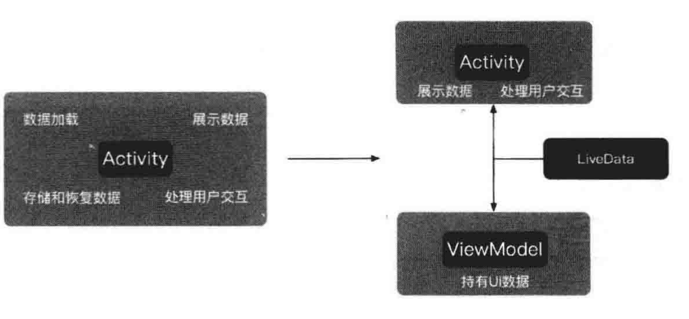
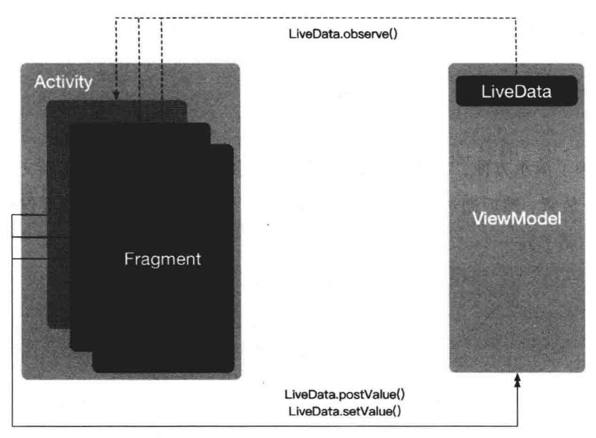

# 第 5 章 LiveData

### 5.1. 实时数据 LiveData

ViewModel 的主要作用是存放页面所需要的各种数据。当数据发生变化时，采用接口的方式实现对页面的通知。通过接口的方式对页面进行通知是可行的，但如果要观察的数据很多，则需要定义大量的接口，代码会显得十分冗余。为此，Jetpack 提供了 LiveData 组件。

LiveData 是一个可被观察的数据容器类。具体说来，可以将 LiveData 理解为一个数据的容器，它将数据包装起来，使数据成为被观察者，当该数据发生变化时，观察者能够获得通知。不需要自己去实现观察者模式，LiveData 内部已经默认实现好了，只要使用就可以了。

LiveData 取代了接口，帮助完成 ViewModel 与页面之间的通信。



### 5.2. LiveData 和 ViewModel 的关系

ViewModel 用于存放页面所需要的各种数据，不仅如此，还可以在其中放一些与数据相关的业务逻辑。例如，可以在 ViewModel 中进行数据的加工、获取等操作。因此，ViewModel 中的数据可能会随着业务的变化而变化。

对页面来说，它并不关心 ViewModel 中的业务逻辑，它只关心需要展示的数据是什么，并且希望在数据发生变化时，能及时得到通知并做出更新。LiveData 的作用就是，在 ViewModel 中的数据发生变化时通知页面。因此，LiveData 通常被放在 ViewModel 中使用，用于包装 ViewModel 中那些需要被外界观察的数据。

### 5.3. LiveData 的基本使用方法

使用 LiveData 对接口进行改写。

1. LiveData 是一个抽象类，不能直接使用。通常使用的是它的直接子类 MutableLiveData。

   ```java
   public class TimerWithLiveDataViewModel extends ViewModel {
   	// 将 currentSecond 这个字段用 MutableLiveData 包装起来
   	private MutableLiveData<Integer> currentSecond;
   	
   	public LiveData<Integer> getCurrentSecond(){
   		if(currentSecond == null){
   			currentSecond = new MutableLiveData<>();
   		}
   		return currentSecond;
   	}
   }
   ```

2. 定义完 LiveData 之后，如何利用它完成页面与 ViewModel 间的通信呢？

   ```java
   public class TimerWithLiveDataActivity extends AppCompatActivity{
   	@Override
   	protected void onCreate(Bundle savedInstanceState){
   		iniComponent();
   	}
   	
   	private void iniComponent(){
   		// 通过 ViewModelProvider 得到 ViewModel
   		TimeWithLiveDataViewModel timerWithLiveDataViewModel = 
   																			new ViewModelProvider(this)
   																			.get(TimeWithLiveDataViewModel.class);
   		
   		// 得到 ViewModel 中的 LiveData
   		final MutableLiveData<Integer> liveData = 
   				(MutableLiveData<Integer>)timerWithLiveDataViewModel
   																		.getCurrentSecond();
   																		
   		// 通过 LiveData.observe() 观察 ViewModel 中数据的变化
   		liveData.observe(this, new Observer<Integer>(){
   			@Override
   			public void onChanged(@Nullable Integer second){
   				// 收到回调后更新 UI 界面
   				((TextView)findViewById(R.id.tvTimer))
   														.setText("TIME:"+second);
   			}
   		});
   		
   		// 重置计时器
   		findViewById(R.id.btnResetTime).setOnClickListener(
   																	new View.OnClickListener(){
   				@Override
   				public void onClick(View v){
   					// 通过 LiveData.setValue() / LiveData.postValue()
   					// 完成对 ViewModel 中数据的更新
   					liveData.setValue(0);
   				}
   		});
   		
   		// 计时开始
   		timerWithLiveDataViewModel.startTiming();
   	}
   }
   ```

   在页面中，通过 LiveData.observe() 方法对 LiveData 所包装的数据进行观察。反过来，当希望修改 LiveData 所包装的数据时，也可以通过 LiveData.setValue() / LiveData.postValue() 方法来完成。postValue() 方法用在非 UI 线程中，若在 UI 线程中，则使用 setValue() 方法。


### 5.4. LiveData 的原理

深入 LiveData.observe() 方法的源码一探究竟。

```java
@MainThread
public void observe(LifecycleOwner owner, Observer<T> observer){
	if(owner.getLifecycle().getCurrentState() == DESTROYED){
		return;
	}
	LifecycleBoundObserver wapper = 
				new LifecycleBoundObserver(owner, observer);
	ObserverWrapper existing = 
				mObservers.putIfAbsent(observer, wapper);
	if(existing != null && !existing.isAttachedTo(owner)){
		throw new IllegalArgumentException(
			"Cannot add the same observer" + " with different lifecycles");
	}
	
	if(existing != null){
		return;
	}
	owner.getLifecycle().addObserver(wrapper);
}
```

从源码可以看出，observe() 方法接收的第 1 个参数是一个 LifecycleOwner 对象，在本例中为 Activity。第二个参数是一个 Observer 对象。方法中的最后一行代码将 Observer 与 Activity 的生命周期关联在一起。因此，LiveData 能够感知页面的生命周期。它可以监测页面当前的状态是否为激活状态，或者页面是否被销毁。只有在页面处于激活状态（Lifecycle.State.ON_STARTED 或 Lifecycle.State.ON_RESUME）时，页面才能收到来自 LiveData 的通知，若页面被销毁（Lifecycle.State.ON_DESTROY），那么 LiveData 会自动清除与页面的关联，从而避免可能引发的内存泄漏问题。

### 5.5. LiveData.observeForever() 方法

LiveData 还提供了一个名为 observeForever() 的方法，使用起来与 observe() 没有太大差别。它们的区别主要在于，当 LiveData 所包装的数据发生变化时，无论页面处于什么状态，observeForever（） 都能收到通知。因此，在用完之后，一定要记得调用 removeObserver() 方法来停止对 LiveData 的观察，否则 LiveData 会一直处于激活状态，Activity 则永远不会被系统自动回收，这就造成了内存泄漏。

### 5.6. ViewModel+LiveData 实现 Fragment 间通信

ViewModel 能够将数据从 Activity 中剥离出来。只要 Activity 不被销毁，ViewModel 会一直存在，并且独立于 Activity 的配置变换。旋转屏幕所导致的 Activity 重建，也不会影响 ViewModel。

Fragment 可以被看作 Activity 的子页面，即一个 Activity 中可以包含多个Fragment。这些 Fragment 彼此独立，但是又都属于同一个 Activity。

基于 ViewModel 和 Fragment 组件的这些特性，可以巧妙地利用 LiveData，实现同一个 Activity 中的不同 Fragment 间的通信。



1. 定义 ViewModel 和 LiveData。使用 LiveData 对 progress 字段进行包装。

   ```
   public class ShareDataViewmodel extends ViewModel{
   	private MutableLiveData<Integer> progress;
   	
   	public MutableiveData<Integer> getProgres(){
   		if (progress == null) {
   			progress = new MutableLiveData<>();
   		}
   		return progress;
   	}
   	
   	@Override
   	protected void onCleared(){
   		super.onCleared();
   		progress = null;
   	}
   }
   ```

2. 为了演示方便，将两个 Fragment 等比例放置在 Activity 的布局文件中，也可以分开放置，然后通过 FragmentManager 进行切换。无论怎样，只要保证这两个 Fragment 属于同一个 Activity 即可。

   ```xml
   <?xml version = "1.0" encoding ="utf-8"?>
   <LinearLayout
   	xmlns:android="https://*******.android.com/apk/res/android"
   	xmlns:tools="https://*******.android.com/tools"
   	android:layout_width="match_parent"
   	android:layout_height="match_parent"
   	android:orientation="vertical"
   	tools:context=".timer.TimerActivity">
   	
   	<fragment
   		android:id="@+id/fragmentOne"
   		android:name="com.michael.viewmodeldemo.sharedata.OneFragment"
   		android:layout_width="match_parent"
   		android:layout_height="0dp"
   		android:layout_weight="1"/>
   		
   	<View
   		android:layout_width="match_parent"
   		android:layout_height="1dp"
   		android:background="@color/colorPrimary" />
   		
   	<fragment
   		android:id="@+id/fragmentTwo"
   		android:name="com.michael.viewmodeldemo.sharedata.TwoFragment"
   		android:layout_width="match_parent"
   		android:layout_height="0dp"
   		android:layout_weight="1"/>
   </LinearLayout>
   ```

3. 编写 Fragment 的布局文件，在其中放置一个 SeekBar 控件。两个 Fragment 的布局文件时类似的。

   ```xml
   <?xml version="1.0" encoding="utf-8"?>
   <RelativeLayout
   		xmlns:android="http://*******.android.com/apk/res/android"
   		android:layout_width="match_parent"
   		android:layout_height="match_parent">
   		
   		<TextView
   				android:layout_width="wrap_content"
           android:layout_height="wrap_content"
           android:layout_centerInParent="true"
           android:layout_above="@+id/seekBar"
           android:text="Fragment_One" />
     
     	<SeekBar
           android:id="@+id/seekBar"
           android:layout_width="match_content"
           android:layout_height="wrap_content"
           android:layout_marginTop="20dp"
   				android:max="100"
           android:layout_centerInParent="true" />
   </RelativeLayout>
   ```

4. 编写 Fragment 的代码，实现具体的通信。以 OneFragment 为例，TwoFragment 中的代码与之类似。

   ```java
   public class OneFragment extends Fragment{
   	@Override
   	public View onCreateView(LayoutInflater inflater,
   								ViewGroup container, Bundle savedInstanceState){
   			View parentView = inflater.inflate(R.layout.fragment_one,
   																							container, false);
   			final SeekBar seekBar = parentView.findViewById(R.id.seekBar);
   			
   			// 注意：这里 ViewModelProvider(getActivity()) 中的参数
   			// 需要的是 Activity，而不是 Fragment，否则将收不到监听
   			ShareDataViewModel shareDataViewModel = 
   									new ViewModelProvider(this.getActivity())
   									.get(ShareDataViewModel.class);
   									
   			final MutableLiveData<Integer> liveData =
   				(MutableLiveData<Integer>)shareDataViewModel.getProgress();
   				
   			// 通过 observe 方法观察 ViewModel 中字段数据的变化，并在变化时得到通知
   			liveData.observe(this, new Observer<Integer>(){
   				@Override
   				public void onChanged(@Nullable Integer progress){
   					seekBar.setProgress(progress);
   				}
   			});
   			
   			seekBar.setOnSeekBarChangeListener(
   																new SeekBar.OnSeekBarChangeListener(){
   					@Override
             public void onProgressChanged(SeekBar seekBar, 
             											int progress, boolean formUser){
             	// 当用户操作 SeekBar 时，更新 ViewModel 中的数据
             	liveData.setValue(progress);
             }
             
             @Override
             public void onStartTrackingTouch(SeekBar seekBar){
             
             }
             
             @Override
             public void onStopTrackingTouch(SeekBar seekBar){
             
             }
   			});
   			return parentView;
   	}
   }
   ```

5. 运行应用程序。无论是滑动 OneFragment 还是 TwoFragment 中的 SeekBar，另一个 Fragment 中的 SeekBar 也会跟着滑动。在滑动 SeekBar 时，通过 LiveData.setValue() 方法，修改了 ViewModel 中 LiveData 包装的数据（progress 字段）。由于 Fragment 通过 LiveData.observe() 方法监听了数据的变化，因此 progress 字段被修改后，Fragment 能够第一时间收到通知并更新 UI。这就是利用 ViewModel 和 LiveData 实现 Fragment 间通信的原理。

   旋转屏幕，SeekBar 的进度与旋转前保持一致，数据并未丢失。这是因为 ViewModel 的生命周期独立于页面由于配置发生变化而导致的销毁与重建。

### 5.7. 总结

ViewModel 用于存放页面的数据，当数据发生变化时，需要通知页面进行更新。在没有 LiveData 之前，可以通过定义接口完成这个需求，有了 LiveData 后，事情变得更加简单、方便。使用 LiveData 对 ViewModel 中关心的数据进行包装，并在页面中对其进行监听，当数据发生变化时，页面就能收到通知，进而更新 UI。

LiveData 的本质是观察者模式，并且它能感知页面的生命周期，只在页面存活时才会进行通知，从而避免了内存泄漏。当然也可以使用 observeForever() 方法让 LiveData 忽略页面的生命周期，但用完后，一定要记得使用 removeObserver() 方法移除监听，否则会造成内存泄漏。

