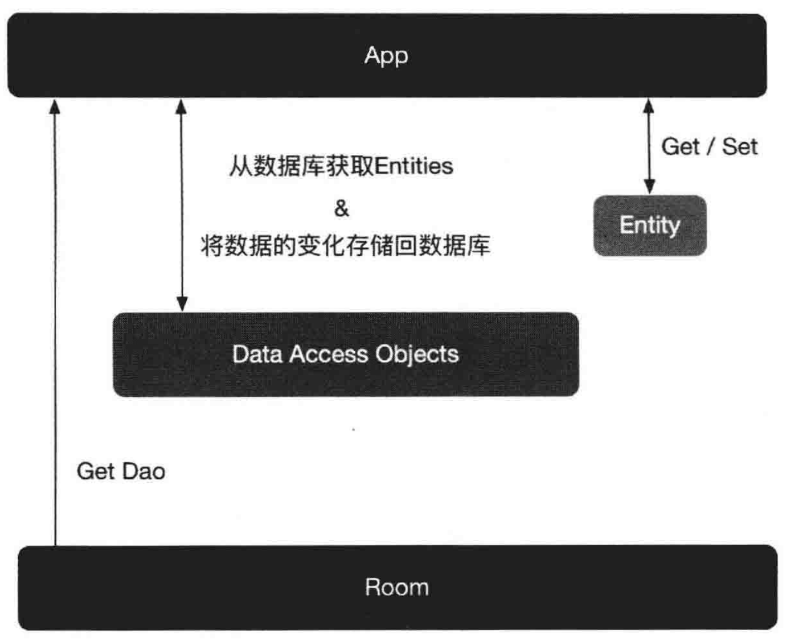
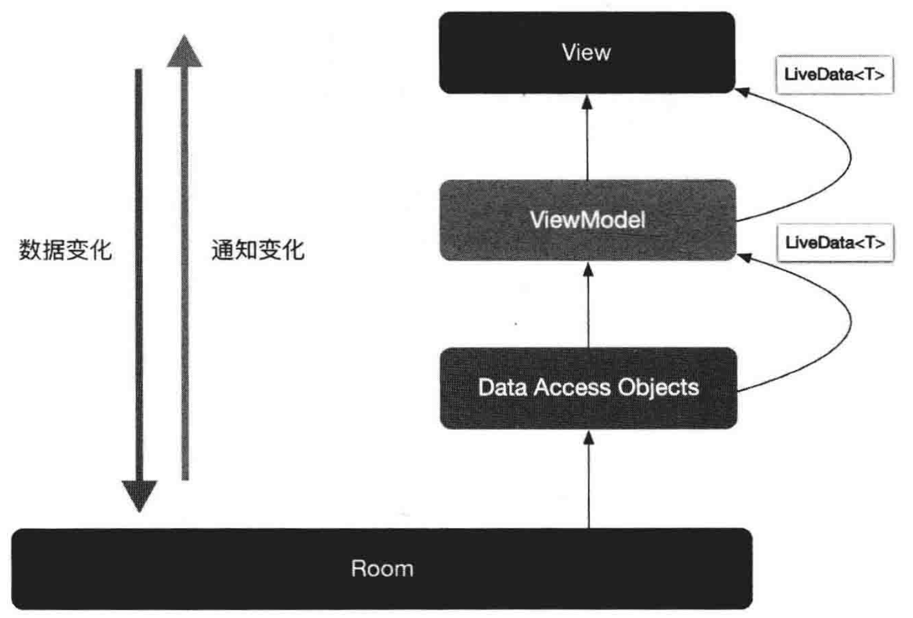

# 第 6 章 Room

### 6.1. Android 官方 ORM 库 Room

Android 采用 Sqlite 作为数据库存储。由于 Sqlite 代码写起来烦琐且容易出错，因此，开源社区逐渐出现了各种 ORM（Object Relational Mapping）库。这些开源 ORM 库都是为了方便 Sqlite 的使用而出现的，包括数据库的创建、升级、增/删/改/查等操作。常见的 ORM 库有 ORMLite、GreenDAO 等。Google 也意识到了推出自家 ORM 库的必要性，于是有了 Room。Room 与其他 ORM 库一样，也是在 Sqlite 上提供了一层封装。

### 6.2. Room 的基本使用方法

#### 6.2.1. Room 的相关概念

Room 的架构图：



* Entity：一个 Entity 对应于数据库中的一张表。Entity 类是 Sqlite 表结构对 Java 类的映射，在 Java 中可以被看作一个 Model 类。
* Dao：即 Data Access Objects，数据访问对象。顾名思义，可以通过它来访问数据。

一个 Entity 代表一张表，而每张表都需要一个 Dao 对象，用于对表进行增/删/改/查。Room 数据库在被实例化之后，就可以通过数据库实例得到 Dao 对象（Get Dao），进而通过 Dao 对象对表中的数据进行操作。

#### 6.2.2. 案例分析

假设要创建一个学生数据库，数据库中有一张学生表，用于保存学生的基本信息。

1. 在 app 的 build.gradle 中添加 Room 的相关依赖。

   ```groovy
   dependencies{
   	implementation "androidx.room:room-runtime:2.2.2"
   	annotationProcessor "androidx.room:room-compoler:2.2.2"
   }
   ```

2. 创建一个关于学生的 Entity，即创建一张学生表。

   新建一个名为 Student 的 Java 类文件，并在类文件的上方添加 @Entity 标签。

   * @Entity 标签用于将 Student 类与 Room 中的数据表对应起来。tableName 属性可以为数据表设置表名，若不设置，则表名与类名相同。
   * @PrimaryKey 标签用于指定该字段作为表的主键。
   * @ColumnInfo 标签可用于设置该字段存储在数据库表中的名字，并指定字段的类型。
   * @Ignore 标签用来告诉 Room 忽略该字段或方法。

   ```java
   @Entity(tablName = "student")
   public class Student{
   	@PrimaryKey(autoGenerate = true)
   	@ColumnInfo(name = "id", typeAffinity = ColumnInfo.INTEGER)
   	public int id;
   	
   	@ColumnInfo(name = "name", typeAffinity = ColumnInfo.TEXT)
   	public String name;
   	
   	@ColumnInfo(name = "age", typeAffinity = ColumnInfo.TEXT)
   	public String age;
   	
   	/**
   	* Room 默认回使用这个构造器操作数据
   	* */
   	public Student(int id, String name, String age){
   		this.id = id;
   		this.name = name;
   		this.age = age;
   	}
   	
   	/**
   	* 由于 Room 只能识别和使用一个构造器，如果希望定义多个构造器
   	* 可以使用 Ignore 标签，让 Room 忽略这个构造器
   	* 不仅如此， @Ignore 标签还可用于字段
   	* Room 不会持久化被 @Ignore 标签标记过的字段的数据
   	* */
   	@Ignore
   	public Student(String name, String age){
   		this.name = name;
   		this.age = age;
   	}
   }
   ```

3. 针对上面这个学生 Entitiy，需要定义一个 Dao 接口文件，以便对 Entity 进行访问。注意，在接口文件的上方，需要加入 @Dao 标签。

   ```java
   @Dao
   public interface StudentDao{
   	@Insert
   	void insertStudent(Student student);
   	
   	@Delete
   	void deleteStudent(Student student);
   	
   	@Update
   	void updateStudent(Student student);
   	
   	@Query("SELECT * FROM student")
   	List<Student> getStudentList();
   	
   	@Query("SELECT * FROM student WHERE id = :id")
   	Student getStudentById(int id);
   }
   ```

4. 定义好 Entity 和 Dao 后，接下来是创建数据库。

   ```java
   @Database(entities={Student.class}, version = 1)
   public abstract class MyDatabase extends RoomDatabase{
   	private static final String DATABASE_NAME = "my_db";
   	
   	private static MyDatabase databaseInstance;
   	
   	public static synchronized MyDatabase getInstance(Context context){
   		if(databaseInstance == null){
   			databaseInstance = Room.databaseBuilder(
   																context.getApplicationContext(),
   																MyDatabase.class,
   																DATABASE_NAME)
   															.build();
   		}
   		return databaseInstance;
   	}
   	public abstract StudentDao studentDao();
   }
   ```

   @Database 标签用于告诉系统这是 Room 数据库对象。entities 属性用于指定该数据库有哪些表，若需要建立多张表，则表名以逗号相隔开。version 属性用于指定数据库版本号，后面数据库的升级正是依据版本号进行判断的。

   数据库类需要继承自 RoomDatabase，并通过

5. 至此，数据库和表的创建工作就完成了。下面来看看如何对数据库进行增/删/改/查。

   由于是采用单例设计模式实例化数据库的，因此，可以通过以下方式得到数据库对象。

   ```java
   MyDatabase myDatabase = MyDatabase.getInstance(this);
   ```

   插入数据。

   ```java
   myDatabase.studentDao().insertStudent(new Student(name, age));
   ```

   更新数据。

   ```java
   myDatabase.studentDao().updateStudent(new Student(name, age));
   ```

   删除数据。

   ```java
   myDatabase.studentDao().updateStudent(new Student(name, age));
   ```

   查询所有学生。

   ```java
   myDatabase.studentDao().getStudentList();
   ```

   查询某个学生。

   ```java
   myDatabase.studentDao().getStudentById(id);
   ```

   这些对数据库的操作方法都是之前在 Dao 文件中已经定义好的。需要注意的是，不能直接在 UI 线程中执行这些操作，所有操作都需要放在工作线程中进行。例如，可以使用 AsyncTask 进行查询操作。

   ```java
   private class QueryStudentTask extends AsyncTask<Void, Void, Void>{
   	public QueryStudentTask(){
   	
   	}
   	
   	@Override
   	protected Void doInBackground(Void... arg0){
   		studentList.clear();
   		studentList.addAll(myDatabase.studentDao().getSTUDENTLIst());
   		return null;
   	}
   	
   	@Override
   	protected void onPostExecute(Void result){
   		super.onPostExecute(result);
   		studentAdapter.notifyDataSetChanged();
   	}
   }
   ```

6. 运行应用程序，数据库的增/删/改/查已全部实现。上面展示的都是最核心的代码。布局文件和对话框等相关的代码都很简单。

   在本例中，仍存在可以优化的地方。由于对数据库的操作需要在工作线程中进行，这意味着，每次当数据库中的数据发生变化时，都需要开启一个工作线程对数据库进行查询。那么，能否在数据发生变化时，自动接收通知呢？答案是肯定的，通过 LiveData 就能实现这一点。

### 6.3. Room 与 LiveData、ViewModel 结合使用

#### 6.3.1. LiveData 和 ViewModel 带来的好处

将演示 Room 如何与 LiveData 及 ViewModel 结合使用。希望当 Room 数据库中的数据发生变化时，能够通过 LiveData 组件通知 View 层，实现数据的自动更新。



LiveData 通常与 ViewModel 一起使用，ViewModel 是用于存放数据的，因此可以将数据库放在 ViewModel 中进行实例化。但数据库的实例化需要用到 Context，而 ViewModel 中最好不要传入 Context，因此，不宜直接使用 ViewModel，而应该用它的子类 AndriodViewModel。AndriodViewModel 构造器含有 Application 参数，Application 作为 Context 的子类，刚好可以用于数据库的实例化。

#### 6.3.2. 案例优化

1. 修改学生表 Dao 文件。当学生表中的数据发生变化时，能够收到实时通知。这里需要使用 LiveData 将 getStudentList() 方法的返回对象 List\<Student> 包装起来。

   ```java
   @Dao
   public interface StudentDao{
   	@Insert
   	void insertStudent(Student student);
   	
   	@Delete
   	void deleteStudent(Student student);
   	
   	@Update
   	void updateStudent(Student student);
   	
   	// 使用 LiveData 将 List<Student> 包装起来
   	@Query("SELECT * FROM student")
   	LiveData<List<Student>> getStudentList();
   	
   	@Query("SELECT * FROM student WHERE id = :id")
   	Student getStudentById(int id);
   }
   ```

2. 创建 StudentViewModel 类。该类继承自 AndroidViewModel，在构造器中实例化数据库，并使用 LiveData 包装 List\<Student>。

   ```java
   public class StudentViewModel extends AndroidViewModel{
   	private MyDatabase myDatabase;
   	priavate LiveData<List<Student>> liveDataStudent;
   	
   	public StudentViewModel(@NonNull Application application){
   		super(application)
   		myDatabase = MyDatabase.getInstance(application);
   		liveDataStudent = myDatabase.studentDao().getStudentList();
   	}
   	
   	public LiveData<List<Student>> getLiveDataStudent(){
   		return liveDataStudent;
   	}
   }
   ```

3. 在 Activity 中实例化 StudentViewModel，并监听 LiveData 的变化。

   ```java
   StudentViewModel studentViewModel = 
   			new ViewModelProvider(this).get(StudentViewModel.class);
   			
   studentViewModel.getLiveDataStudent()
   										.observe(this, new Observer<List<Student>>(){
   			@Override
   			public void onChanged(List<Student> students){
   				studentList.clear();
   				studentList.addAll(students);
   				studentAdapter.notifyDataSetChanged();
   			}
   });
   ```

   运行应用程序，当对数据库进行增加、删除或修改操作时，onChange(List\<Student> students) 方法会被自动调用。只需要在该方法内通知 Adapter 刷新数据即可，其他什么都不用做。与之前的每次修改数据库后，都需要开启一个工作线程手动查询一次数据库相比，LiveData 无疑可以大大减轻工作量。

### 6.4. Room 数据库升级

#### 6.4.1. 使用 Migration 升级数据库

随着业务的变化，数据库可能也需要做一些调整。例如，数据表可能需要增加一个新字段。Andriod 提供了一个名为 Migration 的类，来对 Room 进行升级。

```java
public Migration(int startVersion, int endVersion)
```

Migration 有两个参数，startVersion 和 endVersion。startVersion 表示当前数据库版本（设备上安装的版本），endVersion 表示将要升级到的版本。若设备中的应用程序数据库版本为 1，那么以下 Migration 会将数据库版本从 1 升级到 2。

```java
static final Migration MIGRATION_1_2 = new Migration(1,2){
	@Override
  public void migrate(@NonNull SupportSQLiteDatabase database){
    // 执行与升级相关的操作
  }
};
```

以此类推，若数据库版本需要从 2 升级到 3，则需要写一个这样的 Migration。

```java
private static Migration MIGRATION_2_3 = new Migration(2,3){
	@Override
	public void mograte(@NonNull SupportSQLiteDatabase database){
		// 执行与升级相关的操作
	}
};
```

若用户设备上的应用程序数据库版本为1，而当前要安装的应用程序数据库版本为 3，那么该怎么办呢？在这种情况下，Room 会先判断当前有没有直接从 1 到 3 的升级方案，如果有，就直接执行从 1 到 3 的升级方案；如果没有，那么 Room 会按照顺序先后执行 Migration(1，2)、Migration(2，3) 以完成升级。

在 Migration 中编写完升级方案后，还需要通过 addMigrations() 方法，将升级方案添加到 Room。

```java
Room.databaseBuilder(context.getApplicationContext(), 
																MyDatabase.class, DATABASE_NAME)
		.addMigrations(MIGRATION_1_2, MIGRATION_2_3, MIGRATION_1_3)
		.build();
```

#### 6.4.2. 异常处理

假设将数据库版本升级到 4，却没有为此写相应的 Migration，则会出现一个 IllegalStateException 异常。

```
Caused by: java.lang.IllegalStateException:
A migration from 3 to 4 was required but not found.
Please provide the necessary Migration path via
RoomDatabase.Builder.addMigration (Migration . . . ) or
allow for destructive migrations via one of the RoomDatabase.Builder. fallbackToDestructiveMigration* methods.
at android.room.RoomOpenHelper.onUpgrade (RoomOpenHelper. java: 117)
at androidx.sqlite.b.framework.FrameworkSQLiteOpenHelper $OpenHelper.onUpgrade (FrameworkSQLiteOpenHelper. java: 124)
at android.database. sqlite.sQLiteOpenHelper .getDatabase Locked (SQLiteOpenHelper. j a v a : 400)
at android. database. sqlite. sQLiteOpenHelper .getReadableDatabase (SQLiteOpenHelper. java: 322)
at androidx.sqlite.b.framework.FrameworkSQLiteOpenHelper $OpenHelper.getReadableSupportDatabase
(FrameworkSQLiteOpenHelper.java:103)
at androidx.sglite.db.framework.FrameworkSQLiteopenHelper
•getReadableDatabase (FrameworkSQLiteOpenHelper. java: 58)
```

这是因为 Room 在升级过程中没有匹配到相应的 Migration。为了防止出现升级失败导致应用程序崩溃的情况，可以在创建数据库时加入 fallbackToDestructiveMigration() 方法。该方法能够在出现升级异常时，重新创建数据表。需要注意的是，虽然应用程序不会崩溃，但由于数据表被重新创建，所有的数据也将会丢失。

```java
Room.databaseBuilder(context.getApplicationContext(),
													MyDatabase.class, DATABASE_NAME)
		.fallbackToDestructiveMigration()
		.addMigrations(MIGRATION_1_2, MIGRATION_2_3, MIGRATION_1_3)
		.build();
```

在升级过程中，该如何修改 Room 数据库的版本号呢？直接通过 @Database 标签中的 version 属性进行修改就可以了。

```java
@Database(entites = {Student.class}, version = 1)
```

#### 6.4.3. Schema 文件

在没有 Room 组件之间，若想要验证数据库的修改是否符合预期，需要找到这个数据库文件，接着使用第三方 Sqlite 查看工具，对其进行查看和验证。另外，如果希望查看数据库的历次升级情况，只能通过代码版本控制工具，根据源代码的历次修改情况进行推测。这无疑是耗时耗力的。为此，Room 提供了一项功能，在每次数据库的升级过程中，它都会为你导出一个 Schema 文件，这是一个 json 格式的文件，其中包含了数据库的所有基本信息。有了该文件，开发者便能清楚地知道数据库的历次变更情况，这极大地方便了开发者排查问题。Schema 文件默认是导出的，只需指定它的导出位置即可。

例如，可以在 app 的 build.gradle 文件中指定 Schema 文件的导出位置。

```java
android{
	defaultConfig{
		javaCompileOptions{
			annotationProcessorOptions{
				// 指定数据库 Schema 文件的导出位置
				arguments = ["room.schemaLocation":"$projectDir/ schemas".toString()]
			}
		}
	}
}
```

当数据库生成或修改成功后，便可以在项目的根目录下看见对应的 Schema 文件了。数字代表数据库的版本号。

Room 默认导出 Schema 文件，如果不想导出这些文件，那么可以在数据库标签 @Database 中指定 exportSchema = false。但建议导出这些文件。如果使用版本控制系统（如 Git）来管理代码，那么可以将这些文件一并提交到代码仓库。

```java
@Database(entities = {Student.class}, exportSchema = false, version = 1)
```

#### 6.4.4. 销毁与重建策略

在 Sqlite 中修改表结构比较麻烦。例如，想将 Student 表中的 age 字段类型从 INTEGER 改为 TEXT。

面对此类需求，最好的方式是采用销毁与重建策略，该策略大致分为一下几个步骤：

1. 创建一张符合表结构要求的临时表 temp_Student。
2. 将数据从旧表 Student 复制至临时表 temp_Student。
3. 删除旧表 Student。
4. 将临时表 temp_Student 重命名为 Student。

代码如下所示：

```java
static final Migration MIGRATION_3_4 = new Migration(3, 4){
	@Override
	public void migrate(SupportSQLiteDatabase database){
		database.execSQL("CREATE TABLE temp_Student (" +
			"id INTEGER PRIMARY KEY NOT NULL," +
			"name TEXT," +
			"age TEXT")");
		database.execSQL("INSERT INTO temp_Student (id, name, age)" + 
			"SELECT id, name, age FROM Student");
		database.execSQL("DROP TABLE Student");
		database.execSQL("ALTER TABLE temp_Student RENAME TO Student");
	}
};
```

执行上方代码后，通过查看 Schema 升级文件，可以看到，age 字段的类型已被修改为 TEXT，说明这次的数据库修改升级是成功的。

### 6.5. 预填充数据库

#### 6.5.1. createFromAsset() API 和 createFromFile() API

从 Room 2.2 版本开始，Room 加入了两个新的 API，用于在给定已填充数据库文件的基础上创建 Room 数据库，基于这两个 API，开发者可以基于特定的预打包好的数据库文件来创建 Room 数据库。

例如，假设应用程序需要用一个 Room 数据库，以存储世界各地的城市信息。那么可以在应用程序发布时，将 cities.db 文件放在 assets 目录下，在用户首次打卡应用程序时，将 cities.db 文件放到 assets 目录下，在用户首次打开应用程序时，使用 createFromAsset() 方法，基于 cities.db 文件创建 Room 数据库。如果将数据库文件打包进 assets 目录会增加应用程序的大小，还可以考虑在用户首次打开应用程序时，通过网络连接将数据库文件下载至 SD 卡，接着通过 createFromFile() 方法来创建 Room 数据库。

无论是哪种方法，有了这两个 API，开发者就可以创建一个带有预置数据的 Room 数据库。createFromFile() API 的使用方法与 createFromAsset() 类似，只不过数据库文件不在 assets 目录下，而是需要开发者自己指定它的位置。

#### 6.5.2. createFromAsset() API 的使用方法

1. 首先需要创建一个数据库文件 student.db。创建的方式有很多，这里使用的是 DB Browser for SQLite 软件。可以通过互联网搜索并下载这款开源软件。安装该软件后，单击 "新建数据库"，新建一个名为 students 的数据库。

2. 接着创建数据表 student，其中的字段与 Student 模型类中的字段保持一致。

3. 接着，往数据表中添加数据，模拟数据的预填充。

4. 保存数据库，并将数据库文件放到项目的 assets/databases 目录下。

5. 接下来是需要关注的重点。在创建数据库时，调用 createFromAsset() 方法，基于 assets.database/students.db 文件创建 Room 数据库。

   ```java
   @Database(entities = {Student.class}, exportSchema = false, version = 1)
   public abstract class MyDatabase extends RoomDatabase{
   	private static final String DATABASE_NAME = "my_db";
   	
   	private static MyDatabase databaseInstance;
   	
   	public static synchronized MyDatabase getInstance(Context context){
   		if(databaseInstance == null){
   			databaseInstance = Room.databaseBuilder(context,
   																						MyDatabase.class, DATABASE_NAME)
   								// 从 assets/database 目录下读取 students.db
   								.createFromAsset("databases/students.db")
   								.build();
   		}
   		return databaseInstance;
   	}
   	
   	public abstract StudentDao studentDao();
   }
   ```

   运行应用程序，可以看到， student.db 文件中的数据已经被写入 Room 数据库中了。

### 6.6. 总结

Room 组件可以创建数据库，并对数据库进行增/删/改/查等基本操作。Jetpack 在各个组件设计之初就考虑到了组件搭配使用的问题，LiveData 可以很好地配合 Room，实现数据的更新。

可以使用 Migration 升级 Room 数据库。除此之外，还指出了升级过程中可能会出现的异常。Schema 文件是 Room 组件提供的一个非常实用的特性，它的作用类似于一个针对数据库的 Git 仓库，有了它，便能清楚地知道数据库的历次变更情况。在开发过程中，Schema 文件还可以帮助判断对数据库的修改是否成功。另外，当遇到一些复杂情况时，可以考虑利用这种策略来升级数据库。

Room 的预填充数据特性让应用程序的数据库在创建时就可以白带数据。但需要注意的是，该特性以 Room2.2 版本才开始支 持。因此，在 gradle 文件中需要注意 Room 组件所依赖的版本号。

在数据库和数据表的创建过程中若出现问题，Room 能在编译期间提示你，而不会等到程序运行时才报错。Room 使 Sqlite 的使用变得非常容易。
