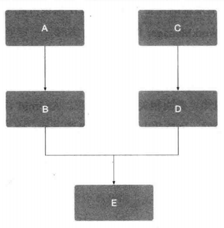

# 第 7 章 WorkManager

### 7.1. WorkManager 的作用

绝大部分应用程序都有在后台执行任务的需求。根据需求的不同，Android 为后台任务提供了多种解决方案，如 JobScheduler、Loader、Service 等。如果这些 API 没有被恰当地使用，则可能会消耗大量的电量。Android 在解决应用程序耗电问题上做了各种尝试，从 Doze 到 App Standby，通过各种方式限制和管理应用程序，以保证应用程序不会在后台过分消耗设备的电量。WorkManager  为应用程序中那些不需要及时完成的任务提供了一个统一的解决方案，以便在设备电量和用户体验之间达到了一个比较好的平衡。

### 7.2. WorkManager 的 3 个重要特点

1. 针对的是不需要及时完成的任务。

   例如，发送应用程序日志、同步应用程序数据、备份用户数据等，站在业务需求的角度，这些任务都不需要立即完成。如果自己来管理这些任务，逻辑应该会非常复杂，若 API 实用不恰当，可能会消耗大量电量。

2. 保证任务一定会被执行。

   WorkManager 能保证任务一定会被执行，即使应用程序当前不在运行中，甚至在设备重启过后，任务仍然会在适当的时刻被执行。这是因为 WorkManager 有自己的数据库，关于任务的所有信息和数据都保存在该数据库中。因此，只要任务交给了 WorkManager，哪怕应用程序彻底退出，或者设备被重新启动，WorkManager 仍然能够保证完成交给它的任务。

3. 兼容范围广。

   WorkManager 最低能兼容 API Level 14，并且不需要设备安装 Google Play Services。因此，不用过于担心兼容性问题，因为 API Level 14 已经能够兼容几乎 100% 的设备。

### 7.3. WorkManager 的兼容方案

WorkManager 能依据设备的情况，选择不同的执行方案。在 API Level 23 以上的设备中，通过 JobScheduler 完成任务；在 API Level 23 以下的设备中，通过 AlarmManager 和 Broadcast Receivers 组合来完成任务。但无论采用哪种方案，任务最终都是交由 Executor 来执行的。

需要注意的是，WorkManager 不是一种新的工作线程，它的出现不是为了替代其他类型的工作线程。工作线程通常立即运行，并在任务执行完成后给用户反馈。而 WorkManager 不是即时的，它不能保证任务能立即得到执行。

### 7.4. WorkManager 的基本使用方法

#### 7.4.1. 添加依赖

在 app 的 build.gradle 中添加 WorkManager 所需要的依赖。

```groovy
dependencies{
	implementation "androidx.work:work-runtime: 2.2.0"
}
```

#### 7.4.2. 使用 Worker 类定义任务

假设要实现将日志上传到服务器的需求。新建一个名为 UploadLogWorker 的类，该类继承自 Worker 类，并且覆盖 doWork() 方法，所有需要在任务中执行的代码都在该方法中进行编写。

```
public class UploadLogWorker extends Worker{
	public UploadLogWorker(Context context, WorkerPrameters Params){
		super(context, Params);
	}
	
	/**
	* 耗时的任务在 doWork() 方法中执行
	**/
	@Override
	public Result doWork(){
		return Result.success();
	}
}
```

doWork() 方法有 3 种类型的返回值。

* 若执行成功，则返回 Result.success()。
* 若执行失败，则返回 Result.failure()。
* 若需要重新执行，则返回 Result.retry()。

#### 7.4.3. 使用 WorkRequest 配置任务

配置任务就是在告诉系统，任务何时运行及如何运行。

1. 设置任务触发条件。

   例如，可以设置当设备处于充电，网络已连接，且电池电量充足的状态下，才触发任务。

   ```java
   Constraints constraints = new Constraints.Builder()
   					.setRequiresCharging(true)
   					.setRequiredNetworkType(NetworkType.CONNECTED)
   					.setRequiresBatteryNotLow(true)
   					.build();
   ```

2. 将任务触发条件设置到 WorkRequest。

   WorkRequest 是一个抽象类，它有两种实现方式 -- OneTimeWorkRequest 和 PeriodicWorkRequest，分别对应的是一次性任务和周期性任务。

   ```java
   OneTimeWorkRequest uploadWorkRequest = 
   		new OneTimeWorkRequest.Builder(UploadLogWorker.class)
   		// 设置触发条件
   		.setConstraints(constraints)
   		.build();
   ```

3. 设置延迟执行任务。

   假设没有设置触发条件，或者所设置的触发条件此刻符合系统的执行要求，此时，系统有可能会立即执行该任务。但如果希望能够延迟任务的执行，那么可以通过 setInitialDelay() 方法，对任务进行延后。

   ```java
   OneTimeWorkRequest uploadWorkRequest = 
   		new OneTimeWorkRequest.Builder(UploadLogWorker.class)
   		// 符合触发条件后，延迟 10s 执行
   		.setInitialDelay(10, TimeUnit.SECONDS)
   		.build();
   ```

4. 设置指数退避策略。

   假如 Worker 线程的执行出现了异常，如服务器宕机。kennel希望过一段时间后，重试该任务。那么可以在 Worker 的 doWork() 方法中返回 Request.retry()，系统会有默认的指数退避策略来帮你重试任务，也可以通过 setBackoffCrieria() 方法来自定义指数退避策略。

   ```java
   OneTimeWorkRequest uploadWorkRequest = 
   		new OneTimeWorkRequest.Builder(UploadLogWorker.class)
   		// 设置指数退避算法
   		.setBackoffCriteria(BackoffPolicy.LINEAR,
   				OneTimeWorkRequest.MIN_BACKOFF_MILLIS,
   				TimeUnit.MILLISECONDS)
   		.build();
   ```

5. 为任务设置 tag 标签。

   设置 tag 标签后，就可以通过该标签跟踪任务的状态：WorkManager.getWorkInfosByTagLiveData(String tag); 也可以取消任务：WorkManager.cancelAllWorkByTag(String tag)。

   ```java
   OneTimeWorkRequest uploadWorkRequest = 
   		new OneTimeWorkRequest.Builder(UploadLogWorker.class)
   		.addTag("UploadTag")
   		.build();
   ```

#### 7.4.4. 将任务提交给系统

将任务配置好之后，需要将其提交给系统，WorkManager.enqueue() 方法用于将配置好的 WorkRequest 交给系统来执行。

```java
WorkManager.getInsyance(this).enqueue(uploadWorkRequest);
```

#### 7.4.5. 观察任务的状态

任务在提交给系统后，可以通过 WorkInfo 获知任务的状态。WorkInfo 包含任务的 id、tag、Worker 对象传递过来的 outputData，以及任务当前的状态。有 3 种方式可以得到 WorkInfo 对象。

* WorkManager.getWorkInfosByTag()。
* WorkManager.getWorkInfosById()。
* WorkManager.getWorkInfosForUniqueWork()。

如果希望实时获知任务的状态，这 3 个方法还有对应的 LiveData 方法。

* WorkManager.getWorkInfosByTagLiveData()。
* WorkManager.getWorkInfosByIdLiveData()。
* WorkManager.getWorkInfosForUniqueWorkLiveData()。

通过 LiveData，便可以在任务状态发生变化时收到通知。

```java
WorkManager.getInstance(this)
	.getWorkInfoByIdLiveData(uploadWorkRequest.getId())
	.observe(MainActivity.this, new Observer<WorkInfo>(){
			@Override
			public void onChanged(WorkInfo workInfo){
				Log.d("onChanged()->", "workInfo:"+workInfo);
			}
	});
```

#### 7.4.6. 取消任务

与观察任务类似，可以根据 id 或 tag 取消某个任务，或者取消所有的任务。

```java
WorkManager.getInstance(MainActivity.this).cancelAllWork();
```

#### 7.4.7. WorkManager 与 Worker 之间的参数传递

WorkManager 通过 setInputData() 方法向 Worker 传递数据。数据的传递通过 Data 对象来完成。需要注意的是，Data 只能用于传递一些小的基本类型的数据，且数据最大不能超过 10KB。

```java
Data inputData = new Data.Builder()
												 .putString("input_data","Hello World!").build();

OneTimeWorkRequest uploadWorkRequest =
				new OneTimeWorkRequest.Builder(UploadLogWorker.class)
										.setInputData(inputData)
										.build();
```

Worker 通过 getInputData() 方法接收数据，并在任务完成后，向 WorkManager 返回数据。

```java
@Override
public Result doWork(){
	// 接收外面传递进来的数据
	String inputData = getInputData().getString("input_data");
	
	// 任务执行完成后返回数据
	Data outputData = new Data.Builder()
													.putString("output_data", "Task Success!").build();
													
	return Result.success(outputData);
}
```

WorkManager 通过 LiveData 得到从 Worker 返回的数据。

```java
WorkManager.getInstance(this)
	.getWorkInfoByIdLiveData(uploadWorkRequest.getId())
	.observe(MainActivity.this, new Observer<WorkInfo>(){
			@Override
			public void onChanged(WorkInfo workInfo){
				if(workInfo != null && 
							workInfo.getState() == WorkInfo.State.SUCCEEDED){
						String outputData = workInfo.getOutputData()
																		.getString("output_data");
				}
			}
	});
```

#### 7.4.8. 周期性任务 PeriodicWorkRequest

WorkRequest 有两种实现方式：OneTimeWorkRequest 和 PeriodicWorkRequest，分别对应的是一次性任务和周期性任务。一次性任务在任务成功执行后，便彻底结束。而周期性任务则会按照设定的时间定期执行。二者使用起来没有太大差别。需要注意的是，周期性任务的间隔时间不能少于 15 分钟。

```java
PeriodicWorkRequest uploadWorkRequest = 
			new PeriodicWorkRequest
					.Builder(UploadLogWorker.class, 15, TimeUnit.MINUTES)
					.setConstraints(constaints)
					.addTag(TAG)
					.build();
```

#### 7.4.9. 任务链

如果有一系列的任务需要按顺序执行，那么可以利用 WorkManager.beginWith().then().then()...enqueue() 的方式构建任务链。例如，在上传数据之前，可能需要先对数据进行压缩。

```java
WorkManager.getInstance(this)
					 .beginWith(compressWorkRequest)
					 .then(uploadWorkRequest)
					 .enqueue();
```

假设除了压缩数据，还需要更新本地数据。压缩数据与更新本地数据二者没有先后顺序的区别，但与上传数据存在先后顺序。

```java
WorkManager.getInstance(this)
					 .beginWith(compressWorkRequest, updateLocalWorkRequest)
					 .then(uploadWorkRequest)
					 .enqueue();
```

假设有更复杂的任务链，那么还可以考虑使用 WorkContinuation.combine() 方法，将任务链组合起来使用。下面的代码，任务的执行顺序为 A、B、C、D、E。

```
WorkContinuation workContinuation1 = WorkManager.getInstance(this)
																								.beginWith(WorkRequestA)
																								.then(WorkRequestB);
WorkContinuation workContinuation2 = WorkManager.getInstance(this)
																								.beginWith(WorkRequestC)
																								.then(WorkRequestD);
List<WorkCOntinuation> taskList = new ArrayList<>();
taskList.add(workContination1);
taskList.add(workContination2);
WorkContinuation.combine(taskList)
								.then(WorkRequestE)
								.enqueue();
```



### 7.5.  总结

开发者经常需要处理后台任务，如果处理后台任务所采用的 API 没有被正确使用，那么很可能会大量消耗设备的电量。为此，Jetpack 为开发者提供了 WorkManager 组件，旨在将一些不需要及时执行的任务交给它来完成。

虽然 WorkManager 宣称，能够保证任务得到执行，但在非 Android 原生系统的真实设备中进行测试时发现，应用程序彻底退出与设备重新启动之后，任务都没有被再次执行。查阅相关资料后，发现这与设备的系统有关。前面也提到了，WorkManager 会根据系统的版本，决定采用 JobScheduler 或 AlarmManager+Broadcast Receivers 来完成任务。问题在于，这些 API 很可能会受到非原生系统的影响。例如，某个非原生系统如果不允许 AlarmManager 被主动唤起，那么 WorkManager 很可能无法在该系统上正常使用。

后来，在带有 Google 原生系统的模拟器中进行测试时发现，无论是彻底退出应用程序，还是重启设备，任务最终都能够被执行。所以，这进一步证明了 WorkManager 在非原生系统的设备中不能正常使用很可能是非原生系统的问题。因此，开发者在使用 WorkManager 作为解决方案时，一定要慎重。

另外，还发现，周期性任务的实际执行时间，与所设定的时间差别较大。从测试的结果来看，并没有太明显的规律。并且在任务执行完成后，WorkInfo 并不会收到 Success 的通知。Android 认为 Success 和 Failure 都属于 “终止类” 的通知。这意味着，若发出此类通知，则表明任务 “彻底终止”，而周期性任务时不会彻底终止的，它会一直执行下去。因此，在使用 LiveData 观察周期性任务时，不会收到 Success 这一类的通知，这也是需要注意的地方。

