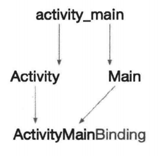

# 第 8 章 DataBinding

### 8.1. DataBinding 的意义和优势

布局文件通常只负责 UI 控件的布局工作。页面通过 setContentView() 方法关联布局文件，再通过 UI 控件的 id 找到控件，接着在页面中通过代码对控件进行操作。可以说，页面承担了绝大部分的工作量，为了减轻页面的工作量，Google 在 2015 年的 I/O 大会上提出了 DataBinding。DataBinding 的出现让布局文件承担了部分原本属于页面的工作，也使页面与布局文件之间的耦合度进一步降低。DataBinding 具有如下优势。

* 项目更简洁，可读性更高。部分与 UI 控件相关的代码可以在布局文件中完成。
* 不再需要 findViewById() 方法。
* 布局文件可以包含简单的业务逻辑。UI 控件能够直接与数据模型中的字段绑定，甚至能响应用户的交互。

DataBinding 和 MVVM 架构是分不来的。实际上，DataBinding 是 Google 为了 Android 能够更好地实现 MVVM 架构而设计的。

### 8.2. DataBinding 的简单绑定

#### 8.2.1. 未采用 DataBinding 的编码方式

假设有这样一个需求，在 Activity 中通过 3 个 TextView 控件，分别展示 Book 对象中的 3 个字段。在没有 DataBinding 之前，通常会这样编写代码。

1. 布局文件。

   ```java
   <?xml version="1.0" encoding="utf-8"?>
   <LinearLayout
   	xmlns:android="http://*******.android.com/apk/res/android"
   	android:layout_width="match_parent"
   	android:layout_height="match_parent"
   	android:gravity="center"
   	android:orientation="vertical">
   	
   	<TextView
   		android:id="@+id/tvTitle"
   		android:layout_width="wrap_content"
   		android:layout_height="wrap_content" />
   		
   	<TextView
   		android:id="@+id/tvAuthor"
   		android:layout_width="wrap_content"
   		android:layout_height="wrap_content" />
   		
   	<TextView
   		android:id="@+id/tvRating"
   		android:layout_width="wrap_content"
   		android:layout_height="wrap_content" />
   </LinearLayout>
   ```

2. Book 对象。

   ```java
   public class Book{
   	public String title;
   	public String author;
   	public int rating;
   	
   	public Book(String title, String author){
   		this.title = title;
   		this.author = author;
   	}
   }
   ```

3. Activity 页面。

   ```java
   public class SimpleTextViewActivity extends Activity{
   	@Override
   	protected void onCreate(Bundle savedInstanceState){
   		super.onCreate(savedInstanceState);
   		setContentView(R.layout.activity_simple_text_view);
   		
   		TextView tvTitle = findViewById(R.id.tvTitle);
   		TextView tvAuthor = findViewById(R.id.tvAuthor);
   		TextView tvRating = findViewById(R.id.tvRating);
   		
   		Book book = new Book("Android", "name");
   		book.rating = 5;
   		
   		tvTitle.setText(book.title);
   		tvAuthor.setText(book.author);
   		tvRating.setText(book.rating);
   	}
   }
   ```

   接下来，使用 DataBinding 来改写该案例。

#### 8.2.2. 采用 DataBinding 完成简单的绑定

1. 在 app 的 build.gradle 中启用数据绑定。

   ```groovy
   android {
   	...
   	dataBinding{
   		enabled = true
   	}
   }
   ```

2. 修改布局文件。

   在布局文件外层加入 \<layout> 标签。可以手动修改布局文件，为其添加 \<layout> 标签，也可以将鼠标移动至布局文件根目录的位置，单击浮现出来的下拉三角形，选中 “Convert to data binding layout” 选项，Android Studio 会自动生成相关代码。

   修改后完整的布局文件代码如下所示。

   ```xml
   <?xml version="1.0" encoding="utf-8"?>
   <layout xmlns:android="http://*******.android.com/apk/res/android">
   	<LinearLayout
   		android:layout_width="match_parent"
   		android:layout_height="match_parent"
   		android:gravity="center"
   		android:orientation="vertical">
   	
   		<TextView
   			android:id="@+id/tvTitle"
   			android:layout_width="wrap_content"
   			android:layout_height="wrap_content" />
   		
   		<TextView
   			android:id="@+id/tvAuthor"
   			android:layout_width="wrap_content"
   			android:layout_height="wrap_content" />
   		
   		<TextView
   			android:id="@+id/tvRating"
   			android:layout_width="wrap_content"
   			android:layout_height="wrap_content" />
   	</LinearLayout>
   </layout>
   ```

   从以上布局文件可以看出，所做的修改仅仅是在 UI 布局最外层加上了一个 \<layout> 标签，并将命名空间 xmlns 从 \<LinearLayout> 移到了 \<layout> 标签中，仅此而已。

   这样做的目的是告诉 DataBinding 库，希望对该布局文件实行绑定。此时，rebuild 该项目，DataBinding 库会自动生成绑定该布局文件所需要的类，即接下来将要用到的 ActivitySImpleTextViewBinding 类。

3. 实例化布局文件。

   在没有 DataBinding 组件时，通常通过 Activity.setContentView() 方法实例化布局文件，接着通过 findViewById() 方法找到布局文件中对应的 UI 控件。有了 DataBinding 组件后，就可以告别 findViewById() 方法了。可以通过 DataBindingUtil.setContentView() 方法实例化布局文件。该方法返回实例化后的布局文件对象，名字与布局文件的名字保持一致，并在后面加上 Binding。

   举例，若布局文件名为 activity_name，则实例化后的布局文件类名为 ActivityMainBinding，如果所示：

   

   在本例中，布局文件名为 activity_simple_text_view.xml，因此，对应的 Binding 类为 ActivitySimpleTextViewBinding，代码如下所示。

   ```java
   ActivitySimpleTextViewBinding activitySimpleTextViewBinding = 
   															DataBindingUtil.setContentView(this,
   																				R.layout.activity_simple_text_view);
   ```

4. 将数据传递到布局文件。

   在绑定布局文件后，需要将数据 “传递” 给布局文件。为什么需要将数据对象传递给布局文件呢？可以这么理解：在 Activity 中实例化的 Book 对象只能被 Activity 持有，所有对 Book 对象的操作及业务逻辑都必须在 Activity 中完成。布局文件与 Book 对象之间没有任何关联。现在，希望减轻 Activity 的工作量，让布局文件也承担部分工作，因此，将 Book 对象传递给布局文件是要做的第一步工作。具体做法如下。

   首先，在布局文件中定义布局变量 \<variable>，布局变量指定对象的类型和名字，名字可以自定义。

   ```xml
   <variable
   	name="book"
   	type="com.michael.databindingdemo.Book"/>
   ```

   布局变量需要定义在 \<data> 标签中。因此，修改后的布局文件结构如下所示。

   ```xml
   <?xml version="1.0" encoding="utf-8"?>
   <layout xmlns:android="http://*******.android.com/apk/res/android">
   
   	<data>
   		<variable
   			name="book"
   			type="com.michael.databindingdemo.Book"/>
   	</data>
   	
   	<LinearLayout>
   	
   		<TextView/>
   		
   		<TextView/>
   		
   		<TextView/>
   		
   	</LinearLayout>
   </layout>
   ```

   接着，便可以在 Activity 中，通过 setVariable() 方法，将 Book 对象传递给布局文件的布局变量了。注意，这里的 BR 类类似于 Android 项目中常见的 R 类，是由 DataBinding 库自动生成的，用于统一存放所有布局变量的 id。

   ```
   activitySimpleTextViewBinding.setVariable(BR.book, book);
   ```

   DataBinding 为了方便使用，为布局变量提供了 Setter 类。因此，也可以直接使用 setBook() 方法，将 Book 对象传递给布局文件中对应的布局变量。DataBinding 本质上可以被看作一个代码生成器，当启动了它，它就能够自动生成绑定所需要的相关代码。

   ```
   activitySimpleTextViewBinding.setBook(book);
   ```

   \<data> 标签用于放置布局文件中各个 UI 控件所需要的所有数据。这些数据类型可以是自定义类型，如示例代码中的 Book 类，也可以是基本类型，如 String。

   ```xml
   <variable name="message" type="String" />
   ```

5. 绑定布局变量与成员变量。

   既然 Book 对象已经被传递到布局文件中了，此时，便可以将 UI 控件与 Book 对象的属性进行绑定。为此，DataBinding 库提供了布局表达式，布局表达式以 @{} 的格式作为属性的值存在，使用起来非常方便。

   ```xml
   <TextView
   	andriod:text="@{book.title}" />
   	
   <TextView
   	android:text="@{book.author}" />
   ```

   绑定后，就不再需要在 Activity 中通过 setText() 方法对 UI 控件进行赋值了，如下所示。

   ```java
   activitySimpleTextViewBinding.tvTitle.setText(book.title);
   activitySimpleTextViewBinding.tvAuthor.setText(book.author);
   ```

6. 在布局文件中引用静态类。

   有时需要在布局文件中引用一些 Java 工具类，帮助处理一些简单的逻辑。例如，需要一个打分工具类，帮助将阿拉伯数字的分数对应为中文。

   ```java
   public class BookRatingUtil{
   	public static String getRatingString(int rating){
   		switch(rating){
   			case 0:
   				return "零星";
   			case 1:
   				return "一星";
   			case 2:
   				return "二星";
   			case 3:
   				return "三星";
   			case 4:
   				return "四星";
   			case 5:
   				return "五星";
   		}
   		return "";
   	}
   }
   ```

   可以在布局文件中通过 \<import> 标签导入静态工具类。

   ```xml
   <data>
   	<import type="com.michael.databindingdemo.BookRatingUtil" />
   </data>
   ```

   接着在 UI 控件中调用静态方法。

   ```xml
   <TextView
   	android:text="@{BookRatingUtil.getRatingString(book.rating)}" />
   ```

7. 最终的布局文件如下所示：

   ```xml
   <?xml version="1.0" encoding="utf-8" ?>
   <layout xmlns:android="http://******.android.com/apk/res/android">
   	<data>
   		<import type="com.michael.databindingdemo.BookRatingUtil" />
   		<variable
   			name="book"
   			type="com.michael.databindingdemo.Book" />
   	</data>
   		
   		<LinearLayout
   			android:layout_width="match_parent"
   			android:layout_height="match_parent"
   			android:gravity="center"
   			android:orientation="vertical">
   		
   			<TextView
   				android:id="@+id/tvTitle"
   				android:layout_height="wrap_content"
   				android:layout_width="wrap_content"
   				android:text="@{book.title}" />
   				
   			<TextView
   				android:id="@+id/tvAuthor"
   				android:layout_height="wrap_content"
   				android:layout_width="wrap_content"
   				android:text="@{book.author}"
   				
   			<TextView
   				android:id="@+id/tvRating"
   				android:layout_height="wrap_content"
   				android:layout_width="wrap_content"
   				android:text="@{BookRatingUtil.getRatingString(book.rating)}" />
   		</LinearLayout>
   </layout>
   ```

   最终的 Activity 文件如下所示：

   ```java
   public class SimpleTextViewActivity extends Activity
   {
   	@Override
   	protected void onCreate(Bundle savedInstanceState){
   		super.onCreate(savedInstanceState);
   		ActivitySimpleTextViewBinding activitySimpleTextViewBinding = DataBingingUtil.setContentView(this, R.layout.activity_simple_text_view);
   		
   		Book book = new Book("Android高性能编程"，“叶坤”);
   		book.rating = 5;
   		activitySimpleTextViewBinding.setBook(book);
   	}
   }
   ```

### 8.3. DataBinding 响应事件

通过 DataBinding，让布局文件分担部分原本属于 Activity 的工作。实际上，布局文件还能过响应用户事件。本节通过 Button 控件，演示 DataBinding 如何响应 onClick 事件。

1. 创建布局文件，并将其转为 DataBinding 布局。

```xml
<?xml version="1.0" encoding="utf-8"?>
<layout xmlns:android="http://******.android.com/apk/res/android">
	<data>
	</data>
	
	<LinearLayout
		android:layout_width="match_parent"
		android:layout_height="match_parent"
		android:gravity="center"
		android:orientation="vertical">
		
		<Button
			android:layout_width="wrap_content"
			android:layout_height="wrap_content"
			android:text="Click me" />
	</LinearLayout>
</layout>
```

2. 编写一个名为 EventHandleListener 的类，用于接收和响应 Button 的 onClick 事件。Button 被单击后，显示一个 Toast。该类可以独立写成一个 Java 文件，也可以写在 Activity 中，作为 Activity 的内部类。

   ```java
   public class EventHandleListener
   {
   	private Context context;
   	
   	public EventHandleListener(Context context){
   		this.context = context;
   	}
   	
   	public void onButtonClicked(View view){
   		Toast.makeText(context, "I am clicked!", Toast.LENGTH_SHORT).show();
   	}
   }
   ```

3. 在布局文件的 \<data> 标签中定义布局变量。

   ```xml
   <data>
   	<variable
   		name="EventHandle"
   		type="com.michael.databindingdemo.EventHandleActivity.EventHandleListener"/>
   </data>
   ```

4. 在 Activity 中通过 DataBindingUtil 将 Activity 与布局文件绑定，接着实例化 EventHandleListener 类，并将其传入布局文件。

   ```java
   @Override
   protected void onCreate(Bundle savedInstanceState){
   	super.onCreate(savedInstanceState);
   	
   	ActivityEventHandleBinding activityEventHandleBinding = DataBindingUtil.setContentView(this, R.layout.activity_event_handle);
   	
   	activityEventHandleBinding.setEventHandler(new EventHandleListener(this));
   }
   ```

5. 通过布局表达式，调用 EventHandleListener 中的方法。

   ```xml
   <Button
   	android:onClick="@{EventHandler.onButtonClicked}" />
   ```

   也可以通过双冒号语法 :: 进行调用。

   ```xml
   <Button
   	android:onClick="@{EventHandle::onButtonClicked}" />
   ```

   运行应用程序。单击 Button，显示一个 Toast，说明事件能够正常响应。

### 8.4. 二级页面的绑定

在编写布局文件的过程中，遇到布局层次机构复杂，或者部分布局在其他布局文件中能够复用的情况时，通常会将这部分布局独立成一个单独的布局文件，然后通过 \<include> 标签进行引用。再次，将 Activity/Fragment 直接对应的布局文件定义为一级页面，将在一级页面中通过 \<include> 标签进行引用的页面，定义为二级页面。

二级页面该如何绑定呢？或者说，数据对象是如何从一级页面传递到二级页面的呢？

**一级页面传递数据**

在布局文件中设置好布局变量 book 之后，便可以接收来自页面的数据，进而将数据与 UI 控件进行绑定了。不仅如此，布局变量 book 同时也是命名空间 xmlns:app 的一个属性。一级页面正是通过命名空间 xmlns:app 引用布局变量 book，将数据对象传递给二级页面的。代码如下所示。

```xml
<?xml version="1.0" encoding="utf-8"?>
<layout xmlns:android="http://******.android.com/apk/res/android"
		xmlns:app="http://******.android.com/apk/res-auto">
		<data>
			<variable
				name="book"
				type="com.michael.databindingdemo.Book" />
		</data>
		
		<LinearLayout
			android:orientation="vertical"
			android:layout_width="match_parent"
			android:layout_height="match_parent">
			
			<include
				layout="@layout/layout_content"
				app:book="@{book}" />
			
		</LinearLayout>
</layout>
```

**二级页面接收数据**

在二级页面 layout_content 中，需要定义一个与一级页面相同的布局变量，用于接收传递过来的数据。在收到 book 对象后，便可以将 book 对象中的字段与 UI 控件进行绑定了。代码如下所示：

```xml
<?xml version="1.0" encoding="utf-8"?>
<layout xmlns:android="http://******.android.com/apk/res/android">

	<data>
		<variable
			name="book"
			type="com.michael.databindingdemo.Book" />
		
	</data>
	
	<LinearLayout
		android:layout_width="match_parent"
		android:layout_height="match_parent"
		android:gravity="center"
		android:orientation="vertical">
		
		<TextView
			android:id="@+id/tvTitle"
			android:layout_width="wrap_content"
			android:layout_height="wrap_content"
			android:text="@{book.author}" />
	
	</LinearLayout>
</layout>
```

### 8.5. BindingAdapter 的原理

在 gradle 中启动 DataBinding 库，它会生成绑定所需要的各种类。这其中包括大量针对 UI 控件的、名为 XXXBindingAdapter 的类。这些类中包含各种静态方法，并且在这些静态方法前都有 @BindingAdapter 标签，标签中的别名对应于 UI 控件在布局文件中的属性。

例如，下面截取了 DataBinding 库为 View 生成的 ViewBindingAdapter 类的部分源码。源码展示了 DataBinding 库针对 android:padding 属性所编写的代码。

```java
public class ViewBindingAdapter {
	...
	@BindingAdapter({"android:padding"})
	public static void setPadding(View view, float paddingFloat) {
		final int padding = pixelsToDimensionPixelSize(paddingFloat);
		view.setPadding(padding,padding,padding,padding);
	}
	...
}
```

再来看 DataBinding 库为 TextView 生成的 TextViewBindingAdapter 类的部分源码。源码展示了 DataBinding 库针对 android:text 属性所编写的代码。

```java
public class TextViewBindingAdapter {
	...
	@BindingAdapter("android:text")
	public static void setText(TextView view, CharSequence text){
		final CharSequence oldText = view.getText();
		if(text == oldText || (text == null && oldText.length() == 0)){
			return;
		}
		if(text instanceof Spanned){
			if(text.equals(oldText)) { return; }
		} else if (!haveContentsChanged(text, oldText)) {
			return;
		}
		view.setText(text);
	}
	...
}
```

DataBinding 库以静态方法的形式为 UI 控件的各个属性绑定了相应的代码。若工程在 UI 控件的属性中使用了布局表达式，那么当布局文件被渲染时，属性所绑定的静态方法会被自动调用。

```java
<TextView
	android:padding="@{myPadding}"
	android:text="@{book.title}" />
```

例如，在以上代码中，当 TextView 控件被渲染时，android:padding 和 android:text 属性会分别自动调用 ViewBindingAdapter.setPadding() 方法和 TextViewBindingAdapter.setText() 方法。可见，UI 控件通过简单的属性设置，便可以在布局文件中调用所绑定的方法。

### 8.6. 自定义 BindAdapter

#### 8.6.1. 自定义 BindAdapter 的基本方法

为了让布局文件能够承担更多的工作，处理更复杂的业务逻辑，DataBinding 库允许自定义 BindingAdapter。在本节，将通过 ImageView 来演示如何自定义 BindingAdapter。

在实际开发工作中，经常会使用 ImageView 加载来自网络的图片，若加载失败，则让它显示一张默认图片。使用 BindingAdapter 来实现这个需求。

1. 准备工作。

   采用 Picasso 库来加载网络图片，在 app 的 build.gradle 文件中添加与 Picasso 库相关的依赖。

   ```groovy
   dependencies{
   	implementation 'com.squareup.picasso:pocasso:2.71828'
   }
   ```

   由于需要访问网络，在 Manifest 文件中加入访问网络的权限。

   ```xml
   <use-permission android:name="android.permission.INTERNET">
   ```

2. 编写处理图片的 BindingAdapter 类。

   在该方法中通过 Picasso 加载网络图片。需要注意的是，BindingAdapter 中的方法均为静态方法。第 1 个参数为调用者本身，即 ImageView；第 2 个参数时布局文件在调用该方法时传递过来的参数。在静态方法前需要加入 @BindingAdaper("") 标签，并为该方法起一个别名，此处为 image，布局文件正是通过别名来调用该方法的。

   ```java
   public class ImageViewBindingAdapter{
   	@BindingAdapter("image")
   	public static void setImage(ImageView imageView, String imageUrl){
   		if(!TextUtils.isEmpty(imageUrl)){
   			Picasso.get()
   				.load(imageUrl)
   				.placeholder(R.drawable.ic_default)
   				.error(R.drawable.ic_error)
   				.into(imageView);
   		} else {
   			imageView.setBackgroundColor(Color.DKGRAY);
   		}
   	}
   }
   ```

3. 在布局文件中调用 BindingAdapter 类。

   首先，需要在布局变量中定义一个 String，用于存放网络图片的地址。

   ```xml
   <data>
   	<variable
   		name="networkImage"
   		type="String" />
   </data>
   ```

   接着，在 ImageView 中通过别名，即在 ImageViewBindingAdapter 文件中定义好的别名 image，来调用静态方法。布局表达式 @{} 中的参数，则是调用方法时传入的参数。

   ```xml
   <ImageView
   	app:image="@{networkImage}" />
   ```

   需要注意的是，请确保布局文件最外层包含以下命名空间，这样才能调用那些使用 @BindAdapter 标签定义的静态方法。

   ```xml
   xmlns:app="http://******.android.com/apk/res-auto"
   ```

4. 在 Activity 中为布局变量赋值。

   ```java
   public class BindingAdapterActivity extends Activity{
   	private ActivityBindingAdapterBinding activityBindingAdapterBinding;
   	
   	@Override
   	protected void onCreate(Bundle savedInstanceState){
   		super.onCreate(savedInstanceState);
   		activityBindingAdapterBinding = DataBindingUtil.setContentView(this,
   				R.layout.activity_binding_adapter);
   				
   		activityBindingAdapterBinding.setNetworkImage("https://****.jpg");
   	}
   }
   ```

   运行程序，可以看到，图片被顺利加载出来。

#### 8.6.2. 方法重载

希望 BindingAdapter 类能够支持显示项目资源文件中的图片。那么，可以通过对这个方法进行重载来实现。

```java
@BindingAdapter("image")
public static void setImage(ImageView imageView, int imageResource){
	imageView.setImageResource(imageResource);
}
```

在布局文件中的调用方式时类似的。

```xml
<?xml version="1.0" encoding="utf-8"?>
<layout xmlns:android="http://******.android.com/apk/res/android">

	<data>
		<variable
			name="localImage"
			type="int" />
		
	</data>
	
	<LinearLayout>
		
		<ImageView
			app:image="@{localImage}"/>
	
	</LinearLayout>
</layout>
```

同样需要在 Activity 中设置布局变量。

```java
public class BindingAdapterActivity extends Activity {
	private ActivityBindingAdapterBinding activityBindingAdapterBinding;
	
	@Override
	protected void onCreate(Bundle savedInstanceState){
		super.onCreate(savedInstanceState);
		activityBindingAdapterBinding = DataBindingUtil.setContentView(this,
				R.layout.activity_binding_adapter);
				
		activityBindingAdapterBinding.setLocalImage(R.mipmap.local_image);
	}
}
```

这样，BindingAdapter 便能够显示项目资源文件中的图片了。

#### 8.6.3. 多参数重载

如果希望将这两个方法合并成一个方法，那么就需要用到多参数重载，将两个参数同时传入方法中。当网络图片地址为空时，则显示 imageResource 参数所指定的图片。

```java
@BindingAdapter(value={"image","defaultImageResource"}, requireAll = false)
public static void setImage(ImageView imageView, String imageUrl, int imageResource){
	if(!TextUtils.isEmpty(imageUrl)){
		Picasso.get()
			.load(imageUrl)
			.placeholder(R.drawable.ic_default)
			.error(R.drawable.ic_error)
			.into(imageView);
	} else {
		imageView.setImageResource(imageResource);
	}
}
```

在 @BindingAdapter 标签中，方法的参数以 value = {"", ""} 的形式存在。变量 requireAll 用于告诉 DataBinding 库这些参数是否都要赋值，默认值为 true，即全部需要赋值。赋值方式如下方代码所示，当 networkImage 为空时，ImageView 会显示 localImage 所指定的图片。

```xml
<ImageView
	app:image="@{networkImage}"
  app:defaultImageResource="@{localImage}"/
```

#### 8.6.4. 可选旧值


### 8.7. 双向绑定

#### 8.7.1. 单向绑定和双向绑定

#### 8.7.2. 实现双向绑定

#### 8.7.3. 使用 ObservableField 优化双向绑定

#### 8.7.4. ObservableField 与 LiveData

### 8.8. RecyclerView 的绑定机制

### 8.9. 总结


