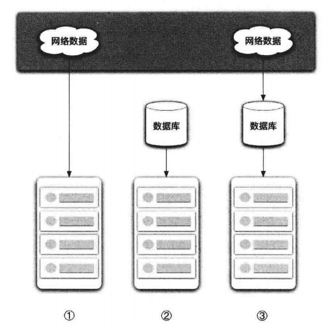
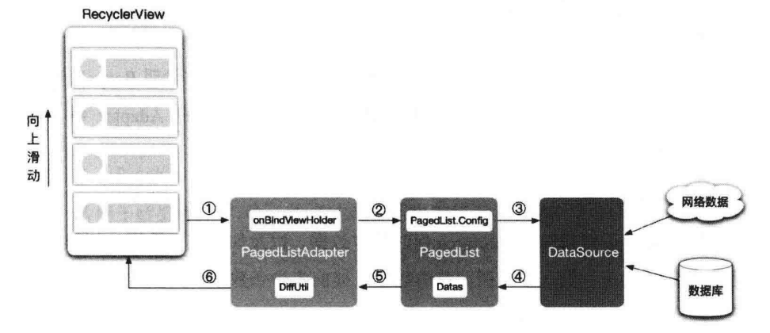
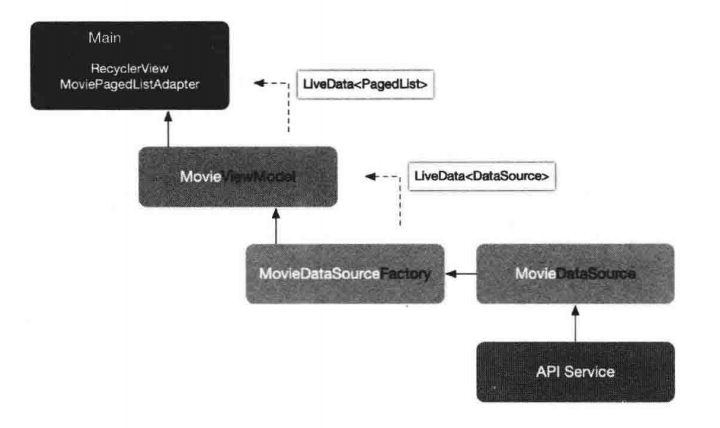
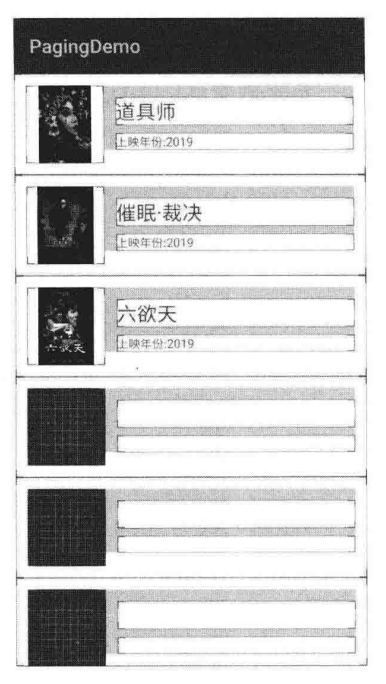
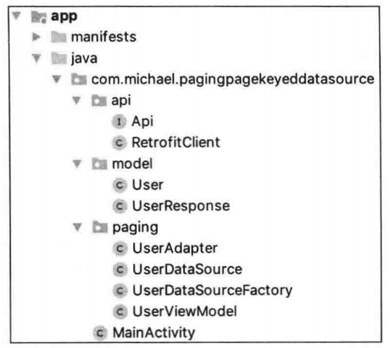
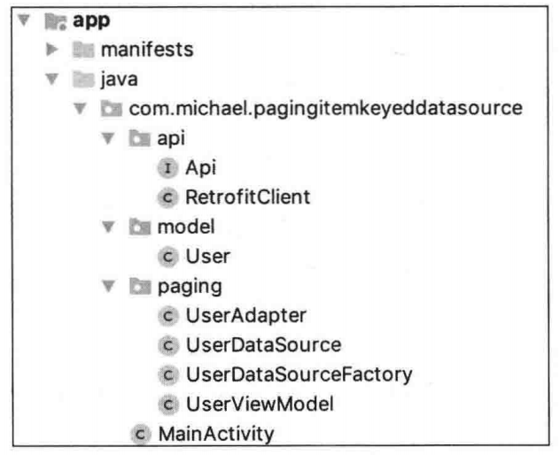
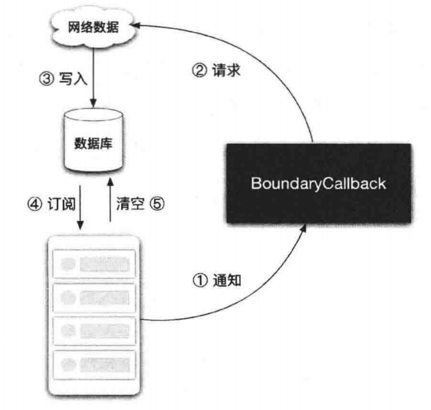
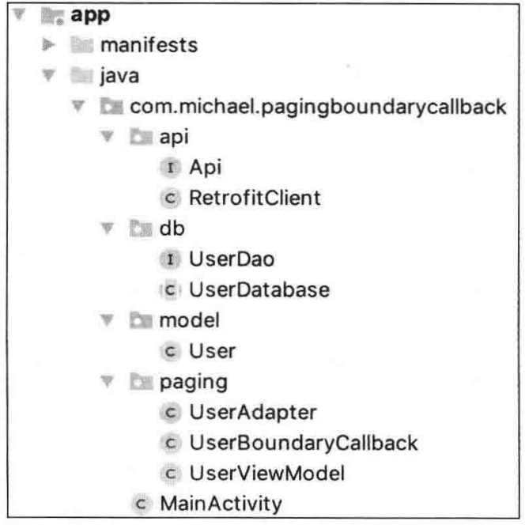

# 第 9 章 Paging

### 9.1. Paging 组件的意义

分页加载是在应用程序开发过程中十分常见的需求。经常需要以列表的形式加载大量的数据，这些数据通常来自网络或本地数据库。若所有数据一次性加载出来，必然需要消耗大量的时间和数据流量，然而用户实际需要的可能只是部分数据。因此，便有了分页加载。分页加载是对数据进行按需加载，在不影响用户体验的同时，还能节省数据流量，提升应用的性能。

Paging 就是 Google 为了方便 Android 开发者完成分页加载而设计的一个组件。它为几种常见的分页机制提供了统一的解决方案，让我们可以把更多的精力专注在业务代码上。

### 9.2. Paging 支持的架构类型

Paging 支持 3 种架构类型：



1. 网络

   对网络数据进行分页加载，是最常见的一种分页需求。不同的公司对分页机制所设计的 API 接口通常也不太一样，但总体而言可以归纳为 3 种。为此，Paging 组件提供了 3 种不同的方案，以应对不同的分页机制。它们分别是 PositionalDataSource、PageKeyedDataSource 和 ItemKeyedDataSource。

2. 数据库

   若掌握了对网络数据进行分页加载的几种方案，那么对数据库进行分页加载也将变得十分容易，无非就是数据源的替换。

3. 网络 + 数据库

   出于用户体验的考虑，通常会对网络数据进行缓存，以便用户下次打开应用程序时，应用程序可以先展示缓存数据。通常会利用数据库对网络数据进行缓存，这也意味着，需要同时处理好网络和数据库这两个数据源。多数据源会让业务逻辑变得更为复杂，所以，通常采用单一数据源作为解决方案。即从网络获取的数据，直接缓存进数据库，列表只从数据库这个唯一的数据源获取数据。

### 9.3. Paging 的工作原理

Paging 的工作原理大致分为 6 个步骤：



1. 在 RecyclerView 的滑动过程中，会触发 PageListAdapter 类中的 onBindViewHolder() 方法。数据与 RecyclerView Item 布局中的 UI 控件正是在该方法中进行绑定的。
2. 当 RecyclerView 滑动到底部时，在 onBindViewHolder() 方法中所调用的 getItem() 方法会通知 PagedList，当前需要载入更多数据。
3. 接着，PagedList 会根据 PageList.Config 中的配置通知 DataSource 执行具体的数据获取工作。
4. DataSource 从网络/本地数据库取得数据后，交给 PagedList，PagedList 将持有这些数据。
5. PagedList 将数据交给 PagedListAdapter 中的 DiffUtil 进行对比和处理。
6. 数据在经过处理后，交由 RecyclerView 进行展示。

### 9.4. Paging 的 3 个核心类

Paging 的工作原理主要涉及 3 个类，需要对它们有一些大致的了解。

* PagedListAdapter。

  RecyclerView 通常需要搭配 Adapter 使用。若你希望 RecyclerView 能结合 Paging 组件使用，那么首先需要让 RecyclerView 的 Adapter 继承自 PagedListAdapter。

* PagedList。

  PagedList 负责通知 DataSource 何时获取数据，以及如何获取数据。例如，何时加载第一页/下一页、第一页加载的数量、提前多少条数据开始执行预加载等。需要注意的是，从 DataSource 获取的数据将存储在 PagedList 中。

* DataSource。

  在 DataSource 中执行具体的数据载入工作。注意，数据的载入需要在工作线程中进行。数据可以来自网络，也可以来自本地数据库，如 Room。根据分页机制的不同，Paging 提供了 3 种 DataSource。

### 9.5. 3 种 DataSource

* PositionalDataSource。

  适用于可通过任意位置加载数据，且目前数据源数量固定的情况。例如，若请求时携带的参数为 start=2&count=5，则表示向服务端请求从第 2 条数据开始往后的 5 条数据。

* PageKeyedDataSource。

  适用于数据源以 "页" 的方式进行请求的情况。例如，若请求时携带的参数为 page=2&pageSize=5，则表示数据源以 5 条数据为一页，当前返回第二页的 5 条数据。

* ItemKeyedDataSource。

  适用于当目标数据的下一页需要依赖于上一页数据中最后一个对象中的某个字段作为 key 的情况。此类分页形式常见于评论功能的实现。例如，若上一个数据中最后一个对象的 key 为 9527，那么在请求下一页时，需要携带参数 since=9527&pageSize=5，则服务器会返回 key=9527 之后的 5 条数据。

### 9.6. PositionalDataSource 的使用方法

假设需求是从豆瓣网获取当前影院正在上映的电影列表。

1. API 接口

   ```
   api.douban.com/v2/movie/in_theaters?apikey=xxxx&start=0&count=8
   ```

   参数 start 表示可以从任意位置开始获取数据；参数 count 表示从 start 位置往后的 count 条数据。

2. 接口返回的数据

   在接口返回的数据中，略去了不需要的数据字段：

   ```json
   {
   	"count":8,
     "start":0,
     "total":70,
     "subjects":
   	{
       {
       	"id":9527,
       	"title":"少年的你",
       	"year":2019,
       	"images":
       	{
   				"small":"http://img.doubanio.com/xxx.jpg"    	
     		}
     	}
     }
   }
   ```

3. 项目架构

   ```
   app
   	- manifests
   	- java
   		- com.michael.paging.positionaldatasource
   		- api
   			- Api
   			- RetrofitClient
   		- model
   			- Movie
   			- Movies
   		- paging
   			- MovieAdapter
   			- MovieDataSource
   			- MovieDataSourceFactory
   			- MovieViewModel
   		- MainActivity
   ```

4. 代码分析

   a. 添加相关依赖

   使用 Retrofit 作为网络请求库，Picasso 作为图片加载库。由于在项目中还要用到 LiveData 和 ViewModel，因此还需要添加 LifeCycle 的依赖，最后是 Paging 和 RecyclerView 的依赖。

   ```groovy
   dependencies
   {
   	implementation 'com.squareup.retrofit2:retrofit:2.6.2'
   	implementation 'com.squareup.retrofit2:converter-gson:2.4.0'
   	implementation 'com.squareup.picasso:picasso:2.71828'
   	implementation 'androidx.lifecycle:lifecycle-extensions:2.2.0'
   	implementation 'androidx.paging:paging-runtime:2.1.0'
   	implementation 'androidx.recyclerview:recyclerview:1.0.0'
   }
   ```

   b. 添加网络权限。

   ```xml
   <uses-permission android:name="android.permission.INTERNET" />
   ```

   c. 构建网络请求框架。

   ```java
   public interface Api{
   	/**
   	* 获取影院当前上映的电影
   	**/
     @GET("movie/in_theaters")
     Call<Movies> getMovies{
       @Query("start") int since,
       @Query("count") int perPage
     };
   }
   ```

   ```java
   public class RetrofirClient
   {
   	private static final String BASE_URL = "https://***.douban.com/v2/";
   	
   	private static final String API_KEY = "***********";
   	
   	private static RetrofitClient retrofitClient;
   	private Retrofit retrofit;
   	
   	private RetrofotClient(){
   		retrofit = new Retrofit.Builder().baseUrl(BASE_URL)
   						.addConverterFactory(GsonConverterFactory.create())
   						.client(getClient())
   						.build();
   	}
   	
   	public static synchronized RetrofitClient getInstance(){
   		if (retrofitClient == null){
   			retrofitClient = new RetrofitClient();
   		}
   		return retrofitClient;
   	}
   	
   	public Api getApi(){
   		return retrofit.create(Api.class);
   	}
   	
   	/**
   	* 为每个请求添加 API_KEY 参数
   	**/
   	private OkHttpClient getClient(){
   		OkHttpClient.Builder httpClient = new OkHttpClient.Builder();
   		httpClient.addInterceptor(new Interceptor(){
   			@Override
   			public Response intercept(Chain chain) throws IOException{
   				Request original = chain.request();
   				HttpUrl originalHttpUrl = original.url();
   				
   				HttpUrl url = originaHttpUrl.newBuilder()
   												.addQueryParameter("apikey", API_KEY)
   												.build();
   				Request.Builder requestBuilder = origin.newBuilder().url(url);
   				Request request = requestBuilder.build();
   				return chain.proceed(request);
   			}
   		});
   		return httpClient.build();
   	}
   }
   ```

   d. 创建 Model 类。当每次请求数据时，服务端返回的数据如下所示。

   ```java
   public class Movies{
   	/**
   	* 当前返回的数量
   	**/
   	public int count;
   	
   	/**
   	* 起始位置
   	**/
   	public int start;
   	
   	/**
   	* 一共多少数据
   	**/
   	public int total;
   
   	/**
   	* 返回的电影列表
   	**/
   	@SerializedName("subjects")
   	public List<Movie> movieList;
   }
   
   public class Movie{
     public String id;
     public String year;
     public String images;
     public class Images{
       public String small;
     }
   }
   ```

   e. 使用 Paging 组件分页请求网络数据。下图展示了 Paging 技术中各个类文件之间的关系。

   

   结合代码对该流程图进行分析。

   MovieDataSource 继承自 PositionalDataSource，通过 API Service 得到网络数据。

   ```java
   public class MovieDataSource extends PositionalDataSource<Movie>{
   	public static final int PER_PAGE = 8;
     
     @Override
     public void loadInitial(final LocalInitialParams params,
                            	final LoadInitialCallback<Movie> callback){
       int startPosition = 0;
       
       RetrofitClient.getInstance()
         .getApi()
         .getMovies(startPosition, PER_PAGE)
         .enqueue(new Callback<Movies>(){
           @Override
           public void onResponse(Call<Movies> call,
                                 	Response<Movies> response){
             if(response.body() != null){
               callback.onResult(response.body().movieList,
                                response.body().start,
                                response.body().total);
             }
           }
           
           @Override
           public void onFailure(Call<Movies> call, Throwable t){
             
           }
         });
     }
     
     @Override
     public void loadRange(final LoadRangeParams params,
                          final LoadRangeCallback<Movie> callback){
      	RetrofitClient.getInstance()
         .getApi()
         .getMovies(params.startPosition, PER_PAGE)
         .enqueue(new Callback<Movies>(){
           @Override
           public void onResponse(Call<Movies> call,
                                 Response<Movies> response){
             if(response.body() != null){
               callback.onResult(response.body().movieList);
             }
           }
           
           @Override
           public void onFailure(Call<Movies> call, Throwable t){
             
           }
         });
     }
   }
   ```

   * loadInitial()

     当页面首次加载数据时会调用 loadInitial() 方法。在该方法内，调用 API 接口，并设置从第 1 条数据开始加载。加载成功后，需要通过 callback.onResult() 方法将数据返回给 PagedList，否则数据不会被展示。

   * totalCount() 与 setEnablePlaceholders()

     在 callback.onResult() 方法中，需要注意的是第 3 个参数 int totalCount。如果在 PagedList.Config 中设置了 setEnablePlaceholders() 方法的值为 true，那么需要通过 totalCount 参数告知 PagedList 当前服务端数据的总数，否则程序会报错。setEnablePlaceholders() 方法的作用是，是否需要为那些 "数量已知，但尚未加载出来的数据" 预留位置。

     例如，通过 loadinitial() 方法首次请求数据，获取了 8 部电影的数据，并获知一共有 70 部新电影在上映。如果设置 setEnablePlaceholders() 方法的值为 true，并且通过 callback.onResult() 方法的 totalCount 参数将总数 70 告诉 PagedList。那么 RecyclerView 一共会为你预留 70 个 Item 的位置。此时，将网络关闭，可以看到，另外 62 个 Item 的效果，如图所示。

     

   * loadRange()

     loadInitial() 方法的作用是负责第一页数据的加载，当第一页数据顺利加载后，接着加载下一页的工作会在 loadRange() 方法内进行。加载成功后，仍然是通过 callback.onResult() 方法将数据返回给 PagedList。

     滑动 RecyclerView 到底部，直到 70 条数据全部加载完毕。查看 LogCat 中的日志，可以看到方法的调用及数据的返回情况。注意，start 参数并不需要手动进行管理，Paging 组件内部已经完成了这些工作。

     MovieDataSourceFactory 负责创建 MovieDataSource，将其暴露给 MovieViewModel。

     ```java
     public class MovieDataSourceFactory extends DataSource.Factory<Integer, Movie> {
     	private MutableLiveData<MovieDataSource> liveDataSource = new MutableLiveData<>();
     	
     	@Override
     	public DataSource<Integer, Movie> create(){
     		MovieDataSource dataSource = new MovieDataSource();
     		liveDataSource.postValue(dataSource);
     		return dataSource;
     	}
     }
     ```

     在 MovieViewModel 中通过 LivePagedListBuilder 创建和配置 PagedList，并使用 LiveData 包装 PagedList，将其暴露给 MainActivity。

     ```java
     public class MovieViewModel extends ViewModel{
     	public LiveData<PagedList<Movie>> moviePagedList;
     	
     	public MovieViewModel(){
     		PagedList.Config config = (new PagedList.Config.Builder())
     				.setEnablePlaceholders(true)
     				.setPageSize(MovieDataSource.PER_PAGE)
     				.setPrefetcgDistance(3)
     				.setInitialLoadSizeHint(MovieDataSource.PER_PAGE * 4)
     				.setMaxSize(65536 * MovieDataSource.PER_PAGE)
     				.build();
     				
     			moviePagedList = (new LivePagedListBuilder<>(
     							new MovieDataSourceFactory(), config)).build();
     	}
     }
     ```

     关于 PagedList.Config 中的几个重要方法说明如下。

     * setEnablePlaceholders：用于设置控件占位。
     * setPageSize：设置每页的大小，该值通常与 DataSource 中请求数据的参数值保持一致。
     * setPrefetchDistance：设置当距离底部还有多少条数据时开始加载下一页数据。
     * setInitialLoadSizeHint：设置首次加载数据的数量。该值要求是 PageSize 的整数倍。若未设置，则默认是 PageSize 的 3 倍。
     * setMaxSize：设置 PagedList 所能承受的最大数量，一般来说是 PageSize 的许多倍，超过该值可能会出现异常。

     列表数据通过 MoviePagedListAdapter 进行展示，代码如下。

     ```java
     public class MoviePagedListAdapter extends 
     				PagedListAdapter<Movie, MoviePagedListAdapter.MovieViewHolder>{
     	private Context context;
       
       public MoviePagedListAdapter(Context context){
       	super(DIFF_CALLBACK);
       	this.context = context;
       }
       
       private static DiffUtil.ItemCallback<Movie> DIFF_CALLBACK = 
       																new DiffUtil.ItemCallback<Movie>(){
       	@Override
         public boolean areItemsTheSame(Movie oldItem, Movie newItem){
         	return oldItem.id.equals(newItem.id);
         }
         
         @Override
         public boolean areContentsTheSame(Movie oldItem, Movie newItem){
         	return oldItem.equeals(newItem);
         }
       };
       
       @Override
       public MovieViewHolder onCreateViewHolder(ViewGroup parent, int viewType){
       	View view = Layoutinflater.from(context)
       									.inflate(R.layout.movie_item, panrent, false);
       	return new MovieViewHolder(view);
       }
       
       @Override
       public void onBindViewHolder(MovieViewHolder holder, int position){
       	Movie movie = getItem(position);
       	if(movie != null){
       		Picasso.get()
       				.load(movie.images.small)
       				.placeholder(R.drawable.ic_default)
       				.error(R.drawable.ic_error)
       				.into(holder.ivImage);
       				
       		holder.tvTitle.setText(movie.title);
       		holder.tvYear.setText("上映年份："+movie.year);
       	} else {
       		holder.ivImage.setImageResource(R.drawable.ic_default);
       		holder.tvTitle.setText("");
       		holder.tvYear.setText("");
       	}
       }
       
       class MovieViewHolder extends RecyclerView.ViewHolder{
       	ImageView ivImage;
       	TextView tvTitle;
       	TextView tvYear;
       	
       	public MovieViewHolder(View itemView){
       		ivImage = itemView.findViewById(R.id.ivImage);
       		tvTitle = itemView.findViewById(R.id.tvTitle);
       		tvYear = itemView.findViewById(R.id.tvYear);
       	}
       }
     }
     ```

     MoviePagedListAdapter 需要继承自 PagedListAdapter。在 onBindViewHolder() 方法中调用 getItem() 方法。若当前有数据，则直接将数据与 UI 控件进行绑定；若没有数据，则 getItem() 会通知 PagedList 去获取下一页的数据，PagedList 收到通知后，让 DataSource 执行具体的数据获取工作。

     **关于 DiffUtil 工具的介绍**

     DiffUtil 工具用于计算两个数据列表之间的差异。在此之前，当更新数据时，需要通过 notifyDataSetChanged() 方法对整个数据源进行刷新，这样的做法效率不高，并且，若想在列表数据的增/删过程中加入共话效果是比较困难的。而如果使用 DiffUtil，它只会更新需要更新的数据，而不需要刷新整个数据源，DiffUtil 也可以轻松地为列表加入动画效果。

     DiffUtil 的使用主要涉及两个方法，需要覆盖这两个方法。正是这两个方法，让更新数据变得更高效。

     * areItemsTheSame：当 DiffUtil 想要检测两个对象是否代表同一个 Item 时，调用该方法进行判断。
     * areContentsTheSame：当 DiffUtil 想要检测两个 Item 是否存在不一样的数据时，调用该方法进行判断。

     MainActivity 所做的事情很少，在其中，将 RecyclerView 与 PagedListAdapter 进行绑定。当数据发生变化时，该变化通过 LiveData 传递过来，再通过 PagedListAdapter.submitList() 方法刷新数据。

     ```java
     public class MainActivity extends AppCompatActivity{
     	@Override
     	protected void onCreate(Bundle savedInstanceState){
     		super.onCreate(savedInstanceState);
     		setContentView(R.layout.activity_main);
     		
     		RecyclerView recyclerView = findViewById(R.id.recyclerView);
     		recyclerView.setLayoutManager(new LinearLayoutManager(this));
     		recyclerView.setHasFixedSize(true);
     		
     		final MoviePagedListAdapter moviePagedListAdapter = 
     			new MoviePagedListAdapter(this);
     		MovieViewModel movieViewModel = 
     			new ViewModelProvider(this).get(MovieViewModel.class);
     		movieViewModel.moviePagedList.observe(this, 
     										new Observer<PagedList<Movie>>(){
     			@Override
     			public void onChanged(PagedList<Movie> movies){
     				moviePagedListAdapter.submitList(movies);
     			}
     		});
     		recyclerView.setAdapter(moviePagedListAdapter);
     	}
     }
     ```

### 9.7. PageKeyedDataSource 的使用方法

本节演示 PageKeyedDataSource 的使用方法。假设需求是从 StackOverflow 网站上加载用户列表。

1. API 接口

   ```
   api.stackexchange.com/2.2/users?page=1&pagesize=6&site=stackoverflow
   ```

   参数 page 表示从第一页开始获取数据。参数 pagesize 表示每页 6 条数据。site 参数表示数据来源是 StackOverflow 网站，该参数是 API 接口必须要携带的，对于分页并没有意义。

2. 接口返回的数据

   接口返回的数据中，略去了不需要的数据字段，如图所示：

   ```json
   {
   	"items":
   	[
   		{
   			"account_id":"9527",
   			"profile_image":"https://xxxx.jpg",
   			"display_name":"MichaelYe"
   		}
   		{
   			...
   		}
   		...
   	],
   	"has_more": true
   }
   ```

3. 项目架构

   项目结构与 PositionalDataSource 的使用方法中的示例大致一样。

   

4. 代码分析

   Gradle 文件中所需的依赖与 9.6 节 PositionalDataSource 的使用方法中所需的一致，并且也需要在 Manifest 文件中添加网络权限。

   a. 构建网络请求框架。

   ```java
   public interface Api{
   	@GET("users")
   	Call<UserResponse> getUsers
   	(
   		@Query("page") int page,
   		@Query("pagesize") int pageSize,
   		@Query("site") String site
   	);
   }
   ```

   ```java
   public class RetrofitClient{
   	private static final String BASE_URL = 
   													"https://***.stackexchange.com/2.2/";
   	private static RetrofitClient retrofitClient;
   	private Retrofit retrofit;
   	
   	private RetrofitClient(){
   		retrofit = new Retrofit.Builder().baseUrl(BASE_URL)
   				.addConverterFactory(GsonConverterFactory.create())
   				.build();
   	}
   	
   	public static synchronized RetrofitClient getInstance(){
   		if(retrofitClient == null){
   				retrofitClient = new RetrofitClient();
   		}
   		return retrofitClient;
   	}
   	
   	public Api getApi(){
   		return retrofit.create(Api.class);
   	}
   }
   ```

   b. Model 类

   ```java
   public class UserResponse{
   	@SerializedName("items")
   	public List<User> users;
   	
   	@SerializedName("has_more")
   	public boolean hasMore;
   }
   ```

   ```java
   public class User{
   	@SerializedName("account_id")
   	public int id;
   	
   	@SerilizedName("display_name")
   	public String name;
   	
   	@SerilizedName("profile_image")
   	public String avatar;
   	
   	public User(int id, String name,String avatar){
   		this.id = id;
   		this.name = name;
   		this.avater = avater;
   	}
   }
   ```

   c. DataSource 类。

   ```java
   public class UserDataSource extends PageKeyedDataSource<Integer, User>{
   	public static final int FIRST_PAGE = 1;
   	public static final int PER_PAGE = 8;
   	public static final String SITE = "stackoverflow";
   	
   	@Override
   	public void loadInitial(LoadInitialParams<Integer> params,
   						final LoadInitialCallback<Integer, User> callback){
   		RetrofitClient.getInstance()
   				.getApi()
   				.getUsers(FIRST_PAGE, PER_PAGE, SITE)
   				.enqueue(new Callback<UserResponse>(){
   						@Override
   						public void onResponse(Call<UserResponse> call,
   														Response<UserResponse> response){
   							if(response.body() != null){
   								callback.onResult(response.body().users,
   																	null, FIRST_PAGE+1);
   							}	
   						}
   						
   						@Override
   						public void onFailure(Call<UserResponse> call, Throwable t){
   						
   						}
   				});
   	}
   	
   	@Override
   	public void loadAfter(final LoadParams<Integer> params,
   								final LoadCallback<Integer, User> callback){
   		RetrofitClient.getInstance()
   				.getApi()
   				.getUsers(params.key, PER_PAGE, SITE)
   				.enqueue(new Callback<UserResponse>(){
   					@Override
   					public void onResponse(Call<UserResponse> call,
   												Response<UserResponse> response){
   						if(response.body() != null){
   							Integer nextKey = response.body()
   												.hasMore ? params.key + 1 : null;
   							callback.onResult(response.body().users, nextKey);
   						}		
   					}
   					
   					@Override
   						public void onFailure(Call<UserResponse> call, Throwable t){
   						
   						}
   				});
   	}
   	
   	@Override
   	public void loadBefore(final LoadParams<Integer> params,
   								final LocalCallback<Integer, User> callback){
   			// 暂时用不到，什么都不用做							
   	}
   }
   ```

   该类继承自 PageKeyedDataSource。主要有两个方法需要实现，loadInitial() 与 loadAfter()。

   * loadInitial()。

     当页面首次加载数据时会调用 loadInitial() 方法。在该方法内调用 API 接口，加载第一页的数据。加载成功后，通过 callback.onResult() 方法将数据返回给 PagedList。在此，需要注意 onResult() 方法中的几个参数。

     ```java
     onResult(List<Value> data, Key previousPageKey, Key nextPageKey);
     ```

     第 1 个参数是加载得到的数据，将其交给 PagedList。第 2 个参数是上一页的 key。在此，由于当前加载的是第一页，不存在上一页，所以设置为 null。第 3 个参数为下一页的 key，即当前页的 key 的值加上 1，若不存在下一页，则设置为 null。

   * loadAfter()。

     加载下一页的工作在该方法内进行。需要注意的是 LoadParams\<Integer> params 参数，在 loadInitial() 方法中设置的 nextPageKey，正是通过 LoadParams 传递过来的。LoadParams.key 得到的是下一页的 key，通过这个 key，可以请求下一页。请求下一页成功后，同样也是通过 callback.onResult() 方法将数据返回给 PagedList，同时再设置下一页的 key。注意：在设置下一页之前，需要判断是否还有更多的数据，若没有数据，则将下一页的 key 设置为 null，表示所有数据请求完毕。

   剩下的几个类 - UserAdapter、UserDataSourceFactory、UserViewModel 和 MainActivity 与上一节中的用法基本一致。

### 9.8. ItemKeyedDataSource 的使用方法

本节演示 ItemKeyedDataSource 的使用方法。假设需求是从 GtiHub 网站加载用户列表。

1. API 接口

   ```
   api.github.com/users?since=0&per_page=6
   ```

   需要注意的是，接口中的 since 参数并不是 "Position" 的意思，它不表示数据对象在数据源中的位置，它表示数据对象 Item 中的某个字段，以该字段作为请求下一页的 key。参数 per_page 表示 since 所指代的对象之后的 6 条数据。

2. 接口返回的数据

   在接口返回的数据中，略去了不需要的数据字段。

   ```java
   [
   		{
   			"id":9527,
   			"login":"MichaelYe",
   			"avatar_url":"http://avatars.xxx.jpg"
   		}
   		{
   			...
   		}
   		...
   ]
   ```

3. 项目架构

   项目结构与前两节大致一样。

   

4. 代码分析

   Gradle 文件中所需的依赖与 PositionalDataSource 的使用方法中所需的一致，并且也需要在 Manifest 文件中添加网络权限。

   a. 构建网络请求框架。

   ```
   public interface Api{
   	@GET("users")
   	Call<List<User>> getUsers
   	(
   		@Query("since") int since,
   		@Query("per_page") int perPage
   	);
   }
   ```

   ```java
   public class RetrofitClient{
   	private static final String BASE_URL = "https://***.github.com/";
   	private static RetrofitClient retrofitClient;
   	private Retrofit retrofit;
   	
   	private RetrofitClient(){
   		retrofit = new Retrofit.Builder().baseUrl(BASE_URL)
   											.addConverterFactory(GsonConverterFactory.create())
   											.build();
   	}
   	
   	public static synchronized RetrofitClient getInstance(){
   		if(retrofitClient == null){
   			retrofitClient = new RetrofitClient();
   		}
   		return retrofitClient;
   	}
   	
   	public Api getApi(){
   		return retrofit.create(Api.class);
   	}
   }
   ```

   b. Model 类。

   ```java
   public class User{
   	public int id;
   	
   	@SerializedName("login")
   	public String name;
   	
   	@SerializedName("avatar_url")
   	public String avatar;
   }
   ```

   c. DataSource 类。

   ```java
   public class UserDataSource extends ItemKeyedDataSource<Integer, User>{
   	public static final int PER_PAGE = 12;
   	
   	@Override
   	public void loadInitial(LoadInitialParams<Integer> params,
   								final LoadInitialCallback<User> callback){
   			int since = 0;
   			RetrofitClient.getInstance()
   					.getApi()
   					.getUsers(since, PER_PAGE)
   					.enqueue(new Callback<List<User>>(){
   						@Override
   						public void onResponse(Call<List<User>> call, 
   														Response<List<User>> response){
   							if(response.body() != null){
   								callback.onResult(response.body());
   							}
   						}
   						
   						@Override
   						public void onFailure(Call<List<User>> call, Throwable t){
   						
   						}
   					});
   	}
   	
   	@Override
   	public void loadAfter(LoadParams<Integer> params,
   								final LoadCallback<User> callback){
   		RetrofitClient.getInstance()
   						.getApi()
   						.getUsers(params.key, PER_PAGE)
   						.enqueue(new Callback<List<User>>(){
   							@Override
   							public void onResponse(Call<List<User>> call,
   														Response<List<User>> response){
   								if(response.body() != null){
   									callback.onResult(response.body());
   								}
   							}
   							
   							@Override
   							public void onFailure(Call<List<User>> call, Throwable t){
   							
   							}
   						});
   	}
     
     @Override
     public Integer getKey(User user){
       return user.id;
     }
     
     @Override
     public void loadBefore(LoadParams<Integer> params, LoadCallback<User> callback){
       // 暂时用不到，什么都不用做
     }
     
   }
   ```

   该类继承自 ItemKeyedDataSource。主要有 3 个方法需要实现：loadInitial()、loadAfter() 和 getKey()。

   * loadInitial()

     当页面首次加载数据时会调用 loadInitial() 方法。在该方法内调用 API 接口，请求 key 从 0 开始的第一页数据。

   * loadAfter()

     加载下一页的工作在该方法内进行，下一页的 key 通过 LoadParams 参数获得。

   * getKey()

     不同于 PagedKeyedDataSource，不需要在 loadInitial() 和 loadAfter() 方法中设置 page 参数。由于以 Item 对象的 key 作为请求下一页的 key，因此，需要通过该方法将 key 告诉 Paging 组件。此处 Item 对象的 key 是 User 对象的 id 字段，只需要将 id 作为 key，通过 getKey() 方法返回即可。

     剩下的几个类 -- UserAdapter、UserDataSourceFactory、UserViewModel 和 MainActivity 与前面的基本一致。

### 9.9. BoundaryCallback 的使用方法

#### 9.9.1. BoundaryCallback 的意义

在实际开发过程中，为了更好的用户体验，通常还需要对数据进行缓存。加入缓存之后，数据的来源从原来单一的网络数据源，变成了网络数据和本地数据组成的双数据源。多数据源会较大程度地增加应用程序的复杂度，需要处理好数据的时效性及新旧数据的切换更新等问题。为此，Google 在 Paging 中加入了 BoundaryCallback。通过 BoundaryCallback 实现数据的单一来源架构，以简化应用的复杂度。

#### 9.9.2. BoundaryCallback 的使用流程分析

BoundaryCallback 的使用流程如图：



1. 首先需要记住的是，数据库是页面的唯一数据来源。页面订阅了数据库的变化，当数据库中的数据发生变化时，会直接反映到页面上。若数据库中没有数据，会通知 BoundaryCallback 中的 onZeroItemsLoaded() 方法；若数据库中有数据，则当用户滑动到 RecyclerView 底部，且数据库中的数据已经全部加载完毕时，会通知 BoundaryCallback 中的 onItemAtEndLoad() 方法。
2. 当 BoundaryCallback 中的回调方法被调用时，需要在该方法内开启工作线程，请求网络数据。
3. 当网络数据成功加载回来，并不直接展示这些数据，而是将其写入数据库。
4. 由于已经设置好了页面对数据库的订阅，当数据库有新数据写入时，会自动更新到页面。
5. 当需要刷新数据时，可以通过页面的下拉刷新功能，在下拉过程中清空数据库。当数据库被清空时，由于数据库发生了变化，进而再次触发第 1 步，通知 BoundaryCallback 重新获取数据，因此形成了一个闭环。

#### 9.9.3. 项目演示

1. 项目结构

   项目架构如图。其中，Api、RetrofitClient 和 UserAdapter 类都没有变化。

   

2. 代码分析

   a. 加入 Room 数据库。

   在 app 的 build.gradle 中添加 Room 的依赖。

   ```groovy
   dependencies{
   	implementation "androidx.room:room-runtime:2.2.2"
   	annotationProcessor "androidx.room:room-compiler:2.2.2"
   }
   ```

   b. 创建 Room 数据库。

   ```java
   @Database(entities = {User.class}, version = 1, exportSchema = false)
   public abstract class UserDatabase extends RoomDatabase{
   	private static final String DATABASE_NAME = "user_db";
   	
   	private static UserDatabase databaseInstance;
   	
   	public static synchronized UserDatabase getInstance(Context context){
   		if(databaseInstance == null){
   			databaseInstance = Room.databaseBuilder(
   				context.getApplicationContext(),
   				UserDatabase.class,
   				DATABASE_NAME)
   				.build();
   		}
   		return databaseInstance;
   	}
   	
   	public abstract UserDao userDao();
   }
   ```

   c. 数据库 Model 类。

   ```kotlin
   @Entity(tableName = "user")
   public class User{
   	@PrimaryKey()
   	@ColumnInfo(name="id", typeAffinity=ColumnInfo.INTEGER)
   	public int id;
   	
   	@ColumnInfo(name="name",typeAffinity=Columninfo.TEXT)
   	@SerializedName("login")
   	public String name;
   	
   	@ColumnInfo(name="avatar", typeAffinity = ColumnInfo.TEXT)
   	@SerializedName("avatar_url")
   	public String avatar;
   	
   	public User(int id, String name,String avatar){
   		this.id = id;
   		this.name = name;
   		this.avatar = avatar;
   	}
   }
   ```

   d. 针对 Model 类实现对应的 Dao 文件，以方便对 Model 数据进行增/删/改/查。需要注意的是，getUserList() 方法返回的是一个 DataSource.Factory，前面提到过的页面对数据库的订阅便是通过这里实现的。

   ```java
   @Dao
   public interface UserDao{
   	@Insert
   	void insertUsers(List<User> users);
   	
   	@Query("DELETE FROM user")
   	void clear();
   	
   	@Query("SELECT * FROM user")
   	DataSource.Factory<Integer, User> getUserList();
   }
   ```

   e. 实现 BoundaryCallback。

   ```java
   public class UserBoundaryCallback extends PageList.BoundaryCallback<User>{
   	private String TAG = this.getClass().getName();
   	private Application application;
   	
   	public UserBoundaryCallback(Application application){
   		this.application = application;
   	}
   	
   	@Override
   	public void onZeroItemsLoaded(){
   		super.onZeroItemsLoaded();
   		getTopData();
   	}
   	
   	@Override
   	publi void onItemAtFrontLoaded(User itemAtFront){
   		super.onItemAtFrontLoaded(itemAtFront);
   		// 该方法暂时用不到，什么都不用做
   	}
   	
   	@Override
   	public void onItemAtEndLoaded(User itemAtEnd){
   		super.onItemAtEndLoaded(itemAtEnd);
   		getTopAfterData(itemAtEnd);
   	}
   	
   	/**
   	* 加载第一页数据
   	*/
   	private void getTopData(){
   		int since = 0;
   		RetrofitClient.getInstance()
   			.getApi()
   			.getUsers(since, UserViewModel.PER_PAGE)
   			.enqueue(new Callback<List<User>>(){
   				@Override
   				public void onResponse(Call<List<User>> call,
   											Response<List<User>> response){
   					if(response.body() != null){
   						insertUsers(response.body());
   					}					
   				}
   				
   				@Override
   				public void onFailure(Call<List<User>> call, Throwable t){}
   			});
   	}
   	
   	/**
   	* 加载下一页数据
   	*/
   	private void getTopAfterData(User user){
   		RetrofitClient.getInstance()
   			.getApi()
   			.getUsers(user.id, UserViewModel.PER_PAGE)
   			.enqueue(new Callback<List<User>>(){
   				@Override
   				public void onResponse(Call<List<User>> call,
   													Response<List<User>> response){
   					if(response.body() != null){
   						insertUsers(response.body());
   					}
   				}
   				
   				@Override
   				public void onFailure(Call<List<User>> call, Throwable t){}
   			});
   	}
   	
   	/**
   	* 插入数据
   	*/
   	private void insertUsers(final List<User> users){
   		AsyncTask.execute(new Runnable(){
   			@Override
   			public void run(){
   				UserDatabase.getInstance(application)
   							.userDao()
   							.insertUsers(users);
   			}
   		});
   	}
   }
   ```

   BoundaryCallback 有 3 个回调方法，其中 onZeroItemsLoaded() 方法和 onItemAtEndLoad() 方法是需要关注的重点。

   * onZeroItemsLoaded()。

     当数据库为空时，会回调该方法，在该方法内请求第一页的数据。

   * onItemAtEndLoad()。

     当用户滑动到页面的最下方，并且数据库中的数据已全部加载完毕时，该方法会被回调，在该方法内请求下一页数据。注意：该方法的参数返回的是数据库中最后一条数据，请求下一页所需的 key 就在该数据中，在本例中为 User 对象的 id 字段。

   在这两个方法中，当数据请求成功后都是直接写入数据库的。不用担心数据不被展示，正如前面所提到的，页面订阅了数据库的变化，当数据库增加了新的数据时，自然会展示出来，这是如何做到的呢？代码如下所示。

   ```java
   public class UserViewModel extends AndroidViewModel{
   	public static final int PER_PAGE = 8;
   	public LiveData<PagedList<User>> userPagedList;
   	
   	public UserViewModel(Application application){
   		super(application);
   		UserDatabase database = UserDatabase.getInstance(application);
   		userPagedList = (new ListPagedListBuilder<>
   							(database.userDao().getUserList(),
   							UserViewModel.PER_PAGE))
   							.setBoundayCallback(new UserBoundaryCallback(application))
   							.build();
   	}
   }
   ```

   Room 组件对 Paging 组件提供了原生支持，因此 LivePagedListBuilder 在创建 PagedList 时，可以直接将 Room 作为数据源。接着，再通过 setBoundaryCallback() 方法，将 PagedList 与 BoundaryCallback 关联起来。

   需要注意的是，由于对数据库的使用需要用到 Context，所以 ViewModel 需要继承自 AndroidViewModel，而不是普通的 ViewModel。因此，UserViewModel 的生命周期与 Application 及数据库的生命周期是一样的。当然，如果数据库在 Application 中进行初始化就没有这个问题了，这取决于架构设计。

   至此已经完成了大部分的逻辑，随着页面的滑动，BoundaryCallback 不断请求新数据并写入数据库，页面也不断的到更新。但还存在一个小问题，如何从头更新数据呢？在列表页面中，最常见的更新方法是下拉刷新。

   f. 加入下拉刷新

   当用户执行下拉刷新时，调用 refresh() 方法，开启一个工作线程，清空数据库。

   ```java
   public class UserViewModel extends AndroidViewModel{
   	...
   	
   	/**
   	* 刷新数据
   	*/
   	public void refresh(){
   		AsyncTask.execute(new Runnable(){
   			@Override
   			public void run(){
   				UserDatabase.getInstance(getApplication())
   						.userDao()
   						.clear();
   			}
   		});
   	}
   }
   ```

   在布局文件中为 RecyclerView 添加下刷新组件。

   ```xml
   <?xml version="1.0" encoding="utf-8"?>
   <RelativeLayout
   	xmlns:android="http://******.android.com/apk/res/android"
   	xmlns:tools="http://******.android.com/tools"
   	android:layout_width="match_parent"
   	android:layout_height="match_parent"
   	tools:context=".MainActivity">
   	
   	<androidx.swiperefreshlayout.widget.SwipeRfreshLayout
   		android:id="@+id/swipeRefresh"
   		android:layout_width="match_parent"
   		android:layout_height="match_parent" >
   		
   		<androidx.recyclerview.widget.RecyclerView
   			android:id="@+id/recyclerView"
   			android:layout_width="match_parent"
   			android:layout_height="match_parent" />
   		
   	</androidx.swiperefreshlayout.widget.SwipeRefreshLayout>
   		
   </RelativeLayout>
   ```

   在 Activity 中，使用下拉刷新组件。

   ```java
   public class MainActivity extends AppCompatActivity{
   	@Override
   	protected void onCreate(Bundle savedInstanceState){
   		...
   		userViewModel.userPagedList.observe(this,
   											new Observer<PagedList<User>>(){
   			@Override
   			public void onChanged(PagedList<User> users){
   				userAdapter.submitList(users);
   			}
   		});
   		
   		swiperefresh.setOnRefreshListener(
   				new SwipeRefreshLayout.OnRefreshListener()
   		{
   			@Override
   			public void onRefresh(){
   				userViewModel.refresh();
   				swipeRefresh.setRefreshing(false);
   			}
   		});
   	}
   }
   ```

   运行应用程序，效果正常显示。除了拥有下拉刷新，当开启设备的飞行模式，再重新打开应用程序时，可以看到应用程序会显示之前缓存过的数据，这就是 BoundaryCallback 带来的好处。

### 9.10. 总结

至此，已经学习了 3 种对网络数据进行分页的方法。这 3 种方法的共同点是都有 loadInitial() 方法，并通过该方法，加载第一页数据。不同之处在于，PositionalDataSource 使用 loadRange() 方法加载下一页，而 PageKeyedDataSource 和 ItemKeyedDataSource 使用 loadAfter() 方法加载下一页。具体选用哪种 DataSource 取决于服务端 API 接口的设计。

Paging 组件使分页加载变得更容易，工程师不再需要自己实现分页逻辑，可以将更多的精力专注在业务代码上。在实际开发过程中，为了更好的用户体验，通常会对网络数据进行缓存，对此 Paging 组件提供了 BoundaryCallback。

工程师在使用 Paging 对网络数据进行分页时，还需要考虑网络异常的情况，针对这些情况进行更为细致的优化。

分页是一件复杂的事情。不同的 API 接口设计，使客户端处理分页的方式有所差异。若加入缓存，分页的逻辑会变的更为复杂，这也增加了 Paging 组件的学习成本。

