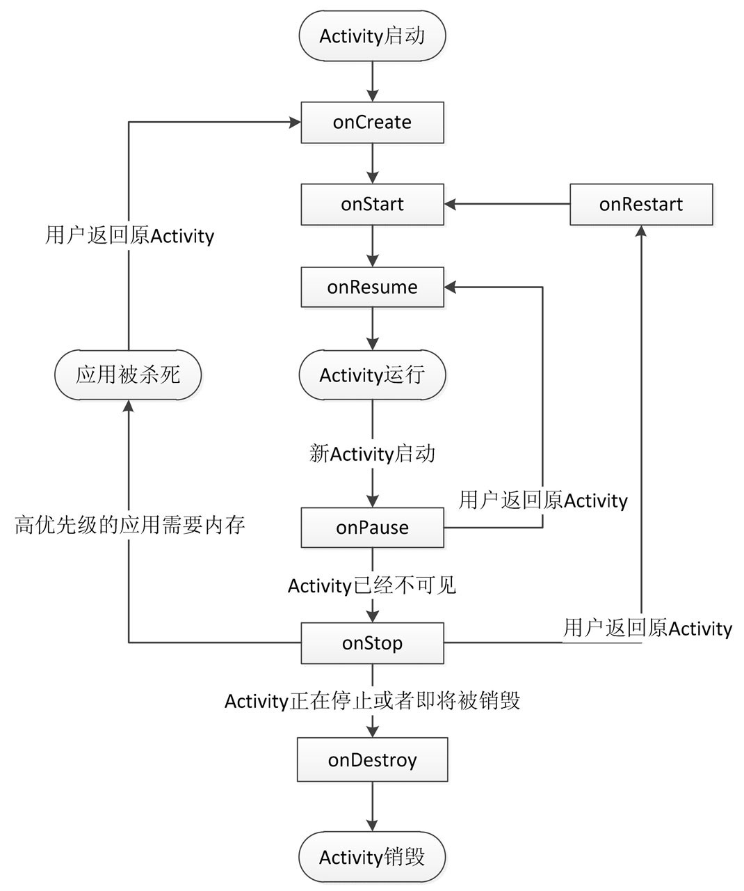
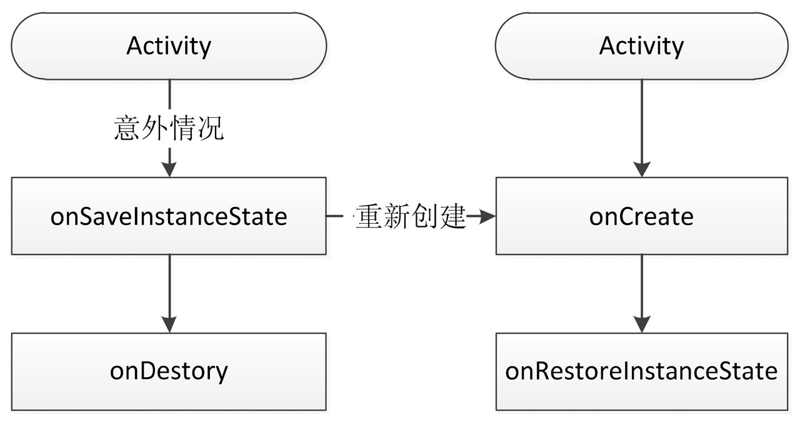
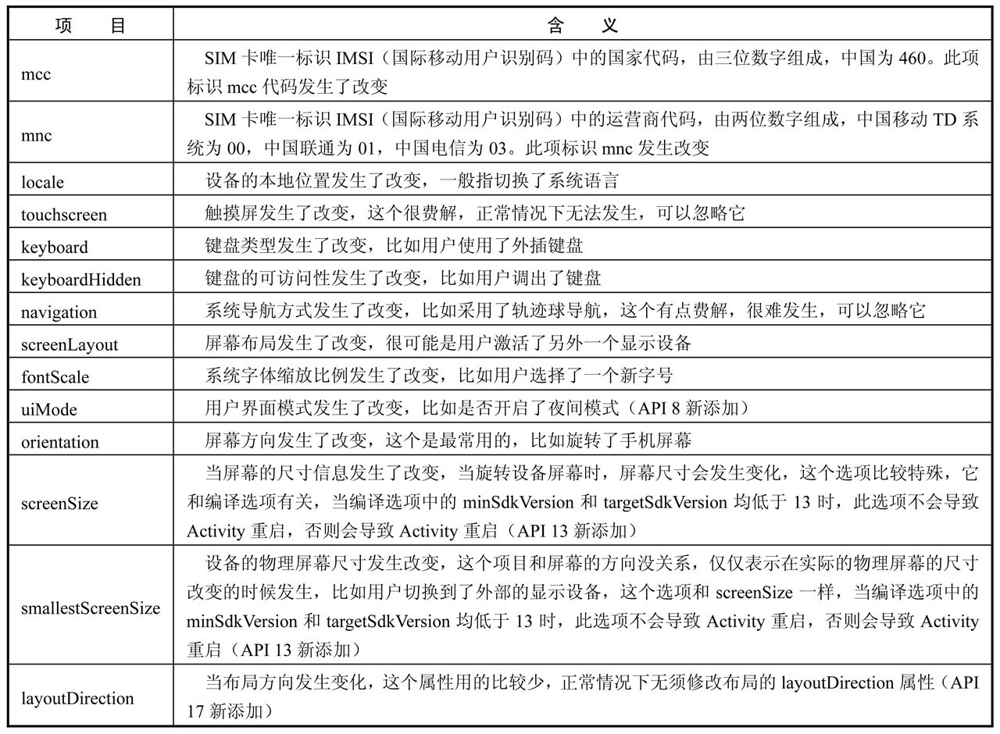

# 第 1 章 Activity 的声明周期和启动模式

## 1.1 Activity 的生命周期全面分析

　　典型情况下的生命周期，是指在有用户参与的情况下，Activity 锁经过的生命周期的改变；而异常情况下的生命周期是指 Activity 被系统回收或者由于当前设备的 Configuration 发生改变从而导致 Activity 被销毁重建，异常情况下的生命周期的关注点和典型情况下略有不同。

### 1.1.1 典型情况下的生命周期分析

　　在正常情况下，Activity 会经历如下生命周期：

1. onCreate：表示 Activity 正在被创建，这是生命周期的第一个方法。在这个方法中，我们可以做一些初始化工作，比如调用 setContentView 去加载界面布局资源、初始化 Activity 所需数据等。

2. onRestart：表示 Activity 正在重新启动。一般情况下，当当前 Activity 从不可见重新变为可见状态时，onRestart 就会被调用。这种情形一般是用户行为所导致的，比如用户按 Home 键切换到桌面或者用户打开了一个新的 Activity，这时当前的 Activity 就会暂停，也就是 onPause 和 onStop 被执行了，接着用户又回到了这个 Activity，就会出现这种情况。 

3. onStart：表示 Activity 正在被启动，即将开始，这时 Activity 已经可见了，但是还没有出现在前台，还无法和用户交互。这个时候其实可以理解为 Activity 已经显示出来了，但是我们还看不到。

4. onResume：表示 Activity 已经可见了，并且出现在前台并开始活动。要注意这个和 onStart 的对比， onStart 和 onResume 都表示 Activity 已经可见，但是 onStart 的时候 Activity 还在后台，onResume 的时候 Activity 才显示到前台。

5. onPause：表示 Activity 正在停止，正常情况下，紧接着 onStop 就会被调用。在特殊情况下，如果这个时候快速地再回到当前 Activity，那么 onResume 会被调用。这种情况属于极端情况，用户操作很难重现这一场景。此时可以做一些存储数据、停止动画等工作，但是注意不能太耗时，因为这会影响到新 Activity 的显示， onPause 必须先执行完，新 Activity 的 onResume 才会执行。

6. onStop：表示 Activity 即将停止，可以做一些稍微重量级的回收工作，同样不能太耗时。
7. onDestroy：表示 Activity 即将被销毁，这是 Activity 生命周期中的最后一个回调，在这里，可以做一些回收工作和最终的资源释放。 

　　正常情况下，Activity 的常用生命周期就只有上面 7 个，下图更详细地描述了 Activity 各种生命周期的切换过程：



　　针对上图，分如下几种情况：

1. 针对一个特定的 Activity，第一次启动，回调如下： onCreate -> onStart -> onResume。

2. 当用户打开新的 Activity 或者切换到桌面的时候，回调如下：onPause -> onStop。这里有一种特殊情况，如果新 Activity 采用了透明主题，那么当前 Activity 不会回调 onStop。

3. 当用户再次回到原 Activity 时，回调如下：onRestart -> onStart -> onResume。

4. 当用户按 back 键回退时，回调如下：onPause -> onStop -> onDestroy。

5. 当 Activity 被系统回收后再次打开，生命周期方法回调过程和（1）一样，注意只是生命周期方法一样，不代表所有过程都一样。

6. 从整个生命周期来说，onCreate 和 onDestroy 是配对的，分别标识着 Activity 的创建和销毁，并且只可能有一次调用。

   从 Activity 是否可见来说，onStart 和 onStop 是配对的，随着用户的操作或者设备屏幕的点亮和熄灭，这两个方法可能被调用多次；

   从 Activity 是否在前台来说，onResume 和 onPause 是配对的，随着用户操作或者设备屏幕的点亮和熄灭，这两个方法可能被调用多次。

#### 问题 1: onStart 和 onResume、onPause 和 onStop 从描述上来看差不多，有什么实质的不同呢？

　　这两个配对的回调分别表示不同的意义，onStart 和 onStop 是从 Activity 是否可见这个角度来回调的，而 onResume 和 onPause 是从 Activity 是否位于前台这个角度来回调的，除了这种区别，在实际使用中没有其他明显区别。

#### 问题 2：假设当前 Activity 为 A，如果这时用户打开一个新 Activity B，那么 B 的 onResume 和 A 的 onPause 哪个先执行呢？

　　Activity 的启动过程中启动 Activity 的请求会由 Instrumentation 来处理，然后它通过 Binder 向 AMS 发请求，AMS 内部维护着一个 ActivityStack 并负责栈内的 Activity 的状态同步，AMS 通过 ActivityThread 去同步 Activity 的状态从而完成生命周期方法的调用。

　　在 ActivityStack 中的 resumeTopActivity-InnerLocked 方法中，有这么一段代码：

```java
// We need to start pausing the current activity so the top one
// can be resumed
boolean dontWaitForPause = (next.info.flags & ActivityInfo.FLAG_RESUME_WHILE_PAUSING)!= 0;
boolean pausing = mStackSupervisor.pauseBackStacks(userLeaving, true, dontWaitForPause);
if (mResumedActivity != null){
  pausing |= startPausingLocked(userLeaving, false, true, dontWaitForPause);
  if (DEBUG_STATES) Slog.d(TAG, "resume TopActivityLocked:Pausing" + mResumedActivity);
}

```

　　从上述代码可以看出，在新 Activity 启动之前，桟顶的 Activity 需要先 onPause 后，新 Activity 才能启动。

　　最终，在 ActivityStackSupervisor 中的 realStartActivityLocked 方法会调用如下代码：

```java
app.thread.scheduleLaunchActivity(
  	new Intent(r.intent), 
    r.appToken,
    System.identityHashCode(r), 
  	r.info, 
  	new Configuration(mService.mConfiguration),
    r.compat, 
  	r.task.voiceInteractor,
  	app.repProcState, 
  	r.icicle,
  	r.persistentState,
  	results,
  	newIntents,
  	! andResume, 
  	mService.isNextTransitionForward(),
    profilerInfo);
```

　　这个 app.thread 的类型是 IApplicationThread，而 IApplicationThread 的具体实现是 ActivityThread 中的 ApplicationThread。所以，这段代码实际上调到了 ActivityThread 中，即 ApplicationThread 的 scheduleLaunchActivity 方法，而 scheduleLaunchActivity 方法最终会完成新 Activity 的onCreate、onStart、onResume 的调用过程。

　　因此，可以得出结论，是旧 Activity 先 onPause，然后新 Activity 再启动。

　　至于 ApplicationThread 的 scheduleLaunchActivity 方法为什么会完成新 Activity 的 onCreate、onStart、onResume 的调用过程，请看下面的代码。scheduleLaunchActivity 最终会调用如下方法，而如下方法的确会完成 onCreate、onStart、onResume 的调用过程。

```java
/*ActivityThread#handleLaunchrActivity*/
private  void  handleLaunchActivity(ActivityClientRecord  r,  Intent  custom-
        Intent) {
            // If we are getting ready to gc after going to the background, well
            // we are back active so skip it.
            unscheduleGcIdler();
            mSomeActivitiesChanged = true;

            if (r.profilerInfo ! = null) {
                mProfiler.setProfiler(r.profilerInfo);
                mProfiler.startProfiling();
            }

            // Make sure we are running with the most recent config.
            handleConfigurationChanged(null, null);
   if (localLOGV) Slog.v(
                TAG, "Handling launch of " + r);

            //这里新Activity被创建出来，其onCreate和onStart会被调用
        Activity a = performLaunchActivity(r, customIntent);

            if (a ! = null) {
                r.createdConfig = new Configuration(mConfiguration);
                Bundle oldState = r.state;
                //这里新Activity的onResume会被调用
                handleResumeActivity(r.token, false, r.isForward,
                        !r.activity.mFinished && ! r.startsNotResumed);
            //省略
        }

```

　　从上面的分析可以看出，当新启动一个 Activity 的时候，旧 Activity 的 onPause 会先执行，然后才会启动新的 Activity。

### 1.1.2 异常情况下的生命周期分析

　　Activity 除了受用户操作所导致的正常的生命周期方法调度，还有一些异常情况，比如当资源相关的系统配置发生改变以及系统内存不足时，Activity 就可能被杀死。

#### 1．情况1：资源相关的系统配置发生改变导致Activity被杀死并重新创建

　　在默认情况下，如果 Activity 不做特殊处理，那么当系统配置发生改变后，Activity 就会被销毁并重新创建，其生命周期如下图所示：



　　当系统配置发生改变后，Activity 会被销毁，其 onPause、onStop、onDestroy 均会被调用，同时由于 Activity 是在异常情况下终止的，系统会调用 onSaveInstanceState 来保存当前 Activity 的状态。这个方法的调用时机是在 onStop 之前，它和 onPause 没有既定的时序关系，它既可能在 onPause 之前调用，也可能在 onPause 之后调用。

　　需要强调的一点是，这个方法只会出现在 Activity 被异常终止的情况下，正常情况下系统不会回调这个方法。

　　当 Activity 被重新创建后，系统会调用onRestoreInstanceState，并且把 Activity 销毁时 onSaveInstanceState 方法所保存的 Bundle 对象作为参数同时传递给 onRestoreInstanceState 和 onCreate 方法。因此，可以通过 onRestoreInstanceState 和 onCreate 方法来判断 Activity 是否被重建了，如果被重建了，那么就可以取出之前保存的数据并恢复，从时序上来说， onRestoreInstanceState 的调用时机在 onStart 之后。

　　在 onSaveInstanceState 和 onRestoreInstanceState 方法中，系统自动会做了一定的恢复工作。当 Activity 在异常情况下需要重新创建时，系统会默认保存当前 Activity 的视图结构，并且在 Activity 重启后恢复这些数据，比如文本框中用户输入的数据、ListView 滚动的位置等，这些 View 相关的状态系统都能够默认恢复。 

　　和 Activity 一样，每个 View 都有 onSaveInstanceState 和 onRestoreInstanceState 这两个方法，看一下它们的具体实现，就能知道系统能够自动为每个 View 恢复哪些数据。

　　关于保存和恢复 View 层次结构，系统的工作流程是这样的：首先 Activity 被意外终止时，Activity 会调用 onSaveInstanceState 去保存数据，然后 Activity  会委托 Window 去保存数据，接着 Window 再委托它上面的顶级容器去保存数据。顶层容器是一个 ViewGroup，一般来说它很可能是 DecorView。最后顶层容器再去一一通知它的子元素来保存数据，这样整个数据保存过程就完成了。

　　可以发现，这是一种典型的委托思想，上层委托下层、父容器委托子元素去处理一件事情，这种思想在 Android 中有很多应用，比如 View 的绘制过程、事件分发等都是采用类似的思想。

　　TextView 保存了自己的文本选中状态和文本内容。 

　　接收的位置可以选择 onRestoreInstanceState 或者 onCreate，二者的区别是：

1. onRestoreInstanceState 一旦被调用，其参数 Bundle savedInstanceState 一定是有值的，可以不用额外地判断是否为空；
2. 但是 onCreate 不行，onCreate 如果是正常启动的话，其参数 Bundle savedInstanceState 为 null，所以必须要额外判断。

　　这两个方法可以选择任意一个都可以进行数据恢复，但是官方文档的建议是采用 onRestoreInstanceState 去恢复数据。

　　系统只会在 Activity 即将被销毁并且有机会重新显示的情况下才会去调用 onSaveInstanceState。

　　当 Activity 正常销毁的时候，系统不会调用onSaveInstanceState，因为被销毁的 Activity 不可能再次被显示。

　　系统只在 Activity 异常终止的时候才会调用 onSaveInstanceState 和 onRestoreInstanceState 来存储和恢复数据，其他情况不会触发这个过程。

#### 2．情况2：资源内存不足导致低优先级的 Activity 被杀死

　　Activity 按照优先级从高到低，可以分为如下三种：

1. 前台 Activity——正在和用户交互的 Activity，优先级最高。
2. 可见但非前台 Activity——比如 Activity 中弹出了一个对话框，导致 Activity 可见但是位于后台无法和用户直接交互。
3. 后台 Activity——已经被暂停的 Activity，比如执行了 onStop，优先级最低。

　　当系统内存不足时，系统就会按照上述优先级去杀死目标 Activity 所在的进程，并在后续通过 onSaveInstanceState 和 onRestoreInstanceState 来存储和恢复数数据。

　　如果一个进程中没有四大组件在执行，那么这个进程将很快被系统杀死，因此，一些后台工作不适合脱离四大组件而独自运行在后台中，这样进程很容易被杀死。比较好的方法是将后台工作放入 Service 中从而保证进程有一定的优先级，这样就不会轻易地被系统杀死。 

　　当系统配置发生改变后，Activity 会被重新创建，如果不想被重新创建，可以设置对应的系统配置。系统配置中有很多内容，如果当某项内容发生改变后，不想系统重新创建Activity，可以给Activity指定configChanges属性。比如不想让Activity在屏幕旋转的时候重新创建，就可以给configChanges属性添加orientation这个值，如下所示：

```ruby
android:configChanges = "orientation"
```

　　如果想指定多个值，可以用 “|” 连接起来，比如android:configChanges="orientation|keyboardHidden"。

　　系统配置中所含的项目是非常多的，下面介绍每个项目的含义，如下表所示：

 

　　如果没有在 Activity 的 configChanges 属性中指定该选项的话，当配置发生改变后就会导致 Activity 重新创建。上面表格中的项目很多，但是常用的只有 locale、orientation 和 keyboardHidden 这三个选项，其他很少使用。

　　需要注意的是 screenSize 和 smallestScreenSize，它们两个比较特殊，它们的行为和编译选项有关，但和运行环境无关。

　　在设置了 configChanged 属性后，Activity 不会重新创建，并且也没有调用 onSaveInstanceState 和 onRestoreInstanceState 来存储和恢复数据，取而代之的是系统调用了 Activity 的 onConfigurationChanged 方法，这个时候就可以做一些自己的特殊处理了。

## 1.2 Activity的启动模式

### 1.2.1 Activity 的 LaunchMode

　　在默认情况下，当多次启动同一个 Activity 的时候，系统会创建多个实例并把它们一一放入任务栈中，当单击 back 键，会发现这些 Activity 会一一回退。

　　任务栈是一种 “ 后进先出 ” 的栈结构，这个比较好理解，每按一下 back 键就会有一个 Activity 出栈，直到栈空为止，当栈中无任何 Activity 的时候，系统就会回收这个任务栈。

　　目前有四种启动模式：standard、singleTop、singleTask 和 singleInstance，下面先介绍各种启动模式的含义：

#### 1.2.1.1. standard

　　standard：标准模式，这也是系统的默认模式。

　　每次启动一个 Activity 都会重新创建一个新的实例，不管这个实例是否已经存在。被创建的实例的生命周期符合典型情况下 Activity 的生命周期，它的 onCreate、onStart、onResume 都会被调用。这是一种典型的多实例实现，一个任务栈中可以有多个实例，每个实例也可以属于不同的任务栈。

　　在这种模式下，谁启动了这个 Activity，那么这个 Activity 就运行在启动它的那个 Activity 所在的栈中。

　　当用 ApplicationContext 去启动 standard 模式的 Activity 的时候会报错，错误如下：

```java
E/AndroidRuntime(674):    android.util.AndroidRuntimeException:    Calling
        startActivity  from  outside  of  an  Activity  context  requires  the  FLAG_
        ACTIVITY_NEW_TASK flag. Is this really what you want?
 
```

　　这是因为 standard 模式的 Activity 默认会进入启动它的 Activity 所属的任务栈中，但是由于非 Activity 类型的Context（如 ApplicationContext ）并没有所谓的任务栈，所以这就有问题了。解决这个问题的方法是为待启动 Activity 指定 FLAG_ACTIVITY_NEW_TASK 标记位，这样启动的时候就会为它创建一个新的任务栈，这个时候待启动 Activity 实际上是以 singleTask 模式启动的。

#### 1.2.1.2. singleTop

　　singleTop：栈顶复用模式。

　　在这种模式下，如果新 Activity 已经位于任务栈的栈顶，那么此 Activity 不会被重新创建，同时它的 onNewIntent 方法会被回调，通过此方法的参数可以取出当前请求的信息。

　　需要注意的是，这个 Activity 的 onCreate、onStart 不会被系统调用，因为它并没有发生改变。如果新 Activity 的实例已存在但不是位于栈顶，那么新 Activity 仍然会重新重建。

#### 1.2.1.3. singleTask

　　singleTask：栈内复用模式。

　　这是一种单实例模式，在这种模式下，只要 Activity 在一个栈中存在，那么多次启动此 Activity 都不会重新创建实例，和 singleTop 一样，系统也会回调其 onNewIntent。

　　具体一点，当一个具有 singleTask 模式的 Activity 请求启动后，比如 ActivityA，系统首先会寻找是否存在 A 想要的任务栈，如果不存在，就重新创建一个任务栈，然后创建 A 的实例后把 A 放到栈中。如果存在 A 所需的任务栈，这时要看 A 是否在栈中有实例存在，如果有实例存在，那么系统就会把 A 调到栈顶并调用它的 onNewIntent 方法，如果实例不存在，就创建 A 的实例并把 A 压入栈中。

#### 1.2.1.4. singleInstance

　　singleInstance：单实例模式。

　　这是一种加强的 singleTask 模式，它除了具有 singleTask 模式的所有特性外，还加强了一点，那就是具有此种模式的 Activity 只能单独地位于一个任务栈中，

　　什么是 Activity 所需要的任务栈呢？这要从一个参数说起：TaskAffinity，可以翻译为任务相关性。这个参数标识了一个 Activity 所需要的任务栈的名字，默认情况下，所有 Activity 所需的任务栈的名字为应用的包名。当然，也可以为每个 Activity 都单独指定 TaskAffinity 属性，这个属性值必须不能和包名相同，否则就相当于没有指定。

　　TaskAffinity 属性主要和 singleTask 启动模式或者 allowTaskReparenting 属性配对使用，在其他情况下没有意义。另外，任务栈分为前台任务栈和后台任务栈，后台任务栈中的 Activity 位于暂停状态，用户可以通过切换将后台任务栈再次调到前台。

　　当 TaskAffinity 和 singleTask 启动模式配对使用的时候，它是具有该模式的 Activity 的目前任务栈的名字，待启动的 Activity 会运行在名字和 TaskAffinity 相同的任务栈中。

　　当 TaskAffinity 和 allowTaskReparenting 结合的时候，这种情况比较复杂，会产生特殊的效果。当一个应用 A 启动了应用 B 的某个 Activity 后，如果这个 Activity 的 allowTaskReparenting 属性为 true 的话，那么当应用 B 被启动后，此 Activity 会直接从应用 A 的任务栈转移到应用 B 的任务栈中。比如现在有 2 个应用 A 和 B , A 启动了 B 的一个 Activity C，然后按 Home 键回到桌面，然后再单击 B 的桌面图标，这个时候并不是启动了 B 的主 Activity，而是重新显示了已经被应用 A 启动的 ActivityC，或者说，C 从 A 的任务栈转移到了 B 的任务栈中。

　　如何给 Activity 指定启动模式呢？有两种方法。

1. 第一种是通过 AndroidMenifest 为 Activity 指定启动模式，如下所示:

   ```xml
   <activity
       android:name="com.ryg.chapter_1.SecondActivity"
       android:configChanges="screenLayout"
       android:launchMode="singleTask"
       android:label="@string/app_name" />
   ```

2. 另一种情况是通过在 Intent 中设置标志位来为 Activity 指定启动模式，比如：

   ```java
   Intent intent = new Intent();
   intent.setClass(MainActivity.this, SecondActivity.class);
   intent.addFlags(Intent.FLAG_ACTIVITY_NEW_TASK);
   startActivity(intent);
   ```

　　这两种方式都可以为 Activity 指定启动模式，但是二者还是有区别的。首先，优先级上，第二种方式的优先级要高于第一种，当两种同时存在时，以第二种方式为准；其次，上述两种方式在限定范围上有所不同，比如，第一种方式无法直接为 Activity 设定 FLAG_ACTIVITY_CLEAR_TOP 标识，而第二种方式无法为 Activity 指定 singleInstance 模式。

### 1.2.2 Activity 的 Flags

　　标记位的作用很多，有的标记位可以设定 Activity 的启动模式，比如 FLAG_ACTIVITY_NEW_TASK 和 FLAG_ACTIVITY_SINGLE_TOP 等；还有的标记位可以影响 Activity 的运行状态，比如 FLAG_ACTIVITY_CLEAR_TOP 和 FLAG_ACTIVITY_EXCLUDE_FROM_RECENTS 等。

　　在使用标记位的时候，要注意有些标记位是系统内部使用的，应用程序不需要去手动设置这些标记位以防出现问题。

#### 1.2.2.1. FLAG_ACTIVITY_NEW_TASK

　　FLAG_ACTIVITY_NEW_TASK 这个标记位的作用是为 Activity 指定 “singleTask” 启动模式，其效果和在 XML 中指定该启动模式相同。

#### 1.2.2.2. FLAG_ACTIVITY_SINGLE_TOP

　　FLAG_ACTIVITY_SINGLE_TOP 这个标记位的作用是为 Activity 指定 “singleTop” 启动模式，其效果和在 XML 中指定该启动模式相同。

#### 1.2.2.3. FLAG_ACTIVITY_CLEAR_TOP

　　FLAG_ACTIVITY_CLEAR_TOP 具有此标记位的 Activity，当它启动时，在同一个任务栈中所有位于它上面的 Activity 都要出栈。

　　这个模式一般需要和 FLAG_ACTIVITY_NEW_TASK 配合使用，在这种情况下，被启动 Activity 的实例如果已经存在，那么系统就会调用它的 onNewIntent。如果被启动的 Activity 采用 standard 模式启动，那么它连同它之上的 Activity 都要出栈，系统会创建新的 Activity 实例并放入栈顶。

　　而 singleTask 启动模式默认就具有此标记位的效果。

#### 1.2.2.4. FLAG_ACTIVITY_EXCLUDE_FROM_RECENTS

　　FLAG_ACTIVITY_EXCLUDE_FROM_RECENTS 具有这个标记的 Activity 不会出现在历史 Activity 的列表中，当某些情况下不希望用户通过历史列表回到某个 Activity 的时候这个标记比较有用。

　　它等同于在 XML 中指定 Activity 的属性 android:excludeFromRecents="true"。

## 1.3 IntentFilter的匹配规则

　　启动 Activity 分为两种，显式调用和隐式调用。

　　显式调用需要明确地指定被启动对象的组件信息，包括包名和类名，而隐式调用则不需要明确指定组件信息。

　　原则上一个 Intent 不应该既是显式调用又是隐式调用，如果二者共存的话以显式调用为主。

　　隐式调用需要 Intent 能够匹配目标组件的 IntentFilter 中所设置的过滤信息，如果不匹配将无法启动目标 Activity 。

　　IntentFilter 中的过滤信息有 action、category、data。

　　为了匹配过滤列表，需要同时匹配过滤列表中的 action、category、data 信息，否则匹配失败。

　　一个过滤列表中的 action、category 和 data 可以有多个，所有的 action、category、data 分别构成不同类别，同一类别的信息共同约束当前类别的匹配过程。

　　只有一个 Intent 同时匹配 action 类别、category 类别、data 类别才算完全匹配，只有完全匹配才能成功启动目标 Activity。

　　另外一点，一个 Activity 中可以有多个 intent-filter，一个 Intent 只要能匹配任何一组 intent-filter 即可成功启动对应的 Activity。

### 1.3.1. action 的匹配规则

　　action 是一个字符串，系统预定义了一些 action，同时也可以在应用中定义自己的 action。 

　　action 的匹配规则是 Intent 中的 action 必须能够和过滤规则中的 action 匹配，这里说的匹配是指 action 的字符串值完全一样。

　　一个过滤规则中可以有多个 action，那么只要 Intent 中的 action 能够和过滤规则中的任何一个 action 相同即可匹配成功。 

　　需要注意的是，Intent 中如果没有指定 action，那么匹配失败。

　　总结一下，action 的匹配要求 Intent 中的 action 存在且必须和过滤规则中的其中一个 action 相同，这里需要注意它和 category 匹配规则的不同。

　　另外，action 区分大小写，大小写不同字符串相同的 action 会匹配失败。

### 1.3.2. category 的匹配规则

　　category 是一个字符串，系统预定义了一些 category，同时也可以在应用中定义自己的 category。 

　　category 的匹配规则和 action 不同，它要求 Intent 中如果含有 category，那么所有的 category 都必须和过滤规则中的其中一个 category 相同。

　　换句话说，Intent 中如果出现了 category，不管有几个 category，对于每个 category 来说，它必须是过滤规则中已经定义了的 category。当然，Intent 中可以没有 category，如果没有 category 的话，按照上面的描述，这个 Intent 仍然可以匹配成功。

　　这里要注意下它和 action 匹配过程的不同，action 是要求 Intent 中必须有一个 action 且必须能够和过滤规则中的某个 action 相同，而 category 要求 Intent 可以没有 category，但是如果一旦有 category，不管有几个，每个都要能够和过滤规则中的任何一个 category 相同。

　　为什么不设置 category 也可以匹配呢？原因是系统在调用 startActivity 或者 startActivityForResult 的时候会默认为 Intent 加上 “android.intent. category.DEFAULT” 这个 category。

　　同时，为了 activity 能够接收隐式调用，就必须在 intent-filter 中指定 “android.intent.category.DEFAULT” 这个 category。

### 1.3.3. data 的匹配规则 

　　data 的匹配规则和 action 类似，如果过滤规则中定义了 data，那么 Intent 中必须也要定义可匹配的 data 。

　　data 的语法如下所示：

```xml
<data android:scheme="string"
      android:host="string"
      android:port="string"
      android:path="string"
      android:pathPattern="string"
      android:pathPrefix="string"
      android:mimeType="string" />
```

　　data 由两部分组成，mimeType 和 URI。mimeType 指媒体类型，比如 image/jpeg、audio/mpeg4-generic 和 video/* 等，可以表示图片、文本、视频等不同的媒体格式.

　　而 URI 中包含的数据就比较多了，下面是 URI 的结构：

``` xml
<scheme>://<host>:<port>/[<path>|<pathPrefix>|<pathPattern>]
```

　　Scheme:URI 的模式，比如 http、file、content 等，如果 URI 中没有指定 scheme，那么整个 URI 的其他参数无效，这也意味着 URI 是无效的。

　　Host:URI 的主机名，比如 www.baidu.com，如果host 未指定，那么整个 URI 中的其他参数无效，这也意味着 URI 是无效的。 

　　Port:URI 中的端口号，比如 80，仅当 URI 中指定了 scheme 和 host 参数的时候 port 参数才是有意义的。

　　Path、pathPattern 和 pathPrefix：这三个参数表述路径信息，其中 path 表示完整的路径信息；pathPattern 也表示完整的路径信息，但是它里面可以包含通配符 “ * ” , “ * ” 表示 0 个或多个任意字符，需要注意的是，由于正则表达式的规范，如果想表示真实的字符串，那么 “ * ” 要写成 “\\*”,  “\” 要写成 “\\\\”; pathPrefix 表示路径的前缀信息。

　　data 的匹配规则和 action 类似，它也要求 Intent 中必须含有 data 数据，并且 data 数据能够完全匹配过滤规则中的某一个 data。这里的完全匹配是指过滤规则中出现的 data 部分也出现在了 Intent 中的 data 中。

　　如果没有指定 URI，但是 Intent 中的 URI 部分的 schema 必须为 content 或者 file 才能匹配。

　　如果要为 Intent 指定完整的 data，必须要调用 setDataAndType 方法，不能先调用 setData 再调用 setType，因为这两个方法彼此会清除对方的值。

　　Intent-filter 的匹配规则对于 Service 和 BroadcastReceiver 也是同样的道理，不过系统对于 Service 的建议是尽量使用显式调用方式来启动服务。

　　当通过隐式方式启动一个 Activity 的时候，可以做一下判断，看是否有 Activity 能够匹配隐式 Intent，如果不做判断就有可能出现 android.content.ActivityNotFoundException 错误了。

　　判断方法有两种：

1. 采用 PackageManager 的 resolveActivity 方法或者 Intent 的 resolveActivity 方法，如果它们找不到匹配的 Activity 就会返回 null，通过判断返回值就可以规避 android.content.ActivityNotFoundException  错误了。
2. 另外，PackageManager 还提供了 queryIntentActivities 方法，这个方法和 resolveActivity 方法不同的是：它不是返回最佳匹配的 Activity 信息而是返回所有成功匹配的 Activity 信息。

　　queryIntentActivities 和 resolveActivity 的方法原型：

``` java
public abstract List<ResolveInfo> queryIntentActivities(Intent intent,int flags);
public abstract ResolveInfo resolveActivity(Intent intent,int flags);
```

　　第二个参数需要注意，要使用 MATCH_DEFAULT_ONLY 这个标记位，这个标记位的含义是仅仅匹配那些在 intent-filter 中声明了这个 category 的 Activity。

　　使用这个标记位的意义在于，只要上述两个方法不返回 null，那么 startActivity 一定可以成功。如果不用这个标记位，就可以把 intent-filter 中 category 不含 DEFAULT 的那些 Activity 给匹配出来，从而导致 startActivity 可能失败。因为不含有 DEFAULT 这个 category 的 Activity 是无法接收隐式 Intent 的。

　　在 action 和 category 中，有一类 action 和 category 比较重要，它们是：

``` java
<action android:name = "android.intent.action.MAIN" />
<category android:name = "android.intent.category.LAUNCHER" />
```

　　这二者共同作用是用来标明这是一个入口 Activity 并且会出现在系统的应用列表中，少了任何一个都没有实际意义，也无法出现在系统的应用列表中，也就是二者缺一不可。

　　另外，针对 Service 和 BroadcastReceiver, PackageManager 同样提供了类似的方法去获取成功匹配的组件信息。