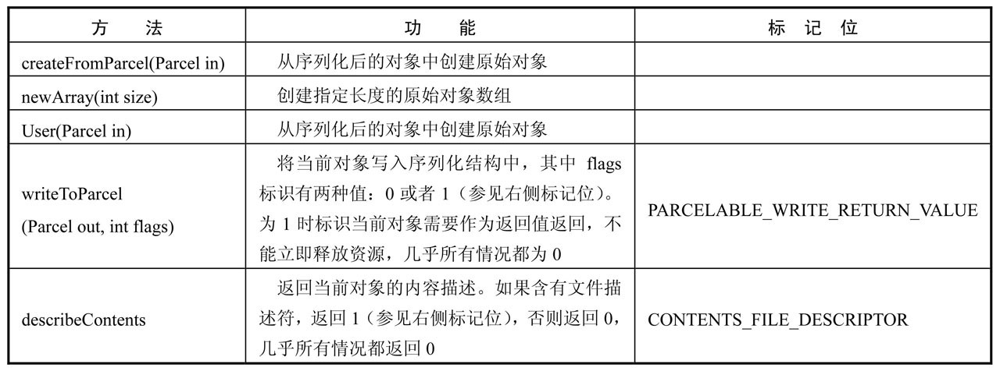
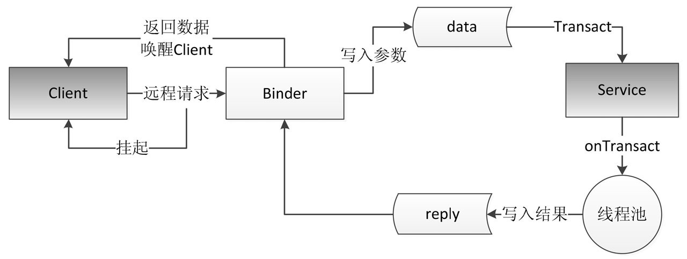
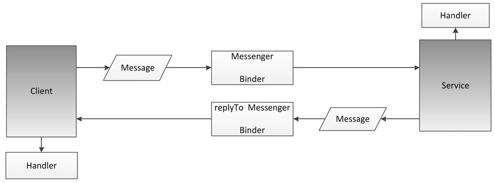
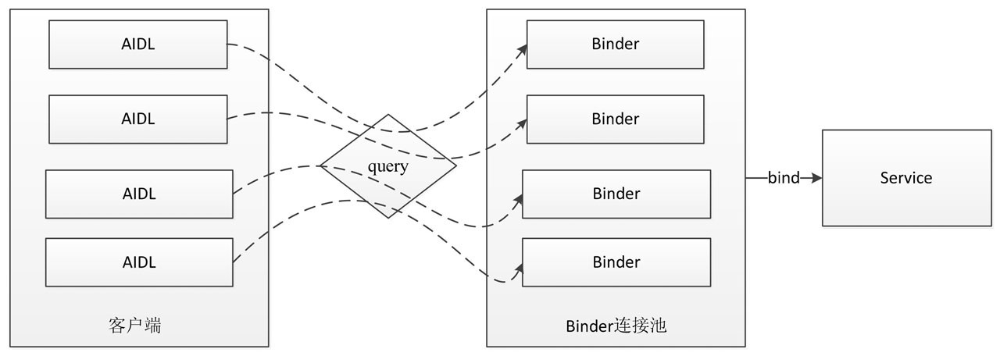

# 第 2 章 IPC 机制

## 2.1 Android IPC 简介

　　IPC 是 Inter-Process Communication 的缩写，含义为进程间通信或者跨进程通信，是指两个进程之间进行数据交换的过程。

　　按照操作系统中的描述，线程是 CPU 调度的最小单元，同时线程是一种有限的系统资源。

　　而进程一般指一个执行单元，在 PC 和移动设备上指一个程序或者一个应用。

　　一个进程可以包含多个线程，因此进程和线程是包含与被包含的关系。

　　最简单的情况下，一个进程中可以只有一个线程，即主线程，在 Android 里面主线程也叫 UI 线程，在 UI 线程里才能操作界面元素。

　　很多时候，一个进程中需要执行大量耗时的任务，如果这些任务放在主线程中去执行就会造成界面无法响应，严重影响用户体验，这种情况在 PC 系统和移动系统中都存在，在 Android 中有一个特殊的名字叫做 ANR（Application Not Responding），即应用无响应。解决这个问题就需要用到线程，把一些耗时的任务放在线程中即可。

　　IPC 不是 Android 中所独有的，任何一个操作系统都需要有相应的 IPC 机制，比如 Windows 上可以通过剪贴板、管道和邮槽等来进行进程间通信；Linux 上可以通过命名管道、共享内容、信号量等来进行进程间通信。可以看到不同的操作系统平台有着不同的进程间通信方式，对于 Android 来说，它是一种基于 Linux 内核的移动操作系统，它的进程间通信方式并不能完全继承自 Linux，相反，它有自己的进程间通信方式。

　　在 Android 中最有特色的进程间通信方式就是 Binder 了，通过 Binder 可以轻松地实现进程间通信。除了 Binder, Android 还支持 Socket，通过 Socket 也可以实现任意两个终端之间的通信，当然同一个设备上的两个进程通过 Socket 通信自然也是可以的。

　　说到 IPC 的使用场景就必须提到多进程，只有面对多进程这种场景下，才需要考虑进程间通信。

　　多进程的情况分为两种:

1. 第一种情况是一个应用因为某些原因自身需要采用多进程模式来实现，至于原因，可能有很多，比如有些模块由于特殊原因需要运行在单独的进程中，又或者为了加大一个应用可使用的内存所以需要通过多进程来获取多份内存空间。

   Android 对单个应用所使用的最大内存做了限制，早期的一些版本可能是16MB，不同设备有不同的大小。

2. 另一种情况是当前应用需要向其他应用获取数据，由于是两个应用，所以必须采用跨进程的方式来获取所需的数据，甚至通过系统提供的 ContentProvider 去查询数据的时候，其实也是一种进程间通信，只不过通信细节被系统内部屏蔽了，无法感知而已。

## 2.2 Android 中的多进程模式

　　通过给四大组件指定 android:process 属性，就可以轻易地开启多进程模式。

　　但是有时候通过多进程得到的好处甚至都不足以弥补使用多进程所带来的代码层面的负面影响。

### 2.2.1 开启多进程模式

　　首先，在 Android 中使用多进程只有一种方法，那就是给四大组件（Activity、Service、Receiver、ContentProvider）在 AndroidMenifest 中指定 android:process 属性，除此之外没有其他办法，也就是说我们无法给一个线程或者一个实体类指定其运行时所在的进程。

　　其实还有另一种非常规的多进程方法，那就是通过 JNI 在 native 层去 fork 一个新的进程，但是这种方法属于特殊情况，也不是常用的创建多进程的方式。

　　下面是一个示例，描述了如何在  Android 中创建多进程：

```java
< activity
              android:name="com.ryg.chapter_2.MainActivity"
              android:configChanges="orientation|screenSize"
              android:label="@string/app_name"
              android:launchMode="standard" >
              <intent-filter>
                  <action android:name="android.intent.action.MAIN" />
                  <category android:name="android.intent.category.LAUNCHER" />
              </intent-filter>
          </activity
          <activity
              android:name="com.ryg.chapter_2.SecondActivity"
              android:configChanges="screenLayout"
              android:label="@string/app_name"
              android:process=":remote" />
          <activity
              android:name="com.ryg.chapter_2.ThirdActivity"
              android:configChanges="screenLayout"
              android:label="@string/app_name"
              android:process="com.ryg.chapter_2.remote" />

```

　　默认进程的进程名是包名。

　　除了在 Eclipse 的 DDMS 视图中查看进程信息，还可以用 shell 来查看，命令为：adb shell ps 或者 adb shell ps | grep com.ryg.chapter_2。其中 com.ryg.chapter_2 是包名，通过 ps 命令也可以查看一个包名中当前所存在的进程信息。

　　进程分别为 “:remote” 和 “com.ryg.chapter_2.remote” ，那么这两种方式是有区别的，区别有两方面：

1. 首先，“:” 的含义是指要在当前的进程名前面附加上当前的包名，这是一种简写的方法。而 “com.ryg.chapter_2.remote” 是一种完整的命名方式，不会附加包名信息。

2. 其次，进程名以 “:” 开头的进程属于当前应用的私有进程，其他应用的组件不可以和它跑在同一个进程中，而进程名不以 “:” 开头的进程属于全局进程，其他应用通过 ShareUID 方式可以和它跑在同一个进程中。

　　Android 系统会为每个应用分配一个唯一的 UID，具有相同 UID 的应用才能共享数据。这里要说明的是，两个应用通过 ShareUID 跑在同一个进程中是有要求的，需要这两个应用有相同的 ShareUID 并且签名相同才可以。在这种情况下，它们可以互相访问对方的私有数据，比如 data 目录、组件信息等，不管它们是否跑在同一个进程中。当然如果它们跑在同一个进程中，那么除了能共享 data 目录、组件信息，还可以共享内存数据，或者说它们看起来就像是一个应用的两个部分。

### 2.2.2 多进程模式的运行机制

　　Android 为每一个应用分配了一个独立的虚拟机，或者说为每个进程都分配一个独立的虚拟机，不同的虚拟机在内存分配上有不同的地址空间，这就导致在不同的虚拟机中访问同一个类的对象会产生多份副本。

　　所有运行在不同进程中的四大组件，只要它们之间需要通过内存来共享数据，都会共享失败，这也是多进程所带来的主要影响。正常情况下，四大组件中间不可能不通过一些中间层来共享数据，那么通过简单地指定进程名来开启多进程都会无法正确运行。当然，特殊情况下，某些组件之间不需要共享数据，这个时候可以直接指定 android:process 属性来开启多进程，但是这种场景是不常见的，几乎所有情况都需要共享数据。

　　一般来说，使用多进程会造成如下几方面的问题：

1. 静态成员和单例模式完全失效。
2. 线程同步机制完全失效。
3. SharedPreferences 的可靠性下降。
4. Application 会多次创建。

　　SharedPreferences 的可靠性下降是因为 SharedPreferences 不支持两个进程同时去执行写操作，否则会导致一定几率的数据丢失，这是因为SharedPreferences 底层是通过读/写 XML 文件来实现的，并发写显然是可能出问题的，甚至并发读/写都有可能出问题。

　　Application 会多次创建问题也是显而易见的，当一个组件跑在一个新的进程中的时候，由于系统要在创建新的进程同时分配独立的虚拟机，所以这个过程其实就是启动一个应用的过程。因此，相当于系统又把这个应用重新启动了一遍，既然重新启动了，那么自然会创建新的 Application。这个问题其实可以这么理解，运行在同一个进程中的组件是属于同一个虚拟机和同一个 Application 的，同理，运行在不同进程中的组件是属于两个不同的虚拟机和 Application 的。

## 2.3 IPC 基础概念介绍

　　IPC 中的一些基础概念，主要包含三方面内容： Serializable 接口、Parcelable 接口以及 Binder。

　　Serializable 和 Parcelable 接口可以完成对象的序列化过程，当需要通过 Intent 和 Binder 传输数据时就需要使用 Parcelable 或者 Serializable。还有的时候需要把对象持久化到存储设备上或者通过网络传输给其他客户端，这个时候也需要使用 Serializable 来完成对象的持久化。

### 2.3.1 Serializable 接口

　　Serializable 是 Java 所提供的一个序列化接口，它是一个空接口，为对象提供标准的序列化和反序列化操作。使用 Serializable 来实现序列化相当简单，只需要在类的声明中指定一个类似下面的标识即可自动实现默认的序列化过程。

```java
private static final long serialVersionUID = 8711368828010083044L
```

　　在 Android 中也提供了新的序列化方式，那就是 Parcelable 接口，使用 Parcelable 来实现对象的序列化。

　　想让一个对象实现序列化，只需要这个类实现 Serializable 接口并声明一个 serialVersionUID 即可，实际上，甚至这个 serialVersionUID 也不是必需的，不声明这个 serialVersionUID 同样也可以实现序列化，但是这将会对反序列化过程产生影响。

　　通过 Serializable 方式来实现对象的序列化，实现起来非常简单，几乎所有工作都被系统自动完成了。如何进行对象的序列化和反序列化也非常简单，只需要采用 ObjectOutputStream 和 ObjectInputStream 即可轻松实现。

```java
				//序列化过程
        User user = new User(0, "jake", true);
        ObjectOutputStream out = new ObjectOutputStream(
                new FileOutputStream("cache.txt"));
        out.writeObject(user);
        out.close();

        //反序列化过程
        ObjectInputStream in = new ObjectInputStream(
                new FileInputStream("cache.txt"));
        User newUser = (User) in.readObject();
        in.close();

```

　　上述代码演示了采用 Serializable 方式序列化对象的典型过程，很简单，只需要把实现了 Serializable 接口的User对象写到文件中就可以快速恢复了，恢复后的对象 newUser 和 user 的内容完全一样，但是两者并不是同一个对象。

　　这个 serialVersionUID 是用来辅助序列化和反序列化过程的，原则上序列化后的数据中的 serialVersionUID 只有和当前类的 serialVersionUID 相同才能够正常地被反序列化。

　　serialVersionUID 的详细工作机制是这样的：序列化的时候系统会把当前类的 serialVersionUID 写入序列化的文件中（也可能是其他中介），当反序列化的时候系统会去检测文件中的 serialVersionUID，看它是否和当前类的 serialVersionUID 一致，如果一致就说明序列化的类的版本和当前类的版本是相同的，这个时候可以成功反序列化；否则就说明当前类和序列化的类相比发生了某些变换，比如成员变量的数量、类型可能发生了改变，这个时候是无法正常反序列化的，因此会报如下错误：

```java
java.io.InvalidClassException: Main; local class incompatible: stream
        classdesc serialVersionUID = 8711368828010083044, local class serial-
        VersionUID = 8711368828010083043。

```

　　一般来说，应该手动指定 serialVersionUID 的值，比如 1L，也可以让 Eclipse 根据当前类的结构自动去生成它的 hash 值，这样序列化和反序列化时两者的 serialVersionUID 是相同的，因此可以正常进行反序列化。

　　如果不手动指定 serialVersionUID 的值，反序列化时当前类有所改变，比如增加或者删除了某些成员变量，那么系统就会重新计算当前类的 hash 值并把它赋值给 serialVersionUID，这个时候当前类的 serialVersionUID 就和序列化的数据中的 serialVersionUID 不一致，于是反序列化失败，程序就会出现 crash。

　　serialVersionUID 的作用：当手动指定了它以后，就可以在很大程度上避免反序列化过程的失败。比如当版本升级后，可能删除了某个成员变量也可能增加了一些新的成员变量，这个时候反向序列化过程仍然能够成功，程序仍然能够最大限度地恢复数据，相反，如果不指定 serialVersionUID 的话，程序则会挂掉。

　　如果类结构发生了非常规性改变，比如修改了类名，修改了成员变量的类型，这个时候尽管 serialVersionUID 验证通过了，但是反序列化过程还是会失败，因为类结构有了毁灭性的改变，根本无法从老版本的数据中还原出一个新的类结构的对象。

　　给 serialVersionUID 指定为 1L 或者采用 Eclipse 根据当前类结构去生成的 hash 值，这两者并没有本质区别，效果完全一样。

　　静态成员变量属于类不属于对象，所以不会参与序列化过程；其次用 transient 关键字标记的成员变量不参与序列化过程。

　　另外，系统的默认序列化过程也是可以改变的，通过实现如下两个方法即可重写系统默认的序列化和反序列化过程：

```java
        private void writeObject(java.io.ObjectOutputStream out)
          throws IOException {
         // write 'this' to 'out'...
        }

        private void readObject(java.io.ObjectInputStream in)
          throws IOException, ClassNotFoundException {
          // populate the fields of 'this' from the data in 'in'...
         }

```

### 2.3.2 Parcelable 接口

　　Parcelable 也是一个接口，只要实现这个接口，一个类的对象就可以实现序列化并可以通过 Intent 和 Binder 传递。

　　下面的示例是一个典型的用法：

```java
				public class User implements Parcelable {

            public int userId;
            public String userName;
            public boolean isMale;
						public Book book;

            public User(int userId, String userName, boolean isMale) {
              this.userId = userId;
              this.userName = userName;
              this.isMale = isMale;
            }

            public int describeContents() {
              return 0;
            }

            public void writeToParcel(Parcel out, int flags) {
              out.writeInt(userId);
              out.writeString(userName);
              out.writeInt(isMale ? 1 : 0);
              out.writeParcelable(book, 0);
            }

            public static final Parcelable.Creator<User> CREATOR = new Parcelable.
            Creator<User>() {
              public User createFromParcel(Parcel in) {
                  return new User(in);
              }
                  public User[] newArray(int size) {
                      return new User[size];
                  }
              };

              private User(Parcel in) {
                  userId = in.readInt();
                  userName = in.readString();
                  isMale = in.readInt() == 1;
                  book = in.readParcelable(Thread.currentThread().getContextClass-
                  Loader());
              }
            }

```

　　Parcel 内部包装了可序列化的数据，可以在 Binder 中自由传输。

　　在序列化过程中需要实现的功能有序列化、反序列化和内容描述。

　　序列化功能由 writeToParcel 方法来完成，最终是通过 Parcel 中的一系列 write 方法来完成的；反序列化功能由 CREATOR 来完成，其内部标明了如何创建序列化对象和数组，并通过 Parcel 的一系列 read 方法来完成反序列化过程；内容描述功能由 describeContents 方法来完成，几乎在所有情况下这个方法都应该返回 0，仅当当前对象中存在文件描述符时，此方法返回 1。需要注意的是，在 User(Parcel in) 方法中，由于 book 是另一个可序列化对象，所以它的反序列化过程需要传递当前线程的上下文类加载器，否则会报无法找到类的错误。

　　详细的方法说明请参看下表：



　　系统已经提供了许多实现了 Parcelable 接口的类，它们都是可以直接序列化的，比如 Intent、Bundle、Bitmap 等，同时 List 和 Map 也可以序列化，前提是它们里面的每个元素都是可序列化的。

　　既然 Parcelable 和 Serializable 都能实现序列化并且都可用于Intent间的数据传递，那么二者该如何选取呢？ 

1. Serializable 是 Java 中的序列化接口，其使用起来简单但是开销很大，序列化和反序列化过程需要大量 I/O 操作。
2. 而 Parcelable 是 Android 中的序列化方式，因此更适合用在 Android 平台上，它的缺点就是使用起来稍微麻烦点，但是它的效率很高，这是 Android 推荐的序列化方式，因此要首选 Parcelable。
3. Parcelable 主要用在内存序列化上，通过 Parcelable 将对象序列化到存储设备中或者将对象序列化后通过网络传输也都是可以的，但是这个过程会稍显复杂，因此在这两种情况下建议大家使用 Serializable。

　　以上就是 Parcelable 和 Serializable 的区别。

### 2.3.3 Binder

　　直观来说，Binder 是 Android 中的一个类，它继承了 IBinder 接口。从 IPC 角度来说，Binder 是 Android 中的一种跨进程通信方式，Binder 还可以理解为一种虚拟的物理设备，它的设备驱动是 /dev/binder，该通信方式在 Linux 中没有；从 Android Framework 角度来说，Binder是 ServiceManager 连接各种 Manager（ActivityManager、WindowManager，等等）和相应 ManagerService 的桥梁；从 Android 应用层来说，Binder 是客户端和服务端进行通信的媒介，当 bindService 的时候，服务端会返回一个包含了服务端业务调用的 Binder 对象，通过这个 Binder 对象，客户端就可以获取服务端提供的服务或者数据，这里的服务包括普通服务和基于 AIDL 的服务。

　　Android 开发中，Binder 主要用在 Service 中，包括 AIDL 和 Messenger，其中普通 Service 中的 Binder 不涉及进程间通信，所以较为简单，无法触及 Binder 的核心，而 Messenger 的底层其实是 AIDL，所以这里选择用 AIDL 来分析 Binder 的工作机制。

　　所有可以在 Binder 中传输的接口都需要继承 IInterface 接口。

　　当客户端发起远程请求时，由于当前线程会被挂起直至服务端进程返回数据，所以如果一个远程方法是很耗时的，那么不能在 UI 线程中发起此远程请求；其次，由于服务端的 Binder 方法运行在Binder的线程池中，所以 Binder 方法不管是否耗时都应该采用同步的方式去实现，因为它已经运行在一个线程中了。

　　Binder的工作机制图，如下图所示：



　　AIDL 文件并不是实现 Binder 的必需品。如果是手写的 Binder，那么在服务端只需要创建一个 BookManagerImpl（继承 Binder 并实现 IBookManager 接口，IBookManager 继承 IInterface 接口） 的对象并在 Service 的 onBind 方法中返回即可。

　　是否手动实现 Binder 没有本质区别，二者的工作原理完全一样，AIDL 文件的本质是系统提供了一种快速实现 Binder 的工具，仅此而已。

　　Binder 中提供了两个配对的方法 linkToDeath 和 unlinkToDeath，通过 linkToDeath 可以给 Binder 设置一个死亡代理，当 Binder 死亡时，就会收到通知，这个时候就可以重新发起连接请求从而恢复连接。

　　通过 Binder 的方法 isBinderAlive 也可以判断 Binder 是否死亡。

## 2.4 Android 中的 IPC 方式

### 2.4.1 使用 Bundle

　　四大组件中的三大组件（Activity、Service、Receiver）都是支持在 Intent 中传递 Bundle 数据的，由于 Bundle 实现了 Parcelable 接口，所以它可以方便地在不同的进程间传输。基于这一点，当在一个进程中启动了另一个进程的 Activity、Service 和 Receiver，就可以在 Bundle 中附加需要传输给远程进程的信息并通过 Intent 发送出去。当然，传输的数据必须能够被序列化，比如基本类型、实现了 Parcellable 接口的对象、实现了 Serializable 接口的对象以及一些 Android 支持的特殊对象，具体内容可以看 Bundle 这个类，就可以看到所有它支持的类型。

　　Bundle 不支持的类型无法通过它在进程间传递数据。

　　这是一种最简单的进程间通信方式。

### 2.4.2 使用文件共享

　　共享文件也是一种不错的进程间通信方式，两个进程通过读/写同一个文件来交换数据。

　　在 Windows 上，一个文件如果被加了排斥锁将会导致其他线程无法对其进行访问，包括读和写，而由于 Android 系统基于 Linux，使得其并发读/写文件可以没有限制地进行，甚至两个线程同时对同一个文件进行写操作都是允许的，尽管这可能出问题。

　　通过文件交换数据很好使用，除了可以交换一些文本信息外，还可以序列化一个对象到文件系统中的同时从另一个进程中恢复这个对象。

　　通过文件共享这种方式来共享数据对文件格式是没有具体要求的，比如可以是文本文件，也可以是 XML 文件，只要读/写双方约定数据格式即可。

　　通过文件共享的方式也是有局限性的，比如并发读/写的问题，如果并发读/写，那么读出的内容就有可能不是最新的，如果是并发写的话那就更严重了。

　　因此要尽量避免并发写这种情况的发生或者考虑使用线程同步来限制多个线程的写操作。

　　文件共享方式适合在对数据同步要求不高的进程之间进行通信，并且要妥善处理并发读/写的问题。

　　当然，SharedPreferences 是个特例，众所周知，SharedPreferences 是 Android 中提供的轻量级存储方案，它通过键值对的方式来存储数据，在底层实现上它采用 XML 文件来存储键值对，每个应用的 SharedPreferences 文件都可以在当前包所在的 data目录 下查看到。一般来说，它的目录位于 /data/data/package name/shared_prefs 目录下，其中 package name 表示的是当前应用的包名。

　　从本质上来说，SharedPreferences 也属于文件的一种，但是由于系统对它的读/写有一定的缓存策略，即在内存中会有一份 SharedPreferences 文件的缓存，因此在多进程模式下，系统对它的读/写就变得不可靠，当面对高并发的读/写访问，Sharedpreferences 有很大几率会丢失数据，因此，不建议在进程间通信中使用 SharedPreferences。

### 2.4.3 使用 Messenger

　　Messenger 可以翻译为信使，顾名思义，通过它可以在不同进程中传递 Message 对象，在 Message 中放入需要传递的数据，就可以轻松地实现数据的进程间传递了。

　　Messenger 是一种轻量级的 IPC 方案，它的底层实现是 AIDL。

　　Messenger 的使用方法很简单，它对 AIDL 做了封装，使得可以更简便地进行进程间通信。同时，由于它一次处理一个请求，因此在服务端不用考虑线程同步的问题，这是因为服务端中不存在并发执行的情形。

　　Message 中所支持的数据类型就是 Messenger 所支持的传输类型。

　　实际上，通过 Messenger 来传输 Message, Message 中能使用的载体只有 what、arg1、arg2、Bundle 以及replyTo。Message 中的另一个字段 object 在同一个进程中是很实用的，但是在进程间通信的时候，在 Android 2.2 以前 object 字段不支持跨进程传输，即便是 2.2 以后，也仅仅是系统提供的实现了 Parcelable 接口的对象才能通过它来传输。这就意味着自定义的 Parcelable 对象是无法通过 object 字段来传输的。

　　非系统的 Parcelable 对象的确无法通过 object 字段来传输，这也导致了 object 字段的实用性大大降低，所幸还有 Bundle, Bundle 中可以支持大量的数据类型。

　　Messenger 的工作原理：



### 2.4.4 使用 AIDL

　　Messenger 是以串行的方式处理客户端发来的消息，如果大量的消息同时发送到服务端，服务端仍然只能一个个处理，如果有大量的并发请求，那么用 Messenger 就不太合适了。

　　Messenger 的作用主要是为了传递消息，很多时候可能需要跨进程调用服务端的方法，这种情形用 Messenger 就无法做到了，但是可以使用 AIDL 来实现跨进程的方法调用。

　　AIDL 也是 Messenger 的底层实现，因此 Messenger 本质上也是 AIDL，只不过系统做了封装从而方便上层的调用而已。

　　AIDL 文件支持哪些数据类型呢？如下所示。·

* 基本数据类型（ int、long、char、boolean、double 等）；
*  String 和 CharSequence；·
* List：只支持 ArrayList，里面每个元素都必须能够被 AIDL 支持；
* Map：只支持 HashMap，里面的每个元素都必须被 AIDL 支持，包括 key 和 value；
* Parcelable：所有实现了 Parcelable 接口的对象；·
* AIDL：所有的 AIDL 接口本身也可以在 AIDL 文件中使用。

　　以上 6 种数据类型就是 AIDL 所支持的所有类型，其中自定义的 Parcelable 对象和 AIDL 对象必须要显式 import 进来，不管它们是否和当前的 AIDL 文件位于同一个包内。

　　如果 AIDL 文件中用到了自定义的 Parcelable 对象，那么必须新建一个和它同名的 AIDL 文件，并在其中声明它为 Parcelable 类型。

　　除此之外，AIDL 中除了基本数据类型，其他类型的参数必须标上方向：in、out 或者 inout, in 表示输入型参数，out 表示输出型参数，inout 表示输入输出型参数，

　　要根据实际需要去指定参数类型，不能一概使用 out 或者 inout，因为这在底层实现是有开销的。

　　AIDL 接口中只支持方法，不支持声明静态常量，这一点区别于传统的接口。

　　为了方便 AIDL 的开发，建议把所有和 AIDL 相关的类和文件全部放入同一个包中，这样做的好处是，当客户端是另外一个应用时，可以直接把整个包复制到客户端工程中。

　　AIDL 的包结构在服务端和客户端要保持一致，否则运行会出错，这是因为客户端需要反序列化服务端中和 AIDL 接口相关的所有类，如果类的完整路径不一样的话，就无法成功反序列化，程序也就无法正常运行。

　　Binder 会把客户端传递过来的对象重新转化并生成一个新的对象。

　　RemoteCallbackList 是系统专门提供的用于删除跨进程 listener 的接口。RemoteCallbackList 是一个泛型，支持管理任意的 AIDL 接口，这点从它的声明就可以看出，因为所有的 AIDL 接口都继承自 IInterface 接口。

　　RemoteCallbackList 的工作原理很简单，在它的内部有一个 Map 结构专门用来保存所有的 AIDL 回调，这个 Map 的 key 是 IBinder 类型，value 是 Callback 类型，如下所示：

```java
ArrayMap<IBinder, Callback> mCallbacks = new ArrayMap<IBinder, Callback>();
```

　　其中 Callback 中封装了真正的远程 listener。当客户端注册 listener 的时候，它会把这个 listener 的信息存入 mCallbacks 中，其中 key 和 value 分别通过下面的方式获得：

```java
IBinder key = listener.asBinder();
Callback value = new Callback(listener,cookie);
```

　　虽然说多次跨进程传输客户端的同一个对象会在服务端生成不同的对象，但是这些新生成的对象有一个共同点，那就是它们底层的 Binder 对象是同一个。

　　同时 RemoteCallbackList 还有一个很有用的功能，那就是当客户端进程终止后，它能够自动移除客户端所注册的 listener。另外，RemoteCallbackList 内部自动实现了线程同步的功能，所以使用它来注册和解注册时，不需要做额外的线程同步工作。

　　使用 RemoteCallbackList，有一点需要注意，是无法像操作 List 一样去操作它，尽管它的名字中也带个 List，但是它并不是一个 List。遍历 RemoteCallbackList，必须要按照下面的方式进行，其中 beginBroadcast 和 finishBroadcast 必须要配对使用，哪怕仅仅是想要获取 RemoteCallbackList 中的元素个数，这是必须要注意的地方。

```java
final int N = mListenerList.beginBroadcast();
for (int i = 0; i < N; i++){
	IOnNewBookArrivedListener l = mListenerList.getBroadcastItem(i);
	if (l != null) {
		// TODO handle i
	}
}
mLIstenerList.finishBroadcast();
```

　　客户端调用远程服务的方法，被调用的方法运行在服务端的 Binder 线程池中，同时客户端线程会被挂起，这个时候如果服务端方法执行比较耗时，就会导致客户端线程长时间地阻塞在这里，而如果这个客户端线程是 UI 线程的话，就会导致客户端 ANR。因此，如果明确知道某个远程方法是耗时的，那么就要避免在客户端的 UI 线程中去访问远程方法。由于客户端的 onServiceConnected 和 onService Disconnected 方法都运行在 UI 线程中，所以也不可以在它们里面直接调用服务端的耗时方法，这点要尤其注意。

　　另外，由于服务端的方法本身就运行在服务端的 Binder 线程池中，所以服务端方法本身就可以执行大量耗时操作，这个时候切记不要在服务端方法中开线程去进行异步任务，除非明确知道自己在干什么，否则不建议这么做。

　　Binder 是可能意外死亡的，这往往是由于服务端进程意外停止了，这时需要重新连接服务，有两种方法：

1. 第一种方法是给 Binder 设置 DeathRecipient 监听，当 Binder 死亡时，会收到 binderDied 方法的回调，在 binderDied 方法中可以重连远程服务。
2. 另一种方法是在 onServiceDisconnected 中重连远程服务。

　　这两种方法可以随便选择一种来使用，它们的区别在于：

1. onServiceDisconnected 在客户端的 UI 线程中被回调，而 binderDied 在客户端的 Binder 线程池中被回调。也就是说，在 binderDied 方法中不能访问 UI，这就是它们的区别。

　　在 AIDL 中进行权限验证，介绍两种常用的方法：

1. 第一种方法，可以在 onBind 中进行验证，验证不通过就直接返回 null，这样验证失败的客户端直接无法绑定服务，至于验证方式可以有多种，比如使用 permission 验证。使用这种验证方式，要先在AndroidMenifest 中声明所需的权限，比如：

   ```xml
   <permission
               android:name="com.ryg.chapter_2.permission.ACCESS_BOOK_SERVICE"
               android:protectionLevel="normal" />
   ```

   定义了权限以后，就可以在 BookManagerService 的 onBind 方法中做权限验证了，如下所示:

   ```java
   public IBinder onBind(Intent intent) {
               int check = checkCallingOrSelfPermission("com.ryg.chapter_2.
               permission.ACCESS_BOOK_SERVICE");
               if (check == PackageManager.PERMISSION_DENIED) {
                   return null;
               }
               return mBinder;
           }
   
   ```

   一个应用来绑定服务时，会验证这个应用的权限，如果它没有使用这个权限，onBind 方法就会直接返回null，最终结果是这个应用无法绑定到服务，这样就达到了权限验证的效果，这种方法同样适用于 Messenger 中。
   如果自己内部的应用想绑定到我服务中，只需要在它的 AndroidMenifest 文件中采用如下方式使用 permission 即可。

2. 第二种方法，可以在服务端的 onTransact 方法中进行权限验证，如果验证失败就直接返回 false，这样服务端就会终止执行 AIDL 中的方法从而达到保护服务端的效果。至于具体的验证方式有很多，可以采用 permission 验证，具体实现方式和第一种方法一样。还可以采用 Uid 和 Pid 来做验证，通过 getCallingUid 和 getCallingPid 可以拿到客户端所属应用的 Uid 和 Pid，通过这两个参数可以做一些验证工作，比如验证包名。

　　上面介绍了两种 AIDL 中常用的权限验证方法，但是肯定还有其他方法可以做权限验证，比如为 Service 指定 android:permission 属性等。

### 2.4.5 使用 ContentProvider

　　ContentProvider 是 Android 中提供的专门用于不同应用间进行数据共享的方式，从这一点来看，它天生就适合进程间通信。

　　和 Messenger 一样，ContentProvider 的底层实现同样也是 Binder，由此可见，Binder 在 Android 系统中是何等的重要。

　　虽然 ContentProvider 的底层实现是 Binder，但是它的使用过程要比 AIDL 简单许多，这是因为系统已经做了封装，使得无须关心底层细节即可轻松实现 IPC。

　　ContentProvider 虽然使用起来很简单，包括自己创建一个 ContentProvider 也不是什么难事，尽管如此，它的细节还是相当多，比如 CRUD 操作、防止 SQL 注入和权限控制等。

　　系统预置了许多 ContentProvider，比如通讯录信息、日程表信息等，要跨进程访问这些信息，只需要通过 ContentResolver 的 query、update、insert 和 delete 方法即可。

　　创建一个自定义的 ContentProvider 很简单，只需要继承 ContentProvider 类并实现六个抽象方法即可：onCreate、query、update、insert、delete和getType。这六个抽象方法都很好理解：

1. onCreate 代表 ContentProvider 的创建，一般来说需要做一些初始化工作；
2. getType 用来返回一个 Uri 请求所对应的 MIME 类型（媒体类型），比如图片、视频等，这个媒体类型还是有点复杂的，如果应用不关注这个选项，可以直接在这个方法中返回 null 或者 “*/*”；
3. 剩下的四个方法对应于 CRUD 操作，即实现对数据表的增删改查功能。

　　根据 Binder 的工作原理，这六个方法均运行在 ContentProvider 的进程中，除了 onCreate 由系统回调并运行在主线程里，其他五个方法均由外界回调并运行在 Binder 线程池中。

　　ContentProvider 主要以表格的形式来组织数据，并且可以包含多个表，对于每个表格来说，它们都具有行和列的层次性，行往往对应一条记录，而列对应一条记录中的一个字段，这点和数据库很类似。

　　除了表格的形式，ContentProvider 还支持文件数据，比如图片、视频等。

　　文件数据和表格数据的结构不同，因此处理这类数据时可以在 ContentProvider 中返回文件的句柄给外界从而让文件来访问 ContentProvider 中的文件信息。

　　Android 系统所提供的 MediaStore 功能就是文件类型的 ContentProvider。

　　虽然 ContentProvider 的底层数据看起来很像一个 SQLite 数据库，但是 ContentProvider 对底层的数据存储方式没有任何要求，既可以使用 SQLite 数据库，也可以使用普通的文件，甚至可以采用内存中的一个对象来进行数据的存储。

　　注册 ContentProvider 时，其中 android:authorities 是 ContentProvider 的唯一标识，通过这个属性外部应用就可以访问自己的 ContentProvider，因此， android:authorities 必须是唯一的，这里建议命名的时候加上包名前缀。

　　ContentProvider 的权限还可以细分为读权限和写权限，分别对应 android:readPermission 和 android:writePermission 属性，如果分别声明了读权限和写权限，那么外界应用也必须依次声明相应的权限才可以进行读/写操作，否则外界应用会异常终止。

　　通过 ContentResolver 对象的 query 方法去查询 ContentProvider 中的数据，其中 “content://com.xxx.xxx.xxx.provider” 唯一标识了ContentProvider，而这个标识正是前面为 ContentProvider 的 android:authorities 属性所指定的值。

　　不能在 onCreate 中做耗时操作。

　　可以使用 UriMatcher 的 addURI 方法将 Uri 和 Uri_Code 关联到一起。

　　通过 ContentResolver 的 notifyChange 方法来通知外界当前 ContentProvider 中的数据已经发生改变。要观察一个 ContentProvider 中的数据改变情况，可以通过 ContentResolver 的 registerContentObserver 方法来注册观察者，通过 unregisterContentObserver 方法来解除观察者。

　　query、update、insert、delete 四大方法是存在多线程并发访问的，因此方法内部要做好线程同步。

　　SQLiteDatabase 内部对数据库的操作是有同步处理的，但是如果通过多个 SQLiteDatabase 对象来操作数据库就无法保证线程同步，因为 SQLiteDatabase 对象之间无法进行线程同步。

　　如果 ContentProvider 的底层数据集是一块内存的话，比如是 List，在这种情况下同 List 的遍历、插入、删除操作就需要进行线程同步，否则就会引起并发错误，这点是尤其需要注意的。

　　ContentProvider 除了支持对数据源的增删改查这四个操作，还支持自定义调用，这个过程是通过 ContentResolver 的 Call 方法和 ContentProvider 的 Call 方法来完成的。

### 2.4.6 使用 Socket

　　Socket 也称为“套接字”，是网络通信中的概念，它分为流式套接字和用户数据报套接字两种，分别对应于网络的传输控制层中的 TCP 和 UDP 协议。

　　TCP 协议是面向连接的协议，提供稳定的双向通信功能，TCP 连接的建立需要经过 “三次握手” 才能完成，为了提供稳定的数据传输功能，其本身提供了超时重传机制，因此具有很高的稳定性。

　　而 UDP 是无连接的，提供不稳定的单向通信功能，当然 UDP 也可以实现双向通信功能。

　　在性能上，UDP 具有更好的效率，其缺点是不保证数据一定能够正确传输，尤其是在网络拥塞的情况下。

　　Socket 本身可以支持传输任意字节流。

　　使用 Socket 来进行通信，有两点需要注意：

1. 首先需要声明权限：

```xml
<uses-permission android:name="android.permission.INTERNET" />
        <uses-permission android:name="android.permission.ACCESS_NETWORK_STATE" />

```

2. 其次要注意不能在主线程中访问网络，因为这会导致程序无法在 Android 4.0 及其以上的设备中运行，会抛出如下异常：

   ```xml
   android.os.NetworkOnMainThreadException
   ```

   而且进行网络操作很可能是耗时的，如果放在主线程中会影响程序的响应效率，从这方面来说，也不应该在主线程中访问网络。

## 2.5 Binder连接池

　　使用 AIDL 的流程：首先创建一个 Service 和一个 AIDL 接口，接着创建一个类继承自 AIDL 接口中的 Stub 类并实现 Stub 中的抽象方法，在 Service 的 onBind 方法中返回这个类的对象，然后客户端就可以绑定服务端 Service，建立连接后就可以访问远程服务端的方法了。

　　多个不同的业务模块都需要使用 AIDL 来进行进程间痛惜，为了减少 Service 的数量，将所有的 AIDL 放在同一个 Service 中去管理。

　　在这种模式下，整个工作机制是这样的：每个业务模块创建自己的 AIDL 接口并实现此接口，这个时候不同业务模块之间是不能有耦合的，所有实现细节要单独开来，然后向服务端提供自己的唯一标识和其对应的 Binder 对象；对于服务端来说，只需要一个 Service 就可以了，服务端提供一个 queryBinder 接口，这个接口能够根据业务模块的特征来返回相应的 Binder 对象给它们，不同的业务模块拿到所需的 Binder 对象后就可以进行远程方法调用了。

　　由此可见，Binder 连接池的主要作用就是将每个业务模块的 Binder 请求统一转发到远程 Service 中去执行，从而避免了重复创建 Service 的过程，它的工作原理如下图所示：



## 2.6 选用合适的 IPC 方式

　　通过下表，可以明确地看出不同 IPC 方式的优缺点和适用场景，那么在实际的开发中，只要选择合适的 IPC 方式就可以轻松完成多进程的开发场景。

