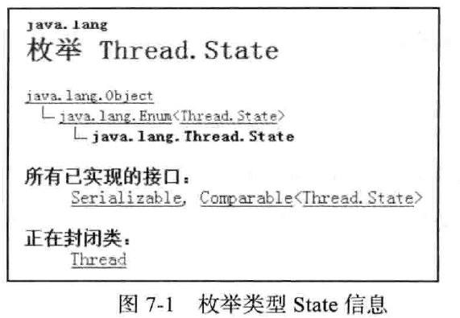
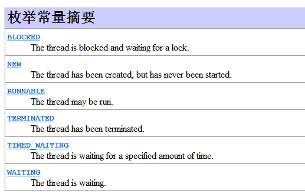
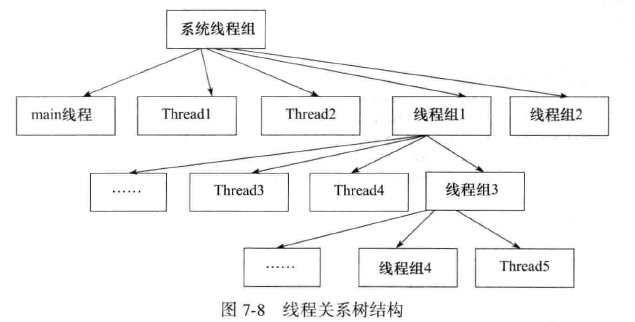

# 第 7 章 拾遗增补

## 本章主要内容
	线程组的使用。
	如何切换线程状态。
	SimpleDataFormat 类与多线程的解决办法。
	如何处理线程的异常。

## 7.1 线程的状态
　　线程对象在不同的运行时期有不同的状态，状态信息就存在于 State 枚举类中，如下图：



　　每个枚举类型的解释如下图：



　　调用与线程有关的方法是造成线程状态改变的主要原因，其因果关系如下图：


　　在调用与线程有关的方法后，会进入不同的次线程状态，这些状态之间某些是可双向切换的，比如 WAITING 和 RUNNING 状态之间可以循环地进行切换；而有些是单向切换的，比如线程销毁后并不能自动进入 RUNNING 状态。

#### 7.1.1 验证 NEW、RUNNABLE 和 TERMINATED
　　首先验证的是 NEW、RUNNABLE 及 TERMINATED 状态，NEW 状态是线程实例化后还从未执行 start() 方法时的状态，而 RUNNABLE 状态是线程进入运行的状态，TERMINATED 是线程被销毁时的状态。

#### 7.1.2 验证 TIMED_WAITING
　　线程状态 TIMED_WAITING 代表线程执行了 Thread.sleep() 方法，呈等待状态，等待时间到达，继续向下运行。

　　执行 sleep() 方法后线程的状态枚举值就是 TIMED_WAITING。

#### 7.1.3 验证 BLOCKED
　　BLOCKED 状态出现在一个线程在等待锁的时候。

#### 7.1.4 验证 WAITING
　　状态 WAITING 是线程执行了 Object.wait() 方法后所处的状态。

　　执行 wait() 方法后线程的状态枚举值就是 WAITING。

## 7.2 线程组
　　可以吧线程归属到某一个线程组中，线程组中可以有线程对象，也可以有线程组，组中还可以有线程。这样的组织结构有些类似于树的形式。如下图：



　　线程组的作用是，可以批量的管理线程或线程组对象，有效地对线程或线程组对象进行组织。

#### 7.2.1 线程对象关联线程组：1 级关联
　　所谓的 1 级关联就是父对象中有子对象，但并不创建子孙对象。这种情况经常出现在开发中，比如创建一些线程时，为了有效地对这些线程进行组织管理，通常的情况下是创建一个线程组，然后再将部分线程归属到该组中。这样的处理可以对零散的线程对象进行有效的组织与规划。

#### 7.2.2 线程对象关联线程组：多级关联
　　所谓的多级关联就是父对象中有子对象，子对象中再创建子对象，也就是出现子孙对象的效果了。但是此种写法在开发中不太常见，如果线程树结构设计得非常复杂反而不利于线程对象的管理，但 JDK 却提供了支持多级关联的线程树结构。

　　线程必须启动然后才可以归到组中。

　　线程必须在运行状态才可以受组管理。

#### 7.2.3 线程组自动归属特性
　　自动归属就是自动归到当前线程组中。

　　方法 activeGroupCount() 取得当前线程组对象中的子线程组数量。

　　方法 enumerate() 的作用是将线程组中的子线程组以复制的形式拷贝到 ThreadGroup() 数组对象中。

　　在实例化一个 ThreadGroup 线程组 x 时如果不指定所属的线程组，则 x 线程组自动归到当前线程对象所属的线程组中，也就是隐式地在一个线程组中添加了一个子线程组。

#### 7.2.4 获取根线程组
　　JVM 的根线程组就是 system，再取其父线程组则出现空异常。

#### 7.2.5 线程组里加线程组
```
ThreadGroup newGroup = new ThreadGroup(Thread.currentThread().getThreadGroup(),"newGroup");

```

#### 7.2.6 组内的线程批量停止
　　通过将线程归属到线程组中，当调用线程组 ThreadGroup 的 interrupted() 方法时，可以将该组中的所有正在运行的线程批量停止。

#### 7.2.7 递归与非递归取得组内对象
```
//分配控件，但不一定全部用完
ThreadGroup[] listGroup1 = new ThreadGroup[Thread.currentThread().getThreadGroup().activeGroupCount()];
//传入 true 是递归取得子组及子孙组,false是只取子组
Thread.currentThread().getThreadGroup().enumerate(listGroup1,true);
```

## 7.3 使线程具有有序性
　　正常的情况下，线程在运行时多个线程之间执行任务的时机是无序的。可以通过改造代码的方式使它们运行具有有序性。

　　使用 synchronized 同步的方法让线程顺序执行。

## 7.4 SimpleDateFormat 非线程安全
　　类 SimpleDateFormat 主要负责日期的转换与格式化，但在多线程的环境中，使用此类容易造成数据转换及处理的不准确，因为 SimpleDateFormat 类并不是线程安全的。

#### 7.4.1 出现异常
　　使用单例的 SimpleDateFormat 类在多线程的环境中处理日期，极易出现日期转换错误的情况。

#### 7.4.2 解决异常方法 1
　　解决处理错误的方法就是创建了多个 SimpleDateFormat 类的实例。

#### 7.4.3 解决异常方法 2
　　ThreadLocal 类能使线程绑定到指定的对象。使用该类也可以解决多线程环境下 SimpleDateFormat 类处理错误的情况。

```
private static ThreadLocal<SimpleDateFormat> t1 = new ThreadLocal<SimpleDateFormat>();
```

## 7.5 线程中出现异常的处理
　　

## 7.6 线程组内处理异常
　　

## 7.7 线程异常处理的传递
　　

## 7.8 本章总结
　　


