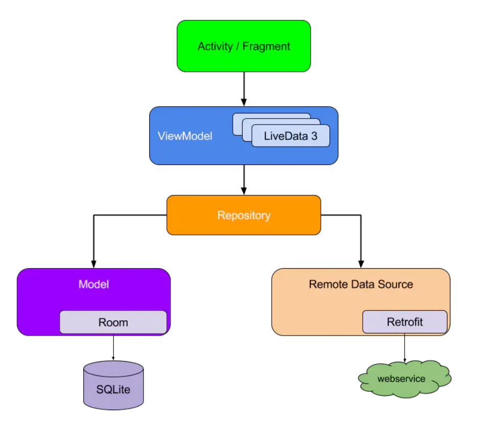

# 第 1 章 什么是 Jetpack

### 1.1. 简介

Jetpack 是一套库、工具和指南，可以帮助开发者更轻松地编写优质应用。这些组件可以帮助开发者遵循最佳做法、让开发者摆脱编写样板代码的工作并假话复杂任务，以便开发者将精力集中放在所需的代码上。

### 1.2. 特性

1.  **加速开发** 组件可以单独采用（不过这些组件是为协同工作而构建的），同时利用 Kotlin 语言功能帮助开发者提高工作效率。
2. **消除样板代码** Android Jetpack 可管理繁琐的 Activity（如后台任务、导航和生命周期管理），以便开发者可以专注于如何让自己的应用出类拔萃。
3. **构建高质量的强大应用** Android Jetpack 组件围绕现代化设计实践构建而成，具有向后兼容性，可以减少崩溃和内存泄漏。

### 1.3. 分类

**Archtecture(架构组件)可帮助您设计稳健、可测试且易维护的应用。**

1. **Data Binding**: 是一种支持库，借助该库，可以以声明方式将可观察数据绑定到界面元素。
2. **Lifecycles**: 管理 Activity 和 Fragment 的生命周期，能够帮助开发者轻松的应对 Activity/Fragment 的生命周期变化问题，帮助开发者生成更易于维护的轻量级代码。
3. **LiveData**：在底层数据库更改时通知视图，是可观察的数据持有者类。与常规的可观察对象不同，LiveData 具有生命周期感知功能（例如 Activity，Fragment 或 Service 的生命周期）。
4. **Navigation**：处理应用内导航所需的一切。
5. **Paging**：逐步从您的数据源按需加载信息，帮助开发者一次加载和显示小块数据。按需加载部分数据可减少网络带宽和系统资源的使用。
6. **Room**：流程地访问 SQLite 数据库。在 SQLite 上提供了一个抽象层，以在利用 SQLite 的全部功能的同时允许更健壮的数据库访问。
7. **ViewModle**：以注重生命周期的方式管理界面相关的数据。ViewModel 类允许数据幸免于配置更改（例如屏幕旋转）。通常和 DataBinding 配合使用，为开发者实现 MVVM 架构提供了强有力的支持。
8. **WorkManager**：管理 Android 的后台作业，即使应用程序退出或设备重新启动，也可以轻松地调度预期将要运行的可延迟异步任务。

**Foundation（基础组件）可提供横向功能，例如向后兼容性、测试和 Kotlin 语言支持。**

1. **Android KTX**：编写更简洁、惯用的 Kotlin 代码，是一组 Kotlin 扩展程序。优化了供 Kotlin 使用的 Jetpack 和 Android 平台 API。旨在让开发者利用 Kotlin 语言功能（例如扩展函数/属性、lambda、命名参数和参数默认值），以更简洁、更愉悦、更惯用的方式使用 Kotlin 进行 Android 开发。Android KTX 不会向现有的 Android API 添加任何新功能。
2. **AppCompat**：帮助较低版本的 Android 系统进行兼容。
3. **Auto**：有助于开发 Android Auto 应用的组件。是 Google 推出的专为汽车所设计之 Android 功能，旨在取代汽车制造商之原生车载系统来执行 Android 应用与服务并访问与存取 Android 手机内容。
4. **Benchmark**：从 Android Studio 中快速检测基于 Kotlin 或 Java 的代码。
5. **Multidex**：为具有多个 DEX 文件的应用提供支持。
6. **Security**：按照安全最佳做法读写加密文件和共享偏好设置。
7. **Test**：用于单元和运行时界面测试的 Android 测试框架。
8. **TV**：有助于开发 Android TV 应用的组件。
9. **Wear OS by Google**：有助于开发 Wear 应用的组件。

**Behavior（行为组件）可帮助您的应用与标准 Android 服务（如通知、权限、分享和 Google 助理）相集成。**

1. **CameraX**：简化相机应用的开发工作。它提供一致且易于使用的 API 界面，适用于大多数 Android 设备，并可向后兼容至 Android 5.0（API 级别 21）。
2. **DownloadManager**：是一项系统服务，可处理长时间运行的 HTTP 下载。客户端可以请求将 URI 下载至特定的目标文件。下载管理器将在后台进行下载，处理 HTTP 交互，并在出现故障或在连接更改和系统重新启动后重试下载。
3. **Media & playback**：用于媒体播放和路由（包括 Google Cast）的向后兼容 API。
4. **Notifications**：提供向后兼容的通知 API，支持 Wear 和 Auto。
5. **Permissions**：用于检查和请求应用权限的兼容性 API。
6. **Preferences**：创建交互式设置屏幕，建议使用 AndroidX Preference Library 将用户可配置设置集成至应用中。
7. **Sharing**：提供适合应用操作栏的共享操作。
8. **Slices**：是 UI 模版，可以通过启用全屏应用程序之外的互动来帮助用户更快地执行任务，即可以创建在应用外部显示应用数据的灵活界面。

**UI（界面组件）可提供微件和辅助程序，让您的应用不仅简单易用，还能带来愉悦体验。了解有助于简化界面开发的 Jetpack Compose。**

1. **Animation & transitions**：使开发者可以轻松地为两个视图层次结构之间的变化设置动画。该框架通过随时间更改其某些属性值在运行时为视图设置动画。该框架包括英语常见效果的内置动画，并允许开发者创建自定义动画和过渡生命周期回调。
2. **Emoji**：使 Android 设备保持最新的最新 emoji 表情，开发者的应用程序用户无需等待 Android OS 更新即可获取最新的表情符号。
3. **Fragment**：Activity 的模块化组成部分。
4. **Layout**：定义应用中的界面结构。可以在 xml 中声明界面元素，也可以在运行时实例化布局元素。
5. **Palette**：是一个支持库，可从图像中提取突出的颜色，以帮助开发者创建视觉上引人入胜的应用程序。开发者可以使用调色板库设计布局主题，并将自定义颜色应用于应用程序中的视觉元素。

### 1.4. 应用架构

