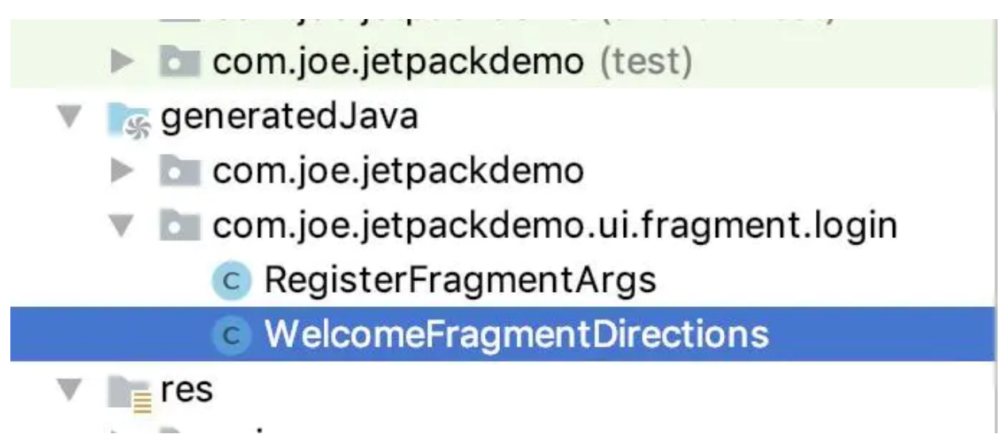
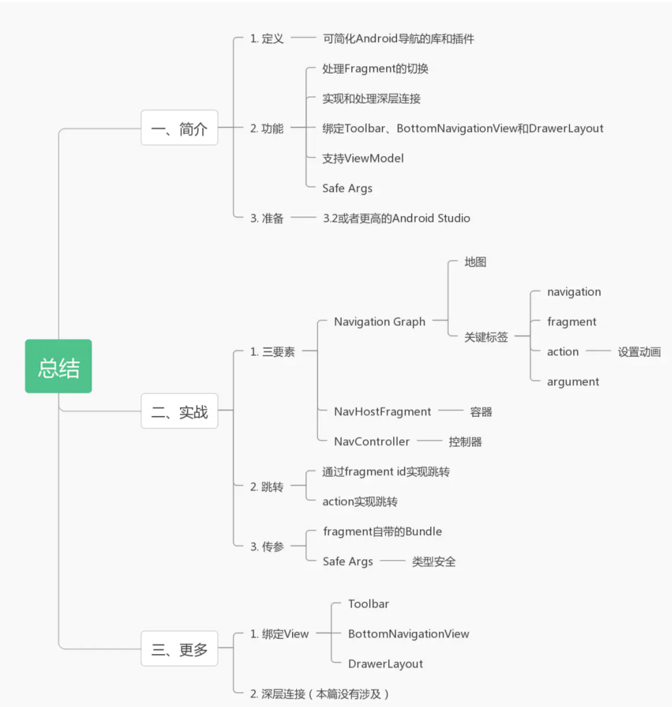

# 第 2 章 Android Jetpack - Navigation

### 2.1. 前言

2019 年谷歌开发者大会宣布亲儿子 Kotlin 成为开发 Android 的首选语言。

### 2.2. 简介

#### 2.2.1. 定义

Navigation 是什么呢？谷歌的介绍视频上说 `Navigation 是一个可简化 Android 导航的库和插件`

更确切的来说，Navigation 是用来管理 Fragment 的切换，并且可以通过可视化的方式，看见 App 的交互流程。

#### 2.2.2. 优点

* 处理 Fragment 的切换
* 默认情况下正确处理 Fragment 的前进和后退
* 为过渡和动画提供标准化的资源
* 实现和处理深层连接
* 可以绑定 Toolbar、BottomNavigationView 和 ActionBar 等
* SafeArgs（Gradle 插件）数据传递时提供类型安全性
* ViewModel 支持

#### 2.2.3. 准备

需要 3.2 或者更高的 Android Studio。

#### 2.2.4. 学习方式

最好的学习方式仍然是通过官方文档，官方的学习地址：

谷歌官方教程：[Navigation Codelab](https://developer.android.com/codelabs/android-navigation#0)

谷歌官方文档：[Navigation](https://developer.android.google.cn/guide/navigation/navigation-principles?hl=zh-cn)

官方 Demo：[Demo 地址](https://github.com/android/codelab-android-navigation)

### 2.3. 实战

Navigation 中最关键的三要素，他们是：

| 名词                               | 解释                                                         |
| ---------------------------------- | ------------------------------------------------------------ |
| Navigation Graph(New XML resource) | 这是一个新的资源文件，用户在可视化界面可以看出他能够到达的 Destination(用户能够到达的屏幕界面)，以及流程关系。 |
| NavHostFragment(Layout XML view)   | 当前 Fragment 的容器                                         |
| Navcontroller(Kotlin/Java object)  | 导航的控制者                                                 |

可以将 Navigation Graph 看作一个地图，NavHostFragment 看作一个车，以及 NavController 看作车中的方向盘，Navigation Graph 中可以看出各个地点（Destination）和通往各个地点的路径，NavHostFragment 可以到达地图中的各个目的地，但是决定到什么目的地还是方向盘 NavController。

#### 2.3.1. 第一步 添加依赖

模块层的 `build.gradle` 文件需要添加：

```groovy
ext.navigationVersion = "2.0.0" 
dependencies { 
  //... 
  implementation "androidx.navigation:navigation-fragment-ktx:$rootProject.navigationVersion" 
  implementation "androidx.navigation:navigation-ui-ktx:$rootProject.navigationVersion" 
}
```

如果要使用 SafeArgs 插件，还要在项目目录下的 build.gradle 文件添加：

```groovy
buildscript { 
  ext.navigationVersion = "2.0.0" 
  dependencies { 
    classpath "androidx.navigation:navigation-safe-args-gradle- plugin:$navigationVersion" 
  } 
}
```

以及模块下面的 build.gradle 文件添加：

```groovy
apply plugin: 'kotlin-android-extensions' 
apply plugin: 'androidx.navigation.safeargs'
```

#### 2.3.2. 第二步 创建 navigation 导航

1. 创建基础目录：资源文件 res 目录下创建 navigation 目录 -> 右击 navigation 目录 New 一个 Navigation resource file

2. 创建一个 Destination，如果说 navigation 是导航工具，Destination 是目的地，在此之前，已经有 WelcomeFragment、LoginFragment 和 RegisterFragment。

   添加 Destination 除了可视化界面之外，仍然有必要看一下里面的内容组成，login_navigation.xml

   ```xml
   <navigation 
               ... 
               android:id="@+id/login_navigation"
               app:startDestination="@id/welcome"> 
     <fragment 
               android:id="@+id/login"
               android:name="com.joe.jetpackdemo.ui.fragment.login.LoginFragment"
               android:label="LoginFragment"
               tools:layout="@layout/fragment_login" /> 
     <fragment 
               android:id="@+id/welcome" 
               android:name="com.joe.jetpackdemo.ui.fragment.login.WelcomeFragment"
               android:label="LoginFragment" 
               tools:layout="@layout/fragment_welcome"> 
       <action .../> 
       <action .../> 
     </fragment> 
     <fragment 
               android:id="@+id/register" 
               android:name="com.joe.jetpackdemo.ui.fragment.login.RegisterFragment"
               android:label="LoginFragment" 
               tools:layout="@layout/fragment_register" >
       <argument .../> 
     </fragment> 
   </navigation>
   ```

   navigation标签的属性：

   | 属性                 | 解释           |
   | -------------------- | -------------- |
   | app:startDestination | 默认的起始位置 |

#### 2.3.3. 第三步 建立 NavHostFragment

创建一个新的 LoginActivity，在 activity_login.xml 文件中：

```xml
<androidx.constraintlayout.widget.ConstraintLayout ...> 
  <fragment 
            android:id="@+id/my_nav_host_fragment"
            android:name="androidx.navigation.fragment.NavHostFragment"
            app:navGraph="@navigation/login_navigation"
            app:defaultNavHost="true"
            android:layout_width="match_parent"
            android:layout_height="match_parent"/> </androidx.constraintlayout.widget.ConstraintLayout>
```

有几个属性需要解释一下：

| 属性                      | 解释                                                         |
| ------------------------- | ------------------------------------------------------------ |
| android:name              | 值必须是 androids.navigation.fragment.NavHostFragment，声明这是一个 NavHostFragment |
| app:navGraph              | 存放的是第二步建好导航的资源文件，也就是确定了 Navigation Graph |
| app:defaultNavHost="true" | 与系统的返回按钮相关联                                       |

#### 2.3.4. 第四步 界面跳转、参数传递和动画

在  welcomeFragment 中，点击登录和注册按钮可以分别跳转到 LoginFragment 和 RegisterFragment 中。

这里使用了两种方式实现：

**方式一利用 ID 导航**

目标：WelcomeFragment 携带 Key 为 name 的数据跳转到 LoginFragment，LoginFragment 接收后显示。`Have a account？Login` 按钮的点击事件如下：

```kotlin
btnLogin.setOnClickListener { 
  // 设置动画参数 
  val navOption = navOptions { 
    anim {
      enter = R.anim.slide_in_right 
      exit = R.anim.slide_out_left 
      popEnter = R.anim.slide_in_left 
      popExit = R.anim.slide_out_right 
    } 
  }
  // 参数设置 
  val bundle = Bundle() 
  bundle.putString("name","TeaOf")
  findNavController().navigate(R.id.login, bundle,navOption) }
```

后续 LoginFragment 的接收代码比较简单，直接获取 Fragment 中的 Bundle 即可。

**方式二 利用 Safe Args**

目标：WelcomeFragment 通过 Safe Args 将数据传给 RegisterFragment，RegisterFragment 接收后显示。再看一下已经展示过的 login_navigation.xml：

```xml
<navigation ...> 
  <fragment ... /> 
  <fragment android:id="@+id/welcome" >
    <action android:id="@+id/action_welcome_to_login"
            app:destination="@id/login"/> 
    <action android:id="@+id/action_welcome_to_register"
            app:enterAnim="@anim/slide_in_right"
            app:exitAnim="@anim/slide_out_left"
            app:popEnterAnim="@anim/slide_in_left"
            app:popExitAnim="@anim/slide_out_right"
            app:destination="@id/register"/> 
  </fragment> 
  <fragment android:id="@+id/register" ... >
    <argument android:name="EMAIL"
              android:defaultValue="2005@qq.com"
              app:argType="string"/> 
  </fragment> 
</navigation>
```

navigation 目录下的 login_navigation.xml 资源文件中的 action 标签和 argument 标签。解释一下：

* action 标签

| 属性            | 作用                                            |
| --------------- | ----------------------------------------------- |
| app:destination | 跳转完成到达的 frgament 的 Id                   |
| app:popUpTo     | 将 fragment 从栈中弹出，直到某个 Id 的 fragment |

* argument 标签

| 属性                 | 作用       |
| -------------------- | ---------- |
| android:name         | 标签名字   |
| app:argType          | 标签的类型 |
| android:defaultvalue | 默认值     |

点击 Android Studio 中的 Mark Project 按钮，可以发现系统生成了两个类：



系统生成的类 welcomeFragment 中的 `JOIN US` 按钮点击事件：

```kotlin
btnRegister.setOnClickListener { 
  val action = WelcomeFragmentDirections 
  .actionWelcomeToRegister() 
  .setEMAIL("TeaOf1995@Gamil.com")
  findNavController().navigate(action) 
}
```

RegisterFragment 中的接收：

```kotlin
override fun onViewCreated(view: View, savedInstanceState: Bundle?) { 
  super.onViewCreated(view, savedInstanceState) 
  // ... 
  val safeArgs:RegisterFragmentArgs by navArgs() 
  val email = safeArgs.email mEmailEt.setText(email) 
}
```

需要提及的是，如果不用 safe Args，action 可以由 Navigation.createNavigateOnClickListener(R.id.next_action, null) 方式生成。

### 2.4. 更多

Navigation 可以绑定 menus、drawers 和 bottom navigation，以 bottom navigation 为例，先在 navigation 目录下新创建了 main_navigation.xml，接着新建了 MainActivity，下面则是 activity_main.xml：

```xml
<LinearLayout ...> 
  <fragment android:id="@+id/my_nav_host_fragment"
            android:name="androidx.navigation.fragment.NavHostFragment"
            android:layout_width="match_parent"
            app:navGraph="@navigation/main_navigation"
            app:defaultNavHost="true" 
            android:layout_height="0dp" 
            android:layout_weight="1"/>
  <com.google.android.material.bottomnavigation.BottomNavigationView
            android:id="@+id/navigation_view"
            android:layout_width="match_parent" 
            android:layout_height="wrap_content"
            android:background="@android:color/white" 
            app:itemIconTint="@color/colorAccent" 
            app:itemTextColor="@color/colorPrimary" 
            app:menu="@menu/menu_main"/> 
</LinearLayout>
```

MainActivity 中的处理也十分简单：

```kotlin
class MainActivity : AppCompatActivity() { 
  lateinit var bottomNavigationView: BottomNavigationView 
  override fun onCreate(savedInstanceState: Bundle?) { 
    //... 
    val host: NavHostFragment = supportFragmentManager.findFragmentById(R.id.my_nav_host_fragment) as NavHostFragment 
    val navController = host.navController 
    initWidget() 
    initBottomNavigationView(bottomNavigationView,navController) 
  }
  
  private fun initBottomNavigationView(bottomNavigationView: BottomNavigationView, navController: NavController) { 
    bottomNavigationView.setupWithNavController(navController) 
  }
  
  private fun initWidget() { 
    bottomNavigationView = findViewById(R.id.navigation_view)
  }
}
```

### 2.5. 总结



