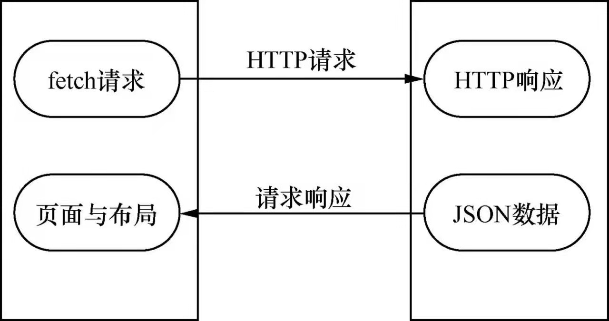

# 第 12 章 电影购票 App 开发实战

## 12.1. 实战项目概述

## 12.2. 项目搭建全流程解析

### 12.2.1. 项目初始化

​		项目中设计的一些第三方库的简介。

* react-navigation：React Native 社区开源的一个页面导航库。
* react-native-gesture-handler：Expo 公司推出的一款用于处理拖曳、捏合缩放和旋转手势的开源库。
* react-native-swiper：轮播组件库。
* react-native-vector-icons：矢量图标库。
* react-native-video：视频播放组件库，可以实现各种视频播放效果。

### 12.2.2. 网络请求

​		在 React Native 应用开发中，可以使用 fetch() 方法来完成网络请求。fetch 被称为下一代 AJAX 技术，内部采用 Promise 方式来处理请求数据，相比传统的  XMLHttpRequest 请求方式，fetch 请求方式更加简洁高效，并且还能有效地解决多层级链式调用的问题。

​		下图是一个典型的 fetch 网络交互原理示意图。



​		fetch 提供了强大且灵活的功能集，可以帮助开发者快速地完成网络数据交互。具体来说，只需要向 fetch() 方法传入请求地址，然后使用 then() 方法等待返回解决即可。如果请求出现任何异常还可以使用 catch() 方法来捕获异常。

​		目前，fetch 支持的请求方式有 GET、POST、PUT 和 DELETE 4 种。

​		由于 fetch 请求是一个异步的过程，所以使用时还需要调用 then() 方法等待服务器端返回结果，然后根据返回的结果进行其他操作。

### 12.2.3. 开发主页

​		在平时的开发工作中，对一些相同或相似的页面进行合理的封装可以有效防止代码冗余，提高代码的复用率。

### 12.2.4. 自定义导航栏

​		在移动应用开发中，如果一个应用由多个页面构成，那么多个页面之间的跳转通常是通过路由来实现的。在 React Native 早期的版本中，可以使用官方提供的 Navigator 组件来实现移路由跳转。不过从 0.44 版本开始，官方移除了 Navigator 组建，并建议使用 react-navigation 库来替换 Navigator 组件。

​		react-navigation 导航库提供了 3 种基本的导航方式，即页面导航、Tab 导航和抽屉导航。借助 react-navigation 库，开发者可以快速地实现页面导航功能。不过，有时候 react-navigation 提供的通用导航栏样式，并不能满足所有的应用开发需求，此时就需要自定义导航栏。

​		在自定义组件时，出于通用性和可扩展性的考虑，事件处理并不需要固定写死，而是在使用时动态传入，并交由使用方处理。

## 12.3. 业务功能开发

### 12.3.1. 电影列表

​		在 React Native 开发中，实现列表的方式有很多，推荐使用官方提供的 ListView 或 FlatList 组件来实现。

### 12.3.2. 电影搜索

### 12.3.3. 电影详情

### 12.3.4. 视频播放

​		由于 React Native 官方并没有提供视频播放组件，所以要在 React Native 应用中实现视频播放功能，要么使用原生移动系统的视频播放组件，要么直接使用第三方开源库。

​		选择 react-native-video 开源库作为视频播放的组件库。react-native-video 是 React Native 社区开源的一款视频播放组件库，可以实现各种视频播放效果，并且支持二次封装。

### 12.3.5. 刘海屏与全面屏

​		为了适配刘海屏，React Native 在 0.50.1 版本推出了 SafeAreaView 组件，不过此组件只适用于 iOS 平台。

​		由于 Android 设备的型号比较多，且刘海屏的样式也各不相同，所以，在适配 Android 设备的刘海屏时需要考虑的情况也比较多。Andriod 官方已经在 Android P 版本为开发者提供了刘海屏模拟器。

​		适配刘海屏的基本原则是，对于刘海区域不进行绘制。

​		继刘海屏之后，全面屏手机也逐渐流行起来，由于全面屏手机的高度比大于之前 Android 默认最大宽高比（ 即 16:9 ），所以不适配全面屏的话，全面屏手机的上下部分就会留下空白空间。

​		由于 iOS 还没有发布全面屏手机，所以只需要适配 Android 的全面屏即可。对于 Android 全面屏，Android 官方给出的适配方案是，通过提高应用所支持的最大屏幕纵横比即可。

​		打开原生 Android 工程的 AndroidManifest.xml 文件，并在 meta-data 节点添加如下配置即可。

```xml
<meta-data
	android:name="android.max_aspect"
	android:value="ratio_float" />
```

​		其中，ratio_float 表示宽高比，为浮点数，官方建议为 2.1 或更大的值。如果在 Android Manifest.xml 进行配置，那么配置是对整个应用起作用的。如果只针对某个具体的 Activity 进行适配，那么只需要将 Activity 的 resizeableActivity 属性设置为 true 即可。

```xml
<activity
	android:name=".MainActivity"
	android:resizeableActivity="true"
	... // 省略其他属性
	>
</activity>
```

​		除了提高最大屏幕纵横比之外，适配 Android 全面屏时还需要在布局界面进行优化。

## 12.4. 本章小结

​		作为目前被广泛使用的移动跨平台开发框架，React Native 已经被国内外各大互联网公司使用并推广。React Native 之所以如此受欢迎，不仅是因为它可以有效提高开发效率，还因为它天生就具备热更新能力。


