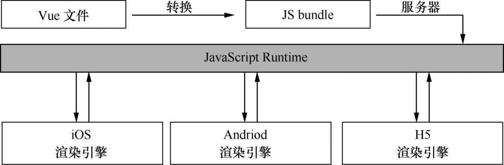
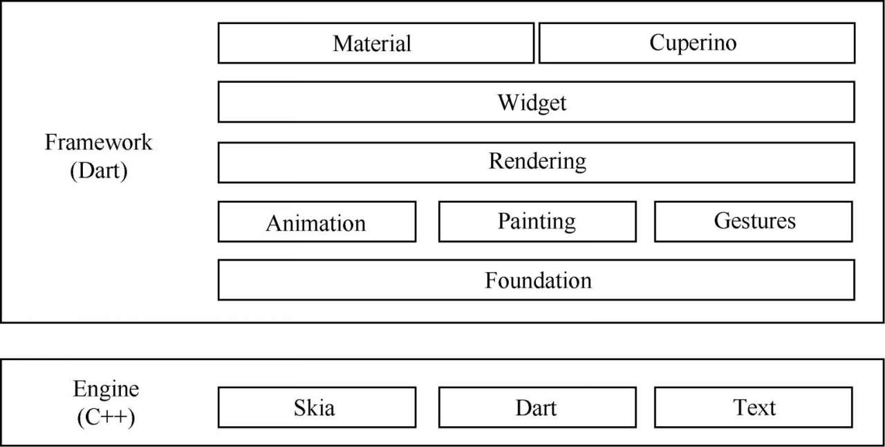
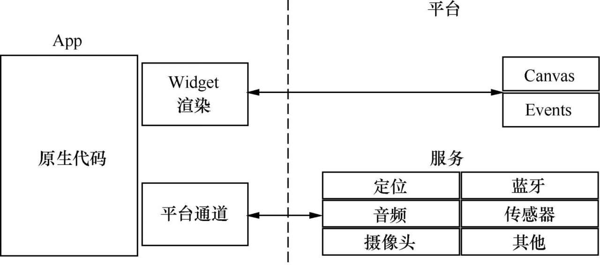
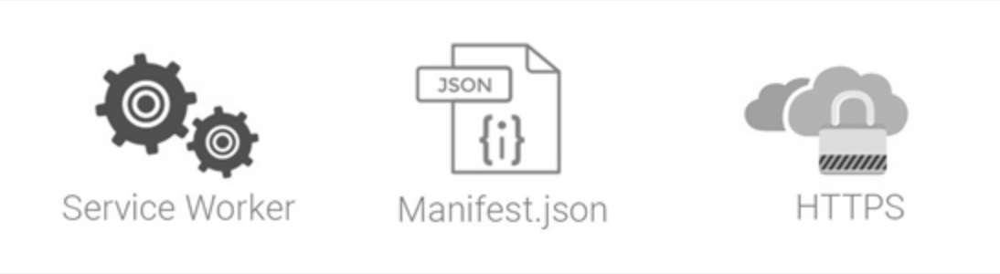
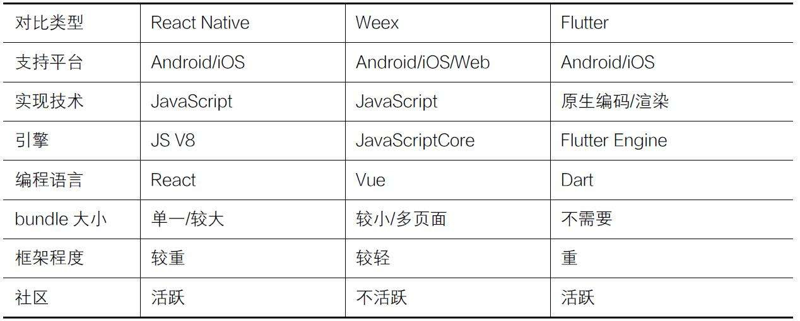

# 第 1 章 React Native 背景知识

## 前言

　　目前，比较流行的移动跨平台技术主要有两种：一种是基于 Web 浏览器的 Hybrid 技术方案，采用此种方案时只需要使用 HTML 及 JavaScript 进行开发，然后使用浏览器加载即可完成应用的跨平台；另一种则是通过在不同平台上运行某种语言的虚拟机来实现应用跨平台，此种方案也是移动跨平台技术的主流方案，主要技术有 Flutter、React Native 和 Weex。

　　React Native 抛弃了传统的浏览器加载的思路，转而采用曲线调用原生 API 的思路来实现渲染界面，从而获得媲美原生应用的体验。

　　当然，React Native 也并不是没有缺点，比较明显的缺点有首次加载慢、调试不友好等，不过这些问题都可以通过社区得到很好的解决。并且，官方正在对 React Native 进行大规模的重构和优化，相信在不久的将来，React Native 会更加完善。

## 1.1. React Native 的诞生与发展

　　在 React 框架的基础上，React Native 框架前台的 JavaScript 代码通过调用封装的 Android 和 iOS 原生平台的代码来实现界面的渲染操作，因而调用原生代码的 App 的性能远远优于使用 HTML 5 开发的 App 性能。

 　　React Native 使用流行的 JSX 语法来替代常规的 JavaScript 语法，提高了代码的可阅读性。JSX 是一种 XML 和 JavaScript 结合的扩展语法，因此对于熟悉 Web 前端开发的技术人员来说，只需很少的学习就可以上手移动应用开发。

　　React Native 框架的优势在于，只需要使用一套代码就可以覆盖多个移动平台，真正做到 “ Learn Once，Write Anywhere ”。React Native 框架底层使用的是 JavaScriptCore 引擎，基本上只需要更新一下 JavaScript 文件，即可完成整个 App 的更新操作，非常适合用来开发 App 的热更新功能。

## 1.2. 移动跨平台技术横评

### 1.2.1. 阿里巴巴 Weex

　　Weex 是由阿里巴巴技术团队研发的一套移动跨平台技术框架，初衷是解决移动开发过程中频繁发版和多端研发难题。使用 Weex 提供的跨平台技术，开发者可以很方便地使用 Web 技术来构建高性能、可扩展的原生级别的性能体验，并支持在 Android、iOS、YunOS 和 Web 等多平台上部署。

　　作为一个前端跨平台技术框架，Weex 建立了一套源码转换以及原生端与 JavaScript 通信的机制。Weex 框架表面上是一个前端框架，但实际上它串联了从本地开发、云端部署到资源分发的整个链路。

　　具体来说，在开发阶段编写一个 .we 文件，然后使用 Weex 提供的 weex-toolKit 转换工具将 .we 文件转换为 JS bundle，并将生成的 JS bundle 上传部署到云端，最后通过网络请求或预下发的方式加载至用户的移动客户端应用中。同时，集成了 Weex SDK 的客户端接收到 JS bundle 文件后门，调用本地的 JavaScript 引擎执行环境执行相应的 JS bundle，并将执行过程中产生的各种命令发送到原生端进行洁面渲染，这个工作流程如下图所示。

　　如上图所示，Weex 框架中最核心的部分就是 JavaScript Runtime。当需要执行渲染操作时：在 iOS 环境下，使用基于 JavaScriptCore 内核的 JavaScript 引擎。

　　当 JS bundle 从服务器下载完成之后，Weex 的 Android、iOS 和 HTML 5 会运行相应的 JavaScript 引擎来执行 JS bundle，同时向终端的渲染层发送渲染指令，并调用客户端的渲染引擎进行视图渲染、事件绑定和处理用户交互等操作。

　　由于 Android、iOS 和 HTML 5 等终端最终使用的是原生的渲染引擎，也就是说使用同一套代码在不同终端上展示的样式是相同的，并且 Weex 最终使用原生组件来渲染视图，所以在体验上要比传统的 WebView 方案好很多。

　　尽管 Weex 已经提供了开发者所需要的常用组件和模块，但面对丰富多样的移动应用研发需求，这样常用基础组件还是远远不能满足开发的需求，因此 Weex 提供了灵活自由的扩展能力，开发者可以根据自身的情况开发自定义组件和模块，从而丰富 Weex 生态。

### 1.2.2. 谷歌 Flutter

　　Flutter 是谷歌技术团队开源的移动跨平台技术框架，其历史最早可以追溯到 2015 年的 Sky 项目。该项目可以同时运行在 Android、iOS 和 fuchsia 等包含 Dart 虚拟机的平台上，并且性能无限接近原生。React Native 和 Weex 使用 JavaScript 作为编程语言，使用平台自身引擎渲染界面，而 Flutter 直接选择 2D 绘图引擎库 Skia 来渲染界面。

　　如下图所示，Flutter 框架主要由 Framework 层和 Engine 层组成，基于 Framework 开发的 App 最终会运行在 Engine 层上。其中，Engine 是 Flutter 提供的独立虚拟机，正是由于它的存在，Flutter 程序才能运行在不同的平台上，实现跨平台运行。

　　与 React Native 和 Weex 使用原生控件渲染界面不同，Flutter 使用 Engine 来绘制 Widget（部件），即 Flutter 显示的单元，并且 Dart 代码会通过 AOT 编译为平台的原生代码，进而与平台直接通信，不需要 JavaScript 引擎的桥接，也不需要原生平台的 Dalvik 虚拟机，如下图所示。

　　同时，Flutter 的 Widget 采用现代响应式框架架构，而 Widget 是不可变的，仅支持一帧，并且每一帧上的内容不能直接更新，需要通过 Widget 的状态来间接更新。在 Flutter 中，无状态和有状态 Widget 的核心特性是相同的，Flutter 会重新构建视图的每一帧，通过 State 对象，Flutter 就可以跨帧存储状态数据并恢复它。

### 1.2.3. 谷歌 PWA

　　PWA，全称 Progressive Web App，是谷歌技术团体发布的渐进式 Web 开发技术。PWA 结合了一系列的现代 Web 技术，使用多种技术来增强 Web App 的功能，最终可以让 Web 应用呈现出媲美原生应用的体验。

　　作为一种全新的 Web 技术方案，PWA 的正常工作需要一些重要的技术组件，它们协同工作并为传统的 Web 应用程序注入活力，如下图所示。

　　其中，Service Worker 表示离线缓存文件，其本质是 Web 应用程序与浏览器之间的代理服务器，可以在网络可用时作为浏览器和网络间的代理，也可以在离线或者网络极差的环境下使用离线的缓冲文件。

　　Manifest 则是 W3C 的技术规范，它定义了基于 JSON 的清单，为开发人员提供一个放置与 Web 应用程序关联的元数据的集中地点。Manifest 是 PWA 开发中的重要一环，它为开发人员控制应用程序提供了可能。

### 1.2.4. 对比与分析

　　在当前诸多的跨平台方案中，React Native、Weex 和 Flutter 无疑是优秀的。而从不同的维度来看，三大跨平台框架又有各自的优点和缺点，如下表所示。

　　如上表所示，React Native、Weex 采用的技术方案大体相同，它们都使用 JavaScript 作为编程语言，然后通过中间层转换为原生组件，再利用原生渲染引擎执行渲染操作。Flutter 直接使用 Skia 开渲染视图，并且 Flutter Widget 使用现代响应式框架来构建，和平台没有直接的关系。就目前跨平台技术来看，JavaScript 在跨平台开发中的应用可谓占据了半壁江山，大有 “ 一统天下 ” 的趋势。

　　从性能方面来说，Flutter 的性能理论是更好的，React Native 和 Weex 次之，并且都好于传统的 WebView 方案。但从目前的实际应用来看，它们之间并没有太大的差距，性能体验上的差异并不明显。

　　从社群和社区来看，React Native 和 Flutter 无疑更活跃，React Native 经过多年发展已经成长为跨平台开发的实际领导者，并拥有丰富的第三方库和开发群体。Flutter 作为最近才火起来的跨平台技术方案，还处于快速更新测试阶段，商用案例也很少。

## 1.3. 本章小结

　　目前，移动跨平台开发作为移动开发的重要组成部分，是移动开发者必须掌握的技能。在移动互联网领域，主流的移动跨平台技术主要有 React Native、Weex、Flutter 和 PWA 等。