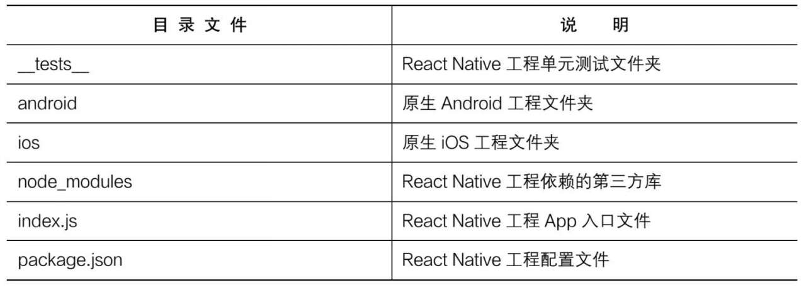

# 第 2 章 React Native 入门基础

## 2.1. React Native 环境搭建

　　通常，搭建 React Native 开发环境需要安装以下几个工具。

* Node.js：React Native 需要借助 Node.js 来创建和运行 JavaScript 代码。
* 原生开发工具及环境：React Native 的运行需要依赖原生 Android 和 iOS 环境，因此需要安装原生 Android 和 iOS 开发环境。
* 辅助工具：代码编辑器 Vistual Studio Code 或 WebStorm，远程调试工具 Chrome 浏览器等。

### 2.1.1. 安装 Node.js

### 2.1.2. 安装 Android 环境

### 2.1.3. 安装 iOS 环境

### 2.1.4. 安装 React Native

## 2.2. React Native 开发工具

　　Visual Studio Code 和 WebStorm。

## 2.3. React Native 快速上手

### 2.3.1. 初始化项目

　　React Native 工具目录文件表：

### 2.3.2. 运行项目

### 2.3.3. 调试项目

### 2.3.4. 修改默认项目

## 2.4. 本章小结

　　本章主要从环境搭建、开发工具、项目创建、运行和调试等方面介绍了 React Native 开发中的基础知识。

