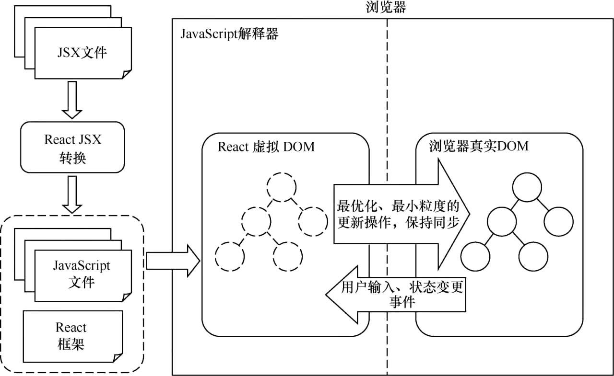

# 第 4 章 React 技术详解

## 4.1. React 简介

　　React 作为目前流行的前端三大框架之一，其主要作用是为 MVC 模式中的视图（View）层构建界面视图。除此之外，React 还可以以插件的形式作用于 Web 应用程序的非视图部分，实现与其他 JavaScript 框架的整合。

　　React 框架的设计思想非常独特，并且性能出众、代码逻辑简单，因此越来越多的前端开发人员开始使用它来开发前端项目。

　　同时，为了减少传统前端开发中直接操作 DOM 带来的昂贵开销，React 转而使用虚拟 DOM 来操作 DOM 的更新。

　　下图清晰地展示了 React 框架的基本结构，描述了 React 底层与浏览器的沟通机制。



　　文档对象模型，简称 DOM，是 W3C 组织推荐的处理可扩展标志语言的标准编程接口。在 HTML 网页开发中，页面对象被描述成一个树形结构，而用来表示文档结构对象的标准模型就称为 DOM。

　　在 React 框架中，为了解决页面元素的更新问题，React 底层设计了一个虚拟 DOM。此虚拟 DOM 与页面真实 DOM 进行映射，当数据变化时，React 就会重新否见整个 DOM 树，并通过底层的 diff 算法找到 DOM 的差异部分，然后浏览器只需要更新变化的部分即可。虚拟 DOM 是 React 框架中一个比较核心的内容，是 React 出色性能的根本。

　　除了性能方面的考虑外，React 引入虚拟 DOM 的意义还在于提供了一种新的开发方式，即借助虚拟 DOM 技术来实现服务器端应用、Web 应用和移动手机应用的跨平台开发。

　　在 React 框架中，还有一个比较重要的概念，即数据的单向流动，数据默认从父节点传递到子节点。具体来说，父节点数据通过 props 传递到子节点，如果父节点的 props 值发生了改变，那么其所有的子节点也会执行重新渲染操作。这样设计的好处是，使得组件足够扁平，更加便于维护。

##  4.2. React 组件详解

### 4.2.1. React 组件基本知识

　　在 React 的组件构成中，按照状态来分，可以分为有状态组件和无状态组件。
　　所谓无状态组件，指的是没有状态控制的组件，只做纯静态展示。无状态组件是最基本的组件存在形式，它由 props 属性和 render 渲染函数构成。由于不涉及状态的更新，所以这种组件的复用性也最强。

　　有状态组件是在无状态组件的基础上增加了组件内部状态管理。之所以被称为有状态组件，是因为有状态组件通常会带有生命周期（lifecycle），用以在不同的时刻触发组件状态的更新，有状态组件被大量使用在业务逻辑开发中。

　　目前，React 支持 3 种方式来定义一个组件，如下所示。

* ES5 的 React.createClass 方式
* ES6 的 React.Component 方式
* 无状态的函数组件方式

　　随着 React 版本的持续升级，ES5 的 React.createClass 方式暴露的问题也越来越多。例如，使用 React.createClass 创建的组件，事件函数会自动绑定相关的函数，这样会导致不必要的性能开销，而 React.Component 则是有选择性地进行函数绑定，因此绑定操作需要开发者手动触发，不过好处是性能更强。

　　随着 ES6 语法的普及，React.createClass 也逐渐被 React.Component 方式替代。并且，使用 React.Component 方式创建的组件更符合面向函数编程思想，可读性也更强。

　　通过 React.createClass 和 React.Component 方式创建的组件都是有状态的组件，而如果要创建无状态组件则需要通过无状态的函数来创建。无状态组件是 React 在 0.14 版本新推出的一种组件形式，只负责数据展示。它的特点是不需要管理组件状态 state，数据直接通过 props 传入即可，这也符合 React 单向数据流的思想。

　　对于无状态组件的函数式声明方式，不仅可以提高代码的可读性，还能大大减少代码量，提高代码的复用率，箭头函数则是函数式编程的最佳搭档。

　　无状态组件一般会搭配高阶组件（简称 OHC）一起使用，高阶组件主要用来托管 state。Redux 框架就是通过 store 来管理数据源和组件的所有状态，其中所有负责展示的组件都使用无状态函数式写法。无状态组件也被大规模应用在大型应用程序中。

　　虽然无状态组件具有诸多的优势，但也是不是万能的。比如，无状态组件在被 React 调用之前，组件还没有被实例化，所以它不支持 ref 特性。

### 4.2.2. props

　　React 组件化的开发思路一直为人所称道，而组件最核心的两个概念莫过于 props 与 state，组件的最终呈现效果也是 props 和 state 共同作用的结果。总体来说，props 是组件对外的借口，而  state 则是组件对内的借口。一般强框下，props 是不变的。

　　在典型的 React 数据流模型中，props 时父子组件交互的唯一方式。

　　在 ES5 语法中，如果想要为组件的属性设置默认值，需要在 getDefaultProps() 方法中设置。

　　props 作为父子组件沟通的桥梁，为组件之间的通信和传值提供了重要手段。

　　如果父组件需要向子组件传递数据，只需要在组件中引入子组件，然后使用组件提供的 props 属性，即可向子组件参数数据。

### 4.2.3. state

　　如果说 props 是组件对外的接口，那么 state 就是组件对内的接口。state 作为组件的私有属性，只能被本组件访问和修改；而 props 对于使用它的组件来说是只读的，如果想要修改 props，只能通过组件的父组件修改。

　　React 把组件看成一个特殊的状态机，通过与用户的交互实现不同状态，进而渲染界面，让用户界面和数据保持一致。在 React 中，如果需要使用 state，就需要在组件的 constructor 中初始化相关的 state。

　　需要需要更新组件的 state，可以使用组件提供的 setState() 方法。

　　需要注意的是，在调用 setState 函数执行更新操作时，组件的 state 并不会立即改变，因为 setState 操作是异步的。setState 操作只是把要修改的状态放入一个队列中。出于性能原因，React 可能会对多次 setState 状态修改进行合并修正，所以当使用 {this.state} 获取状态时，可能并不是需要的那个 state。同理，也不能依赖当前的 props 来计算组件的下一个状态，因为 props 一般也是从父组件的 state 来获取的，依然无法确定组件在状态更新时的值。

　　同时，在调用 setState 修改组件状态时，只需要传入需要改变的状态变量即可，不必传入组件完整的 state，因为组件状态的更新是一个浅合并的过程。

### 4.2.4. ref

　　在典型的 React 数据流模型中，props 作为父子组件交互的最常见方式，主要通过父组件传递一个 props 值给子组件来实现。除了 props 方式外，在某些特殊的情况下还可以使用 ref 方式来修改子组件。

​		React 提供的 ref 属性，其本质就是调用 ReactDOM.render() 返回的组件实例，用来表示对组件真正实例的引用。具体使用时，可以将它绑定到组件的 render() 上，然后就可以用它输出组件的实例。

​		ref 不仅可以挂载到组件上，还可以作用于具体的 DOM 元素。具体来说，挂载组件使用 class 定义，表示对组件实例的引用，此时不能在函数式组件上使用 ref 属性，因为它们不能获取组件的实例。而挂载到 DOM 元素时，ref 则可以表示具体的 DOM 元素节点。

​		ref 支持两种调用方式：一种是设置回调函数，另一种是字符串的方式。其中，设置回调函数是官方推荐的方式，使用它可以更细致地控制 ref。使用回调函数的方式，ref 属性接收一个回调函数，它在组件被加载或卸载时将立即执行。具体来说，当给 HTML 元素添加 ref 属性后，ref 回调函数接收底层的 DOM 元素作为参数，当组件卸载时，ref 回调函数会接收一个 null 对象作为参数。

​		官方明确声明，不能在函数式声明组件中使用 ref，因为它们不能获取组件的实例。

​		在某些情况下，可能需要从父组件中访问子组件的 DOM  节点，那么可以在子组件中暴露一个特殊的属性给父组件调用。子组件接收一个函数作为 props 属性，同时将这个函数赋予到 DOM 节点作为 ref 属性，那么父组件就可以将它的 ref 回调传递给子级组件的 DOM。这种方式对于 class 声明的组件和函数式声明的组件都是适用的。

​		暴露 DOM 的 ref 属性除了方便在父组件中访问子组件的 DOM 节点，还可以实现多极组件的跨层级调用。

## 4.3. React 高阶组件

### 4.3.1. 定义与实现

​		所谓高阶组件，就是一个接收 React 组件作为参数，并返回一个新的 React 组件的组件。也就是说，高阶组件通过包裹被传入的 React 组件，经过一系列处理，最终返回一个相对增强的 React 组件。

​		高阶组件从本质上来说是一个函数，而不是一个组件。

​		同时，被定义的高阶组件还可以被其他普通组件使用。

​		如果在某个组件中多次使用同一个高阶组件，在调试的时候将会看到一大堆相同的高阶组件。为了解决同一个组件多次调用高阶组件的问题，使用时需要保留高阶组件的原有名称。

​		大多数情况下，特别是在视图组件比较多而容器组件比较少、交互复用性较低的情况下，高阶组件起不到什么作用。但是，掌握 React 高阶组件不仅可以提高代码的复用率，还可以降低代码的复杂度，优化代码的层次结构，因此是一项需要掌握的基础技术。

### 4.3.2. 分类

​		在 React 中，实现高阶组件主要有两种方式：属性代理和反向继承。其中，属性代理通过返回包裹原组件并添加额外功能来实现高阶组件；而反向继承则是通过返回即成原组件来控制 render 函数，进而实现高阶组件。

​		属性代理是最常见的高阶组件的实现方式，主要通过包裹组件并添加额外功能来完成。

​		反向继承主要通过类继承的方式来实现。相比属性代码，反向继承能够访问到的区域和权限更多。

​		反向继承则是通过继承 WrappedComponent 来实现。由于高阶组件被动继承 Wrapped Component，因此所有的调用都会反向。在反向继承方法时，高阶组件可以使用 WrappedComponent 的引用，既可以使用 WrappedComponent 组件的 state、props、生命周期和 render() 等，从而达到渲染不同输出结果的目的。

### 4.3.3. 命名与参数

​		在 React 开发中，当高阶组件包裹普通组件时，普通组件的名称和静态方法都会丢失，为了避免这种情况，此时需要为普通原始组件添加标识组件名称的 displayName 属性。

​		作为一种新的组件表现方式，高阶组件本质上是一个函数。既然高阶组件是一个函数，那么就可以通过传入不同的参数来得到不同的高阶组件，这一操作也被称为柯里化。

​		作为一种新的组件存在形式，高阶组件有效地解决了程序开发中的解耦和灵活性问题。但是高阶组件也不是万能的，它也存在着一系列问题，常见的如静态方法丢失和 ref 属性不能传递，因此在使用高阶组件时候应尽量遵循以下准则。

* 不要在组件的 render() 中使用高阶组件，也尽量避免在组件的其他生命周期方法中使用高阶组件。
* 如果需要使用被包装组件的静态方法，那么必须手动复制静态方法。
* ref 应避免传递给包装组件。

## 4.4. 组件通信

​		按照通信双方的关系，组件之间的通信大体可以分为：父子组件通信、跨级组件通信和兄弟组件通信。

### 4.4.1. 父子组件通信

​		父子组件通信是组件间通信的最常见方式之一，父子组件通信主要分为父组件向子组件通信和子组件向父组件通信两种。其中，父组件通过 props 将值传递给子组件，子组件则通过 this.props 得到父组件传递的数据，当子组件接收到父组件传递的数据后再进行相应的处理。

​		如果子组件要向父组件传递数据，则可以使用回调函数和自定义事件两种方式，其中，回调函数方式是最常见的。具体来说，父组件将一个函数作为 props 传递给子组件，然后子组件调用该回调函数便可以向父组件传值。

​		当然，也可以在子组件中自定义事件，然后在父组件中使用子组件自定义的事件来实现父子组件的数据传递。

### 4.4.2. 跨级组件通信

​		所谓跨级组件通信，就是父组件与子组件的子组件或者向更深层的子组件进行的通信。跨级组件通信主要有两种实现方式：使用组件 props 进行层层传递和使用 context 对象进行传递。

​		使用组件的 props 进行层层传递的方式就是只需要逐层传递 props 即可。但是使用此方式进行跨级组件通信会有一个致命的问题，即如果需要传递的组件结构较深时，那么中间的每一层组件都要去传递 props，增加了程序的复杂度，并且这些 props 对于中间组件来说往往是无用的。因此在实际开发中，并不建议使用这种方式。

​		使用 context 对象方式则可以解决组件嵌套过深的问题，context 相当于一个全局变量，可以把需要通信的内容放到全局变量中，这样不管嵌套有多深，都可以随意取用。使用 context 需要满足以下两个条件。

* 父组件需要声明支持 context，并提供一个函数来返回相应的 context 对象。
* 子组件声明需要使用的 context 对象，并提供需要使用的 context 属性的 PropTypes。

​		在父子组件通信模型中，如果是父组件向子组件单向通信，可以使用变量；如果是子组件向父组件通信，则可以由父组件提供一个回调函数，然后子组件调用该函数即可。

​		如果组件中使用了构造函数，为了不影响跨级组件通信，还需要在构造函数中传入第二个参数 context，并在 super 中调用父类构造函数时传入 context，否则会造成组件无法使用 context 的问题。

​		使用 context 虽然能够明显减少逐层传递带来的组件结构复杂性问题，但是过多地使用 context 会让代码变得更加混乱，因此使用 context 方式进行跨级组件通信时还需要考虑实际情况。

### 4.4.3. 非嵌套组件通信

​		非嵌套组件，就是没有任何包含关系的组件，包括兄弟组件以及不在同一个父级中的非兄弟组件。

​		对于非嵌套组件来说，实现通信主要有两种方式：利用共同父组件的 context 对象通信和自定义事件方式通信。

​		在 React 中，兄弟组件是不能直接通信的，而是需要通过状态提升的方式来实现兄弟组件的通信。也就是说，需要通过共同的父级组件来中转。不过，如果组件的层级较深，寻找公共的父组件并不是一件容易的事情，所以选择此方式时要慎重。

​		使用自定义事件是解决非嵌套组件通信的另一种方式。自定义事件方式是一种典型的发布/订阅模型，主要通过给事件对象上添加监听器和出发事件来实现组件之间的通信。具体来说，在组件的 componentDidMount 中声明一个自定义事件，需要取消订阅事件时，在组件的 componentWillUnmount 中取消。

​		非嵌套组件通信使用的自定义事件方式是典型的发布/订阅模式，即通过向事件对象上添加监听器和触发事件来实现组件之间的通信。

​		在组件通信的过程中，由于通信双方的关系不同，所以在选择通信方式的时候要根据具体的情况来选择。

## 4.5. 事件处理

### 4.5.1. 事件监听与处理

​		React 的事件处理方式与传统的 HTML 事件处理非常相似，但是有一些语法上的区别。

* React 事件使用驼峰命名法，而非全部小写。
* 在 React 中，可以传递一个函数作为事件的处理函数，而不是一个简单的字符串。

​		在 React 开发中，事件处理是一件非常容易的事情。开发者不需要手动调用浏览器原生的 addEventListener 进行事件监听，只需要给 React 元素添加 onClick、onKeyDown 函数即可。

​		与传统的 HTML 事件处理不同，React 的事件处理不能通过返回 false 来阻止某个默认行为。

​		之所以有区别，是因为 React 并没有使用浏览器的原生事件，而是在虚拟 DOM 的基础上实现了一套合成事件，即 SyntheticEvent。因此 React 的事件处理程序接受的是 SyntheticEvent 的实例。在 React 中，如果要中断某个事件行为，可以通过调用合成事件的 stopPropagation() 或 preventDefault() 来实现。

​		stopPropagation() 是阻止事件传递的，目的是不让事件分派到其他 Document 节点，但是默认事件依然会执行。preventDefault() 则是为了通知浏览器不要执行与事件关联的默认动作。调用此函数时，事件会被继续传递。

### 4.5.2. event 事件与 this 关键字

​		和浏览器处理事件监听一样，React 处理事件监听时也需要传入一个 event 对象，这个 event 对象和浏览器 event 对象所包含的方法和属性基本一致。不同的是，React 的 event 对象并不是由浏览器提供的，而是 React 在虚拟 DOM 的基础上实现的一套合成事件。由于 React 提供的合成事件完全符合 W3C 标准，因此在事件层次上完全兼容浏览器，并且拥有和原生浏览器事件一样的接口。

​		bind 是 React 在 ES5 版本引入的事件监听机制，语法格式如下。

```js
Function.prototype.bind()
```

​		当调用函数对象的 bind() 方法时，系统会重新创建一个函数，新函数的行为和原函数一样，因为它是由指定的 this 和初始化参数改造的原函数。如果要给事件处理函数传递多个参数，则可以使用 bind(this,arg1,arg2,...) 格式。

### 4.5.3. EventEmitter 在 React Native 中的应用

​		在 React Native 跨平台开发中，特别是和原生平台混合开发时，经常会遇到跨平台通信的问题。如果原生模块想要向 JavaScript 层传递消息，可以使用官方提供的 EventEmitter。具体来说，iOS 使用的是 RCTEventEmitter，Android 使用的是 RCTDeviceEventEmitter。

​		对于 Android 环境来说，如果原生模块想要给 JavaScript 层发送消息，则需要借助 DeviceEventEmitter 模块，Android 原生模块使用 RCTDeviceEventEmitter 来注册事件，然后通过 emit() 来提交事件。

## 4.6. React Hook

### 4.6.1. Hook 简介

​		React Hook 是 React 16.7.0-alpha 版本推出的新特性，目的是解决 React 的状态共享问题。与其称之为状态共享，不如说是逻辑复用可能会更恰当，因为 React Hook 只共享数据处理逻辑，并不会共享数据本身。

​		在 React 应用开发中，状态管理是组件开发必不可少的内容。以前，为了对状态进行管理，常见做法是使用类组件或者直接使用 redux 等状态管理框架。

​		现在，开发者可以直接使用 React Hook 提供的 State Hook 来处理状态；针对那些已经存在的类组件，也可以使用 State Hook 很好地进行重构。

​		useState() 是 React 自带的一个 hook 函数，它的作用就是声明状态变量。

### 4.6.2. Hook API

​		React 提供了两种组件，即函数组件和类组件。函数组件是一个普通的 JavaScript 函数，接收 props 对象并返回 React 元素，函数组件更符合 React 数据驱动试图的开发思想。不过，函数组件一直以来都因为缺乏类组件，如状态、生命周期等特性。也正是这些原因，函数组件得不到开发者的青睐，尔 Hook 的出现就是让函数式组件拥有了类组件的特性。

​		为了让函数组件拥有类组件的状态、生命周期等特性，React 提供了 3 个核心 API：State Hook、Effect Hook 和 Custom Hook。

​		useState 就是 React 提供的最基础、最常用的 Hook，主要用来定义和管理本地状态。

​		函数组件中如果存在多个状态，既可以通过一个 useState 声明对象类型的状态，也可以通过 useState 多次声明状态。

​		如果要在函数组件中处理多层嵌套数据逻辑，使用 useState 就显得力不从心了。好在开发者可以使用 React 提供的 useReducer 来处理此类问题。

​		useReducer 接收 reducer 函数和默认值两个参数，并返回当前状态 state 和 dispatch 函数的数组，使用方式与 Redux 状态管理框架基本一致。不同之处在于，Redux 的默认值是通过给 reducer 函数设置默认参数的方式给定的。

​		在 React 函数式编程思想中，生命周期函数组件的基本特性之一，是连接函数式和命令式的桥梁。开发者可以根据组件所处生命周期函数的不同来执行不同的操作，如网络请求和操作 DOM。

​		每次执行组件更新时，useEffect 中的回调函数都会被调用。并且在点击按钮执行更新操作时，还会触发 componentWillUnmount 生命周期。之所以在重新绘制前执行销毁操作，是为了避免造成内存泄漏。

​		因此可以将 useEffect 视为 componentDidMount、componentDidUpdate 和 componentWillUnmount 的组合，并用它关联函数组件的生命周期。

​		需要说明的是，类组件的 componentDidMount 或 componentDidUpdate 生命周期函数都是在 DOM 更新后同步执行的，但 useEffect 并不会在 DOM 更新后同步执行。因此，使用 useEffect 并不会阻塞浏览器更新界面。如果需要模拟生命周期的同步执行，可以使用 React 提供的 useLayoutEffect Hook。

### 4.6.3. 自定义 Hook

​		众所周知，要在类组件之间共享一些状态逻辑是非常麻烦的，常规的做法是通过高阶组件或者是函数属性来解决。不过，新版 React 允许开发者创建自定义 Hook 来封装共享状态逻辑，且不需要向组件树中增加新组件。

​		所谓自定义 Hook，其实就是指函数名以 use 开发并调用其他 Hook 的封装函数，自定义 Hook 的每个状态都是完全独立的。

​		相比于函数属性和高阶组件等方式，自定义 Hook 更加简洁易读，不仅如此，自定义 Hook 也不会引起组件嵌套的问题。

​		虽然 React Hook 有着诸多的优势，不过在使用 Hook 的过程中，需要注意一下两点。

* 不要在循环、条件或嵌套函数中使用 Hook，并且只能在 React 函数的顶层使用 Hook。

  这是因为 React 需要利用调用顺序来正确更新相应的状态，以及调用相应的生命周期函数。一旦在循环或条件分支语句中调用 Hook，就容易引起调用顺序的不一致，从而产生难以预料的后果。

* 只能在 React 函数式组件或自定义 Hook 中使用 Hook。

​		同时，为了避免在开发中引起低级错误，可以在项目中安装一个 eslint 插件。

​		借助于 React 提供的 Hook API，函数组件可以实现绝大部分类组件功能，并且 Hook 在共享状态逻辑、提供组件复用性上也具有一定的优势。可以预见的是，Hook 将是 React 未来发展的重要方向。

## 4.7. 本章小结

​		React Native 是 React 前端框架在移动平台的衍生产物。本章是 React 基础章节，主要从基础组件、高阶组件、组件通信和组件事件这几方面介绍了 React 框架知识，并且重点介绍了 React 提供的 Hook API，为深入学习 React Native 跨平台开发奠定基础。