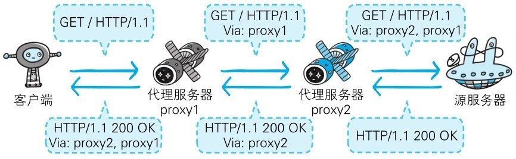

# 第 5 章 与 HTTP 协作的 Web 服务器

　　一台 Web 服务器可搭建多个独立域名的 Web 网站，也可作为通信路径上的中转服务器提升传输效率。

## 5.1 用单台虚拟主机实现多个域名

　　HTTP/1.1 规范允许一台 HTTP 服务器搭建多个 Web 站点。比如，提供 Web 托管服务（Web Hosting Service）的供应商，可以用一台服务器为多位客户服务，也可以以每位客户持有的域名运行各自不同的网站。这是因为利用了虚拟主机（Virtual Host，又称虚拟服务器）的功能。

　　即使物理层面只有一台服务器，但只要使用虚拟主机的功能，则可以假想已具有多台服务器。

　　在互联网上，域名通过 DNS 服务映射到 IP 地址（域名解析）之后访问目标网站。可见，当请求发送到服务器时，已经是以 IP 地址形式访问了。 

　　在相同的 IP 地址下，由于虚拟主机可以寄存多个不同主机名和域名的 Web 网站，因此在发送 HTTP 请求时，必须在 Host 首部内完整指定主机名或域名的 URI。

## 5.2 通信数据转发程序：代理、网关、隧道

　　HTTP 通信时，除客户端和服务器以外，还有一些用于通信数据转发的应用程序，例如代理、网关和隧道。它们可以配合服务器工作。

　　这些应用程序和服务器可以将请求转发给通信线路上的下一站服务器，并且能接收从那台服务器发送的响应再转发给客户端。

**代理**

　　代理是一种有转发功能的应用程序，它扮演了位于服务器和客户端 “ 中间人 ” 的角色，接收由客户端发送的请求并转发给服务器，同时也接收服务器返回的响应并转发给客户端。

**网关**

　　网关是转发其他服务器通信数据的服务器，接收从客户端发送来的请求时，它就像自己拥有资源的源服务器一样对请求进行处理。有时客户端可能都不会察觉，自己的通信目标是一个网关。

**隧道**

　　隧道是在相隔甚远的客户端和服务器两者之间进行中转，并保持双方通信连接的应用程序。

### 5.2.1 代理

　　代理服务器的基本行为就是接收客户端发送的请求后转发给其他服务器。代理不改变请求 URI，会直接发送给前方持有资源的目标服务器。 

　　持有资源实体的服务器被称为源服务器。从源服务器返回的响应经过代理服务器后再传给客户端。

 

图：每次通过代理服务器转发请求或响应时，会追加写入 Via 首部信息

　　在 HTTP 通信过程中，可级联多台代理服务器。请求和响应的转发会经过数台类似锁链一样连接起来的代理服务器。转发时，需要附加 Via 首部字段以标记出经过的主机信息。

　　使用代理服务器的理由有：利用缓存技术减少网络带宽的流量，组织内部针对特定网站的访问控制，以获取访问日志为主要目的，等等。

　　代理有多种使用方法，按两种基准分类。一种是是否使用缓存，另一种是是否会修改报文。

#### 5.2.1.1. 缓存代理

　　代理转发响应时，缓存代理（Caching Proxy）会预先将资源的副本（缓存）保存在代理服务器上。 当代理再次接收到对相同资源的请求时，就可以不从源服务器那里获取资源，而是将之前缓存的资源作为响应返回。 

#### 5.2.1.2. 透明代理

　　转发请求或响应时，不对报文做任何加工的代理类型被称为透明代理（Transparent Proxy）。反之，对报文内容进行加工的代理被称为非透明代理。

### 5.2.2 网关

　　网关的工作机制和代理十分相似。而网关能使通信线路上的服务器提供非 HTTP 协议服务。

　　利用网关能提高通信的安全性，因为可以在客户端与网关之间的通信线路上加密以确保连接的安全。比如，网关可以连接数据库，使用 SQL 语句查询数据。另外，在 Web 购物网站上进行信用卡结算时，网关可以和信用卡结算系统联动。 

### 5.2.3 隧道

　　隧道可按要求建立起一条与其他服务器的通信线路，届时使用 SSL 等加密手段进行通信。隧道的目的是确保客户端能与服务器进行安全的通信。 

　　隧道本身不会去解析 HTTP 请求。也就是说，请求保持原样中转给之后的服务器。隧道会在通信双方断开连接时结束。

　　通过隧道的传输，可以和远距离的服务器安全通信。隧道本身是透明的，客户端不用在意隧道的存在。

## 5.3 保存资源的缓存

　　缓存是指代理服务器或客户端本地磁盘内保存的资源副本。利用缓存可减少对源服务器的访问，因此也就节省了通信流量和通信时间。

　　缓存服务器是代理服务器的一种，并归类在缓存代理类型中。换句话说，当代理转发从服务器返回的响应时，代理服务器将会保存一份资源的副本。

　　缓存服务器的优势在于利用缓存可避免多次从源服务器转发资源。因此客户端可就近从缓存服务器上获取资源，而源服务器也不必多次处理相同的请求了。

### 5.3.1 缓存的有效期限 

　　即便缓存服务器内有缓存，也不能保证每次都会返回对同资源的请求。因为这关系到被缓存资源的有效性问题。 

　　即使存在缓存，也会因为客户端的要求、缓存的有效期等因素，向源服务器确认资源的有效性。若判断缓存失效，缓存服务器将会再次从源服务器上获取 “ 新 ” 资源。 

### 5.3.2 客户端的缓存

　　缓存不仅可以存在于缓存服务器内，还可以存在客户端浏览器中。以 Internet Explorer 程序为例，把客户端缓存称为临时网络文件（Temporary Internet File）。 

　　浏览器缓存如果有效，就不必再向服务器请求相同的资源了，可以直接从本地磁盘内读取。

　　另外，和缓存服务器相同的一点是，当判定缓存过期后，会向源服务器确认资源的有效性。若判断浏览器缓存失效，浏览器会再次请求新资源。 

#### 5.3.2.1. 在HTTP出现之前的协议

 　　在 HTTP 普及之间，也就是从互联网的诞生期至今，曾出现过各式各样的协议。在 HTTP 规范确立之际，制定者们参考了那些协议的功能。也有某些协议现在已经彻底退出了人们的视线。接下来，简单介绍一些这些协议。

##### 5.3.2.1.1. FTP（File Transfer Protocol）

　　传输文件时使用的协议。该协议历史久远，可追溯到 1973 年前后，比 TCP/IP 协议族的出现还要早。虽然它在 1995 年被 HTTP 的流量（Traffic）超越，但时至今日，仍被广泛沿用。 

##### 5.3.2.1.2. NNTP（Network News Transfer Protocol） 

　　用于 NetNews 电子会议室内传送消息的协议。在 1986 年前后出现，属于比较古老的一类协议。现在，利用 Web 交换信息已成主流，所以该协议已经不怎么使用了。

##### 5.3.2.1.3. Archie

　　搜索 anonymous FTP 公开的文件信息的协议。1990 年前后出现，现在已经不常使用。

##### 5.3.2.1.4. WAIS（Wide Area Information Servers）

　　以关键词检索多个数据库使用的协议。1991 年前后出现。由于现在已经被 HTTP 协议替代，也已经不怎么使用了。

##### 5.3.2.1.5. Gopher

　　查找与互联网连接的计算机内信息的协议。1991 年前后出现，由于现在已经被 HTTP 协议替代，也已经不怎么使用了。
