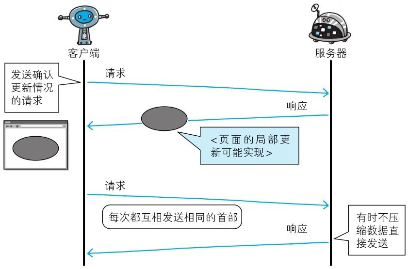
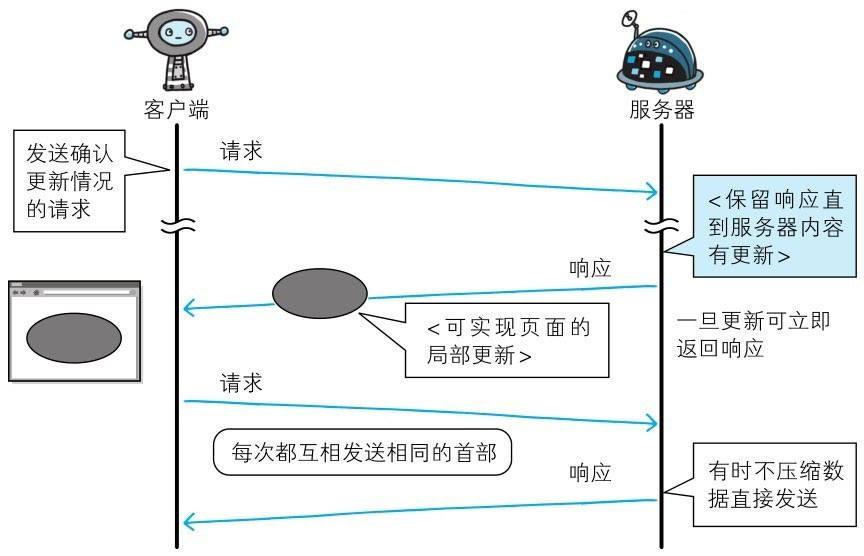
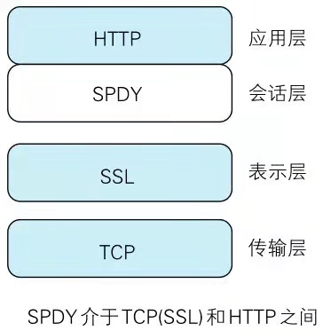
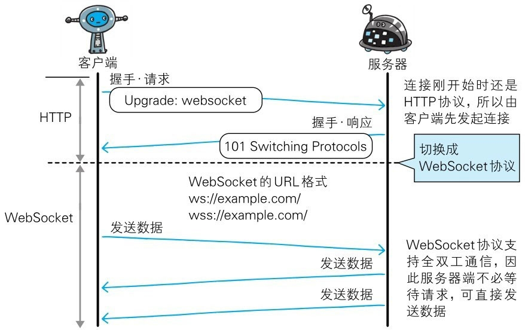
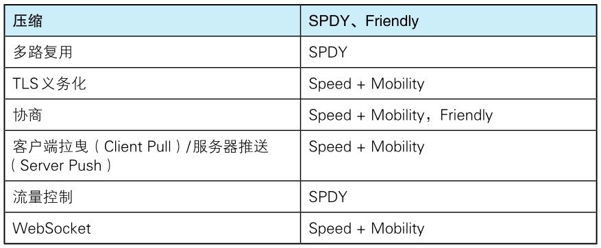
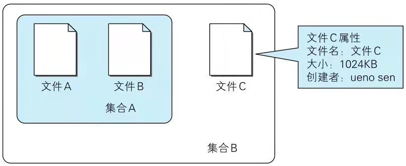

# 第 9 章 基于 HTTP 的功能追加协议

## 9.1. 基于 HTTP 的协议

　　在建立 HTTP 标准规范时，制定者主要想把 HTTP 当作传输 HTML 文档的协议。随着时代的发展，Web 的用途更具多样性，比如演化成在线购物网站、SNS（Social Networking Service，社交网络服务）、企业或组织内部的各种管理工具，等等。

　　而这些网站所追求的功能可通过 Web 应用和脚本程序实现。即使这些功能已经满足需求，在性能上却未必最优，这事因为 HTTP 协议上的限制以及自身性能有限。

　　HTTP 功能上的不足可通过创建一套全新的协议来弥补。可实目前基于 HTTP 的 Web 浏览器的使用环境已遍布全球，因此无法完全抛弃 HTTP。有一些新协议的规则是基于 HTTP 的，并在此基础上添加了新的功能。

## 9.2. 消除 HTTP 瓶颈的 SPDY

　　Google 在 2010 年发布了 SPDY，其开发目标旨在解决 HTTP 的性能瓶颈，缩短 Web 页面的加载时间（50%）。

### 9.2.1. HTTP 的瓶颈

　　在 Facebook 和 Twitter 等 SNS 网站上，几乎能够实时观察到海量用户公开发布的内容，这也是一种乐趣。当几百、几千万的用户发布内容时，Web 网站为了保存这些新增内容，在很端的时间内就会发生大量的内容更新。

　　为了尽可能实时地显示这些更新的内容，服务器上一有内容更新，就需要直接把那些内容反馈到客户端的界面上。虽然看起来挺简单的，但 HTTP 却无法妥善地处理好这项任务。

　　使用 HTTP 协议探知服务器上是否有内容更新，就必须频繁地从客户端到服务器端进行确认。如果服务器上没有内容更新，那么就会产生徒劳的通信。

　　若想在现有 Web 实现所需的功能，以下这些 HTTP 标志就会成为瓶颈。

* 一条连接上只可发送一个请求。
* 请求只能从客户端开始。客户端不可以接收除响应以外的指令。
* 请求/响应首部未经压缩就发送。首部信息越多延迟越大。
* 发送冗长的首部。每次互相发送相同的首部造成的浪费较多。
* 可任意选择数据压缩格式。非强制压缩发送。

#### 9.2.1.1. Ajax 的解决方法

　　Ajax （Asynchronous JavaScript and XML，异步 JavaScript 与 XML 技术）是一种有效利用 JavaScript 和 DOM(Document Object Model，文档对象模型 ) 的操作，以达到局部 Web 页面替换加载的异步通信手段。和以前的同步通信相比，由于它只更新一部分页面，响应中传输的数据量会因此而减少，这一优点显而易见。

　　Ajax 的核心技术是名为 XMLHttpRequest 的 API，通过 JavaScript 脚本语言的调用就能和服务器进行 HTTP 通信。借由这种手段，就能从已加载完毕的 Web 页面上发起请求，只更新局部页面。

　　而利用 Ajax 实时地从服务器获取内容，有可能会导致大量请求产生。另外，Ajax 仍未解决 HTTP 协议本身存在的问题。

#### 9.2.1.2. Comet 的解决方法

　　一旦服务器端有内容更新了，Comet 不会让请求等待，而是直接给客户端返回响应。这是一种通过延迟应答，模拟实现服务器端向客户端推送（Server Push）的功能。

　　通常，服务器端接收到请求，在处理完毕后就会立即返回响应，但为了实现推送功能，Comet 会先将响应置于挂起状态，当服务器端有内容更新时，再返回该响应。因此，服务器端一旦有更新，就可以立即反馈给客户端。

　　内容上虽然可以做到实时更新，但为了保留响应，一次连接的持续时间也变长了。期间，为了维持连接会消耗更多的资源。另外，Comet 也仍未解决 HTTP 协议本身存在的问题。

#### 9.2.1.3. SPDY 的目标

　　陆续出现的 Ajax 和 Comet 等提高易用性的技术，一定程度上使 HTTP 得到了改善，但 HTTP 协议本身的限制也令人有些束手无策。为了进行根本性的改善，需要有一些协议层面上的改动。

　　出于持续开发状态中的 SPDY 协议，正是为了在协议级别消除 HTTP 所遭遇的瓶颈。

### 9.2.2. SPDY 的设计与功能

　　SPDY 没有完全改写 HTTP 协议，而是在 TCP/IP 的应用层与传输层之间通过新加会话层的形式运作。同时，考虑到安全性问题，SPDY 规定通信中使用 SSL。

　　SPDY 以会话层的形式加入，控制对数据的流动，但还是采用 HTTP 建立通信连接。因此，可照常使用 HTTP 的 GET 和 POST 等方法、Cookie 以及 HTTP 报文等。

　　使用 SPDY 后，HTTP 协议额外获得以下功能。

* 多路复用流

  通过单一的 TCP 连接，可以无限制处理多个 HTTP 请求。所有请求的处理都在一条 TCP 连接上完成，因此 TCP 的处理效率得到提高。

* 赋予请求优先级

  SDPY 不仅可以无限制地并发处理请求，还可以给请求逐个分配优先级顺序。这样主要是为了在发送多个请求时，解决因带宽低而导致响应变慢的问题。

* 压缩 HTTP 首部

  压缩 HTTP 请求和响应的首部。这样一来，通信产生的数据包数量和发送的字节数就更少了。

* 推送功能

  支持服务器主动向客户端推送数据的功能。这样，服务器就直接发送数据，而不必等待客户端的请求。

* 服务器提示功能

  服务器可以主动提示客户端请求所需的资源。由于在客户端发现资源之前就可以获知资源的存在，因此在资源已缓存等情况下，可以避免发送不必要的请求。

### 9.2.3. SPDY 消除 Web 瓶颈了吗

　　希望使用 SPDY 时，Web 的内容端不必做什么特别改动，而 Web 浏览器及 Web 服务器都要为对应 SPDY 作出一定程度上的改动。有好几家 Web 浏览器已经针对 SPDY 做出了响应的调整。另外，Web 服务器也进行了实验性质的应用，但把该技术导入实际的 Web 网站却进展不佳。

　　因为 SPDY 基本上只是将单个域名（IP 地址）的通信多路复用，所以当一个 Web 网站上使用多个域名下的资源，改善效果就会受到限制。

　　SPDY 的确是一种可有效消除 HTTP 瓶颈的技术，但很多 Web 网站存在的问题并非仅仅是由 HTTP 瓶颈所导致。对 Web 本身的速度的提升，还应该从其他可细致钻研的地方入手，比如改善 Web 内容的编写方式等。

## 9.3. 使用浏览器进行全双工通信的 WebSocket

　　利用 Ajax 和 Comet 技术进行通信可以提升 Web 的浏览速度。但问题在于通信若使用 HTTP 协议，就无法彻底解决瓶颈问题。WebSocket 网络技术正是为解决这些问题而实现的一套新协议及 API。

### 9.3.1. WebSocket 的设计与功能

　　WebSocket，即 Web 浏览器与 Web 服务器之间全双工通信标准。其中，WebSocket 协议由 IETF 定为标准，WebSocket API 由 W3C 定为标准。仍在开发中的 WebSocket 技术主要是为了解决 Ajax 和 Comet 里 XMLHttpRequest 附带的缺陷所引起的问题。

### 9.3.2. WebSocket 协议

　　一旦 Web 服务器与客户端之间建立起 WebSocket 协议的通信连接，之后所有的通信都依靠这个专用协议进行。通信过程中可互相发送 JSON、XML、HTML 或图片等任意格式的数据。

　　由于是建立在 HTTP 基础上的协议，因此连接的发起方仍是客户端，而一旦确立 WebSocket 通信连接，不论服务端还是客户端，任意一方都可直接向对方发送报文。

　　WebSocket 协议的主要特点：

* 推送功能

  支持由服务器向客户端推送数据的推送功能。这样，服务器可直接发送数据，而不必等待客户端的请求。

* 减少通信量

  只要建立起 WebSocket 连接，就希望一直保持连接状态。和 HTTP 相比，不但每次连接时的总开销减少，而且由于 WebSocket 的首部信息很小，通信量也相应减少了。

#### 9.3.2.1. 握手-请求

​		为了实现 WebSocket 通信，需要用到 HTTP 的 Upgrade 首部字段，告知服务器通信协议发生改变，以达到握手的目的。

​		Sec-WebSocket-Key 字段哪记录着握手过程中必不可少的键值。Sec-WebSocket-Protocol 字段内记录使用的子协议。

​		子协议按 WebSocket 协议标准在连接分开使用时，定义那些连接的名称。

#### 9.3.2.2. 握手-响应

​		对于之前的请求，返回状态码 101 Switching Protocols 的响应。

​		Sec-WebSocket-Aceept 的字段值是由握手请求中的 Sec-WebSocket-Key 的字段值生成的。

​		成功握手确立 WebSocket 连接之后，通信时不再使用 HTTP 的数据帧，而采用 WebSocket 独立的数据帧。

#### 9.3.2.3. WebSocket API

​		JavaScript 可调用 “ The WebSocket API ”（http://www.w3.org/TR/websockets/，由 W3C 标准制定）内提供的 WebSocket 程序接口，以实现 WebSocket 协议下全双工通信。

## 9.4. 期盼已久的 HTTP/2.0

​		HTTP/2.0 在 2014 年 11 月实现标准化。

​		HTTP/2.0 的目标时改善用户在使用 Web 时的速度体验。

​		HTTP Speed+Mobility 由微软公司起草，是用来改善并提高移动端通信时的通信速度和性能的标准。它建立在 Google 公司提出的 SPDY 与 WebSocket 的基础之上。

​		Network-Friendly HTTP Upgrade 主要是移动端通信时改善 HTTP 性能的标准。

​		HTTP/2.0 围绕着主要的 7 项技术进行讨论，现阶段（2012 年 8 月 13 日），大都倾向于采用以下协议的技术。但是，讨论仍在持续，所以不能排除会发生重大改变的可能性。

​		注：HTTP Spend+Mobility 简写为 Speed+Moblity,Network-Friendly HTTP Upgrade 简写为 Friendly。

## 9.5. Web 服务器管理文件的 WebDAV

​		WebDEV（Web-based Distributed Authoring and Versioning，基于万维网的分布式创作和版本控制）是一个可对 Web 服务器上的内容直接进行文件复制、编辑等操作的分布式文件系统。它作为扩展 HTTP/1.1 的协议定义在 RFC4918。

​		除了创建、删除文件等基本功能，它还具备文件创建者管理、文件编辑过程中禁止其他用户内容覆盖的加锁功能，以及对文件内容修改的版本控制功能。

​		使用 HTTP/1.1 的 PUT 方法和 DELETE 方法，就可以对 Web 服务器上的文件进行创建和删除操作。可是出于安全性及便捷性等考虑，一般不使用。

### 9.5.1. 扩展 HTTP/1.1 的 WebDAV

​		针对服务器上的资源，WebDAV 新增加了一些概念，如下所示。

* 集合（Co lection）：是一种统一管理多个资源的概念。以集合为单位可进行各种操作。也可实现类似集合的集合这样的叠加。
* 资源（Resource）：把文件或集合称为资源。
* 属性（Property）：定义资源的属性。定义以 “ 名称 = 值 ” 的格式执行。
* 锁（Lock）：把文件设置成无法编辑状态。多人同时编辑时，可防止在同一时间进行内容写入。

### 9.5.2. WebDAV 内新增的方法及状态码

​		WebDAV 为实现远程文件管理，向 HTTP/1.1 中追加了以下这些方法。

* PROPFIND：获取属性

* PROPPATCH：修改属性

* MKCOL：创建集合

* COPY：复制资源及属性

* MOVE：移动资源

* LOCK：资源加锁

* UNLOCK：资源解锁

  ​	为配合扩展的方法，状态码也随之扩展。

* 102 Processing：可正常处理请求，但目前时处理中状态。
* 207 Multi-Status：存在多种状态
* 422 Unprocessible Entity：格式正确，内容有误
* 423 Locked：资源已被加锁
* 424 Failed Dependency：处理与某请求关联的请求失败，因此不再维持依赖关系
* 507 Insufficient Storage：保存空间不足

