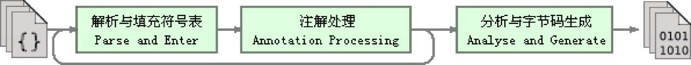
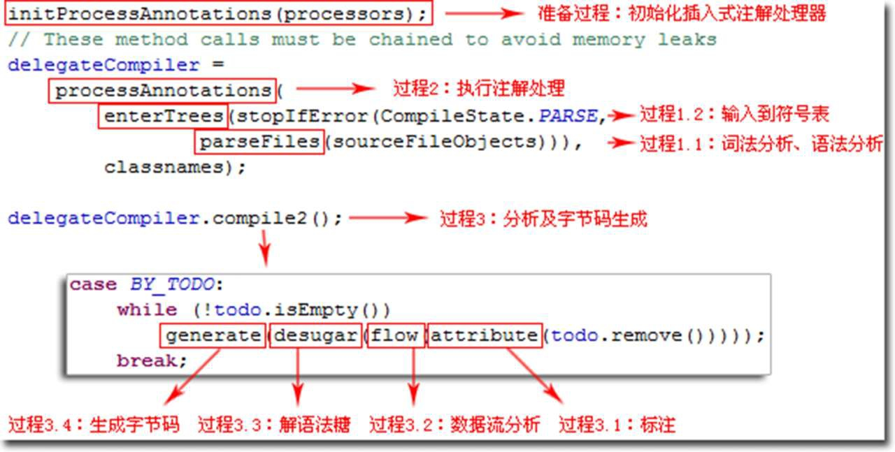

# 第 10 章 前段编译与优化

## 10.1 概述

　　一些比较有代表性的编译器产品：

* 前端编译器：JDK 的 Javac、Eclipse JDT 中的增量式编译器（ ECJ ）。
* 即时编译器：HotSpot 虚拟机的 C1、C2 编译器，Graal 编译器。
* 提前编译器：JDK 的 Jaotc、GNU Compiler for the Java（GCJ）、Excelsior JET。

　　本章中的全部“编译期”和“编译器”都仅限于第一类编译过程。

　　Java 中即时编译器在运行期的优化过程，支撑了程序执行效率的不断提升；而前端编译器在编译期的优化过程，则是支撑着程序员的编码效率和语言使用者的幸福感的提高。

## 10.2 Javac 编译器

　　Javac 编译器就是一个由 Java 语言编写的程序。

### 10.2.1 Javac 的源码与调试

　　在 JDK 6 以前，Javac 并不属于标准 Java SE API 的一部分，它实现代码单独存放在 tools.jar 中，要在程序中使用的话就必须把这个库放到类路径上。

　　在 JDK 6 中，Javac编译器的实现代码晋升称为标准 Java 类库之一，它的源码被改为放在 JDK_SRC_HOME/langtools/src/share/classes/com/sun/tools/javac 中。

　　到了 JDK 9 时，Javac 编译器就被挪到了 jdk.compiler 模块（ 路径为： JDK_SRC_HOME/src/jdk.compiler/share/classes/com/sun/tools/javac ）里面。

　　Javac 编译器除了 JDK 自身的标准类库外，就只引用了 JDK_SRC_HOME/langtools/src/share/classes/com/sun/* 里面的代码。

　　Access Restriction 错误是由于 Eclipse 为了避免开发人员引用非标准 Java 类库可能导致的兼容性问题，在 “JRESystem Library” 设置中默认包含了一系列的代码访问规则（Access Rules），如果代码中引用了这些访问规则所禁止引用的类，就会提示这个错误。可以通过添加一条允许访问 JAR 包中所有类的访问规则来解决该问题。

　　Class 文件编译过程在某种程度上是与具体的 JDK 或编译器实现相关的。

　　从 Javac 代码的总体结构来看，编译过程大致可以分为 1 个准备过程和 3 个处理过程，它们分别如下所示：

1. 准备过程：初始化插入式注解处理器。

2. 解析与填充符号表过程，包括：

   * 词法、语法分析。

     将源代码的字符流转变为标记集合，构造出抽象语法树。

   * 填充符号表。

     产生符号地址和符号信息。

3. 插入式注解处理器的注解处理过程：插入式注解处理器的执行阶段。

4. 分析与字节码生成过程，包括：

   * 标注检查。

     对语法的静态信息进行检查。

   * 数据流及控制流分析。

     对程序动态运行过程进行检查。

   * 解语法糖。

     将简化代码编写的语法糖还原为原有的形式。

   * 字节码生成。

     将前面各个步骤所生成的信息转化成字节码。

　　上述 3 个处理过程里，执行插入式注解时又可能会产生新的符号，如果有新的符号产生，就必须转回到之前的解析、填充符号表的过程中重新处理这些新符号，从总体来看，三者之间的关系与交互顺序如下图所示：

 

 

　　把上述处理过程对应到代码中，Javac 编译动作的入口是 com.sun.tools.javac.main.JavaCompiler 类，上述 3 个过程的代码逻辑集中在这个类的 compile() 和 compile2() 方法里，其中主体代码如下图所示，整个编译过程主要的处理由图中标注的 8 个方法来完成。

 

### 10.2.2 解析与填充符号表

　　解析过程由图中的 parseFiles() 方法（图中的过程1.1）来完成，解析过程包括了经典程序编译原理中的词法分析和语法分析两个步骤。

 #### 10.2.2.1 词法、语法分析

　　词法分析是将源代码的字符流转变为标记（Token）集合的过程，单个字符是程序编写时的最小元素，但标记才是编译时的最小元素。关键字、变量名、字面量、运算符都可以作为标记。

　　在 Javac 的源码中，词法分析过程由 com.sun.tools.javac.parser.Scanner 类来实现。

　　语法分析是根据标记序列构造抽象语法树的过程，抽象语法树（Abstract Syntax Tree，AST）是一种用来描述程序代码语法结构的树形表示方式，抽象语法树的每一个节点都代表着程序代码中的一个语法结构（Syntax Construct），例如包、类型、修饰符、运算符、接口、返回值甚至连代码注释等都可以是一种特定的语法结构。

　　在 Javac 的源码中，语法分析过程由 com.sun.tools.javac.parser.Parser 类实现，这个阶段产出的抽象语法树是以 com.sun.tools.javac.tree.JCTree 类表示的。

　　经过词法和语法分析生成语法树以后，编译器就不会再对源码字符流进行操作了，后续的操作都建立在抽象语法树之上。

#### 10.2.2.2 填充符号表

　　完成了语法分析和词法分析之后，下一个阶段是对符号表进行填充的过程，也就是图中 enterTrees() 方法（图中注释的过程 1.2）要做的事情。

　　符号表（Symbol Table）是由一组符号地址和符号信息构成的数据结构。

　　符号表中所登记的信息在编译的不同阶段都要被用到。譬如在语义分析的过程中，符号表所登记的内容将用于语义检查（如检查一个名字的使用和原先的声明是否一致）和产生中间代码，在目标代码生成阶段，当对符号名进行地址分配时，符号表是地址分配的直接依据。

　　在 Javac 源代码中，填充符号表的过程由 com.sun.tools.javac.comp.Enter 类实现，该过程的产出物是一个待处理列表，其中包含了每一个编译单元的抽象语法树的顶级节点，以及 packageinfo.java（如果存在的话）的顶级节点。

### 10.2.3 注解处理器

　　JDK 5 之后，Java语言提供了对注解（Annotations）的支持。

　　在 JDK 6 中设计了一组被称为 “ 插入式注解处理器 ” 的标准 API，可以提前至编译期对代码中的特定注解进行处理，从而影响到前端编译器的工作过程。把插入式注解处理器看作一组编译器的插件，当这些插件工作时，允许读取、修改、添加抽象语法树中的任意元素。

　　如果这些插件在处理注解期间对语法树进行过修改，编译器将回到解析及填充符号表的过程重新处理，直到所有插入式注解处理器都没有再对语法树进行修改为止，每一次循环过程称为一个轮次（Round）。

　　有了编译器注解处理的标准 API 后，程序员的代码才有可能干涉编译器的行为，由于语法树中的任意元素，甚至包括代码注释都可以在插件中被访问到，所以通过插入式注解处理器实现的插件在功能上有很大的发挥空间。

　　在 Javac 源码中，插入式注解处理器的初始化过程是在 initPorcessAnnotations() 方法中完成的，而它的执行过程则是在 processAnnotations() 方法中完成。这个方法会判断是否还有新的注解处理器需要执行，如果有的话，通过 com.sun.tools.javac.processing.JavacProcessingEnvironment 类的 doProcessing() 方法来生成一个新的 JavaCompiler 对象，对编译的后续步骤进行处理。

### 10.2.4 语义分析与字节码生成

　　经过语法分析之后，编译器获得了程序代码的抽象语法树表示，抽象语法树能够表示一个结构正确的源程序，但无法保证源程序的语义是符合逻辑的。而**语义分析的主要任务**则是对结构上正确的源程序进行上下文相关性质的检查，譬如进行类型检查、控制流检查、数据流检查，等等。

#### 10.2.4.1 标注检查

　　Javac 在编译过程中，语义分析过程可分为标注检查和数据及控制流分析两个步骤，分别由图的 attribute() 和 flow() 方法（分别对应图中的过程 3.1 和过程 3.2 ）完成。

　　标注检查步骤要检查的内容包括诸如变量使用前是否已被声明、变量与赋值之间的数据类型是否能够匹配，等等。

　　在标注检查中，还会顺便进行一个称为**常量折叠**（Constant Folding）的代码优化，这是 Javac 编译器会对源代码做的极少量优化措施之一（代码优化几乎都在即时编译器中进行）。

　　常量折叠，例如 `int a = 1+2`，经过常量折叠，会将字面量 “1” ，“2” 和操作符 “+” 号折叠为字面量 “3”。

　　由于编译期间进行了常量折叠，所以在代码里面定义 “a=1+2” 比起直接定义 “a=3” 来，并不会增加程序运行期哪怕仅仅一个处理器时钟周期的处理工作量。

　　标注检查步骤在 Javac 源码中的实现类是 com.sun.tools.javac.comp.Attr 类和 com.sun.tools.javac.comp.Check 类。

#### 10.2.4.2 数据及控制流分析

　　数据流分析和控制流分析是对程序上下文逻辑更进一步的验证，它可以检查出诸如程序局部变量在使用前是否有赋值、方法的每条路径是否都有返回值、是否所有的受查异常都被正确处理了等问题。

　　编译时期的数据及控制流分析与类加载时的数据及控制流分析的目的基本上可以看作是一致的，但校验范围会有所区别，有一些校验项只有在编译期或运行期才能进行。

```java
public void foo(final int arg){
	final int var = 0;
}

//方法二没有 final 修饰
public void foo(int arg){
  	int var = 0;
}
```

　　在这两个 foo() 方法中，一个方法的参数和局部变量定义使用了 final 修饰符，另外一个则没有，在代码编写时程序肯定会受到 final 修饰符的影响，不能再改变 arg 和 var 变量的值，但是如果观察这两段代码编译出来的字节码，会发现它们是没有任何一点区别的，每条指令，甚至每个字节都一模一样。

　　这是因为局部变量与类的字段（实例变量、类变量）的存储是有显著差别的，局部变量在常量池中并没有 CONSTANT_Fieldref_info 的符号引用，自然就不可能存储有访问标志（access_flags）的信息，甚至可能连变量名称都不一定会被保留下来（这取决于编译时的编译器的参数选项），自然在 Class 文件中就不可能知道一个局部变量是不是被声明为 final 了。

　　因此，可以肯定地推断出把局部变量声明为 final，对运行期是完全没有影响的，变量的不变性仅仅由 Javac 编译器在编译期间来保障，这就是一个只能在编译期而不能在运行期中检查的例子。

　　在 Javac 的源码中，数据及控制流分析的入口是图中的 flow() 方法（图中的过程 3.2 ），具体操作由 com.sun.tools.javac.comp.Flow 类来完成。

#### 10.2.4.3 解语法糖

　　语法糖（Syntactic Sugar），也称糖衣语法，指的是在计算机语言中添加的某种语法，这种语法对语言的编译结果和功能并没有实际影响，但是却能更方便程序员使用该语言。

　　通常来说使用语法糖能够减少代码量、增加程序的可读性，从而减少程序代码出错的机会。

　　Java 中最常见的语法糖包括了前面提到过的泛型（其他语言中泛型并不一定都是语法糖实现，如 C# 的泛型就是直接由 CLR 支持的）、变长参数、自动装箱拆箱，等等，Java 虚拟机运行时并不直接支持这些语法，它们在编译阶段被还原回原始的基础语法结构，这个过程就称为**解语法糖**。

　　在 Javac 的源码中，解语法糖的过程由 desugar() 方法触发，在com.sun.tools.javac.comp.TransTypes 类和 com.sun.tools.javac.comp.Lower 类中完成。

#### 10.2.4.4 字节码生成

　　字节码生成是 Javac 编译过程的最后一个阶段，在 Javac 源码里面由 com.sun.tools.javac.jvm.Gen 类来完成。

　　字节码生成阶段不仅仅是把前面各个步骤所生成的信息（语法树、符号表）转化成字节码指令写到磁盘中，编译器还进行了少量的代码添加和转换工作。

　　实例构造器 < init >() 方法和类构造器 < clinit >() 方法就是在这个阶段被添加到语法树之中的。这里的实例构造器并不等同于默认构造函数，如果用户代码中没有提供任何构造函数，那编译器将会添加一个没有参数的、可访问性（ public、protected、private 或 < package >）与当前类型一致的默认构造函数，这个工作在填充符号表阶段中就已经完成。

　　< init >() 和 < clinit >() 这两个构造器的产生实际上是一种代码收敛的过程，编译器会把语句块（对于实例构造器而言是 “{}” 块，对于类构造器而言是 “static{}” 块）、变量初始化（实例变量和类变量）、调用父类的实例构造器（仅仅是实例构造器，< clinit >()方 法中无须调用父类的 < clinit >() 方法，Java 虚拟机会自动保证父类构造器的正确执行，但在 < clinit >() 方法中经常会生成调用 java.lang.Object 的 < init >() 方法的代码）等操作收敛到 < init >() 和 < clinit >() 方法之中，并且保证无论源码中出现的顺序如何，都一定是按先执行父类的实例构造器，然后初始化变量，最后执行语句块的顺序进行，上面所述的动作由 Gen::normalizeDefs() 方法来实现。

　　除了生成构造器以外，还有其他的一些代码替换工作用于优化程序某些逻辑的实现方式，如把字符串的加操作替换为 StringBuffer 或 StringBuilder（取决于目标代码的版本是否大于或等于 JDK 5）的 append() 操作，等等。

　　完成了对语法树的遍历和调整之后，就会把填充了所有所需信息的符号表交到 com.sun.tools.javac.jvm.ClassWriter 类手上，由这个类的 writeClass() 方法输出字节码，生成最终的Class文件，到此，整个编译过程宣告结束。

## 10.3 Java语法糖的味道

　　几乎所有的编程语言都或多或少提供过一些语法糖来方便程序员的代码开发，这些语法糖虽然不会提供实质性的功能改进，但是它们或能提高效率，或能提升语法的严谨性，或能减少编码出错的机会。

### 10.3.1 泛型

　　泛型的本质是参数化类型（ Parameterized Type ）或者参数化多态（ ParametricPolymorphism ）的应用，即可以将操作的数据类型指定为方法签名中的一种特殊参数，这种参数类型能够用在类、接口和方法的创建中，分别构成泛型类、泛型接口和泛型方法。

　　泛型让程序员能够针对泛化的数据类型编写相同的算法，这极大地增强了编程语言的类型系统及抽象能力。

#### 10.3.1.1 Java与C#的泛型

　　Java 选择的泛型实现方式叫作 “类型擦除式泛型”（Type Erasure Generics），而 C# 选择的泛型实现方式是 “具现化式泛型”（Reified Generics）。

　　C# 里面泛型无论在程序源码里面、编译后的中间语言表示（Intermediate Language，这时候泛型是一个占位符）里面，抑或是运行期的 CLR 里面都是切实存在的，List< int > 与 List< String > 就是两个不同的类型，它们由系统在运行期生成，有着自己独立的虚方法表和类型数据。

　　而 Java 语言中的泛型则不同，它只在程序源码中存在，在编译后的字节码文件中，全部泛型都被替换为原来的裸类型（Raw Type）了，并且在相应的地方插入了强制转型代码，因此对于运行期的 Java 语言来说，ArrayList< int > 与 ArrayList< String> 其实是同一个类型。

　　Java 的泛型确实在实际使用中会有一些限制，例如无法对泛型进行实例判断、无法使用泛型创建对象、无法使用泛型创建数组等。

　　C#2.0 引入了泛型之后，带来的显著优势之一便是对比起 Java 在执行性能上的提高，因为在使用平台提供的容器类型（如 List，Dictionary）时，无须像 Java 里那样不厌其烦地拆箱和装箱，如果在 Java 中要避免这种损失，就必须构造一个与数据类型相关的容器类（譬如 IntFloatHashMap 这样的容器）。显然，这除了引入更多代码造成复杂度提高、复用性降低之外，更是丧失了泛型本身的存在价值。

　　Java 的类型擦除式泛型无论在使用效果上还是运行效率上，几乎是全面落后于 C# 的具现化式泛型，而它的唯一优势是在于实现这种泛型的影响范围上：擦除式泛型的实现几乎只需要在 Javac 编译器上做出改进即可，不需要改动字节码、不需要改动 Java 虚拟机，也保证了以前没有使用泛型的库可以直接运行在 Java 5.0 之上。

#### 10.3.1.2 泛型的历史背景

　　为了保证这些编译出来的 Class 文件可以在 Java 5.0 引入泛型之后继续运行，设计者面前大体上有两条路可以选择：

1. 需要泛型化的类型（主要是容器类型），以前有的就保持不变，然后平行地加一套泛型化版本的新类型。
2. 直接把已有的类型泛型化，即让所有需要泛型化的已有类型都原地泛型化，不添加任何平行于已有类型的泛型版。

　　C# 走了第一条路，添加了一组 System.Collections.Generic 的新容器，以前的 System.Collections 以及 System.Collections.Specialized 容器类型继续存在。

　　而 Java 为了在加入泛型后，之前的代码也能正常运行，选择了第二条。 

#### 10.3.1.3 类型擦除

　　由于 Java 选择了第二条路，直接把已有的类型泛型化。要让所有需要泛型化的已有类型，譬如 ArrayList，原地泛型化后变成了 ArrayList< T >，而且保证以前直接用 ArrayList 的代码在泛型新版本里必须还能继续用这同一个容器，这就必须让所有泛型化的实例类型，譬如 ArrayList< Integer >、ArrayList< String > 这些全部自动成为 ArrayList 的子类型才能可以，否则类型转换就是不安全的。

　　由此就引出了 “裸类型”（Raw Type）的概念，裸类型应被视为所有该类型泛型化实例的共同父类型（Super Type）。

　　该如何实现裸类型。这里有了两种选择：

1. 一种是在运行期由 Java 虚拟机来自动地、真实地构造出 ArrayList< Integer > 这样的类型，并且自动实现从 ArrayList< Integer> 派生自 ArrayList 的继承关系来满足裸类型的定义；
2. 另外一种是索性简单粗暴地直接在编译时把 ArrayList< Integer > 还原回 ArrayList，只在元素访问、修改时自动插入一些强制类型转换和检查指令，这样看起来也是能满足需要。

　　泛型类型都变回了裸类型，只在元素访问时插入了从 Object 到 String 的强制转型代码。

　　擦除式泛型的缺陷有一些：

1. 首先，使用擦除法实现泛型直接导致了对原始类型（Primitive Types）数据的支持又成了新的麻烦，Java 选择不支持原生类型的泛型，在遇到原生类型时把装箱、拆箱自动做了。这样就导致了无数构造包装类和装箱、拆箱的开销。

2. 第二，运行期无法取到泛型类型信息，会让一些代码变得相当啰嗦。

   几种 Java 不支持的泛型用法，都是由于运行期 Java 虚拟机无法取得泛型类型而导致的。

3. 最后，通过擦除法来实现泛型，还丧失了一些面向对象思想应有的优雅，带来了一些模棱两可的模糊状况。

   代码清单 当泛型遇见重载1

   ```java
   public class GenericTypes{
   	public static void method(List<String> list){
   		System.out.println("invoke method(List<String> list)");
   	}
     public static void method(List<Integer> list){
   		System.out.println("invoke method(List<Integer> list)");
   	}
   }
   ```

   这段代码是不能被编译的，因为参数 List< Integer > 和 List< String > 编译之后都被擦除了，变成了同一种的裸类型 List，类型擦除导致这两个方法的特征签名变得一模一样。

   代码清单 当泛型遇见重载2

   ```java
   public class GenericTypes{
   	public static String method(List<String> list){
   		System.out.println("invoke method(List<String> list)");
   	}
     public static int method(List<Integer> list){
   		System.out.println("invoke method(List<Integer> list)");
   	}
   }
   ```

   两个 method() 方法添加了不同的返回值，由于这两个返回值的加入，方法重载居然成功了，即这段代码可以被编译和执行了。

   重载不是根据返回值来确定的，之所以这次能编译和执行成功，是因为两个 method() 方法加入了不同的返回值后才能共存在一个 Class 文件之中。

   Class 文件方法表（method_info）的数据结构时中，方法重载要求方法具备不同的特征签名，返回值并不包含在方法的特征签名中，所以返回值不参与重载选择，但是在 Class 文件格式之中，只要描述符不是完全一致的两个方法就可以共存。也就是说两个方法如果有相同的名称和特征签名，但返回值不同，那它们也是可以合法地共存于一个 Class 文件中的。

　　由于 Java 泛型的引入，各种场景（虚拟机解析、反射等）下的方法调用都可能对原有的基础产生影响并带来新的需求，如在泛型类中如何获取传入的参数化类型等。

　　所以 JCP 组织对《 Java 虚拟机规范》做出了相应的修改，引入了诸如 Signature、LocalVariableTypeTable 等新的属性用于解决伴随泛型而来的参数类型的识别问题。

　　Signature 是其中最重要的一项属性，它的作用就是存储一个方法在字节码层面的特征签名，这个属性中保存的参数类型并不是原生类型，而是包括了参数化类型的信息。修改后的虚拟机规范要求所有能识别 49.0 以上版本的 Class 文件的虚拟机都要能正确地识别 Signature 参数。

　　从 Signature 属性的出现还可以得出结论，擦除法所谓的擦除，仅仅是对方法的 Code 属性中的字节码进行擦除，实际上元数据中还是保留了泛型信息，这也是在编码时能通过反射手段取得参数化类型的根本依据。

#### 10.3.1.4 值类型与未来的泛型

　　Oracle 建立了一个名为 Valhalla 的语言改进项目，希望改进 Java 语言留下的各种缺陷（解决泛型的缺陷就是项目主要目标其中之一）。

　　值类型可以与引用类型一样，具有构造函数、方法或是属性字段，等等，而它与引用类型的区别在于它在赋值的时候通常是整体复制，而不是像引用类型那样传递引用的。更为关键的是，值类型的实例很容易实现分配在方法的调用栈上的，这意味着值类型会随着当前方法的退出而自动释放，不会给垃圾收集子系统带来任何压力。

　　在 Valhalla 项目中，Java 的值类型方案被称为 “内联类型”，计划通过一个新的关键字 inline 来定义，字节码层面也有专门与原生类型对应的以 Q 开头的新的操作码（譬如 iload 对应 qload）来支撑。

### 10.3.2 自动装箱、拆箱与遍历循环

　　自动装箱、拆箱在编译之后被转化成了对应的包装和还原方法，如 Integer.valueOf() 与 Integer.intValue() 方法。

　　遍历循环则是把代码还原成了迭代器的实现，这也是为何遍历循环需要被遍历的类实现 Iterable 接口的原因。

　　变长参数，它在调用的时候变成了一个数组类型的参数。

　　代码清单 自动装箱的陷阱

 ```java
public static void main(String[] args) {
    Integer a = 1;
    Integer b = 2;
    Integer c = 3;
    Integer d = 3;
    Integer e = 321;
    Integer f = 321;
    Long g = 3L;
    System.out.println(c == d); //true
    System.out.println(e == f); //false
    System.out.println(c == (a + b)); //true
    System.out.println(c.equals(a + b)); //true
    System.out.println(g == (a + b)); //true
    System.out.println(g.equals(a + b)); //false
}
 ```

　　包装类的 “==” 运算在不遇到算术运算的情况下不会自动拆箱，以及 equals() 方法不处理数据转型。

### 10.3.3 条件编译

　　许多程序设计语言都提供了条件编译的途径，如 C、C++ 中使用预处理器指示符（ #ifdef ）来完成条件编译。C、C++ 的预处理器最初的任务是解决编译时的代码依赖关系（ 如极为常用的 #include 预处理命令 ），而在 Java 语言之中并没有使用预处理器，因为 Java 语言天然的编译方式（编译器并非一个个地编译 Java 文件，而是将所有编译单元的语法树顶级节点输入到待处理列表后再进行编译，因此各个文件之间能够互相提供符号信息）就无须使用到预处理器。

　　那 Java 语言是否有办法实现条件编译呢？方法就是使用条件为常量的 if 语句。

```java
public static void main(String[] args){
	if (true){
		System.out.println("block 1");
	} else {
		System.out.println("block 2");
	}
}
```

　　编译后就是：

```java
public static void main(String[] args){
	System.out.println("block 1");
}
```

　　Java 语言中条件编译的实现，也是 Java 语言的一颗语法糖，根据布尔常量值的真假，编译器将会把分支中不成立的代码块消除掉，这一工作将在编译器解除语法糖阶段（com.sun.tools.javac.comp.Lower 类中）完成。

　　由于这种条件编译的实现方式使用了 if 语句，所以它必须遵循最基本的 Java 语法，只能写在方法体内部，因此它只能实现语句基本块（Block）级别的条件编译，而没有办法实现根据条件调整整个 Java 类的结构。

　　除了本节中介绍的泛型、自动装箱、自动拆箱、遍历循环、变长参数和条件编译之外，Java 语言还有不少其他的语法糖，如内部类、枚举类、断言语句、数值字面量、对枚举和字符串的 switch 支持、try 语句中定义和关闭资源（这 3 个从 JDK 7 开始支持）、Lambda 表达式（从 JDK8 开始支持，Lambda 不能算是单纯的语法糖，但在前端编译器中做了大量的转换工作），等等。

## 10.4 实战：插入式注解处理器

　　一套编程语言中编译子系统的优劣，很大程度上决定了程序运行性能的好坏和编码效率的高低，尤其在 Java 语言中，运行期即时编译与虚拟机执行子系统非常紧密地互相依赖、配合运作。

### 10.4.1 实战目标

　　前端编译器在把 Java 程序源码编译为字节码的时候，会对 Java 程序源码做各方面的检查校验。这些校验主要是以程序 “ 写得对不对 ” 为出发点，虽然也会产生一些警告和提示类的信息，但总体来讲还是较少去校验程序 “ 写得好不好 ” 。

　　有鉴于此，业界出现了许多针对程序 “ 写得好不好 ” 的辅助校验工具，如 CheckStyle、FindBug、Klocwork 等。这些代码校验工具有一些是基于 Java 的源码进行校验，有一些是通过扫描字节码来完成。

　　实现目标就是使用注解处理器 API 来编写一款拥有自己编码风格的校验工具：NameCheckProcessor。NameCheckProcessor 的目标也仅定为对 Java 程序命名进行检查。

　　根据《 Java语言规范 》中 6.8 节的要求，Java 程序命名推荐（ 而不是强制 ）应当符合下列格式的书写规范：

* 类（或接口）：符合驼式命名法，首字母大写。
* 方法：符合驼式命名法，首字母小写。
* 字段：
  * 类或实例变量。符合驼式命名法，首字母小写。
  * 常量。要求全部由大写字母或下划线构成，并且第一个字符不能是下划线。

　　目标就是为 Javac 编译器添加一个额外的功能，在编译程序时检查程序名是否符合上述对类（或接口）、方法、字段的命名要求。

### 10.4.2 代码实现

　　实现注解处理器的代码需要继承抽象类 javax.annotation.processing.AbstractProcessor，这个抽象类中只有一个子类必须实现的抽象方法：“process()”，它是 Javac 编译器在执行注解处理器代码时要调用的过程。

　　可以从 process() 方法的第一个参数 “annotations” 中获取到此注解处理器所要处理的注解集合，从第二个参数 “roundEnv” 中访问到当前这个轮次（Round）中的抽象语法树节点，每个语法树节点在这里都表示为一个 Element 。

　　在 javax.lang.model.ElementKind 中定义了 18 类 Element，已经包括了 Java 代码中可能出现的全部元素，如：“包（PACKAGE）、枚举（ENUM）、类（CLASS）、注解（ANNOTATION_TYPE）、接口（INTERFACE）、枚举值（ENUM_CONSTANT）、字段（FIELD）、参数（PARAMETER）、本地变量（LOCAL_VARIABLE）、异常（EXCEPTION_PARAMETER）、方法（METHOD）、构造函数（CONSTRUCTOR）、静态语句块（STATIC_INIT，即 static{} 块）、实例语句块（INSTANCE_INIT，即{}块）、参数化类型（TYPE_PARAMETER，泛型尖括号内的类型）、资源变量（RESOURCE_VARIABLE，try-resource中定义的变量）、模块（MODULE）和未定义的其他语法树节点（OTHER）”。

　　除了 process() 方法的传入参数之外，还有一个很重要的实例变量 “processingEnv” ，它是 AbstractProcessor 中的一个 protected 变量，在注解处理器初始化的时候（ init() 方法执行的时候）创建，继承了 AbstractProcessor 的注解处理器代码可以直接访问它。它代表了注解处理器框架提供的一个上下文环境，要创建新的代码、向编译器输出信息、获取其他工具类等都需要用到这个实例变量。

　　注解处理器除了 process() 方法及其参数之外，还有两个经常配合着使用的注解，分别是： @SupportedAnnotationTypes 和 @SupportedSourceVersion ，前者代表了这个注解处理器对哪些注解感兴趣，可以使用星号 “*” 作为通配符代表对所有的注解都感兴趣，后者指出这个注解处理器可以处理哪些版本的 Java 代码。

　　每一个注解处理器在运行时都是单例的，如果不需要改变或添加抽象语法树中的内容，process() 方法就可以返回一个值为 false 的布尔值，通知编译器这个轮次中的代码未发生变化，无须构造新的 JavaCompiler 实例，在这次实战的注解处理器中只对程序命名进行检查，不需要改变语法树的内容，因此 process() 方法的返回值一律都是 false。

### 10.4.3 运行与测试

　　可以通过 Javac 命令的 “-processor” 参数来执行编译时需要附带的注解处理器，如果有多个注解处理器的话，用逗号分隔。

　　还可以使用 -XprintRounds 和 -XprintProcessorInfo 参数来查看注解处理器运作的详细信息。

### 10.4.4 其他应用案例

　　NameCheckProcessor 的实战例子只演示了 JSR-269 嵌入式注解处理 API 其中的一部分功能，基于这组 API 支持的比较有名的项目还有用于校验 Hibernate 标签使用正确性的 Hibernate ValidatorAnnotation Processor（本质上与 NameCheckProcessor 所做的事情差不多）、自动为字段生成 getter 和 setter 方法等辅助内容的Lombok（根据已有元素生成新的语法树元素）等。

## 10.5 本章小结

　　在本章中，从 Javac 编译器源码实现的层次上学习了 Java 源代码编译为字节码的过程，分析了 Java 语言中泛型、主动装箱拆箱、条件编译等多种语法糖的前因后果，并实战练习了如何使用插入式注解处理器来完成一个检查程序命名规范的编译器插件。

　　在前端编译器中，“优化” 手段主要用于提升程序的编码效率，之所以把 Javac 这类将 Java 代码转变为字节码的编译器称作 “前端编译器”，是因为它只完成了从程序到抽象语法树或中间字节码的生成，而在此之后，还有一组内置于 Java 虚拟机内部的 “后端编译器” 来完成代码优化以及从字节码生成本地机器码的过程，即前面多次提到的即时编译器或提前编译器，这个后端编译器的编译速度及编译结果质量高低，是衡量 Java 虚拟机性能最重要的一个指标。
