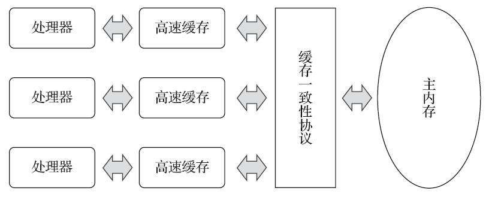
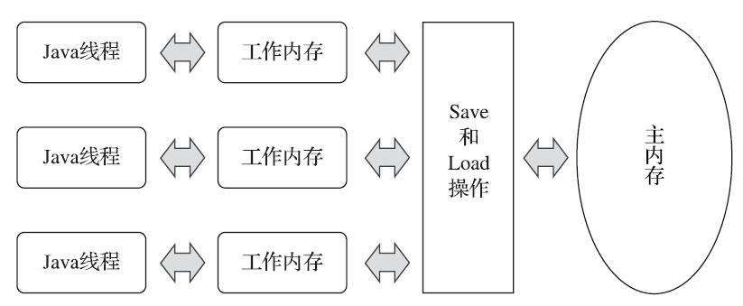
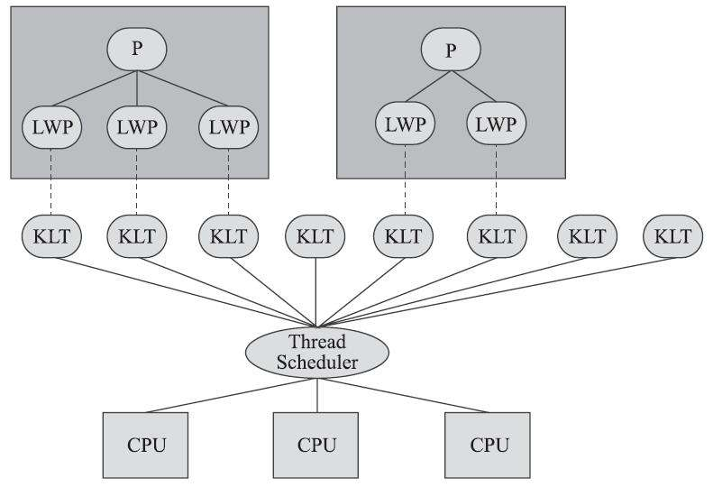
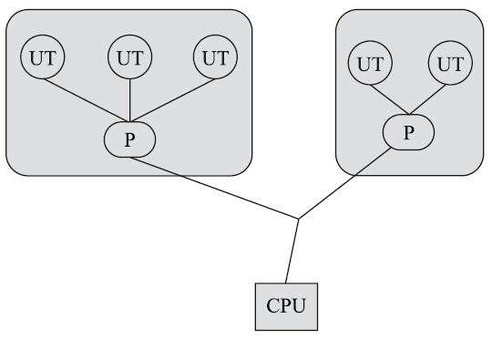
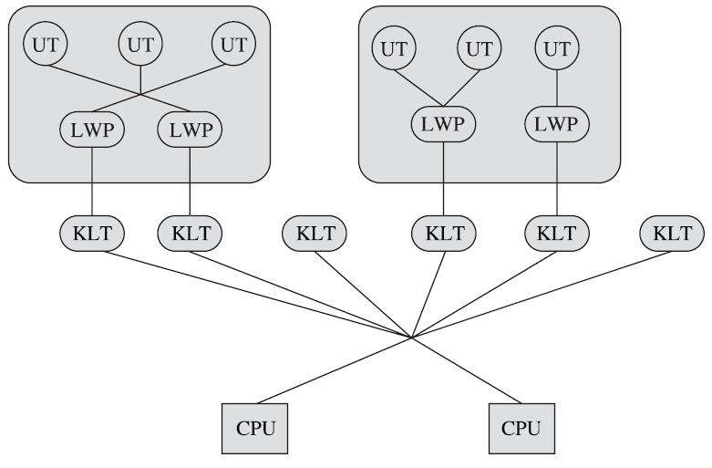
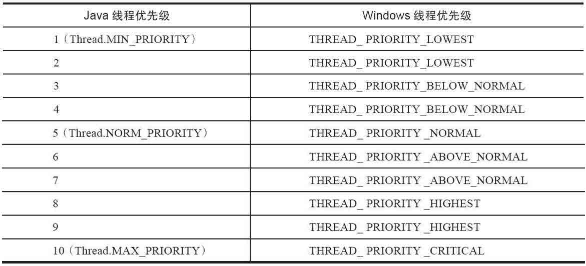
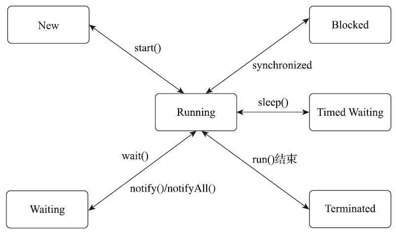
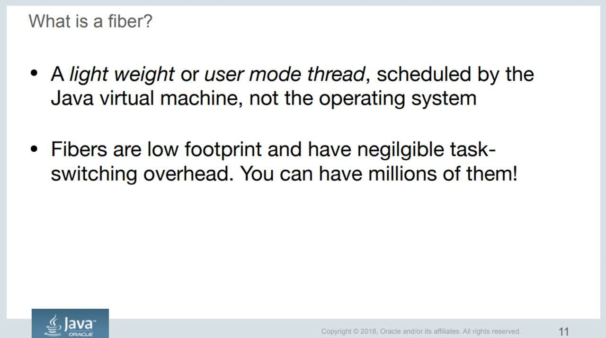

# 第 12 章 Java 内存模型与线程

　　并发处理的广泛应用是 Amdahl 定律代替摩尔定律成为计算机性能发展源动力的根本原因，也是人类压榨计算机运算能力的最有力武器。

## 12.1 概述

　　衡量一个服务性能的高低好坏，每秒事务处理数（Transactions Per Second，TPS）是重要的指标之一，它代表着一秒内服务端平均能响应的请求总数，而 TPS 值与程序的并发能力又有非常密切的关系。

　　对于计算量相同的任务，程序线程并发协调得越有条不紊，效率自然就会越高；反之，线程之间频繁争用数据，互相阻塞甚至死锁，将会大大降低程序的并发能力。

## 12.2 硬件的效率与一致性

　　由于计算机的存储设备与处理器的运算速度有着几个数量级的差距，所以现代计算机系统都不得不加入一层或多层读写速度尽可能接近处理器运算速度的高速缓存（Cache）来作为内存与处理器之间的缓冲：将运算需要使用的数据复制到缓存中，让运算能快速进行，当运算结束后再从缓存同步回内存之中，这样处理器就无须等待缓慢的内存读写了。

　　基于高速缓存的存储交互很好地解决了处理器与内存速度之间的矛盾，但是也为计算机系统带来更高的复杂度，它引入了一个新的问题：缓存一致性（Cache Coherence）。

　　在多路处理器系统中，每个处理器都有自己的高速缓存，而它们又共享同一主内存（Main Memory），这种系统称为**共享内存多核系统**（Shared Memory Multiprocessors System），如下图所示： 

　　当多个处理器的运算任务都涉及同一块主内存区域时，将可能导致各自的缓存数据不一致。为了解决一致性的问题，需要各个处理器访问缓存时都遵循一些协议，在读写时要根据协议来进行操作，这类协议有 MSI、MESI（Illinois Protocol）、MOSI、Synapse、Firefly 及 Dragon Protocol 等。

　　" 内存模型 " 一词，它可以理解为在特定的操作协议下，对特定的内存或高速缓存进行读写访问的过程抽象。不同架构的物理机器可以拥有不一样的内存模型，而 Java 虚拟机也有自己的内存模型，并且与内存访问操作及硬件的缓存访问操作具有高度的可类比性。

　　除了增加高速缓存之外，为了使处理器内部的运算单元能尽量被充分利用，处理器可能会对输入代码进行乱序执行（Out-Of-Order Execution）优化，处理器会在计算之后将乱序执行的结果重组，保证该结果与顺序执行的结果是一致的，但并不保证程序中各个语句计算的先后顺序与输入代码中的顺序一致，因此如果存在一个计算任务依赖另外一个计算任务的中间结果，那么其顺序性并不能靠代码的先后顺序来保证。

　　与处理器的乱序执行优化类似，Java 虚拟机的即时编译器中也有指令重排序（Instruction Reorder）优化。

## 12.3 Java 内存模型

　　经过长时间的验证和修补，直至 JDK 5（实现了 JSR-133 ）发布后，Java 内存模型才终于成熟、完善起来了。

### 12.3.1 主内存与工作内存

　　Java 内存模型的主要目的是定义程序中各种变量的访问规则，即关注在虚拟机中把变量值存储到内存和从内存中取出变量值这样的底层细节。

　　此处的变量（Variables）与 Java 编程中所说的变量有所区别，它包括了实例字段、静态字段和构成数组对象的元素，但是不包括局部变量与方法参数，因为后者是线程私有的，不会被共享，自然就不会存在竞争问题。

　　为了获得更好的执行效能，Java 内存模型并没有限制执行引擎使用处理器的特定寄存器或缓存来和主内存进行交互，也没有限制即时编译器是否要进行调整代码执行顺序这类优化措施。

　　Java 内存模型规定了所有的变量都存储在主内存（Main Memory）中（此处的主内存与介绍物理硬件时提到的主内存名字一样，两者也可以类比，但物理上它仅是虚拟机内存的一部分）。每条线程还有自己的工作内存（Working Memory，可与前面讲的处理器高速缓存类比），线程的工作内存中保存了被该线程使用的变量的主内存副本，线程对变量的所有操作（读取、赋值等）都必须在工作内存中进行，而不能直接读写主内存中的数据。

　　不同的线程之间也无法直接访问对方工作内存中的变量，线程间变量值的传递均需要通过主内存来完成，线程、主内存、工作内存三者的交互关系如下图所示：

 

　　主内存、工作内存与 的Java 内存区域中的 Java 堆、栈、方法区等并不是同一个层次的对内存的划分，这两者基本上是没有任何关系的。如果两者一定要勉强对应起来，那么从变量、主内存、工作内存的定义来看，主内存主要对应于 Java 堆中的对象实例数据部分，而工作内存则对应于虚拟机栈中的部分区域。从更基础的层次上说，主内存直接对应于物理硬件的内存，而为了获取更好的运行速度，虚拟机（或者是硬件、操作系统本身的优化措施）可能会让工作内存优先存储于寄存器和高速缓存中，因为程序运行时主要访问的是工作内存。

### 12.3.2 内存间交互操作

　　关于主内存与工作内存之间具体的交互协议，即一个变量如何从主内存拷贝到工作内存、如何从工作内存同步回主内存这一类的实现细节，Java内存模型中定义了以下8种操作来完成。

　　Java 虚拟机实现时必须保证下面提及的每一种操作都是原子的、不可再分的（ 对于 double 和 long 类型的变量来说，load、store、read 和 write 操作在某些平台上允许有例外 ）。

* lock（ 锁定 ）：作用于主内存的变量，它把一个变量标识为一条线程独占的状态。
* unlock（ 解锁 ）：作用于主内存的变量，它把一个处于锁定状态的变量释放出来，释放后的变量才可以被其他线程锁定。
* read（ 读取 ）：作用于主内存的变量，它把一个变量的值从主内存传输到线程的工作内存中，以便随后的 load 动作使用。
* load（ 载入 ）：作用于工作内存的变量，它把 read 操作从主内存中得到的变量值放入工作内存的变量副本中。
* use（ 使用 ）：作用于工作内存的变量，它把工作内存中一个变量的值传递给执行引擎，每当虚拟机遇到一个需要使用变量的值的字节码指令时将会执行这个操作。
* assign（赋值）：作用于工作内存的变量，它把一个从执行引擎接收的值赋给工作内存的变量，每当虚拟机遇到一个给变量赋值的字节码指令时执行这个操作。
* store（存储）：作用于工作内存的变量，它把工作内存中一个变量的值传送到主内存中，以便随后的 write 操作使用。
* write（写入）：作用于主内存的变量，它把 store 操作从工作内存中得到的变量的值放入主内存的变量中。

　　如果要把一个变量从主内存拷贝到工作内存，那就要按顺序执行 read 和 load 操作，如果要把变量从工作内存同步回主内存，就要按顺序执行 store 和 write 操作。

　　注意，Java 内存模型只要求上述两个操作必须按顺序执行，但不要求是连续执行。也就是说 read 与 load 之间、 store 与 write 之间是可插入其他指令的，

　　除此之外，Java 内存模型还规定了在执行上述 8 种基本操作时必须满足如下规则：

* 不允许 read 和 load、store 和 write 操作之一单独出现，即不允许一个变量从主内存读取了但工作内存不接受，或者工作内存发起回写了但主内存不接受的情况出现。
* 不允许一个线程丢弃它最近的 assign 操作，即变量在工作内存中改变了之后必须把该变化同步回主内存。
* 不允许一个线程无原因地（没有发生过任何 assign 操作）把数据从线程的工作内存同步回主内存中。
* 一个新的变量只能在主内存中 “ 诞生 ”，不允许在工作内存中直接使用一个未被初始化（load或assign）的变量，换句话说就是对一个变量实施 use、store 操作之前，必须先执行 assign 和 load 操作。
* 一个变量在同一个时刻只允许一条线程对其进行 lock 操作，但 lock 操作可以被同一条线程重复执行多次，多次执行 lock 后，只有执行相同次数的 unlock 操作，变量才会被解锁。
* 如果对一个变量执行 lock 操作，那将会清空工作内存中此变量的值，在执行引擎使用这个变量前，需要重新执行 load 或 assign 操作以初始化变量的值。
* 如果一个变量事先没有被 lock 操作锁定，那就不允许对它执行 unlock 操作，也不允许去 unlock 一个被其他线程锁定的变量。
* 对一个变量执行 unlock 操作之前，必须先把此变量同步回主内存中（执行 store、write 操作）。

### 12.3.3 对于 volatile 型变量的特殊规则

　　当一个变量被定义成 volatile 之后，它将具备两项特性：

1. 第一项是保证此变量对所有线程的可见性，这里的 “ 可见性 ” 是指当一条线程修改了这个变量的值，新值对于其他线程来说是可以立即得知的。而普通变量并不能做到这一点，普通变量的值在线程间传递时均需要通过主内存来完成。

   关于 volatile 变量的可见性，经常会被开发人员误解，他们会误以为下面的描述是正确的：“volatile 变量对所有线程是立即可见的，对 volatile 变量所有的写操作都能立刻反映到其他线程之中。换句话说，volatile 变量在各个线程中是一致的，所以基于 volatile 变量的运算在并发下是线程安全的 ”。这句话的论据部分并没有错，但是由其论据并不能得出 “ 基于 volatile 变量的运算在并发下是线程安全的 ” 这样的结论。

   volatile 变量在各个线程的工作内存中是不存在一致性问题的（从物理存储的角度看，各个线程的工作内存中volatile 变量也可以存在不一致的情况，但由于每次使用之前都要先刷新，执行引擎看不到不一致的情况，因此可以认为不存在一致性问题），但是 Java 里面的运算操作符并非原子操作，这导致 volatile 变量的运算在并发下一样是不安全的。

   由于 volatile 变量只能保证可见性，在不符合以下两条规则的运算场景中，我们仍然要通过加锁（使用 synchronized、java.util.concurrent 中的锁或原子类）来保证原子性：

   * 运算结果并不依赖变量的当前值，或者能够确保只有单一的线程修改变量的值。
   * 变量不需要与其他的状态变量共同参与不变约束。

2. 使用 volatile 变量的第二个语义是禁止指令重排序优化。

   普通的变量仅会保证在该方法的执行过程中所有依赖赋值结果的地方都能获取到正确的结果，而不能保证变量赋值操作的顺序与程序代码中的执行顺序一致。因为在同一个线程的方法执行过程中无法感知到这点，这就是 Java 内存模型中描述的所谓 “ 线程内表现为串行的语义 ” （Within-Thread As-If-Serial Semantics）。

　　有 volatile 修饰的变量，编译会多执行了一个 “ lock addl$0x0，(%esp) ” 操作，这个操作的作用相当于一个**内存屏障**（Memory Barrier 或 Memory Fence，指重排序时不能把后面的指令重排序到内存屏障之前的位置，注意不要与垃圾收集器用于捕获变量访问的内存屏障互相混淆），只有一个处理器访问内存时，并不需要内存屏障；但如果有两个或更多处理器访问同一块内存，且其中有一个在观测另一个，就需要内存屏障来保证一致性了。

　　这句指令中的 “addl$0x0，(%esp)”（把 ESP 寄存器的值加 0）显然是一个空操作，之所以用这个空操作而不是空操作专用指令 nop，是因为 IA32 手册规定 lock 前缀不允许配合 nop 指令使用。关键在于 lock 前缀，查询 IA32 手册可知，它的作用是将本处理器的缓存写入了内存，该写入动作也会引起别的处理器或者别的内核无效化（Invalidate）其缓存，这种操作相当于对缓存中的变量做了一次 Java 内存模式中所说的 “store 和 write” 操作。所以通过这样一个空操作，可让前面 volatile 变量的修改对其他处理器立即可见。

　　那为何说它禁止指令重排序呢？从硬件架构上讲，**指令重排序**是指处理器采用了允许将多条指令不按程序规定的顺序分开发送给各个相应的电路单元进行处理。但并不是说指令任意重排，处理器必须能正确处理指令依赖情况保障程序能得出正确的执行结果。

　　所以在同一个处理器中，重排序过的代码看起来依然是有序的。因此，lock addl$0x0，(%esp) 指令把修改同步到内存时，意味着所有之前的操作都已经执行完成，这样便形成了 “ **指令重排序无法越过内存屏障** ” 的效果。

　　在某些情况下，volatile 的同步机制的性能确实要优于锁（使用 synchronized 关键字或 java.util.concurrent 包里面的锁），但是由于虚拟机对锁实行的许多消除和优化，使得很难确切地说 volatile 就会比 synchronized 快上多少。如果让 volatile 自己与自己比较，那可以确定一个原则：volatile 变量读操作的性能消耗与普通变量几乎没有什么差别，但是写操作则可能会慢上一些，因为它需要在本地代码中插入许多内存屏障指令来保证处理器不发生乱序执行。不过即便如此，大多数场景下 volatile 的总开销仍然要比锁来得更低。我们在 volatile 与锁中选择的唯一判断依据仅仅是 volatile 的语义能否满足使用场景的需求。

　　Java 内存模型中对 volatile 变量定义的特殊规则的定义。假定 T 表示一个线程，V 和 W 分别表示两个 volatile 型变量，那么在进行read、load、use、assign、store 和 write 操作时需要满足如下规则：

* 只有当线程 T 对变量 V 执行的前一个动作是 load 的时候，线程 T 才能对变量 V 执行 use 动作；并且，只有当线程 T 对变量 V 执行的后一个动作是 use 的时候，线程 T 才能对变量 V 执行 load 动作。线程 T 对变量 V 的 use 动作可以认为是和线程 T 对变量 V 的 load、read 动作相关联的，必须连续且一起出现。

  这条规则要求在工作内存中，每次使用 V 前都必须先从主内存刷新最新的值，用于保证能看见其他线程对变量 V 所做的修改。

* 只有当线程 T 对变量 V 执行的前一个动作是 assign 的时候，线程 T 才能对变量 V 执行 store 动作；并且，只有当线程 T 对变量 V 执行的后一个动作是 store 的时候，线程 T 才能对变量 V 执行 assign 动作。线程 T 对变量 V 的 assign 动作可以认为是和线程T对变量 V 的 store、write 动作相关联的，必须连续且一起出现。

  这条规则要求在工作内存中，每次修改 V 后都必须立刻同步回主内存中，用于保证其他线程可以看到自己对变量 V 所做的修改。

* 假定动作 A 是线程 T 对变量 V 实施的 use 或 assign 动作，假定动作 F 是和动作 A 相关联的 load 或 store 动作，假定动作 P 是和动作 F 相应的对变量 V 的read或 write 动作；与此类似，假定动作 B 是线程 T 对变量 W 实施的 use 或 assign 动作，假定动作 G 是和动作 B 相关联的 load 或 store 动作，假定动作 Q 是和动作 G 相应的对变量 W 的 read 或 write 动作。如果 A 先于 B，那么 P 先于 Q 。

  这条规则要求 volatile 修饰的变量不会被指令重排序优化，从而保证代码的执行顺序与程序的顺序相同。

### 12.3.4 针对 long 和 double 型变量的特殊规则 

　　Java 内存模型要求 lock、unlock、read、load、assign、use、store、write 这八种操作都具有原子性，但是对于 64 位的数据类型（ long 和 double ），在模型中特别定义了一条宽松的规定：允许虚拟机将没有被 volatile 修饰的 64 位数据的读写操作划分为两次 32 位的操作来进行，即允许虚拟机实现自行选择是否要保证 64 位数据类型的 load、store、read 和 write 这四个操作的原子性，这就是所谓的 “ long 和 double 的非原子性协定 ”（Non-Atomic Treatment of doubleand long Variables）。

　　如果有多个线程共享一个并未声明为 volatile 的 long 或 double 类型的变量，并且同时对它们进行读取和修改操作，那么某些线程可能会读取到一个既不是原值，也不是其他线程修改值的代表了 “ 半个变量 ” 的数值。不过这种读取到 “ 半个变量 ” 的情况是非常罕见的，经过实际测试，在目前主流平台下商用的 64 位 Java 虚拟机中并不会出现非原子性访问行为，但是对于 32 位的 Java 虚拟机，譬如比较常用的 32 位 x86 平台下的 HotSpot 虚拟机，对 long 类型的数据确实存在非原子性访问的风险。

从 JDK 9 起，HotSpot 增加了一个实验性的参数 -XX：+AlwaysAtomicAccesses（这是 JEP 188 对 Java 内存模型更新的一部分内容）来约束虚拟机对所有数据类型进行原子性的访问。 

　　而针对 double 类型，由于现代中央处理器中一般都包含专门用于处理浮点数据的浮点运算器（Floating Point Unit，FPU），用来专门处理单、双精度的浮点数据，所以哪怕是 32 位虚拟机中通常也不会出现非原子性访问的问题。

　　在实际开发中，除非该数据有明确可知的线程竞争，否则我们在编写代码时一般不需要因为这个原因刻意把用到的 long 和 double 变量专门声明为 volatile。

### 12.3.5 原子性、可见性与有序性

#### 12.3.5.1 原子性（Atomicity） 

　　由 Java 内存模型来直接保证的原子性变量操作包括read、load、assign、use、store 和 write 这六个，大致可以认为，基本数据类型的访问、读写都是具备原子性的（例外就是 long 和 double 的非原子性协定）。

　　如果应用场景需要一个更大范围的原子性保证（经常会遇到），Java 内存模型还提供了 lock 和 unlock 操作来满足这种需求，尽管虚拟机未把 lock 和 unlock 操作直接开放给用户使用，但是却提供了更高层次的字节码指令 monitorenter 和 monitorexit 来隐式地使用这两个操作。这两个字节码指令反映到 Java 代码中就是同步块—— synchronized 关键字，因此在 synchronized 块之间的操作也具备原子性。

#### 12.3.5.2 可见性（Visibility）

　　可见性就是指当一个线程修改了共享变量的值时，其他线程能够立即得知这个修改

　　Java 内存模型是通过在变量修改后将新值同步回主内存，在变量读取前从主内存刷新变量值这种依赖主内存作为传递媒介的方式来实现可见性的，无论是普通变量还是 volatile 变量都是如此。

　　普通变量与 volatile 变量的区别是，volatile 的特殊规则保证了新值能立即同步到主内存，以及每次使用前立即从主内存刷新。因此可以说 volatile 保证了多线程操作时变量的可见性，而普通变量则不能保证这一点。

　　除了 volatile 之外，Java 还有两个关键字能实现可见性，它们是 synchronized 和 final。同步块的可见性是由 “ 对一个变量执行 unlock 操作之前，必须先把此变量同步回主内存中（执行 store、write 操作）” 这条规则获得的。而 final 关键字的可见性是指：被 final 修饰的字段在构造器中一旦被初始化完成，并且构造器没有把 “this” 的引用传递出去（this 引用逃逸是一件很危险的事情，其他线程有可能通过这个引用访问到 “ 初始化了一半 ” 的对象），那么在其他线程中就能看见 final 字段的值。

#### 12.3.5.3 有序性（Ordering）

　　Java 程序中天然的有序性可以总结为一句话：如果在本线程内观察，所有的操作都是有序的；如果在一个线程中观察另一个线程，所有的操作都是无序的。前半句是指 “ 线程内似表现为串行的语义 ”（Within-ThreadAs-If-Serial Semantics），后半句是指 “ 指令重排序 ” 现象和 “ 工作内存与主内存同步延迟 ” 现象。

　　Java 语言提供了 volatile 和 synchronized 两个关键字来保证线程之间操作的有序性，volatile 关键字本身就包含了禁止指令重排序的语义，而 synchronized 则是由 “ 一个变量在同一个时刻只允许一条线程对其进行 lock 操作 ” 这条规则获得的，这个规则决定了持有同一个锁的两个同步块只能串行地进入。

　　synchronized 关键字在需要这三种特性（ 原子性、可见性、有序性 ）的时候都可以作为其中一种的解决方案，绝大部分并发控制操作都能使用 synchronized 来完成。

### 12.3.6 先行发生原则

　　Java 语言中有一个 “ 先行发生 ”（Happens-Before）的原则。这个原则非常重要，它是判断数据是否存在竞争，线程是否安全的非常有用的手段。依赖这个原则，可以通过几条简单规则一揽子解决并发环境下两个操作之间是否可能存在冲突的所有问题，而不需要陷入 Java 内存模型苦涩难懂的定义之中。

　　**先行发生是 Java 内存模型中定义的两项操作之间的偏序关系**，比如说操作 A 先行发生于操作 B，其实就是说在发生操作 B 之前，操作 A 产生的影响能被操作 B 观察到，“ 影响 ” 包括修改了内存中共享变量的值、发送了消息、调用了方法等。

　　下面是 Java 内存模型下一些 “ 天然的 ” 先行发生关系，这些先行发生关系无须任何同步器协助就已经存在，可以在编码中直接使用。如果两个操作之间的关系不在此列，并且无法从下列规则推导出来，则它们就没有顺序性保障，虚拟机可以对它们随意地进行重排序。

* 程序次序规则（ Program Order Rule ）：在一个线程内，按照控制流顺序，书写在前面的操作先行发生于书写在后面的操作。注意，这里说的是控制流顺序而不是程序代码顺序，因为要考虑分支、循环等结构。

* 管程锁定规则（ Monitor Lock Rule ）：一个 unlock 操作先行发生于后面对同一个锁的 lock 操作。这里必须强调的是 “ 同一个锁 ”，而 “ 后面 ” 是指时间上的先后。 

* volatile 变量规则（ Volatile Variable Rule ）：对一个 volatile 变量的写操作先行发生于后面对这个变量的读操作，这里的 “ 后面 ” 同样是指时间上的先后。

* 线程启动规则（ Thread Start Rule ）：Thread 对象的 start() 方法先行发生于此线程的每一个动作。

* 线程终止规则（ Thread Termination Rule ）：线程中的所有操作都先行发生于对此线程的终止检测，可以通过 Thread::join() 方法是否结束、Thread::isAlive() 的返回值等手段检测线程是否已经终止执行。

* 线程中断规则（ Thread Interruption Rule ）：对线程 interrupt() 方法的调用先行发生于被中断线程的代码检测到中断事件的发生，可以通过 Thread::interrupted() 方法检测到是否有中断发生。

* 对象终结规则（ Finalizer Rule ）：一个对象的初始化完成（构造函数执行结束）先行发生于它的 finalize() 方法的开始。

* 传递性（Transitivity）：如果操作 A 先行发生于操作 B，操作 B 先行发生于操作 C，那就可以得出操作 A 先行发生于操作 C 的结论。

　　Java 语言无须任何同步手段保障就能成立的先行发生规则有且只有上面这些。

　　一个操作 “ 时间上的先发生 ” 不代表这个操作会是 “ 先行发生 ”。那如果一个操作 “ 先行发生 ”，也不能能推导出这个操作必定是 “ 时间上的先发生 ” 。 

　　时间先后顺序与先行发生原则之间基本没有因果关系，所以衡量并发安全问题的时候不要受时间顺序的干扰，一切必须以先行发生原则为准。

## 12.4 Java 与线程

### 12.4.1 线程的实现

　　线程是比进程更轻量级的调度执行单位，线程的引入，可以把一个进程的资源分配和执行调度分开，各个线程既可以共享进程资源（内存地址、文件 I/O 等），又可以独立调度。

　　目前线程是 Java 里面进行处理器资源调度的最基本单位。

　　Thread 类与大部分的 Java 类库 API 有着显著差别，它的所有关键方法都被声明为 Native 。

　　在 Java 类库 API 中，一个 Native 方法往往就意味着这个方法没有使用或无法使用平台无关的手段来实现（当然也可能是为了执行效率而使用 Native 方法，不过通常最高效率的手段也就是平台相关的手段）。

　　实现线程主要有三种方式：

1. 使用内核线程实现（1：1实现）
2. 使用用户线程实现（1：N实现）
3. 使用用户线程加轻量级进程混合实现（N：M实现）

#### 12.4.1.1 内核线程实现

　　使用内核线程实现的方式也被称为 1：1 实现。

　　内核线程（ Kernel-Level Thread，KLT ）就是直接由操作系统内核（ Kernel，下称内核 ）支持的线程，这种线程由内核来完成线程切换，内核通过操纵调度器（Scheduler）对线程进行调度，并负责将线程的任务映射到各个处理器上。

　　每个内核线程可以视为内核的一个分身，这样操作系统就有能力同时处理多件事情，支持多线程的内核就称为**多线程内核**（Multi-Threads Kernel）。

　　程序一般不会直接使用内核线程，而是使用内核线程的一种高级接口——轻量级进程（LightWeight Process，LWP），轻量级进程就是通常意义上所讲的线程，由于每个轻量级进程都由一个内核线程支持，因此只有先支持内核线程，才能有轻量级进程。

　　这种轻量级进程与内核线程之间1：1的关系称为一对一的线程模型，如下图所示：

　　由于内核线程的支持，每个轻量级进程都成为一个独立的调度单元，即使其中某一个轻量级进程在系统调用中被阻塞了，也不会影响整个进程继续工作。

　　轻量级进程也具有它的局限性：首先，由于是基于内核线程实现的，所以各种线程操作，如创建、析构及同步，都需要进行系统调用。而系统调用的代价相对较高，需要在用户态（ User Mode ）和内核态（ Kernel Mode ）中来回切换。其次，每个轻量级进程都需要有一个内核线程的支持，因此轻量级进程要消耗一定的内核资源（如内核线程的栈空间），因此一个系统支持轻量级进程的数量是有限的。

#### 12.4.1.2 用户线程实现

　　使用用户线程实现的方式被称为 1：N 实现。

　　广义上来讲，一个线程只要不是内核线程，都可以认为是用户线程（ User Thread，UT ）的一种，因此从这个定义上看，轻量级进程也属于用户线程，但轻量级进程的实现始终是建立在内核之上的，许多操作都要进行系统调用，因此效率会受到限制，并不具备通常意义上的用户线程的优点。

　　而狭义上的用户线程指的是完全建立在用户空间的线程库上，系统内核不能感知到用户线程的存在及如何实现的。

　　用户线程的建立、同步、销毁和调度完全在用户态中完成，不需要内核的帮助。如果程序实现得当，这种线程不需要切换到内核态，因此操作可以是非常快速且低消耗的，也能够支持规模更大的线程数量，部分高性能数据库中的多线程就是由用户线程实现的。

　　这种进程与用户线程之间 1：N 的关系称为一对多的线程模型，如下图所示：

　　用户线程的**优势**在于不需要系统内核支援，劣势也在于没有系统内核的支援，所有的线程操作都需要由用户程序自己去处理。

　　线程的创建、销毁、切换和调度都是用户必须考虑的问题，而且由于操作系统只把处理器资源分配到进程，那诸如 “ 阻塞如何处理 ” “多处理器系统中如何将线程映射到其他处理器上 ” 这类问题解决起来将会异常困难，甚至有些是不可能实现的。

#### 12.4.1.3 混合实现

　　线程除了依赖内核线程实现和完全由用户程序自己实现之外，还有一种将内核线程与用户线程一起使用的实现方式，被称为 N：M 实现。在这种混合实现下，既存在用户线程，也存在轻量级进程。

　　用户线程还是完全建立在用户空间中，因此用户线程的创建、切换、析构等操作依然廉价，并且可以支持大规模的用户线程并发。

　　而操作系统支持的轻量级进程则作为用户线程和内核线程之间的桥梁，这样可以使用内核提供的线程调度功能及处理器映射，并且用户线程的系统调用要通过轻量级进程来完成，这大大降低了整个进程被完全阻塞的风险。

　　在这种混合模式中，用户线程与轻量级进程的数量比是不定的，是 N：M 的关系，如下图所示，这种就是多对多的线程模型。

　　许多 UNIX 系列的操作系统，如 Solaris、HP-UX 等都提供了 M：N 的线程模型实现。在这些操作系统上的应用也相对更容易应用 M：N 的线程模型。

#### 12.4.1.4 Java 线程的实现

　　Java 线程如何实现并不受 Java 虚拟机规范的约束，而是由具体虚拟机来决定的。

　　线程模型只对线程的并发规模和操作成本产生影响，对 Java 程序的编码和运行过程来说，这些差异都是完全透明的。

### 12.4.2 Java 线程调度 

　　线程调度是指系统为线程分配处理器使用权的过程，调度主要方式有两种，分别是协同式（ Cooperative Threads-Scheduling ）线程调度和抢占式（ Preemptive Threads-Scheduling ）线程调度。

　　如果使用**协同式调度**的多线程系统，**线程的执行时间由线程本身来控制**，线程把自己的工作执行完了之后，要主动通知系统切换到另外一个线程上去。 

　　协同式多线程的最大**好处**是实现简单，而且由于线程要把自己的事情干完后才会进行线程切换，切换操作对线程自己是可知的，所以一般没有什么线程同步的问题。

　　协同式多线程的**坏处**也很明显：线程执行时间不可控制，甚至如果一个线程的代码编写有问题，一直不告知系统进行线程切换，那么程序就会一直阻塞在那里。

　　如果使用**抢占式调度**的多线程系统，那么**每个线程将由系统来分配执行时间**，线程的切换不由线程本身来决定。

　　在抢占式线程调度的方式下，线程的执行时间是系统可控的，也不会有一个线程导致整个进程甚至整个系统阻塞的问题。

　　Java 使用的线程调度方式就是抢占式调度。

　　虽然说 Java 线程调度是系统自动完成的，但是仍然可以 “ 建议 ” 操作系统给某些线程多分配一点执行时间，另外的一些线程则可以少分配一点——这项操作是通过设置线程优先级来完成的。 

　　Java 语言一共设置了 10 个级别的线程优先级（ Thread.MIN_PRIORITY 至 Thread.MAX_PRIORITY ）。在两个线程同时处于 Ready 状态时，优先级越高的线程越容易被系统选择执行。

　　不过，线程优先级并不是一项稳定的调节手段，很显然因为主流虚拟机上的 Java 线程是被映射到系统的原生线程上来实现的，所以线程调度最终还是由操作系统说了算。

　　尽管现代的操作系统基本都提供线程优先级的概念，但是并不见得能与Java线程的优先级一一对应。如果操作系统的优先级比 Java 线程优先级更多，那问题还比较好处理，中间留出一点空位就是了，但对于比 Java 线程优先级少的系统，就不得不出现几个线程优先级对应到同一个操作系统优先级的情况了。

　　下表显示了 Java 线程优先级与 Windows 线程优先级之间的对应关系，Windows 平台的虚拟机中使用了除 THREAD_PRIORITY_IDLE 之外的其余 6 种线程优先级，因此在 Windows 下设置线程优先级为 1 和 2、3 和 4、6 和 7、8 和 9 的效果是完全相同的。 

　　线程优先级并不是一项稳定的调节手段，这不仅仅体现在某些操作系统上不同的优先级实际会变得相同这一点上，还有其他情况不能过于依赖线程优先级：优先级可能会被系统自行改变，例如在 Windows 系统中存在一个叫 “ 优先级推进器 ” 的功能（ Priority Boosting，当然它可以被关掉 ），大致作用是当系统发现一个线程被执行得特别频繁时，可能会越过线程优先级去为它分配执行时间，从而减少因为线程频繁切换而带来的性能损耗。因此，并不能在程序中通过优先级来完全准确判断一组状态都为 Ready 的线程将会先执行哪一个。

### 12.4.3 状态转换 

　　Java 语言定义了 6 种线程状态，在任意一个时间点中，一个线程只能有且只有其中的一种状态，并且可以通过特定的方法在不同状态之间转换。这 6 种状态分别是：

* 新建（ New ）：创建后尚未启动的线程处于这种状态。
* 运行（ Runnable ）：包括操作系统线程状态中的 Running 和 Ready ，也就是处于此状态的线程有可能正在执行，也有可能正在等待着操作系统为它分配执行时间。

* 无限期等待（Waiting）：处于这种状态的线程不会被分配处理器执行时间，它们要等待被其他线程显式唤醒。

  以下方法会让线程陷入无限期的等待状态：

  * 没有设置 Timeout 参数的 Object::wait() 方法；
  * 没有设置 Timeout 参数的 Thread::join() 方法；
  * LockSupport::park() 方法。

* 限期等待（Timed Waiting）：处于这种状态的线程也不会被分配处理器执行时间，不过无须等待被其他线程显式唤醒，在一定时间之后它们会由系统自动唤醒。

  以下方法会让线程进入限期等待状态：

  * Thread::sleep() 方法；
  * 设置了 Timeout 参数的 Object::wait() 方法；
  * 设置了 Timeout 参数的 Thread::join() 方法；
  * LockSupport::parkNanos() 方法；
  * LockSupport::parkUntil() 方法。

* 阻塞（Blocked）：线程被阻塞了，“ 阻塞状态 ” 与 “ 等待状态 ” 的区别是 “ 阻塞状态 ” 在等待着获取到一个排它锁，这个事件将在另外一个线程放弃这个锁的时候发生；而 “ 等待状态 ” 则是在等待一段时间，或者唤醒动作的发生。在程序等待进入同步区域的时候，线程将进入这种状态。
* 结束（Terminated）：已终止线程的线程状态，线程已经结束执行。

　　上述 6 种状态在遇到特定事件发生的时候将会互相转换，它们的转换关系如下图所示：

## 12.5 Java 与协程

### 12.5.1 内核线程的局限 

　　1：1 的内核线程模型是如今 Java 虚拟机线程实现的主流选择，但是这种映射到操作系统上的线程天然的缺陷是切换、调度成本高昂，系统能容纳的线程数量也很有限。

### 12.5.2 协程的复苏

　　内核线程的调度成本主要来自于用户态与核心态之间的状态转换，而这两种状态转换的开销主要来自于响应中断、保护和恢复执行现场的成本。

　　程序是数据与代码的组合体，代码执行时还必须要有上下文数据的支撑。而这里说的 “ 上下文 ”，以程序员的角度来看，是方法调用过程中的各种局部的变量与资源；以线程的角度来看，是方法的调用栈中存储的各类信息；而以操作系统和硬件的角度来看，则是存储在内存、缓存和寄存器中的一个个具体数值。物理硬件的各种存储设备和寄存器是被操作系统内所有线程共享的资源，当中断发生，从线程 A 切换到线程 B 去执行之前，操作系统首先要把线程 A 的上下文数据妥善保管好，然后把寄存器、内存分页等恢复到线程 B 挂起时候的状态，这样线程 B 被重新激活后才能仿佛从来没有被挂起过。这种保护和恢复现场的工作，免不了涉及一系列数据在各种寄存器、缓存中的来回拷贝，当然不可能是一种轻量级的操作。

　　如果说内核线程的切换开销是来自于保护和恢复现场的成本，那如果改为采用用户线程，这部分开销也不能够省略掉。

　　由于最初多数的用户线程是被设计成协同式调度（ CooperativeScheduling ）的，所以它有了一个别名——“ 协程 ”（Coroutine）。又由于这时候的协程会完整地做调用栈的保护、恢复工作，所以今天也被称为 “ 有栈协程 ”（Stackfull Coroutine），起这样的名字是为了便于跟后来的 “ 无栈协程 ”（Stackless Coroutine）区分开。

　　无栈协程的典型应用，即各种语言中的 await、async、yield 这类关键字。

　　无栈协程本质上是一种有限状态机，状态保存在闭包里，自然比有栈协程恢复调用栈要轻量得多，但功能也相对更有限。 

　　**协程的主要优势是轻量**，无论是有栈协程还是无栈协程，都要比传统内核线程要轻量得多。 

　　如果进行量化的话，那么如果不显式设置 -Xss 或 -XX：ThreadStackSize，则在 64 位 Linux 上 HotSpot 的线程栈容量默认是 1 MB，此外内核数据结构（ Kernel Data Structures ）还会额外消耗 16 KB内存。

　　与之相对的，一个协程的栈通常在几百个字节到几 KB 之间，所以 Java 虚拟机里线程池容量达到两百就已经不算小了，而很多支持协程的应用中，同时并存的协程数量可数以十万计。

　　协程当然也有它的局限，需要在应用层面实现的内容（ 调用栈、调度器这些 ）特别多。

　　除此之外，协程在最初，甚至在今天很多语言和框架中会被设计成协同式调度，这样在语言运行平台或者框架上的调度器就可以做得非常简单。

　　具体到 Java 语言，还会有一些别的限制，譬如 HotSpot 这样的虚拟机，Java 调用栈跟本地调用栈是做在一起的。如果在协程中调用了本地方法，还能否正常切换协程而不影响整个线程？另外，如果协程中遇传统的线程同步措施会怎样？譬如 Kotlin 提供的协程实现，一旦遭遇 synchronize 关键字，那挂起来的仍将是整个线程。

### 12.5.3 Java 的解决方案 

　　对于有栈协程，有一种特例实现名为纤程（Fiber）。

　　从 Oracle 官方对 “ 什么是纤程 ” 的解释里可以看出，它就是一种典型的有栈协程，如下图所示：

 

　　在新并发模型下，一段使用纤程并发的代码会被分为两部分——执行过程（ Continuation ）和调度器（ Scheduler ）。**执行过程主要用于维护执行现场，保护、恢复上下文状态，而调度器则负责编排所有要执行的代码的顺序**。 

　　将调度程序与执行过程分离的好处是，用户可以选择自行控制其中的一个或者多个，而且 Java 中现有的调度器也可以被直接重用。

## 12.6 本章小结

本章中，了解了虚拟机 Java 内存模型的结构及操作，并且讲解了原子性、可见性、有序性在 Java 内存模型中的体现，介绍了先行发生原则的规则及使用。另外，还了解了线程在 Java 语言之中是如何实现的，以及代表 Java 未来多线程发展的新并发模型的工作原理。
