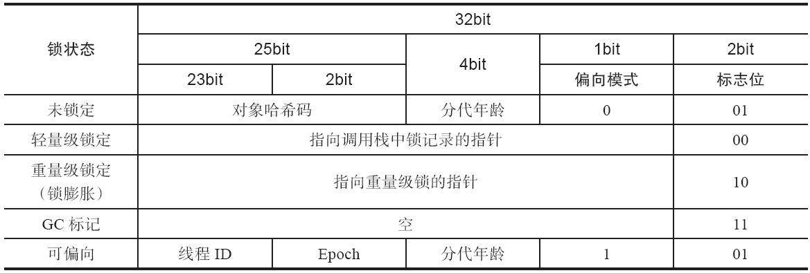
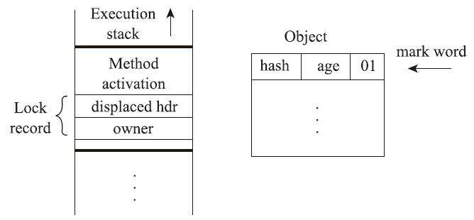
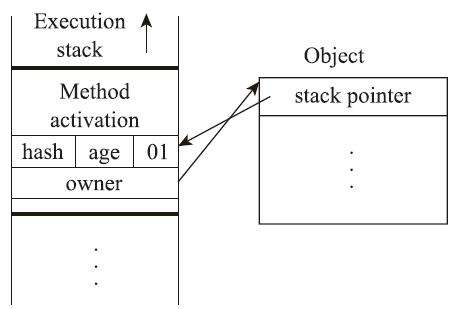
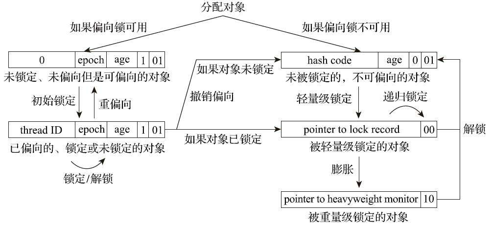

# 第 13 章 线程安全与锁优化

## 13.1 概述

　　在软件业发展的初期，程序编写都是以算法为核心的，程序员会把数据和过程分别作为独立的部分来考虑，数据代表问题空间中的客体，程序代码则用于处理这些数据，这种思维方式直接站在计算机的角度去抽象问题和解决问题，被称为**面向过程**的编程思想。

　　与此相对，面向对象的编程思想则站在现实世界的角度去抽象和解决问题，它把数据和行为都看作对象的一部分，这样可以让程序员能以符合现实世界的思维方式来编写和组织程序。

　　面向对象的编程思想极大地提升了现代软件开发的效率和软件可以达到的规模，但是现实世界与计算机世界之间不可避免地存在一些差异。

## 13.2 线程安全

　　“ 线程安全 ” 的定义：“ 当多个线程同时访问一个对象时，如果不用考虑这些线程在运行时环境下的调度和交替执行，也不需要进行额外的同步，或者在调用方进行任何其他的协调操作，调用这个对象的行为都可以获得正确的结果，那就称这个对象是线程安全的。”

　　这个定义要求线程安全的代码都必须具备一个共同特征：代码本身封装了所有必要的正确性保障手段（ 如互斥同步等 ），令调用者无须关心多线程下的调用问题，更无须自己实现任何措施来保证多线程环境下的正确调用。

### 13.2.1 Java 语言中的线程安全

　　按照线程安全的 “ 安全程度 ” 由强至弱来排序，可以将 Java 语言中各种操作共享的数据分为以下五类：不可变、绝对线程安全、相对线程安全、线程兼容和线程对立。

#### 13.2.1.1 不可变

　　在 Java 语言里面（ 特指 JDK 5 以后，即 Java 内存模型被修正之后的 Java 语言），不可变（ Immutable ）的对象一定是线程安全的，无论是对象的方法实现还是方法的调用者，都不需要再进行任何线程安全保障措施。

　　只要一个不可变的对象被正确地构建出来（ 即没有发生 this 引用逃逸的情况 ），那其外部的可见状态永远都不会改变，永远都不会看到它在多个线程之中处于不一致的状态。“ 不可变 ” 带来的安全性是最直接、最纯粹的。

　　Java 语言中，如果多线程共享的数据是一个基本数据类型，那么只要在定义时使用 final 关键字修饰它就可以保证它是不可变的。如果共享数据是一个对象，由于 Java 语言目前暂时还没有提供值类型的支持，那就需要对象自行保证其行为不会对其状态产生任何影响才行。

　　比如 java.lang.String 类的对象实例，它是一个典型的不可变对象，用户调用它的 substring()、replace() 和 concat() 这些方法都不会影响它原来的值，只会返回一个新构造的字符串对象。

　　保证对象行为不影响自己状态的途径有很多种，最简单的一种就是把对象里面带有状态的变量都声明为 final，这样在构造函数结束之后，它就是不可变的。

　　在 Java 类库 API 中符合不可变要求的类型，除了上面提到的 String 之外，常用的还有枚举类型及 java.lang.Number 的部分子类，如 Long 和 Double 等数值包装类型、BigInteger 和 BigDecimal 等大数据类型。但同为 Number 子类型的原子类 AtomicInteger 和 AtomicLong 则是可变的。

#### 13.2.1.2 绝对线程安全

　　绝对的线程安全能够完全满足线程安全的定义。

　　java.util.Vector 是一个线程安全的容器，因为它的 add() 、get() 和 size() 等方法都是被 synchronized 修饰的，尽管这样效率不高，但保证了具备原子性、可见性和有序性。不过，即使它所有的方法都被修饰成 synchronized，也不意味着调用它的时候就永远都不再需要同步手段了（主线程调用 vector.add()，一个线程调用 vector.remove()，一个线程调用 System.out.println() 输出，会产生 ArrayIndexOutOfBoundsExceptiob 异常，解决方法就是 synchronized(vector) ）。 

　　假如 Vector 一定要做到绝对的线程安全，那就必须在它内部维护一组一致性的快照访问才行，每次对其中元素进行改动都要产生新的快照，这样要付出的时间和空间成本都是非常大的。

#### 13.2.1.3 相对线程安全 

　　相对线程安全就是通常意义上所讲的线程安全，它需要保证对这个对象单次的操作是线程安全的，在调用的时候不需要进行额外的保障措施，但是对于一些特定顺序的连续调用，就可能需要在调用端使用额外的同步手段来保证调用的正确性。

　　在 Java 语言中，大部分声称线程安全的类都属于这种类型，例如 Vector、HashTable、Collections 的 synchronizedCollection() 方法包装的集合等。

#### 13.2.1.4 线程兼容

　　线程兼容是指对象本身并不是线程安全的，但是可以通过在调用端正确地使用同步手段来保证对象在并发环境中可以安全地使用。

　　Java 类库 API 中大部分的类都是线程兼容的，如 Vector 和 HashTable 相对应的集合类 ArrayList 和 HashMap 等。

#### 13.2.1.5 线程对立

　　线程对立是指不管调用端是否采取了同步措施，都无法在多线程环境中并发使用代码。由于 Java 语言天生就支持多线程的特性，线程对立这种排斥多线程的代码是很少出现的，而且通常都是有害的，应当尽量避免。

　　一个线程对立的例子是 Thread 类的 suspend() 和 resume() 方法。如果有两个线程同时持有一个线程对象，一个尝试去中断线程，一个尝试去恢复线程，在并发进行的情况下，无论调用时是否进行了同步，目标线程都存在死锁风险 —— 假如 suspend() 中断的线程就是即将要执行 resume() 的那个线程，那就肯定要产生死锁了。也正是这个原因， suspend() 和 resume() 方法都已经被声明废弃了。常见的线程对立的操作还有 System.setIn()、Sytem.setOut() 和 System.runFinalizersOnExit() 等。

### 13.2.2 线程安全的实现方法

#### 13.2.2.1 互斥同步

　　互斥同步（ Mutual Exclusion & Synchronization ）是一种最常见也是最主要的并发正确性保障手段。

　　同步是指在多个线程并发访问共享数据时，保证共享数据在同一个时刻只被一条（ 或者是一些，当使用信号量的时候 ）线程使用。 

　　而互斥是实现同步的一种手段，临界区（ CriticalSection ）、互斥量（ Mutex ）和信号量（ Semaphore ）都是常见的互斥实现方式。

　　因此在 “ 互斥同步 ” 这四个字里面，互斥是因，同步是果；互斥是方法，同步是目的。

　　在 Java 里面，最基本的互斥同步手段就是 synchronized 关键字，这是一种块结构（ BlockStructured ）的同步语法。

　　synchronized 关键字经过 Javac 编译之后，会在同步块的前后分别形成 monitorenter 和 monitorexit 这两个字节码指令。这两个字节码指令都需要一个 reference 类型的参数来指明要锁定和解锁的对象。

　　如果 Java 源码中的 synchronized 明确指定了对象参数，那就以这个对象的引用作为 reference；如果没有明确指定，那将根据 synchronized 修饰的方法类型（ 如实例方法或类方法 ），来决定是取代码所在的对象实例还是取类型对应的 Class 对象来作为线程要持有的锁。

　　根据《 Java 虚拟机规范 》的要求，在执行 monitorenter 指令时，首先要去尝试获取对象的锁。如果这个对象没被锁定，或者当前线程已经持有了那个对象的锁，就把锁的计数器的值增加一，而在执行 monitorexit 指令时会将锁计数器的值减一。一旦计数器的值为零，锁随即就被释放了。如果获取对象锁失败，那当前线程就应当被阻塞等待，直到请求锁定的对象被持有它的线程释放为止。

　　从功能上看，根据以上《 Java 虚拟机规范 》对 monitorenter 和 monitorexit 的行为描述，可以得出两个关于 synchronized 的直接推论，这是使用它时需特别注意的：

* 被 synchronized 修饰的同步块对同一条线程来说是可重入的。这意味着同一线程反复进入同步块也不会出现自己把自己锁死的情况。
* 被 synchronized 修饰的同步块在持有锁的线程执行完毕并释放锁之前，会无条件地阻塞后面其他线程的进入。这意味着无法像处理某些数据库中的锁那样，强制已获取锁的线程释放锁；也无法强制正在等待锁的线程中断等待或超时退出。

　　从执行成本的角度看，持有锁是一个重量级（ Heavy-Weight ）的操作。

　　在主流 Java 虚拟机实现中，Java 的线程是映射到操作系统的原生内核线程之上的，如果要阻塞或唤醒一条线程，则需要操作系统来帮忙完成，这就不可避免地陷入用户态到核心态的转换中，进行这种状态转换需要耗费很多的处理器时间。尤其是对于代码特别简单的同步块（ 譬如被 synchronized 修饰的 getter() 或 setter() 方法），状态转换消耗的时间甚至会比用户代码本身执行的时间还要长。

　　因此才说，synchronized 是 Java 语言中一个重量级的操作，有经验的程序员都只会在确实必要的情况下才使用这种操作。而虚拟机本身也会进行一些优化，譬如在通知操作系统阻塞线程之前加入一段自旋等待过程，以避免频繁地切入核心态之中。 

　　除了 synchronized 关键字以外，自 JDK 5 起（ 实现了 JSR 166 ），Java 类库中新提供了 java.util.concurrent 包（ 下文称 J.U.C 包 ），其中的 java.util.concurrent.locks.Lock 接口便成了 Java 的另一种全新的互斥同步手段。

　　基于 Lock 接口，用户能够以非块结构（ Non-Block Structured ）来实现互斥同步，从而摆脱了语言特性的束缚，改为在类库层面去实现同步，这也为日后扩展出不同调度算法、不同特征、不同性能、不同语义的各种锁提供了广阔的空间。

　　重入锁（ReentrantLock）是 Lock 接口最常见的一种实现，顾名思义，它与 synchronized 一样是可重入的。在基本用法上，ReentrantLock 也与 synchronized 很相似，只是代码写法上稍有区别而已。不过，ReentrantLock 与 synchronized 相比增加了一些高级功能，主要有以下三项：等待可中断、可实现公平锁及锁可以绑定多个条件。

* 等待可中断：是指当持有锁的线程长期不释放锁的时候，正在等待的线程可以选择放弃等待，改为处理其他事情。可中断特性对处理执行时间非常长的同步块很有帮助。

* 公平锁：是指多个线程在等待同一个锁时，必须按照申请锁的时间顺序来依次获得锁；

  而非公平锁则不保证这一点，在锁被释放时，任何一个等待锁的线程都有机会获得锁。

  synchronized 中的锁是非公平的，ReentrantLock 在默认情况下也是非公平的，但可以通过带布尔值的构造函数要求使用公平锁。

  不过一旦使用了公平锁，将会导致 ReentrantLock 的性能急剧下降，会明显影响吞吐量。

* 锁绑定多个条件：是指一个 ReentrantLock 对象可以同时绑定多个 Condition 对象。

  在 synchronized 中，锁对象的 wait() 跟它的 notify() 或者 notifyAll() 方法配合可以实现一个隐含的条件，如果要和多于一个的条件关联的时候，就不得不额外添加一个锁；而 ReentrantLock 则无须这样做，多次调用newCondition() 方法即可。

　　基于以下理由，仍然推荐在 synchronized 与 ReentrantLock 都可满足需要时优先使用 synchronized：

* synchronized 是在 Java 语法层面的同步，足够清晰，也足够简单。每个 Java 程序员都熟悉 synchronized，但 J.U.C 中的 Lock 接口则并非如此。因此在只需要基础的同步功能时，更推荐 synchronized。
* Lock 应该确保在 finally 块中释放锁，否则一旦受同步保护的代码块中抛出异常，则有可能永远不会释放持有的锁。这一点必须由程序员自己来保证，而使用 synchronized 的话则可以由 Java 虚拟机来确保即使出现异常，锁也能被自动释放。
* 尽管在 JDK 5 时代 ReentrantLock 曾经在性能上领先过 synchronized，但这已经是十多年之前的胜利了。从长远来看，Java 虚拟机更容易针对 synchronized 来进行优化，因为 Java 虚拟机可以在线程和对象的元数据中记录 synchronized 中锁的相关信息，而使用 J.U.C 中的 Lock 的话，Java 虚拟机是很难得知具体哪些锁对象是由特定线程锁持有的。

#### 13.2.2.2 非阻塞同步 

　　互斥同步面临的主要问题是进行线程阻塞和唤醒所带来的性能开销，因此这种同步也被称为**阻塞同步**（ Blocking Synchronization ）。

　　从解决问题的方式上看，互斥同步属于一种悲观的并发策略，其总是认为只要不去做正确的同步措施（ 例如加锁 ），那就肯定会出现问题，无论共享的数据是否真的会出现竞争，它都会进行加锁（ 这里讨论的是概念模型，实际上虚拟机会优化掉很大一部分不必要的加锁 ），这将会导致用户态到核心态转换、维护锁计数器和检查是否有被阻塞的线程需要被唤醒等开销。

　　随着硬件指令集的发展，已经有了另外一个选择：基于冲突检测的乐观并发策略，通俗地说就是不管风险，先进行操作，如果没有其他线程争用共享数据，那操作就直接成功了；如果共享的数据的确被争用，产生了冲突，那再进行其他的补偿措施，最常用的补偿措施是不断地重试，直到出现没有竞争的共享数据为止。这种乐观并发策略的实现不再需要把线程阻塞挂起，因此这种同步操作被称为**非阻塞同步**（Non-Blocking Synchronization），使用这种措施的代码也常被称为无锁（Lock-Free）编程。

　　使用乐观并发策略需要 “ 硬件指令集的发展 ”？因为必须要求操作和冲突检测这两个步骤具备原子性。

　　靠什么来保证原子性？如果这里再使用互斥同步来保证就完全失去意义了，所以只能靠硬件来实现这件事情，硬件保证某些从语义上看起来需要多次操作的行为可以只通过一条处理器指令就能完成，这类指令常用的有：

* 测试并设置（ Test-and-Set ）；
* 获取并增加（ Fetch-and-Increment ）；
* 交换（ Swap ）；
* 比较并交换（ Compare-and-Swap，下文称 CAS ）；
* 加载链接/条件储存（ Load-Linked/Store-Conditional，下文称 LL/SC ）。

　　CAS 指令需要有三个操作数，分别是内存位置（ 在 Java 中可以简单地理解为变量的内存地址，用 V 表示 ）、旧的预期值（ 用 A 表示 ）和准备设置的新值（ 用 B 表示）。CAS 指令执行时，当且仅当 V 符合 A 时，处理器才会用 B 更新  V的值，否则它就不执行更新。但是，不管是否更新了 V 的值，都会返回 V 的旧值，上述的处理过程是一个原子操作，执行期间不会被其他线程中断。

　　在 JDK 5 之后，Java 类库中才开始使用 CAS 操作，该操作由 sun.misc.Unsafe 类里面的 compareAndSwapInt() 和 compareAndSwapLong() 等几个方法包装提供。 

　　HotSpot 虚拟机在内部对这些方法做了特殊处理，即时编译出来的结果就是一条平台相关的处理器 CAS 指令，没有方法调用的过程，或者可以认为是无条件内联进去了。

　　不过由于 Unsafe 类在设计上就不是提供给用户程序调用的类（ Unsafe::getUnsafe() 的代码中限制了只有启动类加载器（ BootstrapClassLoader ）加载的 Class 才能访问它），因此在 JDK 9 之前只有 Java 类库可以使用 CAS，譬如 J.U.C 包里面的整数原子类，其中的 compareAndSet() 和 getAndIncrement() 等方法都使用了 Unsafe 类的 CAS 操作来实现。而如果用户程序也有使用 CAS 操作的需求，那要么就采用反射手段突破 Unsafe 的访问限制，要么就只能通过 Java 类库 API 来间接使用它。直到 JDK 9 之后，Java 类库才在 VarHandle 类里开放了面向用户程序使用的 CAS 操作。

　　incrementAndGet() 方法的实现其实非常简单，如代码清单所示：

```java
/**
* Atomically increment by one the current value
* @return the updated value 
*/
public final int incrementAndGet(){
	for ( ;; ){
    int current = get();
    int next = current + 1;
    if (compareAndSet(current,next)){
      return next;
    }
  }
}
```

　　incrementAndGet() 方法在一个无限循环中，不断尝试将一个比当前值大一的新值赋值给自己。如果失败了，那说明在执行 CAS 操作的时候，旧值已经发生改变，于是再次循环进行下一次操作，直到设置成功为止。 

　　尽管 CAS 看起来很美好，既简单又高效，但显然这种操作无法涵盖互斥同步的所有使用场景，并且 CAS 从语义上来说并不是真正完美的，它存在一个逻辑漏洞：如果一个变量 V 初次读取的时候是 A 值，并且在准备赋值的时候检查到它仍然为 A 值，那就能说明它的值没有被其他线程改变过了吗？这是不能的，因为如果在这段期间它的值曾经被改成 B，后来又被改回为 A，那 CAS 操作就会误认为它从来没有被改变过。这个漏洞称为 CAS 操作的 “ **ABA 问题** ”。J.U.C 包为了解决这个问题，提供了一个带有标记的原子引用类 AtomicStampedReference，它可以通过控制变量值的版本来保证 CAS 的正确性。 

　　大部分情况下 ABA 问题不会影响程序并发的正确性，如果需要解决 ABA 问题，改用传统的互斥同步可能会比原子类更为高效。

#### 13.2.2.3 无同步方案 

　　要保证线程安全，也并非一定要进行阻塞或非阻塞同步，同步与线程安全两者没有必然的联系。同步只是保障存在共享数据争用时正确性的手段，如果能让一个方法本来就不涉及共享数据，那它自然就不需要任何同步措施去保证其正确性，因此会有一些代码天生就是线程安全的，简单介绍其中的两类。

1. 可重入代码（Reentrant Code）：这种代码又称纯代码（Pure Code），是指可以在代码执行的任何时刻中断它，转而去执行另外一段代码（包括递归调用它本身），而在控制权返回后，原来的程序不会出现任何错误，也不会对结果有所影响。

   在特指多线程的上下文语境里（ 不涉及信号量等因素 ），可以认为可重入代码是线程安全代码的一个真子集，这意味着相对线程安全来说，可重入性是更为基础的特性，它可以保证代码线程安全，即所有可重入的代码都是线程安全的，但并非所有的线程安全的代码都是可重入的。

   可重入代码有一些共同的特征，例如，不依赖全局变量、存储在堆上的数据和公用的系统资源，用到的状态量都由参数中传入，不调用非可重入的方法等。可以通过一个比较简单的原则来**判断代码是否具备可重入性**：如果一个方法的返回结果是可以预测的，只要输入了相同的数据，就都能返回相同的结果，那它就满足可重入性的要求，当然也就是线程安全的。

2. 线程本地存储（Thread Local Storage）：如果一段代码中所需要的数据必须与其他代码共享，那就看看这些共享数据的代码是否能保证在同一个线程中执行。如果能保证，就可以把共享数据的可见范围限制在同一个线程之内，这样，无须同步也能保证线程之间不出现数据争用的问题。

   符合这种特点的应用并不少见，大部分使用消费队列的架构模式（ 如 “ 生产者-消费者 ” 模式 ）都会将产品的消费过程限制在一个线程中消费完，其中最重要的一种应用实例就是经典 We b交互模型中的 “ 一个请求对应一个服务器线程 ”（ Thread-per-Request ）的处理方式，这种处理方式的广泛应用使得很多 Web 服务端应用都可以使用线程本地存储来解决线程安全问题。

　　Java 语言中，如果一个变量要被多线程访问，可以使用 volatile 关键字将它声明为 “ 易变的 ”；如果一个变量只要被某个线程独享，可以通过 java.lang.ThreadLocal 类来实现线程本地存储的功能。

　　每一个线程的 Thread 对象中都有一个 ThreadLocalMap 对象，这个对象存储了一组以ThreadLocal.threadLocalHashCode 为键，以本地线程变量为值的 K-V 值对，ThreadLocal 对象就是当前线程的 ThreadLocalMap 的访问入口，每一个 ThreadLocal 对象都包含了一个独一无二的 threadLocalHashCode 值，使用这个值就可以在线程 K-V 值对中找回对应的本地线程变量。

## 13.3 锁优化

　　高效并发是从 JDK 5 升级到 JDK 6 后一项重要的改进项， HotSpot 虚拟机开发团队在这个版本上花费了大量的资源去实现各种锁优化技术，如适应性自旋（Adaptive Spinning）、锁消除（Lock Elimination）、锁膨胀（Lock Coarsening）、轻量级锁（Lightweight Locking）、偏向锁（Biased Locking）等，这些技术都是为了在线程之间更高效地共享数据及解决竞争问题，从而提高程序的执行效率。

### 13.3.1 自旋锁与自适应自旋

　　互斥同步对性能最大的影响是阻塞的实现，挂起线程和恢复线程的操作都需要转入内核态中完成，这些操作给 Java 虚拟机的并发性能带来了很大的压力。

　　现在绝大多数的个人电脑和服务器都是多路（ 核 ）处理器系统，如果物理机器有一个以上的处理器或者处理器核心，能让两个或以上的线程同时并行执行，就可以让后面请求锁的那个线程 “ 稍等一会 ”，但不放弃处理器的执行时间，看看持有锁的线程是否很快就会释放锁。为了让线程等待，只须让线程执行一个忙循环（ 自旋 ），这项技术就是所谓的自旋锁。

自旋锁在 JDK 1.4.2 中就已经引入，只不过默认是关闭的，可以使用 -XX：+UseSpinning 参数来开启，在 JDK 6 中就已经改为默认开启了。

　　自旋等待不能代替阻塞，且先不说对处理器数量的要求，自旋等待本身虽然避免了线程切换的开销，但它是要占用处理器时间的，所以如果锁被占用的时间很短，自旋等待的效果就会非常好，反之如果锁被占用的时间很长，那么自旋的线程只会白白消耗处理器资源，而不会做任何有价值的工作，这就会带来性能的浪费。 

　　因此自旋等待的时间必须有一定的限度，如果自旋超过了限定的次数仍然没有成功获得锁，就应当使用传统的方式去挂起线程。自旋次数的默认值是十次，用户也可以使用参数 -XX：PreBlockSpin 来自行更改。

　　不过无论是默认值还是用户指定的自旋次数，对整个 Java 虚拟机中所有的锁来说都是相同的。在 JDK 6 中对自旋锁的优化，引入了自适应的自旋。

　　自适应意味着自旋的时间不再是固定的了，而是由前一次在同一个锁上的自旋时间及锁的拥有者的状态来决定的。

　　如果在同一个锁对象上，自旋等待刚刚成功获得过锁，并且持有锁的线程正在运行中，那么虚拟机就会认为这次自旋也很有可能再次成功，进而允许自旋等待持续相对更长的时间，比如持续 100 次忙循环。

　　另一方面，如果对于某个锁，自旋很少成功获得过锁，那在以后要获取这个锁时将有可能直接省略掉自旋过程，以避免浪费处理器资源。

　　有了自适应自旋，随着程序运行时间的增长及性能监控信息的不断完善，虚拟机对程序锁的状况预测就会越来越精准，虚拟机就会变得越来越 “ 聪明 ” 了。

### 13.3.2 锁消除 

　　锁消除是指虚拟机即时编译器在运行时，对一些代码要求同步，但是对被检测到不可能存在共享数据竞争的锁进行消除。

　　锁消除的主要判定依据来源于逃逸分析的数据支持，如果判断到一段代码中，在堆上的所有数据都不会逃逸出去被其他线程访问到，那就可以把它们当作栈上数据对待，认为它们是线程私有的，同步加锁自然就无须再进行。

　　在 JDK 5 之前，字符串加法会转化为 StringBuffer 对象的连续 append() 操作，在 JDK 5 及以后的版本中，会转化为 StringBuilder 对象的连续 append() 操作。

### 13.3.3 锁粗化 

　　在编写代码的时候，总是推荐将同步块的作用范围限制得尽量小 —— 只在共享数据的实际作用域中才进行同步，这样是为了使得需要同步的操作数量尽可能变少，即使存在锁竞争，等待锁的线程也能尽可能快地拿到锁。 

　　大多数情况下，上面的原则都是正确的，但是如果一系列的连续操作都对同一个对象反复加锁和解锁，甚至加锁操作是出现在循环体之中的，那即使没有线程竞争，频繁地进行互斥同步操作也会导致不必要的性能损耗。

　　如果虚拟机探测到有这样一串零碎的操作都对同一个对象加锁，将会把加锁同步的范围扩展（ 粗化 ）到整个操作序列的外部，这样只需要加锁一次就可以了。 

### 13.3.4 轻量级锁 

　　轻量级锁是 JDK 6 时加入的新型锁机制，它名字中的 “ 轻量级 ” 是相对于使用操作系统互斥量来实现的传统锁而言的，因此传统的锁机制就被称为 “ 重量级 ” 锁。不过，需要强调一点，轻量级锁并不是用来代替重量级锁的，它设计的初衷是在没有多线程竞争的前提下，减少传统的重量级锁使用操作系统互斥量产生的性能消耗。

　　HotSpot 虚拟机的对象头（ Object Header ）分为两部分：

1. 第一部分用于存储对象自身的运行时数据，如哈希码（ HashCode ）、GC 分代年龄（ Generational GC Age ）等。这部分数据的长度在 32 位和 64 位的 Java 虚拟机中分别会占用 32 个或 64 个比特，官方称它为 “ Mark Word ”。这部分是实现轻量级锁和偏向锁的关键。
2. 另外一部分用于存储指向方法区对象类型数据的指针，如果是数组对象，还会有一个额外的部分用于存储数组长度。

　　由于对象头信息是与对象自身定义的数据无关的额外存储成本，考虑到 Java 虚拟机的空间使用效率，Mark Word 被设计成一个非固定的动态数据结构，以便在极小的空间内存储尽量多的信息。它会根据对象的状态复用自己的存储空间。例如在 32 位的 HotSpot 虚拟机中，对象未被锁定的状态下，Mark Word 的 32 个比特空间里的 25 个比特将用于存储对象哈希码，4 个比特用于存储对象分代年龄，2 个比特用于存储锁标志位，还有 1 个比特固定为 0（这表示未进入偏向模式）。

　　对象除了未被锁定的正常状态外，还有轻量级锁定、重量级锁定、GC 标记、可偏向等几种不同状态，这些状态下对象头的存储内容如下表所示：



　　轻量级锁的工作过程：在代码即将进入同步块的时候，如果此同步对象没有被锁定（ 锁标志位为 “ 01 ” 状态），虚拟机首先将在当前线程的栈帧中建立一个名为锁记录（ Lock Record ）的空间，用于存储锁对象目前的 Mark Word 的拷贝（ 官方为这份拷贝加了一个 Displaced 前缀，即 Displaced Mark Word ），这时候线程堆栈与对象头的状态如下图所示： 

　　然后，虚拟机将使用 CAS 操作尝试把对象的 Mark Word 更新为指向 Lock Record 的指针。如果这个更新动作成功了，即代表该线程拥有了这个对象的锁，并且对象 Mark Word 的锁标志位（ Mark Word 的最后两个比特 ）将转变为 “ 00 ”，表示此对象处于轻量级锁定状态。这时候线程堆栈与对象头的状态如下图所示：



　　如果这个更新操作失败了，那就意味着至少存在一条线程与当前线程竞争获取该对象的锁。虚拟机首先会检查对象的 Mark Word 是否指向当前线程的栈帧，如果是，说明当前线程已经拥有了这个对象的锁，那直接进入同步块继续执行就可以了，否则就说明这个锁对象已经被其他线程抢占了。如果出现两条以上的线程争用同一个锁的情况，那轻量级锁就不再有效，必须要膨胀为重量级锁，锁标志的状态值变为 “ 10 ”，此时 Mark Word 中存储的就是指向重量级锁（ 互斥量 ）的指针，后面等待锁的线程也必须进入阻塞状态。 

　　上面描述的是轻量级锁的加锁过程，它的解锁过程也同样是通过 CAS 操作来进行的，如果对象的 Mark Word 仍然指向线程的锁记录，那就用 CAS 操作把对象当前的 Mark Word 和线程中复制的 Displaced Mark Word 替换回来。假如能够成功替换，那整个同步过程就顺利完成了；如果替换失败，则说明有其他线程尝试过获取该锁，就要在释放锁的同时，唤醒被挂起的线程。

　　轻量级锁能提升程序同步性能的依据是 “ 对于绝大部分的锁，在整个同步周期内都是不存在竞争的 ” 这一经验法则。如果没有竞争，轻量级锁便通过 CAS 操作成功避免了使用互斥量的开销；但如果确实存在锁竞争，除了互斥量的本身开销外，还额外发生了 CAS 操作的开销。因此在有竞争的情况下，轻量级锁反而会比传统的重量级锁更慢。

### 13.3.5 偏向锁 

　　偏向锁也是 JDK 6 中引入的一项锁优化措施，它的目的是消除数据在无竞争情况下的同步原语，进一步提高程序的运行性能。

　　如果说轻量级锁是在无竞争的情况下使用 CAS 操作去消除同步使用的互斥量，那偏向锁就是在无竞争的情况下把整个同步都消除掉，连 CAS 操作都不去做了。

　　这个锁会偏向于第一个获得它的线程，如果在接下来的执行过程中，该锁一直没有被其他的线程获取，则持有偏向锁的线程将永远不需要再进行同步。

　　偏向锁的原理：假设当前虚拟机启用了偏向锁（ 启用参数 -XX：+UseBiased Locking，这是自 JDK 6 起 HotSpot 虚拟机的默认值 ），那么当锁对象第一次被线程获取的时候，虚拟机将会把对象头中的标志位设置为 “01”、把偏向模式设置为 “1”，表示进入偏向模式。同时使用 CAS 操作把获取到这个锁的线程的 ID 记录在对象的 Mark Word 之中。如果 CAS 操作成功，持有偏向锁的线程以后每次进入这个锁相关的同步块时，虚拟机都可以不再进行任何同步操作（ 例如加锁、解锁及对 Mark Word 的更新操作等）。

　　一旦出现另外一个线程去尝试获取这个锁的情况，偏向模式就马上宣告结束。根据锁对象目前是否处于被锁定的状态决定是否撤销偏向（ 偏向模式设置为 “0” ），撤销后标志位恢复到未锁定（ 标志位为 “01” ）或轻量级锁定（ 标志位为 “00” ）的状态，后续的同步操作就按照上面介绍的轻量级锁那样去执行。

　　偏向锁、轻量级锁的状态转化及对象 Mark Word 的关系如下图所示：



　　当对象进入偏向状态的时候，Mark Word 大部分的空间（ 23 个比特 ）都用于存储持有锁的线程 ID 了，这部分空间占用了原有存储对象哈希码的位置，那原来对象的哈希码怎么办呢？在 Java 语言里面一个对象如果计算过哈希码，就应该一直保持该值不变（ 强烈推荐但不强制，因为用户可以重载 hashCode() 方法按自己的意愿返回哈希码 ），否则很多依赖对象哈希码的 API 都可能存在出错风险。而作为绝大多数对象哈希码来源的 Object::hashCode() 方法，返回的是对象的一致性哈希码（ Identity Hash Code ），这个值是能强制保证不变的，它通过在对象头中存储计算结果来保证第一次计算之后，再次调用该方法取到的哈希码值永远不会再发生改变。因此，当一个对象已经计算过一致性哈希码后，它就再也无法进入偏向锁状态了；而当一个对象当前正处于偏向锁状态，又收到需要计算其一致性哈希码请求时，它的偏向状态会被立即撤销，并且锁会膨胀为重量级锁。在重量级锁的实现中，对象头指向了重量级锁的位置，代表重量级锁的 ObjectMonitor 类里有字段可以记录非加锁状态（ 标志位为 “01” ）下的Mark Word，其中自然可以存储原来的哈希码。

　　偏向锁可以提高带有同步但无竞争的程序性能，但它同样是一个带有效益权衡（ Trade Off ）性质的优化，也就是说它并非总是对程序运行有利。如果程序中大多数的锁都总是被多个不同的线程访问，那偏向模式就是多余的。在具体问题具体分析的前提下，有时候使用参数 -XX：-UseBiasedLocking 来禁止偏向锁优化反而可以提升性能。

## 13.4 本章小结

本章介绍了线程安全所涉及的概念和分类、同步实现的方式及虚拟机的底层运作原理，并且介绍了虚拟机为实现高效并发所做的一系列锁优化措施。
