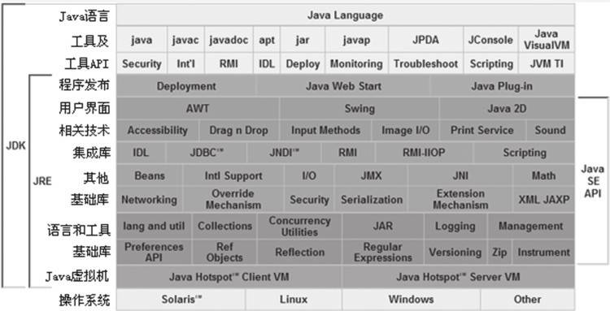

# 第 1 章 走近 Java

## 前言
　　Java 的技术体系主要是由支撑 Java 程序运行的虚拟机、为各开发领域提供接口支持的 Java API、Java 编程语言及许许多多的第三方 Java 框架（如 Spring 和 Struts 等）构成。
　　关于 Java 虚拟机的资料较少只要是由于 Java 开发技术的一个重要有点导致的：在虚拟机层面隐藏了底层技术的复杂性以及机器与操作系统的差异性。运行程序的物理机器情况千差万别，而 Java 虚拟机则在千差万别的物理机上面建立了统一的运行平台，实现了在任意一台虚拟机上编译的程序能在任何一台虚拟机上正常运行。
　　随着 Java 技术的不断发展，它被应用于越来越多的领域之中。其中一些领域，如电力、金融、通信等，对程序的性能、稳定性和可扩展性方面都有极高的要求。所以，了解虚拟机的运行也是必要的。
　　在绝大多数情况下，提升硬件效能无法等比例的提升程序的性能和并发能力，有时甚至可能对程序的性能没有任何改善作用。这里面有 Java 虚拟机的原因：为了达到为所有硬件提供一致的虚拟机平台的目的，牺牲了一些硬件相关的性能特性。更重要的人为原因：开发人员如果不了解虚拟机的一些技术特性的运行原理，就无法写出最适合虚拟机运行和可自优化的代码。

## 本章主要内容
	概述
	Java 技术体系
	Java 发展史
	展望 Java 技术的未来
	实战：自己编译 JDK

## 1.1 概述
　　Java 不仅仅是一门编程语言，它还是一个由一系列计算机软件和规范形成的技术体系，这个技术体系提供了完整的用于软件开发和跨平台部署的支持环境，并广泛应用于嵌入式系统、移动终端、企业服务器和大型机等各种场合。
　　Java 能获得如此广泛的认可，除了因为它拥有一门结构严谨、面向对象的编程语言之外，还有许多不可忽略的优点：它摆脱了硬件平台的束缚，实现了“一次编写，到处运行”的理想；它提供了一种相对安全的内存管理和访问机制，避免了绝大部分的内存泄漏和指针越界问题；它实现了热点代码检测和运行时编译及优化，这使得 Java 应用能随着运行时间的增加而获得更高的性能；它有一套完善的应用程序接口，还有无数的来自商业机构和开源社区的第三方类库来帮助实现各种各样的功能。。。。。。 Java 所带来的的这些好处让程序的开发效率得到了很大的提升。

## 1.2 Java 技术体系
　　Java 技术体系包括了一下几个组成部分：
* Java 程序设计语言
* 各种硬件平台上的 Java 虚拟机
* Class 文件格式
* Java API 类库
* 来自商业机构和开源社区的第三方 Java 类库。

**图 Java技术体系所包含的内容**

　　把 Java 程序设计语言、Java 虚拟机、Java API 类库这三部分统称为 JDK(Java Development Kit)，JDK 是用于支持 Java 程序开发的最小环境。
　　把 Java API 类库中的 Java SE API 子集和 Java 虚拟机这两部分统称为 JRE (Java Runtime Environment)，JRE 是支持 Java 程序运行的标准环境。
　　如果按照技术所服务的领域来划分，或者说按照 Java 技术关注的重点业务领域来划分，Java 技术体系可以分为四个平台，分别是：
* Java Card：支持一些 Java 小程序（Applets）运行在小内存设备（如智能卡）上的平台。
* Java ME (Micro Edition)：支持 Java 程序运行在移动终端（手机、PDA）上的平台，对 Java API 有所精简，并加入了针对移动终端的支持，这个版本以前称为 J2ME。
* Java SE (Standard Edition)：支持面向桌面级应用（如 Windows 下的应用程序）的 Java 平台，提供了完整的 Java 核心 API ，这个版本以前称为 J2SE。
* Java EE (Enterprise Edition)：支持使用多层架构的企业应用（如 ERP、CRM 应用）的 Java 平台，除了提供 Java SE API 之外，还对其做了大量的扩充并提供了相关的部署支持，这个版本以前称为 J2EE 。

## 1.3 Java 发展史
　　主要讲述了 Java 从诞生到现在的发展，每个版本新增的一些东西。

## 1.4 展望 Java 技术的未来

### 1.4.1 模块化

　　模块化是解决应用系统与技术平台越来越复杂、越来越庞大而产生的一系列问题的一个重要途径。无论是开发人员还是产品的最终用户，都不希望为了系统中的一小块功能而不得不下载、安装、部署及维护整套庞大的系统。最近几年 OSGi 技术的迅速发展正说明了通过模块化实现按需部署、降低复杂性和维护成本的需求是相当迫切的。

### 1.4.2 混合语言

　　Java 平台上的多语言混合编程正成为主流，没中语言都可以针对自己擅长的方面更好地解决问题。

### 1.4.3 多核并行

　　CPU 硬件的发展方向已经从高频率转变为多核心，随着多核时代的来临，软件开发越来越关注并行编程的领域。

### 1.4.4 进一步丰富语法

　　不断的扩充 Java 语法。

### 1.4.5 64 位虚拟机

　　几年之前，主流的 COU 就开始支持 64 为架构。Java 虚拟机也在很早之前就推出了支持 64 位系统的版本。但 Java 程序运行在 64 为虚拟机上需要付出比较大的额外代价：首先是内存问题，由于指针膨胀和各种数据类型对齐补白的原因，运行于 64 位系统上的 Java 应用需要消耗很多的内存，通常要比 32 位系统额外增加 10% ~ 30% 的内存消耗；其次是多个机构的测试结果显示，64 位虚拟机的运行速度在各个测试项上几乎全面落后于 32 位虚拟机，两者大约有 15% 左右的性能差距。

## 1.5 实战：自己编译 JDK
　　想要一探 JDK 内部的实现机制，最便捷的路径之一就是自己编译一套 JDK 。通过阅读和跟踪调试 JDK 源码去了解 Java 技术体系的原理，虽然门槛会高一些，但肯定会比阅读各种文章、书籍更加容易切近本质。另外，JDK 中的很多底层方法都是 Native 的，当需要跟踪这些方法的运作或对 JDK 进行 Hack 的时候，都需要编译一套自己的 JDK 。
（本节后续自行实现添加信息）
### 1.5.1 获取 JDK 源码

　　无笔记。

### 1.5.2 系统需求

　　无笔记。

### 1.5.3 构建编译环境

　　无笔记。

### 1.5.4 准备依赖项

　　无笔记。

### 1.5.5 进行编译

　　无笔记。

## 1.6 本章小结
　　本章介绍了 Java 技术体系的过去、现在和未来的发展趋势，并通过实践的方式介绍了如何自己来独立编译一个 OpenJDK 7。
