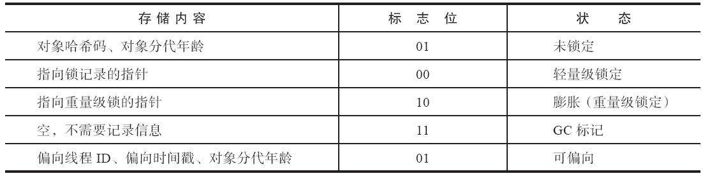
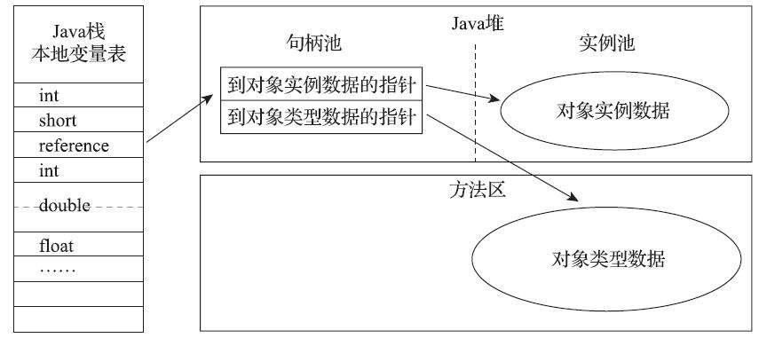
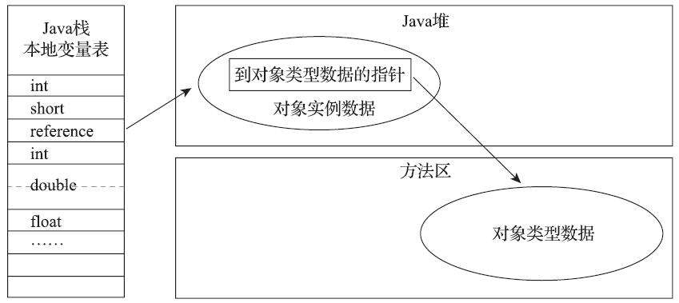

# 第 2 章 Java 内存区域与内存溢出异常

## 2.1 概述
　　对于 Java 程序员来说，在虚拟机的自动内存管理机制的帮助下，不再需要为每一个 new 操作去写配对的 delete/free 代码，而且不容易出现内存泄漏和内存溢出问题，看起来由虚拟机管理内存一切都很美好。不过，也正是因为 Java 程序员把内存控制的权利交给了 Java 虚拟机，一旦出现内存泄漏和溢出方面的问题，那排查错误将会成灰一项艰难的工作。

## 2.2 运行时数据区域
　　Java 虚拟机在执行 Java 程序的过程中会把它所管理的内存划分为若干个不同的数据区域。这些区域都有各自的用途，以及创建和销毁的时间，有的区域随着虚拟机进程的启动而存在，有的区域则是依赖用户线程的启动和结束而建立和销毁。根据《 Java 虚拟机规范（第 2 版）》的规定，Java 虚拟机所管理的内存将会包括以下几个运行时数据区域：


### 2.2.1 程序计数器

　　程序计数器（Program Counter Register）是一块较小的内存空间，它可以看作是当前线程所执行的字节码的行号指示器。在虚拟机的概念模型里，字节码解释器工作时就是通过改变这个计数器的值来选取下一条需要执行的字节码指令，分支、循环、跳转、异常处理、线程恢复等基础功能都需要依赖这个计数器来完成。

　　由于 Java 虚拟机的多线程是通过线程轮流切换、分配处理器执行时间的方式来实现的，在任何一个确定的时刻，一个处理器（对于多核处理器来说是一个内核）都只会执行一条线程中的指令。因此，为了线程切换后能恢复到正确的执行位置，每条线程都需要有一个独立的程序计数器，各个线程之间计数器互不影响、独立存储，我们称这类内存区域为 “ 线程私有 ” 的内存。

　　如果线程正在执行的是一个 Java 方法，这个计数器记录的是正在执行的虚拟机字节码指令的地址；如果正在执行的是本地（Native）方法，这个计数器值则应为空（Undefined）。此内存区域是唯一一个在 《 Java 虚拟机规范 》中没有规定任何 OutOfMemoryError 情况的区域。

### 2.2.2. Java 虚拟机栈

　　与程序计数器一样，Java 虚拟机栈（Java Virtual Machine Stack）也是线程私有的，它的生命周期与线程相同。虚拟机栈描述的是 Java 方法执行的线程内存模型：每个方法呗执行的时候，Java 虚拟机都会同步创建一个栈帧（Stack Frame）用于存储局部变量表、操作数栈、动态连接、放啊出口等信息。每一个方法被调用直至执行完毕的过程，就对应着一个栈帧在虚拟机栈中从入栈到出栈的过程。

　　局部变量表存放了编译器可知的各种 Java 虚拟机基本数据类型（boolean、byte、char、short、int、float、long、double）、对象引用（reference 类型，它并不等同于对象本身，可能是一个指向对象起始地址的引用指针，也可能是指向一个代表对象的句柄或者其他与此对象相关的位置）和 returnAddress 类型（指向了一条字节码指令的地址）。

　　这些数据类型在局部变量表中的存储空间以局部变量槽（Slot）来表示，其中 64 位长度的 long 和 double 类型的数据会占用两个变量槽，其余的数据类型只占用一个。局部变量表所需的内存空间在编译期间完成分配，当进入一个方法时，这个放啊需要在栈帧中分配多大的局部变量空间时完全确定的，在方法运行期间不会改变局部变量表的大小。请注意，这里的 “ 大小 ” 是指变量槽的数量，虚拟机真正使用多大的内存空间（譬如按照 1 个变量槽占用 32 个比特、64 个比特或者更多）来实现一个变量槽，这是完全由具体的虚拟机实现自行决定的事情。

　　在 《 Java 虚拟机规范 》中，对这个内存区域规定了两类异常状态：如果线程请求的栈深度大于虚拟机所允许的深度，将抛出 StackOverflowError 异常；如果 Java 虚拟机栈容量可以动态扩展，当栈扩展时无法申请到足够的内存会抛出 OutOfMemory 异常。

### 2.2.3 本地方法栈 

　　本地方法栈（Native Method Stacks）与虚拟机栈所发挥的作用是非常相似的，其区别只是虚拟机栈为虚拟机执行 Java 方法（也就是字节码）服务，而本地方法栈则是为虚拟机使用到的本地（Native）方法服务。

　　《 Java 虚拟机规范》对本地方法栈中方法使用的语言、使用方式与数据结构并没有任何强制规定，因此具体的虚拟机可以根据需要自由实现它，甚至有的 Java 虚拟机（譬如 Hot-Spot 虚拟机）直接就把本地方法栈和虚拟机栈合二为一。与虚拟机栈一样，本地方法栈也会在栈深度溢出或者栈扩展失败时分别抛出 StackOverflowError 和 OutOfMemoryError 异常。

### 2.2.4 Java 堆

　　对于 Java 应用程序来说，Java 堆（Java Heap）是虚拟机所管理的内存中最大的一块。

　　Java 堆是被所有线程共享的一块内存区域，在虚拟机启动时创建。

　　此内存区域的唯一目的就是存放对象实例，Java 世界里 “ 几乎 ” 所有的对象实例都在这里分配内存。

　　在《 Java 虚拟机规范》中对 Java 堆的描述是：“ 所有的对象实例以及数组都应当在堆上分配 ”，但是随着 Java 语言的发展，现在已经能看到些许迹象表明日后可能出现值类型的支持，即使只考虑现在，由于即时编译技术的进步，尤其是逃逸分析技术的日渐强大，栈上分配、标量替换优化手段已经导致一些微妙的变化悄然发生，所以说 Java 对象实例都分配在堆上也渐渐变得不是那么绝对了。

　　Java 堆是垃圾收集器管理的内存区域，因此一些资料中它也被称作 “ GC 堆 ”。

　　如果从分配内存的角度看，所有线程共享的 Java 堆中可以划分出多个线程私有的分配缓冲区（Thread Local Allocation Buffer，TLAB），以提升对象分配时的效率。 

　　不过无论从什么角度，无论如何划分，都不会改变 Java 堆中存储内容的共性，无论是哪个区域，存储的都只能是对象的实例，将 Java 堆细分的目的只是为了更好地回收内存，或者更快地分配内存。 

　　根据《 Java 虚拟机规范》的规定，Java 堆可以处于物理上不连续的内存空间中，但在逻辑上它应该被视为连续的。但对于大对象（典型的如数组对象），多数虚拟机实现出于实现简单、存储高效的考虑，很可能会要求连续的内存空间。

　　Java 堆既可以被实现成固定大小的，也可以是可扩展的，不过当前主流的 Java 虚拟机都是按照可扩展来实现的（通过参数 -Xmx 和 -Xms 设定）。

　　如果在 Java 堆中没有内存完成实例分配，并且堆也无法再扩展时，Java 虚拟机将会抛出 OutOfMemoryError 异常。

### 2.2.5 方法区 

　　方法区（Method Area）与 Java 堆一样，是各个线程共享的内存区域，它用于存储已被虚拟机加载的类型信息、常量、静态变量、即时编译器编译后的代码缓存等数据。

　　原则上如何实现方法区属于虚拟机实现细节，不受《 Java 虚拟机规范》管束，并不要求统一。 

　　《 Java 虚拟机规范》对方法区的约束是非常宽松的，除了和 Java 堆一样不需要连续的内存和可以选择固定大小或者可扩展外，甚至还可以选择不实现垃圾收集。

　　相对而言，垃圾收集行为在这个区域的确是比较少出现的，但并非数据进入了方法区就如永久代的名字一样 “ 永久 ” 存在了。这区域的内存回收目标主要是针对常量池的回收和对类型的卸载，一般来说这个区域的回收效果比较难令人满意，尤其是类型的卸载，条件相当苛刻，但是这部分区域的回收有时又确实是必要的。

　　根据《 Java 虚拟机规范》的规定，如果方法区无法满足新的内存分配需求时，将抛出 OutOfMemoryError 异常。

### 2.2.6 运行时常量池 

　　运行时常量池（Runtime Constant Pool）是方法区的一部分。 

　　Class 文件中除了有类的版本、字段、方法、接口等描述信息外，还有一项信息是常量池表（Constant Pool Table），用于存放编译期生成的各种字面量与符号引用，这部分内容将在类加载后存放到**方法区的运行时常量池**中。 

　　Java 虚拟机对于 Class 文件每一部分（自然也包括常量池）的格式都有严格规定，如每一个字节用于存储哪种数据都必须符合规范上的要求才会被虚拟机认可、加载和执行，但对于运行时常量池，《 Java 虚拟机规范》并没有做任何细节的要求，不同提供商实现的虚拟机可以按照自己的需要来实现这个内存区域，不过一般来说，除了保存 Class 文件中描述的符号引用外，还会把由符号引用翻译出来的直接引用也存储在运行时常量池中。

　　运行时常量池相对于 Class 文件常量池的另外一个重要特征是**具备动态性**，Java 语言并不要求常量一定只有编译期才能产生，也就是说，并非预置入 Class 文件中常量池的内容才能进入方法区运行时常量池，运行期间也可以将新的常量放入池中，这种特性被开发人员利用得比较多的便是 String 类的 intern() 方法。

　　既然运行时常量池是方法区的一部分，自然受到方法区内存的限制，当常量池无法再申请到内存时会抛出 OutOfMemoryError 异常。 

### 2.2.7 直接内存 

　　直接内存（Direct Memory）并不是虚拟机运行时数据区的一部分，也不是《 Java 虚拟机规范》中定义的内存区域。但是这部分内存也被频繁地使用，而且也可能导致 OutOfMemoryError 异常出现。

　　在 JDK 1.4 中新加入了 NIO（New Input/Output）类，引入了一种基于通道（Channel）与缓冲区（Buffer）的 I/O 方式，它可以使用 Native 函数库直接分配堆外内存，然后通过一个存储在 Java 堆里面的 DirectByteBuffer 对象作为这块内存的引用进行操作。这样能在一些场景中显著提高性能，因为避免了在 Java 堆和 Native 堆中来回复制数据。

　　显然，本机直接内存的分配不会受到 Java 堆大小的限制，但是，既然是内存，则肯定还是会受到本机总内存（包括物理内存、SWAP 分区或者分页文件）大小以及处理器寻址空间的限制，一般服务器管理员配置虚拟机参数时，会根据实际内存去设置 -Xmx 等参数信息，但经常忽略掉直接内存，使得各个内存区域总和大于物理内存限制（包括物理的和操作系统级的限制），从而导致动态扩展时出现 OutOfMemoryError 异常。

## 2.3 HotSpot 虚拟机对象探秘

### 2.3.1 对象的创建

　　对象的创建过程：分配内存、初始化零值、设置对象信息、执行构造函数。

#### 2.3.1.1 分配内存

　　当 Java 虚拟机遇到一条字节码 new 指令时，首先将去检查这个指令的参数是否能在常量池中定位到一个类的符号引用，并且检查这个符号引用代表的类是否已被加载、解析和初始化过。

　　如果没有，那必须先执行相应的类加载过程。

　　在类加载检查通过后，接下来虚拟机将为新生对象分配内存。

　　对象所需内存的大小在类加载完成后便可完全确定，为对象分配空间的任务实际上便等同于把一块确定大小的内存块从 Java 堆中划分出来。

　　假设 Java 堆中内存是绝对规整的，所有被使用过的内存都被放在一边，空闲的内存被放在另一边，中间放着一个指针作为分界点的指示器，那所分配内存就仅仅是把那个指针向空闲空间方向挪动一段与对象大小相等的距离，这种分配方式称为 “ **指针碰撞** ”（Bump The Pointer）。

　　但如果 Java 堆中的内存并不是规整的，已被使用的内存和空闲的内存相互交错在一起，那就没有办法简单地进行指针碰撞了，虚拟机就必须维护一个列表，记录上哪些内存块是可用的，在分配的时候从列表中找到一块足够大的空间划分给对象实例，并更新列表上的记录，这种分配方式称为 “ **空闲列表** ”（Free List）。

　　选择哪种分配方式由 Java 堆是否规整决定，而 Java 堆是否规整又由所采用的垃圾收集器是否带有空间压缩整理（Compact）的能力决定。

　　因此，当使用 Serial、ParNew 等带压缩整理过程的收集器时，系统采用的分配算法是指针碰撞，既简单又高效；而当使用 CMS 这种基于清除（Sweep）算法的收集器时，理论上就只能采用较为复杂的空闲列表来分配内存。

　　除如何划分可用空间外，还有另外一个问题：对象创建在虚拟机中是非常频繁的行为，即使仅仅修改一个指针所指向的位置，在并发情况下也并不是线程安全的。解决这个问题有两种可选方案：

1. 一种是对分配内存空间的动作进行同步处理

   实际上虚拟机是采用 CAS 配上失败重试的方式保证更新操作的原子性；

2. 另外一种是把内存分配的动作按照线程划分在不同的空间之中进行，即每个线程在Java堆中预先分配一小块内存，称为**本地线程分配缓冲**（Thread Local Allocation Buffer，TLAB）。

   哪个线程要分配内存，就在哪个线程的本地缓冲区中分配，只有本地缓冲区用完了，分配新的缓存区时才需要同步锁定。

   虚拟机是否使用 TLAB（本地线程分配缓冲），可以通过 -XX：+/-UseTLAB 参数来设定。

#### 2.3.1.2 初始化零值

　　内存分配完成之后，虚拟机必须将分配到的内存空间（但不包括对象头）都初始化为零值，如果使用了 TLAB（本地线程分配缓冲） 的话，这一项工作也可以提前至 TLAB（本地线程分配缓冲） 分配时顺便进行。这步操作保证了对象的实例字段在 Java 代码中可以不赋初始值就直接使用，使程序能访问到这些字段的数据类型所对应的零值。

#### 2.3.1.3 设置对象信息

　　接下来，Java 虚拟机还要对对象进行必要的设置，例如这个对象是哪个类的实例、如何才能找到类的元数据信息、对象的哈希码（实际上对象的哈希码会延后到真正调用 Object::hashCode() 方法时才计算）、对象的 GC分代年龄等信息。

　　这些信息存放在对象的对象头（ObjectHeader）之中。

　　根据虚拟机当前运行状态的不同，如是否启用偏向锁等，对象头会有不同的设置方式。

#### 2.3.1.4 构造函数

　　从虚拟机的视角来看，一个新的对象已经产生了。但是从 Java 程序的视角看来，对象创建才刚刚开始——构造函数，即 Class 文件中的 < init >() 方法还没有执行，所有的字段都为默认的零值，对象需要的其他资源和状态信息也还没有按照预定的意图构造好。

　　一般来说（由字节码流中 new 指令后面是否跟随 invokespecial 指令所决定，Java 编译器会在遇到 new 关键字的地方同时生成这两条字节码指令，但如果直接通过其他方式产生的则不一定如此），new 指令之后会接着执行 < init >() 方法，按照程序员的意愿对对象进行初始化，这样一个真正可用的对象才算完全被构造出来。

### 2.3.2 对象的内存布局

　　在 HotSpot 虚拟机里，对象在堆内存中的存储布局可以划分为三个部分：对象头（Header）、实例数据（Instance Data）和对齐填充（Padding）。

#### 2.3.2.1 对象头

　　HotSpot 虚拟机对象的对象头部分包括两类信息：

1. 第一类是用于存储对象自身的运行时数据，如哈希码（HashCode）、 GC 分代年龄、锁状态标志、线程持有的锁、偏向线程 ID、偏向时间戳等。

   这部分数据的长度在 32 位和 64 位的虚拟机（未开启压缩指针）中分别为 32 个比特和 64 个比特，官方称它为 “Mark Word”。

   对象需要存储的运行时数据很多，其实已经超出了 32、64 位 Bitmap 结构所能记录的最大限度，但对象头里的信息是与对象自身定义的数据无关的额外存储成本，考虑到虚拟机的空间效率，Mark Word 被设计成一个有着动态定义的数据结构，以便在极小的空间内存储尽量多的数据，根据对象的状态复用自己的存储空间。

   例如在 32 位的 HotSpot 虚拟机中，如对象未被同步锁锁定的状态下，Mark Word 的 32 个比特存储空间中的 25 比特用于存储对象哈希码， 4 个比特用于存储对象分代年龄，2 个比特用于存储锁标志位，1 个比特固定为 0，在其他状态（轻量级锁定、重量级锁定、GC 标记、可偏向）下对象的存储内容如下表所示：

     

2. 对象头的另外一部分是类型指针，即对象指向它的类型元数据的指针，Java虚拟机通过这个指针来确定该对象是哪个类的实例。

   并不是所有的虚拟机实现都必须在对象数据上保留类型指针，换句话说，查找对象的元数据信息并不一定要经过对象本身。 

　　此外，如果对象是一个 Java 数组，那在对象头中还必须有一块用于记录数组长度的数据，因为虚拟机可以通过普通 Java 对象的元数据信息确定 Java 对象的大小，但是如果数组的长度是不确定的，将无法通过元数据中的信息推断出数组的大小。

#### 2.3.2.2 实例数据

　　接下来实例数据部分是对象真正存储的有效信息，即在程序代码里面所定义的各种类型的字段内容，无论是从父类继承下来的，还是在子类中定义的字段都必须记录起来。

　　这部分的存储顺序会受到虚拟机分配策略参数（ -XX：FieldsAllocationStyle 参数）和字段在 Java 源码中定义顺序的影响。

　　HotSpot 虚拟机默认的分配顺序为 longs/doubles、ints、shorts/chars、bytes/booleans、oops（Ordinary Object Pointers，OOPs），从以上默认的分配策略中可以看到，相同宽度的字段总是被分配到一起存放，在满足这个前提条件的情况下，在父类中定义的变量会出现在子类之前。

　　如果 HotSpot 虚拟机的 +XX：CompactFields 参数值为 true（默认就为 true），那子类之中较窄的变量也允许插入父类变量的空隙之中，以节省出一点点空间。

#### 2.3.2.3 对齐填充 

　　对象的第三部分是对齐填充，这并不是必然存在的，也没有特别的含义，它仅仅起着占位符的作用。

　　由于 HotSpot 虚拟机的自动内存管理系统要求对象起始地址必须是 8 字节的整数倍，换句话说就是任何对象的大小都必须是 8 字节的整数倍。对象头部分已经被精心设计成正好是 8 字节的倍数（ 1 倍或者  倍），因此，如果对象实例数据部分没有对齐的话，就需要通过对齐填充来补全。

### 2.3.3 对象的访问定位

　　Java 程序会通过栈上的 reference 数据来操作堆上的具体对象。

　　由于 reference 类型在《 Java 虚拟机规范》里面只规定了它是一个指向对象的引用，并没有定义这个引用应该通过什么方式去定位、访问到堆中对象的具体位置，所以对象访问方式也是由虚拟机实现而定的。

　　主流的访问方式主要有使用句柄和直接指针两种：

* 如果使用句柄访问的话，Java 堆中将可能会划分出一块内存来作为句柄池，reference 中存储的就是对象的句柄地址，而句柄中包含了对象实例数据与类型数据各自具体的地址信息，其结构如下图所示：

  

* 如果使用直接指针访问的话，Java 堆中对象的内存布局就必须考虑如何放置访问类型数据的相关信息，reference 中存储的直接就是对象地址，如果只是访问对象本身的话，就不需要多一次间接访问的开销，如下图所示：

  

　　这两种对象访问方式各有优势，**使用句柄来访问的最大好处**就是 reference 中存储的是稳定句柄地址，在对象被移动（ 垃圾收集时移动对象是非常普遍的行为）时只会改变句柄中的实例数据指针，而 reference 本身不需要被修改。

　　**使用直接指针来访问最大的好处就是速度更快**，它节省了一次指针定位的时间开销，由于对象访问在 Java 中非常频繁，因此这类开销积少成多也是一项极为可观的执行成本，就虚拟机 HotSpot 而言，它主要使用第二种方式进行对象访问（有例外情况，如果使用了 Shenandoah 收集器的话也会有一次额外的转发），但从整个软件开发的范围来看，在各种语言、框架中使用句柄来访问的情况也十分常见。

## 2.4 实战：OutOfMemoryError 异常

　　在《 Java 虚拟机规范》的规定里，除了程序计数器外，虚拟机内存的其他几个运行时区域都有发生 OutOfMemoryError（OOM）异常的可能。

　　内存溢出异常与虚拟机本身的实现细节密切相关，并非全是 Java 语言中约定的公共行为。

### 2.4.1 Java 堆溢出

　　Java 堆用于储存对象实例，只要不断地创建对象，并且保证 GC Roots 到对象之间有可达路径来避免垃圾回收机制清除这些对象，那么随着对象数量的增加，总容量触及最大堆的容量限制后就会产生内存溢出异常。

　　将堆的最小值 -Xms 参数与最大值 -Xmx 参数设置为一样即可避免堆自动扩展，通过参数 -XX：+HeapDumpOnOutOfMemoryError 可以让虚拟机在出现内存溢出异常的时候 Dump 出当前的内存堆转储快照以便进行事后分析。

　　Java 堆内存的 OutOfMemoryError 异常是实际应用中最常见的内存溢出异常情况。出现 Java 堆内存溢出时，异常堆栈信息 “java.lang.OutOfMemoryError” 会跟随进一步提示 “Java heapspace”。

　　要解决这个内存区域的异常，常规的处理方法是首先通过内存映像分析工具（如 EclipseMemory Analyzer）对 Dump 出来的堆转储快照进行分析。

　　第一步首先应确认内存中导致 OOM 的对象是否是必要的，也就是要先分清楚到底是出现了内存泄漏（Memory Leak）还是内存溢出（Memory Overflow）。

1. 如果是内存泄漏，可进一步通过工具查看泄漏对象到 GC Roots 的引用链，找到泄漏对象是通过怎样的引用路径、与哪些 GC Roots 相关联，才导致垃圾收集器无法回收它们，根据泄漏对象的类型信息以及它到 GC Roots 引用链的信息，一般可以比较准确地定位到这些对象创建的位置，进而找出产生内存泄漏的代码的具体位置。

2. 如果不是内存泄漏，换句话说就是内存中的对象确实都是必须存活的，那就应当检查 Java 虚拟机的堆参数（-Xmx 与 -Xms）设置，与机器的内存对比，看看是否还有向上调整的空间。再从代码上检查是否存在某些对象生命周期过长、持有状态时间过长、存储结构设计不合理等情况，尽量减少程序运行期的内存消耗。

### 2.4.2 虚拟机栈和本地方法栈溢出

　　由于 HotSpot 虚拟机中并不区分虚拟机栈和本地方法栈，因此对于 HotSpot 来说，-Xoss 参数（设置本地方法栈大小）虽然存在，但实际上是没有任何效果的，栈容量只能由 -Xss 参数来设定。

　　关于虚拟机栈和本地方法栈，在《 Java 虚拟机规范》中描述了两种异常：

1. 如果线程请求的栈深度大于虚拟机所允许的最大深度，将抛出 StackOverflowError 异常。
2. 如果虚拟机的栈内存允许动态扩展，当扩展栈容量无法申请到足够的内存时，将抛出 OutOfMemoryError 异常。

　　《 Java 虚拟机规范》明确允许 Java 虚拟机实现自行选择是否支持栈的动态扩展，而 HotSpot 虚拟机的选择是不支持扩展，所以除非在创建线程申请内存时就因无法获得足够内存而出现 OutOfMemoryError 异常，否则在线程运行时是不会因为扩展而导致内存溢出的，只会因为栈容量无法容纳新的栈帧而导致 StackOverflowError 异常。

　　对于不同版本的 Java 虚拟机和不同的操作系统，栈容量最小值可能会有所限制，这主要取决于操作系统内存分页大小。比如，-Xss128k 可以正常用于 32 位 Windows 系统下的 JDK 6，但是如果用于 64 位 Windows 系统下的 JDK 11，则会提示栈容量最小不能低于 180K，而在 Linux 下这个值则可能是 228K，如果低于这个最小限制，HotSpot 虚拟器启动时会给出如下提示：

 ```java
The Java thread stack size specified is to o small. Specify at least 228K. 
 ```

　　无论是由于栈帧太大还是虚拟机栈容量太小，当新的栈帧内存无法分配的时候，HotSpot 虚拟机抛出的都是 StackOverflowError 异常。

　　如果在允许动态扩展栈容量大小的虚拟机上，相同代码则会导致不一样的情况。

　　如果测试时不限于单线程，通过不断建立线程的方式，在 HotSpot 上也是可以产生内存溢出异常的。但是这样产生的内存溢出异常和栈空间是否足够并不存在任何直接的关系，主要取决于操作系统本身的内存使用状态。甚至可以说，在这种情况下，给每个线程的栈分配的内存越大，反而越容易产生内存溢出异常。原因其实不难理解，操作系统分配给每个进程的内存是有限制的，譬如 32 位 Windows 的单个进程最大内存限制为 2GB。HotSpot 虚拟机提供了参数可以控制 Java 堆和方法区这两部分的内存的最大值，那剩余的内存即为 2GB（操作系统限制）减去最大堆容量，再减去最大方法区容量，由于程序计数器消耗内存很小，可以忽略掉，如果把直接内存和虚拟机进程本身耗费的内存也去掉的话，剩下的内存就由虚拟机栈和本地方法栈来分配了。因此为每个线程分配到的栈内存越大，可以建立的线程数量自然就越少，建立线程时就越容易把剩下的内存耗尽。

　　出现 StackOverflowError 异常时，会有明确错误堆栈可供分析，相对而言比较容易定位到问题所在。

　　如果使用 HotSpot 虚拟机默认参数，栈深度在大多数情况下（因为每个方法压入栈的帧大小并不是一样的，所以只能说大多数情况下）到达 1000~2000 是完全没有问题，对于正常的方法调用（包括不能做尾递归优化的递归调用），这个深度应该完全够用了。但是，如果是建立过多线程导致的内存溢出，在不能减少线程数量或者更换 64 位虚拟机的情况下，就只能通过减少最大堆和减少栈容量来换取更多的线程。

　　这种通过 “ 减少内存 ” 的手段来解决内存溢出的方式，如果没有这方面处理经验，一般比较难以想到，也是由于这种问题较为隐蔽，从 JDK 7 起，以上提示信息中 “unable to create nativethread” 后面，虚拟机会特别注明原因可能是 “possibly out of memory orprocess/resource limits reached”。

### 2.4.3 方法区和运行时常量池溢出

　　HotSpot 从 JDK 7 开始逐步 “ 去永久代 ” 的计划，并在 JDK 8 中完全使用元空间来代替永久代。

　　String::intern() 是一个本地方法，它的作用是如果字符串常量池中已经包含一个等于此 String 对象的字符串，则返回代表池中这个字符串的 String 对象的引用；否则，会将此 String 对象包含的字符串添加到常量池中，并且返回此 String 对象的引用。

　　在 JDK 6 或更早之前的 HotSpot 虚拟机中，常量池都是分配在永久代中，可以通过 -XX：PermSize 和 -XX：MaxPermSize 限制永久代的大小，即可间接限制其中常量池的容量。

　　运行时常量池溢出时，在 OutOfMemoryError 异常后面跟随的提示信息是 “PermGen space”，说明运行时常量池的确是属于方法区（即 JDK 6 的 HotSpot 虚拟机中的永久代）的一部分。

　　而使用 JDK 7 或更高版本的 JDK 来运行这段程序并不会得到相同的结果，无论是在 JDK 7 中继续使用 -XX：MaxPermSize 参数或者在 JDK 8 及以上版本使用 -XX：MaxMeta-spaceSize 参数把方法区容量同样限制在 6MB，也都不会重现 JDK 6 中的溢出异常，循环将一直进行下去，永不停歇。出现这种变化，是因为自 JDK 7 起，原本存放在永久代的字符串常量池被移至 Java 堆之中，所以在 JDK 7 及以上版本，限制方法区的容量对该测试用例来说是毫无意义的。这时候使用 -Xmx 数限制最大堆到 6MB 就能够看到以下两种运行结果之一，具体取决于哪里的对象分配时产生了溢出。

　　String.intern() 返回引用的测试：

```java
public class RuntimeConstantPoolOOM {
	public static void main(String[] args){
		String str1 = new StringBuilder("计算机").append("软件").toString();
		System.out.println(str1.intern() == str1);
		
		String str2 = new StringBuilder("ja").append("va").toString();
		System.out.println(str2.intern() == str2);
	}
}
```

　　这段代码在 JDK 6 中运行，会得到两个 false，而在 JDK 7 中运行，会得到一个 true 和一个 false 。

　　产生差异的原因是，在 JDK 6 中，intern() 方法会把首次遇到的字符串实例复制到永久代的字符串常量池中存储，返回的也是永久代里面这个字符串实例的引用，而由 StringBuilder 创建的字符串对象实例在 Java 堆上，所以必然不可能是同一个引用，结果将返回 false。

　　而 JDK 7（以及部分其他虚拟机，例如 JRockit）的 intern() 方法实现就不需要再拷贝字符串的实例到永久代了，既然字符串常量池已经移到 Java 堆中，那只需要在常量池里记录一下首次出现的实例引用即可，因此 intern() 返回的引用和由 StringBuilder 创建的那个字符串实例就是同一个。而对 str2 比较返回 false，这是因为 “java” 这个字符串在执行 StringBuilder.toString() 之前就已经出现过了，字符串常量池中已经有它的引用，不符合 intern() 方法要求 “ 首次遇到 ” 的原则，“ 计算机软件 ” 这个字符串则是首次出现的，因此结果返回 true。

　　方法区的主要职责是用于存放类型的相关信息，如类名、访问修饰符、常量池、字段描述、方法描述等。

　　方法区溢出也是一种常见的内存溢出异常，一个类如果要被垃圾收集器回收，要达成的条件是比较苛刻的。在经常运行时生成大量动态类的应用场景里，就应该特别关注这些类的回收状况

　　运行时生成了大量的动态类的场景除了程序使用了 CGLib 字节码增强和动态语言外，常见的还有：大量 JSP 或动态产生 JSP 文件的应用（JSP 第一次运行时需要编译为 Java 类）、基于 OSGi 的应用（即使是同一个类文件，被不同的加载器加载也会视为不同的类）等。

　　在 JDK 8 以后，永久代便完全退出了历史舞台，元空间作为其替代者登场。在默认设置下，正常的动态创建新类型的测试用例已经很难再迫使虚拟机产生方法区的溢出异常了。

　　HotSpot 还提供了一些参数作为元空间的防御措施，主要包括：

* -XX：MaxMetaspaceSize：设置元空间最大值，默认是 -1，即不限制，或者说只受限于本地内存大小。
* -XX：MetaspaceSize：指定元空间的初始空间大小，以字节为单位，达到该值就会触发垃圾收集进行类型卸载，同时收集器会对该值进行调整：如果释放了大量的空间，就适当降低该值；如果释放了很少的空间，那么在不超过 -XX：MaxMetaspaceSize（如果设置了的话）的情况下，适当提高该值。
* -XX：MinMetaspaceFreeRatio：作用是在垃圾收集之后控制最小的元空间剩余容量的百分比，可减少因为元空间不足导致的垃圾收集的频率。类似的还有 -XX：Max-MetaspaceFreeRatio，用于控制最大的元空间剩余容量的百分比。

### 2.4.4 本机直接内存溢出

　　直接内存（Direct Memory）的容量大小可通过 -XX：MaxDirectMemorySize 参数来指定，如果不去指定，则默认与 Java 堆最大值（由 -Xmx 指定）一致。

　　由直接内存导致的内存溢出，一个明显的特征是在 Heap Dump 文件中不会看见有什么明显的异常情况，如果发现内存溢出之后产生的 Dump 文件很小，而程序中又直接或间接使用了 DirectMemory（典型的间接使用就是 NIO），那就可以考虑重点检查一下直接内存方面的原因了。

## 2.5 本章小结

　　本章内容包括虚拟机里面的内存是如何划分的，哪部分区域、什么样的代码和操作可能导致内存溢出异常。
