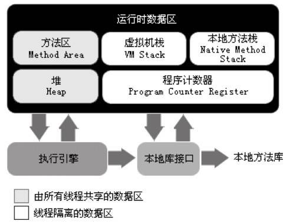

# 第 2 章 Java 内存区域与内存溢出异常

## 本章主要内容
	概述
	运行时数据区域
	对象访问
	实战：OutOfMemoryError 异常

## 2.1 概述
　　对于 Java 程序员来说，在虚拟机的自动内存管理机制的帮助下，不再需要为每一个 new 操作去写配对的 delete/free 代码，而且不容易出现内存泄漏和内存溢出问题，看起来由虚拟机管理内存一切都很美好。不过，也正是因为 Java 程序员把内存控制的权利交给了 Java 虚拟机，一旦出现内存泄漏和溢出方面的问题，那排查错误将会成灰一项艰难的工作。

## 2.2 运行时数据区域
　　Java 虚拟机在执行 Java 程序的过程中会把它所管理的内存划分为若干个不同的数据区域。这些区域都有各自的用途，以及创建和销毁的时间，有的区域随着虚拟机进程的启动而存在，有的区域则是依赖用户线程的启动和结束而建立和销毁。根据《Java 虚拟机规范（第 2 版）》的规定，Java 虚拟机所管理的内存将会包括以下几个运行时数据区域：

#### 2.2.1 程序计数器
　　程序计数器（Program Counter Register）是一块较小的内存空间，它可以看作是当前线程所执行的字节码的行号指示器。在虚拟机的概念模型里，字节码解释器工作时就是通过改变这个计数器的值来选取下一条需要执行的字节码指令，分支、循环、跳转、异常处理、线程恢复等基础功能都需要依赖这个计数器来完成。

