# 第 4 章 虚拟机性能监控、故障处理工具

## 4.1 概述

 　　恰当地使用虚拟机故障处理、分离的工具可以提升分析数据、定位并解决问题的效率。

## 4.2 基础故障处理工具

 　　JDK 自带工具：

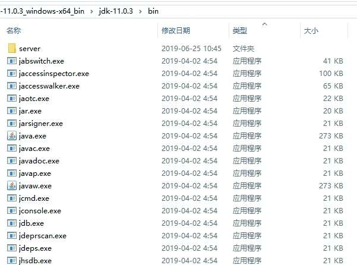

 　　故障处理工具根据软件可用性和授权的不同，可以把它们划分成三类：

1. 商业授权工具

   主要是 JMC（ Java Mission Control ）及它要使用到的 JFR（ Java Flight Recorder ），JMC 这个原本来自于 JRockit 的运维监控套件从 JDK 7 Update 40 开始就被集成到 OracleJDK 中，JDK 11之前都无须独立下载，但是在商业环境中使用它则是要付费的。

2. 正式支持工具

   这一类工具属于被长期支持的工具，不同平台、不同版本的 JDK 之间，这类工具可能会略有差异，但是不会出现某一个工具突然消失的情况。

3. 实验性工具

   这一类工具在它们的使用说明中被声明为 “ 没有技术支持，并且是实验性质的 ”（ Unsupported and Experimental ）产品，日后可能会转正，也可能会在某个JDK版本中无声无息地消失。但事实上它们通常都非常稳定而且功能强大，也能在处理应用程序性能问题、定位故障时发挥很大的作用。   

 　　这些工具程序大多数体积都异常小，各个工具的体积基本上都稳定在 21 KB 左右，这是因为这些命令行工具大多仅是一层薄包装而已，真正的功能代码是实现在 JDK 的工具类库中的。

 　　假如使用的是 Linux 版本的 JDK，还可以发现这些工具中不少是由 Shell 脚本直接写成，可以用文本编辑器打开并编辑修改它们。  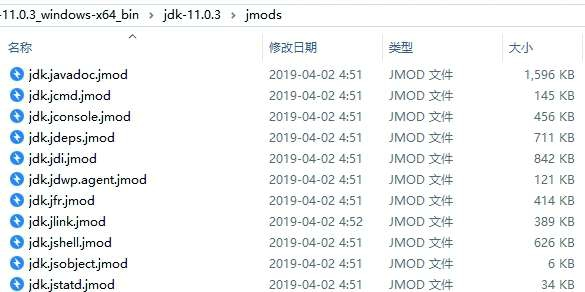

  　　JDK 开发团队选择采用 Java 语言本身来实现这些故障处理工具是有特别用意的：当应用程序部署到生产环境后，无论是人工物理接触到服务器还是远程 Telnet 到服务器上都可能会受到限制。借助这些工具类库里面的接口和实现代码，开发者可以选择直接在应用程序中提供功能强大的监控分析功能。 

 　　如果在工作中需要监控运行于 JDK 5 的虚拟机之上的程序，在程序启动时请添加参数 “ -Dcom.sun.management.jmxremote ” 开启 JMX 管理功能，否则由于大部分工具都是基于或者要用到 JMX（ 包括下一节的可视化工具 ），它们都将无法使用，如果被监控程序运行于 JDK 6 或以上版本的虚拟机之上，那 JMX 管理默认是开启的，虚拟机启动时无须再添加任何参数。 

 ### 4.2.1 jps：虚拟机进程状况工具

 　　jps（ JVM Process Status Tool ）可以列出正在运行的虚拟机进程，并显示虚拟机执行主类（ Main Class，main() 函数所在的类 ）名称以及这些进程的本地虚拟机唯一 ID（ LVMID，Local Virtual Machine Identifier ）。

 　　对于本地虚拟机进程来说，LVMID 与操作系统的进程 ID（ PID，Process Identifier ）是一致的，使用 Windows 的任务管理器或者 UNIX 的 ps命令也可以查询到虚拟机进程的 LVMID，但如果同时启动了多个虚拟机进程，无法根据进程名称定位时，那就必须依赖 jps 命令显示主类的功能才能区分了。 

 　　jps命令格式：

```java
 jps [ options ] [ hostid ]  
```

 　　jps 还可以通过 RMI 协议查询开启了 RMI 服务的远程虚拟机进程状态，参数 hostid 为 RMI 注册表中注册的主机名。jps的其他常用选项见下表：  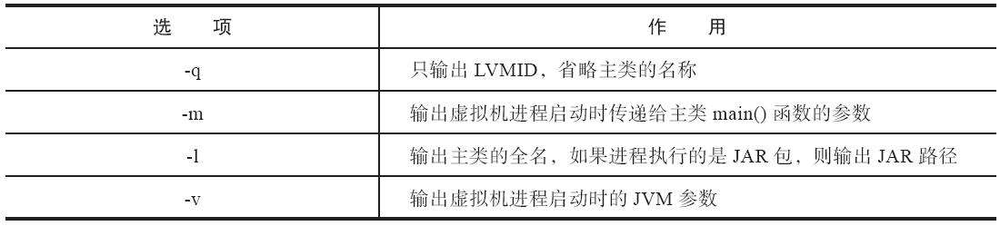

### 4.2.2 jstat：虚拟机统计信息监视工具

 　　jstat（ JVM Statistics Monitoring Tool ）是用于监视虚拟机各种运行状态信息的命令行工具。它可以显示本地或者远程虚拟机进程中的类加载、内存、垃圾收集、即时编译等运行时数据，在没有 GUI 图形界面、只提供了纯文本控制台环境的服务器上，它将是运行期定位虚拟机性能问题的常用工具。 

 　　jstat命令格式为：

```java
jstat [ option vmid [interval[s|ms] [count]] ] 
```

 　　对于命令格式中的 VMID 与 LVMID 需要特别说明一下：如果是本地虚拟机进程，VMID 与LVMID 是一致的；如果是远程虚拟机进程，那VMID 的格式应当是：

```java
 [protocol:][//]lvmid[@hostname[:port]/servername] 
```

 　　参数 interval 和 count 代表查询间隔和次数，如果省略这 2 个参数，说明只查询一次。

 　　选项 option 代表用户希望查询的虚拟机信息，主要分为三类：类加载、垃圾收集、运行期编译状况。详细请参考下表中的描述。 

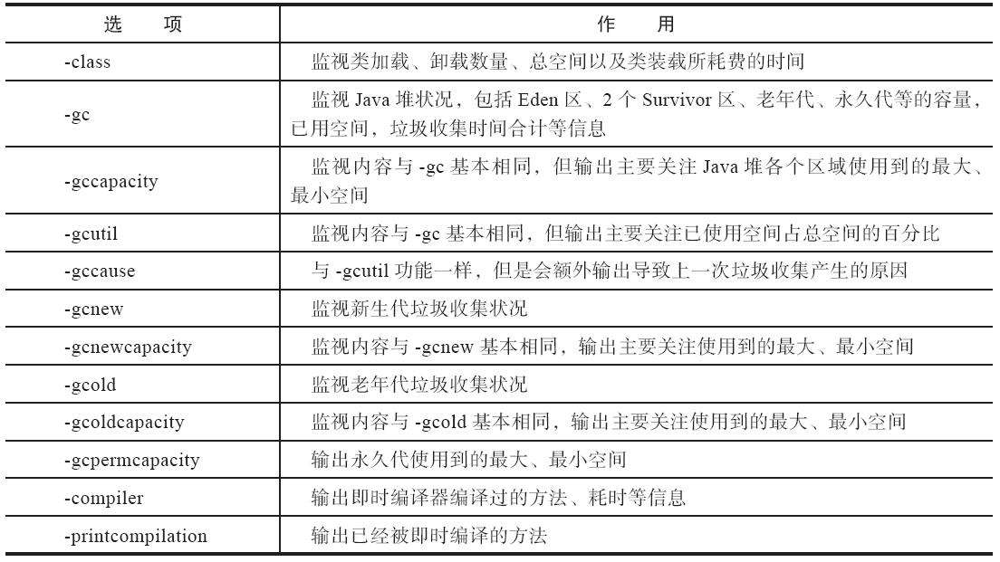 

 ### 4.2.3 jinfo：Java 配置信息工具

 　　jinfo（ Configuration Info for Java ）的作用是**实时查看和调整虚拟机各项参数**。使用 jps 命令的 -v 参数可以查看虚拟机启动时显式指定的参数列表，但如果想知道未被显式指定的参数的系统默认值，除了去找资料外，就只能使用 jinfo 的 -flag 选项进行查询了（如果只限于 JDK 6 或以上版本的话，使用 java-XX：+PrintFlagsFinal 查看参数默认值也是一个很好的选择）。

  　　jinfo 还可以使用 -sysprops 选项把虚拟机进程的 System.getProperties() 的内容打印出来。这个命令在 JDK 5 时期已经随着 Linux 版的 JDK 发布，当时只提供了信息查询的功能，JDK 6 之后，jinfo 在 Windows 和 Linux 平台都有提供，并且加入了在运行期修改部分参数值的能力（可以使用 -flag[+|-]name 或者 -flag name=value 在运行期修改一部分运行期可写的虚拟机参数值）。

 　　在 JDK 6 中，jinfo 对于 Windows 平台功能仍然有较大限制，只提供了最基本的 -flag 选项。

 　　jinfo命令格式：

```java
jinfo [ option ] pid
```

### 4.2.4 jmap：Java 内存映像工具

　　jmap（ Memory Map for Java ）命令用于**生成堆转储快照**（ 一般称为 heapdump 或 dump 文件 ）。如果不使用 jmap 命令，要想获取 Java 堆转储快照也还有一些比较“暴力”的手段：譬如在第 2 章中用过的 -XX：+HeapDumpOnOutOfMemoryError 参数，可以让虚拟机在内存溢出异常出现之后自动生成堆转储快照文件，通过 -XX：+HeapDumpOnCtrlBreak 参数则可以使用 [Ctrl]+[Break] 键让虚拟机生成堆转储快照文件，又或者在 Linux 系统下通过 Kill-3 命令发送进程退出信号 “ 恐吓 ” 一下虚拟机，也能顺利拿到堆转储快照。 

　　jmap 的作用并不仅仅是为了获取堆转储快照，它还可以查询 finalize 执行队列、Java 堆和方法区的详细信息，如空间使用率、当前用的是哪种收集器等。 

　　和 jinfo 命令一样，jmap 有部分功能在Windows 平台下是受限的，除了生成堆转储快照的 -dump 选项和用于查看每个类的实例、空间占用统计的 -histo 选项在所有操作系统中都可以使用之外，其余选项都只能在 Linux/Solaris 中使用。 

　　jmap命令格式：

```
 jmap [ option ] vmid 
```

　　option 选项的合法值与具体含义如下表所示。 

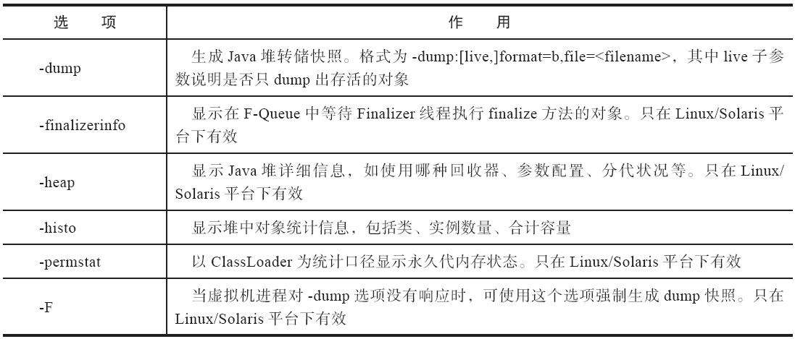 

 ### 4.2.5 jhat：虚拟机堆转储快照分析工具

　　JDK 提供 jhat（ JVM Heap Analysis Tool ）命令与 jmap 搭配使用，来分析 jmap 生成的堆转储快照。

　　jhat 内置了一个微型的 HTTP/Web 服务器，生成堆转储快照的分析结果后，可以在浏览器中查看。

　　在实际工作中，除非手上真的没有别的工具可用，否则多数人是不会直接使用 jhat 命令来分析堆转储快照文件的，主要原因有两个方面：

1. 一是一般不会在部署应用程序的服务器上直接分析堆转储快照，即使可以这样做，也会尽量将堆转储快照文件复制到其他机器上进行分析，因为分析工作是一个耗时而且极为耗费硬件资源的过程，既然都要在其他机器上进行，就没有必要再受命令行工具的限制了。
2. 另外一个原因是 jhat 的分析功能相对来说比较简陋，VisualVM 以及专业用于分析堆转储快照文件的 Eclipse Memory Analyzer、IBM HeapAnalyzer 等工具，都能实现比 jhat 更强大专业的分析功能。

　　分析结果默认以包为单位进行分组显示，分析内存泄漏问题主要会使用到其中的 “ Heap Histogram ”（与 jmap-histo 功能一样）与 OQL页签的功能，前者可以找到内存中总容量最大的对象，后者是标准的对象查询语言，使用类似 SQL 的语法对内存中的对象进行查询统计。

 ### 4.2.6 jstack：Java 堆栈跟踪工具

　　jstack（ Stack Trace for Java ）命令**用于生成虚拟机当前时刻的线程快照**（ 一般称为 threaddump 或者 javacore 文件）。

　　**线程快照**就是当前虚拟机内每一条线程正在执行的方法堆栈的集合，生成线程快照的**目的**通常是定位线程出现长时间停顿的原因，如线程间死锁、死循环、请求外部资源导致的长时间挂起等，都是导致线程长时间停顿的常见原因。

　　线程出现停顿时通过 jstack 来查看各个线程的调用堆栈，就可以获知没有响应的线程到底在后台做些什么事情，或者等待着什么资源。

　　jstack命令格式：

```java
jstack [ option ] vmid
```

　　option选项的合法值与具体含义如下表所示：

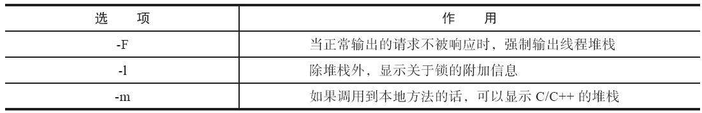

　　从 JDK 5 起，java.lang.Thread 类新增了一个getAllStackTraces() 方法用于获取虚拟机中所有线程的 StackTraceElement 对象。使用这个方法可以通过简单的几行代码完成 jstack 的大部分功能，在实际项目中不妨调用这个方法做个管理员页面，可以随时使用浏览器来查看线程堆栈。

### 4.2.7 基础工具总结 

　　下面表中罗列了JDK附带的全部（包括曾经存在但已经在最新版本中被移除的）工具及其简要用途：

　　基础工具：用于支持基本的程序创建和运行

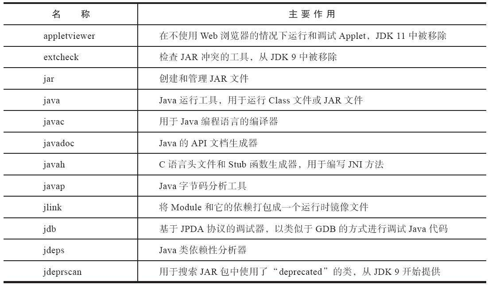

　　安全：用于程序签名、设置安全测试等

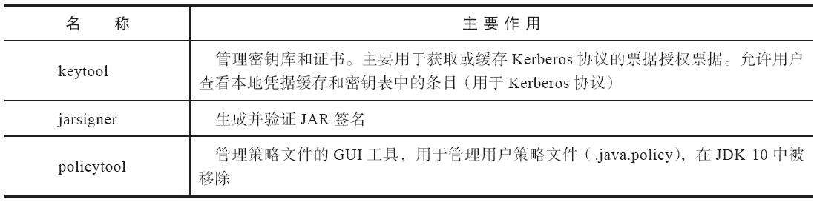 

　　国际化：用于创建本地语言文件

 

　　远程方法调用：用于跨Web或网络的服务交互

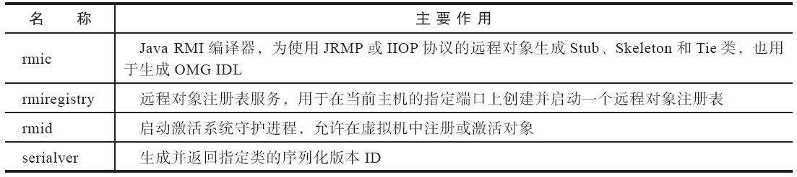 

　　Java IDL与RMI-IIOP：在JDK 11中结束了十余年的CORBA支持，这些工具不再提供

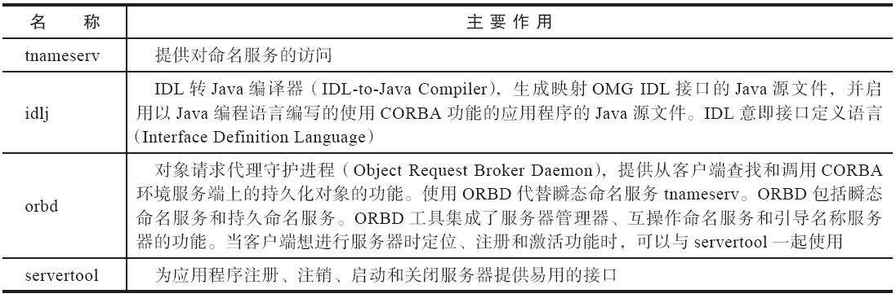

　　部署工具：用于程序打包、发布和部署

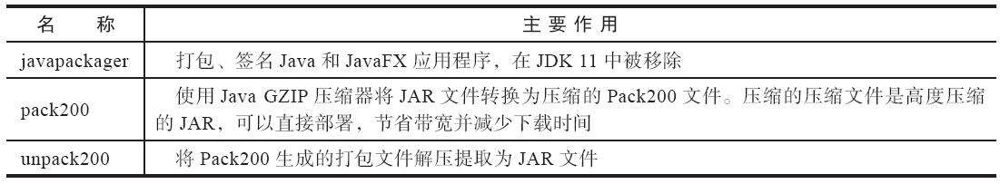

　　Java Web Start


　　性能监控和故障处理：用于监控分析 Java 虚拟机运行信息，排查问题

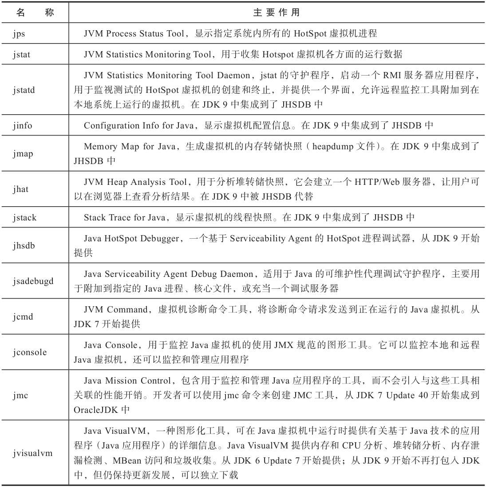

　　WebService工具：与 CORBA 一起在 JDK 11 中被移除

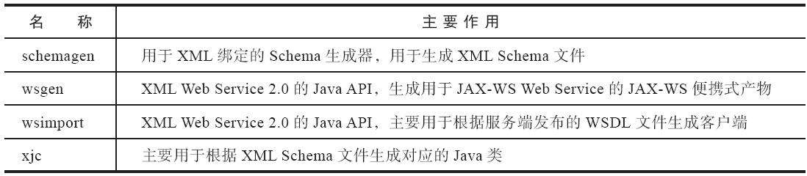

　　REPL和脚本工具

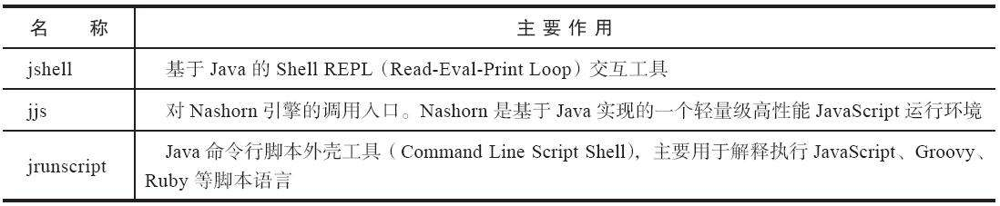

## 4.3 可视化故障处理工具 

JDK中除了附带大量的命令行工具外，还提供了几个功能集成度更高的可视化工具，用户可以使用这些可视化工具以更加便捷的方式进行进程故障诊断和调试工作

 

 

这类工具主要包括JConsole、JHSDB、VisualVM和JMC四个

 

 

其中，JConsole是最古老，早在JDK 5时期就已经存在的虚拟机监控工具，而JHSDB虽然名义上是JDK 9中才正式提供，但之前已经以sa-jdi.jar包里面的HSDB（可视化工具）和CLHSDB（命令行工具）的形式存在了很长一段时间。它们两个都是JDK的正式成员，随着JDK一同发布，无须独立下载，使用也是完全免费的。 

 

 

VisualVM在JDK 6 Update 7中首次发布，直到

 

 

JRockit Mission Control与OracleJDK的融合工作完成之前，它都曾是Oracle主力推动的多合一故障处理工具，现在它已经从OracleJDK中分离出来，成为一个独立发展的开源项目。VisualVM已不是JDK中的正式成员，但仍是可以免费下载、使用的。 

 

 

Java Mission Control，曾经是大名鼎鼎的来自BEA公司的图形化诊断工具，随着BEA公司被Oracle收购，它便被融合进OracleJDK之中。在JDK 7 Update 40时开始随JDK一起发布，后来Java SE Advanced产品线建立，Oracle明确区分了Oracle OpenJDK和OracleJDK的差别，JMC从JDK 11开始又被移除出JDK。虽然在2018年Oracle将JMC开源并交付给OpenJDK组织进行管理，但开源并不意味着免费使用，JMC需要与HotSpot内部的“飞行记录仪”（Java Flight Recorder，JFR）配合才能工作，而在JDK 11以前，JFR的开启必须解锁OracleJDK的商业特性支持（使用JCMD的

 

 

VM.unlock_commercial_features或启动时加入-XX：+UnlockCommercialFeatures参数），所以这项功能在生产环境中仍然是需要付费才能使用的商业特性。 

 

 

JDK中提供了JCMD和JHSDB两个集成式的多功能工具箱，它们不仅整合了上一节介绍到的所有基础工具所能提供的专项功能，而且由于有着“后发

 

 

优势”，能够做得往往比之前的老工具们更好、更强大

 

 

表4-15所示是JCMD、JHSDB与原基础工具实现相同功能的简要对比。 

 

 

JHSDB是一款基于服务性代理（Serviceability Agent，SA）实现的进程外调试工具。服务性代理

 

 

是HotSpot虚拟机中一组用于映射Java虚拟机运行信息的、主要基于Java语言（含少量JNI代码）实现的API集合

 

 

服务性代理以HotSpot内部的数据结构为参照物进行设计，把这些C++的数据抽象出Java模型对象，相当于HotSpot的C++代码的一个镜像。通过服务性代理的API，可以在一个独立的Java虚拟机的进程里分析其他HotSpot虚拟机的内部数据，或者从HotSpot虚拟机进程内存中dump出来的转储快照里还原出它的运行状态细节。服务性代理的工作原理跟Linux上的GDB或者Windows上的Windbg是相似的。

 

 

staticObj随着Test的类型信息存放在方法区，instanceObj随着Test的对象实例存放在Java堆，localObject则是存放在foo()方法栈帧的局部变量表中

 

 

从《Java虚拟机规范》所定义的概念模型来看，所有Class相关的信息都应该存放在方法区之中，但方法区该如何实现，《Java虚拟机规范》并未做出规定，这就成了一件允许不同虚拟机自己灵活把握的事情。JDK 7及其以后版本的HotSpot虚拟机选择把静态变量与类型在Java语言一端的映射Class对象存放在一起，存储于Java堆之中

 

 

JConsole（Java Monitoring and Management Console）是一款基于JMX（Java Manage-ment Extensions）的可视化监视、管理工具

 

 

它的主要功能是通过JMX的MBean（Managed Bean）对系统进行信息收集和参数动态调整。JMX是一种开放性的技术，不仅可以用在虚拟机本身的管理上，还可以运行于虚拟机之上的软件中，典型的如中间件大多也基于JMX来实现管理与监控。虚拟机对JMX MBean的访问也是完全开放的，可以使用代码调用API、支持JMX协议的管理控制台，或者其他符合JMX规范的软件进行访问。 

 

 

VisualVM（All-in-One Java Troubleshooting Tool）是功能最强大的运行监视和故障处理程序之一，曾经在很长一段时间内是Oracle官方主力发展的虚拟机故障处理工具

 

 

Oracle曾在VisualVM的软件说明中写上了“All-in-One”的字样，预示着它除了常规的运行监视、故障处理外，还将提供其他方面的能力，譬如性能分析（Profiling）

 

 

VisualVM的性能分析功能比起JProfiler、YourKit等专业且收费的Profiling工具都不遑多让。而且相比这些第三方工具，VisualVM还有一个很大的优点：不需要被监视的程序基于特殊Agent去运行，因此它的通用性很强，对应用程

 

 

实际性能的影响也较小，使得它可以直接应用在生产环境中。这个优点是JProfiler、YourKit等工具无法与之媲美的。 

 

 

VisualVM基于NetBeans平台开发工具，所以一开始它就具备了通过插件扩展功能的能力，有了插件扩展支持，VisualVM可以做到： ·显示虚拟机进程以及进程的配置、环境信息（jps、jinfo）。 ·监视应用程序的处理器、垃圾收集、堆、方法区以及线程的信息（jstat、jstack）。 ·dump以及分析堆转储快照（jmap、jhat）。 ·方法级的程序运行性能分析，找出被调用最多、运行时间最长的方法。 ·离线程序快照：收集程序的运行时配置、线程dump、内存dump等信息建立一个快照，可以将快照发送开发者处进行Bug反馈。 ·其他插件带来的无限可能性。 

 

 

VisualVM在JDK 6 Update 7中首次发布，但并不意味着它只能监控运行于JDK 6上的程序，它具备很优秀的向下兼容性，甚至能向下兼容至2003年发布的JDK 1.4.2版本，这对无数处于已经完成实施、正在维护的遗留项目很有意义。当然，也并非所有功能都能完美地向下兼容，主要功能的兼容性见表4-16所示。 

 

 

BTrace能够实现动态修改程序行为，是因为它是基于Java虚拟机的Instrument开发的。Instrument是Java虚拟机工具接口（Java Virtual Machine Tool Interface，JVMTI）的重要组件，提供了一套代理（Agent）机制，使得第三方工具程序可以以代理的方式访问和修改Java虚拟机内部的数据。阿里巴巴开源的诊断工具Arthas也通过Instrument实现了与BTrace类似的功能。 

 

 

除了大家熟知的面向通用计算（General Purpose Computing）可免费使用的Java SE外，Oracle公司还开辟过带商业技术支持的Oracle Java SE Support和面向独立软件供应商（ISV）的Oracle Java SE Advanced & Suite产品线。 除去带有7×24小时的技术支持以及可以为企业专门定制安装包这些非技术类的增强服务外，Oracle Java SE Advanced & Suite与普通Oracle Java SE在功能上的主要差别是前者包含了一系列的监控、管理工具，譬如用于企业JRE定制管理的AMC（Java Advanced Management Console）控制台、JUT（Java Usage Tracker）跟踪系统，用于持续收集数据的JFR（Java Flight Recorder）飞行记录仪和用于监控Java虚拟机的JMC（Java Mission Control）。这些功能全部都是需要商业授权才能在生产环境中使用，但根据Oracle Binary Code协议，在个人开发环境中，允许免费使用JMC和JFR

 

 

JFR是一套内建在HotSpot虚拟机里面的监控和基于事件的信息搜集框架，与其他的监控工具（如JProfiling）相比，Oracle特别强调它“可持续在线”（Always-On）的特性。JFR在生产环境中对吞吐量的影响一般不会高于1%（甚至号称是Zero Performance Overhead），而且JFR监控过程的开始、停止都是完全可动态的，即不需要重启应用。JFR的监控对应用也是完全透明的，即不需要对应用程序的源码做任何修改，或者基于特定的代理来运行。 

 

 

JMC最初是BEA公司的产品，因此并没有像VisualVM那样一开始就基于自家的Net-Beans平台来开发，而是选择了由IBM捐赠的Eclipse RCP作为基础框架，现在的JMC不仅可以下载到独立程序，更常见的是作为Eclipse的插件来使用。JMC与虚拟机之间同样采取JMX协议进行通信，JMC一方面作为JMX控制台，显示来自虚拟机MBean提供的数据；另一方面作为JFR的分析工具，展示来自JFR的数据

 

 

即使不考虑对被测试程序性能影响方面的优势，JFR提供的数据质量通常也要比其他工具通过代理形式采样获得或者从MBean中取得的数据高得多。

 

 

以垃圾搜集为例，HotSpot的MBean中一般有各个分代大小、收集次数、时间、占用率等数据（根据收集器不同有所差别），这些都属于“结果”类的信息，而JFR中还可以看到内存中这段时间分配了哪些对象、哪些在TLAB中（或外部）分配、分配速率和压力大小如何、分配归属的线程、收集时对象分代晋升的情况等，这些就是属于“过程”类 


