# 第 6 章 类文件结构

　　代码编译的结果从本地机器码转变为字节码。

## 6.1 概述

　　现在把编写的程序编译成二进制本地机器码（Native Code）已不再是唯一的选择，越来越多的程序语言选择了与操作系统和机器指令集无关的、平台中立的格式作为程序编译后的存储格式。

## 6.2 无关性的基石

　　“ 与平台无关 ” 的理想最终只有实现在操作系统以上的应用层：Oracle 公司以及其他虚拟机发行商发布过许多可以运行在各种不同硬件平台和操作系统上的 Java 虚拟机，这些虚拟机都可以载入和执行同一种平台无关的字节码，从而实现了程序的 “ 一次编写，到处运行 ” 。

　　各种不同平台的 Java 虚拟机，以及所有平台都统一支持的程序存储格式 —— 字节码（Byte Code）是构成平台无关性的基石。

　　实现语言无关性的基础仍然是虚拟机和字节码存储格式。

　　Java 虚拟机不与包括 Java 语言在内的任何程序语言绑定，它只与 “ Class文件 ” 这种特定的二进制文件格式所关联，**Class 文件中包含了 Java 虚拟机指令集、符号表以及若干其他辅助信息**。

　　基于安全方面的考虑，《 Java虚拟机规范 》中要求在 Class 文件必须应用许多强制性的语法和结构化约束，但图灵完备的字节码格式，保证了任意一门功能性语言都可以表示为一个能被 Java 虚拟机所接受的有效的 Class 文件。

　　作为一个通用的、与机器无关的执行平台，任何其他语言的实现者都可以将 Java 虚拟机作为他们语言的运行基础，以 Class 文件作为他们产品的交付媒介。

　　虚拟机与程序语言之间的关系如下图所示。

 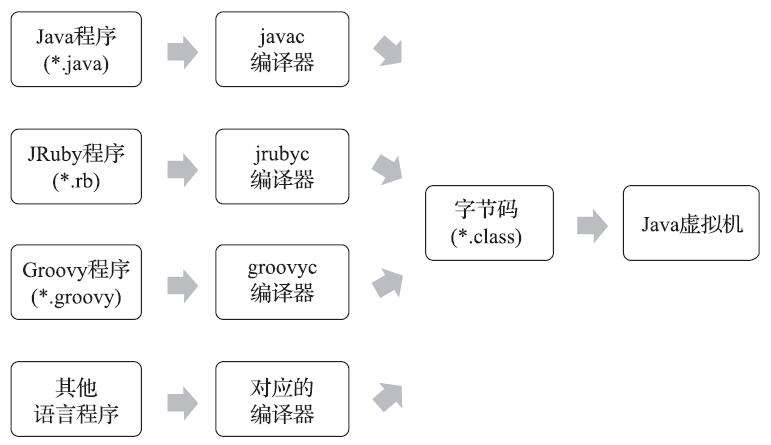

 

　　Java 语言中的各种语法、关键字、常量变量和运算符号的语义最终都会由多条字节码指令组合来表达，这决定了字节码指令所能提供的语言描述能力必须比 Java 语言本身更加强大才行。因此，有一些 Java 语言本身无法有效支持的语言特性并不代表在字节码中也无法有效表达出来，这为其他程序语言实现一些有别于 Java 的语言特性提供了发挥空间。

## 6.3 Class类文件的结构

　　任何一个 Class 文件都对应着唯一的一个类或接口的定义信息，但是反过来说，类或接口并不一定都得定义在文件里（譬如类或接口也可以动态生成，直接送入类加载器中）。

　　Class 文件是一组以 8 个字节为基础单位的二进制流，各个数据项目严格按照顺序紧凑地排列在文件之中，中间没有添加任何分隔符，这使得整个 Class 文件中存储的内容几乎全部是程序运行的必要数据，没有空隙存在。当遇到需要占用 8 个字节以上空间的数据项时，则会按照高位在前的方式分割成若干个 8 个字节进行存储。

　　根据《 Java 虚拟机规范 》的规定，Class 文件格式采用一种类似于 C 语言结构体的伪结构来存储数据，这种伪结构中只有两种数据类型：“ 无符号数 ” 和 “ 表 ”。

* 无符号数属于基本的数据类型，以 u1、u2、u4、u8 来分别代表 1 个字节、2 个字节、4 个字节和 8 个字节的无符号数，无符号数可以用来描述数字、索引引用、数量值或者按照 UTF-8 编码构成字符串值。
* 表是由多个无符号数或者其他表作为数据项构成的复合数据类型，为了便于区分，所有表的命名都习惯性地以 “ _info ” 结尾。表用于描述有层次关系的复合结构的数据，整个 Class 文件本质上也可以视作是一张表，这张表由下表所示的数据项按严格顺序排列构成。

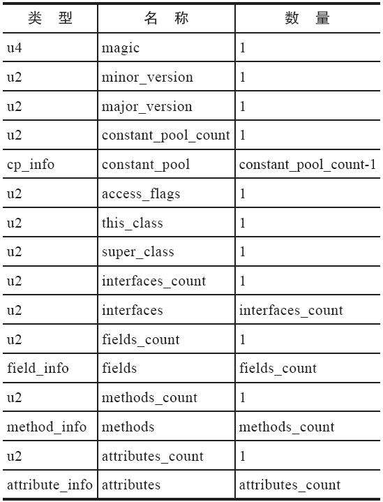 

　　无论是无符号数还是表，当需要描述同一类型但数量不定的多个数据时，经常会使用一个前置的容量计数器加若干个连续的数据项的形式，这时候称这一系列连续的某一类型的数据为某一类型的 “ **集合** ”。

### 6.3.1 魔数与 Class 文件的版本

　　每个 Class 文件的头 4 个字节被称为**魔数**（Magic Number），它的唯一**作用**是确定这个文件是否为一个能被虚拟机接受的Class文件。

　　不仅是 Class 文件，很多文件格式标准中都有使用魔数来进行身份识别的习惯，譬如图片格式，如 GIF 或者 JPEG 等在文件头中都存有魔数。

　　使用魔数而不是扩展名来进行识别主要是基于安全考虑，因为文件扩展名可以随意改动。

　　文件格式的制定者可以自由地选择魔数值，只要这个魔数值还没有被广泛采用过而且不会引起混淆。

　　Class文件的魔数值为0xCAFEBABE。

 　　魔数的 4 个字节存储的是 Class 文件的版本号：第 5 和第 6 个字节是次版本号（Minor Version），第 7 和第 8 个字节是主版本号（Major Version）。

　　下表列出了从 JDK 1.1 到 13 之间，主流 JDK 版本编译器输出的默认的和可支持的 Class 文件版本号。 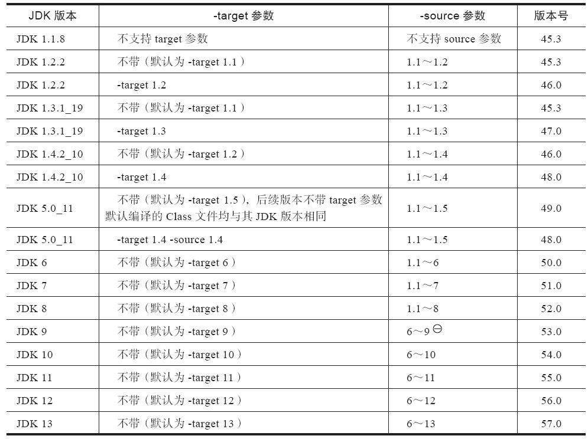

　　从 JDK 9 开始，Javac 编译器不再支持使用 -source 参数编译版本号小于 1.5 的源码。

### 6.3.2 常量池

　　常量池可以比喻为 Class 文件里的资源仓库，它是 Class 文件结构中与其他项目关联最多的数据，通常也是占用 Class 文件空间最大的数据项目之一，另外，它还是在 Class 文件中第一个出现的表类型数据项目。

　　由于常量池中常量的数量是不固定的，所以在常量池的入口需要放置一项 u2 类型的数据，代表常量池容量计数值（constant_pool_count），与 Java 中语言习惯不同，这个容量计数是从 1 而不是 0 开始的。

　　常量池容量（ 偏移地址：0x00000008 ）为十六进制数 0x0016 ，即十进制的 22，这就代表常量池中有 21 项常量，索引值范围为 1～21。

　　在 Class 文件格式规范制定之时，设计者将第 0 项常量空出来是有特殊考虑的，这样做的目的在于，如果后面某些指向常量池的索引值的数据在特定情况下需要表达 “ 不引用任何一个常量池项目 ” 的含义，可以把索引值设置为 0 来表示。

　　Class 文件结构中只有常量池的容量计数是从 1 开始，对于其他集合类型，包括接口索引集合、字段表集合、方法表集合等的容量计数都与一般习惯相同，是从 0 开始。

　　常量池中主要存放两大类常量：字面量（Literal）和符号引用（Symbolic References）。

　　字面量比较接近于 Java 语言层面的常量概念，如文本字符串、被声明为 final 的常量值等。

　　符号引用则属于编译原理方面的概念，主要包括下面几类常量：

* 被模块导出或者开放的包（Package）
* 类和接口的全限定名（Fully Qualified Name）
* 字段的名称和描述符（Descriptor）
* 方法的名称和描述符
* 方法句柄和方法类型（Method Handle、Method Type、Invoke Dynamic）
* 动态调用点和动态常量（Dynamically-Computed Call Site、Dynamically-Computed Constant）

　　Java 代码在进行 Javac 编译的时候，并不像 C 和 C++ 那样有 “ 连接 ” 这一步骤，而是在虚拟机加载 Class 文件的时候进行动态连接。也就是说，在 Class 文件中不会保存各个方法、字段最终在内存中的布局信息，这些字段、方法的符号引用不经过虚拟机在运行期转换的话是无法得到真正的内存入口地址，也就无法直接被虚拟机使用的。

　　当虚拟机做类加载时，将会从常量池获得对应的符号引用，再在类创建时或运行时解析、翻译到具体的内存地址之中。

　　常量池中每一项常量都是一个表，最初常量表中共有 11 种结构各不相同的表结构数据，后来为了更好地支持动态语言调用，额外增加了 4 种动态语言相关的常量，为了支持 Java 模块化系统（Jigsaw），又加入了 CONSTANT_Module_info 和 CONSTANT_Package_info 两个常量，所以截至 JDK 13，常量表中分别有 17 种不同类型的常量。

　　这 17 类表都有一个共同的特点，表结构起始的第一位是个 u1 类型的标志位（tag），代表着当前常量属于哪种常量类型。17 种常量类型所代表的具体含义如下表所示。 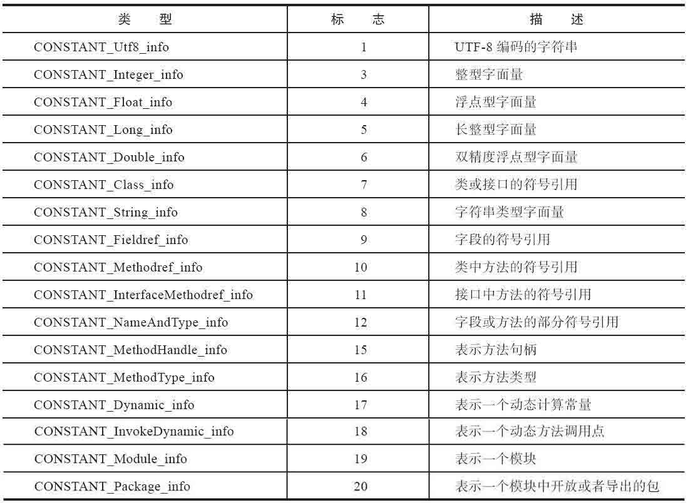

　　CONSTANT_Class_info 的结构比较简单，如下表所示。

 

　　tag 是标志位，它用于区分常量类型；name_index 是常量池的索引值，它指向常量池中一个 CONSTANT_Utf8_info 类型常量，此常量代表了这个类（或者接口）的全限定名，

　　CONSTANT_Utf8_info 类型的结构如下表所示。

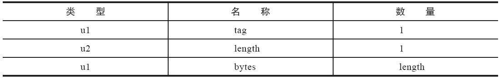 

　　length 值说明了这个 UTF-8 编码的字符串长度是多少字节，它后面紧跟着的长度为 length 字节的连续数据是一个使用 UTF-8 缩略编码表示的字符串。

　　**UTF-8 缩略编码与普通 UTF-8 编码的区别是**：从 '\u0001' 到 '\u007f' 之间的字符（相当于1～127的ASCII码）的缩略编码使用一个字节表示，从 '\u0080' 到 '\u07ff' 之间的所有字符的缩略编码用两个字节表示，从 '\u0800' 开始到 '\uffff' 之间的所有字符的缩略编码就按照普通 UTF-8 编码规则使用三个字节表示。

　　由于 Class 文件中方法、字段等都需要引用 CONSTANT_Utf8_info 型常量来描述名称，所以 CONSTANT_Utf8_info 型常量的最大长度也就是 Java 中方法、字段名的最大长度。最大长度就是 length 的最大值，既 u2 类型能表达的最大值 65535 。Java 程序中如果定义了超过 64KB 英文字符的变量或方法名，即使规则和全部字符都是合法的，也会无法编译。

　　在 JDK 的 bin 目录中，Oracle 公司准备了一个专门用于分析 Class 文件字节码的工具：javap。

　　如 “ I ” “ V ” “ ” “ LineNumberTable ” “ LocalVariableTable ” 等，这些不是来源于 Java 源代码，它们都是编译器自动生成的，会被字段表（field_info）、方法表（method_info）、属性表（attribute_info）所引用，它们将会被用来描述一些不方便使用 “ 固定字节 ” 进行表达的内容，譬如描述方法的返回值是什么，有几个参数，每个参数的类型是什么。 

　　因为 Java 中的 “ 类 ” 是无穷无尽的，无法通过简单的无符号数来描述一个方法用到了什么类，因此在描述方法的这些信息时，需要引用常量表中的符号引用进行表达。

　　17种常量项的结构定义总结为下表：

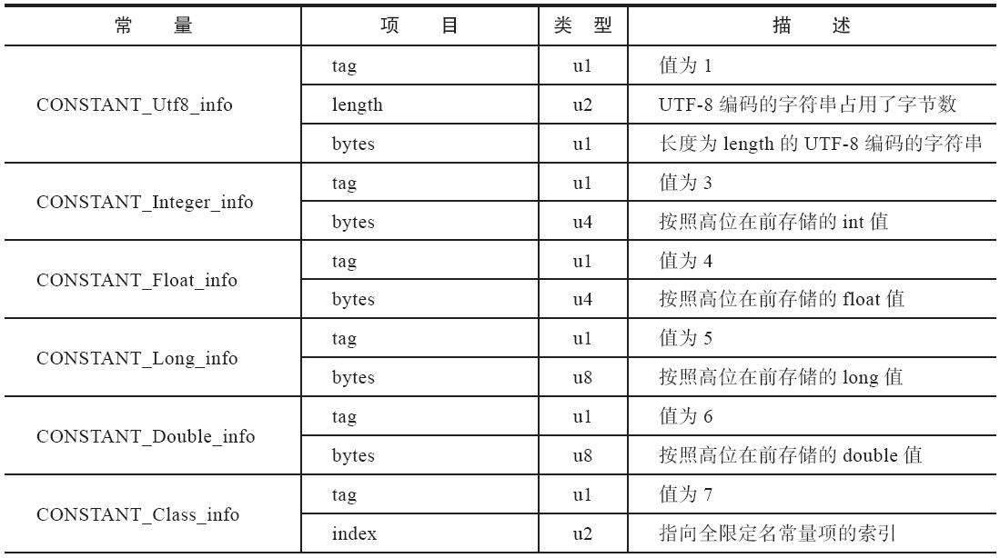 

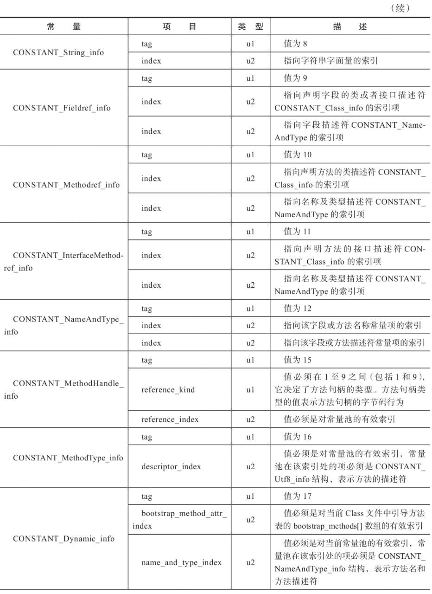

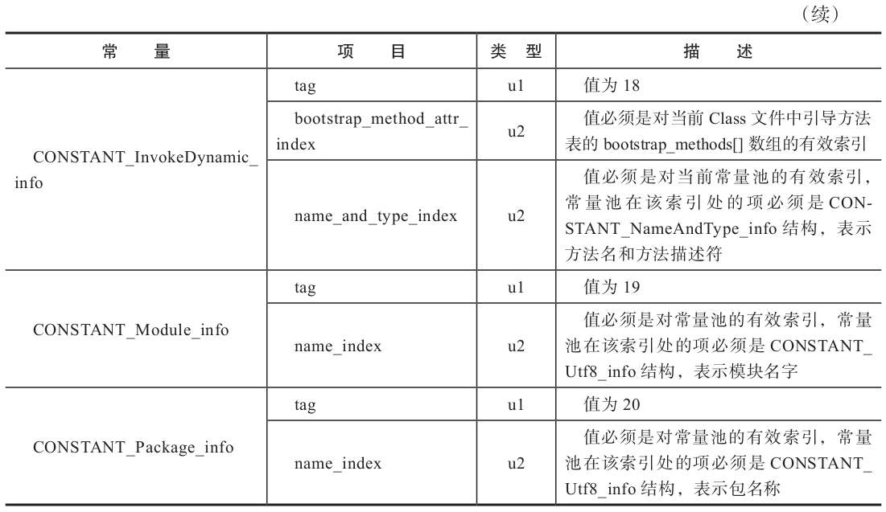

### 6.3.3 访问标志

　　在常量池结束之后，紧接着的 2 个字节代表访问标志（access_flags），这个标志用于识别一些类或者接口层次的访问信息，包括：这个 Class 是类还是接口；是否定义为 public 类型；是否定义为 abstract 类型；如果是类的话，是否被声明为 final ；等等。具体的标志位以及标志的含义见下表。 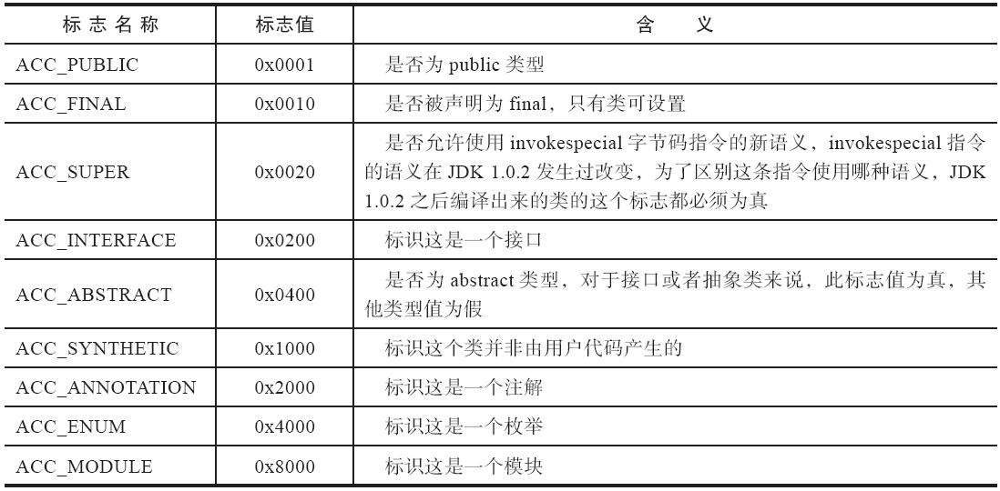　　access_flags 中一共有 16 个标志位可以使用，当前只定义了其中 9 个，没有使用到的标志位要求一律为零。

### 6.3.4 类索引、父类索引与接口索引集合

　　**类索引**（ this_class ）和**父类索引**（ super_class ）都是一个 u2 类型的数据，而**接口索引集合**（ interfaces ）是一组 u2 类型的数据的集合，Class 文件中由这三项数据来确定该类型的继承关系。

　　类索引用于确定这个类的全限定名，父类索引用于确定这个类的父类的全限定名。

　　由于 Java 语言不允许多重继承，所以父类索引只有一个，除了 java.lang.Object 之外，所有的 Java 类都有父类，因此除了 java.lang.Object 外，所有 Java 类的父类索引都不为 0 。

　　接口索引集合就用来描述这个类实现了哪些接口，这些被实现的接口将按 implements 关键字（如果这个 Class 文件表示的是一个接口，则应当是 extends 关键字）后的接口顺序从左到右排列在接口索引集合中。

　　类索引、父类索引和接口索引集合都按顺序排列在访问标志之后，类索引和父类索引用两个 u2 类型的索引值表示，它们各自指向一个类型为 CONSTANT_Class_info 的类描述符常量，通过 CONSTANT_Class_info 类型的常量中的索引值可以找到定义在 CONSTANT_Utf8_info 类型的常量中的全限定名字符串。

　　对于接口索引集合，入口的第一项 u2 类型的数据为**接口计数器**（interfaces_count），表示索引表的容量。如果该类没有实现任何接口，则该计数器值为 0 ，后面接口的索引表不再占用任何字节。

### 6.3.5 字段表集合

　　**字段表**（ field_info ）用于描述接口或者类中声明的变量。

　　Java 语言中的 “ 字段 ”（Field）包括类级变量以及实例级变量，但不包括在方法内部声明的局部变量。

　　字段可以包括的修饰符有字段的作用域（ public、private、protected 修饰符 ）、是实例变量还是类变量（ static 修饰符 ）、可变性（ final ）、并发可见性（ volatile 修饰符，是否强制从主内存读写）、可否被序列化（ transient 修饰符）、字段数据类型（基本类型、对象、数组）、字段名称。上述这些信息中，各个修饰符都是布尔值，要么有某个修饰符，要么没有，很适合使用标志位来表示。

　　而字段叫做什么名字、字段被定义为什么数据类型，这些都是无法固定的，只能引用常量池中的常量来描述。

　　字段表的最终格式见下表：

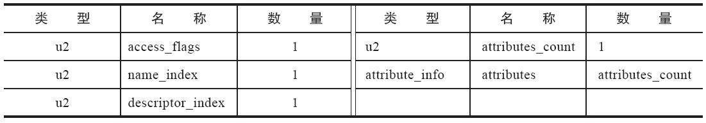 

　　字段修饰符放在 access_flags 项目中，它与类中的 access_flags 项目是非常类似的，都是一个 u2 的数据类型，其中可以设置的标志位和含义如下表所示。

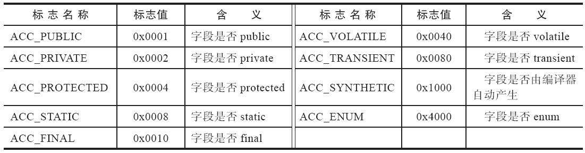 

　　由于语法规则的约束，ACC_PUBLIC、ACC_PRIVATE、ACC_PROTECTED 三个标志最多只能选择其一，ACC_FINAL、ACC_VOLATILE 不能同时选择。接口之中的字段必须有 ACC_PUBLIC、ACC_STATIC、ACC_FINAL 标志，这些都是由 Java 本身的语言规则所导致的。

　　跟随 access_flags 标志的是两项索引值： name_index 和 descriptor_index 。它们都是对常量池项的引用，分别代表着字段的简单名称以及字段和方法的描述符。

　　全限定名和简单名称很简单，例如 “ org/fenixsoft/clazz/TestClass ” 是这个类的全限定名，仅仅是把类全名中的 “ . ” 替换成了 “ / ” 而已，为了使连续的多个全限定名之间不产生混淆，在使用时最后一般会加入一个 “；” 号表示全限定名结束。

　　简单名称则就是指没有类型和参数修饰的方法或者字段名称，例如 inc() 方法和 m 字段的简单名称分别就是 “ inc ” 和 “ m ”。

　　描述符的作用是用来描述字段的数据类型、方法的参数列表（包括数量、类型以及顺序）和返回值。

　　根据描述符规则，基本数据类型（byte、char、double、float、int、long、short、boolean）以及代表无返回值的 void 类型都用一个大写字符来表示，而对象类型则用字符 L 加对象的全限定名来表示，详见下表：

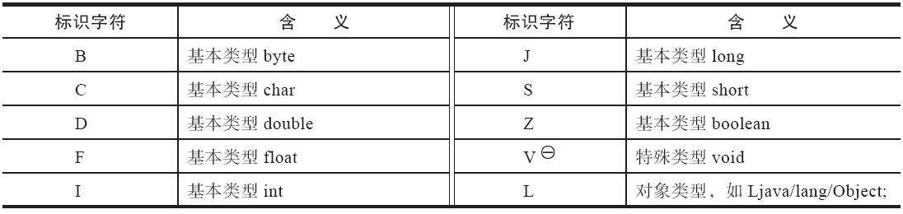

　　对于数组类型，每一维度将使用一个前置的 “[” 字符来描述。

　　用描述符来描述方法时，按照先参数列表、后返回值的顺序描述，参数列表按照参数的严格顺序放在一组小括号 “()” 之内。

　　字段表所包含的固定数据项目到 descriptor_index 为止就全部结束了，不过在 descriptor_index 之后跟随着一个属性表集合，用于存储一些额外的信息，字段表可以在属性表中附加描述零至多项的额外信息。

　　字段表集合中不会列出从父类或者父接口中继承而来的字段，但有可能出现原本 Java 代码之中不存在的字段，譬如在内部类中为了保持对外部类的访问性，编译器就会自动添加指向外部类实例的字段。

　　在 Java 语言中字段是无法重载的，两个字段的数据类型、修饰符不管是否相同，都必须使用不一样的名称，但是对于 Class 文件格式来讲，只要两个字段的描述符不是完全相同，那字段重名就是合法的。

 ### 6.3.6 方法表集合 

　　Class 文件存储格式中对方法的描述与对字段的描述采用了几乎完全一致的方式，方法表的结构如同字段表一样，依次包括访问标志（ access_flags ）、名称索引（ name_index ）、描述符索引（ descriptor_index ）、属性表集合（ attributes ）几项，如下表所示：

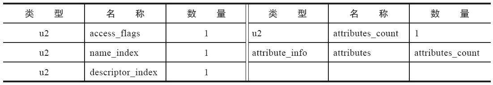

　　这些数据项目的含义也与字段表中的非常类似，仅在访问标志和属性表集合的可选项中有所区别。

　　因为 volatile 关键字和 transient 关键字不能修饰方法，所以方法表的访问标志中没有了 ACC_VOLATILE 标志和 ACC_TRANSIENT 标志。

　　与之相对，synchronized、native、strictfp 和 abstract 关键字可以修饰方法，方法表的访问标志中也相应地增加了 ACC_SYNCHRONIZED、ACC_NATIVE、ACC_STRICTFP 和 ACC_ABSTRACT 标志。对于方法表，所有标志位及其取值可参见下表：

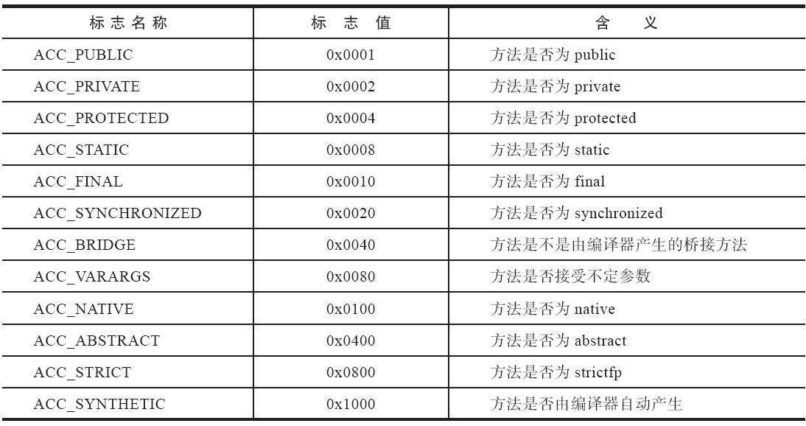

　　方法里的 Java 代码，经过 Javac 编译器编译成字节码指令之后，存放在方法属性表集合中一个名为 “ Code ” 的属性里面，属性表作为 Class 文件格式中最具扩展性的一种数据项目。

　　与字段表集合相对应地，如果父类方法在子类中没有被重写（Override），方法表集合中就不会出现来自父类的方法信息。

同样地，有可能会出现由编译器自动添加的方法，最常见的便是类构造器 “< clinit >()” 方法和实例构造器 “< init >()” 方法。

　　在 Java 语言中，要重载（Overload）一个方法，除了要与原方法具有相同的简单名称之外，还要求必须拥有一个与原方法不同的特征签名。

　　**特征签名**是指一个方法中各个参数在常量池中的字段符号引用的集合，也正是因为返回值不会包含在特征签名之中，所以 Java 语言里面是无法仅仅依靠返回值的不同来对一个已有方法进行重载的。

　　但是在 Class 文件格式之中，特征签名的范围明显要更大一些，只要描述符不是完全一致的两个方法就可以共存。也就是说，如果两个方法有相同的名称和特征签名，但返回值不同，那么也是可以合法共存于同一个 Class 文件中的。

 ### 6.3.7 属性表集合

　　Class 文件、字段表、方法表都可以携带自己的属性表集合，以描述某些场景专有的信息。

　　与 Class 文件中其他的数据项目要求严格的顺序、长度和内容不同，属性表集合的限制稍微宽松一些，不再要求各个属性表具有严格顺序，并且《 Java 虚拟机规范 》允许只要不与已有属性名重复，任何人实现的编译器都可以向属性表中写入自己定义的属性信息，Java虚拟机运行时会忽略掉它不认识的属性。

　　为了能正确解析 Class 文件，《 Java虚拟机规范 》最初只预定义了 9 项所有 Java 虚拟机实现都应当能识别的属性，而在最新的《 Java虚拟机规范 》的 Java SE 12 版本中，预定义属性已经增加到29项，这些属性具体见下表：

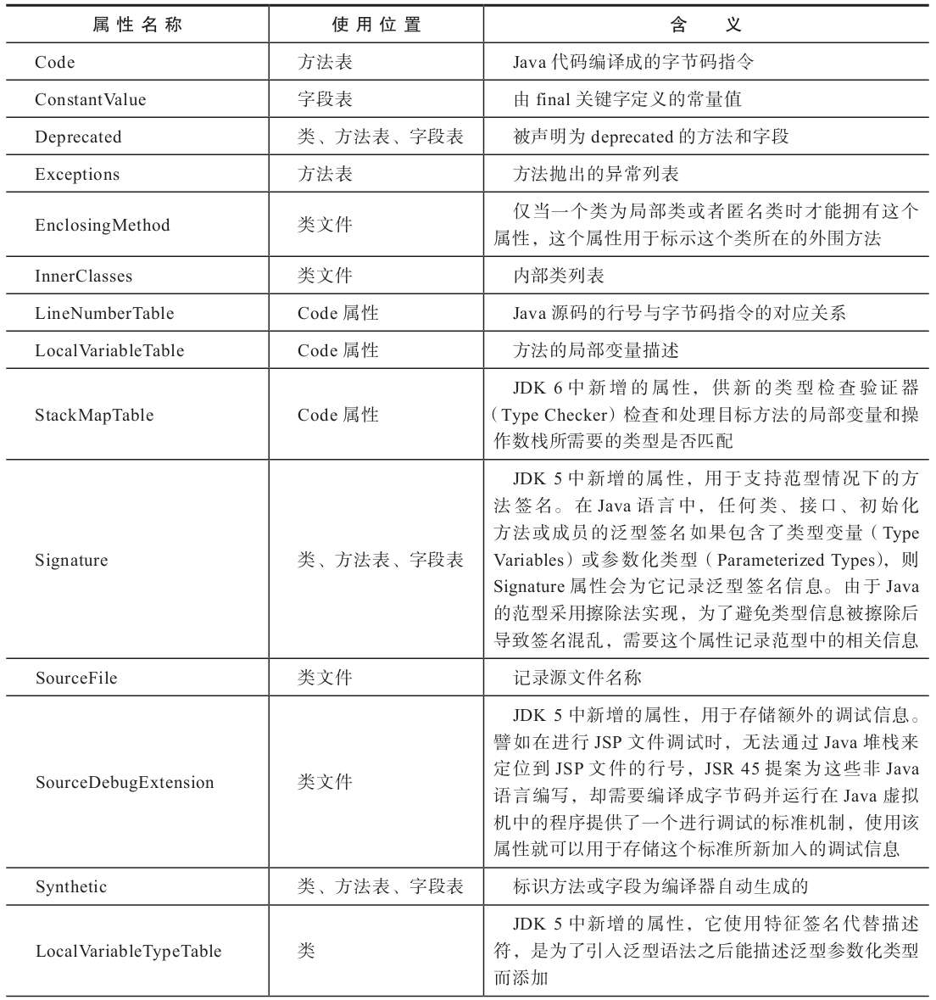

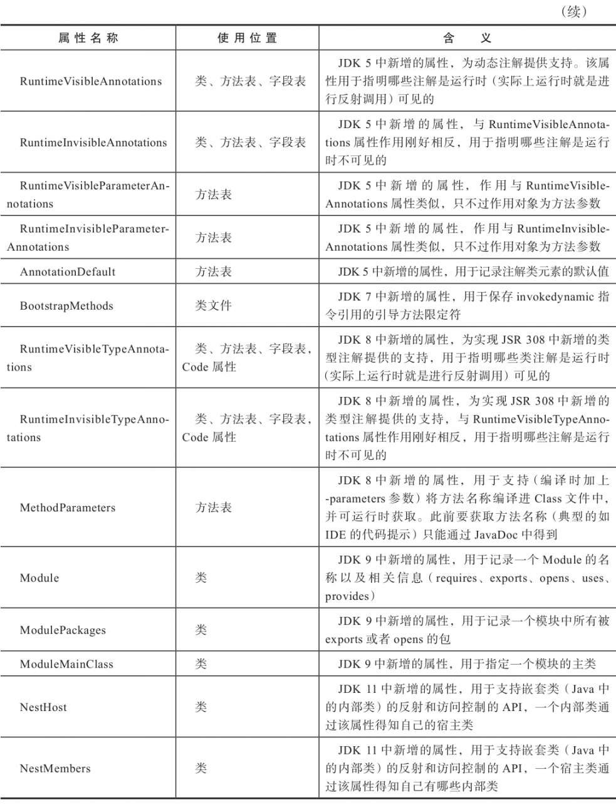

 　　对于每一个属性，它的名称都要从常量池中引用一个 CONSTANT_Utf8_info 类型的常量来表示，而属性值的结构则是完全自定义的，只需要通过一个 u4 的长度属性去说明属性值所占用的位数即可。

　　一个符合规则的属性表应该满足下表中所定义的结构：

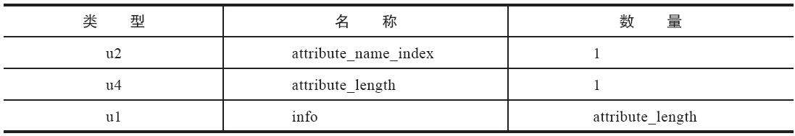 

#### 6.3.7.1 Code属性

　　Java 程序方法体里面的代码经过 Javac 编译器处理之后，最终变为字节码指令存储在 Code 属性内。

　　Code 属性出现在方法表的属性集合之中，但并非所有的方法表都必须存在这个属性，譬如接口或者抽象类中的方法就不存在 Code 属性。

　　如果方法表有 Code 属性存在，那么它的结构将如下表所示：

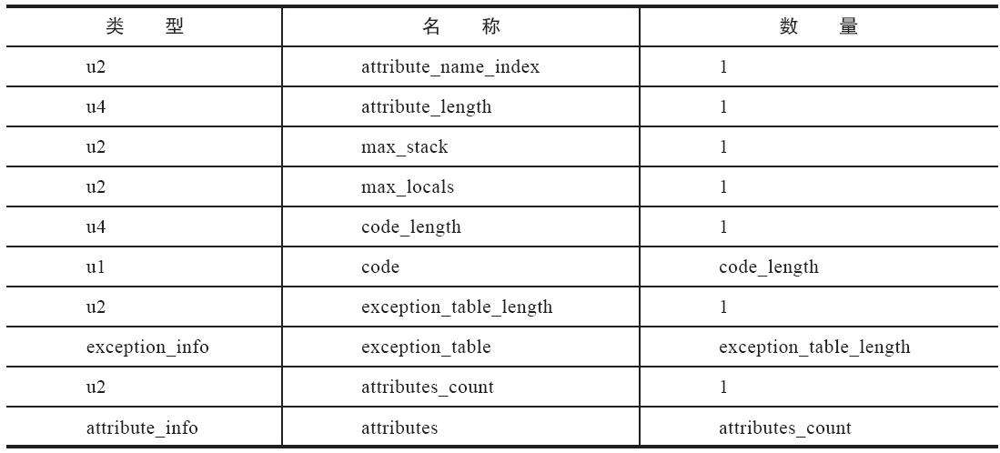

 　　attribute_name_index：是一项指向CONSTANT_Utf8_info 型常量的索引，此常量值固定为 “Code” ，它代表了该属性的属性名称。

　　attribute_length：指示了属性值的长度，由于属性名称索引与属性长度一共为 6 个字节，所以属性值的长度固定为整个属性表长度减去 6 个字节。

　　max_stack：代表了操作数栈（Operand Stack）深度的最大值。在方法执行的任意时刻，操作数栈都不会超过这个深度。虚拟机运行的时候需要根据这个值来分配栈帧（Stack Frame）中的操作栈深度。

　　max_locals：代表了局部变量表所需的存储空间。在这里，max_locals 的单位是变量槽（Slot），变量槽是虚拟机为局部变量分配内存所使用的最小单位。对于 byte、char、float、int、short、boolean 和 returnAddress 等长度不超过 32 位的数据类型，每个局部变量占用一个变量槽，而 double 和 long 这两种 64 位的数据类型则需要两个变量槽来存放。

　　方法参数（包括实例方法中的隐藏参数 “this” ）、显式异常处理程序的参数（ Exception Handler Parameter，就是 try-catch 语句中 catch 块中所定义的异常）、方法体中定义的局部变量都需要依赖局部变量表来存放。

　　注意，并不是在方法中用了多少个局部变量，就把这些局部变量所占变量槽数量之和作为 max_locals 的值，操作数栈和局部变量表直接决定一个该方法的栈帧所耗费的内存，不必要的操作数栈深度和变量槽数量会造成内存的浪费。

　　Java 虚拟机的做法是将局部变量表中的变量槽进行重用，当代码执行超出一个局部变量的作用域时，这个局部变量所占的变量槽可以被其他局部变量所使用，Javac 编译器会根据变量的作用域来分配变量槽给各个变量使用，根据同时生存的最大局部变量数量和类型计算出 max_locals 的大小。

　　code_length 和 code 用来存储 Java 源程序编译后生成的字节码指令。

　　code_length 代表字节码长度，code 是用于存储字节码指令的一系列字节流。既然叫字节码指令，那顾名思义每个指令就是一个 u1 类型的单字节，当虚拟机读取到 code 中的一个字节码时，就可以对应找出这个字节码代表的是什么指令，并且可以知道这条指令后面是否需要跟随参数，以及后续的参数应当如何解析。

　　一个 u1 数据类型的取值范围为 0x00～0xFF，对应十进制的 0～255，也就是一共可以表达 256 条指令。目前，《 Java虚拟机规范 》已经定义了其中约 200 条编码值对应的指令含义，编码与指令之间的对应关系可查阅 “ 虚拟机字节码指令表 ” 。

　　关于 code_length，需要注意虽然它是一个 u4 类型的长度值，理论上最大值可以达到 2 的 32 次幂，但是《 Java虚拟机规范 》中明确限制了一个方法不允许超过 65535 条字节码指令，即它实际只使用了 u2 的长度，如果超过这个限制，Javac 编译器就会拒绝编译。

　　Code 属性是 Class 文件中最重要的一个属性，如果把一个 Java 程序中的信息分为代码（Code，方法体里面的 Java 代码）和元数据（Metadata，包括类、字段、方法定义及其他信息）两部分，那么在整个 Class 文件里，Code 属性用于描述代码，所有的其他数据项目都用于描述元数据。

　　在任何实例方法里面，都可以通过 “ this ” 关键字访问到此方法所属的对象。这个访问机制的实现是通过在 Javac 编译器编译的时候把对 this 关键字的访问转变为对一个普通参数的访问，然后在虚拟机调用实例方法时自动传入此参数而已。因此在实例方法的局部变量表中至少会存在一个指向当前对象实例的局部变量，局部变量表中也会预留出第一个变量槽位来存放对象实例的引用，所以实例方法参数值从 1 开始计算，这个处理只对实例方法有效，静态方法时无效的。

　　在字节码指令之后的是这个方法的显式异常处理表（简称 “ 异常表 ” ）集合，异常表对于 Code 属性来说并不是必须存在的。

　　如果存在异常表，那它的格式应如表下所示：

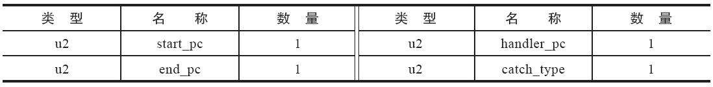

　　包含四个字段，这些字段的含义为：如果当字节码从第 start_pc 行到第 end_pc 行之间（不含第 end_pc 行）出现了类型为 catch_type 或者其子类的异常（ catch_type 为指向一个 CONSTANT_Class_info 型常量的索引），则转到第 handler_pc 行继续处理。当 catch_type 的值为 0 时，代表任意异常情况都需要转到 handler_pc 处进行处理。

#### 6.3.7.2 Exceptions 属性

　　Exceptions 属性的作用是列举出方法中可能抛出的受查异常（ Checked Excepitons ），也就是方法描述时在 throws 关键字后面列举的异常。它的结构见下表：

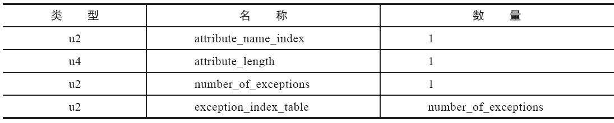

　　属性中的 number_of_exceptions 项表示方法可能抛出 number_of_exceptions 种受查异常，每一种受查异常使用一个 exception_index_table 项表示。

　　exception_index_table 是一个指向常量池中 CONSTANT_Class_info 型常量的索引，代表了该受查异常的类型。

#### 6.3.7.3 LineNumberTable属性

　　LineNumberTable 属性用于描述 Java 源码行号与字节码行号（字节码的偏移量）之间的对应关系。它并不是运行时必需的属性，但默认会生成到 Class 文件之中，可以在 Javac 中使用 -g：none 或 -g：lines 选项来取消或要求生成这项信息。

　　如果选择不生成 LineNumberTable 属性，对程序运行产生的最主要影响就是当抛出异常时，堆栈中将不会显示出错的行号，并且在调试程序的时候，也无法按照源码行来设置断点。

　　LineNumberTable 属性的结构如下表所示：

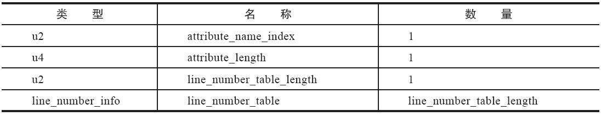

　　line_number_table 是一个数量为line_number_table_length 、类型为line_number_info 的集合，line_number_info 表包含 start_pc 和 line_number 两个 u2 类型的数据项，前者是字节码行号，后者是 Java 源码行号。 

#### 6.3.7.4 LocalVariableTable 及 LocalVariableTypeTable 属性

　　LocalVariableTable 属性用于描述栈帧中局部变量表的变量与 Java 源码中定义的变量之间的关系，它也不是运行时必需的属性，但默认会生成到 Class 文件之中，可以在 Javac 中使用 -g：none 或 -g：vars 选项来取消或要求生成这项信息。

　　如果没有生成这项属性，最大的影响就是当其他人引用这个方法时，所有的参数名称都将会丢失，譬如 IDE 将会使用诸如 arg0、arg1 之类的占位符代替原有的参数名，这对程序运行没有影响，但是会对代码编写带来较大不便，而且在调试期间无法根据参数名称从上下文中获得参数值。

　　LocalVariableTable 属性的结构如下表所示：

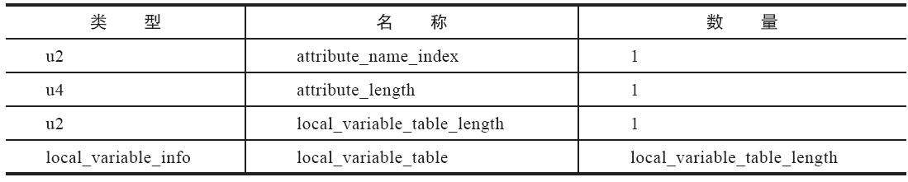

　　其中 local_variable_info 项目代表了一个栈帧与源码中的局部变量的关联，结构如下表所示：

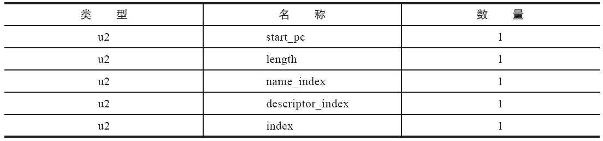

　　start_pc 和 length 属性分别代表了这个局部变量的生命周期开始的字节码偏移量及其作用范围覆盖的长度，两者结合起来就是这个局部变量在字节码之中的作用域范围。 

　　name_index 和 descriptor_index 都是指向常量池中 CONSTANT_Utf8_info 型常量的索引，分别代表了局部变量的名称以及这个局部变量的描述符。

　　index 是这个局部变量在栈帧的局部变量表中变量槽的位置。当这个变量数据类型是 64 位类型时（ double 和 long ），它占用的变量槽为 index 和 index+1 两个。

　　JDK 5 引入泛型之后，LocalVariableTable 属性增加了一个 “ 姐妹属性 ” ——LocalVariableTypeTable 。这个新增的属性结构与 LocalVariableTable 非常相似，仅仅是把记录的字段描述符的 descriptor_index 替换成了字段的特征签名（ Signature ）。对于非泛型类型来说，描述符和特征签名能描述的信息是能吻合一致的，但是泛型引入之后，由于描述符中泛型的参数化类型被擦除掉，描述符就不能准确描述泛型类型了。因此出现了 LocalVariableTypeTable 属性，使用字段的特征签名来完成泛型的描述。

#### 6.3.7.5 SourceFile 及 SourceDebugExtension 属性

　　SourceFile 属性用于记录生成这个 Class 文件的源码文件名称。这个属性也是可选的，可以使用 Javac 的 -g：none 或 -g：source 选项来关闭或要求生成这项信息。

　　在 Java 中，对于大多数的类来说，类名和文件名是一致的，但是有一些特殊情况（如内部类）例外。如果不生成这项属性，当抛出异常时，堆栈中将不会显示出错代码所属的文件名。

　　这个属性是一个定长的属性，其结构如下表所示：

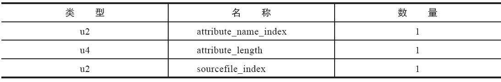

　　sourcefile_index 数据项是指向常量池中 CONSTANT_Utf8_info 型常量的索引，常量值是源码文件的文件名。

　　为了方便在编译器和动态生成的 Class 中加入供程序员使用的自定义内容，在 JDK 5 时，新增了 SourceDebugExtension 属性用于存储额外的代码调试信息。

　　典型的场景是在进行 JSP 文件调试时，无法通过 Java 堆栈来定位到 JSP 文件的行号。JSR 45 提案为这些非 Java 语言编写，却需要编译成字节码并运行在 Java 虚拟机中的程序提供了一个进行调试的标准机制，使用 SourceDebugExtension 属性就可以用于存储这个标准所新加入的调试信息，譬如让程序员能够快速从异常堆栈中定位出原始 JSP 中出现问题的行号。

　　SourceDebugExtension 属性的结构如下表所示：

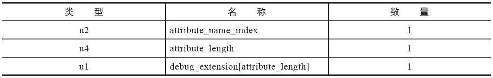

　　其中 debug_extension 存储的就是额外的调试信息，是一组通过变长 UTF-8 格式来表示的字符串。一个类中最多只允许存在一个 SourceDebugExtension 属性。

#### 6.3.7.6 ConstantValue 属性

　　ConstantValue 属性的作用是通知虚拟机自动为静态变量赋值。只有被 static 关键字修饰的变量（类变量）才可以使用这项属性。

　　对非 static 类型的变量（也就是实例变量）的赋值是在实例构造器 < init >() 方法中进行的；而对于类变量，则有两种方式可以选择：在类构造器< clinit >() 方法中或者使用 ConstantValue 属性。

　　Javac 编译器的选择是，如果同时使用 final 和 static 来修饰一个变量，并且这个变量的数据类型是基本类型或者 java.lang.String 的话，就将会生成 ConstantValue 属性来进行初始化；如果这个变量没有被 final 修饰，或者并非基本类型及字符串，则将会选择在< clinit >() 方法中进行初始化。

　　虽然有 final 关键字才更符合 “ConstantValue” 的语义，但《 Java虚拟机规范 》中并没有强制要求字段必须设置 ACC_FINAL 标志，只要求有 ConstantValue 属性的字段必须设置 ACC_STATIC 标志而已，对 final 关键字的要求是 Javac 编译器自己加入的限制。

　　而对 ConstantValue 的属性值只能限于基本类型和 String 这点，其实并不能算是什么限制，这是理所当然的结果。因为此属性的属性值只是一个常量池的索引号，由于 Class 文件格式的常量类型中只有与基本属性和字符串相对应的字面量，所以就算 ConstantValue 属性想支持别的类型也无能为力。

　　ConstantValue属性的结构如下表所示：

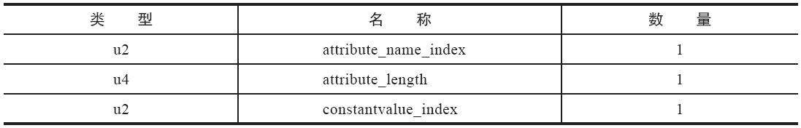

　　从数据结构中可以看出 ConstantValue 属性是一个定长属性，它的 attribute_length 数据项值必须固定为 2 。

　　constantvalue_index 数据项代表了常量池中一个字面量常量的引用，根据字段类型的不同，字面量可以是 CONSTANT_Long_info、CONSTANT_Float_info、CONSTANT_Double_info、CONSTANT_Integer_info 和 CONSTANT_String_info 常量中的一种。

#### 6.3.7.7 InnerClasses属性

　　InnerClasses 属性用于记录内部类与宿主类之间的关联。

　　如果一个类中定义了内部类，那编译器将会为它以及它所包含的内部类生成 InnerClasses 属性。

　　InnerClasses 属性的结构如下表所示：

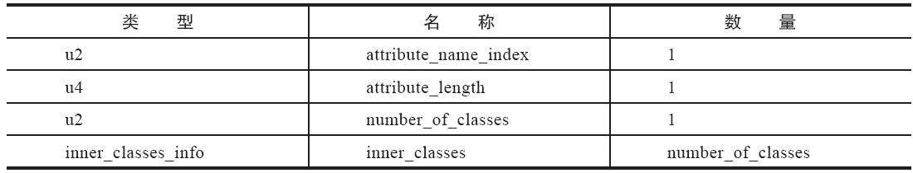

　　数据项 number_of_classes 代表需要记录多少个内部类信息，每一个内部类的信息都由一个 inner_classes_info 表进行描述

　　inner_classes_info 表的结构如下表所示：

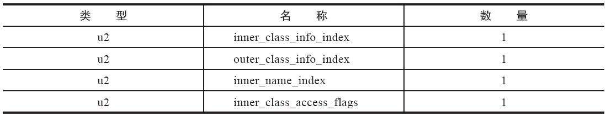

　　inner_class_info_index 和 outer_class_info_index 都是指向常量池中 CONSTANT_Class_info 型常量的索引，分别代表了内部类和宿主类的符号引用。

　　inner_name_index 是指向常量池中CONSTANT_Utf8_info 型常量的索引，代表这个内部类的名称，如果是匿名内部类，这项值为 0。

　　inner_class_access_flags 是内部类的访问标志，类似于类的 access_flags ，它的取值范围如下表所示：


 #### 6.3.7.8 Deprecated 及 Synthetic 属性

　　Deprecated 和 Synthetic 两个属性都属于标志类型的布尔属性，只存在有和没有的区别，没有属性值的概念。

　　Deprecated 属性用于表示某个类、字段或者方法，已经被程序作者定为不再推荐使用，它可以通过代码中使用 “@deprecated” 注解进行设置。

　　Synthetic 属性代表此字段或者方法并不是由 Java 源码直接产生的，而是由编译器自行添加的，在 JDK 5 之后，标识一个类、字段或者方法是编译器自动产生的，也可以设置它们访问标志中的 ACC_SYNTHETIC 标志位。编译器通过生成一些在源代码中不存在的 Synthetic 方法、字段甚至是整个类的方式，实现了越权访问（越过 private 修饰器）或其他绕开了语言限制的功能，这算是一种早期优化的技巧，其中最典型的例子就是枚举类中自动生成的枚举元素数组和嵌套类的桥接方法（Bridge Method）。

　　所有由不属于用户代码产生的类、方法及字段都应当至少设置 Synthetic 属性或者 ACC_SYNTHETIC 标志位中的一项，唯一的例外是实例构造器 “< init >()” 方法和类构造器 “< clinit >()” 方法。

　　Deprecated 和 Synthetic 属性的结构非常简单，如下表所示：

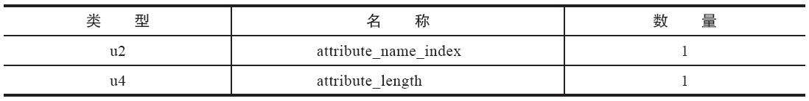

　　其中 attribute_length 数据项的值必须为 0x00000000 ，因为没有任何属性值需要设置。

#### 6.3.7.9 StackMapTable 属性

　　StackMapTable 属性在 JDK 6 增加到 Class 文件规范之中，它是一个相当复杂的变长属性，位于 Code 属性的属性表中。

　　这个属性会在虚拟机类加载的字节码验证阶段被新类型检查验证器（Type Checker）使用，目的在于代替以前比较消耗性能的基于数据流分析的类型推导验证器。

　　StackMapTable 属性中包含零至多个栈映射帧（Stack Map Frame），每个栈映射帧都显式或隐式地代表了一个字节码偏移量，用于表示执行到该字节码时局部变量表和操作数栈的验证类型。

　　类型检查验证器会通过检查目标方法的局部变量和操作数栈所需要的类型来确定一段字节码指令是否符合逻辑约束。

　　StackMapTable 属性的结构如下表所示：

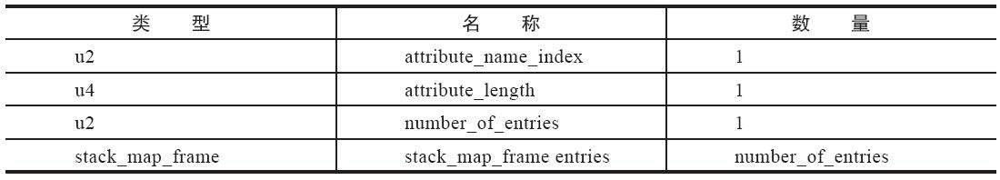

　　在 Java SE 7 版之后的《 Java虚拟机规范 》中，明确规定对于版本号大于或等于 50.0 的 Class 文件，如果方法的Code属性中没有附带 StackMapTable 属性，那就意味着它带有一个隐式的 StackMap 属性，这个 StackMap 属性的作用等同于 number_of_entries 值为 0 的 StackMapTable 属性。

　　一个方法的 Code 属性最多只能有一个 StackMapTable 属性，否则将抛出 ClassFormatError 异常。

#### 6.3.7.10 Signature属性

　　Signature 属性在 JDK 5 增加到 Class 文件规范之中，它是一个可选的定长属性，可以出现于类、字段表和方法表结构的属性表中。

　　在 JDK 5 里面大幅增强了 Java 语言的语法，在此之后，任何类、接口、初始化方法或成员的泛型签名如果包含了类型变量（Type Variable）或参数化类型（Parameterized Type），则 Signature 属性会为它记录泛型签名信息。

　　之所以要专门使用这样一个属性去记录泛型类型，是因为 Java 语言的泛型采用的是擦除法实现的伪泛型，字节码（ Code属性 ）中所有的泛型信息编译（ 类型变量、参数化类型 ）在编译之后都通通被擦除掉。

　　使用擦除法的好处是实现简单（主要修改 Javac 编译器，虚拟机内部只做了很少的改动）、非常容易实现 Backport，运行期也能够节省一些类型所占的内存空间。但坏处是运行期就无法像 C# 等有真泛型支持的语言那样，将泛型类型与用户定义的普通类型同等对待，例如运行期做反射时无法获得泛型信息。

　　Signature 属性就是为了弥补这个缺陷而增设的，现在 Java 的反射 API 能够获取的泛型类型，最终的数据来源也是这个属性。

　　Signature属性的结构如下表所示：


　　其中 signature_index 项的值必须是一个对常量池的有效索引。常量池在该索引处的项必须是 CONSTANT_Utf8_info 结构，表示类签名或方法类型签名或字段类型签名。

　　如果当前的 Signature 属性是类文件的属性，则这个结构表示类签名，如果当前的 Signature 属性是方法表的属性，则这个结构表示方法类型签名，如果当前 Signature 属性是字段表的属性，则这个结构表示字段类型签名。

#### 6.3.7.11 BootstrapMethods 属性

　　BootstrapMethods 属性在 JDK 7 时增加到 Class 文件规范之中，它是一个复杂的变长属性，位于类文件的属性表中。

　　这个属性用于保存 invokedynamic 指令引用的引导方法限定符。

　　根据《 Java虚拟机规范 》（从 Java SE 7 版起）的规定，如果某个类文件结构的常量池中曾经出现过 CONSTANT_InvokeDynamic_info 类型的常量，那么这个类文件的属性表中必须存在一个明确的 BootstrapMethods 属性。

另外，即使 CONSTANT_InvokeDynamic_info 类型的常量在常量池中出现过多次，类文件的属性表中最多也只能有一个 BootstrapMethods 属性。

　　BootstrapMethods属性的结构如下表所示：

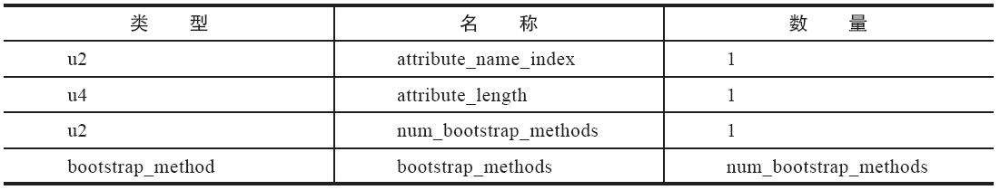

　　其中引用到的bootstrap_method结构如下表所示：

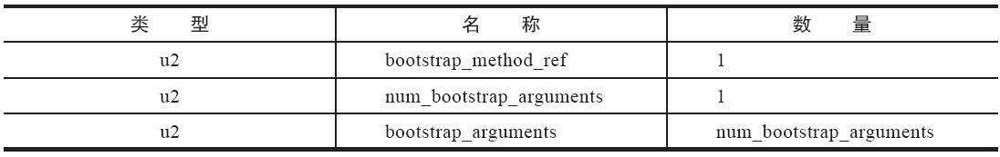

　　BootstrapMethods 属性里， num_bootstrap_methods 项的值给出了 bootstrap_methods[] 数组中的引导方法限定符的数量。而 bootstrap_methods[] 数组的每个成员包含了一个指向常量池 CONSTANT_MethodHandle 结构的索引值，它代表了一个引导方法。还包含了这个引导方法静态参数的序列（可能为空）。

　　bootstrap_methods[] 数组的每个成员必须包含以下三项内容：

* bootstrap_method_ref：bootstrap_method_ref 项的值必须是一个对常量池的有效索引。常量池在该索引处的值必须是一个 CONSTANT_MethodHandle_info 结构。
* num_bootstrap_arguments：num_bootstrap_arguments 项的值给出了bootstrap_argu-ments[] 数组成员的数量。
* bootstrap_arguments[]：bootstrap_arguments[] 数组的每个成员必须是一个对常量池的有效索引。常量池在该索引出必须是下列结构之一：CONSTANT_String_info、CONSTANT_Class_info、CONSTANT_Integer_info、CONSTANT_Long_info、CONSTANT_Float_info、CONSTANT_Double_info、CONSTANT_MethodHandle_info 或 CONSTANT_MethodType_info。

#### 6.3.7.12 MethodParameters 属性

　　MethodParameters 是在 JDK 8 时新加入到 Class 文件格式中的，它是一个用在方法表中的变长属性。

　　MethodParameters 的作用是记录方法的各个形参名称和信息。

　　MethodParameters 是方法表的属性，与 Code 属性平级的，可以运行时通过反射 API 获取。

　　MethodParameters的结构如下表所示：

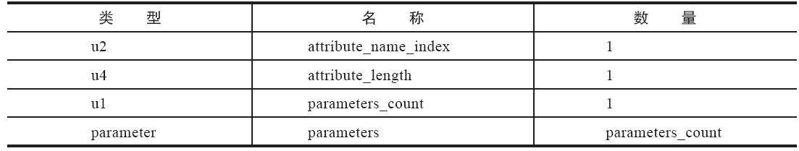

　　其中，引用到的 parameter 结构如下表所示：


　　其中，name_index 是一个指向常量池 CONSTANT_Utf8_info 常量的索引值，代表了该参数的名称。

　　而 access_flags 是参数的状态指示器，它可包含以下三种状态中的一种或多种：

* 0x0010（ACC_FINAL）：表示该参数被 final 修饰。
* 0x1000（ACC_SYNTHETIC）：表示该参数并未出现在源文件中，是编译器自动生成的。
* 0x8000（ACC_MANDATED）：表示该参数是在源文件中隐式定义的。Java 语言中的典型场景是 this 关键字。

#### 6.3.7.13 模块化相关属性

　　JDK 9 的一个重量级功能是 Java 的模块化功能，因为模块描述文件（module-info.java）最终是要编译成一个独立的 Class 文件来存储的，所以，Class 文件格式也扩展了 Module、ModulePackages 和 ModuleMainClass 三个属性用于支持Java模块化相关功能。

　　Module 属性是一个非常复杂的变长属性，除了表示该模块的名称、版本、标志信息以外，还存储了这个模块 requires、exports、opens、uses 和 provides 定义的全部内容，其结构如下表所示：

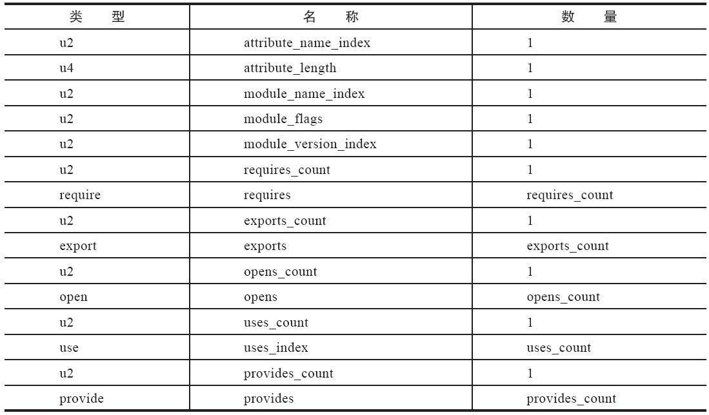

　　其中，module_name_index 是一个指向常量池 CONSTANT_Utf8_info 常量的索引值，代表了该模块的名称。

　　而 module_flags 是模块的状态指示器，它可以包含以下三种状态中的一种或多种：

* 0x0020（ACC_OPEN）：表示该模块是开放的。
* 0x1000（ACC_SYNTHETIC）：表示该模块并未出现在源文件中，是编译器自动生成的。
* 0x8000（ACC_MANDATED）：表示该模块是在源文件中隐式定义的。

　　module_version_index 是一个指向常量池 CONSTANT_Utf8_info 常量的索引值，代表了该模块的版本号。

　　后面的几个属性分别记录了模块的 requires、exports、opens、uses 和 provides 定义，它们的结构是基本相似的，以 exports 为例，该属性结构如下表所示：

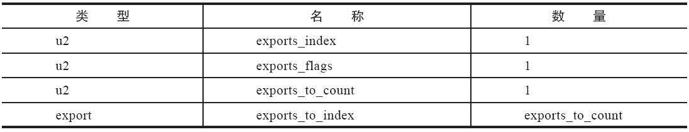

　　exports 属性的每一元素都代表一个被模块所导出的包。

　　exports_index 是一个指向常量池CONSTANT_Package_info 常量的索引值，代表了被该模块导出的包。

　　exports_flags 是该导出包的状态指示器，它可以包含以下两种状态中的一种或多种：

* 0x1000（ACC_SYNTHETIC）：表示该导出包并未出现在源文件中，是编译器自动生成的。
* 0x8000（ACC_MANDATED）：表示该导出包是在源文件中隐式定义的。

限定计数器，如果这个计数器为零，这说明该导出包是无限定的（Unqualified），即完全开放的，任何其他模块都可以访问该包中所有内容。如果该计数器不为零，则后面的 exports_to_index 是以计数器值为长度的数组，每个数组元素都是一个指向常量池中 CONSTANT_Module_info 常量的索引值，代表着只有在这个数组范围内的模块才被允许访问该导出包的内容。

　　ModulePackages 是另一个用于支持 Java 模块化的变长属性，它用于描述该模块中所有的包，不论是不是被 export 或者 open 的。该属性的结构如下表所示：

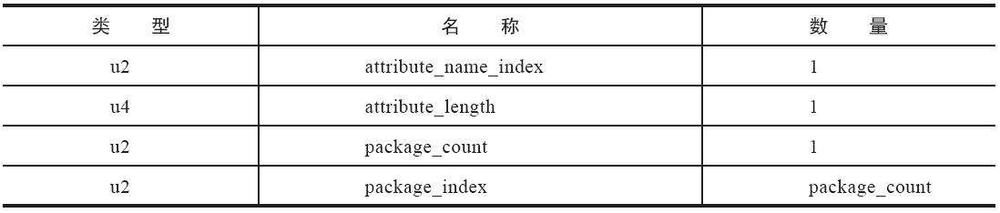

　　package_count 是 package_index 数组的计数器，package_index 中每个元素都是指向常量池 CONSTANT_Package_info 常量的索引值，代表了当前模块中的一个包。

　　ModuleMainClass 属性是一个定长属性，用于确定该模块的主类（Main Class），其结构如下表所示：

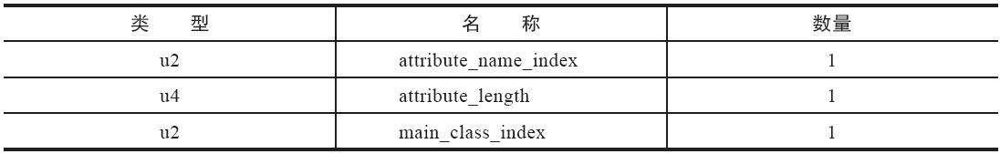

　　其中，main_class_index 是一个指向常量池 CONSTANT_Class_info 常量的索引值，代表了该模块的主类。

#### 6.3.7.14 运行时注解相关属性

　　为了存储源码中注解信息，Class 文件同步增加了 RuntimeVisibleAnnotations、RuntimeInvisibleAnnotations、RuntimeVisibleParameterAnnotations 和 RuntimeInvisibleParameter-Annotations 四个属性。

　　到了 JDK 8 时期，进一步加强了 Java 语言的注解使用范围，又新增类型注解（ JSR 308 ），所以 Class 文件中也同步增加了 RuntimeVisibleTypeAnnotations 和 RuntimeInvisibleTypeAnnotations 两个属性。

　　这六个属性不论结构还是功能都比较雷同，以 RuntimeVisibleAnnotations 为例介绍。

　　RuntimeVisibleAnnotations 是一个变长属性，它记录了类、字段或方法的声明上记录运行时可见注解，当使用反射 API 来获取类、字段或方法上的注解时，返回值就是通过这个属性来取到的。

　　RuntimeVisibleAnnotations属性的结构如下表所示：

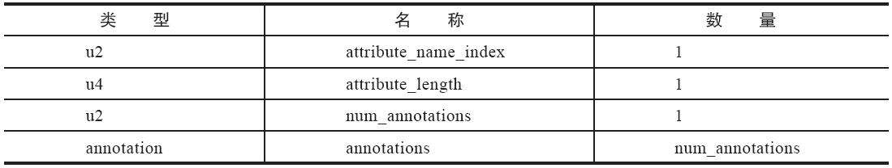

　　num_annotations 是 annotations 数组的计数器，annotations 中每个元素都代表了一个运行时可见的注解。

注解在 Class 文件中以 annotation 结构来存储，具体如下表所示：

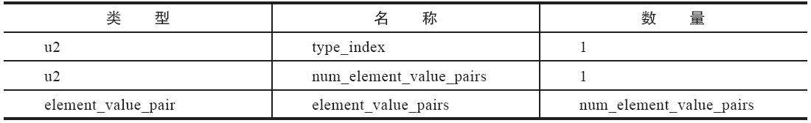　　type_index 是一个指向常量池 CONSTANT_Utf8_info 常量的索引值，该常量应以字段描述符的形式表示一个注解。

　　num_element_value_pairs 是 element_value_pairs 数组的计数器， element_value_pairs 中每个元素都是一个键值对，代表该注解的参数和值。

## 6.4 字节码指令简介

　　Java 虚拟机的指令由一个字节长度的、代表着某种特定操作含义的数字（称为操作码，Opcode）以及跟随其后的零至多个代表此操作所需的参数（称为操作数，Operand）构成。

　　由于 Java 虚拟机采用面向操作数栈而不是面向寄存器的架构，所以大多数指令都不包含操作数，只有一个操作码，指令参数都存放在操作数栈中。

　　字节码指令集算是一种具有鲜明特点、优势和劣势均很突出的指令集架构，由于限制了 Java 虚拟机操作码的长度为一个字节（ 即0～255 ），这意味着指令集的操作码总数不能够超过 256 条；又由于 Class 文件格式放弃了编译后代码的操作数长度对齐，这就意味着虚拟机在处理那些超过一个字节的数据时，不得不在运行时从字节中重建出具体数据的结构。

　　这样的优势是：放弃了操作数长度对齐，就意味着可以省略掉大量的填充和间隔符号；用一个字节来代表操作码，也是为了尽可能获得短小精干的编译代码。

　　Java虚拟机的解释器的最基本的执行模型：

 ```java
do { 
    自动计算PC寄存器的值加1; 
    根据PC寄存器指示的位置，从字节码流中取出操作码; 
    if (字节码存在操作数) 从字节码流中取出操作数; 
    执行操作码所定义的操作;
} while (字节码流长度 > 0);
 ```

### 6.4.1 字节码与数据类型

　　在 Java 虚拟机的指令集中，大多数指令都包含其操作所对应的数据类型信息。

　　对于大部分与数据类型相关的字节码指令，它们的操作码助记符中都有特殊的字符来表明专门为哪种数据类型服务：i 代表对 int 类型的数据操作，l代表 long，s 代表 short，b 代表 byte，c 代表 char，f 代表 float，d 代表 double，a 代表reference 。

　　也有一些指令的助记符中没有明确指明操作类型的字母，例如 arraylength 指令，它没有代表数据类型的特殊字符，但操作数永远只能是一个数组类型的对象。还有另外一些指令，例如无条件跳转指令 goto 则是与数据类型无关的指令。

　　Java 虚拟机的指令集对于特定的操作只提供了有限的类型相关指令去支持它，换句话说，指令集将会被故意设计成非完全独立的。（《 Java虚拟机规范 》中把这种特性称为 “Not Orthogonal” ，即并非每种数据类型和每一种操作都有对应的指令。）有一些单独的指令可以在必要的时候用来将一些不支持的类型转换为可被支持的类型。

　　下表列举了 Java 虚拟机所支持的与数据类型相关的字节码指令，通过使用数据类型列所代表的特殊字符替换 opcode 列的指令模板中的 T，就可以得到一个具体的字节码指令。

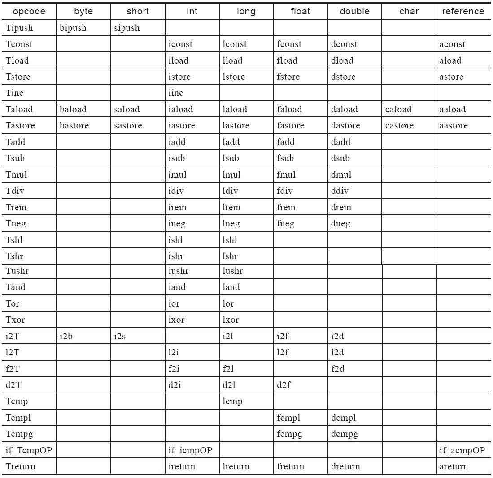 

　　如果在表中指令模板与数据类型两列共同确定的格为空，则说明虚拟机不支持对这种数据类型执行这项操作。例如 load 指令有操作 int 类型的iload，但是没有操作 byte 类型的同类指令。

　　从上表中看来，大部分指令都没有支持整数类型 byte、char 和 short，甚至没有任何指令支持 boolean 类型。编译器会在编译期或运行期将 byte和 short 类型的数据带符号扩展（Sign-Extend）为相应的 int 类型数据，将 boolean 和 char 类型数据零位扩展（Zero-Extend）为相应的 int 类型数据。与之类似，在处理 boolean、byte、short 和 char类型的数组时，也会转换为使用对应的 int 类型的字节码指令来处理。因此，大多数对于 boolean、byte、short 和 char 类型数据的操作，实际上都是使用相应的对 int 类型作为运算类型（ Computational Type ）来进行的。

### 6.4.2 加载和存储指令

　　加载和存储指令用于将数据在栈帧中的局部变量表和操作数栈之间来回传输，这类指令包括：

* 将一个局部变量加载到操作栈：iload、iload_ < n >、lload、lload_ < n >、fload、fload _< n >、dload、dload _ < n >、aload、aload _ < n >
* 将一个数值从操作数栈存储到局部变量表：istore、istore _ < n >、lstore、lstore _ < n >、fstore、fstore _ < n >、dstore、dstore _ <  n >、astore、astore _ < n >
* 将一个常量加载到操作数栈：bipush、sipush、ldc、ldc_w、ldc2_w、aconst_null、iconst_m1、iconst _ < i >、lconst _ < l >、fconst _ < f >、dconst_< d >·
* 扩充局部变量表的访问索引的指令：wide

　　存储数据的操作数栈和局部变量表主要由加载和存储指令进行操作，除此之外，还有少量指令，如访问对象的字段或数组元素的指令也会向操作数栈传输数据。

　　上面所列举的指令助记符中，有一部分是以尖括号结尾的（例如 iload _ < n >），这些指令助记符实际上代表了一组指令（例如 iload _ < n >，它代表了 iload_0、iload_1、iload_2 和 iload_3 这几条指令）。这几组指令都是某个带有一个操作数的通用指令（例如 iload ）的特殊形式，对于这几组特殊指令，它们省略掉了显式的操作数，不需要进行取操作数的动作，因为实际上操作数就隐含在指令中。除了这点不同以外，它们的语义与原生的通用指令是完全一致的（例如 iload_0 的语义与操作数为 0 时的 iload 指令语义完全一致）。

### 6.4.3 运算指令

　　算术指令用于对两个操作数栈上的值进行某种特定运算，并把结果重新存入到操作栈顶。

　　大体上运算指令可以分为两种：对整型数据进行运算的指令与对浮点型数据进行运算的指令。

　　整数与浮点数的算术指令在溢出和被零除的时候也有各自不同的行为表现。

　　无论是哪种算术指令，均是使用 Java 虚拟机的算术类型来进行计算的，换句话说是不存在直接支持 byte、short、char 和 boolean 类型的算术指令，对于上述几种数据的运算，应使用操作 int 类型的指令代替。

　　所有的算术指令包括：

* 加法指令：iadd、ladd、fadd、dadd
* 减法指令：isub、lsub、fsub、dsub
* 乘法指令：imul、lmul、fmul、dmul
* 除法指令：idiv、ldiv、fdiv、ddiv
* 求余指令：irem、lrem、frem、drem
* 取反指令：ineg、lneg、fneg、dneg
* 位移指令：ishl、ishr、iushr、lshl、lshr、lushr
* 按位或指令：ior、lor
* 按位与指令：iand、land
* 按位异或指令：ixor、lxor
* 局部变量自增指令：iinc
* 比较指令：dcmpg、dcmpl、fcmpg、fcmpl、lcmp

　　《 Java虚拟机规范 》中并没有明确定义过整型数据溢出具体会得到什么计算结果，仅规定了在处理整型数据时，只有除法指令（ idiv 和 ldiv ）以及求余指令（ irem 和 lrem ）中当出现除数为零时会导致虚拟机抛出 ArithmeticException 异常，其余任何整型数运算场景都不应该抛出运行时异常。

　　Java 虚拟机必须完全支持  IEEE 754中定义的 “ 非正规浮点数值 ”（Denormalized Floating-Point Number）和 “ 逐级下溢 ”（Gradual Underflow）的运算规则。这些规则将会使某些数值算法处理起来变得明确，不会出现模棱两可的困境。

　　譬如以上规则要求 Java 虚拟机在进行浮点数运算时，所有的运算结果都必须舍入到适当的精度，非精确的结果必须舍入为可被表示的最接近的精确值；如果有两种可表示的形式与该值一样接近，那将优先选择最低有效位为零的。这种舍入模式也是 IEEE 754 规范中的默认舍入模式，称为向最接近数舍入模式。而在把浮点数转换为整数时，Java 虚拟机使用 IEEE 754 标准中的向零舍入模式，这种模式的舍入结果会导致数字被截断，所有小数部分的有效字节都会被丢弃掉。向零舍入模式将在目标数值类型中选择一个最接近，但是不大于原值的数字来作为最精确的舍入结果。

　　Java 虚拟机在处理浮点数运算时，不会抛出任何运行时异常。

　　当一个操作产生溢出时，将会使用有符号的无穷大来表示；如果某个操作结果没有明确的数学定义的话，将会使用 NaN（Not a Number）值来表示。所有使用 NaN 值作为操作数的算术操作，结果都会返回 NaN。

　　在对 long 类型数值进行比较时，Java 虚拟机采用带符号的比较方式，而对浮点数值进行比较时（dcmpg、dcmpl、fcmpg、fcmpl），虚拟机会采用 IEEE 754 规范所定义的无信号比较（Nonsignaling Comparison）方式进行。

### 6.4.4 类型转换指令 

　　类型转换指令可以将两种不同的数值类型相互转换，这些转换操作一般用于实现用户代码中的显式类型转换操作或者用来处理字节码指令集中数据类型相关指令无法与数据类型一一对应的问题。

　　Java 虚拟机直接支持（即转换时无须显式的转换指令）以下数值类型的宽化类型转换（Widening Numeric Conversion，即小范围类型向大范围类型的安全转换）：

* int 类型到 long、float 或者 double 类型
* long 类型到 float、double 类型
* float 类型到 double 类型

　　与之相对的，处理窄化类型转换（Narrowing Numeric Conversion）时，就必须显式地使用转换指令来完成，这些转换指令包括 i2b、i2c、i2s、l2i、f2i、f2l、d2i、d2l 和 d2f。窄化类型转换可能会导致转换结果产生不同的正负号、不同的数量级的情况，转换过程很可能会导致数值的精度丢失。

　　在将 int 或 long 类型窄化转换为整数类型 T 的时候，转换过程仅仅是简单丢弃除最低位 N 字节以外的内容，N 是类型 T 的数据类型长度，这将可能导致转换结果与输入值有不同的正负号。

　　Java 虚拟机将一个浮点值窄化转换为整数类型T（T 限于 int 或 long 类型之一）的时候，必须遵循以下转换规则：

* 如果浮点值是 NaN，那转换结果就是 int 或long 类型的 0。
* 如果浮点值不是无穷大的话，浮点值使用 IEEE 754 的向零舍入模式取整，获得整数值 v。如果v 在目标类型 T（ int 或 long ）的表示范围之类，那转换结果就是 v；否则，将根据 v 的符号，转换为 T 所能表示的最大或者最小正数。

　　从 double 类型到 float 类型做窄化转换的过程与 IEEE 754 中定义的一致，通过 IEEE 754 向最接近数舍入模式舍入得到一个可以使用 float 类型表示的数字。如果转换结果的绝对值太小、无法使用 float 来表示的话，将返回 float 类型的正负零；如果转换结果的绝对值太大、无法使用 float 来表示的话，将返回 float 类型的正负无穷大。对于 double 类型的 NaN 值将按规定转换为 float 类型的 NaN值。

　　数值类型的窄化转换指令永远不可能导致虚拟机抛出运行时异常。

### 6.4.5 对象创建与访问指令

　　虽然类实例和数组都是对象，但 Java 虚拟机对类实例和数组的创建与操作使用了不同的字节码指令。

　　对象创建后，就可以通过对象访问指令获取对象实例或者数组实例中的字段或者数组元素，这些指令包括：

* 创建类实例的指令：new
* 创建数组的指令：newarray、anewarray、multianewarray
* 访问类字段（static 字段，或者称为类变量）和实例字段（非 static 字段，或者称为实例变量）的指令：getfield、putfield、getstatic、putstatic
* 把一个数组元素加载到操作数栈的指令：baload、caload、saload、iaload、laload、faload、daload、aaload
* 将一个操作数栈的值储存到数组元素中的指令：bastore、castore、sastore、iastore、fastore、dastore、aastore
* 取数组长度的指令：arraylength
* 检查类实例类型的指令：instanceof、checkcast

### 6.4.6 操作数栈管理指令

　　如同操作一个普通数据结构中的堆栈那样，Java 虚拟机提供了一些用于直接操作操作数栈的指令，包括：

* 将操作数栈的栈顶一个或两个元素出栈：pop、pop2
* 复制栈顶一个或两个数值并将复制值或双份的复制值重新压入栈顶：dup、dup2、dup_x1、dup2_x1、dup_x2、dup2_x2
* 将栈最顶端的两个数值互换：swap

### 6.4.7 控制转移指令

　　控制转移指令可以让 Java 虚拟机有条件或无条件地从指定位置指令（而不是控制转移指令）的下一条指令继续执行程序，从概念模型上理解，可以认为控制指令就是在有条件或无条件地修改 PC 寄存器的值。

　　控制转移指令包括：

* 条件分支：ifeq、iflt、ifle、ifne、ifgt、ifge、ifnull、ifnonnull、if_icmpeq、if_icmpne、if_icmplt、if_icmpgt、if_icmple、if_icmpge、if_acmpeq 和 if_acmpne
* 复合条件分支：tableswitch、lookupswitch
* 无条件分支：goto、goto_w、jsr、jsr_w、ret

　　在 Java 虚拟机中有专门的指令集用来处理 int 和 reference 类型的条件分支比较操作，为了可以无须明显标识一个数据的值是否 null，也有专门的指令用来检测 null 值。

　　与前面算术运算的规则一致，对于 boolean 类型、byte 类型、char 类型和 short 类型的条件分支比较操作，都使用 int 类型的比较指令来完成，而对于 long 类型、float 类型和 double 类型的条件分支比较操作，则会先执行相应类型的比较运算指令（dcmpg、dcmpl、fcmpg、fcmpl、lcmp），运算指令会返回一个整型值到操作数栈中，随后再执行 int 类型的条件分支比较操作来完成整个分支跳转。

　　由于各种类型的比较最终都会转化为 int 类型的比较操作，int 类型比较是否方便、完善就显得尤为重要，而 Java 虚拟机提供的 int 类型的条件分支指令是最为丰富、强大的。

### 6.4.8 方法调用和返回指令

　　列举以下五条指令用于方法调用：

* invokevirtual 指令：用于调用对象的实例方法，根据对象的实际类型进行分派（虚方法分派），这也是 Java 语言中最常见的方法分派方式。
* invokeinterface 指令：用于调用接口方法，它会在运行时搜索一个实现了这个接口方法的对象，找出适合的方法进行调用。
* invokespecial 指令：用于调用一些需要特殊处理的实例方法，包括实例初始化方法、私有方法和父类方法。
* invokestatic 指令：用于调用类静态方法（ static 方法）。
* invokedynamic 指令：用于在运行时动态解析出调用点限定符所引用的方法。并执行该方法。前面四条调用指令的分派逻辑都固化在 Java 虚拟机内部，用户无法改变，而 invokedynamic 指令的分派逻辑是由用户所设定的引导方法决定的。

　　方法调用指令与数据类型无关，而方法返回指令是根据返回值的类型区分的，包括 ireturn（当返回值是 boolean、byte、char、short 和 int 类型时使用）、lreturn、freturn、dreturn 和 areturn，另外还有一条 return 指令供声明为 void 的方法、实例初始化方法、类和接口的类初始化方法使用。

### 6.4.9 异常处理指令

　　在 Java 程序中显式抛出异常的操作（ throw 语句）都由 athrow 指令来实现，除了用 throw 语句显式抛出异常的情况之外，《 Java 虚拟机规范 》还规定了许多运行时异常会在其他 Java 虚拟机指令检测到异常状况时自动抛出。例如前面介绍整数运算中，当除数为零时，虚拟机会在 idiv 或 ldiv 指令中抛出 ArithmeticException 异常。

　　而在 Java 虚拟机中，处理异常（ catch 语句）不是由字节码指令来实现的，而是采用异常表来完成。

### 6.4.10 同步指令

　　Java 虚拟机可以支持方法级的同步和方法内部一段指令序列的同步，这两种同步结构都是使用管程（ Monitor，更常见的是直接将它称为 “ 锁 ” ）来实现的。

　　方法级的同步是隐式的，无须通过字节码指令来控制，它实现在方法调用和返回操作之中。

　　虚拟机可以从方法常量池中的方法表结构中的 ACC_SYNCHRONIZED 访问标志得知一个方法是否被声明为同步方法。

　　当方法调用时，调用指令将会检查方法的ACC_SYNCHRONIZED 访问标志是否被设置，如果设置了，执行线程就要求先成功持有管程，然后才能执行方法，最后当方法完成（ 无论是正常完成还是非正常完成 ）时释放管程。在方法执行期间，执行线程持有了管程，其他任何线程都无法再获取到同一个管程。

　　如果一个同步方法执行期间抛出了异常，并且在方法内部无法处理此异常，那这个同步方法所持有的管程将在异常抛到同步方法边界之外时自动释放。

　　同步一段指令集序列通常是由 Java 语言中的synchronized 语句块来表示的，Java 虚拟机的指令集中有 monitorenter 和 monitorexit 两条指令来支持 synchronized 关键字的语义，正确实现 synchronized 关键字需要 Javac 编译器与 Java 虚拟机两者共同协作支持。

　　编译器必须确保无论方法通过何种方式完成，方法中调用过的每条 monitorenter 指令都必须有其对应的 monitorexit 指令，而无论这个方法是正常结束还是异常结束。

　　为了保证在方法异常完成时 monitorenter 和 monitorexit 指令依然可以正确配对执行，编译器会自动产生一个异常处理程序，这个异常处理程序声明可处理所有的异常，它的目的就是用来执行 monitorexit 指令。

## 6.5 公有设计，私有实现

　　《 Java 虚拟机规范 》描绘了 Java 虚拟机应有的共同程序存储格式：Class 文件格式以及字节码指令集。这些内容与硬件、操作系统和具体的 Java 虚拟机实现之间是完全独立的，虚拟机实现者可能更愿意把它们看作程序在各种 Java 平台实现之间互相安全地交互的手段。

　　任何一款 Java 虚拟机实现都必须能够读取 Class 文件并精确实现包含在其中的 Java 虚拟机代码的语义。

　　在满足《 Java虚拟机规范 》的约束下对具体实现做出修改和优化也是完全可行的。只要优化以后 Class 文件依然可以被正确读取，并且包含在其中的语义能得到完整保持，那实现者就可以选择以任何方式去实现这些语义，虚拟机在后台如何处理 Class 文件完全是实现者自己的事情，只要它在外部接口上看起来与规范描述的一致即可。

　　虚拟机实现者可以使用这种伸缩性来让 Java 虚拟机获得更高的性能、更低的内存消耗或者更好的可移植性，选择哪种特性取决于 Java 虚拟机实现的目标和关注点是什么，虚拟机实现的方式主要有以下两种：

* 将输入的 Java 虚拟机代码在加载时或执行时翻译成另一种虚拟机的指令集；
* 将输入的Java虚拟机代码在加载时或执行时翻译成宿主机处理程序的本地指令集（即即时编译器代码生成技术）。

　　精确定义的虚拟机行为和目标文件格式，不应当对虚拟机实现者的创造性产生太多的限制，Java 虚拟机是被设计成可以允许有众多不同的实现，并且各种实现可以在保持兼容性的同时提供不同的新的、有趣的解决方案。

## 6.6 Class 文件结构的发展

　　Class 文件结构一直处于一个相对比较稳定的状态，Class 文件的主体结构、字节码指令的语义和数量几乎没有出现过变动，所有对 Class 文件格式的改进，都集中在访问标志、属性表这些设计上原本就是可扩展的数据结构中添加新内容。

　　如果以《 Java虚拟机规范（第2版）》（对应于 JDK 1.4，是 Java 2 的奠基版本）为基准进行比较的话，在后续 Class 文件格式的发展过程中，访问标志新加入了 ACC_SYNTHETIC、ACC_ANNOTATION、ACC_ENUM、ACC_BRIDGE、ACC_VARARGS 共五个标志。属性表集合中，在 JDK 5 到 JDK 12 发展过程中一共增加了 20 项新属性，这些属性大部分是用于支持 Java 中许多新出现的语言特性，如枚举、变长参数、泛型、动态注解等。还有一些是为了支持性能改进和调试信息，譬如 JDK 6 的新类型校验器的StackMapTable 属性和对非 Java 代码调试中用到的SourceDebugExtension 属性。

　　Class 文件格式所具备的平台中立（不依赖于特定硬件及操作系统）、紧凑、稳定和可扩展的特点，是 Java 技术体系实现平台无关、语言无关两项特性的重要支柱。

## 6.7 本章小结 

　　Class 文件是 Java 虚拟机执行引擎的数据入口，也是 Java 技术体系的基础支柱之一。
