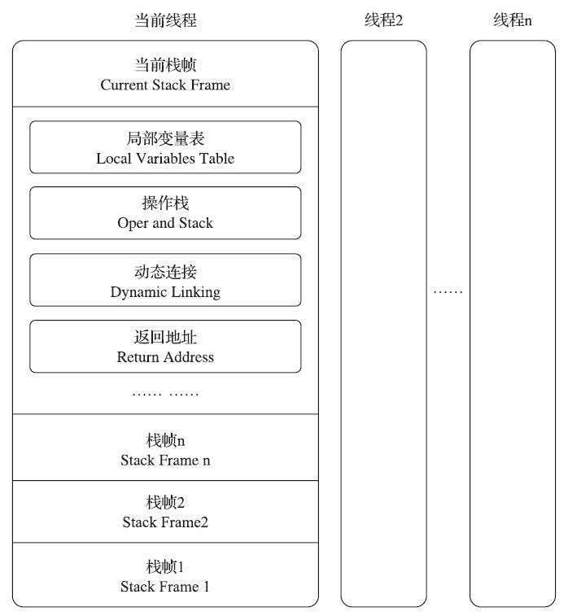
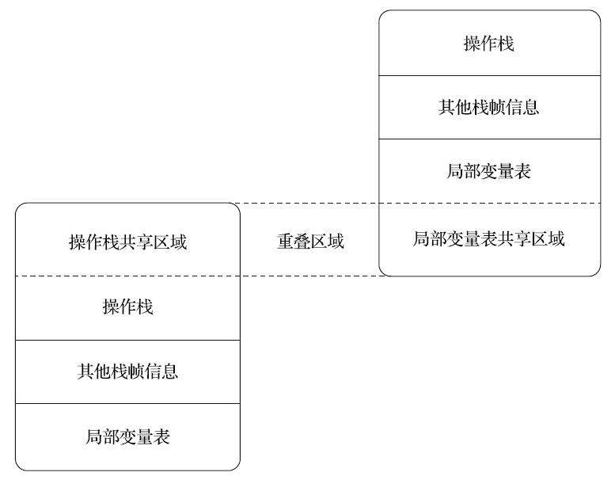
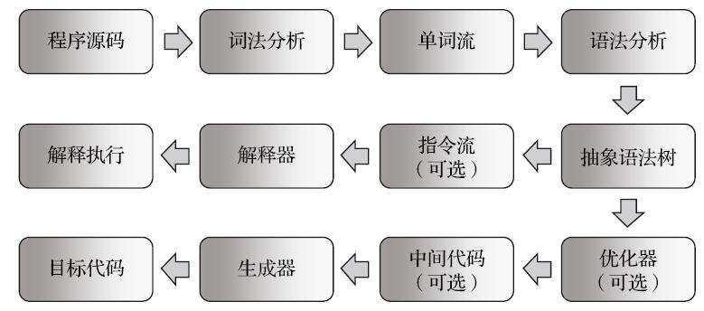

# 第 8 章 虚拟机字节码执行引擎

　　代码编译的结果从本地机器码转变为字节码，是存储格式发展的一小步，却是编程语言发展的一大步。

## 8.1 概述

　　执行引擎是 Java 虚拟机核心的组成部分之一。

　　“ 虚拟机 ” 是一个相对于 “ 物理机 ” 的概念，这两种机器都有代码执行能力，其区别是物理机的执行引擎是直接建立在处理器、缓存、指令集和操作系统层面上的，而虚拟机的执行引擎则是由软件自行实现的，因此可以不受物理条件制约地定制指令集与执行引擎的结构体系，能够执行那些不被硬件直接支持的指令集格式。

　　在不同的虚拟机实现中，执行引擎在执行字节码的时候，通常会有解释执行（ 通过解释器执行 ）和编译执行（ 通过即时编译器产生本地代码执行 ）两种选择，也可能两者兼备，还可能会有同时包含几个不同级别的即时编译器一起工作的执行引擎。

　　从外观上来看，所有的 Java 虚拟机的执行引擎输入、输出都是一致的：输入的是字节码二进制流，处理过程是字节码解析执行的等效过程，输出的是执行结果。

## 8.2 运行时栈帧结构

　　Java 虚拟机以方法作为最基本的执行单元，“ 栈帧 ”（ Stack Frame ）则是用于支持虚拟机进行方法调用和方法执行背后的数据结构，它也是虚拟机运行时数据区中的虚拟机栈（ Virtual Machine Stack ）的栈元素。

　　栈帧存储了方法的局部变量表、操作数栈、动态连接和方法返回地址等信息。

　　每一个方法从调用开始至执行结束的过程，都对应着一个栈帧在虚拟机栈里面从入栈到出栈的过程。

　　每一个栈帧都包括了局部变量表、操作数栈、动态连接、方法返回地址和一些额外的附加信息。

　　在编译 Java 程序源码的时候，栈帧中需要多大的局部变量表，需要多深的操作数栈就已经被分析计算出来，并且写入到方法表的 Code 属性之中。

　　一个栈帧需要分配多少内存，并不会受到程序运行期变量数据的影响，而仅仅取决于程序源码和具体的虚拟机实现的栈内存布局形式。

　　以 Java 程序的角度来看，同一时刻、同一条线程里面，在调用堆栈的所有方法都同时处于执行状态。

　　对于执行引擎来讲，在活动线程中，只有位于栈顶的方法才是在运行的，只有位于栈顶的栈帧才是生效的，其被称为 “ **当前栈帧** ”（Current Stack Frame），与这个栈帧所关联的方法被称为 “ **当前方法** ”（Current Method）。

　　执行引擎所运行的所有字节码指令都只针对当前栈帧进行操作。

　　在概念模型上，典型的栈帧结构如下图所示：



### 8.2.1 局部变量表

　　局部变量表（Local Variables Table）是一组变量值的存储空间，用于存放方法参数和方法内部定义的局部变量。

　　在 Java 程序被编译为 Class 文件时，就在方法的 Code 属性的 max_locals 数据项中确定了该方法所需分配的局部变量表的最大容量。

　　局部变量表的容量以变量槽（ Variable Slot ）为最小单位，《 Java虚拟机规范 》中并没有明确指出一个变量槽应占用的内存空间大小。

　　由于局部变量表是建立在线程堆栈中的，属于线程私有的数据，无论读写两个连续的变量槽是否为原子操作，都不会引起数据竞争和线程安全问题。

　　Java 虚拟机通过索引定位的方式使用局部变量表，索引值的范围是从 0 开始至局部变量表最大的变量槽数量。如果访问的是 32 位数据类型的变量，索引 N 就代表了使用第 N 个变量槽，如果访问的是 64 位数据类型的变量，则说明会同时使用第 N 和 N+1 两个变量槽。

　　对于两个相邻的共同存放一个 64 位数据的两个变量槽，虚拟机不允许采用任何方式单独访问其中的某一个，《 Java 虚拟机规范 》中明确要求了如果遇到进行这种操作的字节码序列，虚拟机就应该在类加载的校验阶段中抛出异常。

　　当一个方法被调用时，Java 虚拟机会使用局部变量表来完成参数值到参数变量列表的传递过程，即实参到形参的传递。

　　如果执行的是实例方法（没有被 static 修饰的方法），那局部变量表中第 0 位索引的变量槽默认是用于传递方法所属对象实例的引用，在方法中可以通过关键字 “ this ” 来访问到这个隐含的参数。其余参数则按照参数表顺序排列，占用从 1 开始的局部变量槽，参数表分配完毕后，再根据方法体内部定义的变量顺序和作用域分配其余的变量槽。

　　为了尽可能节省栈帧耗用的内存空间，局部变量表中的变量槽是可以重用的，方法体中定义的变量，其作用域并不一定会覆盖整个方法体，如果当前字节码 PC 计数器的值已经超出了某个变量的作用域，那这个变量对应的变量槽就可以交给其他变量来重用。不过，这样的设计除了节省栈帧空间以外，还会伴随有少量额外的副作用，例如在某些情况下变量槽的复用会直接影响到系统的垃圾收集行为。

　　类的字段变量有两次赋初始值的过程，一次在准备阶段，赋予系统初始值；另外一次在初始化阶段，赋予程序员定义的初始值。因此即使在初始化阶段程序员没有为类变量赋值也没有关系，类变量仍然具有一个确定的初始值，不会产生歧义。但局部变量就不一样了，如果一个局部变量定义了但没有赋初始值，那它是完全不能使用的。所以不要认为 Java 中任何情况下都存在诸如整型变量默认为 0、布尔型变量默认为 false 等这样的默认值规则。

### 8.2.2 操作数栈

　　操作数栈（ Operand Stack ）也常被称为操作栈，它是一个后入先出（ Last In FirstOut，LIFO ）栈。同局部变量表一样，操作数栈的最大深度也在编译的时候被写入到 Code 属性的 max_stacks 数据项之中。

　　操作数栈的每一个元素都可以是包括 long 和 double 在内的任意 Java 数据类型。32 位数据类型所占的栈容量为 1，64 位数据类型所占的栈容量为 2。

　　Javac 编译器的数据流分析工作保证了在方法执行的任何时候，操作数栈的深度都不会超过在 max_stacks 数据项中设定的最大值。

　　当一个方法刚刚开始执行的时候，这个方法的操作数栈是空的，在方法的执行过程中，会有各种字节码指令往操作数栈中写入和提取内容，也就是出栈和入栈操作。

　　譬如在做算术运算的时候是通过将运算涉及的操作数栈压入栈顶后调用运算指令来进行的，又譬如在调用其他方法的时候是通过操作数栈来进行方法参数的传递。

　　操作数栈中元素的数据类型必须与字节码指令的序列严格匹配，在编译程序代码的时候，编译器必须要严格保证这一点，在类校验阶段的数据流分析中还要再次验证这一点。

　　在概念模型中，两个不同栈帧作为不同方法的虚拟机栈的元素，是完全相互独立的。但是在大多虚拟机的实现里都会进行一些优化处理，令两个栈帧出现一部分重叠。

　　让下面栈帧的部分操作数栈与上面栈帧的部分局部变量表重叠在一起，这样做不仅节约了一些空间，更重要的是在进行方法调用时就可以直接共用一部分数据，无须进行额外的参数复制传递了，重叠的过程如下图所示：



　　Java 虚拟机的解释执行引擎被称为 “ 基于栈的执行引擎 ” ，里面的 “ 栈 ” 就是操作数栈。 

### 8.2.3 动态连接

　　每个栈帧都包含一个指向运行时常量池中该栈帧所属方法的引用，持有这个引用是为了支持方法调用过程中的动态连接（Dynamic Linking）。

　　Class 文件的常量池中存有大量的符号引用，字节码中的方法调用指令就以常量池里指向方法的符号引用作为参数。

　　这些符号引用一部分会在类加载阶段或者第一次使用的时候就被转化为直接引用，这种转化被称为**静态解析**。另外一部分将在每一次运行期间都转化为直接引用，这部分就称为**动态连接**。

### 8.2.4 方法返回地址

　　当一个方法开始执行后，只有两种方式退出这个方法：

1. 第一种方式是执行引擎遇到任意一个方法返回的字节码指令，这时候可能会有返回值传递给上层的方法调用者（调用当前方法的方法称为调用者或者主调方法），方法是否有返回值以及返回值的类型将根据遇到何种方法返回指令来决定，这种退出方法的方式称为 “ **正常调用完成** ”（Normal Method Invocation Completion）。

2. 另外一种退出方式是在方法执行的过程中遇到了异常，并且这个异常没有在方法体内得到妥善处理。无论是 Java 虚拟机内部产生的异常，还是代码中使用 athrow 字节码指令产生的异常，只要在本方法的异常表中没有搜索到匹配的异常处理器，就会导致方法退出，这种退出方法的方式称为 “ **异常调用完成**（Abrupt Method Invocation Completion）”。一个方法使用异常完成出口的方式退出，是不会给它的上层调用者提供任何返回值的。

　　无论采用何种退出方式，在方法退出之后，都必须返回到最初方法被调用时的位置，程序才能继续执行，方法返回时可能需要在栈帧中保存一些信息，用来帮助恢复它的上层主调方法的执行状态。

　　一般来说，方法正常退出时，主调方法的 PC 计数器的值就可以作为返回地址，栈帧中很可能会保存这个计数器值。而方法异常退出时，返回地址是要通过异常处理器表来确定的，栈帧中就一般不会保存这部分信息。

　　方法退出的过程实际上等同于把当前栈帧出栈，因此退出时可能执行的操作有：恢复上层方法的局部变量表和操作数栈，把返回值（如果有的话）压入调用者栈帧的操作数栈中，调整 PC 计数器的值以指向方法调用指令后面的一条指令等。

### 8.2.5 附加信息

　　《 Java虚拟机规范 》允许虚拟机实现增加一些规范里没有描述的信息到栈帧之中，例如与调试、性能收集相关的信息，这部分信息完全取决于具体的虚拟机实现。

　　在讨论概念时，一般会把动态连接、方法返回地址与其他附加信息全部归为一类，称为**栈帧信息**。

## 8.3 方法调用

　　方法调用并不等同于方法中的代码被执行，方法调用阶段唯一的任务就是确定被调用方法的版本（即调用哪一个方法），暂时还未涉及方法内部的具体运行过程。

　　Class 文件的编译过程中不包含传统程序语言编译的连接步骤，一切方法调用在 Class 文件里面存储的都只是符号引用，而不是方法在实际运行时内存布局中的入口地址（也就是之前说的直接引用）。这个特性给 Java 带来了更强大的动态扩展能力，但也使得 Java 方法调用过程变得相对复杂，某些调用需要在类加载期间，甚至到运行期间才能确定目标方法的直接引用。

### 8.3.1 解析

　　所有方法调用的目标方法在 Class 文件里面都是一个常量池中的符号引用，在类加载的解析阶段，会将其中的一部分符号引用转化为直接引用，这种解析能够成立的前提是：方法在程序真正运行之前就有一个可确定的调用版本，并且这个方法的调用版本在运行期是不可改变的。换句话说，调用目标在程序代码写好、编译器进行编译那一刻就已经确定下来。这类方法的调用被称为**解析**（Resolution）。

　　在 Java 语言中符合 “ 编译期可知，运行期不可变 ” 这个要求的方法，主要有静态方法和私有方法两大类，前者与类型直接关联，后者在外部不可被访问，这两种方法各自的特点决定了它们都不可能通过继承或别的方式重写出其他版本，因此它们都适合在类加载阶段进行解析。

　　调用不同类型的方法，字节码指令集里设计了不同的指令。在 Java 虚拟机支持以下 5 条方法调用字节码指令，分别是：

* invokestatic。用于调用静态方法。
* invokespecial。用于调用实例构造器< init >()方法、私有方法和父类中的方法。
* invokevirtual。用于调用所有的虚方法。
* invokeinterface。用于调用接口方法，会在运行时再确定一个实现该接口的对象。
* invokedynamic。先在运行时动态解析出调用点限定符所引用的方法，然后再执行该方法。

　　前面 4 条调用指令，分派逻辑都固化在 Java 虚拟机内部，而 invokedynamic 指令的分派逻辑是由用户设定的引导方法来决定的。

　　只要能被 invokestatic 和 invokespecial 指令调用的方法，都可以在解析阶段中确定唯一的调用版本。

　　Java 语言里符合这个条件的方法共有静态方法、私有方法、实例构造器、父类方法 4 种，再加上被 final 修饰的方法（尽管它使用 invokevirtual 指令调用），这 5 种方法调用会在类加载的时候就可以把符号引用解析为该方法的直接引用。这些方法统称为 “ **非虚方法** ”（ Non-VirtualMethod ），与之相反，其他方法就被称为 “ **虚方法** ”（ Virtual Method ）。

　　Java 中的非虚方法除了使用 invokestatic、invokespecial 调用的方法之外还有一种，就是被 final 修饰的实例方法。

　　final 方法是使用 invokevirtual 指令来调用的，但是因为它也无法被覆盖，没有其他版本的可能，所以也无须对方法接收者进行多态选择，又或者说多态选择的结果肯定是唯一的。在《 Java语言规范 》中明确定义了被 final 修饰的方法是一种非虚方法。

　　解析调用一定是个静态的过程，在编译期间就完全确定，在类加载的解析阶段就会把涉及的符号引用全部转变为明确的直接引用，不必延迟到运行期再去完成。

　　而另一种主要的方法调用形式：分派（ Dispatch ）调用则要复杂许多，它可能是静态的也可能是动态的，按照分派依据的宗量数可分为单分派和多分派。这两类分派方式两两组合就构成了静态单分派、静态多分派、动态单分派、动态多分派 4 种分派组合情况。

### 8.3.2 分派

#### 8.3.2.1 静态分派

 ```java
//Man extends Human
Human man = new Man();
 ```

　　" Human " 成为变量的 “ 静态类型 ”（Static Type），或者叫 “ 外观类型 ”（Apparent Type），后面的 “ Man ”责备称为变量的 “ 实际类型 ”（Actual Type）或者叫 “ 运行时类型 ”（Runtime Type）。

　　静态类型和实际类型在程序中都可能会发生变化，区别是静态类型的变化仅仅在使用时发生，变量本身的静态类型不会被改变，并且最终的静态类型是在编译期可知的；而实际类型变化的结果在运行期才可确定，编译器在编译程序的时候并不知道一个对象的实际类型是什么。

　　所有依赖静态类型来决定方法执行版本的分派动作，都称为**静态分派**。

　　静态分派的最典型应用表现就是方法重载。

　　静态分派发生在编译阶段，因此确定静态分派的动作实际上不是由虚拟机来执行的。

　　char 可以转型成 int，但是 Character 是绝对不会转型为 Integer 的，它只能安全地转型为它实现的接口或父类。

　　变长参数的重载优先级是最低的。

　　解析与分派这两者之间的关系并不是二选一的排他关系，它们是在不同层次上去筛选、确定目标方法的过程。

#### 8.3.2.2 动态分派

　　动态分派与重写有着很密切的关联。

　　根据《 Java虚拟机规范 》，invokevirtual 指令的运行时解析过程大致分为以下几步：

1. 找到操作数栈顶的第一个元素所指向的对象的实际类型，记作 C 。
2. 如果在类型 C 中找到与常量中的描述符和简单名称都相符的方法，则进行访问权限校验，如果通过则返回这个方法的直接引用，查找过程结束；不通过则返回 java.lang.IllegalAccessError 异常。
3. 否则，按照继承关系从下往上依次对 C 的各个父类进行第二步的搜索和验证过程。
4. 如果始终没有找到合适的方法，则抛出 java.lang.AbstractMethodError 异常。

　　把这种在运行期根据实际类型确定方法执行版本的分派过程称为**动态分派**。

　　在 Java 里面只有虚方法存在，字段永远不可能是虚的，换句话说，字段永远不参与多态，哪个类的方法访问某个名字的字段时，该名字指的就是这个类能看到的那个字段。

　　当子类声明了与父类同名的字段时，虽然在子类的内存中两个字段都会存在，但是子类的字段会遮蔽父类的同名字段。

#### 8.3.2.3 单分派与多分派

　　方法的接收者与方法的参数统称为**方法的宗量**。

　　根据分派基于多少种宗量，可以将分派划分为单分派和多分派两种。**单分派**是根据一个宗量对目标方法进行选择，**多分派**则是根据多于一个宗量对目标方法进行选择。

　　如今的 Java 语言是一门静态多分派、动态单分派的语言。

　　JDK 10 时 Java 语法中新出现 var 关键字。var是在编译时根据声明语句中赋值符右侧的表达式类型来静态地推断类型，这本质是一种语法糖。

#### 8.3.2.4 虚拟机动态分派的实现

　　动态分派是执行非常频繁的动作，而且动态分派的方法版本选择过程需要运行时在接收者类型的方法元数据中搜索合适的目标方法，因此，Java 虚拟机实现基于执行性能的考虑，真正运行时一般不会如此频繁地去反复搜索类型元数据。面对这种情况，一种基础而且常见的优化手段是为类型在方法区中建立一个虚方法表（ Virtual Method Table，也称为 vtable，与此对应的，在 invokeinterface 执行时也会用到接口方法表—— Interface Method Table，简称 itable），使用虚方法表索引来代替元数据查找以提高性能。

　　虚方法表中存放着各个方法的实际入口地址。如果某个方法在子类中没有被重写，那子类的虚方法表中的地址入口和父类相同方法的地址入口是一致的，都指向父类的实现入口。如果子类中重写了这个方法，子类虚方法表中的地址也会被替换为指向子类实现版本的入口地址。

　　为了程序实现方便，具有相同签名的方法，在父类、子类的虚方法表中都应当具有一样的索引序号，这样当类型变换时，仅需要变更查找的虚方法表，就可以从不同的虚方法表中按索引转换出所需的入口地址。

　　虚方法表一般在类加载的连接阶段进行初始化，准备了类的变量初始值后，虚拟机会把该类的虚方法表也一同初始化完毕。

　　由于 Java 对象里面的方法默认（即不使用 final 修饰）就是虚方法，虚拟机除了使用虚方法表之外，为了进一步提高性能，还会使用类型继承关系分析（Class Hierarchy Analysis，CHA）、守护内联（Guarded Inlining）、内联缓存（Inline Cache）等多种非稳定的激进优化来争取更大的性能空间。

## 8.4 动态类型语言支持

　　invokedynamic 指令是 JDK 7 的项目目标：实现动态类型语言（Dynamically Typed Language）支持而进行的改进之一，也是为 JDK 8 里可以顺利实现 Lambda 表达式而做的技术储备。

### 8.4.1 动态类型语言

　　动态类型语言的关键特征是它的类型检查的主体过程是在运行期而不是编译期进行的，满足这个特征的语言有很多，常用的包括：APL、Clojure、Erlang、Groovy、JavaScript、Lisp、Lua、PHP、Prolog、Python、Ruby、Smalltalk、Tcl，等等。那相对地，在编译期就进行类型检查过程的语言，譬如 C++ 和 Java 等就是最常用的静态类型语言。

　　“ 变量无类型而变量值才有类型 ” 这个特点也是动态类型语言的一个核心特征。

　　静态类型语言能够在编译期确定变量类型，最显著的**好处**是编译器可以提供全面严谨的类型检查，这样与数据类型相关的潜在问题就能在编码时被及时发现，利于稳定性及让项目容易达到更大的规模。而动态类型语言在运行期才确定类型，这可以为开发人员提供极大的灵活性，某些在静态类型语言中要花大量臃肿代码来实现的功能，由动态类型语言去做可能会很清晰简洁，清晰简洁通常也就意味着开发效率的提升。

### 8.4.2 Java与动态类型

　　Java 虚拟机层面对动态类型语言的支持一直都还有所欠缺，主要表现在方法调用方面：JDK 7 以前的字节码指令集中，4 条方法调用指令（invokevirtual、invokespecial、invokestatic、invokeinterface）的第一个参数都是被调用的方法的符号引用（ CONSTANT_Methodref_info 或者 CONSTANT_InterfaceMethodref_info 常量。方法的符号引用在编译时产生，而动态类型语言只有在运行期才能确定方法的接收者。

　　这样，在 Java 虚拟机上实现的动态类型语言就不得不使用 “ 曲线救国 ” 的方式（如编译时留个占位符类型，运行时动态生成字节码实现具体类型到占位符类型的适配）来实现，但这样势必会让动态类型语言实现的复杂度增加，也会带来额外的性能和内存开销。而其中最严重的性能瓶颈是在于动态类型方法调用时，由于无法确定调用对象的静态类型，而导致的方法内联无法有效进行。

### 8.4.3 java.lang.invoke包

　　JDK 7 时新加入的 java.lang.invoke 包是 JSR 292  的一个重要组成部分，这个包的主要目的是在之前单纯依靠符号引用来确定调用的目标方法这条路之外，提供一种新的动态确定目标方法的机制，称为 “ **方法句柄** ”（Method Handle）。

　　仅站在 Java 语言的角度看，MethodHandle 在使用方法和效果上与 Reflection有 众多相似之处。不过，它们也有以下这些区别：

* Reflection 和 MethodHandle 机制本质上都是在模拟方法调用，但是 Reflection 是在模拟 Java 代码层次的方法调用，而 MethodHandle 是在模拟字节码层次的方法调用。在 MethodHandles.Lookup 上的 3 个方法findStatic()、findVirtual()、findSpecial() 正是为了对应于 invokestatic、invokevirtual（ 以及 invokeinterface ）和 invokespecial 这几条字节码指令的执行权限校验行为，而这些底层细节在使用 Reflection API 时是不需要关心的。
* Reflection 中的 java.lang.reflect.Method 对象远比 MethodHandle 机制中的 java.lang.invoke.MethodHandle 对象所包含的信息来得多。前者是方法在 Java 端的全面映像，包含了方法的签名、描述符以及方法属性表中各种属性的 Java 端表示方式，还包含执行权限等的运行期信息。而后者仅包含执行该方法的相关信息。用开发人员通俗的话来讲， Reflection 是重量级，而 MethodHandle 是轻量级。
* 由于 MethodHandle 是对字节码的方法指令调用的模拟，那理论上虚拟机在这方面做的各种优化（如方法内联），在 MethodHandle 上也应当可以采用类似思路去支持（但目前实现还在继续完善中），而通过反射去调用方法则几乎不可能直接去实施各类调用点优化措施。

　　MethodHandle 与 Reflection 除了上面列举的区别外，最关键的一点还在于去掉前面讨论施加的前提 “ 仅站在 Java 语言的角度看 ” 之后：Reflection API 的设计目标是只为 Java 语言服务的，而 MethodHandle 则设计为可服务于所有 Java 虚拟机之上的语言，其中也包括了 Java 语言而已，而且 Java 在这里并不是主角。

### 8.4.4 invokedynamic指令

　　某种意义上可以说 invokedynamic 指令与 MethodHandle 机制的作用是一样的，都是为了解决原有4条 “ invoke* ” 指令方法分派规则完全固化在虚拟机之中的问题，把如何查找目标方法的决定权从虚拟机转嫁到具体用户代码之中，让用户（广义的用户，包含其他程序语言的设计者）有更高的自由度。而且，它们两者的思路也是可类比的，都是为了达成同一个目的，只是一个用上层代码和 API 来实现，另一个用字节码和 Class 中其他属性、常量来完成。

　　每一处含有 invokedynamic 指令的位置都被称作 “ **动态调用点**（Dynamically-Computed Call Site）”，这条指令的第一个参数不再是代表方法符号引用的 CONSTANT_Methodref_info 常量，而是变为 JDK 7 时新加入的 CONSTANT_InvokeDynamic_info 常量，从这个新常量中可以得到 3 项信息：引导方法（ Bootstrap Method，该方法存放在新增的 BootstrapMethods 属性中）、方法类型（ MethodType ）和名称。

　　引导方法是有固定的参数，并且返回值规定是 java.lang.invoke.CallSite 对象，这个对象代表了真正要执行的目标方法调用。

　　根据 CONSTANT_InvokeDynamic_info 常量中提供的信息，虚拟机可以找到并且执行引导方法，从而获得一个 CallSite 对象，最终调用到要执行的目标方法上。

### 8.4.5 实战：掌控方法分派规则

　　invokedynamic 指令与此前 4 条传统的 “ invoke* ” 指令的最大区别就是它的分派逻辑不是由虚拟机决定的，而是由程序员决定。

## 8.5 基于栈的字节码解释执行引擎

### 8.5.1 解释执行

　　大部分的程序代码转换成物理机的目标代码或虚拟机能执行的指令集之前，都需要经过下图中的各个步骤：



　　上图中下面的那条分支，就是传统编译原理中程序代码到目标机器代码的生成过程；而中间的那条分支，自然就是解释执行的过程。

　　如今，基于物理机、Java 虚拟机，或者是非 Java 的其他高级语言虚拟机（ HLLVM ）的代码执行过程，大体上都会遵循这种符合现代经典编译原理的思路，在执行前先对程序源码进行词法分析和语法分析处理，把源码转化为抽象语法树（Abstract Syntax Tree，AST）。

　　对于一门具体语言的实现来说，词法、语法分析以至后面的优化器和目标代码生成器都可以选择独立于执行引擎，形成一个完整意义的编译器去实现，这类代表是 C/C++ 语言。也可以选择把其中一部分步骤（如生成抽象语法树之前的步骤）实现为一个半独立的编译器，这类代表是 Java 语言。又或者把这些步骤和执行引擎全部集中封装在一个封闭的黑匣子之中，如大多数的 JavaScript 执行引擎。

　　在 Java 语言中，Javac 编译器完成了程序代码经过词法分析、语法分析到抽象语法树，再遍历语法树生成线性的字节码指令流的过程。因为这一部分动作是在 Java 虚拟机之外进行的，而解释器在虚拟机的内部，所以 Java 程序的编译就是半独立的实现。

### 8.5.2 基于栈的指令集与基于寄存器的指令集

　　Javac 编译器输出的字节码指令流，基本上是一种基于栈的指令集架构（Instruction Set Architecture，ISA ），字节码指令流里面的指令大部分都是零地址指令，它们依赖操作数栈进行工作。

　　之相对的另外一套常用的指令集架构是基于寄存器的指令集，最典型的就是 x86 的二地址指令集，如果说得更通俗一些就是现在主流 PC 机中物理硬件直接支持的指令集架构，这些指令依赖寄存器进行工作。

　　基于栈的指令集与基于寄存器的指令集这两者之间有什么不同呢？基于操作数栈的指令流中的指令通常都是不带参数的，使用操作数栈中的数据作为指令的运算输入，指令的运算结果也存储在操作数栈之中。基于寄存器的二地址指令是 x86 指令集中的主流，每个指令都包含两个单独的输入参数，依赖于寄存器来访问和存储数据。

　　**基于栈的指令集主要优点**是可移植，因为寄存器由硬件直接提供，程序直接依赖这些硬件寄存器则不可避免地要受到硬件的约束。

　　如果使用栈架构的指令集，用户程序不会直接用到这些寄存器，那就可以由虚拟机实现来自行决定把一些访问最频繁的数据（程序计数器、栈顶缓存等）放到寄存器中以获取尽量好的性能，这样实现起来也更简单一些。

　　栈架构的指令集还有一些其他的优点，如代码相对更加紧凑（字节码中每个字节就对应一条指令，而多地址指令集中还需要存放参数）、编译器实现更加简单（不需要考虑空间分配的问题，所需空间都在栈上操作）等。

　　**栈架构指令集的主要缺点**是理论上执行速度相对来说会稍慢一些，所有主流物理机的指令集都是寄存器架构也从侧面印证了这点。不过这里的执行速度是要局限在解释执行的状态下，如果经过即时编译器输出成物理机上的汇编指令流，那就与虚拟机采用哪种指令集架构没有什么关系了。

　　在解释执行时，栈架构指令集的代码虽然紧凑，但是完成相同功能所需的指令数量一般会比寄存器架构来得更多，因为出栈、入栈操作本身就产生了相当大量的指令。

　　更重要的是栈实现在内存中，频繁的栈访问也就意味着频繁的内存访问，相对于处理器来说，内存始终是执行速度的瓶颈。尽管虚拟机可以采取栈顶缓存的优化方法，把最常用的操作映射到寄存器中避免直接内存访问，但这也只是优化措施而不是解决本质问题的方法。因此由于指令数量和内存访问的原因，导致了栈架构指令集的执行速度会相对慢上一点。

### 8.5.3 基于栈的解释器执行过程

　　Bipush 指令的作用是将单字节的整型常量值（-128～127）推入操作数栈顶，跟随有一个参数，指明推送的常量值。

　　istore_1 指令的作用是将操作数栈顶的整型值出栈并存放到第 1 个局部变量槽中。

　　iload_1 指令的作用是将局部变量表第 1 个变量槽中的整型值复制到操作数栈顶。

　　iadd 指令的作用是将操作数栈中头两个栈顶元素出栈，做整型加法，然后把结果重新入栈。

　　imul 是将操作数栈中头两个栈顶元素出栈，做整型乘法，然后把结果重新入栈。

　　ireturn 指令是方法返回指令之一，它将结束方法执行并将操作数栈顶的整型值返回给该方法的调用者。

　　在 HotSpot 虚拟机中，就有很多以 “ fast_ ” 开头的非标准字节码指令用于合并、替换输入的字节码以提升解释执行性能。

　　栈结构指令集的一般运行过程，整个运算过程的中间变量都以操作数栈的出栈、入栈为信息交换途径。

## 8.6 本章小结

本章中，分析了虚拟机在执行代码时，如何找到正确的方法，如何执行方法内的字节码，以及执行代码时涉及的内存结构。
