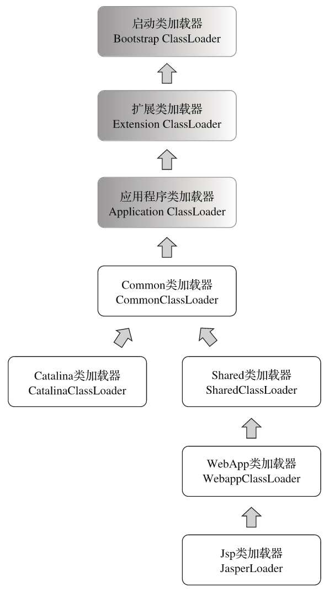

# 第 9 章 类加载及执行子系统的案例与实战

　　代码编译的结果从本地机器码转变为字节码，是存储格式发展的一小步，却是编程语言发展的一大步。

## 9.1 概述

　　Class 文件格式与执行引擎部分里，用户的程序能直接参与的内容并不太多，Class 文件以何种格式存储，类型何时加载、如何连接，以及虚拟机如何执行字节码指令等都是由虚拟机直接控制的行为，用户程序无法对其进行改变。能通过程序进行操作的，主要是字节码生成与类加载器这两部分的功能。

## 9.2 案例分析

### 9.2.1 Tomcat：正统的类加载器架构

　　一个功能健全的 Web 服务器，都要解决如下的这些问题：

* 部署在同一个服务器上的两个 Web 应用程序所使用的 Java 类库可以实现相互隔离。

  这是最基本的需求，两个不同的应用程序可能会依赖同一个第三方类库的不同版本，不能要求每个类库在一个服务器中只能有一份，服务器应当能够保证两个独立应用程序的类库可以互相独立使用。

* 部署在同一个服务器上的两个 Web 应用程序所使用的 Java 类库可以互相共享。

  如果类库不能共享，虚拟机的方法区就会很容易出现过度膨胀的风险。

* 服务器需要尽可能地保证自身的安全不受部署的 Web 应用程序影响。

  目前，有许多主流的 Java Web 服务器自身也是使用 Java 语言来实现的。因此服务器本身也有类库依赖的问题，一般来说，基于安全考虑，服务器所使用的类库应该与应用程序的类库互相独立。

* 支持 JSP 应用的 Web 服务器，十有八九都需要支持 HotSwap 功能。

   JSP 文件最终要被编译成 Java 的 Class 文件才能被虚拟机执行，但 JSP 文件由于其纯文本存储的特性，被运行时修改的概率远大于第三方类库或程序自己的 Class 文件。而且 ASP、PHP 和 JSP 这些网页应用也把修改后无须重启作为一个很大的 “ 优势 ” 来看待，因此 “ 主流 ” 的 Web 服务器都会支持 JSP 生成类的热替换，当然也有 “ 非主流 ” 的，如运行在生产模式（Production Mode）下的 WebLogic 服务器默认就不会处理 JSP 文件的变化。

　　由于存在上述问题，在部署 Web 应用时，单独的一个 ClassPath 就不能满足需求了，所以各种 Web 服务器都不约而同地提供了好几个有着不同含义的 ClassPath 路径供用户存放第三方类库，这些路径一般会以 “ lib ” 或 “ classes ” 命名。

　　被放置到不同路径中的类库，具备不同的访问范围和服务对象，通常每一个目录都会有一个相应的自定义类加载器去加载放置在里面的 Java 类库。

　　在 Tomcat 目录结构中，可以设置 3 组目录（/common/ *、/server/ * 和 /shared/ * ，但默认不一定是开放的，可能只有 /lib/ * 目录存在）用于存放 Java 类库，另外还应该加上 Web 应用程序自身的 “ /WEB-INF/* ” 目录，一共 4 组。把 Java 类库放置在这 4 组目录中，每一组都有独立的含义，分别是：

* 放置在 /common 目录中。类库可被 Tomcat 和所有的 Web 应用程序共同使用。
*  放置在 /server 目录中。类库可被 Tomcat 使用，对所有的 Web 应用程序都不可见。
*  放置在 /shared 目录中。类库可被所有的 Web 应用程序共同使用，但对 Tomcat 自己不可见。
*  放置在 /WebApp/WEB-INF 目录中。类库仅仅可以被该 Web 应用程序使用，对 Tomcat 和其他 Web 应用程序都不可见。

　　为了支持这套目录结构，并对目录里面的类库进行加载和隔离，Tomcat 自定义了多个类加载器，这些类加载器按照经典的双亲委派模型来实现，其关系如下图所示：

 

 

　　灰色背景的 3 个类加载器是 JDK（以 JDK 9 之前经典的三层类加载器为例）默认提供的类加载器，Common 类加载器、Catalina 类加载器（也称为 Server 类加载器）、Shared 类加载器和Webapp 类加载器则是 Tomcat 自己定义的类加载器，它们分别加载 /common/ * 、/server/ * 、/shared/ * 和 /WebApp/WEB-INF/ * 中的 Java 类库。其中 WebApp 类加载器和 JSP 类加载器通常还会存在多个实例，每一个 Web 应用程序对应一个 WebApp 类加载器，每一个 JSP 文件对应一个 JasperLoader 类加载器。

　　Common 类加载器能加载的类都可以被 Catalina 类加载器和 Shared 类加载器使用，而 Catalina 类加载器和 Shared 类加载器自己能加载的类则与对方相互隔离。WebApp 类加载器可以使用 Shared 类加载器加载到的类，但各个 WebApp 类加载器实例之间相互隔离。而JasperLoader 的加载范围仅仅是这个 JSP 文件所编译出来的那一个 Class 文件，它存在的目的就是为了被丢弃：当服务器检测到 JSP 文件被修改时，会替换掉目前的 JasperLoader 的实例，并通过再建立一个新的 JSP 类加载器来实现 JSP 文件的 HotSwap 功能。

　　上面的类加载结构在 Tomcat 6 以前是它默认的类加载器结构，在 Tomcat 6 及之后的版本简化了默认的目录结构，只有指定了 tomcat/conf/catalina.properties 配置文件的 server.loader 和 share.loader 项后才会真正建立 Catalina 类加载器和 Shared 类加载器的实例，否则会用到这两个类加载器的地方都会用 Common 类加载器的实例代替，而默认的配置文件中并没有设置这两个 loader 项，所以 Tomcat 6 之后也顺理成章地把 /common、/server 和 /shared 这 3 个目录默认合并到一起变成 1 个 /lib 目录，这个目录里的类库相当于以前 /common 目录中类库的作用，是 Tomcat 的开发团队为了简化大多数的部署场景所做的一项易用性改进。

　　如果默认设置不能满足需要，用户可以通过修改配置文件指定 server.loader 和 share.loader 的方式重新启用原来完整的加载器架构。

### 9.2.2 OSGi：灵活的类加载器架构

　　在今天，通常引入 OSGi 的主要理由是基于 OSGi 架构的程序很可能（只是很可能，并不是一定会，需要考虑热插拔后的内存管理、上下文状态维护问题等复杂因素）会实现模块级的热插拔功能，当程序升级更新或调试除错时，可以只停用、重新安装然后启用程序的其中一部分，这对大型软件、企业级程序开发来说是一个非常有诱惑力的特性，譬如 Eclipse 中安装、卸载、更新插件而不需要重启动，就使用到了这种特性。

　　OSGi 之所以能有上述诱人的特点，必须要归功于它灵活的类加载器架构。OSGi 的 Bundle 类加载器之间只有规则，没有固定的委派关系。

　　在不涉及某个具体的 Package 时，各个 Bundle 加载器都是平级的关系，只有具体使用到某个 Package 和 Class 的时候，才会根据 Package 导入导出定义来构造 Bundle 间的委派和依赖。

　　另外，一个 Bundle 类加载器为其他 Bundle 提供服务时，会根据 Export-Package 列表严格控制访问范围。如果一个类存在于 Bundle 的类库中但是没有被 Export，那么这个 Bundle 的类加载器能找到这个类，但不会提供给其他 Bundle 使用，而且 OSGi 框架也不会把其他 Bundle 的类加载请求分配给这个 Bundle 来处理。

　　一般来说，在 OSGi 里，类加载时可能进行的查找规则如下：

* 以 java.* 开头的类，委派给父类加载器加载。 
* 否则，委派列表名单内的类，委派给父类加载器加载。 
* 否则，Import 列表中的类，委派给 Export 这个类的 Bundle 的类加载器加载。 
* 否则，查找当前 Bundle 的 Classpath，使用自己的类加载器加载。 
* 否则，查找是否在自己的 Fragment Bundle 中，如果是则委派给 Fragment Bundle 的类加载器加载。 
* 否则，查找 Dynamic Import 列表的 Bundle，委派给对应 Bundle 的类加载器加载。
* 否则，类查找失败。

　　在 OSGi 中，加载器之间的关系不再是双亲委派模型的树形结构，而是已经进一步发展成一种更为复杂的、运行时才能确定的网状结构。这种网状的类加载器架构在带来更优秀的灵活性的同时，也可能会产生许多新的隐患。当两个加载器都在等待对方处理自己的请求，而对方处理完之前自己又一直处于同步锁定的状态，因此它们就互相死锁，永远无法完成加载请求了。

　　在 JDK 7 时才终于出现了 JDK 层面的解决方案，类加载器架构进行了一次专门的升级，在 ClassLoader 中增加了 registerAsParallelCapable 方法对可并行的类加载进行注册声明，把锁的级别从 ClassLoader 对象本身，降低为要加载的类名这个级别，目的是从底层避免以上这类死锁出现的可能。

　　总体来说，OSGi 描绘了一个很美好的模块化开发的目标，而且定义了实现这个目标所需的各种服务，同时也有成熟框架对其提供实现支持。对于单个虚拟机下的应用，从开发初期就建立在 OSGi 上是一个很不错的选择，这样便于约束依赖。但并非所有的应用都适合采用 OSGi 作为基础架构，OSGi 在提供强大功能的同时，也引入了额外而且非常高的复杂度，带来了额外的风险。

 ### 9.2.3 字节码生成技术与动态代理的实现

　　动态代理中所说的 “ 动态 ” ，是针对使用 Java 代码实际编写了代理类的 “ 静态 ” 代理而言的，它的优势不在于省去了编写代理类那一点编码工作量，而是实现了可以在原始类和接口还未知的时候，就确定代理类的代理行为，当代理类与原始类脱离直接联系后，就可以很灵活地重用于不同的应用场景之中。

　　代理类的实现代码为传入接口中的每一个方法，以及从 java.lang.Object 中继承来的equals()、hashCode()、toString() 方法都生成了对应的实现，并且统一调用了 InvocationHandler 对象的 invoke() 方法来实现这些方法的内容，各个方法的区别不过是传入的参数和 Method 对象有所不同而已，所以无论调用动态代理的哪一个方法，实际上都是在执行 InvocationHandler::invoke() 中的代理逻辑。

　　产生代理类 “ $Proxy0.class ” 的字节码的，大致的生成过程其实就是根据 Class 文件的格式规范去拼装字节码，但是在实际开发中，以字节为单位直接拼装出字节码的应用场合很少见，这种生成方式也只能产生一些高度模板化的代码。对于用户的程序代码来说，如果有要大量操作字节码的需求，还是使用封装好的字节码类库比较合适。

### 9.2.4 Backport 工具：Java 的时光机器

　　跨越 JDK 版本之间的沟壑，把高版本 JDK 中编写的代码放到低版本 JDK 环境中去部署使用。为了解决这个问题，一种名为 “ Java 逆向移植 ” 的工具（Java Backporting Tools）应运而生，Retrotranslator 和 Retrolambda 是这类工具中的杰出代表。

　　Retrotranslator 的作用是将 JDK 5 编译出来的 Class 文件转变为可以在 JDK 1.4 或 1.3 上部署的版本，它能很好地支持自动装箱、泛型、动态注解、枚举、变长参数、遍历循环、静态导入这些语法特性，甚至还可以支持 JDK 5 中新增的集合改进、并发包及对泛型、注解等的反射操作。

　　Retrolambda 的作用与 Retrotranslator 是类似的，目标是将 JDK 8 的 Lambda 表达式和 try-resources 语法转变为可以在 JDK 5、JDK 6、JDK 7 中使用的形式，同时也对接口默认方法提供了有限度的支持。

　　JDK 的每次升级新增的功能大致可以分为以下五类：

1. 对 Java 类库 API 的代码增强。

   譬如 JDK 1.2 时代引入的 java.util.Collections 等一系列集合类，在 JDK 5 时代引入的java.util.concurrent 并发包、在 JDK 7 时引入的 java.lang.invoke 包，等等。

2. 在前端编译器层面做的改进。

   这种改进被称作语法糖，如自动装箱拆箱，实际上就是 Javac 编译器在程序中使用到包装对象的地方自动插入了很多 Integer.valueOf()、Float.valueOf() 之类的代码；变长参数在编译之后就被自动转化成了一个数组来完成参数传递；泛型的信息则在编译阶段就已经被擦除掉了（但是在元数据中还保留着），相应的地方被编译器自动插入了类型转换代码。

3. 需要在字节码中进行支持的改动。如 JDK 7 里面新加入的语法特性——动态语言支持，就需要在虚拟机中新增一条 invokedynamic 字节码指令来实现相关的调用功能。不过字节码指令集一直处于相对稳定的状态，这种要在字节码层面直接进行的改动是比较少见的。

4. 需要在 JDK 整体结构层面进行支持的改进，典型的如 JDK 9 时引入的 Java 模块化系统，它就涉及了 JDK 结构、Java 语法、类加载和连接过程、Java 虚拟机等多个层面。

5. 集中在虚拟机内部的改进。如 JDK 5 中实现的 JSR-133 规范重新定义的 Java 内存模型（Java Memory Model，JMM），以及在 JDK 7、JDK 11、JDK 12 中新增的 G1、ZGC 和 Shenandoah 收集器之类的改动，这种改动对于程序员编写代码基本是透明的，只会在程序运行时产生影响。

　　上述的 5 类新功能中，逆向移植工具能比较完美地模拟了前两类，从第 3 类开始就逐步深入地涉及了直接在虚拟机内部实现的改进了，这些功能一般要么是逆向移植工具完全无能为力，要么是不能完整地或者在比较良好的运行效率上完成全部模拟。

　　在能够较好模拟的前两类功能中，第一类模拟相对更容易实现一些，如 JDK 5 引入的 java.util.concurrent 包，实际是由多线程编程的大师 Doug Lea 开发的一套并发包，在 JDK 5 出现之前就已经存在（那时候名字叫作 dl.util.concurrent，引入 JDK 时由作者和 JDK 开发团队共同进行了一些改进），所以要在旧的 JDK 中支持这部分功能，以独立类库的方式便可实现。Retrotranslator 中就附带了一个名叫 “ backport-util-concurrent.jar ” 的类库（由另一个名为 “ Backport to JSR 166 ” 的项目所提供）来代替 JDK 5 的并发包。

　　至于第二类 JDK 在编译阶段进行处理的那些改进，Retrotranslator 则是使用 ASM 框架直接对字节码进行处理。由于组成 Class 文件的字节码指令数量并没有改变，所以无论是 JDK 1.3、JDK 1.4 还是 JDK 5，能用字节码表达的语义范围应该是一致的。当然，肯定不会是简单地把 Class 的文件版本号从 49.0 改回 48.0 就能解决问题了，虽然字节码指令的数量没有变化，但是元数据信息和一些语法支持的内容还是要做相应的修改。

　　Retrotranslator 对枚举所做的主要处理就是把枚举类的父类从 “ java.lang.Enum ” 替换为它运行时类库中包含的 “ net.sf.retrotranslator.runtime.java.lang.Enum_ ”，然后再在类和字段的访问标志中抹去 ACC_ENUM 标志位。当然，这只是处理的总体思路，具体的实现要比上面说的复杂得多。可以想象既然两个父类实现都不一样，values() 和 valueOf() 的方法自然需要重写，常量池需要引入大量新的来自父类的符号引用，这些都是实现细节。

　　用 Retrolambda 模拟 JDK 8 的 Lambda 表达式属于涉及字节码改动的第三类情况，Java 为支持 Lambda 会用到新的 invokedynamic 字节码指令，但幸好这并不是必须的，只是基于效率的考量。

　　Retrolambda 的 Backport 过程实质上就是生成一组匿名内部类来代替 Lambda ，里面会做一些优化措施，譬如采用单例来保证无状态的 Lambda 表达式不会重复创建匿名类的对象。有一些 JavaIDE 工具，如 IntelliJ IDEA 和 Eclipse 里会包含将此过程反过来使用的功能特性，在低版本 Java 里把匿名内部类显示成 Lambda 语法的样子，实际存在磁盘上的源码还是匿名内部类形式的，只是在 IDE 里可以把它显示为 Lambda 表达式的语法，让人阅读起来比较简洁而已。

## 9.3 实战：自己动手实现远程执行功能

　　场景：排查问题的过程中，想查看内存中的一些参数值，却苦于没有方法把这些值输出到界面或日志中。又或者定位到某个缓存数据有问题，由于缺少缓存的统一管理界面，不得不重启服务才能清理掉这个缓存。类似的需求有一个共同的特点，那就是只要在服务中执行一小段程序代码，就可以定位或排除问题，但就是偏偏找不到可以让服务器执行临时代码的途径，

　　这是项目运维中的常见问题，通常解决类问题有以下几种途径：

1. 可以使用 BTrace 这类 JVMTI 工具去动态修改程序中某一部分的运行代码，类似的 JVMTI 工具还有阿里巴巴的 Arthas 等。
2. 使用 JDK 6 之后提供了 Compiler API，可以动态地编译 Java 程序，这样虽然达不到动态语言的灵活度，但让服务器执行临时代码的需求是可以得到解决的。
3. 也可以通过 “ 曲线救国 ” 的方式来做到，譬如写一个 JSP 文件上传到服务器，然后在浏览器中运行它，或者在服务端程序中加入一个 BeanShell Script、JavaScript 等的执行引擎（如MozillaRhino ）去执行动态脚本。
4. 在应用程序中内置动态执行的功能。

 ### 9.3.1 目标

　　希望最终的产品是这样的：

* 不依赖某个 JDK 版本才加入的特性（包括 JVMTI），能在目前还被普遍使用的 JDK 中部署，只要是使用 JDK 1.4 以上的 JDK 都可以运行。
* 不改变原有服务端程序的部署，不依赖任何第三方类库。
* 不侵入原有程序，即无须改动原程序的任何代码。也不会对原有程序的运行带来任何影响。
* 考虑到 BeanShell Script 或 JavaScript 等脚本与 Java 对象交互起来不太方便，“ 临时代码 ” 应该直接支持 Java 语言。
* “ 临时代码 ” 应当具备足够的自由度，不需要依赖特定的类或实现特定的接口。这里写的是 “ 不需要 ” 而不是 “ 不可以 ”，当 “ 临时代码 ” 需要引用其他类库时也没有限制，只要服务端程序能使用的类型和接口，临时代码都应当能直接引用。
* “ 临时代码 ” 的执行结果能返回到客户端，执行结果可以包括程序中输出的信息及抛出的异常等。

### 9.3.2 思路

　　在程序实现的过程中，我们需要解决以下 3 个问题：

* 如何编译提交到服务器的 Java 代码？
* 如何执行编译之后的 Java 代码？
* 如何收集 Java 代码的执行结果？

　　对于第一个问题，我们有两种方案可以选择：

1. 一种在服务器上编译，在 JDK 6 以后可以使用 Compiler API，在 JDK 6 以前可以使用 tools.jar包（在 JAVA_HOME/lib 目录下）中的 com.sun.tools.Javac.Main 类来编译 Java 文件，它们其实和直接使用 Javac 命令来编译是一样的。

   这种思路的缺点是引入了额外的依赖，而且把程序绑死在特定的 JDK 上了，要部署到其他公司的 JDK 中还得把 tools.jar 带上（虽然 JRockit 和 J9 虚拟机也有这个 JAR 包，但它总不是标准所规定必须存在的）。

2. 另外一种思路是直接在客户端编译好，把字节码而不是 Java 代码传到服务端。

　　对于第二个问题：要执行编译后的 Java 代码，让类加载器加载这个类生成一个 Class 对象，然后反射调用一下某个方法就可以了。

　　最后一个问题，直接在执行的类中把对 System.out 的符号引用替换为准备的 PrintStream 的符号引用。

 ### 9.3.3 实现

　　第一个类用于实现 “ 同一个类的代码可以被多次加载 ” 这个需求，即用于解决 9.2 节列举的第二个问题的 HotSwapClassLoader 。

　　HotSwapClassLoader 所做的事情仅仅是公开父类（即 java.lang.ClassLoader ）中的 protected 方法 defineClass()，将会使用这个方法把提交执行的 Java 类的 byte[] 数组转变为 Class 对象。HotSwapClassLoader 中并没有重写 loadClass() 或 findClass() 方法，因此如果不算外部手工调用 loadByte() 方法的话，这个类加载器的类查找范围与它的父类加载器是完全一致的，在被虚拟机调用时，它会按照双亲委派模型交给父类加载。构造函数中指定为加载 HotSwapClassLoader 类的类加载器作为父类加载器，这一步是实现提交的执行代码可以访问服务端引用类库的关键。

　　第二个类是实现将 java.lang.System 替换为自己定义的 HackSystem 类的过程，它直接修改符合 Class 文件格式的 byte[] 数组中的常量池部分，将常量池中指定内容的 CONSTANT_Utf8_info 常量替换为新的字符串。ClassModifier 中涉及对 byte[] 数组操作的部分，主要是将 byte[] 与 int 和 String 互相转换，以及把对 byte[] 数据的替换操作封装在 ByteUtils 中。

　　经过 ClassModifier 处理后的 byte[] 数组才会传给 HotSwapClassLoader.loadByte() 方法进行类加载，byte[] 数组在这里替换符号引用之后，与客户端直接在 Java 代码中引用 HackSystem 类再编译生成的 Class 是完全一样的。这样的实现既避免了客户端编写临时执行代码时要依赖特定的类（不然无法引入 HackSystem ），又避免了服务端修改标准输出后影响到其他程序的输出。

　　最后一个类就是用来代替 java.lang.System 的 HackSystem 。除了把 out 和 err 两个静态变量改成使用 ByteArrayOutputStream 作为打印目标的同一个 PrintStream 对象，以及增加了读取、清理 ByteArrayOutputStream 中内容的 getBufferString() 和 clearBuffer() 方法外，其余的方法全部都来自于 System 类的 public 方法，方法名字、参数、返回值都完全一样，并且实现也是直接转调了 System 类的对应方法而已。保留这些方法的目的，是为了在 Sytem 被替换成 HackSystem 之后，保证执行代码中调用的 System 的其余方法仍然可以继续使用。

　　最后一个类 JavaclassExecuter，它是提供给外部调用的入口，调用前面几个支持类组装逻辑，完成类加载工作。JavaclassExecuter 只有一个execute() 方法，用输入的符合 Class 文件格式的 byte[] 数组替换掉 java.lang.System 的符号引用后，使用 HotSwapClassLoader 加载生成一个 Class 对象，由于每次执行 execute() 方法都会生成一个新的类加载器实例，因此同一个类可以实现重复加载。然后反射调用这个 Class 对象的 main() 方法，如果期间出现任何异常，将异常信息打印到 HackSystem.out 中，最后把缓冲区中的信息作为方法的结果来返回。

## 9.4 本章小结

　　第 6 章至第 9 章介绍了 Class 文件格式、类加载及虚拟机执行引擎这几部分内容，这些内容是虚拟机中必不可少的组成部分，了解了虚拟机如何执行程序，才能更好地理解怎样才能写出优秀的代码。

