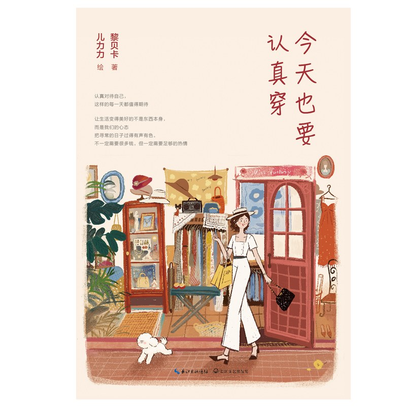

# 今天也要认真穿

# 简介

　　豆瓣评分：6.1

## 内容简介（来自豆瓣）

​		这是一本写给每个你的生活小书，关于活成更好的自己，其实是一道任意选择题，而今天也要认真穿是这道选择题的最佳答案，因为这是最容易实现的成长。

​		作者在这本书中讲述了关于穿搭、职场、生活、情绪、物品等多方面内容，全书包括衣帽间的秘密、心爱的物品、买买买这件小事以及时尚博主的日常四个部分，作者以更真诚的方式、更深度的思考，审视生活、审视自我、审视我们与周围一切的关系。

​		有一路走来光彩背后的辛苦，也有日常生活中的小欢喜，亦有关于活成更好的自己的态度。

​		全书包含 70 余幅温暖治愈的插画，画师儿力力用细腻的笔触描绘出美好生活的本意。

​		愿我们都能在这本书中找到属于自己的最好的模样。

## 目录

* 第一章 衣帽间的秘密
  1. 高级定制
  2. 消失的迷你裙
  3. 怎样找到自己的风格
  4. 看到就很开心的裙子
  5. 我的核心单品
  6. 理想生活从白衬衫开始
  7. 白衬衫穿得好看的秘密
  8. 比拥抱更暖，比亲吻更软
  9. 一条等瘦了就能穿下的牛仔裤
  10. 提高衣服利用率最有效的办法
  11. 身材管理
  12. 家居服也要美
  13. 一点新一点旧
  14. 高跟鞋
  15. 风格偶像
  16. 今天也要认真穿
* 第二章 心爱的东西
  1. 心爱的东西之于我们
  2. 手表的审美
  3. 24 小时都戴的首饰
  4. 香味的魔力
  5. 一点光一点热一点香气，日子总会过得去
  6. 每天都坚持做的小事
  7. 润唇膏
  8. 一支口红的快乐
  9. 礼物
  10. 夏日饮品一番
  11. 柠檬树
  12. 手账是一种生活方式
  13. 鲜花永远让人心情愉快
  14. 住得舒服是一件太重要的事
  15. 住得舒服的标准
  16. 家是生活的博物馆
  17. 旋转木马情结
  18. 香水到底涂在哪里
* 第三章 买买买这件小事
  1. 买包最快乐的时刻
  2. 关于包包的浪漫故事
  3. 自己给自己买钻石
  4. 购物的甜蜜点
  5. 永远也走不到的世界尽头
  6. 奢侈的反义词
  7. 我的怪癖
  8. 买买买和断舍离
  9. 我爱这花花世界
  10. 我的购物原则
  11. 鞋子里的一粒沙子
  12. A Bad Hair Day
  13. Guilty Pleasure
* 第四章 时尚博主的日常
  1. 红毯短跑选手
  2. 戛纳的美好回忆
  3. After Party
  4. 奔波途中也要认真生活
  5. 出差的日常
  6. 做加法的生活
  7. 很累的时候
  8. 梦
  9. 亲密关系
  10. 夏天
  11. 冬天
  12. 艰难的一年
  13. 真实的生活

# 摘录

* 成长是个不断发现自我、寻找自我的漫长过程。而在这个过程中，有时候衣服比我们更了解自己。

* 怎样找到自己的风格

  从你的穿衣习惯里寻找线索

  1. 不管你的衣柜里有多少种款式的衣服，总有一些衣服是你一直反复穿的；

  2. 找出你不常穿但却打心眼儿里喜欢的衣服，这些衣服能让你看出自己潜意识里喜欢什么样的风格；

  3. 回忆一下之前的搭配，在男女朋友中好评率最高的是哪些；

  4. 找出那些穿上去以后让你更自信的衣服。

     了解自己的身材，比避短更重要的是扬长。

* 在别人看不到的地方也要精致，才是真精致。因为一个人独处时的状态才能真正代表我们对自己的态度。

* 总结一下我衣柜里利用率最高的反复穿搭的单品吧，给大家做个参考：
  白衬衫、白T恤、条纹衫、真丝背心、连衣裙、黑色紧身裤、阔腿裤、牛仔短裙、纱裙、羊绒衫、小西装、风衣、牛仔外套、机车皮衣、羊绒大衣。

* 用心对待自己，相信自己值得被尊重和呵护，才能感受到来自生活的美意。

* 推荐香水单品：dipt ique的橙花、欧珑的赤霞橙光、爱马仕尼罗河花园、纳西素f or her。

* 坚持比用什么产品都重要。

* 以下五个润唇膏是我回购了 N 次的：
  * Dior变色润唇膏
  * Lamer润唇膏
  * 日本淡唇纹润唇膏
  * 资生堂防口角炎唇膏
  * 木瓜膏

* 时间是不可逆的，我们度过的每一分每一秒都不能重来，而每一刻的时光和那一刻的自己，都值得我们好好对待。

* 东西不再随便买，但也绝不愿意将就，买了就会一直用下去。宁愿买的时候肉痛一点，但知道它们会陪伴我很长时间，就觉得很值。

* 到我们和物品的关系里一样适用。—— 留下什么，我们就是什么样的人。

# 感想

​		虽然是一本闲书，但是我还是在上下班的地铁上看完了这本书，自认不是一个精致的女孩，但是也觉得能做到精致的女孩超棒的，也要好好的对待生活的每一天。

​		感觉书里的 “时间是不可逆的，我们度过的每一分每一秒都不能重来，而每一刻的时光和那一刻的自己，都值得我们好好对待。”这句话非常好，真的是过一天少一天，要珍惜每一天。