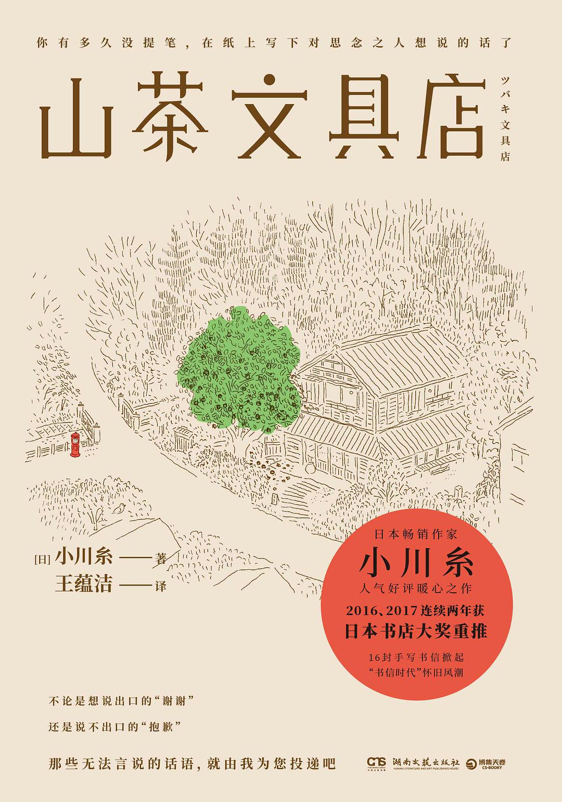

# 山茶文具店

# 简介

　　豆瓣评分：8.3

## 内容简介（来自豆瓣）

​		★ 日本全国 700 多家书店店员投票选出的最想卖的书！ 2016、2017 连续两年获日本 “ 书店大奖 ” 重推！

​		★ 日本畅销作家小川糸备受好评暖心之作。16 封手写书信，掀起 “ 书信时代 ” 怀旧风潮。

​		★ 一封封有温度的信，一个个有故事的人生。执笔写下说不出的话，与思念之人见字如面

​		★ 随书附带精美手绘镰仓游览导图

​		…………

​		在镰仓，有一家帮人代笔的文具店，每代店主均由女性担任，只要有委托便会接受，即使是餐厅的菜单也会帮忙。

​		不知不觉间，雨宫鸠子成为了第 11 代传人，而与外祖母之间的误会，以及开始独自一人活在世上的恐惧，使她充满迷茫。给死去宠物的吊唁信、宣布离婚的公告信、拒绝借钱的回绝信、写给挚友的分手信……

​		一封封代笔信是客人们的写实生活，也是一节节人生的课堂。

## 目录

* 扉页
* 版权信息
* 插图

* 夏

* 秋

* 冬

* 春

# 摘录

## 夏

​		信封是一封信的体面，所以必须写得特别仔细优美，字迹清晰。

​		即使写得一手靓字，如果别人完全看不懂，就无法称得上是精粹，反而会变成一种庸俗。

​		泪腺仿佛变成了磁铁，瞬间吸收了世界上所有的悲伤。其中也包括小时候养的金鱼翻肚死去时的哀伤，以及寿司子姨婆去世时的悲恸。

​		好邻居，就是即使没有事先约好，也能视当时的气氛，轻松地临时相约出门。

​		吃饭各自付钱，是邻居之间维持良好关系的秘诀。

​		听说睡觉是克服酷热的防卫本能，所以我放任睡魔恣意作乱。

​		也许有人很擅长自己做，会带亲手制作的糕点；但是，买来的糕点难道就无法表达诚意吗？

​		即使曾经共度这么美好的时光，仍然因为人生的一点恶作剧，让两个原本誓言相守终生的夫妻就这样分道扬镳。

​		我把鼻子凑了过去，闻到酸酸甜甜，却无法一言以蔽之的复杂亚洲风味。我拿起不怎么顺手的塑料筷子把面夹了起来，热气顿时像是跳舞般扩散。脆脆的油炸花生成为完美的点缀，整体感觉很好吃。

## 秋

​		他平静而稳重的说话声，就像美丽山丘上吹过的一丝微风。

​		蜻蜓在雨后迎来黄昏的天空中飞舞，薄如玻璃的翅膀在夕阳下闪着光

​		吾唯知足。这句话劝人认清自我、知足常乐。

​		日文书信开头写的 “ 拜启 ” 这两个字，是 “ 带着恭谦的态度向您报告 ” 的意思。以这两个字开头的信，要用 “ 敬具 ” 结尾，也就是代表 “ 以恭谨的心向您报告以上这些事 ”。如果要表达更恭敬的礼节，就要以 “ 谨启 ” 为开头，以 “ 敬白 ” 来结尾。总而言之，这就像行礼一样。行礼可分为真、行、草不同等级，书信的起首和结尾，也要配合不同的礼仪程度，使用不同的起首语和结语。

​		但是，在书信中若用汉文开头，又以汉文结尾，会让人感觉太严肃，所以女性可以在起首用结合平假名的方式写 “ 容我写信叨扰 ”，并以 “ 顿首 ” 或是 “ 草草顿首 ” 为结尾。“ 顿首 ” 表示 “ 顿首再拜 ”，也就是 “ 行笔至此，恕我失礼 ” 之意。写回信时，“ 敬悉尊函 ” 或是 “ 欣悉惠书 ”，也能够发挥起首语的作用，通常也都用 “ 顿首 ” 或是 “ 草草顿首 ” 为结尾。“ 草草 ” 是 “ 粗率、简陋、简略 ” 之意，带有 “ 姑且容我就此搁笔 ” 的意思。女性写信时，无论使用什么起首语，都要用 “ 顿首 ” 或是 “ 草草顿首 ” 为结尾。

​		如果省略时令问候语，直接进入主题的话，则要写 “ 前略”。如果是女性写信，则可以用 “ 恕我省略寒暄 ” “ 容我省略应酬语 ” 等稍微温和的方式表达，增加温柔的印象。以 “ 前略 ” 作为起首语时，要用 “ 不一 ” 为结尾，代表 “ 言犹未尽 ” 之意。为自己的字迹潦草道歉时，可以用 “ 匆匆 ” 结束。“ 前略 ” 有点像我们在遇到很熟识的朋友，轻松打招呼时说的 “ 嘿 ” 或 “ 哟 ”。

​		有关书信的繁复规矩，通常都集中在起首和结尾两大部分。

​		正文的部分，对于对方的称谓和对方家属的敬称，都要做到 “ 抬举对方 ”。当对方的名字来到行末时，可以稍加调整，在名字前空一格、换行再写，好让对方的名字出现在行首。相反地，提到 “ 我 ” 和自己的家人时要谦逊，应尽可能出现在行末。

​		话虽如此，但这些只是基本的规定…… 如果太在意这些规定，书信内容就会变得拘谨僵硬、生硬呆板。写信就像人际往来，只要尊敬对方、体贴对方、注重礼节，就会自然而然呈现这样的结果。就结论来说，书信没有所谓的正确或错误。

​		久违的鳗鱼让全身细胞都发出欢喜的呐喊。 

​		立如芍药，坐如牡丹，行如百合。

​		漂亮的字并非只追求外形漂亮，必须有温度、有微笑、有安稳、有平静。 

​		写字的行为就像生理现象，无论自己多想写出漂亮的字，无法如愿时就是无法如愿。即使痛苦得满地打滚，写不出来就是写不出来。文字就是这样的怪物。

## 冬

​		始终找不到一个刚好可以卡进心灵缝隙的词语。

​		当我思考这些事时，风从大海的方向吹来，刘海儿好像在跳华尔兹。

​		带着一丝暖意的风就像透明的输送带，只带来美好的事物。

​		每个字都喷溅出名为爱情的汁液，而且至今依然润泽，仍未枯竭。

​		陷入瓶颈的痛苦有点像便秘。很想排泄，却排不出来；虽然有必须排出体外的东西，却无法顺利获得解放。这种感觉令人懊恼，也很悲惨。

​		朝阳从走廊的窗户洒进屋内。当——强烈的阳光似乎发出了华丽的声响，闪亮到几乎令人晕眩，就连在空气中飞舞的灰尘也很美。 

​		这个世界也许就是这么一回事。只要有缘分的人互相协助、彼此扶持，即使与有血缘关系的家人关系不睦，也能获得他人的支持。

## 春 

​		这几天突然有了春天的味道，麻雀在窗外热闹地谈笑。

​		樱花可能快开了，天空带着淡淡的粉红色，露出了微笑。

​		蓝天中有一条好像用尺画出来的笔直飞机云。

​		美丽的银色头发好像蜘蛛丝似的。 

​		与其苦苦追寻失去的东西，还不如好好珍惜自己眼前拥有的东西。

​		鸟儿热闹地叽叽喳喳，似乎啄着夜晚的余韵。

# 感想

　　这本书以一年四季为主线，很细致的描述了自己的日常生活，有代笔的工作、与邻居之间的相处、与好友的日常接触、也有对上代深深的思念，整本书充满了生活的美化与安逸。当然，作者也会有烦恼，夏天太热，有时候也会遇到不符合自己初衷的工作，也会严厉拒绝工作，但是最后都得到了完美的解决。而且有时也有小女生的小心思，比如在男爵用请吃饭代替代笔费用的时候，想着说不定吃饭花费可能更高，这种小心思突然就充满了可爱的感觉。最后慢慢理解上代对自己的期待与爱，也与上代和解，也算是和自己和解。

​		书中也介绍了书信的格式，没想到对于不同的人不同的情况，书信的信纸、墨水、笔、信封等都可以表达写信人的意思，当然信也是很重要的一部分，从称呼、问候、内容、结尾、字体都会代表写信人，但是现在很少写信了，都是微信、邮件来代替，所以也很少了解这些格式了。

​		这本书的文字充满了生活的气息，日子好像就是应该慢慢的过，处理遇到的工作，有空闲的时间和好友游玩，和慢慢理解家长，遇到的问题最后到得到解决。

