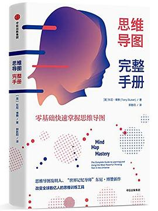
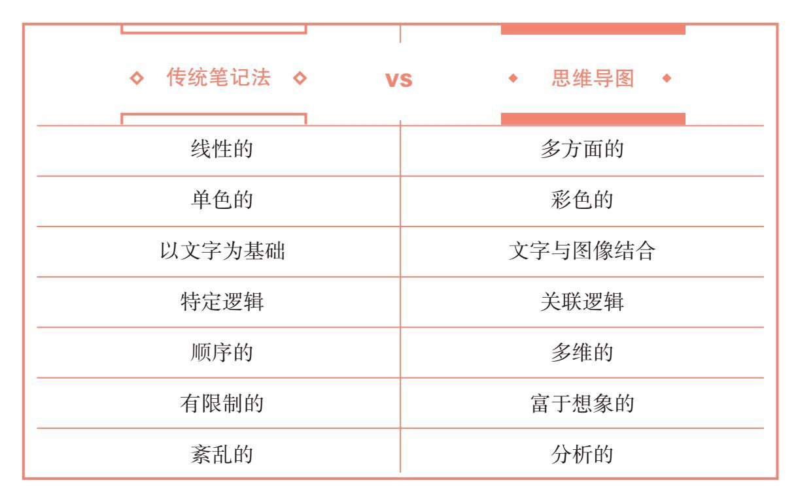

# 思维导图完整手册

# 简介

　　豆瓣评分：5.4

## 内容简介（来自豆瓣）

​		思维导图的概念由英国人东尼·博赞于 20 世纪 60 年代创造，曾用来帮助英国查尔斯王子提高记忆力。时至今日，牛津、剑桥、哈佛等名校早已将其纳入必修课，微软、IBM（国际商业机器公司）、迪士尼、花旗银行等大型企业不断地培训员工用思维导图工作。

​		《思维导图完整手册》是东尼·博赞 2018 年的集大成之作，他基于思维导图的设计初衷和发展乱象，为读者呈现了一个原汁原味的思维导图。作者分析了思维导图的 98 个应用场景和 3 个核心用法：

1. 如何用一个关键词头脑风暴
2. 如何整理、记忆信息
3. 如何关联、创造故事

​		书中还列举了来自各行各业的成功人士，以及他们如何用画图引导思考。作为博赞在中国的亲传弟子之一，刘艳亲自为本书解读，从沟通谈判、时间管理和古诗词背诵的角度，手把手教读者用轻松、高效的方式完成思考。

​		作为大脑和学习方面的世界专家，东尼·博赞已出版 100 多部作品，其 “ 思维导图 ” 系列作品被翻译成 35 种语言，遍布 200 多个国家，销量突破 1000 万册。

​		信息焦虑时代，人人都需要一个能分析信息和内化知识的思考工具。如果你正苦于思维混乱、表达缺乏逻辑、学习不得法，那么你应该来看看这本书。

## 目录

* 推荐序
* 前言
* 引言 改变人生的创新思维工具
  * 超实用新笔记法
  * 发散思维：天才的关系逻辑
  * 模仿大脑操作规律
  * “传统笔记法”vs“思维导图”
  * 风靡世界的思维导图
  * 如何使用这本书？

* 第一章 什么是思维导图？
  * 全脑思维升级训练
  * “ 三招七步 ” 构图法
  * 5 个法则轻松制图
  * 思维导图的思维简史
  * 视觉思维：高效决策的科学
  * 有效解决十大人生难题
  * 取之大脑，用之大脑

* 第二章 如何构建思维导图？
  * 不要陷入固化思维
  * 理解规律，遵循规律
  * 形成自我风格
  * 11 个步骤，从入门到精通
  * 高手必经的 3 个阶段
  * 图解思维导图六大应用
  * 掌控生活：轻松搞定日常琐事
  * 职场精英：商务问题的终结者
  * 超级学霸：建立自己的知识体系
  * 创意高手：打造丰富的幸福体验
  * 快乐人生：做自己的健康教练
  * 记忆大师：充分挖掘大脑潜能

* 第三章 如何识别真假思维导图？
  * 缪见和误解：关于思维的本质
  * 5 种盛行的伪思维导图
  * 聪明的大脑如何思考

* 第四章 给所有学习者的忠告
  * 坚持就是胜利
  * 学会提出好问题
  * 用简洁、有力的图像
  * 为观点留白
  * 善待杂乱
  * 种下迷你思维导图
  * 让重复来引导你
  * 摆脱犹豫不决
  * 坚持到底！
  * 用思维导图解决问题

* 第五章 跳出思考边框，创造无限可能
  * 一种直觉和逻辑工具
  * 多维思考：六大领域，98种应用
  * 规划高效率生活
  * 职场必备工作法
  * 非暴力沟通：寻找共同立场
  * 从认知自我到深度学习
  * 激发创作天赋
  * 对抗缺陷，掌控大脑
  * 过目不忘的记忆法

* 第六章 人工智能将统治思维导图？
  * 机器和算法无法取代
  * 未来掌握在你手中

* 参考资料与文献
* 致谢

# 摘录

* 思维导图是一个创新性的思维工具，一旦掌握它，你的人生将会被改变。它不仅能够帮助你处理信息、构思创意、增强记忆力，而且能够让你充分享受闲暇时光、改良工作方式。

* 可以用思维导图来解决任何问题，就这一点而言，它是擅长被用作分析的。通过运用关联逻辑，思维导图能够直指问题的核心，同时也让你有更全面的视角，它既是微观的，又是宏观的。

* 下表中对比了传统笔记法和思维导图的特点。

  

* 思维导图的魅力源于它的简单。表面上，它只是一幅绘制了信息的彩色图纸。然而，它却能有效地刺激大脑皮层的工作，通过调用善于逻辑分析的左脑和善于创造的右脑，激发全脑思维。

* 大脑通过左右分工的方式感知和处理现实：左脑支配言语和分析，右脑支配知觉和感知。

* 一幅合格的思维导图具备三个基本特征：

  * （1）**一幅中心图**，代表你要探究的中心主题。例如，要用思维导图计划一个项目，你可以在图的中心画一个文件夹的图像。画思维导图并不需要专业的绘画技巧。
  * （2）由中心图**延伸出的若干主干**。这些主干分别代表与中心主题相关的一级主题，要用不同的颜色呈现。进而由主干延伸出下一级分支 -- 如果喜欢，可以将它们叫做枝干，依次为二级、三级分支，代表相关联的二级、三级主题。
  * （3）每条分支上有**一幅关键图或一个关键词**。

* 因为思维导图需要左右脑同时工作，所以它是多功能的，能够被运用于所有的认知功能中，包括记忆、创建、学习和各种思维形式。

* 制作思维导图的 5 个法则

  * 发散性思维

    人类语言是大脑工作所使用的语言，它主要是通过想象和关联形成的，还需要未知的辅助（位置的重要性解释了为何在思维导图中，分支的位置能够促进你的记忆）。

    所有的口语和书面语都是美丽、有意义且充满活力的。然而，它们是二级语言或者子程序。由想象和关联形成的人类语言，才是我们人类的首要语言。

    人类语言可以具像化地表现出来。当它以最纯粹的形式表现出来时，就构成了一幅思维导图。

    让观点从核心概念发散出来 -- 思维导图提倡高度个性化的思维发散。思维导图的大三型结构更容易让人发现不同分支间的关系，也更容易让人产生新的关联以填补空白，以此激励我们更长久地进行创造性的思考。

  * 非线性的自然流动

    思维导图仿照的是脑细胞的无数神经元突触和连接，从而反映着我们自身被创造和连接的形式。

    思维导图正是借鉴了这些自然结构的灵感和效率，它的自然属性体现在自然弯曲的分支上，这种弯曲的形式比直线形式对大脑更有吸引力。

  * 颜色

    颜色与人的右脑相关联，而文字与支配理性的左脑相关联。因此，颜色和文字相结合就能使左右脑同时工作。

    颜色能够激发记忆力和创造力，让我们摆脱黑白两色单调的束缚。颜色赋予图像生命，让它们更吸引眼球；颜色能够激发我们去探讨，并影响我们与其他人进行沟通交流的方式。

    许多研究表明，熟练地使用颜色能够：引起注意、极大地加深理解、激发动力、鼓励热烈的交流、增进大脑对图像的处理和储存。

    颜色也可以作为一种代码。如果你在思维导图中用特定的颜色来画不同的区域和主题，就会在视觉上产生速记效果，使你更容易记住导图中的信息，并显著地提高你的记忆力。

    在思维导图中，通过运用颜色和图像使不同的分支从周围的背景中脱颖而出，同样可以产生冯·雷斯托夫效应，也叫作 “ 孤立效应 ”。

  * 图像

    与文字不同，图像更加直观：大脑处理视觉信息要比处理文字信息快 60000 倍。另外，图像能够激发想象，产生丰富的关联，并超越语言交流的限制。与颜色相同，图像能够激励左右脑协同作用，平衡发挥语言功能和视觉功能，还能充分发挥大脑皮层的其他功能，如形态、线条和纬度。

    为了使思维导图中的图像更有冲击力，就要把它们画得活波、多次、清晰。这样看起来会更有吸引力、更动人，也更令人难忘。

  * 文字

    真正的思维导图在每条分支上仅标注一个词语。因为单个词语比短语更有冲击力。每个词语都能够触发其特有的一系列关联，从而让人产生新的想法。相比之下，短语是固定的搭配，会局限在其复合含义当中，而不能开放式地自由关联，因此作用反而被削弱了。

    如果觉得必须使用短语的话，就把短语拆开，将每个词单独地写在不同的分支上，保证这些词能够自由地延伸出下一级的子分支 -- 但最好还是用单个词语。

    每条分支上的一个词语能够充分激发你的大脑对关键词的思考，并直指问题的核心。关键词就像一个钩子，能勾起你的记忆。

* 思维导图能够：

  * 让你思维清晰，能全方位考虑一个主题
  * 提供必要信息，让你提前计划
  * 让你全面审视形式
  * 作为一个巨大的信息库
  * 激发你的想象力，激励你寻找创造性的解决方案
  * 看起来充满乐趣

* （有效解决十大人生难题）

# 感想

　　是一本思维导图的工具书，主要讲了如何绘制思维导图和思维导图的用途。缺陷就是实例很少，比如说想要用思维导图去学习如何使用，阅读一本书用思维导图怎么用都没有，所以算是思维导图的概念书，实操性不强。

​		思维导图算是一种工具，工具还是要使用才有效，所以是要多使用思维导图才是最好的学习。

