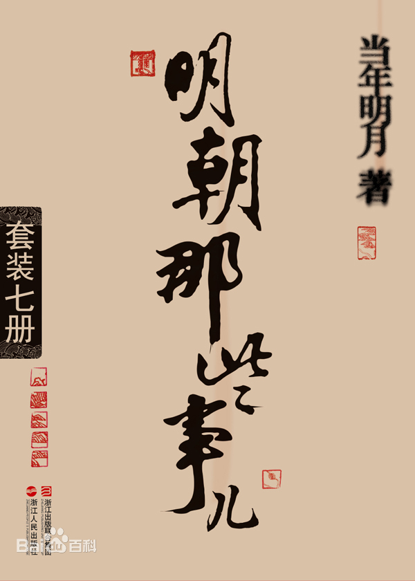

# 明朝那些事儿

# 简介

　　豆瓣评分：9.2

## 内容简介（来自豆瓣）

​		《明朝那些事儿》这篇文主要讲述的是从 1344 年到 1644 年这三百年间关于明朝的一些事情，以史料为基础，以年代和具体人物为主线，并加入了小说的笔法，对明朝十七帝和其他王公权贵和小人物的命运进行全景展示，尤其对官场政治、战争、帝王心术着墨最多，并加入对当时政治经济制度、人伦道德的演义。

## 目录

* 明朝那些事儿 1：洪武大帝
  * 前言
  * 引子
  * 第一章 童年
  * 第二章 灾难
  * 第三章 踏上征途
  * 第四章 就从这里起步
  * 第五章 储蓄资本
  * 第六章 霸业的开始
  * 第七章 可怕的对手
  * 第八章 可怕的陈友谅
  * 第九章 决战不可避免
  * 第十章 等待最好的时机
  * 第十一章 洪都的奇迹
  * 第十二章 鄱阳湖！决死战！
  * 第十三章 下一个目标，张士诚！
  * 第十四章 复仇
  * 第十五章 远征沙漠
  * 第十六章 建国
  * 第十七章 胡惟庸案件
  * 第十八章 扫除一切腐败者
  * 第十九章 冤案
  * 第二十章 最后的名将——蓝玉
  * 第二十一章 蓝玉的覆灭
  * 第二十二章 制度后的秘密
  * 第二十三章 终点，起点
  * 第二十四章 建文帝
  * 第二十五章 等待中的朱棣
  * 第二十六章 准备行动
  * 第二十七章 不得不反了！
  * 第二十八章 你死我活的战争
  * 第二十九章 朱棣的对手
  * 第三十章 离胜利只差一步
  * 第三十一章 殉国、疑团、残暴、软弱
* 明朝那些事儿 2：万国来朝
  * 第一章 帝王的烦恼
  * 第二章 帝王的荣耀
  * 第三章 帝王的抉择
  * 第四章 郑和之后，再无郑和
  * 第五章 纵横天下
  * 第六章 天子守国门！
  * 第七章 逆命者必剪除之！
  * 第八章 帝王的财产
  * 第九章 生死相搏
  * 第十章 最后的秘密
  * 第十一章 朱高炽的勇气和疑团
  * 第十二章 朱瞻基是个好同志
  * 第十三章 祸根
  * 第十四章 土木堡
  * 第十五章 力挽狂澜
  * 第十六章 决断！
  * 第十七章 信念
  * 第十八章 北京保卫战
  * 第十九章 囚徒朱祁镇
  * 第二十章 回家
  * 第二十一章 囚徒朱祁镇
  * 第二十二章 夺门
* 明朝那些事儿 3：妖孽宫廷
  * 第一章 有冤报冤，有仇报仇
  * 第二章 隐藏的敌人
  * 第三章 公道
  * 第四章 不伦之恋
  * 第五章 武林大会
  * 第六章 明君
  * 第七章 斗争，还是隐忍？
  * 第八章 传奇就此开始
  * 第九章 悟道
  * 第十章 机会终于到来
  * 第十一章 必杀刘瑾
  * 第十二章 皇帝的幸福生活
  * 第十三章 无人知晓的胜利
  * 第十四章 东山再起
  * 第十五章 孤军
  * 第十六章 奋战
  * 第十七章 死亡的阴谋
  * 第十八章 沉默的较量
  * 第十九章 终结的归宿
  * 第二十章 新的开始
* 明朝那些事儿 4：粉饰太平
  * 第一章 皇帝很脆弱
  * 第二章 大臣很强悍
  * 第三章 解脱
  * 第四章 龙争虎斗
  * 第五章 锋芒
  * 第六章 最阴险的敌人
  * 第七章 徐阶的觉醒
  * 第八章 天下，三人而已
  * 第九章 致命的疏漏
  * 第十章 隐藏的精英
  * 第十一章 勇气
  * 第十二章 东南的奇才
  * 第十三章 天下第一幕僚
  * 第十四章 强敌
  * 第十五章 天才的谋略
  * 第十六章 战争——最后的抉择
  * 第十七章 名将的起点
  * 第十八章 制胜之道
  * 第十九章 侵略者的末日
  * 第二十章 英雄的结局
  * 第二十一章 曙光
  * 第二十二章 胜利
* 明朝那些事儿 5：帝国飘摇
  * 第一章 致命的正义
  * 第二章 奇怪的人
  * 第三章 天下的对弈
  * 第四章 成熟
  * 第五章 最终的乱战
  * 第六章 高拱的成就
  * 第七章 死斗
  * 第八章 阴谋
  * 第九章 张居正的缺陷
  * 第十章 敌人
  * 第十一章 千古，唯此一人
  * 第十二章 谜团
  * 第十三章 野心的开始
  * 第十四章 明朝的愤怒
  * 第十五章 兵不厌诈
  * 第十六章 平壤，血战
  * 第十七章 不世出之名将
  * 第十八章 二次摊牌
  * 第十九章 胜算
  * 第二十章 为了忘却的纪念

* 明朝那些事儿 6：日落西山
  * 第一章 绝顶的官僚
  * 第二章 和稀泥的艺术
  * 第三章 游戏的开始
  * 第四章 混战
  * 第五章 东林崛起
  * 第六章 谋杀
  * 第七章 不起眼的敌人
  * 第八章 萨尔浒
  * 第九章 东林党的实力
  * 第十章 小人物的奋斗
  * 第十一章 强大，无比强大
  * 第十二章 天才的敌手
  * 第十三章 一个监狱看守
  * 第十四章 毁灭之路
  * 第十五章 道统
  * 第十六章 杨涟
  * 第十七章 殉道
  * 第十八章 袁崇焕
  * 第十九章 决心
  * 第二十章 胜利结局

* 明朝那些事儿 7：大结局
  * 第一章 皇太极
  * 第二章 宁远，决战
  * 第三章 疑惑
  * 第四章 夜半歌声
  * 第五章 算账
  * 第六章 复起
  * 第七章 杀人
  * 第八章 坚持到底的人
  * 第九章 阴谋
  * 第十章 斗争技术
  * 第十一章 投降？
  * 第十二章 纯属偶然
  * 第十三章 第二个猛人
  * 第十四章 突围
  * 第十五章 一个文雅的人
  * 第十六章 孙传庭
  * 第十七章 奇迹
  * 第十八章 天才的计划
  * 第十九章 选择
  * 第二十章 没有选择
  * 第二十一章 结束了
  * 大结局 后记

# 摘录

* 长期的困难生活，最能磨炼一个人的意志。有很多人在遇到困难后，只能怨天尤人，得过且过，而另外一些人虽然也不得不在困难面前低头，但他们的心从未屈服，他们不断地努力，相信一定能够取得最后的胜利。

* 是的，即使你拥有人人羡慕的容貌、博览群书的才学、挥霍不尽的财富，也不能证明你的强大。因为心的强大，才是真正的强大。

* 知道可能面对的困难和痛苦，在死亡的恐惧中不断挣扎，而仍然能战胜自己，选择这条道路，才是真正的勇气。

* 一个人要显示自己的力量，从来不是靠暴力，挑战这一准则的人必然会被历史从强者的行列中淘汰，历来如此。

* 在通往胜利之门的路上，你会捡到很多钥匙，这些钥匙有的古色古香，有的金光闪闪，但只有一把能打开那扇门。

* 在战役实施中，只有一个时机是最适合的，能抓住这个时机的，即是天才。——拿破仑

* 最强大的武器，不是军队的人数，不是强大的舰队，而是人心。

* 这个世界上还存在着有用的坏人和无用的好人。

* 诸位可以借鉴，遇到恨透一个人、想要拿刀去砍人的时候，用张定边的事迹勉励一下自己，不要生气，修身养性，活得比他长就是了。

* 这就告诉我们，每一种主张的背后，都隐藏着某种势力或者利益的群体。如房地产商一定说房价会不停地涨、电信公司一定会说自己的收费很便宜一样。而农民的主张只可能是种地或者收租。

* 一个人的气节和尊严，正是在最困难的时候体现出来的。

* 在危急时刻判断出敌情，并能够及时应对，是一个将领最重要的素质。

* 最大程度发挥士兵的战斗力，是将领的责任。一般来说，将领们是利用自己的谋略和军事调度来达到这一目的的，然而当战斗到了最关键时刻，所有的军事智慧都无法再发挥作用时，将领们就只剩下最后一招，亲自上阵。

* 八股文分为破题、承题、起讲、入题、起股、中股、后股、束股几个部分，其中精华部分是起股、中股、后股、束股，这四个部分你不能随便写的，必须用排比对偶句，共有八股，所以叫八股文。

* 生如夏花，逝如冬雪；人生如此，何悔何怨。

* 仇恨往往比爱更有生命力，历史无数次地证明了这一点。

* 所谓粗人，不是指他没有文化或是行为粗鲁，而是指他的行为欠考虑，为人处事不通人情，属于那种想了就干、干了再想的人。

* 历史是一个好客的主人，但却从不容许客人取代它的位置。历史也从来就不是一个人或是几个人可以支配创造的。所谓时势造英雄，实乃至理名言。

* 绝对不要做你的敌人希望你做的事情，原因很简单，因为敌人希望你这样做。    ——拿破仑

* 简单的占有是小聪明，暂时的放弃才是大智慧。

* 坚强的意志和决心可以战胜一切困难。执著的信念和无畏的心灵才是最强大的武器。

* 即使你的敌人无比强大，即使你没有好的应对方法，但只要你有敢于面对强敌的决心和勇气，你就会发现，奇迹是可以创造的。

* 所谓气节这样东西，平日被很多人挂在嘴边，也经常被当做大棒来打别人，但真正的气节总是在危急关头表现出来的。而在这种时候，坚持气节的下场往往不会是鲜花和掌声。

* 容易出麻烦的是抉择，也就是说，必须牺牲某些眼前的利益去换取将来更长远的利益。这种抉择往往是极为痛苦的，因为眼前的利益是大家都能看到的，长远的利益却是看不到的。

* 自古以来，最可怕的事情并不是死，而是每天在死亡的威胁下等死。不知何时发生，只知随时可能发生，这种等死的感受才是最为痛苦的。

* 所谓英雄者，敢为人之所不敢为，敢当人之所不敢当。所谓英雄者，挽狂澜于既倒，扶大厦于将倾。所谓英雄者，坚强刚毅，屡败屡战。如此之人，方可称为英雄！但是在我看来，真正的英雄绝不限于此。所谓英雄，其实是一群心怀畏惧的人。要成为英雄，必须先学会畏惧。这个世界上本来就不存在着天生的英雄，没有谁一生下来就会刚毅果断，坚强勇敢，在母亲怀中的时候，我们都是同样的人。如果你的人生一帆风顺，那当然值得祝贺。但可惜的是，这是不可能的。在你的成长历程中，必然会遇到各种各样的挫折。而这些挫折会带给你许多并不快乐的体验，踌躇、痛苦、绝望，纷至沓来，让你不得安宁。被人打才会知痛！被人骂才会知辱！当你遭受这些痛和辱的时候，你才会明白，要实现你的目标是多么的不容易，你会开始畏惧，畏惧所有阻挡在你眼前的障碍。如果你遇到这些困难，感到畏惧和痛苦，支撑不下去的时候，你应该同时意识到，决定你命运的时候到了。因为畏惧并不是消极的，事实上，它是一个人真正强大的开始，也是成为英雄的起点。不懂得畏惧的人不知道什么是困难，也无法战胜困难。只有懂得畏惧的人，才能唤起自己的力量。只有懂得畏惧的人，才有勇气去战胜畏惧。懂得畏惧的可怕，还能超越它、征服它，最终成为它的主人的人，就是英雄。    所以英雄这个称号，并不单单属于那些建功立业、名留青史的人，事实上，所有懂得畏惧并最后战胜畏惧的人都是英雄。因为即使你一生碌碌无为，平淡度日，但当你年老回望往事时，仍然可以为之骄傲和自豪。在那个困难的时刻，我曾作出了勇敢的选择，我是当之无愧的英雄！这就是我所认为真正的英雄——畏惧并战胜畏惧的人。关键只在于那畏惧的一刻，你是选择战胜它，还是躲避它。 人生的分界线就在这里，跨过了这一步就是英雄，退回这一步就是懦夫！

* 无论何时何地，在最终胜负显现之前，绝不能押上所有的筹码。　　——洛克菲勒

* 越接近权力的中心，朋友会越来越少，敌人则越来越多。

* 只有真正了解这个世界的丑陋与污浊，被现实打击，被痛苦折磨，遍体鳞伤、无所遁形，却从未放弃对光明的追寻，依然微笑着，坚定前行的人，才是真正的勇者。

* 不经历黑暗的人，是无法懂得光明的。

* 而要战胜一个无原则的对手，唯一的方法就是放弃所有的原则。

* 等待只因值得，隐忍只为爆发，要坚信，属于我们的机会终会到来。

* 了解世界的黑暗与绝望，却从不放弃，并以悲天悯人之心去关怀所有不幸的人。    这才是伟人之所以成为伟人的真正原因，这才是人类最为崇高的道德与情感。

* 所以我相信，即使这个世界十分阴晦、十分邪恶，即使它让你痛不欲生、生不如死，但依然应该鼓起勇气，勇敢地活下去。    所以我相信，希望是不会死去的。

* 在封建时代，就做封建时代的事，说封建时代的话，别指望人家有多高的觉悟，这就叫历史唯物主义。

* 清朝名臣鄂尔泰曾经说过一句话：大事不糊涂，小事必然糊涂。 

* 这是一句至理名言。因为人的精力是有限的，而世界上的折腾是无限的，把有限的精力投入到无限的折腾中去，是不可能的。 

* 这个世界上，所有的爱都是为了相聚，只有母爱，是为了分离。

* 很多人说过，最好的老师，不是特级教师，不是名牌学校，而是兴趣。但我要告诉你，这个答案是错误的。在这个世界上，最优秀的老师，是生存。 

* 战争，是这个世界上最神秘莫测、最飘忽不定、最残酷、最困难、最考验智商的游戏。在战场上，兵法没有用，规则没有用。因为在这里，最好的兵法，就是实战，唯一的规则，就是没有规则。 

* 只有岁月的沧桑，才能淘尽一切污浊，扫清人们眼帘上的遮盖与灰尘，看到那些殉道者无比璀璨的光芒，历千年而不灭。 

* 不要以为渺小的，就没有力量，不要以为卑微的，就没有尊严。弱者和强者之间唯一的差别，只在信念是否坚定。

* 张牙舞爪的人，往往是脆弱的，因为真正强大的人，是自信的，自信就会温和，温和就会坚定。 

* 在这世上，只要是人，都复杂，不复杂的，都不是人。 

* 可做可不做的好事，最好做，可做可不做的坏事，最好不做。

* 成功只有一个——按照自己的方式，去度过人生。

# 感想

　　历史很精彩，可以看到很多人的一生，有的人刚开始一切顺利，后面遇到困难，开始历练，不停克服一切苦难，最后成就自己，也有的人按照自己的方式度过人生。每个人都有自己的人生，难免遇到困难，克服它，然后在生命长河里面看它的时候，发现根本就不是什么大事。

