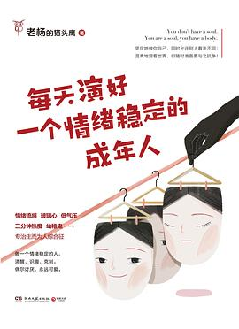

# 每天演好一个情绪稳定的成年人

# 简介

　　豆瓣评分：6.7

## 内容简介（来自豆瓣）

　　27 个有趣有料的故事，让你看到 “ 丧 ” 和 “ 燃 ” 的人生有何不同，让你领略到 “ 无聊 ” 和 “ 有趣 ” 的生活有多大的差别，让你明白 “ 无可奈何 ” 到 “ 放手一搏 ” 的选择会带来多大的差距。

　　提醒你 “ 万事开头难，中间难，结尾也难 ”；嘱咐你 “ 绝大多数的人生困境，都源自那该死的随波逐流 ”；拆穿你 “ 如果要做圣母，请先以身作则 ”；警示你 “ 大脑是你的自留地，不是别人的跑马场 ”。

　　看清了生活的真相，那些糟糕的情绪才能够被合理安放。每天演好一个情绪稳定的大人，清醒、识趣、克制。偶尔讨厌，永远可爱。

## 目录

Part Ⅰ 没错，长大是一件扫兴的事情
01　每天演好一个情绪稳定的成年人
02　你和自己都相处不了，却总想和别人打好交道
03　没错，长大是一件扫兴的事情
04　万事开头难，中间难，结尾也难
05 既对世俗投以白眼，又能与之 “ 同流合污 ”
Part Ⅱ 是的，相爱就是两个人互相治疗精神病
06 相爱就是两个人互相治疗精神病
07 谢谢你，那么忙，还亲自来伤害我
08　没有癞蛤蟆，天鹅也寂寞
09 所谓代沟，其实是还没来得及理解的爱
10 我们都擅长口是心非，又希望对方能有所察觉
11 明明是你死皮赖脸，何必怪他不留情面
Part Ⅲ 讲真的，如果吼可以解决问题，那么驴将统治世界
12 评价别人容易，认识自己很难
13 最高级的教养，就是时刻替别人着想
14 静坐常思己过，闲谈莫论人非
15　手里拿着锤子的人，看谁都像钉子
16 如果要做圣母，请先以身作则
Part Ⅳ 对不起，你的青春已余额不足，且无法充值
17　失败是成功之母，成功却六亲不认
18 不按你所想的方式去活，就会按你所活的方式去想
19 绝大多数的人生困境，都源自那该死的随波逐流
20 自律是一场自己对自己发动的战争
21 放弃不难，但坚持一定很酷
22 优秀不是自我感觉，而是客观事实
Part Ⅴ 实际上，时间只是一个自称能包治百病的庸医
23 大脑是你的自留地，不是别人的跑马场
24 勿因未候日光暖，擅自轻言世间寒
25 时间只是一个自称能包治百病的庸医
26 谁不是上一秒 “ 妈的 ”，下一秒 “ 好的 ”
27 纯洁不是知道得少，而是坚守得多

# 摘录

# 感想

