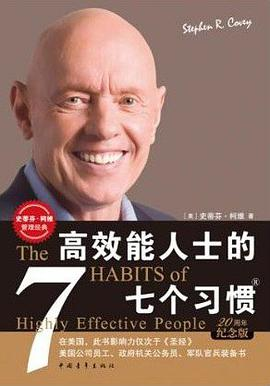
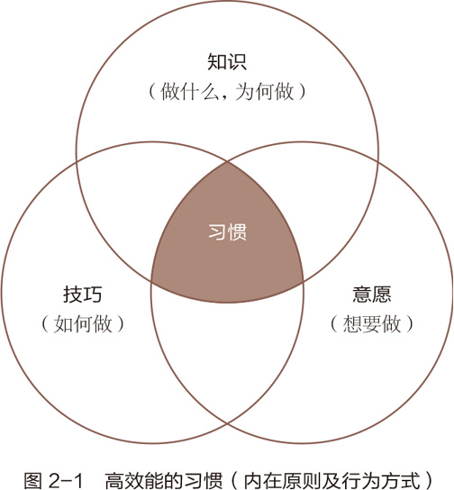
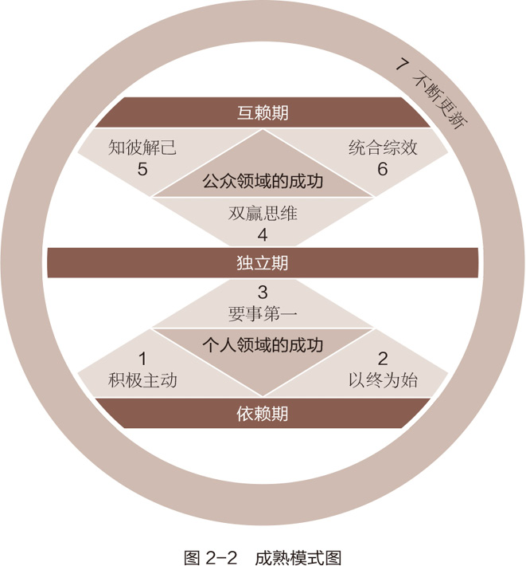
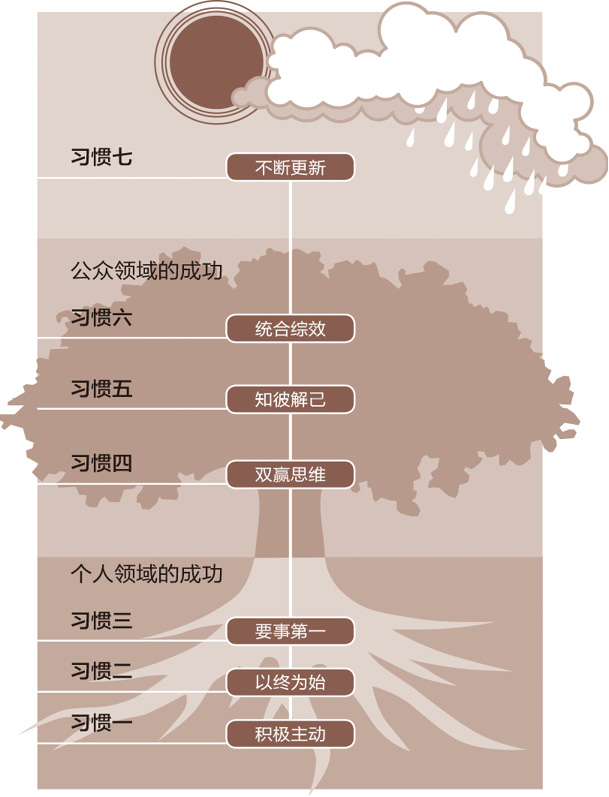
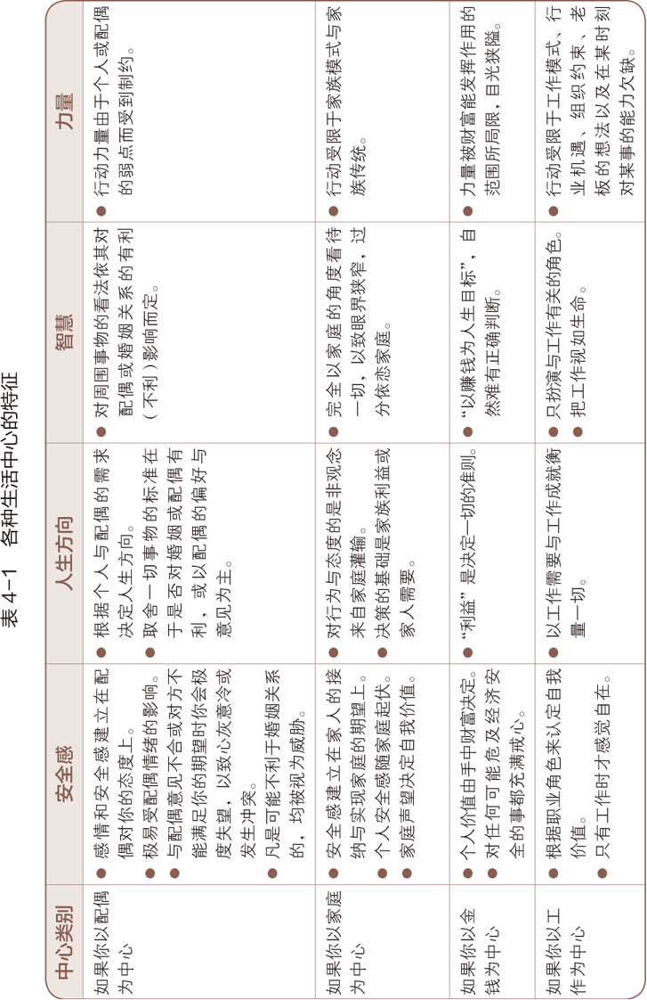
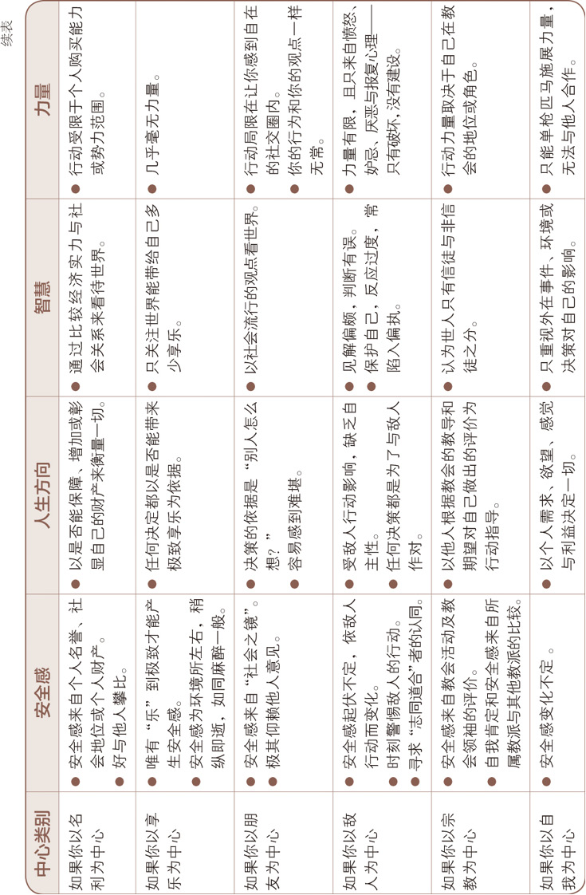
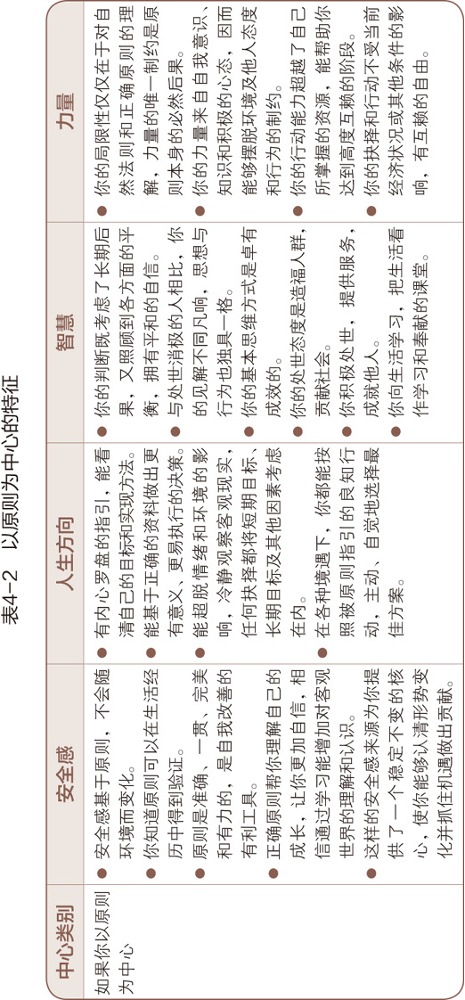

# 高效能人士的七个习惯

# 简介

　　豆瓣评分：8.4

## 内容简介（来自豆瓣）

​		本书精选柯维博士 “ 七个习惯 ” 的最核心思想和方法，为忙碌人士带来超价值的自我提升体验。用最少的时间，参透高效能人士的持续成功之路。

## 目录

* 第 1 部分 思维方式与原则
  * 第一章 由内而外全面造就自己
  * 第二章 七个习惯概论
* 第 2 部分 个人领域的成功：从依赖到独立
  * 第三章 习惯一 积极主动——个人愿景的原则
  * 第四章 习惯二 以终为始——自我领导的原则
  * 第五章 习惯三 要事第一——自我管理的原则
* 第 3 部分 公众领域的成功：从独立到互赖
  * 第六章 人际关系的本质
  * 第七章 习惯四 双赢思维——人际领导的原则
  * 第八章 习惯五 知彼解己——移情沟通的原则
  * 第九章 习惯六 统合综效——创造性合作的原则
* 第 4 部分 自我提升和完善
  * 第十章 习惯七 平衡的自我更新的原则
  * 第十一章 再论由内而外造就自己
* 附录
  * 第四代时间管理：办公室的一天
  * 柯维家族致以为高效能的父亲
  * 处理挑战/机遇问题的索引

# 摘录

* 第一章 由内而外全面造就自己

  * 品德成功论提醒人们，高效能的生活是有基本原则的。只有当人们学会并遵循这些原则，把它们融入到自己的品格中去，才能享受真正的成功与恒久的幸福。

    没有正确的生活，就没有真正卓越的人生。

    ——戴维·斯塔·乔丹（David Starr Jordan）｜美国生物学家及教育家

  * 要改变现状，首先要改变自己；要改变自己，先要改变我们对问题的看法。

  * 每个人经验不同，诠释也不同，而一旦离开了诠释，事实也就失去了它的意义。

  * 我们越是认识到思维方式以及经验在我们身上的影响力，就越是能够对自己的思维方式负责，懂得审视它，在现实中检验它，并乐于聆听和接受别人的看法，从而获得更广阔的视野和更客观的看法。

  * 思维方式和性格息息相关。从人类这个角度而言，你的观念会从为人中体现出来。我们对待事物的方式和性格紧密相关。如果不把性格和视角上的改变结合起来，是难有成效的。

  * 思维方式之所以强大，是因为这构成了我们观察世界的窗口。而思维转换的力量也正是定式改变必需的力量，无论这种转变是立即发生的，还是经过计划缓慢进行的。

  * 我们不可能打破法则，只能在违背法则的时候让自己头破血流。

  * 有人根据自己的经历建立思维方式或者绘制地图，然后借此观察自己的生活与人际关系。但是地图不等于地域本身，它只是一种“主观的事实”，是对某一地域的描述。

    只有“灯塔”式指引人类成长和幸福的原则才是“客观的事实”，是地域本身。这一法则已经渗透到历史上所有的文明社会中，并成为家庭和机构繁荣持久的基础。

  * 原则不同于实践。实践是特定的行为或活动，在某一情况下适用的实践未必能在另一种情况下适用。就好比父母不能将教育第一个孩子的方法照搬到第二个孩子身上。

    实践是个别的、具体的，而原则是深刻的、基本的和普遍的。原则适用于任何个人、婚姻、家庭以及公私机构。如果我们把原则内化为习惯，就能够用不同的实践方法应对任何局面。

  * 原则不是价值观。一群盗匪可以有相同的价值观，但却违背了良善的原则。如果说原则是地域，那么价值观就是地图。唯有尊重正确原则，才能认清真相。

  * 原则是人类行为的指南针，历经考验，长盛不衰，无可争议。要抓住它们的本质，最简捷的方法就是设想一下反其道而行之的后果，不会有人以为可以靠欺骗、不公、卑鄙、无能、平庸或者堕落来换得持久的幸福与成功。

  * 一个人的思维方式越符合这些原则或者自然法则，就越能正确而高效地生活。比起为改变态度和行为所做出的努力，正确的思维方式对于个人和人际关系效能的影响要大得多。

  * 自然的成长过程不容违背、忽略或缩短，那只会让你平添失望和挫败感。

  * 经验告诉我，教导孩子也要因时而异。在关系和气氛紧张的时候，教导会被视为一种评判与否定；关系融洽的时候，在私下里对孩子循循善诱效果会加倍。

  * 《高效能人士的七个习惯》要阐述的内容，它强调以原则为中心，以品德为基础，要求“由内而外”地实现个人效能和人际效能。

  * “由内而外”的意思是从自身做起，甚至更彻底一些，从自己的内心做起，包括自己的思维方式、品德操守和心理动机。

  * 由内而外的观点认为个人领域的成功必须先于公众领域的成功；只有先信守对自己的承诺，才能信守对他人的承诺。

  * 由内而外是一个持续的更新过程，以主宰人类成长和进步的自然法则为基础，是螺旋向上的，它让我们不断进步，直到实现独立自强与有效的互赖。

  * 我们有不同的思维方式或参照系，就像我们赖以观察世界的眼镜。我们看到的世界并非客观世界本身，而是我们在条件限制之下所看到的世界。

  * 我们越能意识到自己的思维方式或推测能力的局限，意识到我们在多大程度上受到自己过去经验的影响，我们就越能直面自己的思维方式，用现实来检验它们、测试它们，必要时改变它们，而且心胸开阔，乐于听取他人的意见。

* 第二章 七个习惯概论

  * 品德实质上是习惯的合成。

  * 本书将习惯定义为“知识”、“技巧”与“意愿”相互交织的结果。

  * 知识是理论范畴，指点“做什么”及“为何做”；技巧告诉我们“如何做”；意愿促使“想要做”。要养成一种习惯，三者缺一不可。

    

  * 七个习惯并非零落、分散的心理法则。它们符合成长规律，提供了开发个人和人际效能的渐进、连续和高度整合的方法，让我们依次经历“成熟模式”——由依赖到独立，再到互赖，不断进步。

  * “成熟模式图”（Maturity Continuum）即人类成长的三个阶段，分别为依赖期、独立期、互赖期。

    * 依赖期（Dependence）以“你”为核心——你照顾我；你为我的得失成败负责。
    * 独立期（Independence）以“我”为核心——我可以做到；我可以负责；我可以靠自己；我有权选择。
    * 互赖期（Interdependence）以“我们”为核心——我们可以做到；我们可以合作；我们可以融合彼此的智慧和能力，共创前程。

  * 显而易见，独立远比依赖要成熟，可谓人生的重大成就，但却不是最高成就。

  * 真正独立的品德能够让我们行事主动，摆脱对环境和他人的依赖，是值得追求的自由目标，但仍非高效能生活的终极目标。

  * 七个习惯中的前三个，着重于如何自我约束，由依赖进步到独立。这些习惯属于“个人领域的成功”范畴，是培养品德的基础，而后才能是“公众领域的成功”，就如同耕种与收获的次序无法颠倒一样，必须是由内而外依次实现。

  * 七个习惯与三个成长阶段的关系

    

  * 七个习惯都能产生高效能，因为它们基于原则，效果持久，是品德的基础，能帮助你更有效地解决问题、把握机会并通过不断学习和结合其他原则以实现螺旋向上的成长。

  * 此外，它们以符合自然法则的思维方式为基础，我把这个自然法则称为“产出/产能平衡”（P/PC Balance）的原则。

  * 效能在于产出与产能的平衡。 P代表希望获得的产出，即金蛋；PC代表产能，即生产金蛋的资产或能力。

  * 人类所拥有的资产，基本上可分为物质资产、金融资本以及人力资本三大类。

  * 急功近利常常会毁掉宝贵的物质资产。保持产出与产能的平衡会帮助你更有效地利用物质资产。

  * 金融资本的有效利用也是一样。有多少人本息不分，或者为了改善生活水平（获得更多的金蛋）而动用本金？本金与利息就相当于产能与产出，本金减少，产生利息的产能就减少，收入当然也会减少，财产缩水，最后连起码的生活水平都无法维持。

  * 我们最宝贵的金融资本就是赚钱的能力。如果不能持续投资以增进自己的产能，眼光就会受到局限，只能在现有的职位上踏步，每天忙忙碌碌，就怕老板对自己的印象不佳，既在经济上受制于人，又担心职位不保。这同样称不上效能。

  * 一切正确原则的可贵之处就在于它们的有效性和适用性。

  * 如果一个团体的成员在利用物质资产时，不遵守产出与产能平衡的原则，便会降低整个团体的效能，最终导致鹅的死亡。

  * 有些公司一方面大谈顾客至上，另一方面却完全忽略为顾客提供服务的员工。产出与产能平衡的原则告诉我们：你希望员工怎样对待顾客，就要怎样对待员工。

    你可以买到员工的时间，却买不到他的心，而心才是忠诚与热忱的根源；你可以买到员工的体能，却买不到他的头脑，而头脑才是创造力与智慧的源泉。

  * 产能要求像对待顾客一样对待员工，他们值得被视为珍宝，因为员工会贡献自己的精华——心和头脑。

  * 效能在于平衡。一味重视产出会导致糟糕的健康状况、耗损的机器设备、透支的银行存款或破裂的人际关系。而太过维护产能，就如同一个每天长跑三四个小时的人，宣称可以因此多活十年，却不知大好时光都在跑步中流逝。又好像那些只知念书，不肯生产的人，坐享别人的金蛋，自己永远不敢面对现实。

  * 唯有在金蛋（产出）与鹅的健康和幸福（产能）之间取得平衡，才能实现真正的效能。虽然你常会因此面临两难选择，但这正是效能原则的精髓所在。它是短期利益与长期目标之间的平衡，是好分数与刻苦努力之间的平衡，是清洁的房间与良好的亲子关系之间的平衡。

  * 产出与产能平衡的原则是效能的精髓，放之四海而皆准。不管你是否遵从，它都会存在。它是指引人生的灯塔，是效能的定义和模式，是本书中七个习惯的基础。

  * 在正式讨论高效能人士的七个习惯之前，我想建议读者先树立两个新观念，有助于你在阅读本书时收获更多。

    * 首先，我建议各位不要对本书浅尝辄止，大略读过便束之高阁。
    * 其次，我建议你改以老师的角色来阅读，除了吸收还要能复述。在阅读的过程中，应做好准备：在48小时之内与别人分享或讨论阅读心得。

  * 倘若你已决定打开“改变之门”，接纳本书所阐述的观念，那么我保证，你会得到以下的收获。首先你的成长过程虽是渐进的，效果却是革命性的。你将会认同，仅产出/产能平衡这一项原则，如果得到充分应用，就会使大多数个人和企业发生变化。前三个有关个人成功的习惯，可以大幅提高你的自信心。你将更能认清自己的本质、内心深处的价值观以及个人独特的才干与能耐。秉持自己的信念而活，就能产生自尊自重与自制力，并且内心平和。你会以内在的价值标准，而不是旁人的好恶或与别人比较的结果，来衡量自己。这时候，事情对错与别人是否发现无关。

  * 你还会意外地发现，当你不再介意别人怎样看你时，反而会去关心别人对他们自身、他们所处环境以及与你关系的看法。你不再让别人影响情绪，反而更能接受改变，因为你发现支撑现实的内在规律是恒久不变的。

    当你接受“公众成功”中的三个习惯时，修复和重建破裂的人际关系的意愿和能量将被激发。关系会更上一层楼，变得更加深厚、坚固，历久弥新且经得起考验。

  * 习惯七可加强前面六个习惯，时时为你充电，达到真正的独立与成功的互赖。

  * 不论你的现况如何，都请相信你与你的习惯是两码事，你有能力改变不良旧习，沐浴在新习惯的阳光里，过上高效、幸福和互信的新生活。

  * 七个习惯的简要定义

    * 习惯一：积极主动（BE PROACTIVE）

      积极主动即采取主动，为自己过去、现在及未来的行为负责，并依据原则及价值观，而非情绪或外在环境来下决定。积极主动的人是改变的催生者，他们摒弃被动的受害者角色，不怨天尤人，发挥了人类四项独特的禀赋——自我意识、良知、想象力和独立意志，同时以由内而外的方式来创造改变，积极面对一切。他们选择创造自己的人生，这也是每个人最基本的决定。

    * 习惯二：以终为始（BEGIN WITH THE END IN MIND）

      所有事物都经过两次的创造——先是在脑海里酝酿，其次才是实质的创造。个人、家庭、团队和组织在做任何计划时，均先拟出愿景和目标，并据此塑造未来，全心投入自己最重视的原则、价值观、关系及目标。对个人、家庭或组织而言，使命宣言可以说是愿景的最高形式，它是根本的决策，主宰了所有其他决定。领导工作的核心，就是基于共有的使命、愿景和价值观，创造出一个文化。

    * 习惯三：要事第一（PUT FIRST THINGS FIRST）
      要事第一即实质的创造，是梦想（你的目标、愿景、价值观及要事处理顺序）的组织与实践。次要的事不必摆在第一，要事也不能放在第二。无论迫切性如何，个人与组织均要更多聚焦要事，重点是，把要事放在第一位。

    * 习惯四：双赢思维（THINK WIN-WIN）

      双赢思维是一种基于互敬、寻求互惠的思考框架与心意，目的是分享更多的机会、财富及资源，而非敌对式竞争。双赢既非损人利己（赢输），亦非损己利人（输赢）。我们的工作伙伴及家庭成员要从互赖式的角度来思考（“我们”，而非“我”）。双赢思维鼓励我们解决问题，并协助个人找到互惠的解决办法，是一种资讯、力量、认可及报酬的分享。

    * 习惯五：知彼解己（SEEK FIRST TO UNDERSTAND,THEN TO BE UNDERSTOOD）

      当我们不再急切回答，改以诚心去了解、聆听别人，便能开启真正的沟通，增进彼此关系。对方获得理解后，会觉得受到尊重与认可，进而卸下心理防备，坦然交谈，双方对彼此的了解也就更顺畅自然。知彼需要仁慈心，解己需要勇气，能平衡两者，则可大幅提升沟通的效率。

    * 习惯六：统合综效（SYNERGIZE）

      统合综效谈的是创造第三种选择，即非按照我的方式，亦非遵循你的方式，而是创造第三种更好的办法。它是互相尊重的成果——不但了解了彼此，甚至还称赞彼此的差异，欣赏对方解决问题及把握机会的手法。个人的力量是团队和家庭统合综效的基础，能使整体获得一加一大于二的成效。实践统合综效的人际关系和团队会扬弃敌对的态度（1+1＝1/2），不以妥协为目标（1+1＝11/2），也不仅仅止于合作（1+1＝2），他们要的是创造式的合作（1＋1＞2）。

    * 习惯七：不断更新（SHARPEN THE SAW）

      “不断更新”谈的是，如何在四个生活基本面（身体、精神、智力、社会/情感）中，不断更新自己。这个习惯提升了其他六个习惯的实施效率。对组织而言，习惯七提供了愿景、更新及不断的改善，使组织不至呈现老化及疲态，并迈向新的成长之路。对家庭而言，习惯七通过固定的个人及家庭活动，使家庭效能升级，就像建立传统，使家庭日新月异，即是一例。

  * 要想获得重大成果，首先要在所见上突破，即思维。如果所见没有变化，新的行为不会持久。

    

  * 我们首先要获得个人领域的成功（习惯一、二、三），然后才能获得公众领域的成功（习惯四、五、六）

  * 个人领域的成功总是先于公众领域的成功。

  * 低效能人士的七个习惯

    * 习惯一：消极被动

      把所有问题的矛头都指向讨人厌的老板、父母、基因、配偶、伴侣、前任、经济、政府，或者其他方面。受害者心理。

      不对自己的人生负责。如果你感到饥饿，就去吃饭。如果你感到愤怒，就去发泄。如果有人对你说粗话，就怼回去。消极被动。

    * 习惯二：漫无目的

      没有计划。没有目标。不会担心自己的行为带来的后果。随波逐流。及时行乐，做个玩世不恭者，因为也许明天就会死去。

    * 习惯三：要事最后

      拖延。总是先做紧急的事情，比如手机一响就去回复，然后再做重要的事情。不会担心透支情感账户，反正他们总会在身边。为什么要运动？一直很健康。一定要保证每天有足够的时间看各种视频。

    * 习惯四：你输我赢思维

      把生活当成痛苦的竞赛。别人就是为了取代自己，所以只好先取代他们。不让别人获得成功，如果他们赢了，自己就输了。如果你好像要输了，一定要拉一个垫背的。

    * 习惯五：先谈论，再倾听

      人生来就长着嘴巴，一定要物尽其用。多多谈论。确保每个人首先要明白自己的观点；然后，如果情况使然，不得不假装听听别人的话，就用“嗯嗯”回应，脑子里思考的是午饭吃什么。或者如果你真的想知道别人的想法，就把这个机会给他们。

    * 习惯六：成为一座孤岛

      直面现实吧，其他人那么奇怪是因为他们和你不同，那为什么还要和他们相处？团队合作耗时耗力。合作会把所有进度拖慢，干脆放弃。你已经有了最棒的想法，自己一个人干就很好了。我就是我，一座特别的岛屿。

    * 习惯七：耗尽一切

      开车太专注，没有时间加油。生活太忙碌，没有时间充电和更新。不学习新知识。像躲避瘟疫一样逃避运动。老天有眼，不要看那些好书，欣赏自然、艺术、音乐或其他能够点燃你激情的东西。燃烧热情吧，耗尽一切。

  * 七个习惯是提高效能的习惯。真正的效能基于符合自然规律的永恒不变的原则。

    ——史蒂芬·柯维

* 第三章 习惯一 积极主动——个人愿景的原则

  * 人类特有的精神活动，而动物则缺乏这种自我意识（Self-awareness）的能力，即思考自己的思维过程的能力。正因为如此，人类才能成为万物之灵，一代又一代在不断演化中实现进步。

    这也是为什么我们能从自己和他人的经验中吸取教训，培养和改善习性。

  * 凭借自我意识，我们可以客观地检讨我们是如何“看待”自己的——也就是我们的“自我思维”（Self-paradigm）。所有正确有益的观念都必须以这种“自我思维”为基础，它影响我们的行为态度以及如何看待别人，可以说是一张属于个人的人性地图。

  * 事实上，我们如果不能客观地考虑看待自己的方式，也就不能理解他人感知他们自己和世界的方式。因此我们无意间就会把个人意愿强加在别人身上，内心却还觉得已经很客观了。

    这将极大地限制个人的潜力和与别人交往的能力。幸好人类有自我意识，能够检讨自己的自我思维是基于现实和原则，还是受到社会的制约与环境的影响。

  * 如果我们仅仅通过“社会之镜”（Social Mirror），即时下盛行的社会观点以及周围人群的意见、看法和思维方式来进行自我认知，那无异于从哈哈镜里看自己。

  * 时下盛行的社会观点认为，环境与条件对我们起着决定性的作用。我们不否认条件作用的影响巨大，但并不等于承认它凌驾于一切之上，甚至可以决定我们的命运。

  * 实际上根据这种流行看法而绘制的社会地图一共可以分为三种，也可以说是已经被广泛接受的用来解释人性的三种“决定论”，有时单独使用，有时一起使用：

    * 基因决定论（Genetic Determinism）：认为人的本性是祖先遗传下来的。比如一个人的脾气不好，那是因为他先祖的DNA中就有坏脾气的因素，又借着基因被传承下来。
    * 心理决定论（Psychic Determinism）：强调一个人的本性是由父母的言行决定的。比如你总是不敢在人前出头，每次犯错都内疚不已，那是与父母的教育方式和你的童年经历分不开的，因为你忘不了自己尚且稚嫩、柔弱和依赖他人时受到的心灵创伤，忘不了小时候因为表现欠佳而遭遇的惩罚、排斥和与人比较的感受。
    * 环境决定论（Environmental Determinism）：主张环境决定人的本性。周遭的人与事，例如老板、配偶、叛逆期子女，或者经济状况乃至国家政策，都可能是影响因素。

  * 这三种地图都以“刺激—回应”理论为基础，很容易让人联想到俄国生理学家巴甫洛夫所做的关于狗的实验。其基本观点就是认为我们会受条件左右，以某一特定方式回应某一特定刺激。

  * 选择的自由包括人类特有的四种天赋。除自我意识（Self-awareness）外，我们还拥有“想象力（Imagination）”，即超越当前现实而在头脑中进行创造的能力；“良知（Conscience）”，即明辨是非，坚持行为原则，判断思想、言行正确与否的能力； “独立意志（Independent Will）”，即基于自我意识、不受外力影响而自行其是的能力。

  * 人类独特的能力将我们与动物完全区分。对这些能力加以开发和锻炼，将会在不同程度上实现我们独具的人类潜能。在刺激与回应之间自由选择就是我们最大的能力。

  * 高效能人士在任何环境中都应具备的、首要的，也是最基本的习惯——“积极主动（Be Proactive）”。

  * 积极主动不仅指行事的态度，还意味着人一定要对自己的人生负责。个人行为取决于自身的抉择，而不是外在的环境，人类应该有营造有利的外在环境的积极性和责任感。

  * 责任感（Responsible），从构词法来说是能够回应（Response-able）的意思，即选择回应的能力。所有积极主动的人都深谙其道，因此不会把自己的行为归咎于环境、外界条件或他人的影响。他们根据价值观，有意识地选择待人接物的方式，不会因为外界因素或一时情绪而冲动行事。

  * 积极主动是人类的天性，即使生活受到了外界条件的制约，那也是因为我们有意或无意地选择了被外界条件控制，这种选择称为消极被动（Reactive）。这样的人很容易被天气状况所影响，比如风和日丽的时候就兴高采烈，阴云密布的时候就无精打采。而积极主动的人则心中自有一片天地，无论天气是阴雨绵绵还是晴空万里，都不会对他们产生影响，只有自己的价值观才是关键因素。如果认定了工作第一，那么即使天气再坏，敬业精神依旧不改。

  * 消极被动的人还会受到 “社会天气”的影响。别人以礼相待，他们就笑脸相迎，反之则摆出一副自卫的姿态。心情好坏全都取决于他人的言行，任由别人的弱点控制自己。

  * 积极主动的人理智胜于冲动，他们能够慎重思考，选定价值观并将其作为自己行为的内在动力；而消极被动的人则截然相反，他们感情用事，易受环境或条件作用的驱使。

  * 但这并不意味着积极主动的人对外界刺激毫无感应，只不过他们会有意无意地根据自己的价值观来选择对外界物质、心理与社会刺激的回应方式。

  * 弗兰克尔曾指出人生有三种主要的价值观：一是经验价值观（Experiential Value），来自自身经历；二是创造价值观（Creative Value），源于个人独创；三是态度价值观（Attitudinal Value），即面临绝症等困境时的回应。这三种价值观中，境界最高的是态度价值观。

  * 逆境往往能激发思维转换，使人以全新的观点看待世界、自己与他人，审视生命的意义，进而思考应该如何回应，这种更宽广的视角反映的就是可以提升和激励所有人的态度价值观。

  * 人性的本质是主动的。人类不仅能针对特定环境选择回应方式，更能主动创造有利环境。但这不等于胆大妄为、惹是生非或滋事挑衅，而是要让人们充分认识到自己有责任创造条件。

  * 要求责任感并非贬抑。主动是人的天性，虽然主动性有时处于沉睡状态，但只要经过唤醒就会重新焕发活力。通过尊重他人这种天性，至少可提供对方一面社会之镜，让他们在镜中清晰而又不失真地照出自我。

  * 由于个人的成熟度不同，对尚处于情绪依赖阶段的人，不必期望太高。但至少可以创造有利的气氛，逐渐培养他的责任感。

  * 采取主动是实现人生产能与产出平衡的必要条件，对于培养七个习惯来说也不例外。本书的其余六个习惯，都以积极主动为根基，而每个习惯又都会激励你采取主动，但是如果你甘于被动，就会受制于人，面临截然不同的发展与机遇。

  * 积极行动不同于积极思考。我们不但需要面对现实，还要面对未来。但真正的现实是，我们有能力以积极态度应对现状和未来，逃避这一现实，就只能被动地让环境和条件决定一切。

  *  包括企业、家庭和各级社会团体在内的任何组织都可以采取积极的态度，将其与创造力结合起来，在内部营造积极主动的企业文化氛围，不必坐等上苍的恩赐，而是通过集思广益，主动培育团队的共同价值观和目标。

  * 思维意识会决定行为和态度，如果有意识仔细检查，我们会发现这些都会在我们的人格地图上体现出来。比如我们的语言，就是我们是否积极处世的真实写照。

  * 看一个人的时间和精力集中于哪些事物，也能大致判断他是否积极主动。

  * 关注圈内的事物，有些可以被掌控，有些则超出个人能力范围，前者可以被圈成一个较小的“影响圈”（Circle of Influence)。观察一个人的时间和精力集中于哪个圈，就可以判断他是否积极主动。

  * 积极主动的人专注于“影响圈”，他们专心做自己力所能及的事，他们的能量是积极的，能够使影响圈不断扩大。

  * 反之，消极被动的人则全神贯注于“关注圈”，紧盯他人弱点、环境问题以及超出个人能力范围的事不放，结果越来越怨天尤人，一味把自己当作受害者，并不断为自己的消极行为寻找借口。错误的焦点产生了消极能量，再加上对力所能及之事的忽略，就造成了影响圈日益缩小。

  * 只要我们的焦点在关注圈，就等于是允许自己受制于外界条件，自然就不会主动采取必要措施来推动积极变化。

  * 我们面对的问题可以分为三类：可直接控制的（问题与自身的行为有关），可间接控制的（问题与他人的行为有关）和无法控制的（我们无能为力的问题，例如我们的过去或现实的环境）。对于这三类问题，积极主动的人都是由影响圈着手，加以解决。

  * 可直接控制的问题：可以通过培养正确习惯来解决，这显然在影响圈范围内，本书第二部分“个人领域的成功”中讨论到的习惯一、二、三即属于这一类。

    可间接控制的问题：可以通过改进施加影响的方法来解决，例如采取移情方式而不是针锋相对，以身作则而不是口头游说。这在第三部分“公众领域的成功”的习惯四、五、六中有所论述。

    无法控制的问题：我们要做的就是改变面部曲线，以微笑、真诚与平和来接受现实。纵使有再多不满，也要学着泰然处之，这样才不至于被问题左右。

  * 不论是能直接控制的、间接控制的还是无法控制的问题，解决的第一步都掌握在我们自己手里。我们可以改变习惯、手段和看法，而这些都属于影响圈范围。

  * 令人鼓舞的是，在面对环境选择回应方式的同时，我们对环境的影响力也得到增强。这就像一个化学方程式，改变其中的某一部分，其结果就会跟着改变。

  * 积极的做法应该是“由内而外”地改变，即先改变个人行为，让自己变得更充实，更具创造力，然后再去施加影响，改变环境。

  * 如果遇上实在无能为力的状况，保持乐观进取的心态仍是上上策，不管快乐或不快乐，同样积极主动。有些事物不是人力所能控制，比方说天气，但我们仍可保持内心的愉悦或外在环境的愉悦气氛。对力所不能及之事处之泰然，对能够改变的则全力以赴。

  * 把生活中心由关注圈移至影响圈之前，有两件关注圈内的事值得深思，那就是自由选择的后果及错误。

    每个人都可以选择自己的行为与回应，但后果仍由自然法则决定，非人力所能左右。

  * 人的一生中，错误的选择在所难免，其后果让人悔不当初，却又无能为力，于是想象着如果再有一次机会，必会另作他选，这是值得我们深思的第二件事。

  * 对于已经无法挽回的错误，积极主动的人不是悔恨不已，而是承认往日错误已属关注圈的事实，那是人力无法企及的范畴，既不能从头来过，也不能改变必然后果。

  * 对待错误的积极态度应是马上承认，改正并从中吸取教训，这样才能真正反败为胜。正如俗语所说，“失败是成功之母。”

  * 影响圈的核心就是做出承诺与信守诺言的能力。积极主动的本质和最清晰的表现就是对自己或别人有所承诺，然后从不食言。

  * 承诺也是成长的精髓。自我意识与良知的天赋让我们能够自我检讨，发现有待改进的地方、有待发挥的潜能以及有待克服的缺点，然后想象力与独立意志的天赋会配合自我意识，帮我们做出承诺，确立目标，矢志达成。

  * 由此就找到了两种能够直接掌控人生的途径：一是做出承诺，并信守诺言；二是确立目标，并付诸实践。即便只是承诺一件小事，只要有勇气迈出第一步，也有助于培育内心的诚信，这表示我们有足够的自制能力、勇气和实力承担更多的责任。一次次做出承诺，一次次信守诺言，终有一天我们会克服情绪的掣肘，获得人生的尊严。

  * 做出承诺与信守诺言正是培养高效能习惯的根本力量。知识、技巧和意愿都位于影响圈内，改善其中任何一项都会改善三者之间的平衡，三者的交集越大，就说明我们对于习惯及其原则的修养越完善，就越能够以崇高的品德实现平衡而高效能的生活。

  * 日常生活的种种琐事同样可以训练我们养成积极主动的习惯，以应付人生的巨大压力。具体表现在我们如何做出和信守承诺，如何面对交通堵塞，如何应对顾客的无理要求或是孩子的叛逆行为，如何看待自己的问题，把精力集中在哪些事情上以及使用什么样的语言。

  * 斯坦福大学教授卡罗尔·德韦克经过20年的研究，发现大多数人属于这两种心境或思维中的一种：固定型思维模式或成长型思维模式。固定型思维模式的人认为他们的才智和天赋是一成不变的，无力改变什么。这是一种相对消极的世界观。“我不擅长数学。”或“我一向不擅长与人相处，为什么还要尝试呢？”

    与此相反，成长型思维模式的人认为通过付出和努力，自己的基础能力可以得到发展和提高，他们的信念是自己坐在驾驶员的位置，因此可以提高和改变。这种积极主动的世界观会带来积极主动的思维方法和语言。“我需要提高数学。”或者“我可以对我的伴侣更体贴。”

  * 与此相似，宾夕法尼亚大学积极心理学中心的知名主任，马丁·塞利格曼博士研究的领域是关注影响圈带来的好处。在他的图书《真实的幸福》（Authentic Happiness）中，他认为幸福来源于三个方面：1. 基因；2. 环境；3. 你能控制的事情。他的研究发现，基因和环境带来的幸福要远远少于第三类：你能控制的事情。因此塞利格曼总结道，要想获得幸福应该关注你能控制的事情。

  * 除此之外，积极主动还有两个表现。首先，对人生负责；其次，采取行动。就是如此简单，要成为主导者，而不是受害者。不要等着生活对你下手，要对生活出手。成为生活的掌控者，而不是一个乘客。根据设想而活，而不是跟着过去而活。

* 第四章 习惯二 以终为始——自我领导的原则

  * 虽然习惯二适用于不同的环境和生活层面，但最基本的应用，还是应该从现在开始，以你的人生目标作为衡量一切的标准，你的一言一行，一举一动，无论发生在何时，都必须遵循这一原则，即由个人最重视的期许或价值观来决定一切。牢记自己的目标或者使命，就能确信日常的所作所为并非与之南辕北辙，并且每天都向着这个目标努力，不敢懈怠。

  *  “以终为始”的一个原则基础是“任何事都是两次创造而成”。我们做任何事都是先在头脑中构思，即智力上的或第一次的创造（Mental/First Creation），然后付诸实践，即体力上的或第二次的创造（Physical/Second Creation）。

  * 无论你是否意识到，是否能够控制，生活的各个层面都存在第一次的创造。每个人的人生都是第二次的创造，或者是自己主动设计的，或者是外部环境、他人安排、旧有习惯限定的。自我意识、良知和想象力这些人类的独特天赋让我们能够审视各种第一次的创造，并掌控自己的那一部分，即自己撰写自己的剧本。换句话说，习惯一谈的是“你是创造者”，习惯二谈的是“第一次创造”。

  * 习惯二“以终为始”的另一个原则基础是自我领导，但领导（Leadership）不同于管理（Management）。领导是第一次的创造，必须先于管理；管理是第二次的创造，具体会在习惯三中谈到。

  * 领导与管理就好比思想与行为。管理关注基层，思考的是“怎样才能有效地把事情做好”；领导关注高层，思考的是“我想成就的是什么事业”。

  * 人类的自我意识天赋是积极处世的基础，另两项天赋，想象力和良知，则使我们能在生活中发扬积极精神，施行自我领导。

  * 以终为始最有效的方法，就是撰写一份个人使命宣言，即人生哲学或基本信念。宣言主要说明自己想成为怎样的人（品德），成就什么样的事业（贡献和成就）及为此奠基的价值观和原则。

  * 制订个人使命宣言必须从影响圈的核心开始，基本的思维方式就在这里，即我们用来观察世界的“透镜”。

  * 我们要在此处确立自己的愿景和价值观；利用自我意识检查我们的地图或思维方式是否符合实际，是否基于正确的原则；利用良知作为罗盘来审视我们独特的聪明才智和贡献手段；利用想象力制定我们所渴求的人生目标，确定奋斗的方向和目的，搜罗使命宣言的素材。

  * 当我们专注于这个核心并取得丰硕成果的时候，影响圈就会被扩大，这是最高水平的产能，会有力提高我们在生活各领域的效能。

  * 这个核心还是安全感、人生方向、智慧与力量的源泉。

  * “ 安全感”（Security）：代表价值观、认同、情感的归属、自尊自重与拥有个人的基本能力。

  * “人生方向”（Guidance）：是“地图”和内心的准绳，人类以此为解释外界事物的理据以及决策与行为的原则和内在标准。

  * “智慧”（Wisdom）：是人类对生命的认知、对平衡的感知和对事物间联系的理解，包括判断力、洞察力和理解力，是这些能力的统一体。

  * “力量”（Power）：则指采取行动、达成目标的能力，它是做出抉择的关键性力量，也包括培育更有效的习惯以替代顽固旧习的能力。

  * 它们相辅相成——安全感与明确的人生方向可以带来真正的智慧，智慧则能激发力量。若四者全面均衡，且协调发展，便能培养高尚的人格、平和的性格与完美的个体。

  * 不论你是否意识得到，人人都有生活中心，它们对生活各方面的强烈影响毋庸置疑。

  * 你现在的状况如何？什么是你的生活中心？有时并不容易回答。也许最好的办法就是详细考察支撑自己人生的因素。如果你能在表4-1中认出一种或几种行为，你就能追踪到导致这些行为的生活中心——一个限制效能的生活中心。

    

    

  * 最理想的状况还是建立清晰明确的生活中心，由此才能产生高度的安全感、人生方向、智慧和力量，使人生更积极、更和谐。

  * 原则是深刻的、实在的、经典的真理，是人类共有的财富。它们准确无误，始终如一，完美无瑕，强而有力，贯穿生活的方方面面。

  * 如果以原则为生活中心，智慧和人生方向的来源就是正确的地图，反映事物的真实历史和现状。正确的地图让我们能够清晰了解自己的目标以及实现途径，能够基于正确的资料做出更有意义、更易执行的决策。（见表4-2）

    

  * 随着对自身了解的不断加深，会逐渐让思维与正确原则融为一体，与此同时，一个高效强大的生活中心一并产生。透过这个中心审视世界，思路将会变得更清晰，这样做也会让每一个人关注自己在世上的独特作用。

  * 自我意识让我们能审视自己的思想，这特别有助于撰写个人使命宣言。撰写过程中需要发挥作用的两项人类天赋——想象力和良知——是右脑的主要职能。知道怎样开发右脑功能能够大大增强设计人生的能力。

  * 研究结果显示，人的大脑可分为左右两部分，左脑主司逻辑思考与语言能力，右脑执掌创造力与直觉。左脑处理文字，右脑擅长图像；左脑重局部与分析，右脑重整体与整合。

  * 拓宽思路和心灵演练就是开发右脑的两个途径。

  * 就撰写和实践使命宣言来说，执掌创造力与直觉的右脑是我们最有用的资产。

  * 考虑到这一点，在撰写使命宣言时，不妨分开不同的角色领域，一一订立目标。

  * 一旦确定了主要的人生角色，你就能清楚地掌握全局。接着，还要订立每个角色的长期目标，这些目标必须反映你真正的价值观、独特的才干与使命感。

  * 每个家庭都有共同的价值观及理念作为生活的中心，撰写家庭使命宣言正可凸显这个生活中心。家庭使命宣言有如宪法，可当作衡量一切利弊得失的标准，以及重大决定的依据，并使全家人在共同的目标下团结一心。

  * 对于成功企业来说，使命宣言同样至关重要。

  * 一份企业使命宣言要真正地反映企业里每个人最大程度的共同愿景和价值，要创造一个伟大的集体和员工巨大的投入。员工的心里和头脑里会有一套参考框架，一套标准或者指导原则，他们就可以自我管理。他们不需要别人的指导、控制、批评或者鄙视。他们已经完全认可企业不变的核心。

* 第五章 习惯三 要事第一 ——自我管理的原则

  * 习惯三可以让人受益匪浅，是习惯一和习惯二的具体实践。

  * 习惯一告诉你：“你是创造者，你掌控自己的人生。”这个习惯的基础是人类特有的四大天赋，即想象力、良知、独立意志以及最为重要的自我意识。这个习惯让你能够大声宣布：“虽然那是我从小见惯了的事情，整个社会也都是这个样子，但是那根本就行不通，我不喜欢这种没有任何实际效果的解决方法，我能够改变它。”

  * 习惯二是关于第一次的创造或者智力上的创造的习惯，其原则基础是想象力和良知这两大天赋。想象力是一种超前感知的能力，是对目前无法亲眼看到的潜力和创造力的认识，而良知则是发掘每个人身上独有特性的能力。良知在伦理道德方面担当对个体进行指导的责任。这个习惯同我们的基本思维方式和对自己的最高期望值、价值观密切相关。

  * 习惯三是关于第二次的创造或者体力上的创造的习惯，是对前面两个习惯的实现、执行和自然流露。它要求我们运用独立意志努力实现一个目标，即以原则为基础安排人生。

  * 独立意志指的是做出决定和主动选择，并根据这些决定和选择采取具体行动的能力。

  * 有效的管理指的就是要事第一，先做最重要的事情。

  * 不论大学生、生产线上的工人、家庭主妇，抑或企业负责人，只要能确定自己的第二象限事务，而且即知即行，一样可以事半功倍。在时间管理领域称之为帕雷托原则（Pareto Principle） ——以20％的活动取得80％的成果。

  * 若要专注于要务，就得排除次要事务的牵绊，此时需要有说“不”的勇气。

  * 人各有志，各有优先要务。必要时，应该不卑不亢地拒绝别人，在紧急与重要之间，知道取舍。

  * 第四代理论便在旧有基础上，开创新局面。以原则为中心，配合个人对使命的认知，兼顾重要性与急迫性；强调产出与产能齐头并进，着重第二象限事务的完成。

  * 让第二象限事务成为生活中心的有效工具必须满足以下六个重要标准：

    * 和谐一致：个人的理想与使命、角色与目标、工作重点与计划、欲望与自制之间，应和谐一致。
    * 平衡功能：管理方法应有助于生活平衡发展，提醒我们扮演不同的角色，以免忽略了健康、家庭、个人发展等重要的人生层面。有人以为某方面的成功可补偿其他方面的遗憾，但那终非长久之计。难道成功的事业可以弥补破碎的婚姻、孱弱的身体或性格上的缺失？
    * 围绕中心：理想的管理方法会鼓励并协助你，注重于虽不紧急却极重要的事。我认为，最有效的方法是以一星期为周期制订计划。一周7天中，每天各有不同的优先目标，但基本上7天一体，相互呼应。如此安排人生，秘诀在于不要就日程表订立优先顺序，应就事件本身的重要性来安排行事。
    * 以人为本：个人管理的重点在人，不在事。行事固然要讲求效率，但以原则为中心的人更重视人际关系的得失。因此有效的个人管理偶尔须牺牲效率，迁就人的因素。毕竟日程表的目的在于协助工作，并不是要让我们为进度落后而产生内疚感。
    * 灵活变通：管理方法并非一成不变，视个人作风与需要而调整。
    * 便于携带：管理工具必须便于携带，随时可供参考修正。

  * 第二象限事务的活动是有效自我管理的核心内容，因此你需要一个有效的工具将生活中心转移到第二象限事务，我按照上述各项标准专门设计了一个工具以实现第四代时间管理的方法。当然，很多第三代时间管理的工具也不错，只要稍加修改就可以应用。原则都是相通的，但实际做法和具体运用却因人而异。

  * 以第二象限事务为中心的日程安排需要以下四项关键步骤：

    * 确认角色：第一步就是要写出你自己的关键角色。
    * 选择目标：第二步就是思考下一个周计划中每一任务栏下你最想做的一两件要事，作为你选定的目标。
    * 安排进度：第三步是为每一项目标安排具体的实施时间。
    * 每日调整：使用这种以第二象限事务为中心的周计划之后，你就会发现原来的每日计划变成了每日调整，即根据突发事件、人际关系的意外发展及崭新机会对每天的要务安排进行适当调整。

  * 第三个习惯重在身体力行。

  * 俗语说：“天有不测风云，人有旦夕祸福。”事先安排妥当的行事表，必要时仍须有所变更。只要把握原则，任何调整都可以心安理得。

  * 第四代自我管理的方法比之前的三代管理方法都要先进，这种先进性体现在以下五个重要的方面。

    * 首先，它以原则为基础，切实地创造出一个核心模式，让你能够在一个更大的范围内分配自己的时间，看清楚什么是真正重要的和有效的。
    * 其次，它接受你内心良知的指导。这种方法让你有机会更好地安排自己的生活，并且最大限度地同你既定的价值观保持一致。同时，它也给你自由和变通，让你在牺牲既定日程安排，服从更重要的价值观的时候心平气和，不必内疚。
    * 再次，这种方法确认了你的个人使命，包括价值观和长期目标。这样你在度过每一天的时候都有明确的目标和方向。
    * 再次，这种方法帮助你明确自己的角色，平衡自己生活中的各个方面。每个星期为每个关键角色确立要达到的目标，并做出具体的日程安排。
    * 最后，这种方法以一个星期为单位计划生活（需要的时候可以对每天的安排作适当的调整），这让你拥有了更广阔的视野，不必局限于短暂的一天时间。通过审视自己的主要角色而让自己保持清醒，经常想到自己内心深处的价值观。

  * 有一条主线贯穿这五个方面，那就是将人际关系和结果放在第一位，将时间放在第二位。

  * 授权是提高效率或效能的秘诀之一，其实把责任分配给其他成熟老练的员工，才有余力从事更高层次的活动。因此，授权代表成长，不但是个人，也是团体的成长。

  * 授权基本上可以划分成两种类型：指令型授权和责任型授权。

  * 指令型授权是让别人“去做这个，去做那个，做完告诉我”。大部分生产者都具有这种指令型授权的行为模式。

  * 责任型授权的关注重点是最终的结果。它给人们自由，允许自行选择做事的具体方法，并为最终的结果负责。起初，这种授权方式费时又费力，但却十分值得。通过责任型授权，可将杠杆的支点向右移动，提高杠杆的作用。

  * 这种授权类型要求双方就以下五个方面达成清晰、坦诚的共识，并做出承诺。

    * 预期成果：双方都要明确并理解最终的结果。要以“结果”，而不是以“方法”为中心。要投入时间，耐心、详细地描述最终的结果，明确具体的日程安排。

    * 指导方针：确认适用的评估标准，避免成为指令型授权，但是一定要有明确的限制性规定。不加约束的放任，其最终结果只能是扼杀人们的能动性，让人们回到初级的指令型要求上：“告诉我你想要我做什么，我照做就是了。”

      事先告知对方可能出现的难题与障碍，避免无谓的摸索，但不要告诉做什么。要让他们自己为最后的结果负责，明确指导方针，放手让他们去做。

    * 可用资源：告知可使用的人力、财物、技术和组织资源以取得预期的成果。

    * 责任归属：制定业绩标准，并用这些标准来评估他们的成果。制订具体的时间表，说明何时提交业绩报告，何时进行评估。

    * 明确奖惩：明确告知评估后的结果——好的和不好的——包括财物奖励、精神奖励、职务调整以及该项工作对其所在组织使命的影响。

  * 有效的自我管理以及通过授权对他人进行有效的管理，其中的关键并不是技巧、工具或其他外在因素。这种有效管理的中心是内在的，是以第二象限事务为中心的思维方式，让你能从重要性而不是紧迫性来观察一切事务。

  * 如果能够建立以第二象限事务为中心的思维方式，就能提高安排生活的能力，能够真正做到要事为先，言出必行。从此，就可以有效管理自己的生活，不必再求助于其他任何人或任何事情。

* 第六章 人际关系的本质

  * 个人独立不代表真正的成功，圆满人生还须追求公众领域的成功。不过，群体的互赖关系须以个人真正的独立为先决条件，想要抄近路是办不到的。

  * 独立是互赖的基础。

  * 维系人与人之间的情谊，最要紧的不在于言语或行为，而在于本性。

  * 情感账户里储蓄的是人际关系中不可或缺的信任，是人与人相处时的那份安全感。

  * 能够增加情感账户存款的，是礼貌、诚实、仁慈与信用。这使别人对我更加信赖，必要时能发挥相当的作用，甚至犯了错也可用这笔储蓄来弥补。有了信赖，即使拙于言辞，也不致开罪于人，因为对方不会误解你的用意。所以信赖可带来轻松、坦诚且有效的沟通。

  * 反之，粗鲁、轻蔑、威逼与失信等等，会减少情感账户的余额，到最后甚至透支，人际关系就得拉警报了。

  * 情感账户的七种主要的投资方式

    * 理解他人

      理解他人是一切感情的基础。

    * 注意小节

      一些看似无关紧要的小节，如忽视礼貌，不经意的失言，最能消耗情感账户的存款。在人际关系中，最重要的正是这些小事。

    * 信守承诺

      守信是一大笔储蓄，背信则是庞大支出，代价往往超出其他任何过失。一次严重的失信使人信誉扫地，再难建立起良好的互赖关系。

    * 明确期望

      目标期望不明确也会损害交流与信任。

      几乎所有的人际关系障碍都源于对角色和目标的期望不明或者意见不一致。

      正确的做法是一开始就提出明确的期望，让相关的每一个人都了解。要做到这一点需要投入很多的时间和精力，不过事实会向你证明，这样做会省去你将来更多的麻烦和周折。

    * 正直诚信

      正直诚信能够产生信任，也是其他感情投资的基础。诚信，即诚实守信，既要有一说一，又要信守承诺、履行约定。而体现这种品格的最好方法就是避免背后攻击他人。如果能对不在场的人保持尊重，在场的人也会尊重你。当你维护不在场的人的时候，在场的人也会对你报以信任。

    * 勇于致歉

      当我们从情感账户上提款时，要向对方诚心致歉，那会帮助我们增加存款。

    * 无条件的爱

      无条件的爱可以给人安全感与自信心，鼓励个人肯定自我，追求成长，由于不附带任何条件，没有任何牵绊，被爱者得以用自己的方式，检验人生种种美好的境界。不过，无条件的付出并不代表软弱。我们依然有原则、有限度、有是非观念，只是无损于爱心。

      有条件的爱，往往会引起被爱者的反抗心理，为证明自己的独立，不惜为反对而反对。有条件的爱反映出爱人者不成熟的心理，表示其仍受制于对方。

  * 相比为群体服务，建立私人关系需要更多人格修养。

  * 一对一的关系是人生最基本的要素，有赖高尚的人格来维系，只有管理众人的技巧是不够的。

  * 在互赖关系中，问题就代表机会——增加情感账户存款的机会。

  * 在相互依赖的环境里，如果认识到产出/产能平衡是效能的要素，我们就可以把问题看作是提高产能的机会。

  * 牢记情感账户这个概念，我们就可以开始探讨获得公众领域的成功，即与他人合作顺利所必需的习惯，我们会看到这些习惯怎样让相互依赖变得有效，而其他想法和行为对我们又会有怎样的影响。

* 第七章 习惯四 双赢思维——人际领导的原则

  * 不论你是总裁还是门卫，只要已经从独立自主过渡到相互依赖的阶段，你就开始扮演领导角色，影响着其他人，而有助于实现有效的人际领导的习惯就是双赢思维。

  * 人际交往的六种模式

    双赢不是什么技巧，而是人际交往的哲学，是六个交往模式之一，这六个模式分别是：

    * 利人利己（双赢）
    * 两败俱伤（输/输）
    * 损人利己（赢/输）
    * 独善其身（赢）
    * 舍己为人（输/赢）
    * 好聚好散（无交易）

  * 利人利己（双赢）

    这种模式会促使人不断地在所有的人际交往中寻求双边利益。双赢就是双方有福同享，皆大欢喜，这种结果会让所有人都愿意接受决定，完成计划。双赢者把生活看作合作的舞台，而不是竞技场。但是大多数人都用非此即彼的方法看问题，非强即弱，不胜则败。实际上这种想法是站不住脚的，它以力量和地位，而非原则为准绳。其实世界之大，人人都有足够的立足空间，他人之得不必就视为自己之失。

  * 损人利己（赢/输）

    损人利己是和双赢相对的另外一种模式，意思是“我赢就是你输”。秉持这种信念的人习惯于利用地位、权势、财力、特权或个性来达到目的。

    现实生活需要相互依赖，而不是单枪匹马，你的很多梦想都需要通过与他人合作才能实现，而赢/输模式是这种合作的最大障碍。

  * 舍己为人（输/赢）

    这种人没有标准，没有要求，没有期望，也没有将来。他们通常喜欢取悦他人，喜欢满足他人的希望。别人的认同和接受能够给他们力量，他们没有勇气表达自己的感受和信念，总是服从于别人的意志。

    赢/输和输/赢模式都存在人格缺陷。短期来看，赢/输模式的人较有效率，因为他们通常在能力和智力方面高人一筹，而输/赢模式自始至终都居于劣势。

  * 两败俱伤（输/输）

    两个损人利己的人交往，由于双方都固执己见，以自我为中心，最后一定是两败俱伤，因为他们都不服输，都想报复，扳回局面，但其实谋杀等于自杀，报复是一把双刃剑。

  * 独善其身（赢）

    另一种常见的模式就是独善其身，别人输不输都无所谓，重要的是自己一定要得偿所愿。

  * 哪一种最好

    如果赢要以过多的时间和精力为代价，以至于得不偿失，那么还是“退一步海阔天空”的好。

    多数情况都只是相互依赖的大环境的一部分，于是只有双赢模式才是唯一可行的。

  * 如果实在无法达成共识，实现双赢，就不如好聚好散（放弃交易）。

  * 好聚好散的意思是，如果不能利益共享，那就商定放弃交易。道不同，不相为谋，所以我们之间没有期望，没有订立合约，没有雇佣和合作关系，这比明确期望后再让对方希望破灭要好得多。

  * 在相互依赖的环境里，任何非双赢的解决方案都不是最好的，因为它们终将对长远的关系产生这样那样的不利影响，你必须慎重对待这些影响的代价。如果你无法同对方达成双赢的协议，那么最好选择放弃。

  * 不能双赢就好聚好散。

  * 双赢思维的五个要领

    * 双赢品德有三个基本特征
      * 诚信
      * 成熟
      * 知足
    * 双赢关系
    * 双赢协议
    * 双赢体系
    * 双赢过程

* 第八章 习惯五 知彼解己——移情沟通的原则

  * 若要用一句话归纳我在人际关系方面学到的一个最重要的原则，那就是：知彼解己——首先去寻求了解对方，然后再争取让对方了解自己。这一原则是进行有效人际沟通的关键。

  * 你的影响力在于你的榜样作用和引导能力，前者源于你的品德，是你的真我，别人的评论或者你希望别人如何看你都没有意义，我在同你的交往中已经清楚了解了你。

  * 你的品德时刻发挥着影响力，并起着沟通的作用。久而久之，我就会本能地信任或者不信任你这个人以及你对我所做的事情。

  * 如果你想养成真正有效的人际沟通习惯，就不能单靠技巧。首先你要有能让他人信任和开怀的人格，在此基础上培养移情聆听（Empathic Listening）的技巧，然后建立情感账户来实现心与心的交流。

  * 事实上，大部分人都是这么自以为是。我们的聆听通常有层次之分。一是充耳不闻，压根就不听别人说话；二是装模作样，“是的！嗯！没错！”；三是选择性接收，只听一部分，通常学龄前儿童的喋喋不休会让我们采取这种方式；四是聚精会神，努力听到每一个字。但是，很少有人会达到第五个层次，即最高层次——移情聆听。

  * 主动型和回应型聆听是一种技巧，本质是以自我为中心，就算行为没有显露出，动机已经不言而喻，会让说话的人有受辱的感觉。回应型聆听技巧的目的不过是要做出回应，操控对方。

  * 移情聆听是指以理解为目的的聆听，要求听者站在说话者的角度理解他们的思维方式和感受。

  * 移情（Empathy）不是同情（Sympathy）。后者是一种认同和判断形式，更适合用来表达感情和做出回应，却容易养成对方的依赖性。移情聆听的本质不是要你赞同对方，而是要在情感和理智上充分而深入地理解对方。

  * 移情聆听还是感情投资的关键，因为只有对方认同，你的投资才有意义，否则就算你费尽心机，对方也只会把它看作是一种控制、自利、胁迫和屈就，结果是情感账户被支取。

  * 移情聆听是有风险的。只有当你做好了被对方影响的准备，才能深入到移情聆听的阶段，而这是需要足够的安全感的，因为这时候的你会变得很脆弱。从某种意义上说，这很矛盾，因为在影响对方之前，你必须先被影响，即真正理解对方。

  * 所以说习惯一、二和三是基础，帮你保持核心不变，即以原则为中心，从而平和而有力地应对坚实内心之外的脆弱。

  * 尽管要面对风险和困难，先诊断后开方的确是在生活中被多方证实的正确原则，是所有真正的专业人士的标志，不管对验光师还是内科医生来说都很重要。只有当你相信了医生的诊断，才会相信他的处方。

  * 我们在听别人讲话时总是会联系我们自己的经历，因此自以为是的人往往会有四种“自传式回应”（Autobiographical Response）的倾向：

    * 价值判断——对旁人的意见只有接受或不接受。
    * 追根究底——依自己的价值观探查别人的隐私。
    * 好为人师——以自己的经验提供忠告。
    * 自以为是——根据自己的行为与动机衡量别人的行为与动机。

  * 正确的沟通方式也就是移情聆听，至少包括四个阶段。

    * 第一阶段是复述语句，这至少能使人专心聆听。
    * 第二阶段加入解释，完全用自己的词句表达，但仍用左脑的逻辑思维去理解。
    * 第三阶段掺入个人的感觉，右脑发挥作用。此时听者所注意的已不止于言语，也开始体会对方的心情。
    * 第四阶段是既加以解释，又带有感情，左右脑并用。

  * 运用这四个阶段的方式沟通，不仅能了解对方，更能帮助对方认清自己，勇于表达。

  * 假如（特别是）人们的思路不同，首先要知彼解己。

  * 心情不好的时候，最需要善解人意的好听众，如果你能适时扮演这种角色，将会惊讶对方毫无保留的程度。但前提是，你必须真心诚意为对方着想，不存私心。有时甚至不必形诸言语，仅仅一份心意就足以感动对方。

  * 双赢需要熟练地掌握勇气和关心，因此合作的环境下更需要让人了解自己。

  * 古希腊人有一种很经典的哲学观点，即品德第一，感情第二，理性第三。我认为这三个词集中体现了让他人理解自己以及有效表达自己的精髓。

  * 品德指的是你个人的可信度，是人们对你的诚信和能力的认可，是人们对你的信任，是你的情感账户。感情指的是你的移情能力，是感性的，说明你能通过交流迅速理解他人的情感。理性是你的逻辑能力，即合理表达自己的能力。

  * 请注意这个顺序：品德、感情、理性。首先是你本身的品德，然后是你同他人的关系，最后是你表达自己的能力，这是另外一种重要的模式转换。多数人习惯直接用左脑逻辑表达自己，意图说服别人，却从来没把品德第一、感情第二放在心上。

  * 当你清晰、具体地表达想法，最为重要的是，在理解别人思路和担忧的前提下表达，那么可信度会大大增加。

  * 表达自己并非自吹自擂，而是根据对他人的了解来诉说自己的意见，有时候甚至会改变初衷。因为在了解别人的过程中，你也会产生新的见解。

  * 习惯五会帮助你提升表达的准确度和连贯性。人们会明白，你对介绍的内容十分有把握，而且把显而易见的事实和感知都考虑在内，想要双方都获益。

  * 习惯五非常重要，因为它位于个人影响圈的中心。相互依赖环境的很多因素都属于你的关注圈范围，如问题、分歧、环境、他人行为等。如果把精力都放在这些方面，你很快就会精疲力尽，而且收效甚微。

  * 你应该时刻想着先理解别人，这是你力所能及的。如果你把精力放在自己的影响圈内，就能真正地、深入地了解对方。你会获得准确的信息，能迅速抓住事件的核心，建立自己的情感账户，还能给对方提供有效合作所必需的“心理空气”。

  * 这是一种由内而外的行为方式，看看它给影响圈带来了什么变化？认真聆听让你影响圈慢慢扩大，并越来越有能力在关注圈中发挥影响。

  * 不要太过心急，要有耐心，要尊重对方。在你能够感同身受之前，人们一般不会主动向你吐露心声。你要一直关注他们的行为，并表示理解。你应该睿智、敏感而又头脑清楚，并能够抛开个人经历。

  * 何不从现在起立刻付诸行动，不论在办公室或家中，敞开胸怀，凝神倾听。不要急功近利，即使短期内未获回馈也决不气馁。

  * 先理解别人。在问题出现之前，在评估和判断之前，在你表达个人观点之前，先理解别人，这是有效的相互依赖关系中最有用的习惯。

  * 当我们真正做到深入了解彼此的时候，就打开了通向创造性解决方案和第三条道路的大门。我们之间的分歧不再是交流和进步的障碍，而是通往协同效应的阶梯。

  * 应该一直使用习惯五吗

    不是。使用同理心倾听，倾听是有时间和场合需要的。当话题非常重要、敏感或者涉及隐私的时候，请使用同理心倾听，比如你的同事需要职业建议，或者如果你和你爱的人在沟通上出现问题。这些对话需要时间，不能一蹴而就。使用同理心的一个好的时机就是情绪高涨的时候。如果只是随意的谈话或者日常闲聊，就不需要使用这个方法。

* 第九章 习惯六 统合综效——创造性合作的原则

  * 统合综效的基本心态是：如果一位具有相当聪明才智的人跟我意见不同，那么对方的主张必定有我尚未体会的奥妙，值得加以了解。
  * 与人合作最重要的是，重视不同个体的不同心理、情绪与智能，以及个人眼中所见到的不同世界。与所见略同的人沟通，益处不大，要有分歧才有收获。
  * 我以圣者的期望自勉：对关键事务——团结，对重大事务——求变，对所有事务——宽大。
  * 统合综效就是整体大于部分之和，也就是说各个部分之间的关系也是整体的一个组成部分，但又不仅仅是一个组成部分，而是最具激发、分配、整合和激励作用的部分。
  * 统合综效是人类所有活动中最高级的一种，是对所有其他习惯的真实考验和集中体现。统合综效是人类最了不起的能耐，也是前五个习惯的整体表现与真正考验。唯有兼具人类四种特有天赋、辅以双赢的动机及移情沟通，才能达到统合综效的最高境界。统合综效不但可以创造奇迹，开辟前所未有的新天地，也能激发人类最大潜能，即使面对人生再大的挑战都不足为惧。
  * 统合综效的精髓就是判断和尊重差异，取长补短。
  * 哈佛大学教育学院的心理学专家霍华德·加德纳，把智力分为九个不同类型，认为每个人都拥有一种或多种智能：
    * 1.空间智能：无论是大的空间还是小的空间，都能表达自我的能力；
    * 2.言语智能：使用书面或口头语言的能力；
    * 3.逻辑-数学智能：能够处理逻辑、数字和推理；
    * 4.动觉智能：合作，时间观念，柔韧性好，双手灵活；
    * 5.音乐智能：对于声音、语调、韵律和音调的敏感性；
    * 6.人际智能：对于他人的情感、动机有敏锐性；能够跟他人合作、交往、成为团队成员的能力；
    * 7.自知-自省智能：能够反思并且分析自己感觉的能力；
    * 8.自然观察智能：能够在自然界根据重要特征辨别动物、植物、云朵或其他形状的能力；
    * 9.存在智能：能够提出关于生命的重大问题，并且去寻找答案的能力。
  * 每件激怒我们的事情都能成为让我们理解自己的契机。让我们最烦恼的人也往往是我们最好的老师！凝聚团队是进步，共同合作是成功。

* 第十章 习惯七 不断更新——平衡的自我提升原则

  * 习惯七就是个人产能。它保护并优化你所拥有的最重要的资产——你自己。它从四个层面更新你的天性，那就是：身体、精神、智力、社会/情感。

  * 从根本上讲，“不断更新”意味着要兼顾这四种要素，要以睿智而均衡的方式，经常并持续运用我们天性中的这四个层面。

  * 对自己投资，对我们用来处世和做贡献的唯一工具进行投资是我们在一生中做出的最有效的投资。我们取得成绩的工具就是我们自己。为了提高效能，我们必须认识到定期从四个层面“磨刀”的重要性。

  * 身体层面

    * 身体层面指有效呵护我们的身体——健康饮食，充足休息以及定期锻炼。
    * 锻炼属于第二象限事务
    * 好的锻炼项目可以在自己家里进行，可以提升你的耐力、韧性和力量。
    * 耐力：源于有氧运动，靠的是心血管功能——即心脏向全身供血的能力。
    * 心脏是肌肉，但无法直接得到锻炼，只能通过运动大型肌肉组织（尤其是腿部肌肉）得到锻炼，因此，快走、跑步、骑车、游泳、越野、滑雪和慢跑对身体大有益处。
    * 韧性：源于伸展运动。很多专家建议在有氧运动前后要分别注意“预热”和“慢停（伸展）”。预先热身有助于放松肌肉并提高肌肉温度，为强度较大的锻炼做好准备；慢慢停止运动有助于分解乳酸，缓解肌肉的酸痛和僵硬感。
    * 力量：源于持久的肌肉运动——比如简单的柔软体操、俯卧撑、引体向上、仰卧起坐和举重。力量训练的强度因人而异：如果你从事体力劳动或体育活动，增强力量有助于提高技能；如果你主要从事脑力劳动，长期保持坐姿，体力消耗有限，那么除了有氧运动和伸展训练之外，再辅以柔软体操可能就足够了。

  * 精神层面

    * 精神层面的更新为你指引人生方向，与习惯二密切相关。
    * 精神层面是人的本质、核心和对价值体系的坚持，是生活中非常私人而又至关重要的领域。它能够调动人体内具有激励和鼓舞作用的资源，把你同所有人类的永恒真理紧紧联系在一起。但在这一点上人们的做法迥异。
    * 有些人是通过欣赏优秀的文学或音乐作品来实现精神层面的更新，还有些人是通过与自然交流来达到同样目的。

  * 智力层面

    * 智力层面的更新主要靠教育，借此不断学习知识，磨砺心智，开阔视野。有时需要借助课堂教学或系统的学习计划。但在更多的情况下并非如此，积极处世的人有能力摸索出无数种自我教育的方法。
    * 养成定期阅读优秀文学作品的习惯是拓展思维的最佳方式，这是第二象限事务，人们可以借此接触到当前或历史上最伟大的思想。我极力推荐大家从每个月读一本书开始，然后每两周读一本书，接着是每周读一本书。“不读书的人跟文盲没什么两样。”
    * 磨砺心智的另一种有效方式是写作。通过不断记录自己的想法、经历、深刻见解和学习心得，我们的思路就会更加明晰、准确和连贯。如果能够在写信的时候与他人深入交流思想、感受和理念，而不是肤浅地停留在事物表面，也有助于我们提高思考、推理和获得他人理解的能力。

  * 社会/情感层面

    * 身体、精神和智力层面与习惯一、二、三密切相关，围绕着个人愿景、自我领导和自我管理的原则。而社会/情感层面的重点则是习惯四、五、六，围绕着人际领导、移情交流和创造性合作的原则。
    * 至于增进内在安全感的方式，包括：坚守原则，肯定自我；与人为善，相信人生不止输赢两种抉择，还有双方都是赢家的第三种可能性；乐于奉献，服务人群；燃烧自己，照亮别人。如果把工作当作一种奉献，再平凡的职业也会显得不平凡。

  * 自我提升和完善的过程必须包括天性中的所有四个层面：身体、精神、智力、社会/情感。

  * 每个层面的更新都很重要，因此只有平衡好四个层面的更新进度，才能取得最理想的效果，忽视任何一个层面都会对其他层面产生消极影响。

  * 人生的四个层面休戚相关：身体健康有助于心智发展，精神提升有益于人际关系的完满。因此，平衡才能产生最佳的整体效果。

  * 本书的七个习惯也唯有在身心平衡的状态下运用效果最佳，因为每个习惯之间，都存在着密不可分的关系。

  * 越是积极主动（习惯一），就越能在生活中有效地实施自我领导（习惯二）和管理（习惯三）；越是有效管理自己的生活（习惯三），就能从事越多的第二象限事务的更新活动（习惯七）；越能先理解别人（习惯五），就越能找到统合综效的双赢解决方案（习惯四和习惯六）；越是在培养独立性的习惯方面加以改进（习惯一、二、三），就越能在相互依赖的环境下提高效能（习惯四、五、六）；而自我更新则是强化所有这些习惯的过程（习惯七）。

  * 身体层面的自我更新等同于强化个人愿景（习惯一）。它帮助我们增强积极性、自我意识和独立意志，让我们知道自己是自由的，不需要被动地承受他人的行为后果。这也许是锻炼身体的最大好处。

  * 精神层面的更新等同于强化自我领导（习惯二）。它帮助我们更好地按照想象力和良知（而不只是回忆）行事，深入理解个人思维和价值观，确定核心的正确原则，明确自己在生活中的独特使命，改变思维和行为模式，以及坚持正确原则并利用个人的资源优势。精神层面的更新让个人生活变得更加丰富。

  * 智力层面的更新等同于强化自我管理（习惯三）。它帮助你在做计划的时候确定属于第二象限事务的重要活动，优先安排能够有效利用时间和精力的目标与活动，然后围绕这些组织并开展活动。不断接受教育帮助你巩固知识基础，增加选择范围。稳定的经济基础并非来自工作，而是来自个人的产能（思考、学习、创造、调整）。真正的经济独立指的不是家财万贯，而是拥有创造财富的能力，这是内在的。

  * “每天的个人领域的成功”（每天至少用一个小时实现身体、精神和智力层面的更新）是培养七个习惯的关键，完全在个人的影响圈范围内。第二象限事务会集中必要精力将所有习惯整合到生活中，让你以原则作为生活的中心。

  * 这也是“每天的公众领域的成功”的基础，是你更新社会/情感层面所需要的内在安全感的来源。它赐予你力量，让你能够在相互依赖的环境中专注于自己的影响圈，即以知足的心态对待他人，真诚尊重彼此的差异，为他们的成功而感到高兴。它是实现真正的理解和统合综效的双赢解决方案，并是在相互依赖的环境中实践习惯四、五、六的基础。

  * 自我提升和完善是一种原则，也是一个过程，一个在成长和转变之间螺旋式上升的过程，一个不断完善自我的过程。

  * 要想在这个过程中实现稳定而卓越的进步，还必须考虑到人类的独特天赋——良知，它指引着这个螺旋式上升的过程。

  * 良知是一种天赋，帮助我们判断自己是否背离了正确的原则，然后引导我们向这些原则靠拢。

  * 因为不断更新属于第二象限的活动，是重要而不紧急，因此它不会主动出现。你要对它主动出击，这件事才会成为你的要事。但是跟所有第二象限的活动一样，对不断更新投入的时间和精力，会成倍回馈你。不要对为自己花时间有负罪感。

  * 付诸行动

    * （一）自我检测

      把问题分解为更容易处理的几部分。

      * 计划

        如果你希望的是圆满的生活，你必须做计划并付诸实践。注意，计划和行动的一致能导致更新。

        计划仅仅是描绘希望的蓝图。成功的计划有两个关键：细心的反思和时间上的保证。细心的反思有助于你确定哪些活动可以真正恢复你的精力。并在时间上保证制定的计划在每天和每周日程中优先安排。

      * 执行

        执行这个丰富你生活的计划，每天大约需要一小时。这完全在你的控制范围之内。记住，你完全可以把两个或更多方面的活动结合在一起。你可以在共同散步的时候改善相互关系。何不与朋友一起参加你们都感兴趣的课程呢？有各种各样特别适合你及你的生活方式的方法。

      * 评价

        不断更新是你给予自己的一件礼物，而不是负担。让自己有时间在某个领域休整、奔跑，然后起飞。执行了一段时间以后，评价自己的进步。评估自己的计划，看它是否满足了自己的需求。如果需要调整，那就去调整！这不是一成不变的。一旦觉得得心应手了，不妨进入计划的下一步。

      计划、执行、评价，一段时间只做一样。如果觉得过分劳累，休息一下，想想哪些需要调整。这是为了减少压力，更新和增加平衡感，绝不是为了增加你的负担！

    * （二）关爱我的身体

      列出你认为会给你的身体方面带来改善和更新的各种活动。一定要是你确实感兴趣的活动。如果明知道自己憎恨“去体育馆”，不愿这样做，而仍然列上“去体育馆”，这并不能让自己有任何进步！列出自己确实感到享受的活动。你不会从自己的疲劳和厌烦中获得任何进步。你是要激活自己的潜力！

      请记住，偶尔放纵一下实际上对你有利无害。它会激发内啡肽，可以缓解痛感并对情绪产生有利的影响。它是一种满足，你不必放下自律的武器，只是放松一下。放纵一下有助于控制自己的渴望，而不至于让渴望变为一次狂欢。

    * （三）爱护我的灵魂

    * （四）丰富我的头脑

      在当今多变的世界上，如果不能保持头脑敏锐，你将陷入大麻烦。智力的成长有各种各样的途径，并不一定都靠一纸证书，尽管证书也是重要的。小说、艺术、科教节目、智力测验以及游戏也都能培育你的智力。

    * （五）保护我的情感

    * （六）维护更新我的人脉

* 第十一章 再论由内而外造就自己

  * 我们认为爱情保鲜的秘诀就是交谈，特别是讨论彼此的感受。我们尝试每天都交流数次，即使当我奔波在外时也不例外，那让我感到快乐、安全和珍惜，就像是回到了家里。

  * 个人领域的成功

    * 习惯一
    * 1.按照原则和想要的结果停下来回应。
    * 2.使用积极的语言。
    * 3.关注影响圈。
    * 4.成为能够转型的人。
    * 习惯二
    * 5.行动之前先定结果。
    * 6.创作个人使命宣言，并按照它生活。
    * 习惯三
    * 7.关注首要任务。
    * 8.摒弃不重要的事情。
    * 9.每周做计划。
    * 10.做选择的时候真诚面对。

  * 公众领域的成功

    * 11.开设你与别人的情感账户。
    * 习惯四
    * 12.精神富足。
    * 13.平衡勇气和思虑。
    * 14.既考虑别人的赢利也考虑自己的。
    * 15.制定双赢协议。
    * 习惯五
    * 16.使用同理心倾听。
    * 17.带着尊重的态度以获得理解。
    * 习惯六
    * 18.尊重不同之处。
    * 19.寻找第三种选择。
    * 习惯七
    * 20.获得每日个人领域成功。
    * 21.平衡产能和产出。

  * 对于这21种行动，有三个基本概念，我父亲觉得特别重要。

    * 首先，顺序很重要。七个习惯是由内而外的方法。想要应对外部挑战，比如，难缠的上司、个人困境或重大机遇，都需要先从内在开始。个人领域的成功实现以后才能获得公众领域成功。不能改变顺序。所有的改变都从你开始。无论何时你认为问题是外部的，这个想法本身就是个问题。
    * 其次，思维方式是基础。我们花了太多时间修剪态度和行为的叶子，但是很少有时间去打理根部，我们的思维方式、看待世界的角度。你一定要从根本层面解决问题，才能带来真正的改变。我们过着三种生活：公众生活、个人生活和隐秘生活。公众生活就是我们跟别人在一起的时候，过的生活和采取的行为。个人生活就是我们在家或和所爱之人在一起过的生活。我们的隐秘生活代表头脑内部的生活，这种生活中我们跳出自己，审视真实想法、动机、基本的思维方式并能够选择改变它们。正是在隐秘生活里，我们能够动用想象力和良知重写自己的剧本，走上不同的生活轨道，获得个人领域的成功。
    * 最后，我们不是主宰，原则才是。我们越是使用高效能人士的原则指导思维方式和习惯，比如责任、富足心态和更新，我们才越能从长远角度获得更幸福和成功的人生。没有捷径。

  * 一）若觉得快要失去理智了，那该怎么办

    * 吸口氧气

      专注于自己的呼吸，有助于减轻身体对压力的反应。把你的舌头抵在牙齿后面、口腔的顶部，用鼻子深深吸一口气，让胸腔充满空气直到腹部鼓起就像婴儿一样。然后慢慢通过鼻子或口腔呼出空气。这样至少做三次。它能让你放松并平静下来。

    * 前瞻性的内省

      首先要跳出原有困扰，向自己提问：“好吧，一个月以后我还会那么在意这件事吗？一年以后呢？”若你觉得即将失去理智，先确定一下这背后的起因是否合理，如果你突然发觉引起巨大压力的原因其实很荒谬，不妨一笑置之。

    * 选择你的回应

      选择合适和建设性的情绪：愤怒、勇敢、幽默、同情、悲伤或其他。只要你仍能控制自己，仍能勉强应付局面，那任何情绪都没关系。

  * （二）一个自我提升计划

    * 低调开始：计划开始时列一些你很想去做的活动。绝不要一上来就想学什么深奥艰深的理论哲学！找一些确实吸引你的事情。不久就能有不错的起步！
    * 坚持不懈：任何活动，如果你已经参与过而且感觉有效，那就继续做下去。没必要重新再搞什么新玩艺。
    * 不要着急：尝试各种想法和试验，直到你找到正确的、对你有效的活动组合。别忘了，你可以把为不同目的而设计的活动结合起来，可以一石二鸟！
    * 别让自己精疲力尽：如果你的各种更新活动填满了每天的日程，那你会变得劳累不堪，而不是活力四射。对自己宽容些，这不是能快速搞定的事，不是“急就章”的事。
    * 不断调整：很少有什么计划能永久有效。时代在前进，你的兴趣和能力也在变化。必须不断调整你的计划，更新计划中的活动。
    * 要自觉：你的爱好、厌恶以及个人风格都有助于规划各种活动，使你在恢复和更新上的潜力充分释放。

  * （三）你自己的小避难所

    你的家是个避难所吗？或只是个烦人的地方，不断提醒你地毯又要吸尘了，等等？下面是几件你可以做的小事，以便把家变成你愿意栖身的小窝。

    * 不妨偶尔在新鲜花卉上挥霍一次。新鲜花卉能让你的家焕然一新，而且芳香四溢，沁人心脾。即使是花瓶中的一束雏菊也能带来恬静和安详。
    * 播放一段美妙的音乐。它能改变你的情绪，有助于你放松、休整和更新。
    * 准备一个清理箱。把家里杂乱无章的东西暂时放入清理箱，以后再清理。清洁的房间让你的环境变得恬静安宁。
    * 尝试一下精油按摩。摆上有香味的蜡烛、香袋，用精油或喷雾给自己的手做一次按摩吧，这很容易。芬芳的气味能减轻痛苦，让人的情绪平静下来。
    * 植物的有利作用。室内培育植物，有助于保持或恢复皮肤的水分，降低血压，减少室内的灰尘和化学物质。而且看上去也嫩绿水灵，多么喜人呀。

  * 四）内心恢复更新的五个步骤

    * 回忆。置身于过去的年代和经历，是对于已经忘却的渴望、朴素的奇思怪想和过去的梦想的记忆。再次捕获这些记忆并设法让它们变成现实。
    * 创造。有时我们害怕表达自己的意思，害怕泄漏一些让自己的想法和情感被人感知的证据。来一点创造，哪怕只是一些蜡笔画。
    * 着迷。我们拥有的往往是我们有意拥有的。我们身边必然有一些现在也仍然乐于看到、享受的事物。也许是落日、花园或者是一段喜爱的乐曲。不妨让自己着迷于这些目前仍拥有的礼物。
    * 需求。如果你从未感到过口渴的不适，你的身体会彻底干枯。应当像对待口渴一样尊重你的内心需求。内心需求是什么？你想要什么？感到口渴就喝水吧。设法寻找某个办法来满足这种需求。然后倾听内心的下一个需求。满足内心需求是给你的灵魂增加营养。
    * 渴望。就像忽略内心需求一样，我们也经常忽略内心的渴望。渴望比需求更加迫切。如果你渴望休息，那就休息。如果你渴望大笑，那就无故大笑一番。如果你渴望关爱，那就培育内心的关爱。

  * （五）简化生活的四个易行的方法

    * 每天安排一些空闲时间。在上床睡觉之前写点日记或洗个澡。要承认，什么事也不做也没什么，甚至是重要的一环。
    * 订个计划结清信用卡。是的，你能做到。丢下所有的信用卡，除了两张，一张用于业务，一张用于个人生活。只要可能，离家时只带两张卡。
    * 每周一个晚上关上电视机。你会对自己忽然多出来的时间感到吃惊。关上电视机甚至可能变成你的一个习惯！
    * 别做电话的奴隶。锁上你的电话。如果是重要的事，对方会留言的。如果接到征求意见的电话，请他们把你的名字从他们公司的通讯录中删去。

  * （六）开始按七个习惯生活

    如果你希望在这瞬息万变、起伏不定的环境中生存下来并蓬勃向上，你必须在生活中经历一个不断改进的过程。要避免平庸、停滞和自满，需要强大的积极性、愿景和自律，而且只有当你愿意付出必要的努力达成个人的成功之后，才可能做到。

  * 要开始七个习惯，请考虑下列步骤：

    * 学会安静、沉思和在沉默中生活。仔细考虑使命宣言和独特的人类天赋。你还必须从小事开始，这样你就不会许诺过多而力有不及。

    * 不断磨砺，每天花时间在四个方面让自己休整更新：身体、精神、智力和社会／情感。作为自我更新过程的一部分，每天一早，向自己提出下列问题，然后回想自己的使命宣言：你赞成什么，你在生活中的目标是什么。

      今天我想做些什么事？

      今天我将怎样关怀我所爱的人？

      今天我将怎样应付挑战？

    * 在关键的人际关系情感账户中存款，向与你关系密切的人追加存款。家庭中的成功与和谐要高于其他一切。

    * 花更多的时间于第二象限（重要而不紧急）的事务。判断什么是真正重要的事并为之努力。对于位于第二象限之外的事务要敢于拒绝，必要时要授权他人，让自己拥有更多的时间和精力。

    * 确定自己的使命宣言是完整无缺的。努力开发家庭的使命宣言。

    * 负起责任为自己的家庭做出各种判断。然后，按自己的优先顺序安排计划并付诸实践。

    * 定期复习七个习惯，并向他人讲授。例如向家庭成员和工作同事讲授。

    * 在这个过程中对自己要有耐心。必须明白，为了让这些习惯和原则成为你生活的一部分，你必须付出必要的努力，真诚地实践七个习惯，而不是知而不行。

# 感想

高效能人士的七个习惯是：习惯一积极主动，习惯二以终为始，习惯三要事第一，习惯四双赢思维，习惯五知彼解己，习惯六统合综效，习惯七不断更新，前三个习惯是关于个人的，习惯四、五、六是公众的，最后一个习惯是整体提升的。个人成功是在公众成功之前的，所以先注重个人的成长与完美，然后过渡到公众的成功。

