# 1.1. 数据/链表

数组链表代表着计算机最基本的两种存储形式：顺序存储和链式存储，所以他俩可以算是最基本的数据结构。

数组链表的主要算法技巧是双指针，双指针⼜分为中间向两端扩散的双指针、两端向中间收缩的双指针、快慢指针。 

此外，数组还有前缀和和差分数组也属于必知必会的算法技巧。 

## 小而美的算法技巧：前缀和数组

前缀和技巧适⽤于快速、频繁地计算⼀个索引区间内的元素之和。

### 一维数据中的前缀和

⼒扣第 303 题「区域和检索 - 数组不可变」，让你计算数组区间内元素的和，这是⼀道标准的前缀和问题：https://leetcode.cn/problems/range-sum-query-immutable/

```
给定一个整数数组  nums，处理以下类型的多个查询:

计算索引 left 和 right （包含 left 和 right）之间的 nums 元素的 和 ，其中 left <= right
实现 NumArray 类：

NumArray(int[] nums) 使用数组 nums 初始化对象
int sumRange(int i, int j) 返回数组 nums 中索引 left 和 right 之间的元素的 总和 ，包含 left 和 right 两点（也就是 nums[left] + nums[left + 1] + ... + nums[right] )

```

```
实例 1:
输入：
["NumArray", "sumRange", "sumRange", "sumRange"]
[[[-2, 0, 3, -5, 2, -1]], [0, 2], [2, 5], [0, 5]]
输出：
[null, 1, -1, -3]

解释：
NumArray numArray = new NumArray([-2, 0, 3, -5, 2, -1]);
numArray.sumRange(0, 2); // return 1 ((-2) + 0 + 3)
numArray.sumRange(2, 5); // return -1 (3 + (-5) + 2 + (-1)) 
numArray.sumRange(0, 5); // return -3 ((-2) + 0 + 3 + (-5) + 2 + (-1))
```

```
提示：
1 <= nums.length <= 104
-105 <= nums[i] <= 105
0 <= i <= j < nums.length
最多调用 104 次 sumRange 方法
```

题⽬要求你实现这样⼀个类：

```java
class NumArray {
	public NumArray(int[] nums) {}
	/* 查询闭区间 [left, right] 的累加和 */
	public int sumRange(int left, int right) {}
}
```

sumRange 函数需要计算并返回⼀个索引区间之内的元素和，没学过前缀和的⼈可能写出如下代码：

```java
class NumArray {
	private int[] nums;
	public NumArray(int[] nums) {
		this.nums = nums;
	}
	public int sumRange(int left, int right) {
		int res = 0;
		for (int i = left; i <= right; i++) {
	 		res += nums[i];
 		}
		return res;
	}
}
```

这样，可以达到效果，但是效率很差，因为 sumRange ⽅法会被频繁调⽤，⽽它的时间复杂度是 O(N)，其中 N 代表 nums 数组的⻓度。 

这道题的最优解法是使⽤前缀和技巧，将 sumRange 函数的时间复杂度降为 O(1)，说⽩了就是不要在 sumRange ⾥⾯⽤ for 循环：

```java
class NumArray {
// 前缀和数组
private int[] preSum;
/* 输⼊⼀个数组，构造前缀和 */
public NumArray(int[] nums) {
// preSum[0] = 0，便于计算累加和
 preSum = new int[nums.length + 1];
// 计算 nums 的累加和
for (int i = 1; i < preSum.length; i++) {
 preSum[i] = preSum[i - 1] + nums[i - 1];
 }
 }
/* 查询闭区间 [left, right] 的累加和 */
public int sumRange(int left, int right) {
return preSum[right + 1] - preSum[left];
 }
}
```

核⼼思路是我们 new ⼀个新的数组 preSum 出来，preSum[i] 记录 nums[0..i-1] 的累加和。

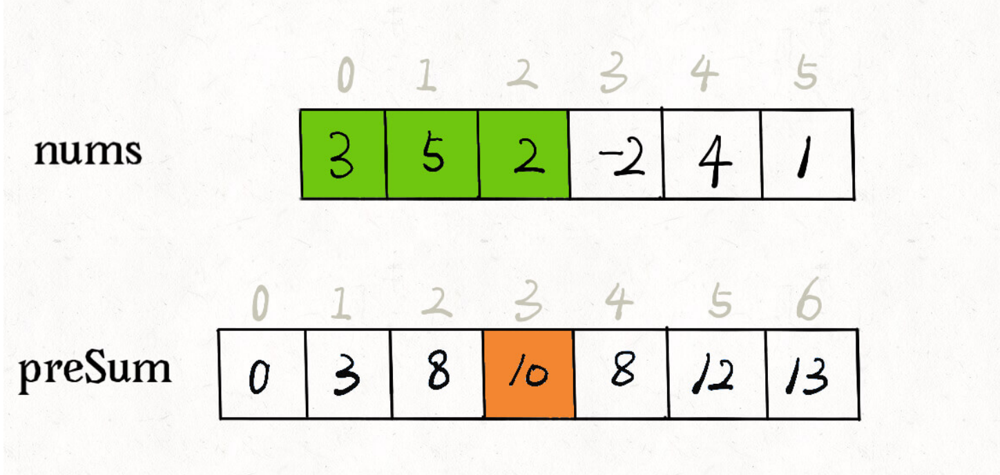

看这个 preSum 数组，如果想求索引区间 [1, 4] 内的所有元素之和，就可以通过 preSum[5] -preSum[1] 得出。 

这样，sumRange 函数仅仅需要做⼀次减法运算，避免了每次进⾏ for 循环调⽤，最坏时间复杂度为常数 O(1)。 

### 二维区域和检索 - 矩阵不可变

⼒扣第 304 题「304. ⼆维区域和检索 - 矩阵不可变」，其实和上⼀题类似，上⼀题是让你计算⼦数组的元素之和，这道题让你计算⼆维矩阵中⼦矩阵的元素之和：https://leetcode.cn/problems/range-sum-query-2d-immutable/

```
给定一个二维矩阵 matrix，以下类型的多个请求：

计算其子矩形范围内元素的总和，该子矩阵的 左上角 为 (row1, col1) ，右下角 为 (row2, col2) 。
实现 NumMatrix 类：

NumMatrix(int[][] matrix) 给定整数矩阵 matrix 进行初始化
int sumRegion(int row1, int col1, int row2, int col2) 返回 左上角 (row1, col1) 、右下角 (row2, col2) 所描述的子矩阵的元素 总和 。
```

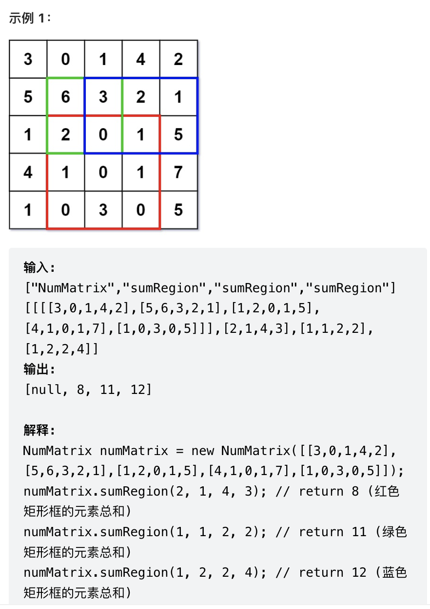

这题的思路和⼀维数组中的前缀和是⾮常类似的，如下图：

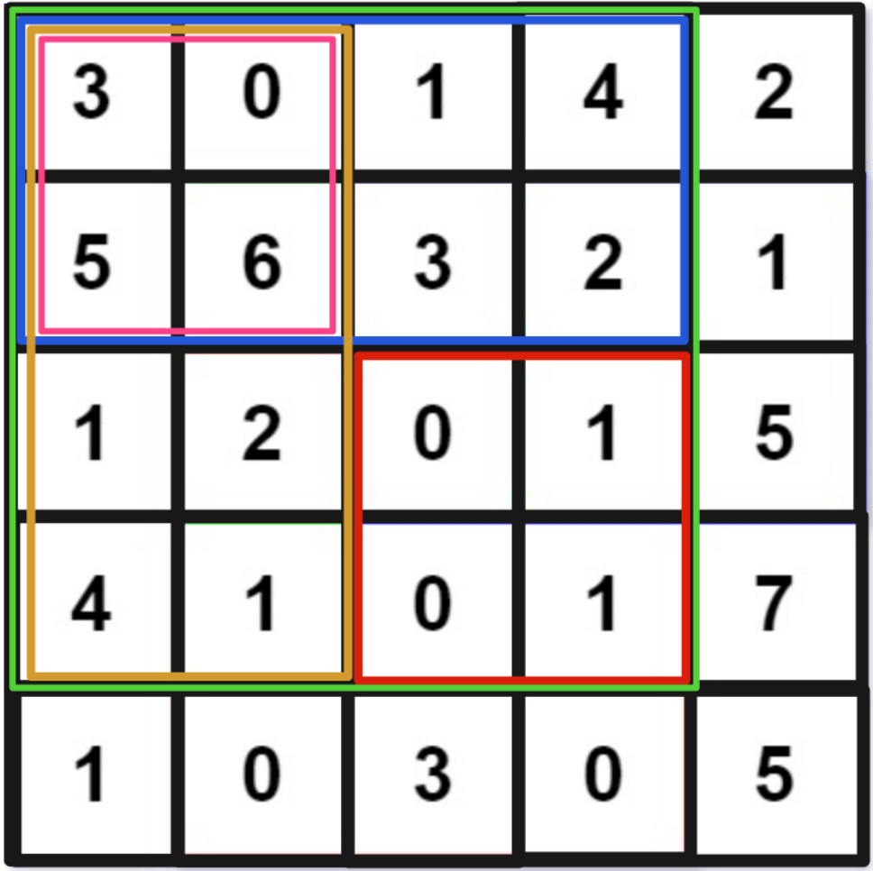

如果想计算红⾊的这个⼦矩阵的元素之和，可以⽤绿⾊矩阵减去蓝⾊矩阵减去橙⾊矩阵最后加上粉⾊矩阵，⽽绿蓝橙粉这四个矩阵有⼀个共同的特点，就是左上⻆就是 (0, 0) 原点。 

可以维护⼀个⼆维 preSum 数组，专⻔记录以原点为顶点的矩阵的元素之和，就可以⽤⼏次加减运算算出任何⼀个⼦矩阵的元素和：

```javascript
class NumMatrix {
// preSum[i][j] 记录矩阵 [0, 0, i, j] 的元素和
private int[][] preSum;
public NumMatrix(int[][] matrix) {
int m = matrix.length, n = matrix[0].length;
if (m == 0 || n == 0) return;
// 构造前缀和矩阵
 preSum = new int[m + 1][n + 1];
labuladong 的刷题秘籍 labuladong的刷题三件套
34 / 604
for (int i = 1; i <= m; i++) {
for (int j = 1; j <= n; j++) {
// 计算每个矩阵 [0, 0, i, j] 的元素和
 preSum[i][j] = preSum[i-1][j] + preSum[i][j-1] + matrix[i
- 1][j - 1] - preSum[i-1][j-1];
 }
 }
 }
// 计算⼦矩阵 [x1, y1, x2, y2] 的元素和
public int sumRegion(int x1, int y1, int x2, int y2) {
// ⽬标矩阵之和由四个相邻矩阵运算获得
return preSum[x2+1][y2+1] - preSum[x1][y2+1] - preSum[x2+1][y1] +
preSum[x1][y1];
 }
}
```

这样，sumRegion 函数的复杂度也⽤前缀和技巧优化到了 O(1)。 

### 和为 K 的子数组

⼒扣第 560 题「和为 K 的⼦数组」： 

```
给你一个整数数组 nums 和一个整数 k ，请你统计并返回 该数组中和为 k 的子数组的个数 。
```

示例：

```
输入：nums = [1,1,1], k = 2
输出：2
输入：nums = [1,2,3], k = 3
输出：2
```

提示：

```
1 <= nums.length <= 2 * 104
-1000 <= nums[i] <= 1000
-107 <= k <= 107
```

那我把所有⼦数组都穷举出来，算它们的和，看看谁的和等于 k 不就⾏了，借助前缀和技巧很容易写出⼀个 

解法：

```java
int subarraySum(int[] nums, int k) {
int n = nums.length;
// 构造前缀和
int[] preSum = new int[n + 1];
 preSum[0] = 0; 
for (int i = 0; i < n; i++)
 preSum[i + 1] = preSum[i] + nums[i];
int res = 0;
// 穷举所有⼦数组
for (int i = 1; i <= n; i++)
for (int j = 0; j < i; j++)
// ⼦数组 nums[j..i-1] 的元素和
if (preSum[i] - preSum[j] == k)
 res++;
return res;
}
```

这个解法的时间复杂度 O(N^2) 空间复杂度 O(N)，并不是最优的解法。不过通过这个解法理解了前缀和数组的⼯作原理之后，可以使⽤⼀些巧妙的办法把时间复杂度进⼀步降低。 

优化的思路是：我直接记录下有⼏个 **preSum[j]** 和 **preSum[i] - k** 相等，直接更新结果，就避免了内层 的 for 循环。我们可以⽤哈希表，在记录前缀和的同时记录该前缀和出现的次数。

```java
int subarraySum(int[] nums, int k) {
int n = nums.length;
// map：前缀和 -> 该前缀和出现的次数
 HashMap<Integer, Integer> 
 preSum = new HashMap<>();
// base case
 preSum.put(0, 1);
int res = 0, sum0_i = 0;
for (int i = 0; i < n; i++) {
 sum0_i += nums[i];
// 这是我们想找的前缀和 nums[0..j]
int sum0_j = sum0_i - k;
// 如果前⾯有这个前缀和，则直接更新答案
if (preSum.containsKey(sum0_j))
 res += preSum.get(sum0_j);
// 把前缀和 nums[0..i] 加⼊并记录出现次数
 preSum.put(sum0_i, 
 preSum.getOrDefault(sum0_i, 0) + 1);
 }
return res;
}
```

这样，就把时间复杂度降到了 O(N)，是最优解法了。

## 小而美的算法技巧：差分数组

前缀和主要适⽤的场景是原始数组不会被修改的情况下，频繁查询某个区间的累加和。 

前缀和主要适⽤的场景是原始数组不会被修改的情况下，频繁查询某个区间的累加和。

差分数组的主要适⽤场景是频繁对原始数组的某个区间的元素进⾏增减。 

⽐如说，我给你输⼊⼀个数组 nums，然后⼜要求给区间 nums[2..6] 全部加 1，再给 nums[3..9] 全部减 3，再给 nums[0..4] 全部加 2，再给... 

⼀通操作猛如⻁，然后问你，最后 nums 数组的值是什么？ 

差分数组的技巧，类似前缀和技巧构造的 prefix 数组，先对 nums 数组构造⼀个 diff 差分数组，**diff[i]** 就是 **nums[i]** 和 **nums[i-1]** 之差。

通过这个 diff 差分数组是可以反推出原始数组 nums 的。

这样构造差分数组 **diff**，就可以快速进⾏区间增减的操作，如果你想对区间 nums[i..j] 的元素全部加 3，那么只需要让 diff[i] += 3，然后再让 diff[j+1] -= 3 即可。

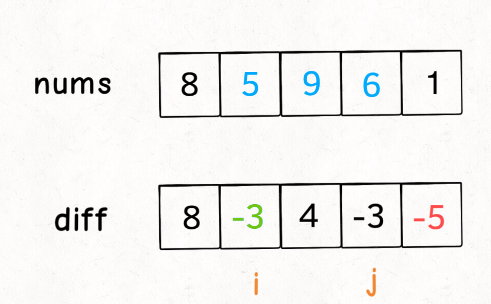

### 算法实践

#### 370.区间加法

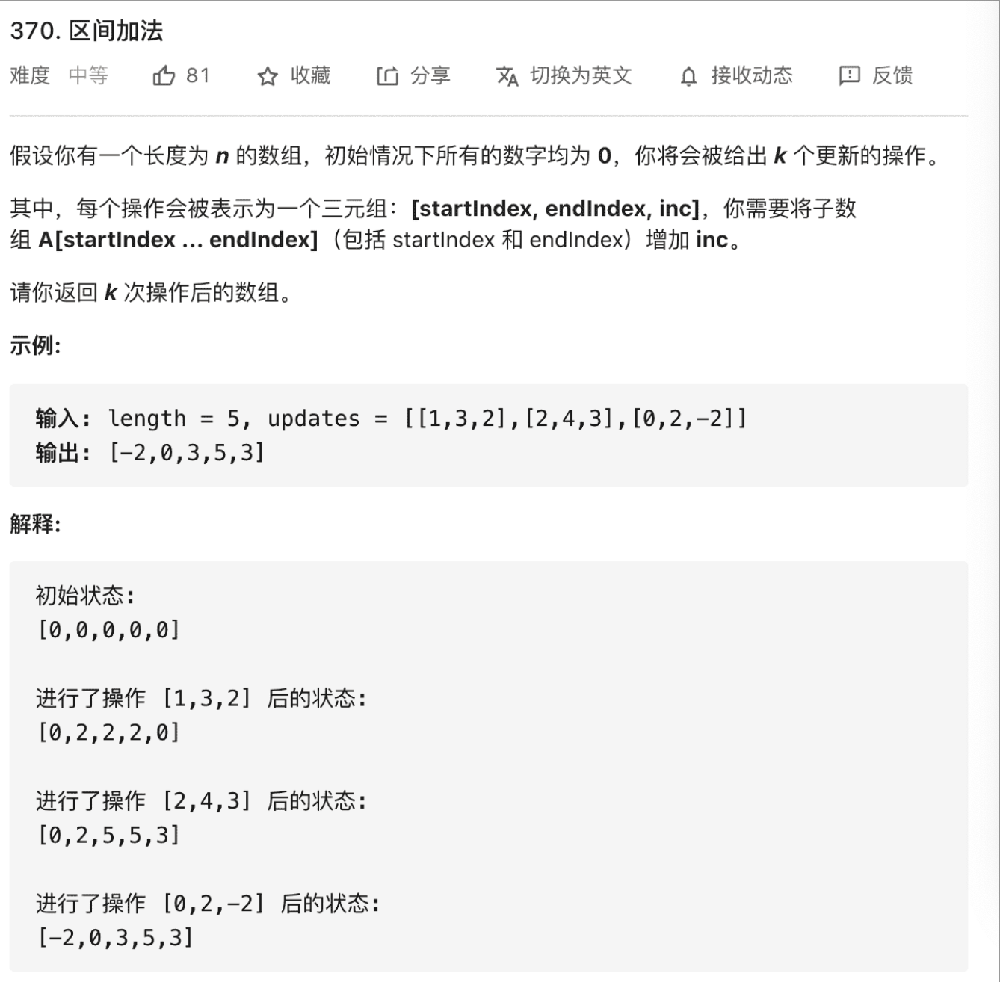

解决问题：

```java
// 差分数组⼯具类
class Difference {
// 差分数组
private int[] diff;
/* 输⼊⼀个初始数组，区间操作将在这个数组上进⾏ */
public Difference(int[] nums) {
assert nums.length > 0;
 diff = new int[nums.length];
// 根据初始数组构造差分数组
 diff[0] = nums[0];
for (int i = 1; i < nums.length; i++) {
 diff[i] = nums[i] - nums[i - 1];
 }
 }
/* 给闭区间 [i,j] 增加 val（可以是负数）*/
public void increment(int i, int j, int val) {
 diff[i] += val;
if (j + 1 < diff.length) {
 diff[j + 1] -= val;
 }
  }
/* 返回结果数组 */
public int[] result() {
int[] res = new int[diff.length];
// 根据差分数组构造结果数组
 res[0] = diff[0];
for (int i = 1; i < diff.length; i++) {
 res[i] = res[i - 1] + diff[i];
 }
return res;
 }
}
```

```java
int[] getModifiedArray(int length, int[][] updates) {
// nums 初始化为全 0
int[] nums = new int[length];
// 构造差分解法
 Difference df = new Difference(nums);
for (int[] update : updates) {
int i = update[0];
int j = update[1];
int val = update[2];
 df.increment(i, j, val);
 }
 return df.result();
}
```

#### 1109.航班预订统计

https://leetcode.cn/problems/corporate-flight-bookings/

```
这里有 n 个航班，它们分别从 1 到 n 进行编号。

有一份航班预订表 bookings ，表中第 i 条预订记录 bookings[i] = [firsti, lasti, seatsi] 意味着在从 firsti 到 lasti （包含 firsti 和 lasti ）的 每个航班 上预订了 seatsi 个座位。

请你返回一个长度为 n 的数组 answer，里面的元素是每个航班预定的座位总数。
```

示例1:

```
输入：bookings = [[1,2,10],[2,3,20],[2,5,25]], n = 5
输出：[10,55,45,25,25]
解释：
航班编号        1   2   3   4   5
预订记录 1 ：   10  10
预订记录 2 ：       20  20
预订记录 3 ：       25  25  25  25
总座位数：      10  55  45  25  25
因此，answer = [10,55,45,25,25]
```

题目翻译一下：给你输⼊⼀个⻓度为 n 的数组 nums，其中所有元素都是 0。再给你输⼊⼀个 bookings，⾥⾯是若⼲三元组(i,j,k)，每个三元组的含义就是要求你给 nums 数组的闭区间 [i-1,j-1] 中所有元素都加上 k。请你返回最后的 nums 数组是多少？ 

解决：

```java
class Solution {
    public int[] corpFlightBookings(int[][] bookings, int n) {
        int[] data = new int[n];
        int[] diff = new int[n];
        for (int i = 0; i<bookings.length;i++){
            int[] booking = bookings[i];
            int start = booking[0];
            int end = booking[1];
            int val = booking[2];
            diff[start-1] += val;
            if (end<diff.length){
                diff[end] -= val;
            }
        }
        int[] result = new int[n];
        result[0] = diff[0];
        for (int i = 1; i<result.length;i++){
            result[i] = result[i-1]+diff[i];
        }
        return result;
    }
}
```

#### 1094.拼车

https://leetcode.cn/problems/car-pooling/

```
车上最初有 capacity 个空座位。车 只能 向一个方向行驶（也就是说，不允许掉头或改变方向）

给定整数 capacity 和一个数组 trips ,  trip[i] = [numPassengersi, fromi, toi] 表示第 i 次旅行有 numPassengersi 乘客，接他们和放他们的位置分别是 fromi 和 toi 。这些位置是从汽车的初始位置向东的公里数。

当且仅当你可以在所有给定的行程中接送所有乘客时，返回 true，否则请返回 false。
```

示例1:

```
输入：trips = [[2,1,5],[3,3,7]], capacity = 4
输出：false
```

提示：

```
1 <= trips.length <= 1000
trips[i].length == 3
1 <= numPassengersi <= 100
0 <= fromi < toi <= 1000
1 <= capacity <= 105
```

差分数组技巧了：**trips[i]** 代表着⼀组区间操作，旅客的上⻋和下⻋就相当于数组的区间加减；只要结果数组中的元素都⼩于 **capacity**，就说明可以不超载运输所有旅客。

根据 1 <= trips.length <= 1000，所以车站的个数最多为 1000，那么差分数组长度可以直接设置为 1001。

解决：

```java
class Solution {
    public boolean carPooling(int[][] trips, int capacity) {
        int[] data = new int[1001];
        int[] diff = new int[1001];
        int maxlength = 0;
        for (int i = 0; i<trips.length;i++){
            int[] trip = trips[i];
            int value = trip[0];
            int from = trip[1];
            int to = trip[2];
            if(to > maxlength){
                maxlength = to;
            }
            diff[from] += value;
            if (to<diff.length){
                diff[to] -= value;
            }
        }
        int[] result = new int[maxlength+1];
        for (int i =0;i<maxlength+1;i++){
            if (i == 0){
               result[0] = diff[0]; 
            } else {
                result[i] = result[i-1] + diff[i];
            }
            if (result[i] > capacity){
                return false;
            }
        }
        return true;
    }
}
```

## 我写了首诗，把滑动窗口算法变成了默写题 47

滑动窗⼝算法技巧的思路⾮常简单，就是维护⼀个窗⼝，不断滑动，然后更新答案么。

其实困扰⼤家的，不是算法的思路，⽽是各种细节问题。⽐如说如何向窗⼝中添加新元素，如何缩⼩窗⼝，在窗⼝滑动的哪个阶段更新结果。

滑动窗口算法的代码框架：

```java
/* 滑动窗⼝算法框架 */
void slidingWindow(string s, string t) {
unordered_map<char, int> need, window;
for (char c : t) need[c]++;
int left = 0, right = 0;
int valid = 0; 
while (right < s.size()) {
// c 是将移⼊窗⼝的字符
char c = s[right];
// 右移窗⼝
 right++;
// 进⾏窗⼝内数据的⼀系列更新
 ...
/*** debug 输出的位置 ***/
printf("window: [%d, %d)\n", left, right);
/********************/
// 判断左侧窗⼝是否要收缩
while (window needs shrink) {
// d 是将移出窗⼝的字符
char d = s[left];
// 左移窗⼝
 left++;
// 进⾏窗⼝内数据的⼀系列更新
 ...
 }
 }
}
```

其中两处 **...** 表示的更新窗⼝数据的地⽅，到时候你直接往⾥⾯填就⾏了。

### 最小覆盖子串-LeetCode 76

```
给你一个字符串 s 、一个字符串 t 。返回 s 中涵盖 t 所有字符的最小子串。如果 s 中不存在涵盖 t 所有字符的子串，则返回空字符串 "" 。

 

注意：

对于 t 中重复字符，我们寻找的子字符串中该字符数量必须不少于 t 中该字符数量。
如果 s 中存在这样的子串，我们保证它是唯一的答案。
```

示例：

```
输入：s = "ADOBECODEBANC", t = "ABC"
输出："BANC"
```

就是说要在 S(source) 中找到包含 T(target) 中全部字⺟的⼀个⼦串，且这个⼦串⼀定是所有可能⼦串中最短的。

滑动窗⼝算法的思路是这样： 

1、我们在字符串 S 中使⽤双指针中的左右指针技巧，初始化 left = right = 0，把索引左闭右开区间

[left, right) 称为⼀个「窗⼝」。 

2、我们先不断地增加 right 指针扩⼤窗⼝ [left, right)，直到窗⼝中的字符串符合要求（包含了 T 中 

的所有字符）。 

3、此时，我们停⽌增加 right，转⽽不断增加 left 指针缩⼩窗⼝ [left, right)，直到窗⼝中的字符串 

不再符合要求（不包含 T 中的所有字符了）。同时，每次增加 left，我们都要更新⼀轮结果。 

4、重复第 2 和第 3 步，直到 right 到达字符串 S 的尽头。 

这个思路其实也不难，第 2 步相当于在寻找⼀个「可⾏解」，然后第 3 步在优化这个「可⾏解」，最终找到 

最优解，也就是最短的覆盖⼦串。左右指针轮流前进，窗⼝⼤⼩增增减减，窗⼝不断向右滑动，这就是「滑动窗⼝」这个名字的来历。 

开始套模板，只需要思考以下四个问题： 

1、当移动 right 扩⼤窗⼝，即加⼊字符时，应该更新哪些数据？ 

2、什么条件下，窗⼝应该暂停扩⼤，开始移动 left 缩⼩窗⼝？ 

3、当移动 left 缩⼩窗⼝，即移出字符时，应该更新哪些数据？

4、我们要的结果应该在扩⼤窗⼝时还是缩⼩窗⼝时进⾏更新？ 

如果⼀个字符进⼊窗⼝，应该增加 window 计数器；如果⼀个字符将移出窗⼝的时候，应该减少 window 计 

数器；当 valid 满⾜ need 时应该收缩窗⼝；应该在收缩窗⼝的时候更新最终结果。 

解决：

```java
class Solution {
    public String minWindow(String s, String t) {
  Map<Character,Integer> need = new HashMap<>();
        Map<Character,Integer> window = new HashMap<>();
        int num = 0;
        int left = 0;
        int right = 0;
        String result = "";
        int resultLength = s.length()+1;
        char[] schar = s.toCharArray();
        char[] tchar = t.toCharArray();
        for (int i = 0; i<tchar.length;i++){
            char key = tchar[i];
            need.put(key,need.getOrDefault(key,0)+1);
        }
       while (right < schar.length){
         	// 进入窗口
           char key = schar[right];
         		// 窗口内数据的一系列更新
           if (need.containsKey(key)) {
               window.put(key, window.getOrDefault(key, 0) + 1);
               if (window.get(key).equals(need.get(key))){
                   num++;
               }
           }
         	 // 判断左侧窗口是否要收缩
           while (num == need.size()){
                   char leftKey = schar[left];
                   if (need.containsKey(leftKey)){
                     	 // 更新左移的一系列更新
                       if(window.get(leftKey).equals(need.get(leftKey))){
                           num--;
                         	// 更新最小子串
                          String str = s.substring(left,right+1);
                          if (str.length() < resultLength){
                              result = str;
                              resultLength = result.length();
                          }
                       }
                        window.put(leftKey,window.get(leftKey)-1);
                   }
             			 // 左移窗口
                   left++;
           }
					 // 右移窗口
           right++;
       }
        return result;
    }
}
```

### 字符串排列 - LeetCode 567

```
给你两个字符串 s1 和 s2 ，写一个函数来判断 s2 是否包含 s1 的排列。如果是，返回 true ；否则，返回 false 。

换句话说，s1 的排列之一是 s2 的 子串 。
```

示例：

```
输入：s1 = "ab" s2 = "eidbaooo"
输出：true
解释：s2 包含 s1 的排列之一 ("ba").
```

解决：

```java
class Solution {
    public boolean checkInclusion(String s1, String s2) {
        Map<Character,Integer> need = new HashMap<>();
        Map<Character,Integer> window = new HashMap<>();
        for(int i = 0 ;i <s1.length();i++){
            need.put(s1.charAt(i),need.getOrDefault(s1.charAt(i),0)+1);
        }
        int count = 0;
        int left = 0;
        int right = 0;
        while(right < s2.length()){
            char rightkey = s2.charAt(right);
            if (need.containsKey(rightkey)){
                window.put(rightkey,window.getOrDefault(rightkey,0)+1);
                if(window.get(rightkey).equals(need.get(rightkey))){
                    count++;
                }
            }
            while (count == need.size()){
                char leftkey = s2.charAt(left);
                if (window.containsKey(leftkey)){
                    if(window.get(leftkey).equals(need.get(leftkey))){
                        count--;
                        int length = right - left+1;
                        if (length == s1.length()){
                            return true;
                        }
                    }
                    window.put(leftkey,window.getOrDefault(leftkey,0)-1);
                }
                left++;
            }
            right++;
        }
        return false;
    }
}
```

### 找所有字母异位词 - LeetCode 438

```
给定两个字符串 s 和 p，找到 s 中所有 p 的 异位词 的子串，返回这些子串的起始索引。不考虑答案输出的顺序。

异位词 指由相同字母重排列形成的字符串（包括相同的字符串）。
```

示例：

```
输入: s = "cbaebabacd", p = "abc"
输出: [0,6]
解释:
起始索引等于 0 的子串是 "cba", 它是 "abc" 的异位词。
起始索引等于 6 的子串是 "bac", 它是 "abc" 的异位词。
```

解决：

```java
class Solution {
    public List<Integer> findAnagrams(String s, String p) {
        Map<Character,Integer> need = new HashMap<>();
        Map<Character,Integer> window = new HashMap<>();
        int count = 0;
        int left = 0;
        int right = 0;
        List<Integer> result = new ArrayList<>();
        for(int i = 0; i<p.length();i++){
            char key = p.charAt(i);
            need.put(key,need.getOrDefault(key,0)+1);
        }

        while(right < s.length()){
          	 // 移动右指针
             char rightkey = s.charAt(right);
          	 // 更新窗口数据
             if(need.containsKey(rightkey)){
                window.put(rightkey,window.getOrDefault(rightkey,0)+1);
                if(window.get(rightkey).equals(need.get(rightkey))){
                    count++;
                }
             }
          	 // 可以移动左指针了
             while(count == need.size()){
                 char leftKey = s.charAt(left);
                 if (need.containsKey(leftKey)){
                    int length = right-left+1;
                   	// 找到答案
                    if (length == p.length()){
                        result.add(left);
                    }
                   	// 更新移动左指针的数据
                    if (window.get(leftKey).equals(need.get(leftKey))){
                        count--;
                    }
                    window.put(leftKey,window.get(leftKey)-1);
                 }
                 left++;
             }
            right++;
        }
        return result;
    }
}
```

### 最长无重复子串-LeetCode 3

```
给定一个字符串 s ，请你找出其中不含有重复字符的 最长子串 的长度。
```

示例：

```
输入: s = "abcabcbb"
输出: 3 
解释: 因为无重复字符的最长子串是 "abc"，所以其长度为 3。
```

解决：

```java
class Solution {
    public int lengthOfLongestSubstring(String s) {
        Map<Character,Integer> window = new HashMap<>();
        int left = 0;
        int right = 0;
        int result = 0;
        while(right < s.length()){
            char rightKey = s.charAt(right);
            if(window.containsKey(rightKey)){
                int length = right-left;
                if (length > result){
                    result = length;
                }
                int index = window.get(rightKey);
                for(int i = left;i<=index;i++){
                    char leftKey = s.charAt(i);
                    if (window.containsKey(leftKey)){
                        window.remove(leftKey);
                    }
                }
                left = index+1;
            }
            window.put(rightKey,right);
            right++;
        }
      	// 最后一个结果
        int length = right-left;
        if(length > result){
            result = length;
        }
        return result;
    }
}
```

## 我写了⾸诗，把⼆分搜索变成了默写题  61

⼏个最常⽤的⼆分查找场景：寻找⼀个数、寻找左侧边界、寻找右侧边界。

### 二分查找框架

```java
int binarySearch(int[] nums, int target) {
int left = 0, right = ...;
while(...) {
int mid = left + (right - left) / 2;
if (nums[mid] == target) {
 ...
 } else if (nums[mid] < target) {
 left = ...
 } else if (nums[mid] > target) {
 right = ...
 }
 }
return ...;
}
```

分析⼆分查找的⼀个技巧是：不要出现 else，⽽是把所有情况⽤ else if 写清楚，这样可以清楚地展现所有细节。

另外声明⼀下，计算 mid 时需要防⽌溢出，代码中 left + (right - left) / 2 就和 (left +right) / 2 的结果相同，但是有效防⽌了 left 和 right 太⼤直接相加导致溢出。 

### 寻找一个数（基本的二分搜索）

搜索⼀个数，如果存在，返回其索引，否则返回 -1。

```java
int binarySearch(int[] nums, int target) {
int left = 0; 
int right = nums.length - 1; // 注意
while(left <= right) {
int mid = left + (right - left) / 2;
if(nums[mid] == target)
return mid; 
else if (nums[mid] < target)
 left = mid + 1; // 注意
else if (nums[mid] > target)
 right = mid - 1; // 注意
 }
return -1; }
```

1、为什么 while 循环的条件中是 <=，⽽不是 <？ 

答：因为初始化 right 的赋值是 nums.length - 1，即最后⼀个元素的索引，⽽不是 nums.length。 

这⼆者可能出现在不同功能的⼆分查找中，区别是：前者相当于两端都闭区间 [left, right]，后者相当于左闭右开区间 [left, right)，因为索引⼤⼩为 nums.length 是越界的。 

这个算法中使⽤的是前者 [left, right] 两端都闭的区间。这个区间其实就是每次进⾏搜索的区间。

2、为什么 **left = mid + 1**，**right = mid - 1**？我看有的代码是 **right = mid** 或者 **left = mid**， 没有这些加加减减，到底怎么回事，怎么判断？ 

因为 **mid** 已经搜索过，应该从搜索区间中去除。 

3、此算法有什么缺陷？ 

答：⾄此，你应该已经掌握了该算法的所有细节，以及这样处理的原因。但是，这个算法存在局限性。 

⽐如说给你有序数组 nums = [1,2,2,2,3]，target 为 2，此算法返回的索引是 2，没错。但是如果我想 得到 target 的左侧边界，即索引 1，或者我想得到 target 的右侧边界，即索引 3，这样的话此算法是⽆法处理的。 

这样的需求很常⻅，你也许会说，找到⼀个 target，然后向左或向右线性搜索不⾏吗？可以，但是不好，因为这样难以保证⼆分查找对数级的复杂度了。 

### 寻找左侧边界的二分搜索

```java
int left_bound(int[] nums, int target) {
if (nums.length == 0) return -1;
int left = 0;
int right = nums.length; // 注意
while (left < right) { // 注意
int mid = left + (right - left) / 2;
if (nums[mid] == target) {
 right = mid;
 } else if (nums[mid] < target) {
 left = mid + 1;
 } else if (nums[mid] > target) {
 right = mid; // 注意
 }
 }
return left;
}
```

1、为什么 while 中是 **<** ⽽不是 **<=**? 

答：⽤相同的⽅法分析，因为 right = nums.length ⽽不是 nums.length - 1。因此每次循环的「搜索区间」是 [left, right) 左闭右开。

while(left < right) 终⽌的条件是 left == right，此时搜索区间 [left, left) 为空，所以可以正确终⽌。 

2、为什么没有返回 -1 的操作？如果 **nums** 中不存在 **target** 这个值，怎么办？ 

函数的返回值（即 left 变量的值）取值区间是闭区间 [0, nums.length]，所以我们简单添加两⾏代码就能在正确的时候 return -1：

```java
while (left < right) {
//...
}
// target ⽐所有数都⼤
if (left == nums.length) return -1;
// 类似之前算法的处理⽅式
return nums[left] == target ? left : -1;
```

3、为什么 **left = mid + 1**，**right = mid** ？和之前的算法不⼀样？ 

关键在于对于 nums[mid] == target 这种情况的处理：

```java
if (nums[mid] == target)
 right = mid;
```

可⻅，找到 target 时不要⽴即返回，⽽是缩⼩「搜索区间」的上界 right，在区间 [left, mid) 中继续搜 索，即不断向左收缩，达到锁定左侧边界的⽬的。 

5、为什么返回 **left** ⽽不是 **right**？ 

答：都是⼀样的，因为 while 终⽌的条件是 left == right。 

6、能不能想办法把 **right** 变成 **nums.length - 1**，也就是继续使⽤两边都闭的「搜索区间」？这样就可以和第⼀种⼆分搜索在某种程度上统⼀起来了。

答：当然可以，只要你明⽩了「搜索区间」这个概念，就能有效避免漏掉元素，随便你怎么改都⾏。下⾯严格根据逻辑来修改：  

因为你⾮要让搜索区间两端都闭，所以 right 应该初始化为 nums.length - 1，while 的终⽌条件应该是 left == right + 1，也就是其中应该⽤ <=：

```java
int left_bound(int[] nums, int target) {
// 搜索区间为 [left, right]
int left = 0, right = nums.length - 1;
while (left <= right) {
int mid = left + (right - left) / 2;
// if else ...
 }
```

因为搜索区间是两端都闭的，且现在是搜索左侧边界，所以 left 和 right 的更新逻辑如下：

```java
if (nums[mid] < target) {
// 搜索区间变为 [mid+1, right]
 left = mid + 1;
} else if (nums[mid] > target) {
// 搜索区间变为 [left, mid-1]
 right = mid - 1;
} else if (nums[mid] == target) {
// 收缩右侧边界
 right = mid - 1; }
```

由于 while 的退出条件是 left == right + 1，所以当 target ⽐ nums 中所有元素都⼤时，会存在索引越界：因此，最后返回结果的代码应该检查越界情况：

```java
if (left >= nums.length || nums[left] != target)
	return -1;
return left;
```

⾄此，整个算法就写完了，完整代码如下：

```java
int left_bound(int[] nums, int target) {
int left = 0, right = nums.length - 1;
// 搜索区间为 [left, right]
while (left <= right) {
int mid = left + (right - left) / 2;
if (nums[mid] < target) {
// 搜索区间变为 [mid+1, right]
 left = mid + 1;
 } else if (nums[mid] > target) {
// 搜索区间变为 [left, mid-1]
 right = mid - 1;
 } else if (nums[mid] == target) {
// 收缩右侧边界
 right = mid - 1;
 }
 }
// 检查出界情况
if (left >= nums.length || nums[left] != target)
return -1;
return left;
}
```

### 寻找右侧边界的二分查找

类似寻找左侧边界的算法，这⾥也会提供两种写法，还是先写常⻅的左闭右开的写法，只有两处和搜索左侧边界不同，已标注：

```java
int right_bound(int[] nums, int target) {
if (nums.length == 0) return -1;
int left = 0, right = nums.length;
while (left < right) {
int mid = left + (right - left) / 2;
if (nums[mid] == target) {
 left = mid + 1; // 注意
 } else if (nums[mid] < target) {
 left = mid + 1;
 } else if (nums[mid] > target) {
 right = mid;
 }
 }
return left - 1; // 注意 
}
```

1、为什么这个算法能够找到右侧边界？

```java
if (nums[mid] == target) {
 left = mid + 1;
```

当 nums[mid] == target 时，不要⽴即返回，⽽是增⼤「搜索区间」的下界 left，使得区间不断向右收缩，达到锁定右侧边界的⽬的。 

2、为什么最后返回 **left - 1** ⽽不像左侧边界的函数，返回 **left**？⽽且我觉得这⾥既然是搜索右侧边界， 应该返回 **right** 才对。

答：⾸先，while 循环的终⽌条件是 left == right，所以 left 和 right 是⼀样的，你⾮要体现右侧的特点，返回 right - 1 好了。 

⾄于为什么要减⼀，这是搜索右侧边界的⼀个特殊点，关键在这个条件判断：

```
if (nums[mid] == target) {
 left = mid + 1;
// 这样想: mid = left - 1
```

因为我们对 left 的更新必须是 left = mid + 1，就是说 while 循环结束时，nums[left] ⼀定不等于target 了，⽽ nums[left-1] 可能是 target。 

3、为什么没有返回 -1 的操作？如果 **nums** 中不存在 **target** 这个值，怎么办？ 

答：类似之前的左侧边界搜索，因为 while 的终⽌条件是 left == right，就是说 left 的取值范围是 [0,nums.length]，所以可以添加两⾏代码，正确地返回 -1：

```
while (left < right) {
// ...
}
if (left == 0) return -1;
return nums[left-1] == target ? (left-1) : -1;
```

4、是否也可以把这个算法的「搜索区间」也统⼀成两端都闭的形式呢？这样这三个写法就完全统⼀了，以后就可以闭着眼睛写出来了。 

答：当然可以，类似搜索左侧边界的统⼀写法，其实只要改两个地⽅就⾏了：

```
int right_bound(int[] nums, int target) {
int left = 0, right = nums.length - 1;
while (left <= right) {
int mid = left + (right - left) / 2;
if (nums[mid] < target) {
 left = mid + 1;
 } else if (nums[mid] > target) {
  right = mid - 1;
 } else if (nums[mid] == target) {
// 这⾥改成收缩左侧边界即可
 left = mid + 1;
 }
 }
// 这⾥改为检查 right 越界的情况，⻅下图
if (right < 0 || nums[right] != target)
return -1;
return right;
}
```

当 target ⽐所有元素都⼩时，right 会被减到 -1，所以需要在最后防⽌越界。 

### 逻辑统计

第⼀个，最基本的⼆分查找算法： 

```
因为我们初始化 right = nums.length - 1 所以决定了我们的「搜索区间」是 [left, right]
所以决定了 while (left <= right)
同时也决定了 left = mid+1 和 right = mid-1
因为我们只需找到⼀个 target 的索引即可
所以当 nums[mid] == target 时可以⽴即返回
```

第⼆个，寻找左侧边界的⼆分查找： 

```
因为我们初始化 right = nums.length
所以决定了我们的「搜索区间」是 [left, right)
所以决定了 while (left < right)
同时也决定了 left = mid + 1 和 right = mid
因为我们需找到 target 的最左侧索引 所以当 nums[mid] == target 时不要⽴即返回 ⽽要收紧右侧边界以锁定左侧边界
```

第三个，寻找右侧边界的⼆分查找：

```
因为我们初始化 right = nums.length
所以决定了我们的「搜索区间」是 [left, right)
所以决定了 while (left < right)
同时也决定了 left = mid + 1 和 right = mid
因为我们需找到 target 的最右侧索引 所以当 nums[mid] == target 时不要⽴即返回 ⽽要收紧左侧边界以锁定右侧边界 ⼜因为收紧左侧边界时必须 left = mid + 1 所以最后⽆论返回 left 还是 right，必须减⼀
```

对于寻找左右边界的⼆分搜索，常⻅的⼿法是使⽤左闭右开的「搜索区间」，我们还根据逻辑将「搜索区间」全都统⼀成了两端都闭，便于记忆，只要修改两处即可变化出三种写法：

```java
int binary_search(int[] nums, int target) {
int left = 0, right = nums.length - 1; 
while(left <= right) {
int mid = left + (right - left) / 2;
if (nums[mid] < target) {
 left = mid + 1;
 } else if (nums[mid] > target) {
 right = mid - 1; 
 } else if(nums[mid] == target) {
// 直接返回
return mid;
 }
 }
// 直接返回
return -1; }
```

```java
int left_bound(int[] nums, int target) {
int left = 0, right = nums.length - 1;
while (left <= right) {
int mid = left + (right - left) / 2;
if (nums[mid] < target) {
 left = mid + 1;
 } else if (nums[mid] > target) {
 right = mid - 1;
 } else if (nums[mid] == target) {
// 别返回，锁定左侧边界
 right = mid - 1;
 }
 }
// 最后要检查 left 越界的情况
if (left >= nums.length || nums[left] != target)
return -1;
return left;
}
```

```java
int right_bound(int[] nums, int target) {
int left = 0, right = nums.length - 1;
while (left <= right) {
int mid = left + (right - left) / 2;
if (nums[mid] < target) {
 left = mid + 1;
 } else if (nums[mid] > target) {
 right = mid - 1;
 } else if (nums[mid] == target) {
// 别返回，锁定右侧边界
 left = mid + 1;
 }
 }
// 最后要检查 right 越界的情况
if (right < 0 || nums[right] != target)
return -1;
return right;
}
```

1、分析⼆分查找代码时，不要出现 else，全部展开成 else if ⽅便理解。 

2、注意「搜索区间」和 while 的终⽌条件，如果存在漏掉的元素，记得在最后检查。 

3、如需定义左闭右开的「搜索区间」搜索左右边界，只要在 nums[mid] == target 时做修改即可，搜索右侧时需要减⼀。 

4、如果将「搜索区间」全都统⼀成两端都闭，好记，只要稍改 nums[mid] == target 条件处的代码和返回的逻辑即可，推荐拿⼩本本记下，作为⼆分搜索模板。 

## 二分搜索题型套路分析

但是前⽂总结的⼆分搜索代码框架仅仅局限于「在有序数组中搜索指定元素」这个基本场景，具体的算法问 题没有这么直接，可能你都很难看出这个问题能够⽤到⼆分搜索。 

### 原始的二分搜索代码

⼆分搜索的原型就是在「有序数组」中搜索⼀个元素 target，返回该元素对应的索引。 

如果该元素不存在，那可以返回⼀个什么特殊值，这种细节问题只要微调算法实现就可实现。

还有⼀个重要的问题，如果「有序数组」中存在多个 target 元素，那么这些元素肯定挨在⼀起，这⾥就涉 

及到算法应该返回最左侧的那个 target 元素的索引还是最右侧的那个 target 元素的索引，也就是所谓的 「搜索左侧边界」和「搜索右侧边界」，这个也可以通过微调算法的代码来实现。 

在具体的算法问题中，常⽤到的是「搜索左侧边界」和「搜索右侧边界」这两种场景，很少有让你单独「搜索⼀个元素」。 

「搜索左侧边界」的⼆分搜索算法的具体代码实现如下：

```java
// 搜索左侧边界
int left_bound(int[] nums, int target) {
if (nums.length == 0) return -1;
int left = 0, right = nums.length;
while (left < right) {
int mid = left + (right - left) / 2;
if (nums[mid] == target) {
// 当找到 target 时，收缩右侧边界
 right = mid;
 } else if (nums[mid] < target) {
 left = mid + 1;
 } else if (nums[mid] > target) {
 right = mid;
 }
 }
return left;
}
```

「搜索右侧边界」的⼆分搜索算法的具体代码实现如下：

```java
// 搜索右侧边界
int right_bound(int[] nums, int target) {
if (nums.length == 0) return -1;
int left = 0, right = nums.length;
while (left < right) {
int mid = left + (right - left) / 2;
if (nums[mid] == target) {
// 当找到 target 时，收缩左侧边界
 left = mid + 1;
 } else if (nums[mid] < target) {
 left = mid + 1;
 } else if (nums[mid] > target) {
 right = mid;
 }
 }
return left - 1; }
```

### 二分搜索问题的泛化

什么问题可以运⽤⼆分搜索算法技巧？

⾸先，你要从题⽬中抽象出⼀个⾃变量 **x**，⼀个关于 **x** 的函数 **f(x)**，以及⼀个⽬标值 **target**。 

同时，x, f(x), target 还要满⾜以下条件： 

1、**f(x)** 必须是在 **x** 上的单调函数（单调增单调减都可以）。 

2、题⽬是让你计算满⾜约束条件 **f(x) == target** 时的 **x** 的值。 

上述规则听起来有点抽象，来举个具体的例⼦： 

给你⼀个升序排列的有序数组 nums 以及⼀个⽬标元素 target，请你计算 target 在数组中的索引位置， 如果有多个⽬标元素，返回最⼩的索引。 

这就是「搜索左侧边界」这个基本题型，但这⾥⾯ x, f(x), target 分别是什么呢？

我们可以把数组中元素的索引认为是⾃变量 x，函数关系 f(x) 就可以这样设定：

```java
// 函数 f(x) 是关于⾃变量 x 的单调递增函数
// ⼊参 nums 是不会改变的，所以可以忽略，不算⾃变量
int f(int x, int[] nums) {
return nums[x];
}
```

其实这个函数 f 就是在访问数组 nums，因为题⽬给我们的数组 nums 是升序排列的，所以函数 f(x) 就是在 x 上单调递增的函数。 

最后，题⽬让我们求什么来着？是不是让我们计算元素 target 的最左侧索引？ 

是不是就相当于在问我们「满⾜ f(x) == target 的 x 的最⼩值是多少」？ 

算法代码如下：

```java
// 函数 f 是关于⾃变量 x 的单调递增函数
int f(int x, int[] nums) {
return nums[x];
}
int left_bound(int[] nums, int target) {
if (nums.length == 0) return -1;
int left = 0, right = nums.length;
while (left < right) {
int mid = left + (right - left) / 2;
if (f(mid, nums) == target) {
// 当找到 target 时，收缩右侧边界
 right = mid;
 } else if (f(mid, nums) < target) {
 left = mid + 1;
 } else if (f(mid, nums) > target) {
 right = mid;
 }
 }
return left;
}
```

### 运用二分搜索的套路框架

想要运⽤⼆分搜索解决具体的算法问题，可以从以下代码框架着⼿思考：

```java
// 函数 f 是关于⾃变量 x 的单调函数
int f(int x) {
// ...
}
// 主函数，在 f(x) == target 的约束下求 x 的最值
int solution(int[] nums, int target) {
if (nums.length == 0) return -1;
// 问⾃⼰：⾃变量 x 的最⼩值是多少？
int left = ...;
// 问⾃⼰：⾃变量 x 的最⼤值是多少？
int right = ... + 1;
while (left < right) {
int mid = left + (right - left) / 2;
if (f(mid) == target) {
// 问⾃⼰：题⽬是求左边界还是右边界？
// ...
 } else if (f(mid) < target) {
// 问⾃⼰：怎么让 f(x) ⼤⼀点？
// ...
 } else if (f(mid) > target) {
// 问⾃⼰：怎么让 f(x) ⼩⼀点？
// ...
 }
 }
return left;
}
```

具体来说，想要⽤⼆分搜索算法解决问题，分为以下⼏步： 

1、确定 **x, f(x), target** 分别是什么，并写出函数 **f** 的代码。 

2、找到 **x** 的取值范围作为⼆分搜索的搜索区间，初始化 **left** 和 **right** 变量。 

3、根据题⽬的要求，确定应该使⽤搜索左侧还是搜索右侧的⼆分搜索算法，写出解法代码。 

## 田忌赛马背后的算法决策

到⼒扣第 870 题「优势洗牌」，⼀眼就发现这是⽥忌赛⻢问题的加强版： 

给你输⼊两个⻓度相等的数组 nums1 和 nums2，请你重新组织 nums1 中元素的位置，使得 nums1 的「优 势」最⼤化。 

如果 nums1[i] > nums2[i]，就是说 nums1 在索引 i 上对 nums2[i] 有「优势」。优势最⼤化也就是说 让你重新组织 nums1，尽可能多的让 **nums1[i] > nums2[i]**。 

算法签名如下：

```java
int[] advantageCount(int[] nums1, int[] nums2);
```

⽐如输⼊：

nums1 = [12,24,8,32] nums2 = [13,25,32,11]

你的算法应该返回 [24,32,8,12]，因为这样排列 nums1 的话有三个元素都有「优势」。 

这就像⽥忌赛⻢的情景，**nums1** 就是⽥忌的⻢，**nums2** 就是⻬王的⻢，数组中的元素就是⻢的战⽃⼒，你就是孙膑，展示你真正的技术吧。 

如果⽥忌的⼀号选⼿⽐不过⻬王的⼀号选⼿，那其他⻢肯定是⽩给了，显然这种情况肯定应该⽤⽥忌垫底的⻢去送⼈头，降低⼰⽅损失，保存实⼒，增加接下来⽐赛的胜率。 

但如果⽥忌的⼀号选⼿能⽐得过⻬王的⼀号选⼿，那就和⻬王硬刚好了，反正这把⽥忌可以赢。

将⻬王和⽥忌的⻢按照战⽃⼒排序，然后按照排名⼀⼀对⽐。如果⽥忌的⻢能赢，那就⽐赛，如果赢不了，那就换个垫底的来送⼈头，保存实⼒。 

上述思路的代码逻辑如下：

```java
int n = nums1.length;
sort(nums1); // ⽥忌的⻢
sort(nums2); // ⻬王的⻢
// 从最快的⻢开始⽐
for (int i = n - 1; i >= 0; i--) {
if (nums1[i] > nums2[i]) {
// ⽐得过，跟他⽐
 } else {
// ⽐不过，换个垫底的来送⼈头
 }
}
```

根据这个思路，我们需要对两个数组排序，但是 nums2 中元素的顺序不能改变，因为计算结果的顺序依赖nums2 的顺序，所以不能直接对 nums2 进⾏排序，⽽是利⽤其他数据结构来辅助。 

同时，最终的解法还⽤到前⽂ 双指针技巧汇总 总结的双指针算法模板，⽤以处理「送⼈头」的情况：

```java
int[] advantageCount(int[] nums1, int[] nums2) {
int n = nums1.length;
// 给 nums2 降序排序
 PriorityQueue<int[]> maxpq = new PriorityQueue<>(
 (int[] pair1, int[] pair2) -> { 
return pair2[1] - pair1[1];
 }
 );
for (int i = 0; i < n; i++) {
 maxpq.offer(new int[]{i, nums2[i]});
 }
// 给 nums1 升序排序
 Arrays.sort(nums1);
// nums1[left] 是最⼩值，nums1[right] 是最⼤值
int left = 0, right = n - 1;
int[] res = new int[n];
while (!maxpq.isEmpty()) {
int[] pair = maxpq.poll();
// maxval 是 nums2 中的最⼤值，i 是对应索引
int i = pair[0], maxval = pair[1];
if (maxval < nums1[right]) {
// 如果 nums1[right] 能胜过 maxval，那就⾃⼰上
 res[i] = nums1[right];
 right--;
 } else {
// 否则⽤最⼩值混⼀下，养精蓄锐
 res[i] = nums1[left];
 left++;
 }
 }
return res;
}
```

算法的时间复杂度很好分析，也就是⼆叉堆和排序的复杂度 O(nlogn)。 

## 一文秒杀四道原地修改数据的算法题

我们知道对于数组来说，在尾部插⼊、删除元素是⽐较⾼效的，时间复杂度是 O(1)，但是如果在中间或者开头插⼊、删除元素，就会涉及数据的搬移，时间复杂度为 O(N)，效率较低。 

常数时间删除/查找数组中的任意元素 就讲了⼀种技巧，把待删除元素交换到最后⼀个，然后再删除，就可以避免数据搬移。 

那么这篇⽂章我们换⼀个场景，来讲⼀讲如何在原地修改数组，避免数据的搬移。 

### 有序数组/链表去重-leetcode 26\83

先讲讲如何对⼀个有序数组去重，先看下题⽬：

[26. 删除有序数组中的重复项](https://leetcode.cn/problems/remove-duplicates-from-sorted-array/)

给你一个 升序排列 的数组 nums ，请你 原地 删除重复出现的元素，使每个元素 只出现一次 ，返回删除后数组的新长度。元素的 相对顺序 应该保持 一致 。

不要使用额外的空间，你必须在 **[原地 ](https://baike.baidu.com/item/原地算法)修改输入数组** 并在使用 O(1) 额外空间的条件下完成。

示例1:

```
输入：nums = [1,1,2]
输出：2, nums = [1,2,_]
解释：函数应该返回新的长度 2 ，并且原数组 nums 的前两个元素被修改为 1, 2 。不需要考虑数组中超出新长度后面的元素。
```

示例2:

```
输入：nums = [0,0,1,1,1,2,2,3,3,4]
输出：5, nums = [0,1,2,3,4]
解释：函数应该返回新的长度 5 ， 并且原数组 nums 的前五个元素被修改为 0, 1, 2, 3, 4 。不需要考虑数组中超出新长度后面的元素。
```

函数签名如下：

```java
int removeDuplicates(int[] nums)
```

这种需求在数组相关的算法题中时⾮常常⻅的，通⽤解法就是我们前⽂ 双指针技巧 中的快慢指针技巧。 

我们让慢指针 slow ⾛在后⾯，快指针 fast ⾛在前⾯探路，找到⼀个不重复的元素就告诉 slow 并让 slow 前进⼀步。这样当 fast 指针遍历完整个数组 nums 后，**nums[0..slow]** 就是不重复元素。

```java
    public int removeDuplicates(int[] nums) {
        int slow=0,fast=0;
        while(fast < nums.length){
            if(nums[fast] != nums[slow]){
                slow++;
                nums[slow] = nums[fast];
            }
            fast++;
        }
        return slow+1;
    }
```

再简单扩展⼀下，如果给你⼀个有序链表，如何去重呢？这是⼒扣第 83 题，其实和数组去重是⼀模⼀样的，唯⼀的区别是把数组赋值操作变成操作指针⽽已。

```java
    public ListNode deleteDuplicates(ListNode head) {
        if (head == null){
            return null;
        }
        ListNode fast = head;
        ListNode slow = head;
        while(fast != null){
            if (fast.val != slow.val){
                slow.next = fast;
                slow = slow.next;
            }
            fast = fast.next;
        }
        // 断开与后面重复元素的连接
        slow.next = null;
        return head;
    }
```

### 移除数据-leetcode 27

这是⼒扣第 27 题，看下题⽬：

[27. 移除元素](https://leetcode.cn/problems/remove-element/)

给你一个数组 nums 和一个值 val，你需要 原地 移除所有数值等于 val 的元素，并返回移除后数组的新长度。

不要使用额外的数组空间，你必须仅使用 O(1) 额外空间并 原地 修改输入数组。

元素的顺序可以改变。你不需要考虑数组中超出新长度后面的元素。

示例1:

```
输入：nums = [3,2,2,3], val = 3
输出：2, nums = [2,2]
解释：函数应该返回新的长度 2, 并且 nums 中的前两个元素均为 2。你不需要考虑数组中超出新长度后面的元素。例如，函数返回的新长度为 2 ，而 nums = [2,2,3,3] 或 nums = [2,2,0,0]，也会被视作正确答案。
```

示例2:

```
输入：nums = [0,1,2,2,3,0,4,2], val = 2
输出：5, nums = [0,1,4,0,3]
解释：函数应该返回新的长度 5, 并且 nums 中的前五个元素为 0, 1, 3, 0, 4。注意这五个元素可为任意顺序。你不需要考虑数组中超出新长度后面的元素。
```

函数签名如下：

```java
int removeElement(int[] nums, int val)
```

题⽬要求我们把 nums 中所有值为 val 的元素原地删除，依然需要使⽤ 双指针技巧 中的快慢指针： 

如果 fast 遇到需要去除的元素，则直接跳过，否则就告诉 slow 指针，并让 slow 前进⼀步。 

```java
    public int removeElement(int[] nums, int val) {
        int fast = 0;
        int slow = 0;
        while (fast < nums.length){
            if(nums[fast] != val){
                nums[slow] = nums[fast];
                slow++;
            }
            fast++;
        }
        return slow;
    }
```

注意这⾥和有序数组去重的解法有⼀个重要不同，我们这⾥是先给 nums[slow] 赋值然后再给 slow++，这样可以保证 nums[0..slow-1] 是不包含值为 val 的元素的，最后的结果数组⻓度就是 slow。 

### 移动零

⼒扣[283. 移动零](https://leetcode.cn/problems/move-zeroes/)，题目描述：

给你输⼊⼀个数组 nums，请你原地修改，将数组中的所有值为 0 的元素移到数组末尾，函数签名如下：

```java
void moveZeroes(int[] nums);
```

⽐如说给你输⼊ nums = [0,1,4,0,2]，你的算法没有返回值，但是会把 nums 数组原地修改成[1,4,2,0,0]。 

题⽬让我们将所有 0 移到最后，其实就相当于移除 nums 中的所有 0，然后再把后⾯的元素都赋值为 0 即可。

```java
    public void moveZeroes(int[] nums) {
        // 1. 将 0 移除
        int slow=0;
        int fast = 0;
        while(fast < nums.length){
            if (nums[fast] != 0){
                nums[slow] = nums[fast];
                slow++;
            }
            fast++;
        }
        // 2. 将后面的值都赋值为 0
        for(int i = slow;i<nums.length;i++){
            nums[i] = 0;
        }
    }
```

## 一文搞懂链表的六大解题套路

下单链表的基本技巧，每个技巧都 

对应着⾄少⼀道算法题： 

1、合并两个有序链表 

2、合并 k 个有序链表 

3、寻找单链表的倒数第 k 个节点 

4、寻找单链表的中点 

5、判断单链表是否包含环并找出环起点 

6、判断两个单链表是否相交并找出交点 

这些解法都⽤到了双指针技巧，所以说对于单链表相关的题⽬，双指针的运⽤是⾮常⼴泛的。

### 合并两个有序链表 - leetcode 21

这是最基本的链表技巧，⼒扣第 21 题「合并两个有序链表」就是这个问题：

[21. 合并两个有序链表](https://leetcode.cn/problems/merge-two-sorted-lists/)

将两个升序链表合并为一个新的 **升序** 链表并返回。新链表是通过拼接给定的两个链表的所有节点组成的。  

示例 1:

```
输入：l1 = [1,2,4], l2 = [1,3,4]
输出：[1,1,2,3,4,4]
```

给你输⼊两个有序链表，请你把他俩合并成⼀个新的有序链表，函数签名如下：

```java
ListNode mergeTwoLists(ListNode l1, ListNode l2);
```

解法：

```java
    public ListNode mergeTwoLists(ListNode list1, ListNode list2) {
        ListNode dummy = new ListNode(-1);
        ListNode p = dummy,p1 = list1,p2 = list2;
        while(p1 != null && p2 != null){
            if(p1.val < p2.val){
                p.next = p1;
                p1 = p1.next;
            } else {
                p.next = p2;
                p2 = p2.next;
            }
            p = p.next;
        }
        if (p1 != null){
            p.next = p1;
        }
        if (p2 != null){
            p.next = p2;
        }
        return dummy.next;
    }
```

我们的 while 循环每次⽐较 p1 和 p2 的⼤⼩，把较⼩的节点接到结果链表上。

这个算法的逻辑类似于「拉拉链」，l1, l2 类似于拉链两侧的锯⻮，指针 p 就好像拉链的拉索，将两个有序链表合并。 

代码中还⽤到⼀个链表的算法题中是很常⻅的「虚拟头结点」技巧，也就是 **dummy** 节点。你可以试试，如果不使⽤ dummy 虚拟节点，代码会复杂很多，⽽有了 dummy 节点这个占位符，可以避免处理空指针的情况，降低代码的复杂性。

### 合并 k 个有序链表 -leetcode 23

看下⼒扣第 23 题「合并K个升序链表」： 

[23. 合并K个升序链表](https://leetcode.cn/problems/merge-k-sorted-lists/)

给你一个链表数组，每个链表都已经按升序排列。

请你将所有链表合并到一个升序链表中，返回合并后的链表。

示例1:

```
输入：lists = [[1,4,5],[1,3,4],[2,6]]
输出：[1,1,2,3,4,4,5,6]
解释：链表数组如下：
[
  1->4->5,
  1->3->4,
  2->6
]
将它们合并到一个有序链表中得到。
1->1->2->3->4->4->5->6
```

函数签名如下：

```java
ListNode mergeKLists(ListNode[] lists);
```

合并 k 个有序链表的逻辑类似合并两个有序链表，难点在于，如何快速得到 k 个节点中的最⼩节点，接到结果链表上？ 

这⾥我们就要⽤到 优先级队列（⼆叉堆） 这种数据结构，把链表节点放⼊⼀个最⼩堆，就可以每次获得 k 个节点中的最⼩节点：

```java
    public ListNode mergeKLists(ListNode[] lists) {
        if (lists.length == 0) return null;
        PriorityQueue<ListNode> queue = new PriorityQueue<>(lists.length, new Comparator<ListNode>() {
            @Override
            public int compare(ListNode o1, ListNode o2) {
                return o1.val - o2.val;
            }
        });

        for (int i = 0; i<lists.length;i++){
            ListNode node = lists[i];
            if (node != null) {
                queue.add(lists[i]);
            }
        }

        ListNode dummy = new ListNode(-1);
        ListNode p = dummy;
        while (!queue.isEmpty()) {
            ListNode node = queue.poll();// 最小的数值
            p.next = node;
            p = p.next;
            if(node.next != null){
                queue.add(node.next);
            }
        }
        return dummy.next;
    }
```

这个算法是⾯试常考题，它的时间复杂度是多少呢？ 

优先队列 pq 中的元素个数最多是 k，所以⼀次 poll 或者 add ⽅法的时间复杂度是 O(logk)；所有的链表节点都会被加⼊和弹出 pq，所以算法整体的时间复杂度是 **O(Nlogk)**，其中 **k** 是链表的条数，**N** 是这些链表的节点总数。 

### 单链表的倒数第 k 个节点 - leetcode 19

这个解法就⽐较巧妙了，假设 k = 2，思路如下：

⾸先，我们先让⼀个指针 p1 指向链表的头节点 head，然后⾛ k 步： 

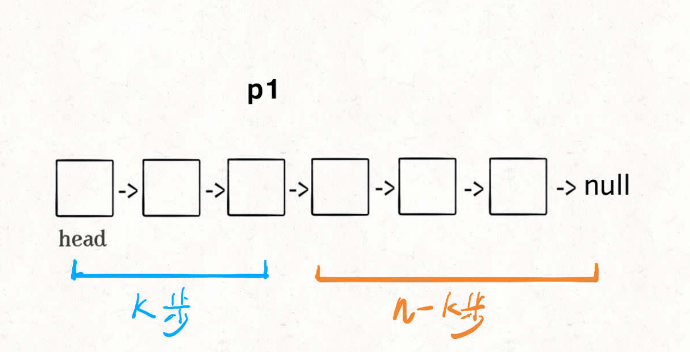

现在的 p1，只要再⾛ n - k 步，就能⾛到链表末尾的空指针了对吧？ 

趁这个时候，再⽤⼀个指针 p2 指向链表头节点 head： 

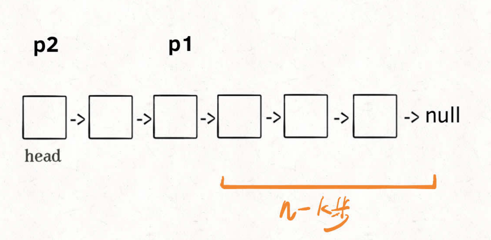

接下来就很显然了，让 p1 和 p2 同时向前⾛，p1 ⾛到链表末尾的空指针时⾛了 n - k 步，p2 也⾛了 n -k 步，也就是链表的倒数第 k 个节点：

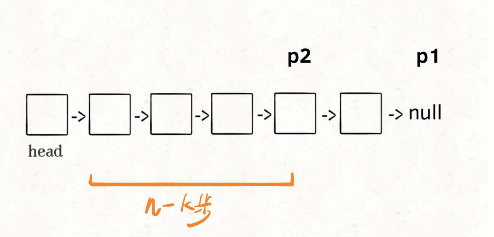

这样，只遍历了⼀次链表，就获得了倒数第 k 个节点 p2。 

上述逻辑的代码如下：

```java
    ListNode findFromEnd(ListNode head, int k) {
        ListNode p1 = head;
        for (int i = 0; i<k;i++){
            p1 = p1.next;
        }
        ListNode p2 = head;
        while (p1 != null){
            p1 = p1.next;
            p2 = p2.next;
        }
        return p2;
    }
```

当然，如果⽤ big O 表示法来计算时间复杂度，⽆论遍历⼀次链表和遍历两次链表的时间复杂度都是 O(N)， 但上述这个算法更有技巧性。 

很多链表相关的算法题都会⽤到这个技巧，⽐如说⼒扣第 19 题「删除链表的倒数第 N 个结点」：

[19. 删除链表的倒数第 N 个结点](https://leetcode.cn/problems/remove-nth-node-from-end-of-list/)

给你一个链表，删除链表的倒数第 `n` 个结点，并且返回链表的头结点。

示例1：

```
输入：head = [1,2,3,4,5], n = 2
输出：[1,2,3,5]
```

解法：

```java
    public ListNode removeNthFromEnd(ListNode head, int n) {
        // 寻找倒数第 n+1 个节点
        ListNode dummy =new  ListNode(-1);
        dummy.next = head;

        ListNode p1 = dummy;
        for (int i = 0 ;i<n+1;i++){
            p1 = p1.next;
        }
        ListNode p2 = dummy;
        while(p1 != null){
            p1 = p1.next;
            p2 = p2.next;
        }

        // 删除倒数第 n 个节点
        p2.next = p2.next.next;

        return dummy.next;
    }
```

这个逻辑就很简单了，要删除倒数第 n 个节点，就得获得倒数第 n + 1 个节点的引⽤，可以⽤我们实现的findFromEnd 来操作。

不过注意我们⼜使⽤了虚拟头结点的技巧，也是为了防⽌出现空指针的情况，⽐如说链表总共有 5 个节点， 

题⽬就让你删除倒数第 5 个节点，也就是第⼀个节点，那按照算法逻辑，应该⾸先找到倒数第 6 个节点。但第⼀个节点前⾯已经没有节点了，这就会出错。 

但有了我们虚拟节点 dummy 的存在，就避免了这个问题，能够对这种情况进⾏正确的删除。 

### 单链表的中点 - leetcode 876

如果想⼀次遍历就得到中间节点，也需要耍点⼩聪明，使⽤「快慢指针」的技巧： 

我们让两个指针 slow 和 fast 分别指向链表头结点 head。 

每当慢指针 **slow** 前进⼀步，快指针 **fast** 就前进两步，这样，当 **fast** ⾛到链表末尾时，**slow** 就指向了链表中点。 

上述思路的代码实现如下：

```java
    ListNode middleNode(ListNode head) {
        ListNode fast = head,slow = head;
        while (fast != null && fast.next != null){
            fast = fast.next.next;
            slow = slow.next;
        }
        return slow;
    }
```

需要注意的是，如果链表⻓度为偶数，也就是说中点有两个的时候，我们这个解法返回的节点是靠后的那个节点。 

另外，这段代码稍加修改就可以直接⽤到判断链表成环的算法题上。 

### 判断链表是否包含环 

判断链表是否包含环属于经典问题了，解决⽅案也是⽤快慢指针： 

每当慢指针 slow 前进⼀步，快指针 fast 就前进两步。 

如果 fast 最终遇到空指针，说明链表中没有环；如果 fast 最终和 slow 相遇，那肯定是 fast 超过了 slow ⼀圈，说明链表中含有环。

只需要把寻找链表中点的代码稍加修改就⾏了：

```java
    boolean hasCycle(ListNode head) {
        ListNode fast = head,slow = head;
        while (fast != null && fast.next != null){
            fast = fast.next.next;
            slow = slow.next;
            if (fast == slow){
                return true;
            }
        }
        return false;
    }
```

当然，这个问题还有进阶版：如果链表中含有环，如何计算这个环的起点？ 

解法：

```java
    ListNode detectCycle(ListNode head) {
        ListNode fast = head,slow = head;
        while (fast != null && fast.next != null){
            fast = fast.next.next;
            slow = slow.next;
            if (fast == slow){
                break;
            }
        }
        if (fast == null || fast.next == null){
            // 无环
            return null;
        }
        // 有环
        slow = head;
        // 快慢指针同步前进，相交点就是环起点
        while(slow != fast){
            slow = slow.next;
            fast = fast.next;
        }
        return slow;
    }
```

可以看到，当快慢指针相遇时，让其中任⼀个指针指向头节点，然后让它俩以相同速度前进，再次相遇时所在的节点位置就是环开始的位置。

我们假设快慢指针相遇时，慢指针 slow ⾛了 k 步，那么快指针 fast ⼀定⾛了 2k 步：

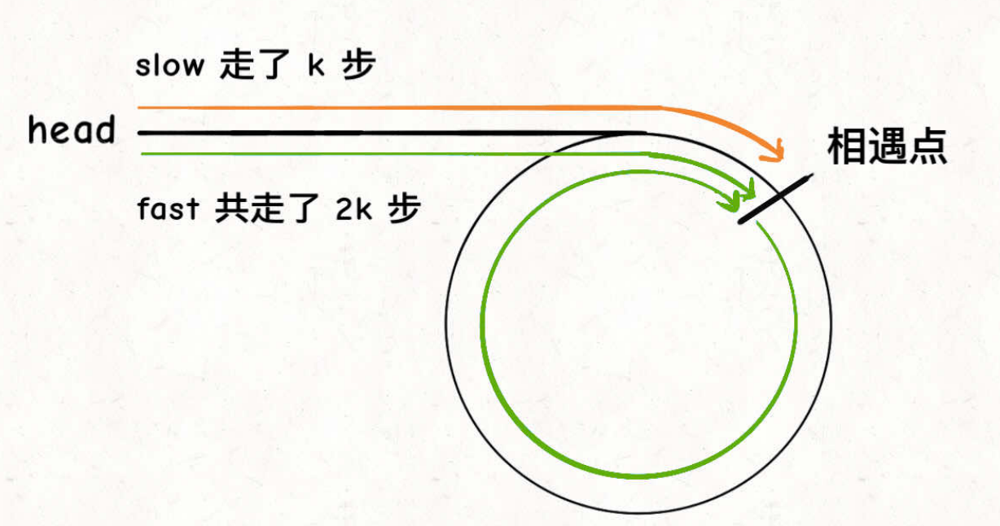

fast ⼀定⽐ slow 多⾛了 k 步，这多⾛的 k 步其实就是 fast 指针在环⾥转圈圈，所以 k 的值就是环⻓度的「整数倍」。 

假设相遇点距环的起点的距离为 m，那么结合上图的 slow 指针，环的起点距头结点 head 的距离为 k - m，也就是说如果从 head 前进 k - m 步就能到达环起点。 

巧的是，如果从相遇点继续前进 k - m 步，也恰好到达环起点。因为结合上图的 fast 指针，从相遇点开始⾛k步可以转回到相遇点，那⾛ k - m 步肯定就⾛到环起点了：

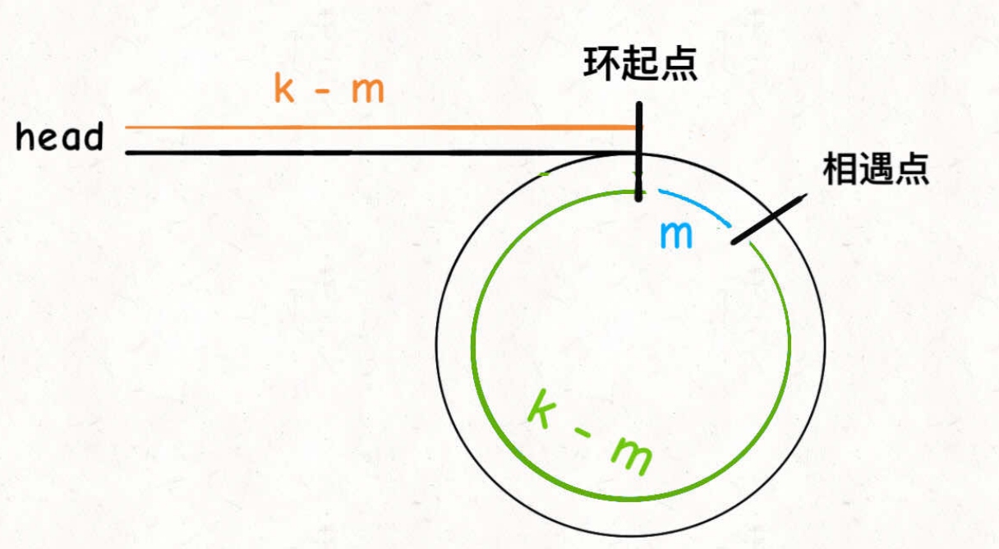

所以，只要我们把快慢指针中的任⼀个重新指向 head，然后两个指针同速前进，k - m 步后⼀定会相遇， 相遇之处就是环的起点了。 

### 两个链表是否相交-leetcode 160

这个问题有意思，也是⼒扣第 160 题「相交链表」函数签名如下：

```java
ListNode getIntersectionNode(ListNode headA, ListNode headB);
```

给你输⼊两个链表的头结点 headA 和 headB，这两个链表可能存在相交。

如果相交，你的算法应该返回相交的那个节点；如果没相交，则返回 null。 

⽐如题⽬给我们举的例⼦，如果输⼊的两个链表如下图： 

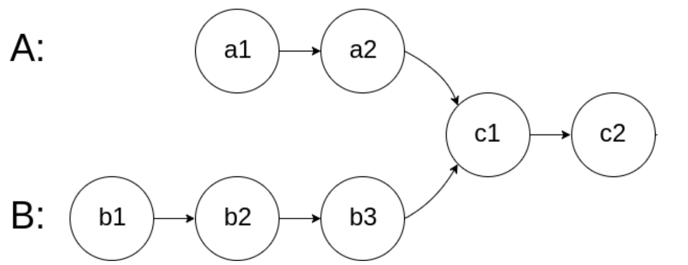

那么我们的算法应该返回 c1 这个节点。

这个题直接的想法可能是⽤ HashSet 记录⼀个链表的所有节点，然后和另⼀条链表对⽐，但这就需要额外的空间。 

如果不⽤额外的空间，只使⽤两个指针，你如何做呢？ 

难点在于，由于两条链表的⻓度可能不同，两条链表之间的节点⽆法对应： 

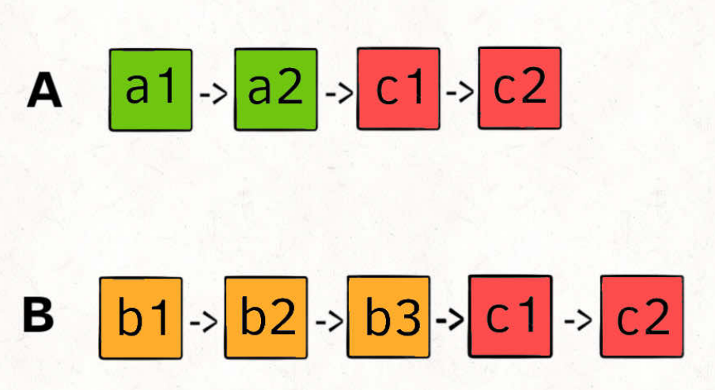

如果⽤两个指针 p1 和 p2 分别在两条链表上前进，并不能同时⾛到公共节点，也就⽆法得到相交节点 c1。

所以，解决这个问题的关键是，通过某些⽅式，让 **p1** 和 **p2** 能够同时到达相交节点 **c1**。

所以，我们可以让 p1 遍历完链表 A 之后开始遍历链表 B，让 p2 遍历完链表 B 之后开始遍历链表 A，这样相当于「逻辑上」两条链表接在了⼀起。 

如果这样进⾏拼接，就可以让 p1 和 p2 同时进⼊公共部分，也就是同时到达相交节点 c1：

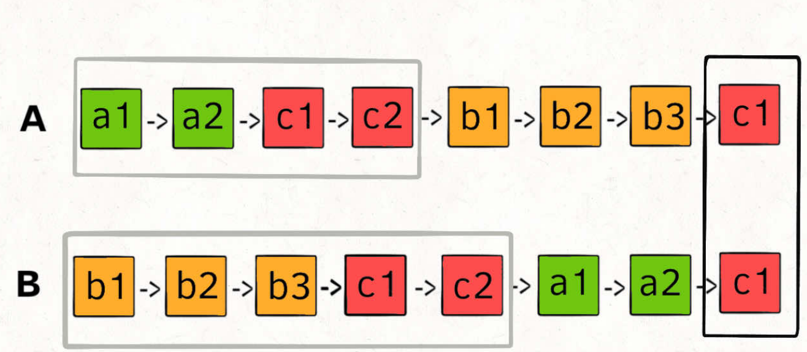

如果说两个链表没有相交点，是否能够正确的返回 null 呢？ 

这个逻辑可以覆盖这种情况的，相当于 c1 节点是 null 空指针嘛，可以正确返回 null。 

按照这个思路，可以写出如下代码：

```java
    public ListNode getIntersectionNode(ListNode headA, ListNode headB) {
        ListNode p1 = headA;
        ListNode p2 = headB;
        while (p1 != p2){
            if (p1 == null){
                p1 = headB;
            } else {
                p1 = p1.next;
            }
            if (p2 == null){
                p2 = headA;
            } else {
                p2 = p2.next;
            }
        }
        return p1;
    }
```

这样，这道题就解决了，空间复杂度为 O(1)，时间复杂度为 O(N)。

## 链表操作的递归思维一览

### 一、递归反转整个链表

实现代码：

```java
    ListNode reverse(ListNode head) {
        if (head.next == null) return head;
        ListNode last = reverse(head.next);
        head.next.next = head;
        head.next = null;
        return last;
    }
```

对于递归算法，最重要的就是明确递归函数的定义。具体来说，我们的 reverse 函数定义是这样的：

输⼊⼀个节点 **head**，将「以 **head** 为起点」的链表反转，并返回反转之后的头结点。 

明⽩了函数的定义，在来看这个问题。⽐如说我们想反转这个链表： 

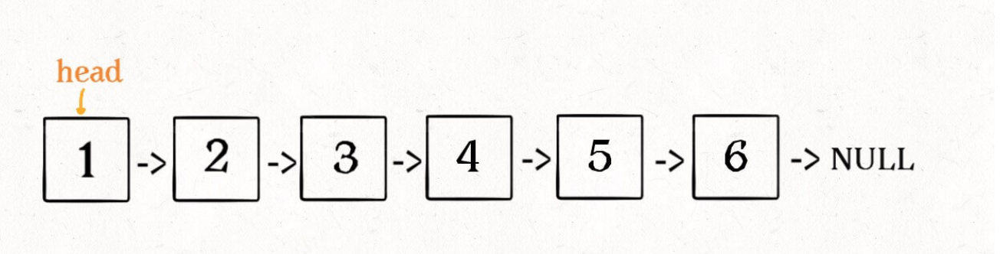

那么输⼊ reverse(head) 后，会在这⾥进⾏递归：

```java
ListNode last = reverse(head.next);
```

不要跳进递归（你的脑袋能压⼏个栈呀？），⽽是要根据刚才的函数定义，来弄清楚这段代码会产⽣什么结果：

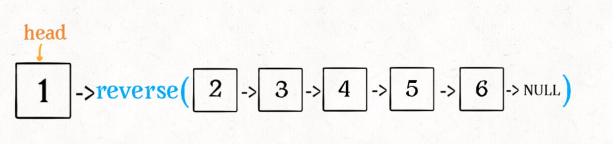

这个 reverse(head.next) 执⾏完成后，整个链表就成了这样：

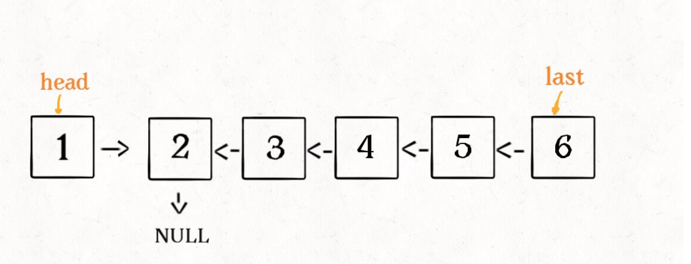

并且根据函数定义，reverse 函数会返回反转之后的头结点，我们⽤变量 last 接收了。 

现在再来看下⾯的代码：

```java
head.next.next = head;
```

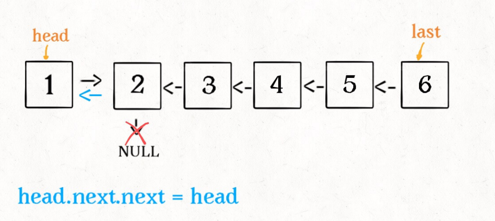

接下来：

```java
head.next = null;
return last;
```

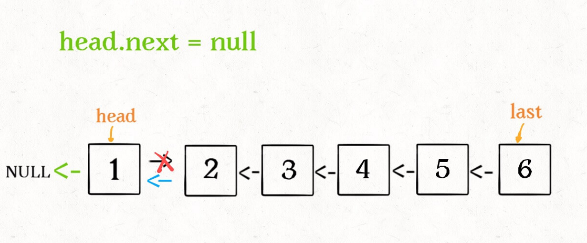

这样整个链表就反转过来了！递归代码就是这么简洁优雅，不过其中有两个地⽅需要注意：

1、递归函数要有 base case，也就是这句：

```java
if (head.next == null) return head;
```

意思是如果链表只有⼀个节点的时候反转也是它⾃⼰，直接返回即可。 

2、当链表递归反转之后，新的头结点是 last，⽽之前的 head 变成了最后⼀个节点，别忘了链表的末尾要指向 null：

```java
head.next = null;
```

### ⼆、反转链表前 N 个节点 

这次实现⼀个这样的函数：

```java
// 将链表的前 n 个节点反转（n <= 链表⻓度）
ListNode reverseN(ListNode head, int n)
```

⽐如说对于下图链表，执⾏ reverseN(head, 3)： 

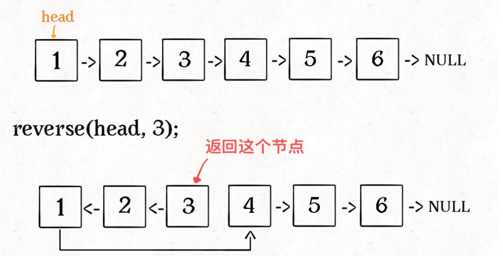

解决思路和反转整个链表差不多，只要稍加修改即可：

```java
    ListNode successor = null;
    ListNode reverseN(ListNode head, int n) {
        if (n == 1){
            // 记录第 n + 1 个节点
            successor = head.next;
            return head;
        }
        // 以 head.next 为起点，需要反转前 n - 1 个节点
        ListNode last = reverseN(head.next,n-1);
        head.next.next = head;
        // 让反转之后的 head 节点和后⾯的节点连起来
        head.next = successor;
        return last;
    }
```

具体的区别： 

1、base case 变为 n == 1，反转⼀个元素，就是它本身，同时要记录后驱节点。

2、刚才我们直接把 head.next 设置为 null，因为整个链表反转后原来的 head 变成了整个链表的最后⼀个节点。但现在 head 节点在递归反转之后不⼀定是最后⼀个节点了，所以要记录后驱 successor（第 n + 1 个节点），反转之后将 head 连接上。 

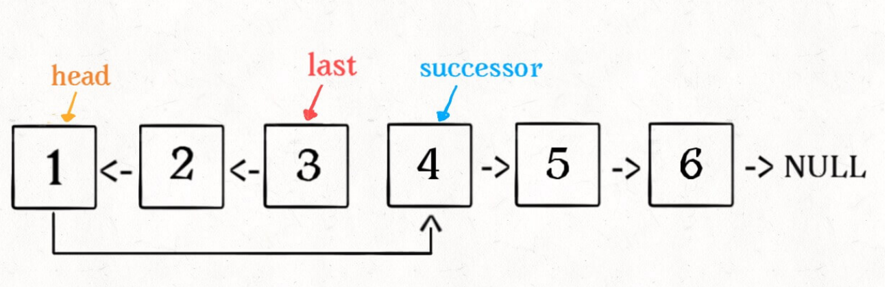

### 三、反转链表的⼀部分 

给⼀个索引区间 [m,n]（索引从 1 开始），仅仅反转区间中的链表元素。

```java
ListNode reverseBetween(ListNode head, int m, int n)
```

⾸先，如果 m == 1，就相当于反转链表开头的 n 个元素嘛，也就是我们刚才实现的功能：

```java
ListNode reverseBetween(ListNode head, int m, int n) {
// base case
if (m == 1) {
// 相当于反转前 n 个元素
return reverseN(head, n);
 }
// ...
}
```

如果 m != 1 怎么办？如果我们把 head 的索引视为 1，那么我们是想从第 m 个元素开始反转对吧；如果把head.next 的索引视为 1 呢？那么相对于 head.next，反转的区间应该是从第 m - 1 个元素开始的；那么对于 head.next.next 呢…… 

区别于迭代思想，这就是递归思想，所以我们可以完成代码：

```java
    ListNode reverseBetween(ListNode head, int m, int n) {
        // base case
        if (m == 1){
            return reverseN(head,n);
        }
        // 前进到反转的起点触发 base case
        head.next = reverseBetween(head.next,m-1,n-1);
        return head;
    }
```

### 四、最后总结 

递归的思想相对迭代思想，稍微有点难以理解，处理的技巧是：不要跳进递归，⽽是利⽤明确的定义来实现算法逻辑。 

处理看起来⽐较困难的问题，可以尝试化整为零，把⼀些简单的解法进⾏修改，解决困难的问题。 

值得⼀提的是，递归操作链表并不⾼效。和迭代解法相⽐，虽然时间复杂度都是 O(N)，但是迭代解法的空间 

复杂度是 O(1)，⽽递归解法需要堆栈，空间复杂度是 O(N)。所以递归操作链表可以作为对递归算法的练习或者拿去和⼩伙伴装逼，但是考虑效率的话还是使⽤迭代算法更好。 