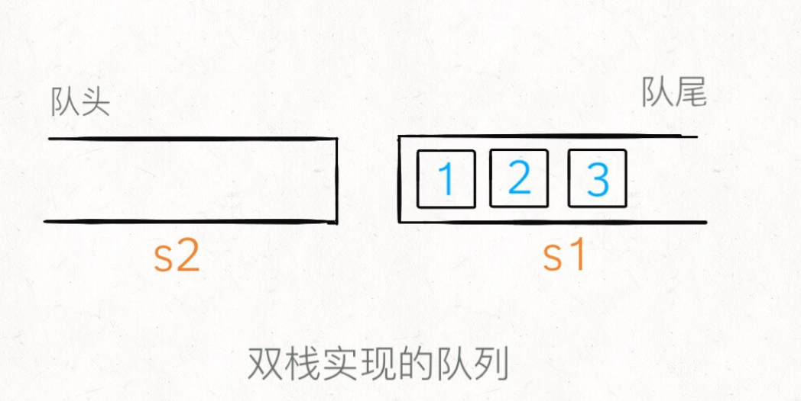

# 1.2. 队列/栈 116

## 队列实现栈以及栈实现队列 117-124

队列是⼀种先进先出的数据结构，栈是⼀种先进后出的数据结构。

### 一、用栈实现队列

⾸先，队列的 API 如下：

```java
class MyQueue {
/** 添加元素到队尾 */
public void push(int x);
/** 删除队头的元素并返回 */
public int pop();
/** 返回队头元素 */
public int peek();
/** 判断队列是否为空 */
public boolean empty(); }
```

使⽤两个栈 s1, s2 就能实现⼀个队列的功能。

```java
class MyQueue {
private Stack<Integer> s1, s2;
public MyQueue() {
 s1 = new Stack<>();
 s2 = new Stack<>();
 }
// ...
}
```

当调⽤ push 让元素⼊队时，只要把元素压⼊ s1 即可，⽐如说 push 进 3 个元素分别是 1,2,3，那么底层结构就是这样：



```java
/** 添加元素到队尾 */
public void push(int x) {
 s1.push(x);
}
```

那么如果这时候使⽤ peek 查看队头的元素怎么办呢？按道理队头元素应该是 1，但是在 s1 中 1 被压在栈底，现在就要轮到 s2 起到⼀个中转的作⽤了：当 s2 为空时，可以把 s1 的所有元素取出再添加进 s2，这时候 **s2** 中元素就是先进先出顺序了。

```java
/** 返回队头元素 */
public int peek() {
if (s2.isEmpty())
// 把 s1 元素压⼊ s2
while (!s1.isEmpty())
 s2.push(s1.pop());
return s2.peek();
}
```

同理，对于 pop 操作，只要操作 s2 就可以了。

```java
/** 删除队头的元素并返回 */
public int pop() {
// 先调⽤ peek 保证 s2 ⾮空
 peek();
return s2.pop();
}
```

最后，如何判断队列是否为空呢？如果两个栈都为空的话，就说明队列为空：

```java
/** 判断队列是否为空 */
public boolean empty() {
return s1.isEmpty() && s2.isEmpty();
}
```

⾄此，就⽤栈结构实现了⼀个队列，核⼼思想是利⽤两个栈互相配合。

值得⼀提的是，这⼏个操作的时间复杂度是多少呢？有点意思的是 peek 操作，调⽤它时可能触发 while 循 

环，这样的话时间复杂度是 O(N)，但是⼤部分情况下 while 循环不会被触发，时间复杂度是 O(1)。由于

pop 操作调⽤了 peek，它的时间复杂度和 peek 相同。 

像这种情况，可以说它们的最坏时间复杂度是 O(N)，因为包含 while 循环，可能需要从 s1 往 s2 搬移元素。

但是它们的均摊时间复杂度是 O(1)，这个要这么理解：对于⼀个元素，最多只可能被搬运⼀次，也就是说 peek 操作平均到每个元素的时间复杂度是 O(1)。 

整体代码：

```java
    class MyQueue{
        
        private Stack<Integer> s1,s2;
        
        public MyQueue(){
            s1 = new Stack<>();
            s2 = new Stack<>();
        }
        /** 添加元素到队尾 */
        public void push(int x){
            s1.push(x);
        }

        /** 删除队头的元素并返回 */
        public int pop(){
            if(s2.empty()){
                while (!s1.empty()){
                    s2.push(s1.pop());
                }
            }
            return s2.pop();
        }
        
        /** 返回队头元素 */
        public int peek(){
            if(s2.empty()){
                while (!s1.empty()){
                    s2.push(s1.pop());
                }
            }
            return s2.peek();
        }

        /** 判断队列是否为空 */
        public boolean empty(){
            return s1.empty() && s2.empty();
        }
    }
```

### 二、用队列实现栈

如果说双栈实现队列⽐较巧妙，那么⽤队列实现栈就⽐较简单粗暴了，只需要⼀个队列作为底层数据结构。 ⾸先看下栈的 API：

```java
class MyStack {
/** 添加元素到栈顶 */
public void push(int x);
/** 删除栈顶的元素并返回 */
public int pop();
/** 返回栈顶元素 */
public int top();
/** 判断栈是否为空 */
public boolean empty(); }
```

先说 push API，直接将元素加⼊队列，同时记录队尾元素，因为队尾元素相当于栈顶元素，如果要 top 查看栈顶元素的话可以直接返回：

```java
class MyStack {
 Queue<Integer> q = new LinkedList<>();
int top_elem = 0;
/** 添加元素到栈顶 */
public void push(int x) {
// x 是队列的队尾，是栈的栈顶
 q.offer(x);
 top_elem = x;
 }
/** 返回栈顶元素 */
public int top() {
return top_elem;
 }
}
```

的底层数据结构是先进先出的队列，每次 pop 只能从队头取元素；但是栈是后进先出，也就是说 pop API 要从队尾取元素。

解决⽅法简单粗暴，把队列前⾯的都取出来再加⼊队尾，让之前的队尾元素排到队头，这样就可以取出了：

```java
/** 删除栈顶的元素并返回 */
public int pop() {
int size = q.size();
while (size > 1) {
 q.offer(q.poll());
 size--;
 }
// 之前的队尾元素已经到了队头
return q.poll();
}
```

这样实现还有⼀点⼩问题就是，原来的队尾元素被提到队头并删除了，但是 top_elem 变量没有更新，还需要⼀点⼩修改：

```java
/** 删除栈顶的元素并返回 */
public int pop() {
int size = q.size();
// 留下队尾 2 个元素
while (size > 2) {
 q.offer(q.poll());
 size--;
 }
// 记录新的队尾元素
 top_elem = q.peek();
 q.offer(q.poll());
// 删除之前的队尾元素
return q.poll();
}
```

最后，API empty 就很容易实现了，只要看底层的队列是否为空即可：

```java
/** 判断栈是否为空 */
public boolean empty() {
return q.isEmpty();
}
```

很明显，⽤队列实现栈的话，pop 操作时间复杂度是 O(N)，其他操作都是 O(1)。 

完成代码：

```java
    class MyStack{
        Queue<Integer> q = new LinkedList<>();
        int top_elem = 0; // 栈顶元素
        
        /** 添加元素到栈顶*/
        public void push(int x){
            q.offer(x);
            top_elem = x;
        }
        
        /** 删除栈顶的元素并返回 */
        public int pop(){
            int size = q.size();
            while (size > 2){
                q.offer(q.poll());
                size--;
            }
            top_elem = q.peek();
            q.offer(q.poll());
            return q.poll();
        }
        
        /** 返回栈顶元素 */
        public int top(){
            return top_elem;
        }
        
        /** 判断栈是否为空 */
        public boolean empty(){
            return q.isEmpty();
        }
    }
```


## 一文秒杀三道括号题目 125-130


## 单调栈结构解决三道算法题 131-135

栈（stack）是很简单的⼀种数据结构，先进后出的逻辑顺序，符合某些问题的特点，⽐如说函数调⽤栈。 

单调栈实际上就是栈，只是利⽤了⼀些巧妙的逻辑，使得每次新元素⼊栈后，栈内的元素都保持有序（单调递增或单调递减）。

单调栈⽤途不太⼴泛，只处理⼀种典型的问题，叫做 Next Greater Element。

### 单调栈模版

给你⼀个数组 nums，请你返回⼀个等⻓的结果数组，结果数组中对应索引存储着下⼀个更⼤元素，如果没有更⼤的元素，就存 -1。 

函数签名如下：

```java
vector<int> nextGreaterElement(vector<int>& nums);
```

⽐如说，输⼊⼀个数组 nums = [2,1,2,4,3]，你返回数组 [4,2,4,-1,-1]。 

解释：第⼀个 2 后⾯⽐ 2 ⼤的数是 4; 1 后⾯⽐ 1 ⼤的数是 2；第⼆个 2 后⾯⽐ 2 ⼤的数是 4; 4 后⾯没有⽐ 4 ⼤的数，填 -1；3 后⾯没有⽐ 3 ⼤的数，填 -1。

暴⼒解法很好想到，就是对每个元素后⾯都进⾏扫描，找到第⼀个更⼤的元素就⾏了。但是暴⼒解法的时间复杂度是 O(n^2)。 

这个问题可以这样抽象思考：把数组的元素想象成并列站⽴的⼈，元素⼤⼩想象成⼈的身⾼。这些⼈⾯对你站成⼀列，如何求元素「2」的 Next Greater Number 呢？ 

很简单，如果能够看到元素「2」，那么他后⾯可⻅的第⼀个⼈就是「2」的 Next Greater Number，因为⽐ 「2」⼩的元素身⾼不够，都被「2」挡住了，第⼀个露出来的就是答案。 

代码：

```java
    public static int[] nextGreaterElement(int[] nums) {
        int[] result = new int[nums.length];
        Stack<Integer> stack = new Stack<>();
        // 倒着往栈⾥放
        for (int i = nums.length-1;i>=0;i--){
            // 判定个⼦⾼矮
            while (!stack.isEmpty() && stack.peek() <= nums[i]){
                // 矮个起开，反正也被挡着了。。。
                stack.pop();
            }
            // // nums[i] 身后的 next great number
            result[i] = stack.isEmpty()?-1:stack.peek();
            stack.push(nums[i]);
        }
        return result;
    }
```

这就是单调队列解决问题的模板。for 循环要从后往前扫描元素，因为我们借助的是栈的结构，倒着⼊栈，其实是正着出栈。while 循环是把两个「个⼦⾼」元素之间的元素排除，因为他们的存在没有意义，前⾯挡着个 「更⾼」的元素，所以他们不可能被作为后续进来的元素的 Next Great Number 了。

这个算法的时间复杂度不是那么直观，如果你看到 for 循环嵌套 while 循环，可能认为这个算法的复杂度也是O(n^2)，但是实际上这个算法的复杂度只有 O(n)。 

分析它的时间复杂度，要从整体来看：总共有 n 个元素，每个元素都被 push ⼊栈了⼀次，⽽最多会被 pop ⼀次，没有任何冗余操作。所以总的计算规模是和元素规模 n 成正⽐的，也就是 O(n) 的复杂度。 

### 问题变形 - Leetcode 739

⼒扣第 739 题「每⽇温度」： 

给你⼀个数组 T，这个数组存放的是近⼏天的天⽓⽓温，你返回⼀个等⻓的数组，计算：对于每⼀天，你还要⾄少等多少天才能等到⼀个更暖和的⽓温；如果等不到那⼀天，填 0。

函数签名如下：

```java
vector<int> dailyTemperatures(vector<int>& T);
```

⽐如说给你输⼊ T = [73,74,75,71,69,76]，你返回 [1,1,3,2,1,0]。 

解释：第⼀天 73 华⽒度，第⼆天 74 华⽒度，⽐ 73 ⼤，所以对于第⼀天，只要等⼀天就能等到⼀个更暖和的⽓温，后⾯的同理。 

相同的思路，直接调⽤单调栈的算法模板，稍作改动就可以，代码：

```java
    public static int[] dailyTemperatures(int[] nums){
        int n = nums.length;
        int[] result = new int[n];
        Stack<Integer> stack = new Stack<>();
        for(int i = n-1;i>=0;i--){
            while (!stack.isEmpty() && nums[stack.peek()] <= nums[i]){
                stack.pop();
            }
            result[i] = stack.isEmpty()?0:(stack.peek() - i);
            stack.push(i);
        }
        return result;
    }
```

### 如何处理环形数组 - Leetcode 503

同样是 Next Greater Number，现在假设给你的数组是个环形的，如何处理？⼒扣第 503 题「下⼀个更⼤元素 II」就是这个问题： 

⽐如输⼊⼀个数组 [2,1,2,4,3]，你返回数组 [4,2,4,-1,4]。拥有了环形属性，最后⼀个元素 3 绕了⼀圈后找到了⽐⾃⼰⼤的元素 4。

⼀般是通过 % 运算符求模（余数），来获得环形特效：

```java
int[] arr = {1,2,3,4,5};
int n = arr.length, index = 0;
while (true) {
 print(arr[index % n]);
 index++;
}
```

这个问题肯定还是要⽤单调栈的解题模板，但难点在于，⽐如输⼊是 [2,1,2,4,3]，对于最后⼀个元素 3， 如何找到元素 4 作为 Next Greater Number。

对于这种需求，常⽤套路就是将数组⻓度翻倍：2 1 2 4 3 2 1 2 4 3

这样，元素 3 就可以找到元素 4 作为 Next Greater Number 了，⽽且其他的元素都可以被正确地计算。 

有了思路，最简单的实现⽅式当然可以把这个双倍⻓度的数组构造出来，然后套⽤算法模板。但是，可以不⽤构造新数组，⽽是利⽤循环数组的技巧来模拟数组⻓度翻倍的效果。 

代码：

```java
    public static int[] nextGreaterElements(int[] nums) {
        int n = nums.length;
        int[] result = new int[n];
        Stack<Integer> stack = new Stack<>();
        // 假装这个数组⻓度翻倍了
        for(int i = 2*n-1;i>=0;i--){
            // 索引要求模，其他的和模板⼀样
            while (!stack.isEmpty() && stack.peek() <= nums[i%n]){
                stack.pop();
            }
            result[i%n] = stack.isEmpty()?-1:stack.peek();
            stack.push(nums[i%n]);
        }
        return result;
    }
```

这样，就可以巧妙解决环形数组的问题，时间复杂度 O(N)。 

## 单调队列结构解决滑动窗口问题 136-143


## 一道数组去重的算法题把我整不会了 144-145 - Leetcode 316、1081

⼒扣[316. 去除重复字母](https://leetcode.cn/problems/remove-duplicate-letters/)，题⽬如下：

给你一个字符串 `s` ，请你去除字符串中重复的字母，使得每个字母只出现一次。需保证 **返回结果的字典序最小**（要求不能打乱其他字符的相对位置）。

示例 1：

```
输入：s = "bcabc"
输出："abc"
```

示例 2：

```
输入：s = "cbacdcbc"
输出："acdb"
```

这道题和第 1081 题「不同字符的最⼩⼦序列」的解法是完全相同的。

题⽬的要求总结出来有三点： 

* 要求⼀、要去重。 

* 要求⼆、去重字符串中的字符顺序不能打乱 **s** 中字符出现的相对顺序。 

* 要求三、在所有符合上⼀条要求的去重字符串中，字典序最⼩的作为最终结果。 

上述三条要求中，要求三可能有点难理解，举个例⼦。 

⽐如说输⼊字符串 s = "babc"，去重且符合相对位置的字符串有两个，分别是 "bac" 和 "abc"，但是算法得返回 "abc"，因为它的字典序更⼩。 

按理说，如果想要有序的结果，那就得对原字符串排序对吧，但是排序后就不能保证符合 s 中字符出现顺序了，这似乎是⽭盾的。 

其实这⾥会借鉴前⽂单调栈解题框架中讲到的「单调栈」的思路。

**先暂时忽略要求三，用「栈」来实现一下要求一和要求二**：

```java
    public static String removeDuplicateLetters(String s) {
        // 存放去重的结果
      	Stack<Character> stack = new Stack<>();
      	// 布尔数组初始值为 false，记录栈中是否存在某个字符
    		// 输入字符均为 ASCII 字符，所以大小 256 够用了
        boolean[] have = new boolean[256];
        char[] chars = s.toCharArray();
        for (int i = 0;i<chars.length;i++){
          	// 如果字符 c 存在栈中，直接跳过
            char c = chars[i];
            if (!have[c]){
              	// 若不存在，则插入栈顶并标记为存在
                stack.push(c);
                have[c] = true;
            }
        }
        StringBuilder stringBuilder = new StringBuilder();
        while (!stack.isEmpty()){
            stringBuilder.append(stack.pop());
        }
      	// 栈中元素插入顺序是反的，需要 reverse 一下
        return stringBuilder.reverse().toString();
    }
```

代码的逻辑很简单吧，就是用布尔数组`inStack`记录栈中元素，达到去重的目的，**此时栈中的元素都是没有重复的**。

如果想满足要求三，保证字典序，需要做些什么修改？

在向栈`stk`中插入字符`'a'`的这一刻，算法需要知道，字符`'a'`的字典序和之前的两个字符`'b'`和`'c'`相比，谁大谁小？

**如果当前字符`'a'`比之前的字符字典序小，就有可能需要把前面的字符 pop 出栈，让`'a'`排在前面，对吧**？

```java
    public static String removeDuplicateLetters(String s) {
        Stack<Character> stack = new Stack<>();
        boolean[] have = new boolean[256];
        char[] chars = s.toCharArray();
        for (int i = 0;i<chars.length;i++){
            char c = chars[i];
            if (!have[c]){
                // 插入之前，和之前的元素比较一下大小
                // 如果字典序比前面的小，pop 前面的元素
                while (!stack.isEmpty() && stack.peek() > c){
                    // 弹出栈顶元素，并把该元素标记为不在栈中
                    Character pop = stack.pop();
                    have[pop] = false;
                }
                stack.push(c);
                have[c] = true;
            }
        }
        StringBuilder stringBuilder = new StringBuilder();
        while (!stack.isEmpty()){
            stringBuilder.append(stack.pop());
        }
        return stringBuilder.reverse().toString();
    }
```

这段代码就是插入了一个 while 循环，连续 pop 出比当前字符小的栈顶字符，直到栈顶元素比当前元素的字典序还小为止。

对于输入`s = "bcabc"`，可以得出正确结果`"abc"`了。

假设`s = "bcac"`，按照刚才的算法逻辑，返回的结果是`"ac"`，而正确答案应该是`"bac"`。

问题出在**算法在`stk.peek() > c`时才会 pop 元素，其实这时候应该分两种情况**：

情况一、如果`stk.peek()`这个字符之后还会出现，那么可以把它 pop 出去，反正后面还有嘛，后面再 push 到栈里，刚好符合字典序的要求。

情况二、如果`stk.peek()`这个字符之后不会出现了，前面也说了栈中不会存在重复的元素，那么就不能把它 pop 出去，否则就永远失去了这个字符。

再改一版代码：

```java
    public static String removeDuplicateLetters(String s) {
        Stack<Character> stack = new Stack<>();
        // 维护一个计数器记录字符串中字符的数量
        // 因为输入为 ASCII 字符，大小 256 够用了
        int[] count = new int[256];
        boolean[] have = new boolean[256];
        char[] chars = s.toCharArray();
        for (int i = 0;i<chars.length;i++){
            char c = chars[i];
            count[c]++;
        }

        for (int i = 0;i<chars.length;i++){
            char c = chars[i];
            count[c]--;
            if (!have[c]){
                // 若之后不存在栈顶元素了，则停止 pop
                while (!stack.isEmpty() && stack.peek() > c && count[stack.peek()] > 0){
                    // 若之后还有，则可以 pop
                    char pop = stack.pop();
                    have[pop] = false;
                }
                stack.push(c);
                have[c] = true;
            }
        }
        StringBuilder stringBuilder = new StringBuilder();
        while (!stack.isEmpty()){
            stringBuilder.append(stack.pop());
        }
        return stringBuilder.reverse().toString();
    }
```

用了一个计数器`count`，当字典序较小的字符试图「挤掉」栈顶元素的时候，在`count`中检查栈顶元素是否是唯一的，只有当后面还存在栈顶元素的时候才能挤掉，否则不能挤掉。

至此，这个算法就结束了，时间空间复杂度都是 O(N)。

**是怎么达成这三个要求的**？

* 要求一、通过`inStack`这个布尔数组做到栈`stk`中不存在重复元素。

* 要求二、顺序遍历字符串`s`，通过「栈」这种顺序结构的 push/pop 操作记录结果字符串，保证了字符出现的顺序和`s`中出现的顺序一致。

  这里也可以想到为什么要用「栈」这种数据结构，因为先进后出的结构允许立即操作刚插入的字符，如果用「队列」的话肯定是做不到的。

* 要求三、用类似单调栈的思路，配合计数器`count`不断 pop 掉不符合最小字典序的字符，保证了最终得到的结果字典序最小。

当然，由于栈的结构特点，最后需要把栈中元素取出后再反转一次才是最终结果。