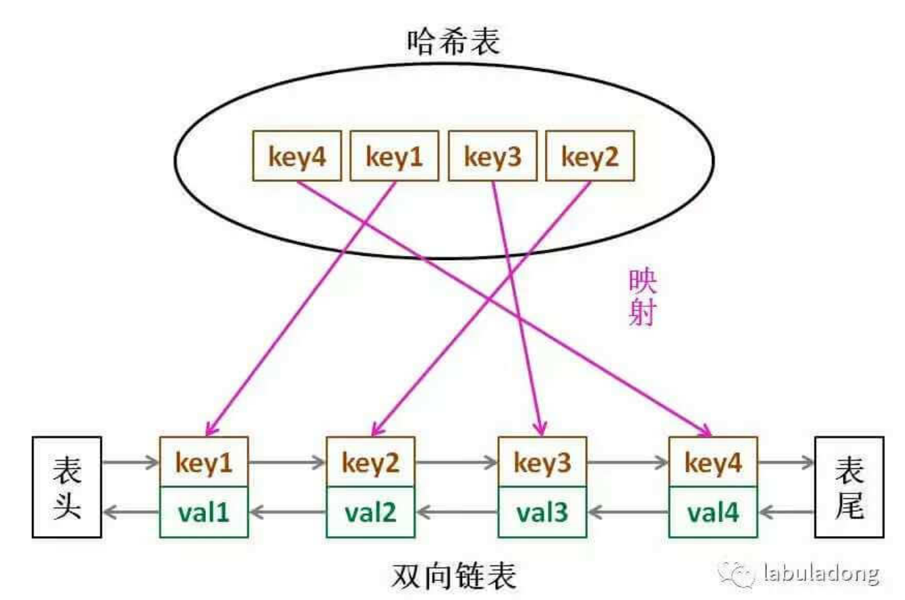
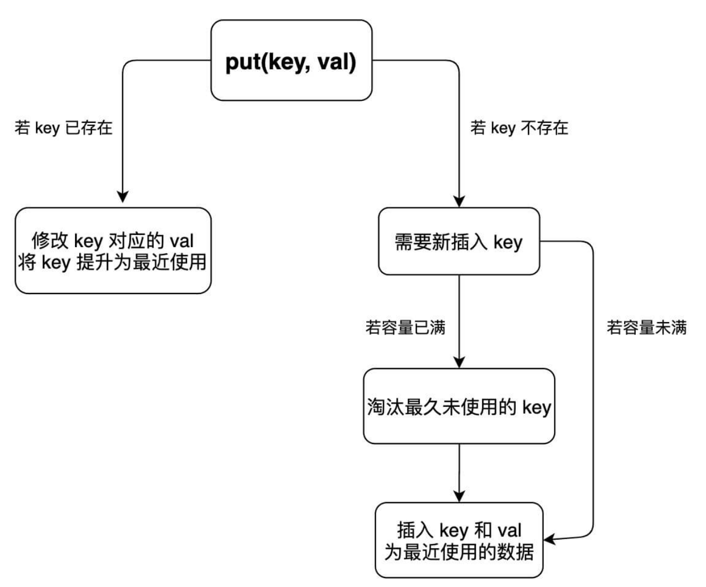
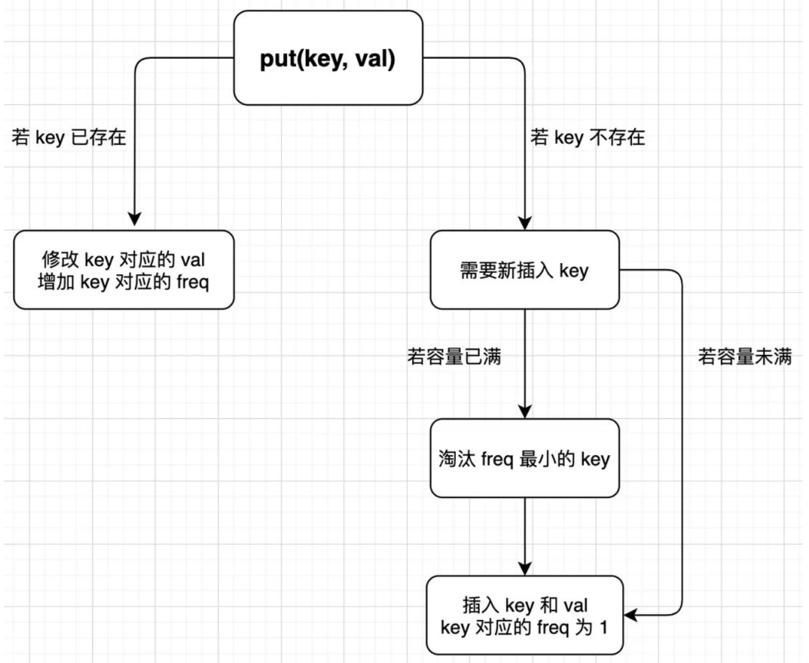

# 1.3. 数据结构设计 146

数据结构设计题主要就是给你提需求，让你实现 API，⽽且要求这些 API 的复杂度尽可能低。 

设计题中哈希表的出现频率很⾼，⼀般都是各类其他数据结构和哈希表组合，从⽽改善这些基本数据结构的特性，获得「超能⼒」。 

## 算法就像塔乐高：带你手撸 LRU 算法 147 - 160 - Leetcode 146

LRU 的全称是 Least Recently Used，也就是说认为最近使⽤过的数据应该是是「有⽤的」，很久都没⽤过的数据应该是⽆⽤的，内存满了就优先删那些很久没⽤过的数据。 

### 一、LRU 算法描述

⼒扣第 146 题「LRU缓存机制」就是让你设计数据结构： 

⾸先要接收⼀个 capacity 参数作为缓存的最⼤容量，然后实现两个 API，⼀个是 put(key, val) ⽅法存⼊键值对，另⼀个是 get(key) ⽅法获取 key 对应的 val，如果 key 不存在则返回 -1。 

注意哦，get 和 put ⽅法必须都是 O(1) 的时间复杂度，举个具体例⼦来看看 LRU 算法怎么⼯作。

```java
/* 缓存容量为 2 */
LRUCache cache = new LRUCache(2);
// 你可以把 cache 理解成⼀个队列
// 假设左边是队头，右边是队尾
// 最近使⽤的排在队头，久未使⽤的排在队尾
// 圆括号表示键值对 (key, val)
cache.put(1, 1);
// cache = [(1, 1)]
cache.put(2, 2);
// cache = [(2, 2), (1, 1)]
cache.get(1); // 返回 1
// cache = [(1, 1), (2, 2)]
// 解释：因为最近访问了键 1，所以提前⾄队头
// 返回键 1 对应的值 1
cache.put(3, 3);
// cache = [(3, 3), (1, 1)]
// 解释：缓存容量已满，需要删除内容空出位置
// 优先删除久未使⽤的数据，也就是队尾的数据
// 然后把新的数据插⼊队头
cache.get(2); // 返回 -1 (未找到)
// cache = [(3, 3), (1, 1)]
// 解释：cache 中不存在键为 2 的数据
cache.put(1, 4); 
// cache = [(1, 4), (3, 3)]
// 解释：键 1 已存在，把原始值 1 覆盖为 4
// 不要忘了也要将键值对提前到队头
```

### 二、LRU 算法设计

分析上⾯的操作过程，要让 put 和 get ⽅法的时间复杂度为 O(1)，可以总结出 cache 这个数据结构必要的条件：

1、显然 cache 中的元素必须有时序，以区分最近使⽤的和久未使⽤的数据，当容量满了之后要删除最久未使⽤的那个元素腾位置。 

2、要在 cache 中快速找某个 key 是否已存在并得到对应的 val； 

3、每次访问 cache 中的某个 key，需要将这个元素变为最近使⽤的，也就是说 cache 要⽀持在任意位置快速插⼊和删除元素。 

那么，什么数据结构同时符合上述条件呢？哈希表查找快，但是数据⽆固定顺序；链表有顺序之分，插⼊删除快，但是查找慢。所以结合⼀下，形成⼀种新的数据结构：哈希链表 LinkedHashMap。 

LRU 缓存算法的核⼼数据结构就是哈希链表，双向链表和哈希表的结合体。这个数据结构⻓这样：



借助这个结构，来逐⼀分析上⾯的 3 个条件： 

1、如果每次默认从链表尾部添加元素，那么显然越靠尾部的元素就是最近使⽤的，越靠头部的元素就是最久未使⽤的。 

2、对于某⼀个 key，可以通过哈希表快速定位到链表中的节点，从⽽取得对应 val。 

3、链表显然是⽀持在任意位置快速插⼊和删除的，改改指针就⾏。只不过传统的链表⽆法按照索引快速访问某⼀个位置的元素，⽽这⾥借助哈希表，可以通过 key 快速映射到任意⼀个链表节点，然后进⾏插⼊和删除。

### 三、代码实现

先⾃⼰造轮⼦实现⼀遍 LRU 算法，然后再使⽤ Java 内置的 LinkedHashMap 来实现⼀遍。 

⾸先，把双链表的节点类写出来，为了简化，key 和 val 都认为是 int 类型：

```java
class Node {
public int key, val;
public Node next, prev;
public Node(int k, int v) {
this.key = k;
this.val = v;
 }
}
```

然后依靠 Node 类型构建⼀个双链表，实现⼏个 LRU 算法必须的 API：

```java
    class DoubleList {
        
        private Node head,tail;
        private int size;
        
        public DoubleList() {
            head = new Node(0,0);
            tail = new Node(0,0);
            head.next = tail;
            tail.prev = head;
            size = 0;
        }
        // 在链表尾部添加节点 x，时间 O(1)
        public void addLast(Node x) {
            x.prev = tail.prev;
            x.next = tail;
            tail.prev.next = x;
            tail.prev = x;
            size++;
        }

        // 删除链表中的 x 节点（x ⼀定存在）
        // 由于是双链表且给的是⽬标 Node 节点，时间 O(1)
        public void remove(Node x) {
            x.prev.next = x.next;
            x.next.prev = x.prev;
            size--;
        }

        // 删除链表中第⼀个节点，并返回该节点，时间 O(1)
        public Node removeFirst() {
            if (head.next == tail){
                return null;
            }
            Node first = head.next;
            remove(first);
            return first;
        }

        // 返回链表⻓度，时间 O(1)
        public int size() {
            return size;
        }
    }
```

「为什么必须要⽤双向链表」，因为需要删除操作。删除⼀个节点不光要得到该节点本身的指针，也需要操作其前驱节点的指针，⽽双向链表才能⽀持直接查找前驱，保证操作的时间复杂度 O(1)。 

注意实现的双链表 API 只能从尾部插⼊，也就是说靠尾部的数据是最近使⽤的，靠头部的数据是最久未使⽤的。 

有了双向链表的实现，只需要在 LRU 算法中把它和哈希表结合起来即可，先搭出代码框架：

```java
    class LRUCache{
        // key -> Node(key, val)
        private HashMap<Integer,Node> map;
        // Node(k1, v1) <-> Node(k2, v2)...
        private DoubleList cache;
        // 最⼤容量
        private int cap;

        public LRUCache(int capacity){
            cap = capacity;
            map = new HashMap<>();
            cache = new DoubleList();
        }
    }
```

由于要同时维护⼀个双链表 cache 和⼀个哈希表 map，很容易漏掉⼀些操作，⽐如说删除某个 key 时，在 cache 中删除了对应的 Node，但是却忘记在 map 中删除 key。 

解决这种问题的有效⽅法是：在这两种数据结构之上提供⼀层抽象 API。 

就是尽量让 LRU 的主⽅法 get 和 put 避免直接操作 map 和 cache 的细节。可以先实现下⾯⼏个函数：

```java
        /* 将某个 key 提升为最近使⽤的 */
        private void makeRecently(int key) {
            Node node = map.get(key);
            if (node == null){
                return;
            }
            // 先从链表中删除这个节点
            cache.remove(node);
            // 重新插到队尾
            cache.addLast(node);
        }

        /* 添加最近使⽤的元素 */
        private void addRecently(int key, int val) {
            Node node = new Node(key,val);
            // 别忘了在 map 中添加 key 的映射
            map.put(key,node);
            // 链表尾部就是最近使⽤的元素
            cache.addLast(node);
        }

        /* 删除某⼀个 key */
        private void deleteKey(int key) {
            Node node = map.get(key);
            if (node == null){
                return;
            }
            // 从链表中删除
            cache.remove(node);
            // 从 map 中删除
            map.remove(key);
        }

        /* 删除最久未使⽤的元素 */
        private void removeLeastRecently() {
            // 链表头部的第⼀个元素就是最久未使⽤的
            Node node = cache.removeFirst();
            // 同时别忘了从 map 中删除它的 key
            map.remove(node.key);
        }
```

「为什么要在链表中同时存储 key 和 val，⽽不是只存储 val」，注意 removeLeastRecently 函数中，需要⽤ deletedNode 得到 deletedKey。 

也就是说，当缓存容量已满，不仅仅要删除最后⼀个 Node 节点，还要把 map 中映射到该节点的 key 同时删除，⽽这个 key 只能由 Node 得到。如果 Node 结构中只存储 val，那么就⽆法得知 key 是什么， 就⽆法删除 map 中的键，造成错误。

上述⽅法就是简单的操作封装，调⽤这些函数可以避免直接操作 cache 链表和 map 哈希表，下⾯我先来实现 LRU 算法的 get ⽅法：

```java
        public int get(int key){
            Node node = map.get(key);
            if(node == null){
                return -1;
            }
            // 将该数据提升为最近使⽤的
            makeRecently(key);
            return node.val;
        }
```

put ⽅法稍微复杂⼀些，我们先来画个图搞清楚它的逻辑： 



这样可以轻松写出 put ⽅法的代码：

```java
        public void put(int key, int value) {
            if (map.containsKey(key)) {
                // 删除旧的数据
                deleteKey(key);
                // 新插⼊的数据为最近使⽤的数据
                addRecently(key, value);
                return;
            }
            if (cache.size() == cap) {
                // 删除最久未使⽤的元素
                removeLeastRecently();
            }
            // 添加为最近使⽤的元素
            addRecently(key, value);
        }
```

最后⽤ Java 的内置类型 LinkedHashMap 来实现 LRU 算法，逻辑和之前完全⼀致：

```java
class LRUCache {
        private LinkedHashMap<Integer, Integer> cache = new LinkedHashMap<>();
        // 最⼤容量
        private int cap;

        public LRUCache(int capacity) {
            cap = capacity;
        }

        /* 将某个 key 提升为最近使⽤的 */
        private void makeRecently(int key) {
            int val = cache.get(key);
            // 删除 key，重新插⼊到队尾
            cache.remove(key);
            cache.put(key, val);
        }

        public int get(int key) {
            if (!cache.containsKey(key)) {
                return -1;
            }
            // 将 key 变为最近使⽤
            makeRecently(key);
            return cache.get(key);
        }

        public void put(int key, int value) {
            if (cache.containsKey(key)) {
                // 修改 key 的值
                cache.put(key, value);
                // 将 key 变为最近使⽤
                makeRecently(key);
                return;
            }
            if (cache.size() >= cap) {
                // 链表头部就是最久未使⽤的 key
                int oldstKey = cache.keySet().iterator().next();
                cache.remove(oldstKey);
            }
            // 将新的 key 添加链表尾部
            cache.put(key, value);
        }
    }
```

## 算法就像塔乐高：带你手撸 LFU 算法 161-164

LRU 算法的淘汰策略是 Least Recently Used，也就是每次淘汰那些最久没被使⽤的数据；⽽ LFU 算法的淘汰策略是 Least Frequently Used，也就是每次淘汰那些使⽤次数最少的数据。 

LRU 算法的核⼼数据结构是使⽤哈希链表 LinkedHashMap，⾸先借助链表的有序性使得链表元素维持插⼊顺序，同时借助哈希映射的快速访问能⼒使得可以在 O(1) 时间访问链表的任意元素。 

从实现难度上来说，LFU 算法的难度⼤于 LRU 算法，因为 LRU 算法相当于把数据按照时间排序，这个需求借助链表很⾃然就能实现，你⼀直从链表头部加⼊元素的话，越靠近头部的元素就是新的数据，越靠近尾部的元素就是旧的数据，我们进⾏缓存淘汰的时候只要简单地将尾部的元素淘汰掉就⾏了。 

⽽ LFU 算法相当于是把数据按照访问频次进⾏排序，这个需求恐怕没有那么简单，⽽且还有⼀种情况，如果多个数据拥有相同的访问频次，我们就得删除最早插⼊的那个数据。也就是说 LFU 算法是淘汰访问频次最低的数据，如果访问频次最低的数据有多条，需要淘汰最旧的数据。 

### 一、算法描述

要求写一个类，接受一个`capacity`参数，实现`get`和`put`方法：

```java
class LFUCache {
    // 构造容量为 capacity 的缓存
    public LFUCache(int capacity) {}
    // 在缓存中查询 key
    public int get(int key) {}
    // 将 key 和 val 存入缓存
    public void put(int key, int val) {}
}
```

`get(key)`方法会去缓存中查询键`key`，如果`key`存在，则返回`key`对应的`val`，否则返回 -1。

`put(key, value)`方法插入或修改缓存。如果`key`已存在，则将它对应的值改为`val`；如果`key`不存在，则插入键值对`(key, val)`。

当缓存达到容量`capacity`时，则应该在插入新的键值对之前，删除使用频次（后文用`freq`表示）最低的键值对。如果`freq`最低的键值对有多个，则删除其中最旧的那个。

```java
// 构造一个容量为 2 的 LFU 缓存
LFUCache cache = new LFUCache(2);

// 插入两对 (key, val)，对应的 freq 为 1
cache.put(1, 10);
cache.put(2, 20);

// 查询 key 为 1 对应的 val
// 返回 10，同时键 1 对应的 freq 变为 2
cache.get(1);

// 容量已满，淘汰 freq 最小的键 2
// 插入键值对 (3, 30)，对应的 freq 为 1
cache.put(3, 30);   

// 键 2 已经被淘汰删除，返回 -1
cache.get(2); 
```

### 二、思路分析

一定先从最简单的开始，根据 LFU 算法的逻辑，先列举出算法执行过程中的几个显而易见的事实：

1、调用`get(key)`方法时，要返回该`key`对应的`val`。

2、只要用`get`或者`put`方法访问一次某个`key`，该`key`的`freq`就要加一。

3、如果在容量满了的时候进行插入，则需要将`freq`最小的`key`删除，如果最小的`freq`对应多个`key`，则删除其中最旧的那一个。

希望能够在 O(1) 的时间内解决这些需求，可以使用基本数据结构来逐个击破：

**1、**使用一个`HashMap`存储`key`到`val`的映射，就可以快速计算`get(key)`。

```
HashMap<Integer, Integer> keyToVal;
```

**2、**使用一个`HashMap`存储`key`到`freq`的映射，就可以快速操作`key`对应的`freq`。

```
HashMap<Integer, Integer> keyToFreq;
```

**3、**这个需求应该是 LFU 算法的核心，所以分开说。

**3.1、**首先，肯定是需要`freq`到`key`的映射，用来找到`freq`最小的`key`。

**3.2、**将`freq`最小的`key`删除，那就得快速得到当前所有`key`最小的`freq`是多少。想要时间复杂度 O(1) 的话，肯定不能遍历一遍去找，那就用一个变量`minFreq`来记录当前最小的`freq`吧。

**3.3、**可能有多个`key`拥有相同的`freq`，所以 **`freq`对`key`是一对多的关系**，即一个`freq`对应一个`key`的列表。

**3.4、**希望`freq`对应的`key`的列表是**存在时序**的，便于快速查找并删除最旧的`key`。

**3.5、**希望**能够快速删除`key`列表中的任何一个`key`**，因为如果频次为`freq`的某个`key`被访问，那么它的频次就会变成`freq+1`，就应该从`freq`对应的`key`列表中删除，加到`freq+1`对应的`key`的列表中。

```java
HashMap<Integer, LinkedHashSet<Integer>> freqToKeys;
int minFreq = 0;
```

这个`LinkedHashSet`，它满足 3.3，3.4，3.5 这几个要求。会发现普通的链表`LinkedList`能够满足 3.3，3.4 这两个要求，但是由于普通链表不能快速访问链表中的某一个节点，所以无法满足 3.5 的要求。

`LinkedHashSet`顾名思义，是链表和哈希集合的结合体。链表不能快速访问链表节点，但是插入元素具有时序；哈希集合中的元素无序，但是可以对元素进行快速的访问和删除。

那么，它俩结合起来就兼具了哈希集合和链表的特性，既可以在 O(1) 时间内访问或删除其中的元素，又可以保持插入的时序，高效实现 3.5 这个需求。

综上，可以写出 LFU 算法的基本数据结构：

```java
class LFUCache {
    // key 到 val 的映射，我们后文称为 KV 表
    HashMap<Integer, Integer> keyToVal;
    // key 到 freq 的映射，我们后文称为 KF 表
    HashMap<Integer, Integer> keyToFreq;
    // freq 到 key 列表的映射，我们后文称为 FK 表
    HashMap<Integer, LinkedHashSet<Integer>> freqToKeys;
    // 记录最小的频次
    int minFreq;
    // 记录 LFU 缓存的最大容量
    int cap;

    public LFUCache(int capacity) {
        keyToVal = new HashMap<>();
        keyToFreq = new HashMap<>();
        freqToKeys = new HashMap<>();
        this.cap = capacity;
        this.minFreq = 0;
    }

    public int get(int key) {}

    public void put(int key, int val) {}

}

```

### 三、代码框架

LFU 的逻辑不难理解，但是写代码实现并不容易，因为要维护`KV`表，`KF`表，`FK`表三个映射，特别容易出错。对于这种情况，有三个技巧：

**1、**不要企图上来就实现算法的所有细节，而应该自顶向下，逐步求精，先写清楚主函数的逻辑框架，然后再一步步实现细节。

**2、**搞清楚映射关系，如果更新了某个`key`对应的`freq`，那么就要同步修改`KF`表和`FK`表，这样才不会出问题。

**3、**画图，画图，画图，重要的话说三遍，把逻辑比较复杂的部分用流程图画出来，然后根据图来写代码，可以极大减少出错的概率。

下面先来实现`get(key)`方法，逻辑很简单，返回`key`对应的`val`，然后增加`key`对应的`freq`：

```java
public int get(int key) {
    if (!keyToVal.containsKey(key)) {
        return -1;
    }
    // 增加 key 对应的 freq
    increaseFreq(key);
    return keyToVal.get(key);
}
```

增加`key`对应的`freq`是 LFU 算法的核心，所以干脆直接抽象成一个函数`increaseFreq`，这样`get`方法看起来就简洁清晰了对吧。

下面来实现`put(key, val)`方法，逻辑略微复杂，直接画个图来看：

 

看图可以直接写出`put`方法的逻辑：

```java
public void put(int key, int val) {
    if (this.cap <= 0) return;

    /* 若 key 已存在，修改对应的 val 即可 */
    if (keyToVal.containsKey(key)) {
        keyToVal.put(key, val);
        // key 对应的 freq 加一
        increaseFreq(key);
        return;
    }

    /* key 不存在，需要插入 */
    /* 容量已满的话需要淘汰一个 freq 最小的 key */
    if (this.cap <= keyToVal.size()) {
        removeMinFreqKey();
    }

    /* 插入 key 和 val，对应的 freq 为 1 */
    // 插入 KV 表
    keyToVal.put(key, val);
    // 插入 KF 表
    keyToFreq.put(key, 1);
    // 插入 FK 表
    freqToKeys.putIfAbsent(1, new LinkedHashSet<>());
    freqToKeys.get(1).add(key);
    // 插入新 key 后最小的 freq 肯定是 1
    this.minFreq = 1;
}
```

`increaseFreq`和`removeMinFreqKey`方法是 LFU 算法的核心，下面来看看怎么借助`KV`表，`KF`表，`FK`表这三个映射巧妙完成这两个函数。

### 四、LFU 核心逻辑

首先来实现`removeMinFreqKey`函数：

```java
        private void removeMinFreqKey(){
            // freq 最小的 key 列表
            LinkedHashSet<Integer> keyList = freqToKeys.get(minFreq);
            // 其中最先被插入的那个 key 就是该被淘汰的 key
            int deletedKey = keyList.iterator().next();
            /* 更新 FK 表 */
            keyList.remove(deletedKey);
            if(keyList.isEmpty()){
                freqToKeys.remove(minFreq);
            }
            /* 更新 KV 表 */
            keyToVal.remove(deletedKey);
            /* 更新 KF 表 */
            keyToFreq.remove(deletedKey);
        }
```

删除某个键`key`肯定是要同时修改三个映射表的，借助`minFreq`参数可以从`FK`表中找到`freq`最小的`keyList`，根据时序，其中第一个元素就是要被淘汰的`deletedKey`，操作三个映射表删除这个`key`即可。

但是有个细节问题，如果`keyList`中只有一个元素，那么删除之后`minFreq`对应的`key`列表就为空了，也就是`minFreq`变量需要被更新。如何计算当前的`minFreq`是多少呢？

实际上没办法快速计算`minFreq`，只能线性遍历`FK`表或者`KF`表来计算，这样肯定不能保证 O(1) 的时间复杂度。

**但是，其实这里没必要更新`minFreq`变量**，因为`removeMinFreqKey`这个函数是在什么时候调用？在`put`方法中插入新`key`时可能调用。而回头看`put`的代码，插入新`key`时一定会把`minFreq`更新成 1，所以说即便这里`minFreq`变了，也不需要管它。

下面来实现`increaseFreq`函数：

```java
        private void increaseFreq(int key){
            int freq = keyToFreq.get(key);
            /* 更新 KF 表 */
            keyToFreq.put(key,freq+1);
            /* 更新 FK 表 */
            // 将 key 从 freq 对应的列表中删除
            freqToKeys.get(freq).remove(key);
            // 将 key 加入 freq + 1 对应的列表中
            freqToKeys.putIfAbsent(freq+1,new LinkedHashSet<>());
            freqToKeys.get(freq+1).add(key);
            // 如果 freq 对应的列表空了，移除这个 freq
            if(freqToKeys.get(freq).isEmpty()){
                freqToKeys.remove(freq);
                // 如果这个 freq 恰好是 minFreq，更新 minFreq
                if(freq == minFreq){
                    minFreq++;
                }
            }
        }
```

更新某个`key`的`freq`肯定会涉及`FK`表和`KF`表，所以我们分别更新这两个表就行了。

和之前类似，当`FK`表中`freq`对应的列表被删空后，需要删除`FK`表中`freq`这个映射。如果这个`freq`恰好是`minFreq`，说明`minFreq`变量需要更新。

能不能快速找到当前的`minFreq`呢？这里是可以的，因为我们刚才把`key`的`freq`加了 1 嘛，所以`minFreq`也加 1 就行了。

至此，经过层层拆解，LFU 算法就完成了。

## 给我常数时间，我可以删除/查询数组中的任意元素 165-173


## 一道求中位数的算法题把我整不会了 174-176

