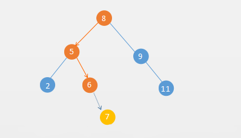

#  Set 集合

## Set 集合的基本概念

　　Set 集合是对数学中集合的抽象，Set 集合有两个特性：

1. Set 集合里没有重复元素
2. Set 集合是无需集合

## Set 集合的基本操作

1. 插入
2. 删除
3. Set 是否为空
4. Set 是否包含某个元素
5. Set 元素个数

　　可以将以上几个操作定义几个方法：

```java
/**
 * Set 集合接口
 *
 * @param <T>
 */
public interface Set<T> {
    /**
     * 添加节点
     *
     * @param e
     */
    void add(T e);

    /**
     * 是否包含节点
     *
     * @param e
     * @return
     */
    boolean contains(T e);

    /**
     * 移除节点
     *
     * @param e
     */
    void remove(T e);

    /**
     * 是否为空
     *
     * @return
     */
    boolean isEmpty();

    /**
     * 大小
     *
     * @return
     */
    int size();
}
```

## Set 集合的 BST 实现和 LinkedList 实现

　　Set 集合底层可以使用顺序的线性表、链表、二叉树来实现。下面分别使用二分搜索树和链表来实现下 Set 集合。

### 二分搜索树实现 Set

　　二分搜索树实现 Set 使用二分搜索树的实现类 BST.java。BST 的实现查看 [二分搜索树](https://github.com/ZhangMiao147/android_learning_notes/blob/master/DataStructure/数据结构/树/二分搜索树.md)。

```java
/**
 * 二叉搜索树实现 Set
 * @param <T>
 */
public class BSTSet<T extends Comparable<T>> implements Set<T> {

    private BST<T> bst;

    public BSTSet() {
        bst = new BST<>();
    }

    @Override
    public void add(T e) {
        bst.add(e);
    }

    @Override
    public boolean contains(T e) {
        return bst.contains(e);
    }

    @Override
    public void remove(T e) {
        bst.remove(e);
    }

    @Override
    public boolean isEmpty() {
        return bst.isEmpty();
    }

    @Override
    public int size() {
        return bst.size();
    }
}
```

### 链表实现二分搜索树

　　链表实现的二分搜索树，使用链表实现类 LinkedList.java。LinkedList 实现查看 [线性表链式存储]()。

```java
/**
 * 链表实现二分搜索树
 * @param <T>
 */
public class LinkedListSet<T> implements Set<T> {

    private LinkedList<T> linkedList;

    @Override
    public void add(T e) {
        if (!linkedList.contains(e)){
            linkedList.addFirst(e);
        }
    }

    @Override
    public boolean contains(T e) {
        return linkedList.contains(e);
    }

    @Override
    public void remove(T e) {
        linkedList.remove(e);
    }

    @Override
    public boolean isEmpty() {
        return linkedList.isEmpty();
    }

    @Override
    public int size() {
        return linkedList.size();
    }
}
```

　　利用 Set 的特性：不允许元素重复。可以使用 Set 集合来统计两本英文原著双城记（A Tale of Two Cities）和傲慢与偏见（Pride and Prejudice）的词汇量。

```
Pride and Prejudice
	Total words: 125901
	Total different words: 6530

A Tale of Two Cities
	Total words: 141489
	Total different words: 9944
```

　　从上面的数据可以看出，傲慢与偏见词汇量 6530，双城记为 9944。这个统计只是简单的统计，比如单词的时态、单复数等都当做一个新单词。

## Set 集合两种实现方式的时间复杂度分析

　　来对比一下基于二分搜索树和链表来实现的 Set 的性能差异：

```
pride-and-prejudice.txt
	Total words: 125901
	Total different words: 6530

pride-and-prejudice.txt
	Total words: 125901
	Total different words: 6530

BSTSet        Time: 0.121546597
LinkedListSet Time: 2.122136759
```

　　根据上面的统计数据可以看出，BSTSET 要比 LinkedlISTsET 快 20 倍左右。

　　链表的插入操作的时间复杂度是 O(1)，但是实现 Set 集合需要先判断集合中是否存在（contains），所以总的下来插入的操作为 O(n)。

　　而二分搜索树的插入时间复杂度为 log(n)。加入网以下一个二分搜索树插入元素 7，插入路径如下图所示：



　　根据插入路径，插入元素 7，只要和 8、5、6 作比较，不需要和链表一样最坏的情况需要和每个元素进行比较。而这个路径也就是二分搜索树的高度。下面用一个表格来对比二分搜索树实现的 Set 和链表实现的 Set 的时间复杂度：

| 操作     | LinkedListSet | BSTSet |
| -------- | ------------- | ------ |
| add      | O(n)          | O(h)   |
| contains | O(n)          | O(h)   |
| remove   | O(n)          | O(h)   |

　　h 就是二分搜索树的高度，那么高度 h 和二分搜索树节点数 n 的关系是什么呢？

　　分析满二叉树的情况就可以直到节点数量和二叉树高度的关系：

| 层数  | 该层的节点数 |
| ----- | ------------ |
| 0层   | 1            |
| 1层   | 2            |
| 2层   | 4            |
| 3层   | 8            |
| 4层   | 16           |
| h-1层 | 2^(h-1)      |

　　那么一个 h 层的满二叉树总共有多少节点呢？就是每层的元素个数相加：

　　n = 2^0+2^1+2^3+2^4+…+2^(h-1) = 2^h - 1

　　用对数表示就是：h=log(n+1)。

　　用大 O 表示法就是：O(h) = O(log n)

| 操作     | LInkedListSet | BSTSet   |
| -------- | ------------- | -------- |
| add      | O(n)          | O(log n) |
| contains | O(n)          | O(log n) |
| remove   | O(n)          | O(log n) |

　　对比下 log(n) 和 n 的差距：

| n    | log(n) | 差距   |
| ---- | ------ | ------ |
| 16   | 4      | 4 倍   |
| 1024 | 10     | 100 倍 |
| 100w | 20     | 5w 倍  |

　　这就是为什么上面的 BSTSet 和 LinkedListSet 快那么多的原因。

　　上面对于二分搜索树的分析是基于满二叉树的，也就是最好的情况下，但是二分搜索树在最坏的情况会退化成链表，这就需要用到平衡二叉树如 AVL 树、红黑树，就算是最坏的情况也能保证二分搜索树不会退化成链表，保持树大致的平衡。

## 参考文章

1. [数据结构与算法（九）Set集合和BinarySearchTree的时间复杂度分析](https://chiclaim.blog.csdn.net/article/details/80628876)


