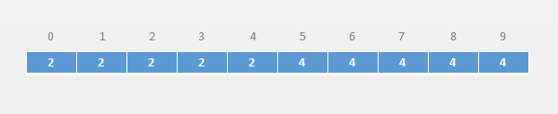
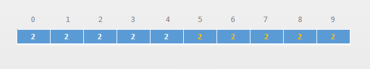
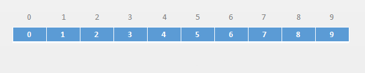
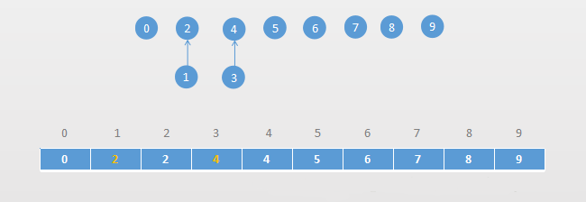
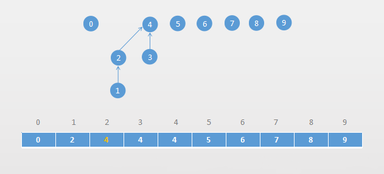
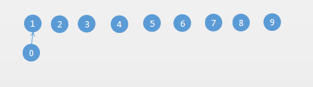
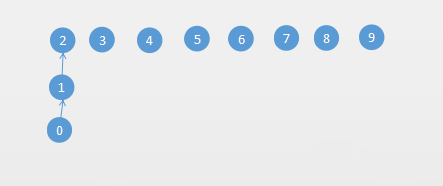
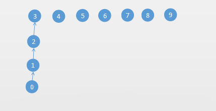
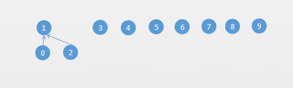

#  并查集

## 并查集的概念

　　在计算机科学中，并查集是一种树形的数据结构，用于处理不交集的合并（union）及查询（find）问题。

　　并查集可用于查询网络中两个节点的状态，这里的网络是一个抽象的概念，不仅仅指互联网中的网络，也可以是人际关系的网络、交通网络等。

　　并查集除了可以用于查询网络中两个节点的状态，还可以用于数学中集合相关的操作，如求两个集合的并集等。

　　并查集对于查询两个节点的连接状态非常高效。对于两个节点是否相连，也可以通过求解查询路径来解决，也就是说如果两个点的连接路径都求出来了，自然也就知道两个点是否相连了，但是如果仅仅想知道两个点是否相连，使用路径问题来处理效率会低一些，并查集就是亿个很好的选择。

## 并查集的操作

1. Find：确定元素属于哪一个子集。它可以被用来确定两个元素是否属于同一子集。
2. Union：将两个子集合并成一个集合。

## 并查集的实现和优化

### Quick Find 方式实现的并查集

　　Quick Find 顾名思义就是并查集查询操作快，合并比较慢。

　　通过一个数组来实现一个并查集，数组索引作为数据编号：



　　从上面的图可以知道：0、1、2、3、4 属于一个集合，5、6、7、8、9 属于一个集合。

　　4 和 5 两个元素酒补属于一个集合（或者不相连），因为他们对应的编号不一样。4 对应的编号是 2，5 对应的编号是 4。

　　如果要合并两个集合（union(1,5)），因为 1 和 5 是属于两个不同的集合，合并后，以前分别和元素 1 连接的元素和 5 连接的元素，也都连接起来了。



　　根据上面的描述得知，基于上面实现方案的并查集，查询操作的时间复杂度为 O(1)，合并操作的时间复杂度为 O(n)。

　　代码如下所示：

```

```

### Quick Union 实现的并查集

　　从上面实现的并查集知道，查询的时间复杂度为 O(1)，合并的时间复杂度为 O(n)，如果数据量一大，O(n) 复杂度就显得很慢了。下面就来优化上面实现的并查集。

　　通过树形结构来描述节点之间的关系，底层存储通过数据来存储。

　　一般的树都是父节点指向子节点的，这里是通过子节点来指向父节点，根节点指向它子集。

　　数组索引用来表示元素编号，存储的是元素编号对应的渡劫带你编号。如下图所示：



　　从上图可以看出，每个节点的父节点编号都是它自己，说明每个节点都是一个根节点，那么这个数组就表示一个森林：


　　例如：合并 1、2，合并 3、4，就变成：



　　合并 1、3，找到 1 和 3 对应的根节点，然后让 1 的根节点指向 3 的根节点：



　　从上面的分析，合并和查找操作的时间复杂度为 O(h)，h 就是树的高度。

　　相对 Quick Find 实现的并查集 Quick Union 实现的并查集牺牲了一点查找的性能，提高了合并的性能。

　　代码如下：

```

```

　　上面两个实现并查集的性能对比：

　　测试方法：

```

```

　　输出结果：

```

```

　　性能差异还是很显著的。但是把操作数改成 p = 100000，性能对比如下：

```

```

　　发现 Quick Union 版本的并查集比 Quick Find 版本的并查集慢很多。这是因为对于 Quick Find 的并查集查询的操作时间复杂度为 O(1)，Quick Union 的合并和查询都是 O(h)，并且生成的树深度可能很深。

　　下面对 Quick Union 版本的并查集进行优化。

### 基于 size 的优化

　　上面 Quick Union 版本的并查集基于树形结构实现的，但是没有对树的高度进行任何优化和限制。

　　所以导致在上面的性能比对中 Quick Union 的并查集性能很差。

　　来看下 Quick Union 版本的并查集是怎么导致树的高度变得很高的。

　　假设经过了这样的几次 union 操作：

　　union(0,1)



　　union(0,2)



　　union(0,3)



　　那么基于 size 优化的思路就是：节点个数少的往节点个数多的树去合并。

　　例如执行上面的 union(0,2)：



　　代码实现如下：

```

```

　　现在来对比下上面三个版本的并查集性能：

```

```

　　通过上面的优化，性能得到了极大的改善。基于 size 的并查集优化方案，主要是降低每棵树的高度。

### 基于 rank 优化

　　上面基于 size 的优化方案，是节点数少的树往节点数多的树合并。

　　但是节点数多不代表树的高度高，比如按照 size 的优化方案，执行 Union(2,5)


### 路径压缩优化


## 并查集的时间复杂度


## 参考文章

1. [数据结构与算法（十二）并查集(Union Find)及时间复杂度分析](https://chiclaim.blog.csdn.net/article/details/80721436)


