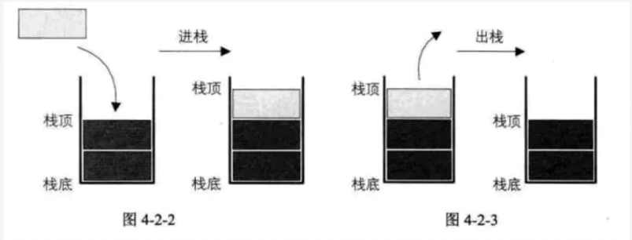
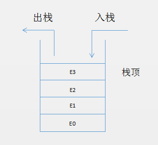
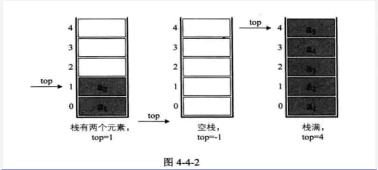

#  栈

## 栈的基本概念

　　是一个只能在某一段进行插入、删除操作的线性表。通常在线性表的尾端，或称栈顶。

　　由此知道栈是一个后进先出（LIFO，Last In First Out）的线性表。

　　从栈顶插入一个元素称之为入栈（push）。

　　从栈顶删除一个元素称之为出栈（pop）。

　　栈是限定仅在表尾进行插入和删除操作的线性表。

　　允许插入和删除的一段称为栈顶（top），另一端称为栈底（bottom），不含任何数据元素的栈称为空栈。栈又称为后进先出的线性表。

　　栈：受约束的线性表。只允许栈顶元素入栈和出栈。



　

## 栈的相关操作

　　因为栈式一个被限制了的线性表，通过索引来插入、删除、访问等操作在栈中式不支持的。

　　栈的常用操作：

1. 入栈：从栈顶插入一个元素
2. 出栈：从栈顶删除一个元素
3. 访问栈顶元素：访问栈顶的元素，但不删除
4. 栈是否为空：判断是否为空
5. 栈元素个数：返回栈里的元素个数
6. 清空栈：将整个栈清空

　　可以将以上几个操作定义一下几个方法：

```java
void push(T element)
T pop()
T peek()
boolean isEmpty()
int size()
void clear()
```

　　入栈、出栈操作示意图：



## 顺序存储实现栈

　　因为栈也是一个线性表，顺序存储实现一个栈也很简单。



```
数据结构与算法（三）栈和 Java Stack 源码分析
```


## 链式存储实现栈

```
数据结构与算法（三）栈和 Java Stack 源码分析
```

　　这里的 stackTop 就相当于以前介绍链表时候的 tail。

## Java Stack 和 LInkedList

　　Java 中的 Stack 底层是用数组实现的，也就是通过顺序存储的方式实现的。继承自 Vector 类，所以它是线程安全的。

　　java.util.LinkedList 是一个不仅实现了 List 接口，还是实现了 Deque 接口，也就是说 LinkedList 不仅是链式存储的线性表还是一个双端队列。

　　在 Java 中，除了 Stack 和 LInkedList 外，ArrayDeque 也可以作为栈使用，ArrayDeque 和 LinkedList 一样，也是双端队列，一个是基于数组实现的，一个是基于链表实现的。

## 栈的实践

　　在计算机中栈的应用非常广泛，比如实现递归计算机需要用栈来存储。比如 Android 界面的管理也用栈来实现。

### LeetCode 第 20 号题有效的括号

　　描述如下：

　　给定一个只包括 '('，')'，'{'，'}'，'['，']' 的字符串，判断字符串是否有效。

　　有效字符串需满足：

1. 左括号必须用相同类型的右括号闭合。
2. 左括号必须以正确的顺序闭合。
3. 注意空字符串可被认为是有效字符串。

　　这个问题通过 Stack 很好解决，先把输入的字符串转换程字符数组，遍历字符数组，如果当前字符是左括号 '('、'{'、'[' 都 push 到栈中，如果当前字符是 ')'，则 pop 栈顶元素是否是 '('，如果当前字符是 '}' 则 pop 栈顶元素是否是 '{'，如果当前字符是 ']' 则 pop 栈顶元素是否是 '['，具体代码如下：

```
数据结构与算法（三）栈和 Java Stack 源码分析
```

### Dijkastra 双栈算术表达式求值

　　求出表达式的值：(1 + ((2 + 3) * (4 * 10)))

　　可以使用两个栈来完成这个操作，一个栈用来存储数值的，一个栈用来存储操作符的，如果遇到 ')'，则从值栈中取出两个值，从操作符栈中取出一个操作符，然后对这两个值进行计算，把结果再放进值栈中。这是 Dijkstra 的双栈算术表达式求值法。

　　为了简单区间，把数字和操作符用空格分开，这样便于把字符串进行分割。代码如下：

```
数据结构与算法（三）栈和 Java Stack 源码分析
```

## 参考文章

1. [数据结构与算法（三）栈和 Java Stack 源码分析](https://chiclaim.blog.csdn.net/article/details/80373290)

2. [从零开始学数据结构和算法(三)栈与栈的应用](https://juejin.im/post/5c9453965188252db02e4be6)

   

