#  B树

## 1. B 树基本概念

　　为什么要引入 B 树，二叉树不是很好吗？存在即合理，所以有存在的理由。B 树的时间复杂度与二叉树一样，均为 O(logN)，然而 B 树出现是因为磁盘 IO。IO 操作的效率很低，那么，当在大量数据存储中，查询时不能一下子把所有数据加载到内存中，只能逐一加载磁盘页，每个磁盘页对应树的节点，多次加载磁盘也会造成大量磁盘 IO 操作（最坏情况下为树的高度）。平衡二叉树由于树深度过大而造成磁盘 IO 读写过于频繁，进而导致效率低下。

　　为了减少磁盘 IO 的次数，就必须降低树的深度，将 “ 瘦高 ” 的树变得 “ 矮胖 ”。

　　B 树这种数据结构常常用于实现数据库索引，因为它的查找效率比较高。

### 2. 磁盘 IO 与预读

　　磁盘读取依靠的是机械运动，分为寻道时间、旋转延迟、传输时间三个部分，这三个部分耗时相加就是依次磁盘 IO 的时间，大概 9ms 左右。这个成本是访问内存的十万倍左右；正是由于磁盘 IO 是非常昂贵的操作，所以计算机操作系统对此做了优化：预读；每一次 IO 时，不仅仅把当前磁盘地址的数据加载到内存，同时也把相邻数据页加载到内存缓冲区中。因为局部预读原理说明：当访问一个地址数据的时候，与其相邻的数据很快也会被访问到。每次磁盘 IO 读取的数据称之为一页（page）。一页的大小与操作系统有关，一般为 4K 或者 8K。这也就意味着读取一页数据的时候，实际上发生了一次磁盘 IO。

### B-Tree 与二叉查找树的对比

　　二叉查找树查询的时间复杂度是 O(logN)，查找速度最快和比较次数最少，既然性能已经如此优秀，但为什么实现索引是使用 B-Tree 而不是二叉查找树，关键因素是磁盘 IO 的次数。

　　数据库索引是存储在磁盘上，当表中的数据量比较大时，索引的大小也跟着增长，达到几个 G 甚至更多。当利用索引仅从查询的时候，不可能把索引全部加载到内存中，只能逐一加载每个磁盘页，这里的磁盘页就对应索引树的结点。

　　二叉树：

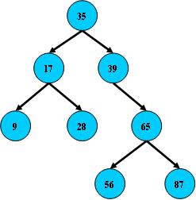

　　B 树：

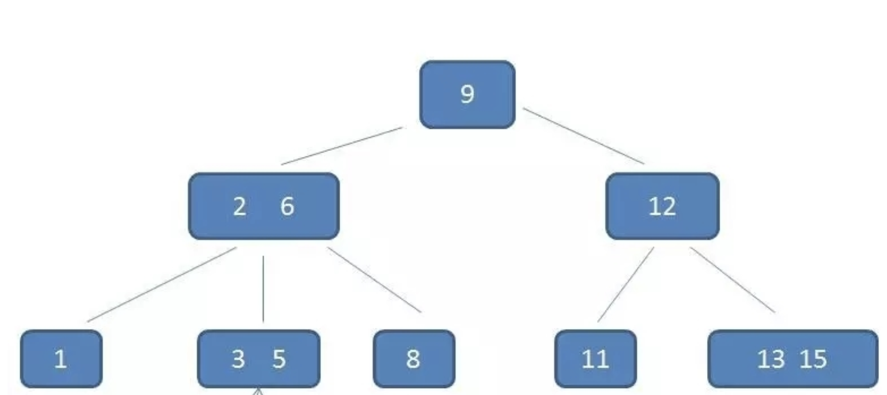

#### 二叉树

　　二叉树以 2 为最大基准向下延伸，而 B 树则没有标准，所以它可以变得矮矮胖胖的。

　　B 树又叫平衡多路查找树。一棵 m 阶的 B 树（m 叉树）的特性如下：

* B 树中所有节点的孩子节点数中的最大值称为 B 树的阶，记为 M（重点）
* 树中的每个节点至少有 M 棵子树 - 即：如果定了 M，则这个 B 树中任何节点的子节点数量都不能超过 M。
* 若根节点不是终端节点，则至少有两棵子树。
* 除根节点和叶节点外，所有点至少有 m/2 棵子树（上溢）
* 所有的叶子节点都位于同一层。（比如上面的图片中没有了 11 13 15，那么 12 就没有存在的意义了，就需要调整整个树的布局）

　　根据 Knuth's 的定义，n 阶 B 树（a B-tree of order n）是具有以下性质：

* 每个点最多有 n 个孩子
* 每个非叶子节点（根节点除外）最多有 n/2 （向上取整）个孩子
* root 至少有 1 个子树，除非 root 的孩子是叶子节点
* k 个孩子的非叶子节点含有 k-1 个键值
* 所有的叶子接待你都在同一层，并且内部节点不携带任何信息。（B 树的阶指最大子节点树。优势，n 阶的 B 树节点定义为有 k 个键值和 k+1 个指针，其中 n<= k <= 2n，用于指定最少的子节点数）

　　注意：根节点为叶子节点，整棵树只有一个根节点。

　　二叉树查找时磁盘 IO 的次：定义一个树高为 4 的二叉树，查找值为 10：

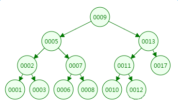

　　第一次磁盘 IO：

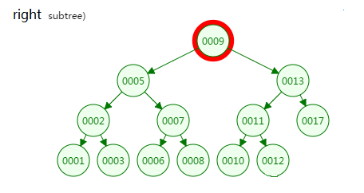

　　第二次磁盘 IO：

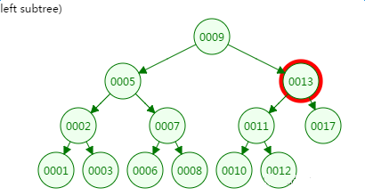

　　第三次磁盘 IO：

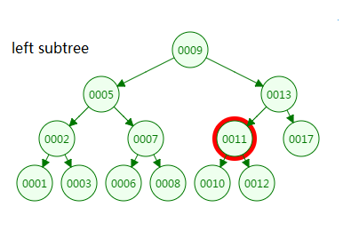

　　第四次磁盘 IO：

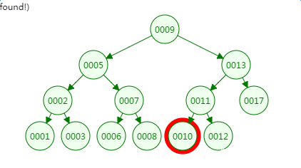

　　从二叉树的查找过程来看，树的高度和磁盘 IO 的次数都是 4，所以最坏的情况下磁盘 IO 的次数由树的高度来决定。

　　从前面分析情况来看，减少磁盘 IO 的次数就必须要压缩树的高度，让瘦高的树尽量变成矮胖的树，所以 B-Tree 就在这样的背景下诞生了。

#### 平衡二叉树

##### 概念

　　平衡二叉树是基于二分法的策略提高数据的查找速度的二叉树的数据结构。

##### 特点

　　平衡二叉树是采用二分法思维把数据按规则组装成一个树形结构的数据，用这个树形结构的数据减少无关数据的检索，大大的提升了数据检索的速度；平衡二叉树的数据结构组装过程有以下规则：

1. 非叶子节点只能允许最多两个子节点存在。
2. 每一个非叶子节点数据分布规则为左边的子节点小于当前节点的值，右边的子节点大于当前节点的值（这里值是基于自己的算法规则而定的，比如 hash 值）。

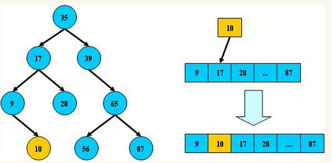

　　平衡树的层级结构：因为平衡二叉树查询性能和树的层级(h 高度)成反比，h 值越小查询越快，为了保证树的结构左右两端数据大致平衡降低二叉树的查询难度一般会采用一种算法机制实现节点数据结构的平衡，实现了这种短发的有比 Treap、红黑树，使用平衡二叉树能保证数据的左右两边的节点层级相差不会大于 1。通过这样避免树形结构由于删除增加变成线性链表影响查询效率，保证数据平衡的情况下查找数据的速度近于二分法查找。

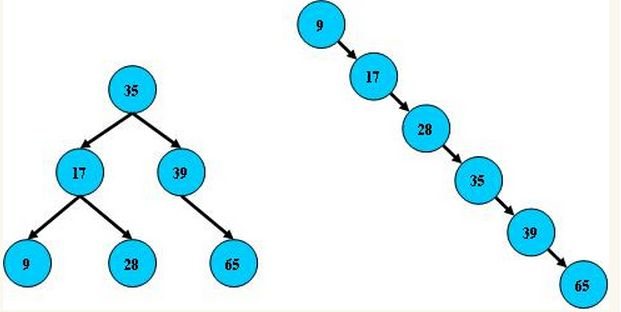

　　总结平衡二叉树特点：

1. 非叶子节点最多拥有两个子节点。
2. 非叶子节点值大于左边子节点，小于右边子节点。
3. 树的左右两边的层级数相差不会大于 1。
4. 没有值相等重复的节点。

#### B-Tree

　　m 阶 B-Tree 满足以下条件：

1. 每个节点最多拥有 m 个子树
2. 根节点至少有 2 个子树
3. 分支节点至少拥有 m/2 棵子树（除根节点和叶子节点外都是分支节点）
4. 所有叶子节点都在同一层、每个节点最多可以有 m-1 个 key，并且以升序排列

##### 概念

　　B 树和平衡二叉树稍有不同的 B 树属于多叉树又名平衡多路查找树（查找路径不只两个），数据哭索引技术例大量使用着 B 树和 B+ 树的结局结构。

##### 规则

1. 排序方式：所有节点关键字是按递增次序排列，并遵循左小右大原则。
2. 子节点数：非叶节点的子节点数>1，且 <= M，且 M >= 2，空树除外（注：M 阶代表一个树节点最多有多少个查找路径，M=M路，当 M=2 则是 2 叉树，M=3 则是 3 叉）。
3. 关键字数：子节点的关键字数量大于等于 Ceil(m/2)-1 个且小于等于 M-1 个（注：ceil() 是个朝正无穷方向取整的函数，如 ceil(1.1) 结果为 2）
4. 所有叶子节点均在同一层，叶子节点除了包含了关键字和关键字记录的指针外也有指向其子节点的指针只不过其指针都为 null 对应下图最后一层节点的空格子。

　　最后用一个图和一个实例的例子来理解 B 树（为了理解方便直接用实际字母的大小来排列 C>B>A）

## B 树的查找操作

　　在 B 树上进行查找和二叉树的查找很相似，二叉树是每个节点上有一个关键字和两个分支。B 树上每个节点有 K 个关键字和 K+1 个分支。二叉树的查找只考虑向左还是向右走，而 B 树中需要由多个分支决定。

　　B 树的查找分两步，首先查找结点，由于 B 树通常是在磁盘上存储的所以这步需要进行磁盘 IO 操作。第二步时查找关键字，当找到某个节点后将该节点读入内存中然后通过顺序或者折半查找来查找关键字。若没有找到关键字，则需要判断大小来找到合适的分支继续查找。

　　如下有一个 3 阶的 B 树，观察查找元素 21 的过程：

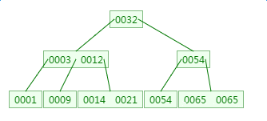

　　第一次磁盘 IO：

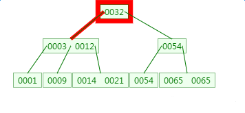

　　这里有一次内存比对：分别跟 3 和 12 比对。

　　第二次磁盘 IO：

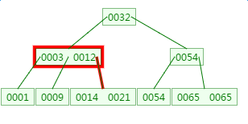

　　第三次磁盘 IO：

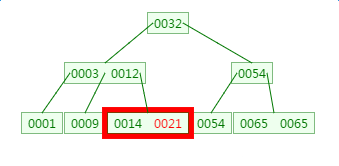

　　这里有一次内存比对，分别跟 14 与 21 比对。

　　从查找过程中发现，B 树的比对次数和磁盘 IO 的次数与二叉树相差不了多少，所以这样看来并没有什么优势。

　　但是仔细一看会发现，比对是在内存中完成的，不涉及到磁盘 IO，耗时可以忽略不计。另外 B 树中一个节点中可以存放很多的 Key（个数由树阶决定）。

　　相同数量的 key 在 B 树种生成的节点要远远少于二叉树中的节点，相差的节点数量就等同于磁盘 IO 的次数。这样到达一定数量后，性能的差异就显现出来了。

　　由于 B 树相对于二叉树来说矮胖了许多，所以它锁涉及的 IO 操作也相对少了许多。不过根据上面的分析，其在查找数据的时候并没有减少比较次数。但是在比较数据的时候是在内存中进行的，所以相对来说时间上会更加迅速，几乎可以忽略。

　　而相同数量的 key 在 B 树中生成的节点要远远少于二叉树中的节点，相差的节点数量就等同于磁盘 IO 的次数。这样到达一定数量后，性能的差异就显现出来了。

　　如上如要从上图中找到 E 字母，查找流程如下：

1. 获取根节点的关键字进行比较，当前根节点关键字为 M，E<M（26 个字母顺序），所以往找到指向左边的子节点（二分法规则，左小右大，左边放小于当前节点值的子节点、右边放大于当前节点值的子节点）。
2. 拿到关键字 D 和 G，D<E<G 所以直接找到 D 和 G 中间的节点。
3. 拿到 E 和 F，因为 E=E 所以直接返回关键字和指针信息（如果树结构里面没有包含所要查找的节点则返回 null）。

## B 树的新增

　　对高度为 k 的 m 阶 B 树，新结点一般是插在叶子层。通过检索可以确定关键码应插入的结点位置。然后分两种情况讨论：

1. 若该节点中关键码个数小于 m-1，则直接插入即可。
2. 若该节点中关键码个数等于 m-1，则将引起节点的分裂。以中间关键码为界将节点一分为二，产生一个新节点，并将中间关键码插入到父节点（k-1 层）中。

　　重复上述工作，最坏情况一直分裂到根节点，建立一个新的根节点，整个 B 树增加一层。

　　例如：在下面的 B 树种插入 key:4

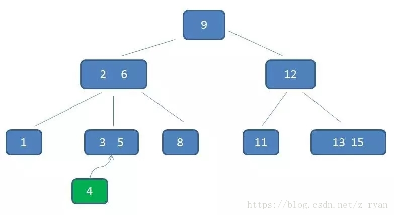

1. 第一步：检索 key 插入的节点位置如上图所示，在 3、5 之间。

2. 第二步：判断节点种的关键码个数

   节点 3、5 已经是连元素节点，无法再增加（已经  = 3-1）。父亲节点 2、6 也是两元素节点，也无法再增加。根节点 9 是单元素节点，可以升级为两元素节点。

3. 第三步：节点分裂

   拆分节点 3、5 与节点 2、6，让根节点 9 升级为两元素节点 4、9。节点 6 独立为根节点的第二个孩子。

　　最终结果图如下：虽然插入比较麻烦，但是这也能确保 B 树是一个自平衡的树。

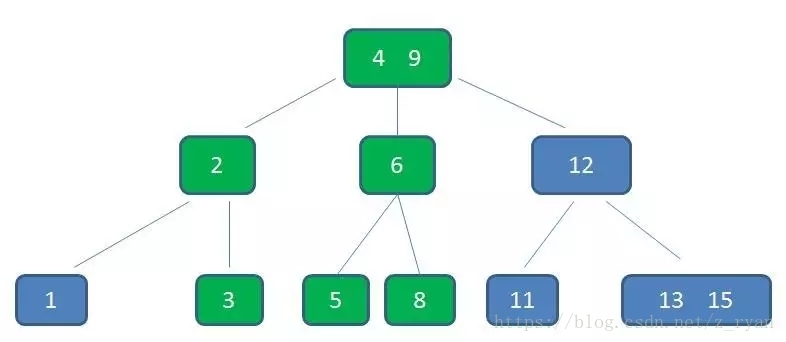

　　另一个例子：

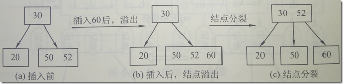

　　当插入一个关键字 60 后，节点内的关键字个数超过了 m-1=2，此时必须进行节点分裂，分裂的过程图如上图所示。

　　新增元素 4，它应该在 3 与 9 之间：

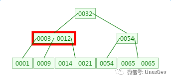

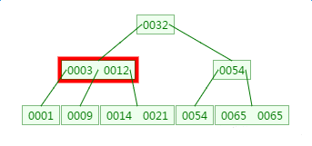

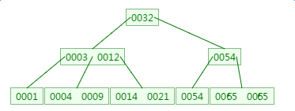

　　定义一个 5 阶树（平衡 5 路查找树），现在要把 3、8、31、11、23、29、50、28 这些数字构建出一个 5 阶树出来。

　　遵循规则：

1. 节点拆分规则：当前是要组成一个 5 路查找树，那么此时 m=5，关键字数必须 <= 5-1（这里关键字数 >4 就要进行节点拆分）。
2. 排序规则：满足节点本身比左边节点大，比右边节点小的排序规则。

　　先插入 3、8、31、11：

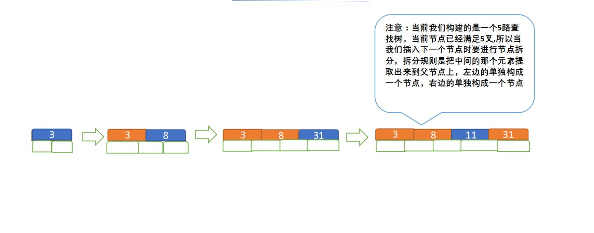

　　再插入 23、29：

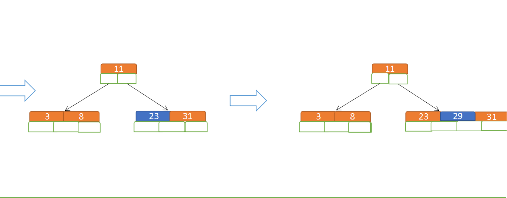

　　再插入 50、28:

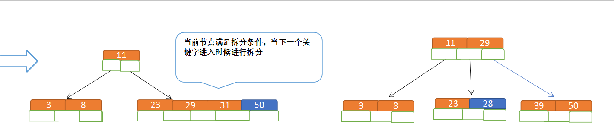

## B 树的删除

　　首先，根据 key 删除记录，如果 B 树中的记录中不存在对应 key 的记录，则删除失败。

　　之后需要分以下四种情况来考虑。

　　下面的例子中以 5 阶 B 树为例，介绍 B 树的删除操作，5 阶 B 树种，节点最多有 4 个 key，最少有 2 个 key。

　　对于删除 key 的过程来说，对于叶节点和非叶节点其实差别在一个地方，那就是如果当前操作的是非叶节点，那么后继 key（这里的后继 key 指最接近当前删除值，且大于当前删除值的值）覆盖要删除的 key，然后在后继 key 所在的子支中删除该后继 key。

　　例如：

1. 原始状态

   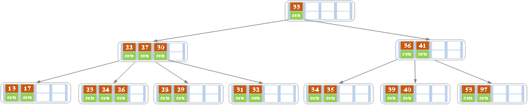

2. 在上述情况下接着删除 27。从上图可知 27 位于非叶子节点中，所以用 27 的后继替换它。从图中可以看出，27 的后继为 28，用 28 替换 27，然后在 28（原 27） 的右孩子节点中删除 28。删除后的结果如下图所示。

   

　　之后就把非叶节点的情况转换为了处理叶节点的情况。

　　此时就要分一下几种情况来考虑如何处理叶节点。

* 1. 该节点 key 个数 >= Ceil(m/2)-1（上界，例如 m=5，那么最后为 2），结束删除操作，否则执行下一步。
* 2. 该节点 key 的个数 < Ceil(m/2)-1，且兄弟节点 key 个数 > Ceil(m/2)-1，则父节点中的 key 下移到该节点，兄弟节点中的一个 key 上移，删除操作结束。

　　接着上面的例子。

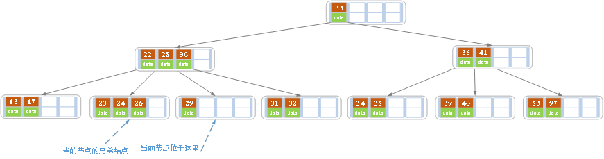

　　删除后发现，当前叶子节点的记录的个数小于 2（<Ceil(m/2)-1），而它的兄弟节点中有 3 个记录（>Ceil(m/2)-1 当前节点还有一个右兄弟，选择右兄弟就会出现合并节点的情况，不论选哪一个都行，只是最后 B 树的形态会不一样而已），可以从兄弟节点中借取一个 key。所以父节点中的 28 下移，兄弟节点中的 26 上移，删除结束。结果如下图所示：

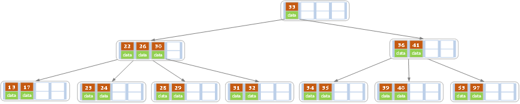

* 3. 如果该节点 key 的个数 < Ceil(m/2)-1，且兄弟节点 key 个数 <= Ceil(m/2)-1，那么将父节点中的 key 下移与当前节点及它的兄弟节点中的 key 合并，形成一个新的节点。原父节点中的 key 的两个孩子指针就变成了一个孩子指针，指向这个新节点。

　　例如：

　　原图为：

　　在上述情况下删除 32：

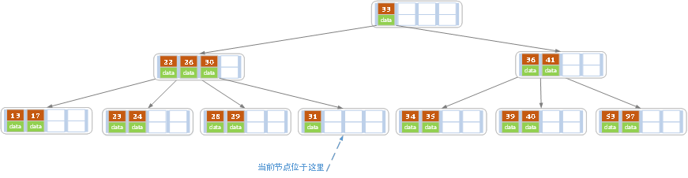

　　当删除后，当前节点中只有一个 keu（个数 < Ceil(m/2)-1），而兄弟节点中也仅有 2 个 key（<= Ceil(m/2)-1）。所以只能让父节点中的 30 下移和这个两个孩子节点中的 key 合并，成为一个新的节点，当前节点的指针指向父节点。结果如下图所示。

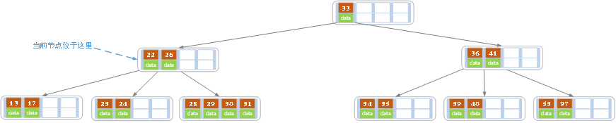

　　由于移动了父节点中的数据，所以其 key 值减少，那么就要对当前父节点进行考虑。

　　下面看一个考虑父节点的例子。

　　原图：

　　上述情况下，接着删除 key 为 40 的记录，删除后结果如下图所示：

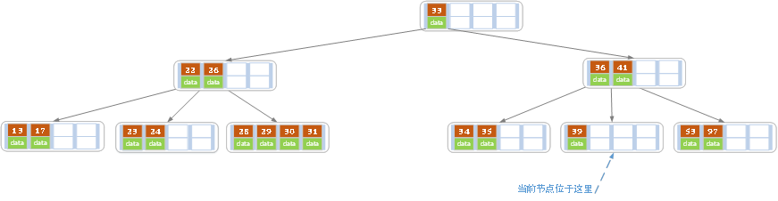

　　同理，当前节点的记录数小于 2（根据情况 3），兄弟节点中没有多余 key，所以父节点中的 key 下移，和兄弟（这里选择左兄弟，选择右兄弟也可以）节点合并，合并后的指向当前节点的指针就指向了父节点。

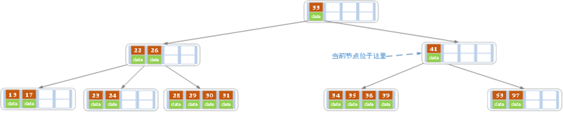

　　同理，对于当前节点而言只能继续合并了，最后结果如下所示。（根据情况3）

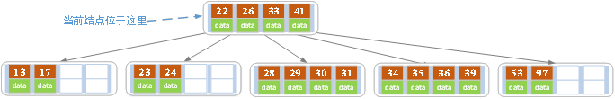

　　合并后节点当前节点满足条件，删除结束。

　　删除元素 9：

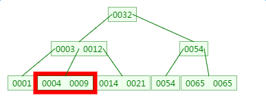

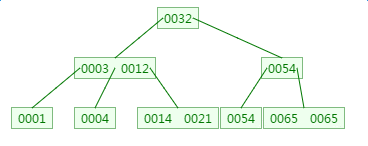

### 规则

1. 节点合并规则：当前是组成一个 5 路查找树，那么此时 m=5，关键字数必须大于等于 ceil(5/2)（这里关键字数<2 就要进行节点合并）。
2. 满足节点本身比左边节点大，比右边节点小的排序规则。
3. 关键字数小于二时先从子节点取，子节点没有符合条件时就向父节点取，取中间值往父节点放。

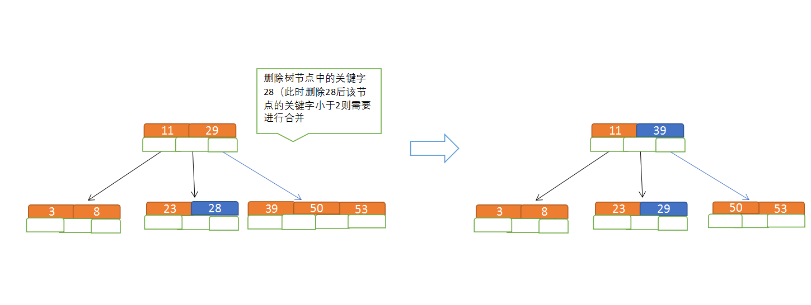

## B 树特点

　　B 树相对于平衡二叉树的不同是，每个节点包含的关键字增多了，特别是在 B 树应用到数据库中的时候，数据库充分利用了磁盘块的原理（磁盘数据存储是采用块的形式存储的，每个块的大小为 4K，每次 IO 进行数据读取时，同一个磁盘块的数据可以一次性读取出来）把节点大小限制和充分使用在磁盘块大小范围，把树的节点关键字增多后树的层级比原来的二叉树少了，减少数据查找的次数和复杂度。

## 总结

　　插入或者删除元素都会导致节点发生裂变反应，有时候会非常麻烦，但正因为如此才让 B 树能够始终保持多路平衡，这也是 B 树自身的一个优势：自平衡；B 树主要应用于文件系统以及部分数据库索引，如 MongoDB，大部分关系型数据库索引则是使用 B+ 树实现。

## 参考文章

1. [B树详解](https://www.jianshu.com/p/a858bb15cbf0)
2. [B-Tree与二叉查找树的对比](http://m.elecfans.com/article/662237.html)
3. [平衡二叉树、B树、B+树、B*树 理解其中一种你就都明白了](https://zhuanlan.zhihu.com/p/27700617)