#  二分搜索树

## 1. 概述

　　二分搜索树（Binary Search Tree），也称为二叉查找树、二叉搜索树、有序二叉树（ordered binary tree）或排序二叉树（Sorted binary tree）。

　　二分搜索树（Binary Search Tree）满足以下几个条件：

1. 若它的左子树不为空，左子树上所有的节点的值都小于它的根结点
2. 若它的右子树不为空，右子树上所有的节点的值都大于它的根节点。
3. 它的左、右子树也都是二分搜索树。

　　如果插入的元素在二分搜索中已经存在，则根据具体的情况而定，如果不允许重复，直接抛弃即可，如果允许重复可以使用计数的方式，即每个节点保存自己的个数。

　　二分搜索树有着高效的插入、删除、查询操作。平均时间复杂度为 O(logn)；最差情况为 O(n)。

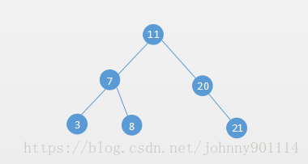

## 2. 二分搜索树的基本操作

### 2.1. 插入操作

　　根据二分搜索树的定义，二分搜索树的插入操作就比较简单了。

　　如果二分搜索树为空，那么新插入的节点就作为根节点。

　　如果二分搜索树不为空，新节点和根节点作比较，如果比根节点小，则和根节点的左子树比较；如果比根节点大则和右子树作比较，直到没有左子树或者右子树了，然后把新节点作为左子树或者右子树节点。

　　比如要往二叉树添加节点 10：首先和根节点 11 作比较，10 比 11 小，和 11 的左子树 7 对比，比 7 大，然后和 7 的右子树 8 对比，比 8 大，然后和 8 右子树对比，发现 8 的右子树为空，则新节点 10 作为 8 的右子树。

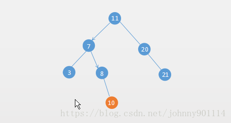

### 2.2. 删除操作

　　删除操作就比插入操作要稍微复杂一点，二分搜索树的删除操作一一般分为几种情况。

#### 2.2.1. 如果要删除的节点只有左子树

　　如果要删除的节点只有左子树，那么直接用它的左子树替换要删除的节点即可。

　　比如要删除节点 3，它只有左子树：

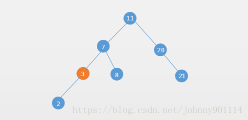

　　删除后：

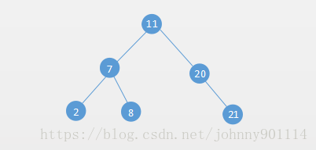


#### 2.2.2. 如果要删除的节点只有右子树

　　如果要删除的节点只有右子树，直接让其右子树代替要删除的节点即可。

　　比如要删除节点 20，它只有右子树：

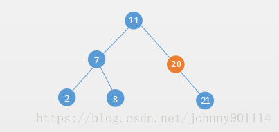

　　删除后：

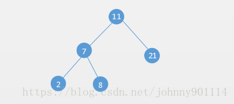

#### 2.2.3. 如果要删除的节点同时拥有左子树和右子树

　　如果要删除的节点同时有左子树和右子树，首先找到要删除节点的后继（该节点右子树中的最小值），然后把后继删除并且替换要删除的节点。

　　比如要删除下面的二叉搜索树的节点 21：

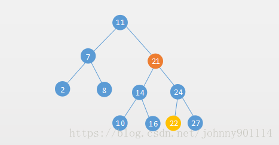

　　然后把要删除的节点 21 的后继 22 删除并代替要删除的节点：

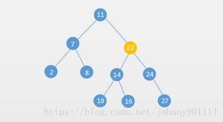

　　也可以用待删除结点的前驱（节点的左子树中的最大值）：

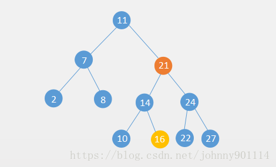

　　删除后：

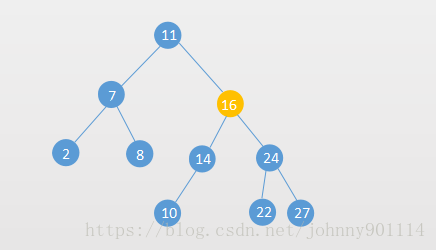

### 2.3. 查询操作

　　二分搜索树的查询操作和插入操作类似，也是不断地比较，前提是如果相等就不用比较了，如果不能就按照插入的方式进行比较。

　　在比较的过程就把很多无用的元素过滤掉了，所以二分搜索树的插入、删除、查询是很高效的。

## 3. 实现二分搜索树

```java
public class BST<T extends Comparable<T>> {

    private static class Node<T> {
        private T value; // 存储的值
        private Node<T> left, right; // 左子树和右子树

        public Node(T value) {
            this.value = value;
        }
    }

    private Node<T> root; // 根节点
    private int size; // 存储的节点个数

    public boolean isEmpty() {
        return size == 0;
    }

    public void add(T e) {
        root = add(root, e);
    }

    /**
   	* 插入节点
   	*/
    private Node<T> add(Node<T> node, T e) {
        if (node == null) {
            size++;
            return new Node<>(e);
        }
        if (e.compareTo(node.value) < 0) {
            node.left = add(node.left, e);
        } else if (e.compareTo(node.value) > 0) {
            node.right = add(node.right, e);
        }
        return node;
    }

    public boolean contains(T e) {
        return contains(root, e);
    }

    private boolean contains(Node<T> node, T e) {
        if (node == null) {
            return false;
        }
        if (e.compareTo(node.value) < 0) {
            return contains(node.left, e);
        } else if (e.compareTo(node.value) > 0) {
            return contains(node.right, e);
        }
        return true;
    }

    public void preorder() {
        preorder(root);
    }

    /**
     * 前序遍历
     *
     * @param node
     */
    private void preorder(Node<T> node) {
        if (node == null) {
            return;
        }
        System.out.print(node.value);
        preorder(node.left);
        preorder(node.right);
    }

    /**
     * 前序遍历的非递归遍历
     */
    public void preorderNoRecurse() {
        if (root == null) {
            return;
        }
        Stack<Node<T>> stack = new Stack<>();//用栈来存储
        stack.push(root); // 入栈
        while (!stack.isEmpty()) {
            Node<T> n = stack.pop(); // 出栈
            System.out.print(n.value);
            if (n.right != null) {
                stack.push(n.right);// 将右子树入栈
            }
            if (n.left != null) {
                stack.push(n.left); // 将左子树入栈
            }
        }
    }

    /**
     * 中序遍历
     */
    public void inorder() {
        inorder(root);
    }

    private void inorder(Node<T> node) {
        if (node == null) {
            return;
        }
        inorder(node.left);
        System.out.print(node.value);
        inorder(node.right);
    }

    public void postorder() {
        postorder(root);
    }

    private void postorder(Node<T> node) {
        if (node == null) {
            return;
        }
        postorder(node.left);
        postorder(node.right);
        System.out.print(node.value);
    }

    /**
     * 广度优先遍历
     */
    public void levelorder() {
        if (root == null) {
            return;
        }
        Deque<Node> queue = new ArrayDeque<>(); // 双向队列
        queue.addLast(root);
        while (!queue.isEmpty()) {
            Node<T> node = queue.removeFirst();
            System.out.print(node.value);
            if (node.left != null) {
                queue.addLast(node.left);
            }
            if (node.right != null) {
                queue.addLast(node.right);
            }
        }
    }

    public T getMax() {
        if (root == null) {
            throw new NoSuchElementException();
        }
        return getMax(root).value;
    }

    private Node<T> getMax(Node node) {
        if (node.right == null) {
            return node;
        }
        return getMax(node.right);
    }

    public T getMin() {
        if (root == null) {
            throw new NoSuchElementException();
        }
        return getMin(root).value;
    }

    private Node<T> getMin(Node node) {
        if (node.left == null) {
            return node;
        }
        return getMin(node.left);
    }

    public T removeMin() {
        T delete = getMin();
        // 因为可能只有一个节点，所以需要 root 接收 removeMin 的返回值 null
        root = removeMin(root);
        return delete;
    }

    private Node<T> removeMin(Node node) {
        if (node.left == null) {
            Node<T> rightNode = node.right;
            node.right = null;
            size--;
            return rightNode;
        }
        // 把要删除节点的右节点赋值给父节点的左节点
        node.left = removeMin(node.left);
        return node;
    }

    public T removeMax() {
        T delete = getMax();
        // 因为可能只有一个节点，所以需要 root 接收 removeMin 的返回值 null
        root = removeMax(root);
        return delete;
    }

    private Node<T> removeMax(Node<T> node) {
        if (node.right == null) {
            Node<T> leftNode = node.left;
            size--;
            node.left = null;
            return leftNode;
        }
        node.right = removeMax(node.right);
        return node;
    }

    public void remove(T e) {
        root = remove(root, e);
    }

    // 删除节点
    private Node<T> remove(Node<T> node, T element) {
        if (node == null) {
            return null;
        }
        // 如果要删除的节点小于当前节点，继续查询其左子树
        if (element.compareTo(node.value) < 0) {
            node.left = remove(node.left, element);
            return node;
        }
        // 如果要删除的节点大于当前节点，继续查询其右子树
        if (element.compareTo(node.value) > 0) {
            node.right = remove(node.right, element);
            return node;
        }

        // 要删除的节点就是当前的节点
        // 1. 如果要删除节点的左子树为空
        if (node.left == null) {
            Node<T> rightNode = node.right;
            node.right = null;
            size--;
            return rightNode;
        }

        // 2. 如果要删除节点的右子树为空
        if (node.right == null) {
            Node<T> leftNode = node.left;
            node.left = null;
            size--;
            return leftNode;
        }

        // 3. 如果要删除的节点左右子树都不为空
        // 找到要删除节点的后继，也就是右子树的最小值
        Node<T> successor = getMin(node.right);
        successor.right = removeMin(node.right);
        successor.left = node.left;
        node.left = node.right = null;
        return successor;
    }
}
```

　　由于二分搜索树的特性，二分搜索树的中序遍历就是二分搜索树的从小到大的顺序。

　　上面的二分搜索树主要是通过递归实现的，下面仅分析下 add 插入方法的递归：

　　假设要往下面一个二分搜索树插入元素 7：

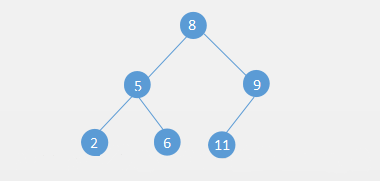

　　插入操作的调用栈如下所示（为了方便描述，省略具体的栈帧细节，栈帧里的数字均表示节点）：

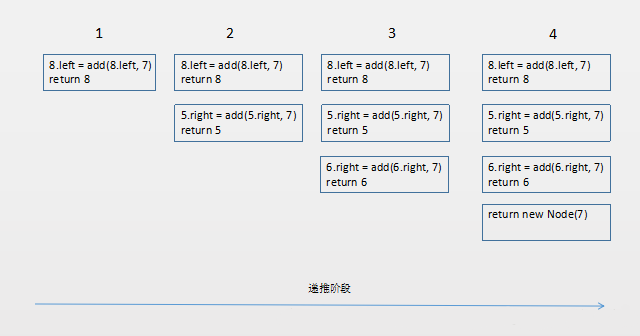

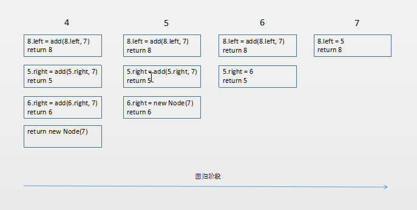

　　插入的最终结果如下：

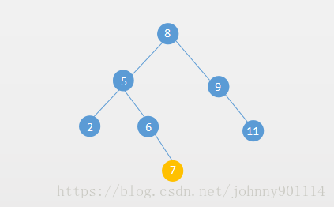

　　为什么要用 root 接收 add(root,e) 方法的返回值？

```java
public void add(T e) {
   root = add(root, e);
}
```

　　这时因为如果当前二叉搜索树为空，那么新插入的节点就是根节点。如果不为空，也就是对 root 根节点赋值给自己。用递归的方式实现很优雅巧妙。删除操作也是类似的。

## 4. 二分搜索树的不足

　　一般情况下，二分搜索树有着高效的插入、删除、查询等操作，时间复杂度为 O(logN)。

　　但是如果待插入的数据刚好是有序的，那么这个二分搜索树就退化成链表了，也就是为什么二分搜索树的最差时间复杂度为 O(N)。

　　例如下面两个退化成链表的二分搜索树：

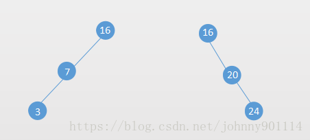

　　解决这个问题，可以用平衡二叉树。

## 5. 参考文章

1. [数据结构与算法（八）二分搜索树(Binary Search Tree)](https://chiclaim.blog.csdn.net/article/details/80598727)

