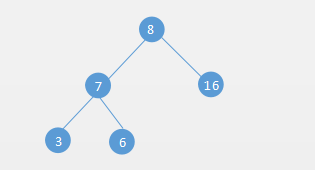
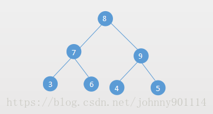
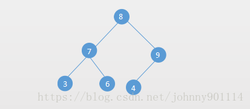
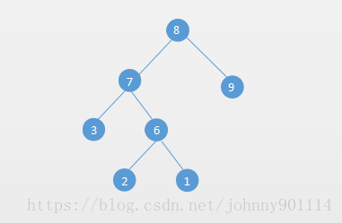
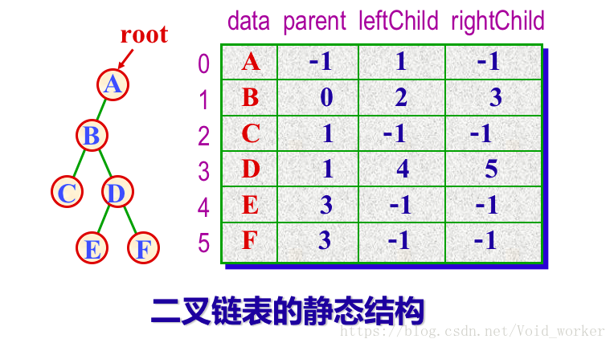
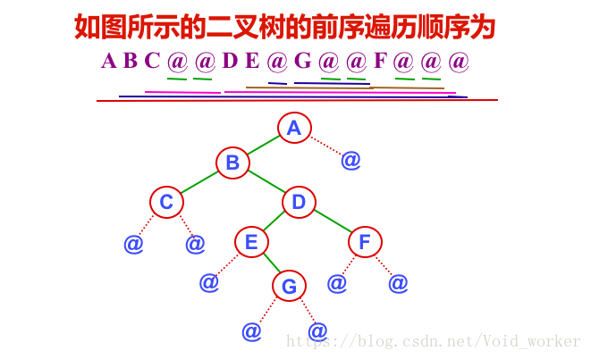
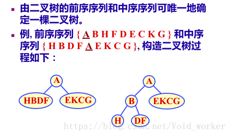
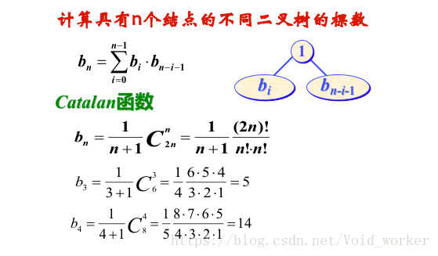
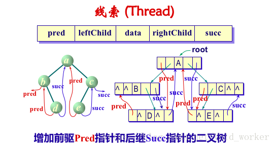
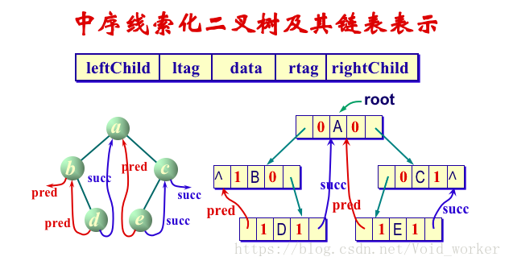

#  二叉树

## 1. 基本概念

　　二叉树是一个每个结最多只能有两个分支的树，左边的分支称之为左子树，右边的分支称之为右子树。

　　也就是说二叉树结点的度最大也就是 2，而普通的树，结点的度是没有限制的。



## 2. 二叉树的分类

### 2.1. 完美/满二叉树（Perfect Binary Tree）

　　完美二叉树也被称之为满二叉树。完美二叉树满足两个也行：

1. 所有的结点都包含两个子结点。
2. 所有的叶子结点的 Height 或者 Level 都相等。




### 2.2. 完全二叉树（Complete Binary Tree）

　　完全二叉树是除了最后一层都是满的（都有两个子节点），并且最后一层的结点是从左往右排列的。

　　完全二叉树，通俗点说就是结点按层从左往右排列。如果最后一层排满了就是完美二叉树，没有满则是完全二叉树。

　　所以完美二叉树一定是完全二叉树，完全二叉树不一定是完美二叉树。

　　一个完全二叉树可以高效的使用数组来表示。



### 2.3. 完满二叉树（Full Binary Tree）

　　完满二叉树就是每个结点都有两个子节点，也就是说比完美二叉树少了一个条件。



## 3. 二叉树的性质

　　具有 n 个结点的完全二叉树的高度（或深度）为 取下整（log2n）+1，也可以写为取上整 log2(n+1)。

##  4. 二叉树的存储结构

* 顺序存储结构：最适用于存储完全二叉树。
* 链式存储结构：一个数据域，两个指针域的链式结点结构。

```c++
typedef struct BTNode{
    int data;
    struct BTNode *lchild;
    struct BTNode *rchild;
}BTNode;
```

##  5. 二叉树的存储表示

* 二叉树的顺序表示
* 二叉树的链式表示（二叉链表）
* 三叉链表：增加一个指向双亲的指针 parent(如下图)



### 5.1. 二叉树的顺序存储

　　下面用数组实现一个简单的二叉树：

```java
/**
 * 二叉树的顺序存储
 *
 * @param <T>
 */
public class ArrayBinaryTree<T> {
    public static final int DEFAULT_DEEP = 5;
    private int deep; // 深度
    private int capacity; // 得知深度的情况下，最大的容量，即节点个数
    private Object[] nodes; // 数据存储

    public ArrayBinaryTree() {
        this(DEFAULT_DEEP);
    }

    public ArrayBinaryTree(int deep) {
        this.deep = deep;
        nodes = new Object[capacity = (int) Math.pow(2, deep) - 1];
    }

    public ArrayBinaryTree(int deep, T rootData) {
        this(deep);
        nodes[0] = rootData;
    }

    public void add(int parentIndex, T data, boolean left) {
        if (data == null) {
            throw new NullPointerException();
        }
        if (nodes[parentIndex] == null) {
            throw new NoSuchElementException();
        }
        if (left) {
            // parentIndex * 2 +1 就是 parentIndex 的左节点的存储位置
            nodes[parentIndex * 2 + 1] = data;
        } else {
            // parentIndex * 2 +2 就是 parentIndex 的右节点的存储位置
            nodes[parentIndex * 2 + 2] = data;
        }
    }

    public boolean isEmpty() {
        return nodes[0] == null;
    }

    /**
     * 获取索引为 index 节点的父节点
     * @param index
     * @return
     */
    public T getParent(int index) {
        if (index == 0) {
            return null;
        }
        return (T) nodes[(index - 1) / 2];
    }

    /**
     * 获取索引为 index 的右节点
     * @param index
     * @return
     */
    public T getRight(int index) {
        if (2 * index + 1 >= capacity) {
            return null;
        }
        return (T) nodes[index * 2 + 2];
    }

    /**
     * 获取索引为 index 的左节点
     * @param index
     * @return
     */
    public T getLeft(int index) {
        if (2 * index + 1 >= capacity) {
            return null;
        }
        return (T) nodes[2 * index + 1];
    }

    public T getRoot() {
        return (T) nodes[0];
    }

    public int indexOf(T data) {
        for (int i = 0; i < capacity; i++) {
            if (nodes[i].equals(data)) {
                return i;
            }
        }
        return -1;
    }

    public void showTree() {
        System.out.println("nodes:" + Arrays.toString(nodes));
    }
}
```

### 5.2. 二叉树的链式存储

```java
public class TwoLinkedBinaryTree<T> {
    class Node {
        Object data;
        Node left; // 左节点
        Node right; // 右节点

        public Node() {

        }

        public Node(Object data) {
            this.data = data;
        }

        public Node(Object data, Node left, Node right) {
            this.data = data;
            this.left = left;
            this.right = right;
        }

        @Override
        public String toString() {
            return "Node{" +
                    "data=" + data +
                    '}';
        }
    }

    public Node root;

    public TwoLinkedBinaryTree() {
        this.root = new Node();
    }

    public TwoLinkedBinaryTree(T data) {
        this.root = new Node(data);
    }

    public Node addNode(Node parent, T data, boolean left) {
        if (data == null) {
            throw new NullPointerException();
        }

        if (parent == null) {
            throw new IllegalStateException("节点为 null，不能添加子节点");
        }
        if (left && parent.left != null) {
            throw new IllegalStateException(parent + " 节点已经存在左节点");
        }
        if (!left && parent.right != null) {
            throw new IllegalStateException(parent + " 节点已经存在右节点");
        }
        Node node = new Node(data);
        if (left) {
            parent.left = node;
        } else {
            parent.right = node;
        }
        return node;
    }

    public boolean isEmpty() {
        return root.data == null;
    }

    public T getLeft(Node parent) {
        return parent == null ? null : (T) parent.left.data;
    }

    public T getRight(Node parent) {
        return parent == null ? null : (T) parent.right.data;
    }
}
```

### 5.3. 二叉树的三叉链表存储

```java
/**
 * 二叉树的三叉链表存储
 *
 * @param <T>
 */
public class ThreeLinkedBinaryTree<T> {
    class Node {
        Object data;
        Node parent; // 父节点
        Node left; // 左节点
        Node right; // 右节点

        public Node() {

        }

        public Node(Object data, Node parent) {
            this.data = data;
            this.parent = parent;
        }

        public Node(Object data, Node parent, Node left, Node right) {
            this.data = data;
            this.parent = parent;
            this.left = left;
            this.right = right;
        }

        @Override
        public String toString() {
            return "Node{" +
                    "data=" + data + "parent=" + (parent == null ? "null" : parent.data) +
                    '}';
        }
    }

    public Node root;

    public ThreeLinkedBinaryTree() {
        this.root = new Node();
    }

    public ThreeLinkedBinaryTree(T data) {
        // 根节点
        this.root = new Node(data, null);
    }

    public Node addNode(Node parent, T data, boolean left) {
        if (data == null) {
            throw new NullPointerException();
        }

        if (parent == null) {
            throw new IllegalStateException("节点为 null，不能添加子节点");
        }
        if (left && parent.left != null) {
            throw new IllegalStateException(parent + " 节点已经存在左节点");
        }
        if (!left && parent.right != null) {
            throw new IllegalStateException(parent + " 节点已经存在右节点");
        }
        Node node = new Node(data, parent);
        if (left) {
            parent.left = node;
        } else {
            parent.right = node;
        }
        return node;
    }

    public boolean isEmpty() {
        return root.data == null;
    }

    public T getLeft(Node parent) {
        return parent == null ? null : (T) parent.left.data;
    }

    public T getRight(Node parent) {
        return parent == null ? null : (T) parent.right.data;
    }
}

```

##  6. 二叉树的遍历

　　树的遍历主要有两种，一种是深度优先遍历，一个是广度优先遍历。

　　深度优先遍历又有三种：前序、中序、后序遍历。

　　前序、中序、后序遍历区别在于访问节点的是前面访问还是中间访问还是后面访问。

　　前序遍历：当前节点 -> 左节点 -> 右节点。

　　中序遍历：左节点 -> 当前节点 -> 右节点。

　　后序遍历：左节点 -> 右节点 -> 当前节点。

### 6.1. 前序遍历

```java
    /**
     * 前序遍历
     *
     * @param node
     */
    public void preoder(Node node) {
        if (node == null) {
            return;
        }
        System.out.print(node.data); // 前面访问节点
        preoder(node.left);
        preoder(node.right);
    }
```

### 6.2. 中序遍历

```java
    /**
     * 中序遍历
     *
     * @param node
     */
    public void inorder(Node node) {
        if (node == null) {
            return;
        }
        inorder(node.left);
        System.out.print(node.data);//中间访问节点
        inorder(node.right);
    }
```

### 6.3. 后序遍历

```java
    /**
     * 后序遍历
     *
     * @param node
     */
    public void postorder(Node node) {
        if (node == null) {
            return;
        }
        postorder(node.left);
        postorder(node.right);
        System.out.print(node.data);
    }
```

### 6.4. 广度优先遍历

　　广度优先遍历也叫做按层遍历（一层一层的遍历节点）：

```java
    /**
     * 广度优先遍历
     * @param root
     */
    public void levelorder(Node root) {
        if (root == null) {
            return;
        }
        Deque<Node> queue = new ArrayDeque<>();//双向队列
        queue.addLast(root);
        while (!queue.isEmpty()) {
            // 从头拿出节点打印
            Node node = queue.removeFirst();
            System.out.print(node.data);
            // 将节点的左子树和右子树放到队列的尾部
            if (node.left != null) {
                queue.addLast(node.left);
            }
            if (node.right != null) {
                queue.addLast(node.right);
            }
        }
    }
```

##  7. 构造二叉树

　　使用二叉树前序遍历建立二叉树：



　　构造二叉树：



　　二叉树计数：



##  8. 线索化二叉树

　　线索化二叉树，又称穿线树，将某种遍历顺序下的前驱、后继关系记在树的存储结构中，可以高效地找出某节点地前驱、后继。





## 9. 参考文章

1. [数据结构--知识点总结--树](https://blog.csdn.net/void_worker/article/details/80919901)
2. [数据结构与算法（七）树和二叉树](https://chiclaim.blog.csdn.net/article/details/80574803)
