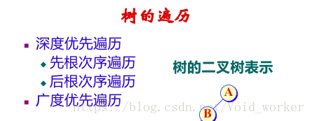
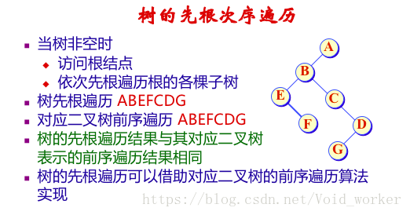
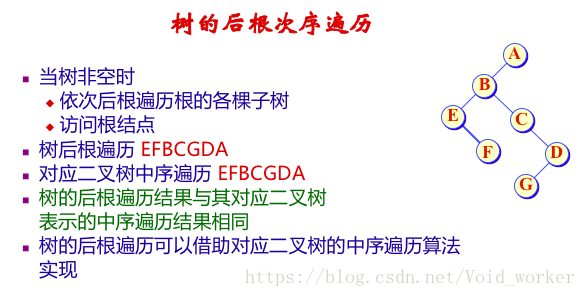
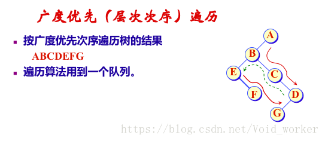
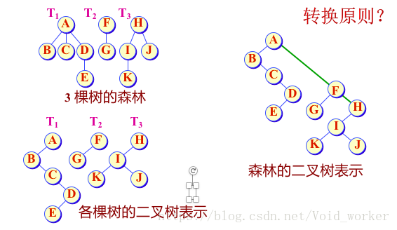
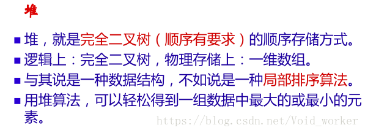
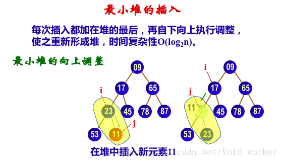

#  树

## 1. 树

### 1.1. 基本概念


* 结点：如上图，49、38、76 等都是洁点。注：结点不仅包含数据元素，还包含指向子树的分支。如： 49 结点不仅包含数据元素 49，而且还包含 2 个指向子树的指针。
* 结点的度：结点拥有的子树个数或者分支个数。
* 树的度：树中各结点度的最大值。

### 1.2. 树的性质

　　非空树中结点总数 N = 1 + 分支数。

　　分支数 = 树种各结点的度之和。

### 1.3. 树的存储结构

* 顺序存储结构：双亲存储结构，用一维数组即可实现，用数组小标表示树中的结点，数组元素的内容表示该结点的双亲结点。

* 链式存储结构：包括孩子存储结构、孩子兄弟存储结构。

  孩子存储结构，实质上就是图的邻接表存储结构。

### 1.4. 树的存储标识


　　左子树为第一个子女，右子树为下一个兄弟。


## 2. 二叉树

### 2.1. 基本概念

* 满二叉树
* 完全二叉树

### 2.2. 二叉树的性质

　　具有 n 个结点的完全二叉树的高度（或深度）为 取下整（long2n）+1，也可以写为 取上整 log2(n+1)。

### 2.3. 二叉树的存储结构

* 顺序存储结构：最适用于存储完全二叉树。
* 链式存储结构：一个数据域，两个指针域的链式结点结构。

```c++
typedef struct BTNode{
    int data;
    struct BTNode *lchild;
    struct BTNode *rchild;
}BTNode;
```

### 2.4. 二叉树的存储表示

* 二叉树的顺序表示
* 二叉树的链式表示（二叉链表）
* 三叉链表：增加一个指向双亲的指针 parent(如下图)


### 2.5. 二叉树的遍历

* 前序遍历
* 中序遍历
* 后序遍历

### 2.6. 构造二叉树

　　使用二叉树前序遍历建立二叉树


　　构造二叉树


　　二叉树计数：


### 2.7. 线索化二叉树

　　线索化二叉树，又称穿线树，将某种遍历顺序下的前驱、后继关系记在树的存储结构中，可以高效地找出某节点地前驱、后继。


## 3. 树与森林

### 3.1. 树的遍历









### 3.2. 森林与二叉树的转换

　　将一般树化为二叉树表示就是用树的子女-兄弟表示来存储树的结构。森林与二叉树表示的转换可以借助树的二叉树表示来实现。



### 3.3. 森林的遍历

　　森林的遍历也分为深度优先遍历和广度优先遍历，深度优先遍历又可分为先根次序遍历和后根次序遍历。

## 4. 堆



　　注：当调整完较高一层的顺序后要看底层的是否符合条件。



## 5. Huffman 树

### 5.1. 概述

* 两个结点之前的路径长度 PL 是连接两结点的路径上的分支树。
* 树的外部路径长度是各叶结点（外结点）到根结点的路径长度之和 EPL。
* 树的内部路径长度是各非叶结点（内结点）到根结点的路径长度之和 IPL。
* 树的路径长度 PL = EPL+IPL。


* 带权路径长度达到最小的扩充二叉树即为 Huffman 树。
* 在 Huffman 树种，权值大的结点离根最近。

### 5.2. Huffman 树的合并过程


### 5.3.  Huffman 树的存储

　　可以采用静态链表方式存储 Huffman 树。


### 5.4. 最佳判定树

* 利用 Huffman 树，可以在构造判定树（决策树）时让平均判定（比较）次数达到最小。
* 判定树是一颗扩展二叉树，外结点是比较结果，内结点是比较过程，外结点所带权值是概率。

### 5.5. Huffman 编码


　　用途：实现数据压缩。


## 参考文章

1. [数据结构--知识点总结--树](https://blog.csdn.net/void_worker/article/details/80919901)


5. [从零开始学数据结构和算法(六)二叉排序树](https://juejin.im/post/5c9460e25188252d971438c4)
6. [从零开始学数据结构和算法(七) huffman 树与 AVL 树](https://juejin.im/post/5c9464515188252d7e34df85)
15. [数据结构与算法（七）树和二叉树](https://chiclaim.blog.csdn.net/article/details/80574803)
16. [数据结构与算法（八）二分搜索树(Binary Search Tree)](https://chiclaim.blog.csdn.net/article/details/80598727)
18. [数据结构与算法（十）线段树(Segment Tree)入门](https://chiclaim.blog.csdn.net/article/details/80643017)
19. [数据结构与算法（十一）Trie字典树](https://chiclaim.blog.csdn.net/article/details/80711441)
21. [数据结构与算法（十三）平衡二叉树之AVL树](https://chiclaim.blog.csdn.net/article/details/80740418)
22. [数据结构与算法（十四）深入理解红黑树和 JDK TreeMap 和 TreeSet 源码分析](https://chiclaim.blog.csdn.net/article/details/81046088)

