#  树的基本知识

## 1.基本概念

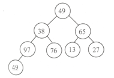

1. 结点：如上图，49、38、76 等都是洁点。注：结点不仅包含数据元素，还包含指向子树的分支。如： 49 结点不仅包含数据元素 49，而且还包含 2 个指向子树的指针。

2. 结点的度：结点拥有的子树个数或者分支个数。

3. 树的度：树中各结点度的最大值。

* 边（Edge）、根（Root）、叶子节点（Leaf）：

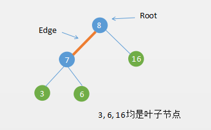

* 路径（Path）：

* 节点高度（Height）：

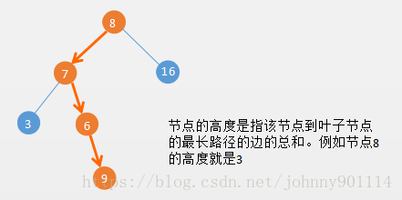

　　需要注意的是叶子节点的高度为 0 ，如果树只有一个节点，那么这个节点的高也为 0 。

* 深度（Depth）：

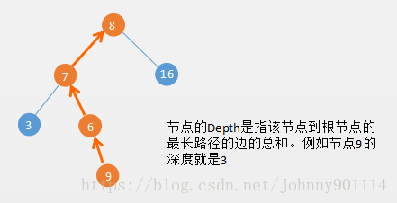

　　需要注意的是根节点的深度（Depth）是 0。

　　从 Height 和 Depth 的对比，它们的方向刚好是相反的。

* 层级（Level）：

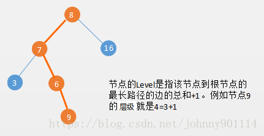

　　节点的 Level 是从 1 开始的，Level = Depth+1，根节点的 Level = 1。

　　也有很多书籍上 Level 是从 0 开始的，这样的话 Level 就等于 Depth，根节点的 Level  = 0。

## 2. 树的性质

　　非空树中结点总数 N = 1 + 分支数。

　　分支数 = 树种各结点的度之和。

## 3. 树的存储结构

* 顺序存储结构：双亲存储结构，用一维数组即可实现，用数组小标表示树中的结点，数组元素的内容表示该结点的双亲结点。

* 链式存储结构：包括孩子存储结构、孩子兄弟存储结构。

  孩子存储结构，实质上就是图的邻接表存储结构。

## 4. 树的存储标识

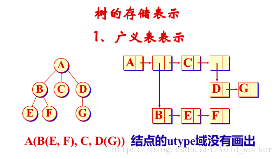

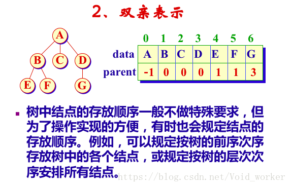

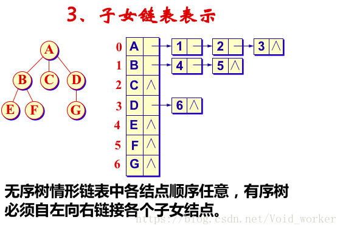

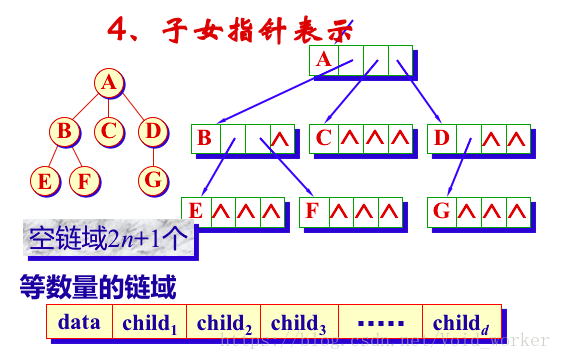

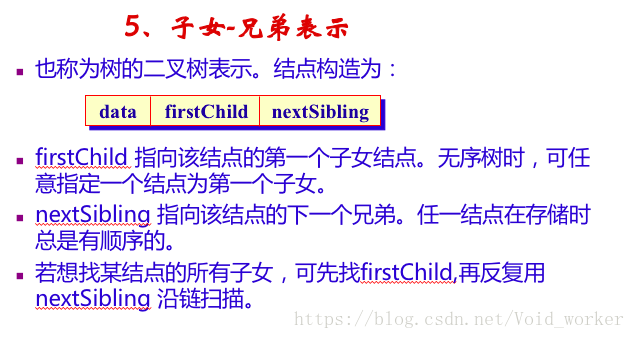

　　左子树为第一个子女，右子树为下一个兄弟。

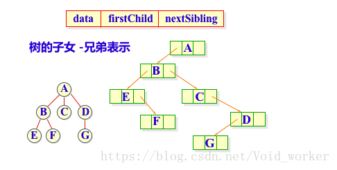

## 参考文章

1. [数据结构--知识点总结--树](https://blog.csdn.net/void_worker/article/details/80919901)
2. [数据结构与算法（七）树和二叉树](https://chiclaim.blog.csdn.net/article/details/80574803)

