#  红黑树

## 什么是 2-3 树

　　红黑树是完美平衡的 2-3 树的一种实现。所以，理解 2-3 树对掌握红黑树是至关重要的。

　　2-3 树的一个 Node 可能有多个子节点（可能大于 2 个），而且一个 Node 可以包含 2 个键（元素）。

　　可以把红黑树（红黑二叉查找树）当作 2-3 树的一种二叉结构的实现。

　　在二叉树中，一个 Node 保存一个值，在 2-3 树种把这样的节点称之为 2- 节点。

　　如果一个节点包含了两个值（可以当作两个节点的融合），在 2-3 树种把这样的节点称之为 3- 节点。完美平衡的 2-3 树所有空链接到根节点的举例都应该是相同的。

　　下面看下《算法 4》对 2-3- 节点的定义：

1. 2- 节点，含有一个键（及其对应的值）和两条链接。该节点的左链接小于该节点的键；该节点的右链接大于该节点的键。
2. 3- 节点，含有两个键（及其对应的值）和三条链接。左链接小于该节点的左键；中链接在左键和右键之间；右链接大于该节点右键。

　　如下面一棵完美平衡的 2-3 树：

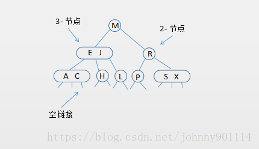

　　2-3 树是一颗多叉搜索树，所以数据的插入类似二分搜索树。

## 2-3 树的插入操作

　　红黑树是对完美平衡的 2-3 树的一种实现，所以主要介绍完美平衡的 2-3 树的插入过程。

　　完美平衡的 2-3 树插入分为以下几种情况（为了方便画图默认把空链接去掉）：

### 向 2- 节点插入新键

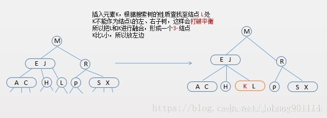

### 向一棵只含有一个 3- 结点的树中插入新键

　　因为 2-3 树中节点只能是 2- 节点或者 3- 节点。

　　往 3- 节点中再插入一个键就成了 4- 节点，需要对其进行分解，如下所示：

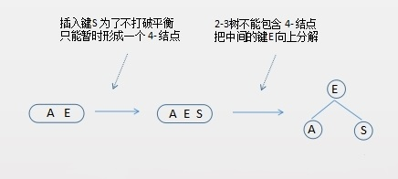

### 向一个父节点为 2- 节点的 3- 节点插入新键

　　向 3- 点中再插入一个键就成了 4- 节点，需要对其进行分解，对中间的键向上融合。

　　由于父节点是一个 2- 节点，融合后变成了 3- 节点，然后把 4- 节点的左键变成该 3- 节点的中间子节点。

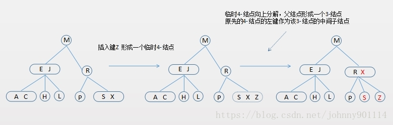

### 向一个父节点为 3- 节点的 3- 节点中插入新键

　　在这种情况下，向 3- 结点插入新键形成暂时的 4- 结点，向上分解，父节点又形成一个 4- 结点，然后继续向上分解。

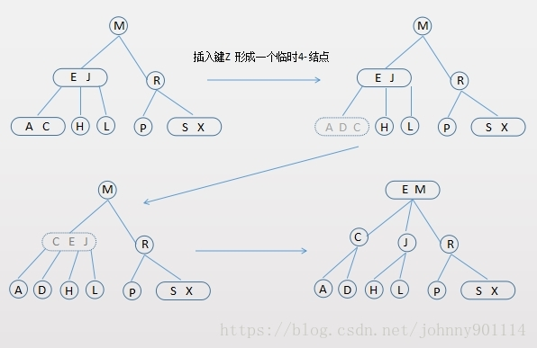

### 一个 4- 节点分解为一棵 2-3 树 6 种情况

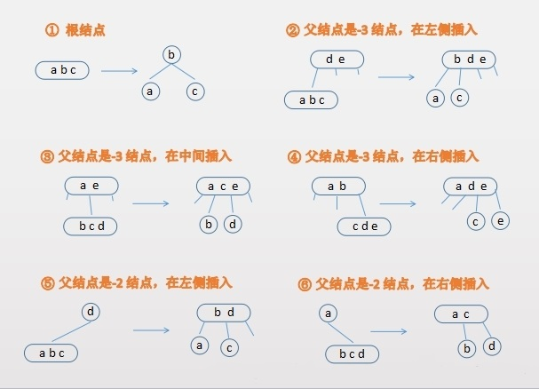

## 红黑树（ReadBlackTree）

### 完美平衡的 2-3 树和红黑树的对应关系

　　红黑树的背后的基本思想就是用标准的二分搜索树和一些额外的信息来表示 2-3 树的。

　　这额外的信息指的就是替换 3- 节点的方式。因为 2-3 树不是二叉树，因为 2-3 树不是二叉树（最后有 3 叉），所以需要把 3- 节点替换成 2- 节点。

　　将 2-3 树的链接定义为两种类型：黑链接、红链接。

　　黑链接 是 2-3 树中普通的链接，可以把 2-3 树中的 2- 节点与它的子节点之间的链当作黑链接。

　　红链接 2-3 树中 3- 节点分解成两个 2- 节点，这两个 2- 节点之间的链接就是红链接。

　　那么如何将 2-3 树和红黑树等价起来，规定：红链接均为左连接。

　　根据上面对完美平衡的 2-3 树和红链接的介绍可以得出结论：没有一个节点同时和两个红链接相连。

　　根据上面对完美平衡的 2-3 树和黑链接的介绍可以得出结论：完美平衡的 2-3 树是保持完美黑色平衡的，任意空链接到根节点的路径上的黑链接数量相同。

　　据此，可以得出 3 条性质：

1. 红链接均为左链接。
2. 没有一个结点同时和两个红链接相连。
3. 完美平衡的 2-3 树是保持完美黑色平衡的，任意空链接到根结点的路径上的黑链接数量相同。

　　在红黑树中，没有一个对象来表示红链接和黑链接，通过在节点上加上一个属性（color）来标识红链接还是黑链接，color 值为 red 表示节点为红节点，color 值为 black 表示节点为黑节点。

　　黑节点 2-3 树中普通的 2- 节点的颜色。

　　红节点 2-3 树中 3- 节点分解出两个 2- 节点的最小 2- 节点。

　　下面是 2-3 树和红黑树的一一对应关系图：

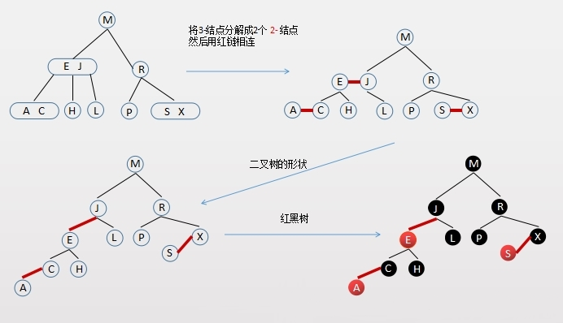

### 红黑树的 5 个基本性质的分析

　　介绍完了 2-3 树和红黑树的对应关系后，再来看下红黑树的 5 个基本性质：

1. 每个节点要么是红色的，要么是黑色。

   因为用节点上的属性来表示红链还是黑链，所以红黑树的节点要么是红色，要么是黑色是很自然的事情。

2. 根节点是黑色。

   红色节点的情况是 3- 节点分解出两个 2- 节点的最小节点是红色，根节点没有父节点所以只能是黑色。

3. 每个叶子节点（最后的空节点）是黑色。

   叶子节点也就是 2-3 树种的空链，如果空链是红色说明下面还是有子节点的，但是空链是没有子节点的；另一方面如果空链是红色，空链指向的父节点节点如果也是红色就会出现两个连续的红色链接，就与 “ 没有一个节点同时和两个红链接相连 ” 相违背。

4. 如果一个节点是红色，那么它的孩子节点都是黑色的。

   “没有一个节点同时和两个红链接相连”，所以一个节点是红色，那么它的孩子节点都是黑色。

5. 从任意的一个节点到叶子节点，经过的黑色节点是一样的。

   完美平衡的 2-3 树和黑链接得出的结论：“完美平衡的 2-3 树是保持完美黑色平衡的，任意空链接到根节点的路径上的黑链接数量相同”，所以从任意一个节点到叶子节点，经过的黑色节点数是一样的。

### 红黑树实现 2-3 树过程中的节点旋转和颜色翻转

#### 颜色翻转

　　为什么要颜色翻转（flipColor）？在插入的过程中可能出现如下情况：两个左右子节点都是红色。

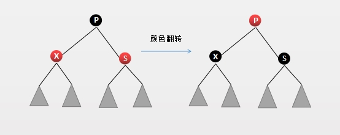

　　根据上面的描述，红链只允许是左链（也就是左子节点是红色）。

　　所以需要进行颜色转换：把该节点的左右子节点设置为黑色，自己设置为红色。

```java
private void flipColor(Node<K, V> node) {
	node.color = RED;
	node.left.color = BLACK;
	node.right.color = BLACK;
}
```

#### 左旋转

　　左旋转情况大致有两种：

1. 节点是右子节点且是红色

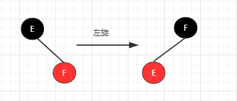

2. 颜色翻转后，节点变成红色且它是父节点的右子节点

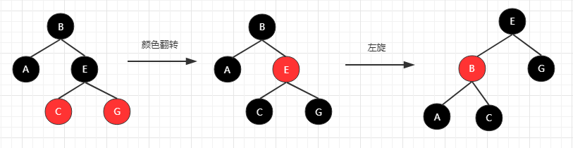

```

```

#### 右旋转

　　需要右旋的情况：连续出现两个左红色链接。

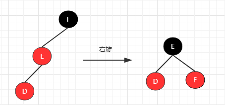

```

```

### 红黑树实现 2-3 树插入操作

　　2-3 树插入时只要满足不出现两个连续左红色链接、右红色链接、左右都是红色链接的情况就可以了。

　　所以仅仅需要处理三种情况即可：

1. 如果出现右侧红色链接，需要左旋。
2. 如果出现两个连续的左红色链接，需要右旋。
3. 如果节点的左右子链接都是红色，需要颜色翻转。

```

```

#### 对比 JDK 中 TreeMap 的插入操作

　　这样下来红黑树依然保持着它的五个基本性质，下面来对比 JDK 中的 TreeMap 的插入操作。

　　先按照上面的红黑树插入逻辑，插入三个元素【14，5，20】，流程如下：

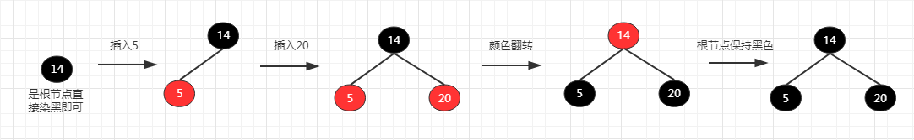

　　使用 Java TreeMap 来插入上面三个元素，流程如下：

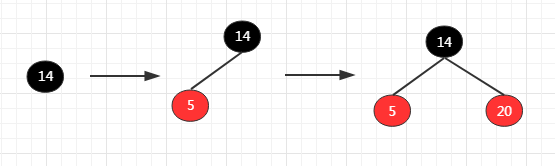

　　通过对比发现两者的插入后的结构不一样，而且 Java TreeMap 是允许左右子节点都是红色节点。

　　这就和用完美平衡的 2-3 树作为红黑树实现的基础结构相违背了，不允许左节点是红色，也不允许两个连续的红色左节点，不允许左右节点同时是红色。

　　这也是《算法 4》 在将到红黑树时遵循的。但是 JDK TreeMap（红黑树）是允许右节点时红色，也允许左右节点同时是红色，Java TreeMap 的红黑树实现从它的代码注解说明它的实现来自《算法导论》。

　　说明《算法 4》和《算法导论》中的所介绍的红黑树产生了一些 “ 出入 ”。

### 2-3-4- 树

　　2-3-4 树和 2-3 树非常相像。2-3 树允许存在 2- 节点和 3- 节点，类似的 2-3-4- 树允许存在 2- 节点、3- 节点和 4- 节点。

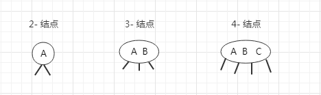

#### 向 2- 节点、3- 节点插入元素

　　向 2- 节点插入元素，这个上面介绍的 2- 3 树是一样，

　　向 3- 节点插入元素，形成一个 4- 节点，因为 2-3-4- 树允许 4- 节点的存在，所以不需要向上分解。

#### 向 4- 节点插入元素

　　向 4- 节点插入元素，需要分解 4- 节点，因为 2-3-4- 树最多只允许存在 4- 节点，如：

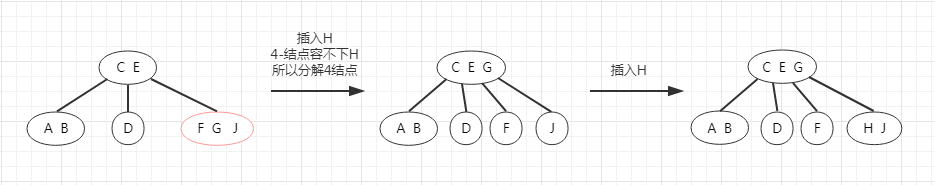

　　如果待插入的 4- 节点，它的父节点也是一个 4- 节点呢？如下图的 2-3-4 树插入节点K：

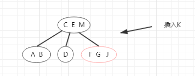

　　主要有两个方案：

1. Bayer 于 1972 年提出的方案：使用相同的方法去分解父节点的 4- 节点，直到不需要分解为止，方向是自底向上。
2. Guibas 和 Sedgewick 于 1978 年提出的方案：自上而下的方式，也就是在二分搜索的过程，一旦遇到 4- 节点就分解它，这样在最终插入的时候永远不会有父节点是 4- 节点的情况。

　　下面的图就是自上而下方案的流程图：

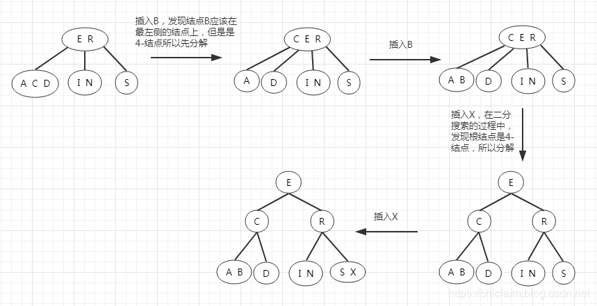


## 参考文章

1. [数据结构与算法（十四）深入理解红黑树和 JDK TreeMap 和 TreeSet 源码分析](https://chiclaim.blog.csdn.net/article/details/81046088)

