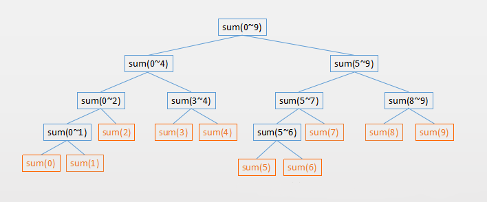
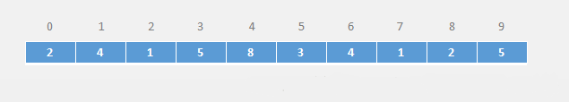
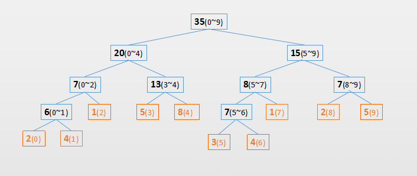
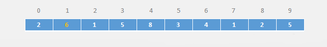
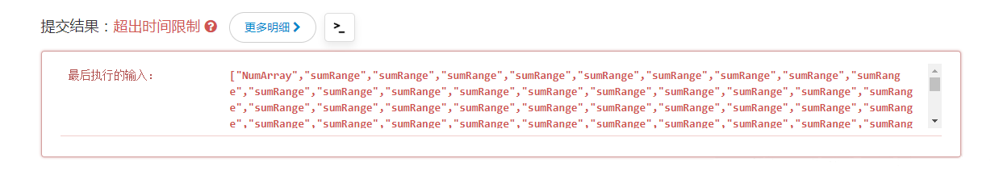

#  线段树

## 线段树的概念

　　线段树（Segment Tree）也是一棵树，只不过元素的值代表一个区间。

　　常用区间的统计操作，比如一个区间的最大值（max）、最小值（min）、和 (sum)等等。

　　如一个长度为 10 的数组，它对应的求和线段树，如下图所示（途中的数字表示索引）：



　　根节点就是 0-length-1 的和，根节点的左右子树平分根节点的区间，然后依次类推，直到只有一个元素不能划分为止，该元素也就是二叉树的叶子节点。

　　线段树是一个平衡二叉树，但不一定是完全二叉树。

　　从上图可以得出，求线段树的区间统计，时间复杂度和二叉树的高度有关系，和元素的个数没有关系，它的时间复杂度为 O(log n)，如果用普通的遍历的方式它的时间复杂度为 O(n)。

　　如果用数组来存储线段树的话，大致需要开辟多大的数组空间呢？

　　根据前面对满二叉树的分析，h 层的满二叉树总共有 2^h-1 个节点，第 h-1 层有 2^(h-1) 个节点，它们大概是两倍的关系。

　　也就是说对于满二叉树最后一层的节点数乘以 2，大致就是整棵树的结点数。

　　但是线段树并不一定是满二叉树，但是一定是平衡树，所以需要多冗余一层。也就是乘以 4 就足以盛放所有的结点数，但是会浪费一定的内存空间。

## 线段树的基本操作

### 构建线段树

　　根绝对线段树的描述，构建一个线段树就比较简单了，根节点就是整个区间，根节点的左右子树平分根节点的区间，直至区间内只剩下一个元素不能平分为止。如下面递归的伪代码：

```

```

　　对下面一个数组：



　　就会构建如下一个线段树（途中括号里数字表示索引区间）：




### 修改线段树

　　针对上面的数组，把索引为 1 的值改成 6 如下图所示：



　　那么线段树需要修改的节点有（虚线标明）：


### 线段树的查询

　　对于线段树的查询，主要有以下几种情况：

1. 要查询的区间在刚好就是当前节点的区间。
2. 要查找的区间在当前节点你的左子树区间
3. 要查找的区间在当前节点的右子树区间
4. 要查找的区间一部分在当前节点的左子树区间，一部分在右子树区间。

## 实现一个线段树

　　下面实现的线段树，有三个功能：

1. 把数组构建成一棵线段树。
2. 线段树的修改。
3. 线段树的查询。

```java
/**
 * 线段树
 */
public class ArraySegmentTree<T> {
    private T tree[];
    private T data[];

    private Merger<T> merger;

    public interface Merger<T> {
        T merge(T a, T b);
    }

    public ArraySegmentTree(T[] arr, Merger<T> merger) {
        this.merger = merger;
        data = (T[]) new Object[arr.length];
        for (int i = 0; i < data.length; i++) {
            data[i] = arr[i];
        }
        this.tree = (T[]) new Object[data.length * 4];
        buildSegmentTree(0, 0, data.length - 1);
    }

    private void buildSegmentTree(int treeIndex, int treeLeft, int treeRight) {
        if (treeLeft == treeRight) {
            tree[treeIndex] = data[treeLeft];
            return;
        }
        //当前节点左子树索引
        int leftTreeIndex = getLeft(treeIndex);
        // 当前节点右子树的索引
        int rightTreeIndex = getRight(treeIndex);
        int mid = treeLeft + (treeRight - treeLeft) / 2;
        // 构建左子树
        buildSegmentTree(leftTreeIndex, treeLeft, mid);
        // 构建右子树
        buildSegmentTree(rightTreeIndex, mid+1, treeRight);
        // 当前节点存访的值
        tree[treeIndex] = merger.merge(tree[leftTreeIndex], tree[rightTreeIndex]);
    }

    public T query(int start, int end) {
        return query(0, 0, data.length - 1, start, end);
    }

    /**
     * @param treeIndex 当前查找的节点
     * @param treeLeft  treeIndex 的左边界
     * @param treeRight treeIndex 的右边界
     * @param queryL    用户需要查找的左边界
     * @param queryR    用户需要查找的右边界
     * @return
     */
    private T query(int treeIndex, int treeLeft, int treeRight, int queryL, int queryR) {
        //1. 需要查找的范围完刚好在这个 treeIndex 节点的区间
        if (treeLeft == queryL && treeRight == queryR) {
            return tree[treeIndex];
        }

        // 当前节点的区间的中间点
        int mid = treeLeft + (treeRight - treeLeft) / 2;
        // 左子树索引
        int leftTreeIndex = getLeft(treeIndex);
        // 右子树索引
        int rightTreeIndex = getRight(treeIndex);

        // 2. 需要查找的范围完全在左子树的区间里
        if (queryR <= mid) {
            return query(leftTreeIndex, treeLeft, mid, queryL, queryR);
        }

        //3. 需要查找的范围完全在右子树的区间里
        if (queryL >= mid + 1) {
            return query(rightTreeIndex, mid + 1, treeRight, queryL, queryR);
        }

        // 需要查找的范围一部分在左子树里，一部分在右子树中
        T left = query(leftTreeIndex, treeLeft, mid, queryL, mid);
        T right = query(rightTreeIndex, mid + 1, treeRight, mid + 1, queryR);
        return merger.merge(left, right);
    }

    public void update(int index, T e) {
        data[index] = e;
        update(0, 0, data.length - 1, index, e);
    }

    private void update(int treeIndex, int treeLeft, int treeRight, int index, T e) {
        if (treeLeft == treeRight) {
            tree[treeIndex] = e;
            return;
        }
        int mid = treeLeft + (treeRight - treeLeft) / 2;
        int leftChildIndex = getLeft(treeIndex);
        int rightChildIndex = getRight(treeIndex);
        if (index <= mid) {
            update(leftChildIndex, treeLeft, mid, index, e);
        } else if (index >= mid + 1) {
            update(rightChildIndex, mid + 1, treeRight, index, e);
        }
        // 更改完叶子节点后，还需要对他的所有祖辈节点更新
        tree[treeIndex] = merger.merge(tree[leftChildIndex], tree[rightChildIndex]);
    }

    public T get(int index) {
        return data[0];
    }

    public int size() {
        return data.length;
    }

    public int getLeft(int index) {
        return index * 2 + 1;
    }

    public int getRight(int index) {
        return index * 2 + 2;
    }

    @Override
    public String toString() {
        StringBuilder builder = new StringBuilder();
        builder.append("[");
        for (int i = 0; i < tree.length; i++) {
            if (tree[i] == null) {
                continue;
            }
            builder.append(tree[i]).append(",");
        }
        builder.deleteCharAt(builder.length() - 1);
        builder.append("]");
        return builder.toString();
    }
}
```

## LeetCode 关于线段树的问题

### LeetCode 第 303 号问题

#### 问题描述

　　给定一个整数数组 nums，求出数组从索引 i 到 j （i<=j）范围内元素的总和，包含 i,j 两点。

#### 问题示例

　　给定 nums = [-2,0,3,-5,2,-1]，求和函数为 sumRange(int i,int j)

　　sumRange(0,2) -> 1

　　sumRange(2,5) -> -1

　　sumRange(0,5) -> -3

#### 问题说明

　　你可以假设数组不可变，会多次调用 sumRange 方法。

#### 解决问题

　　对于这个问题，在脑海中的方案就是遍历区间 [i,j]，然后累加。

```java
public class NumArray {
    private int[]  nums;
    public NumArray1(int[] nums){
        this.nums = nums;
    }

    public int sumRange(int i,int j){
        int sum = 0;
        for (int k = i;k<= j;k++){
            sum += nums[k];
        }
        return sum;
    }
}
```

　　把这个代码提交给 LeetCode，最后提示代码超时了。



　　原因在于 LeetCode 会构建一个很长的数组，然后调用很多次 sumRange，每次调用区间都不一样。这些操作没有在规定的时间内执行完毕，超时了。

　　这个时候就可以用线段树来解决这个问题，对实现的线段树做一些修改以适应 LeetCode 代码规范。

```java
public class NumArray2 {
    private int tree[];
    private int[] data;

    public NumArray2(int[] arr) {
        if (arr == null || arr.length == 0) {
            return;
        }
        data = new int[arr.length];
        for (int i = 0; i < arr.length; i++) {
            data[i] = arr[i];
        }
        this.tree = new int[data.length * 4];
        buildSegmentTree(0, 0, data.length - 1);
    }

    private void buildSegmentTree(int treeIndex, int treeLeft, int treeRight) {
        if (treeLeft == treeRight) {
            tree[treeIndex] = data[treeLeft];
            return;
        }
        int leftTreeIndex = getLeft(treeIndex);
        int rightTreeIndex = getRight(treeIndex);
        int mid = treeLeft + (treeRight - treeLeft) / 2;
        buildSegmentTree(leftTreeIndex, treeLeft, mid);
        buildSegmentTree(rightTreeIndex, mid + 1, treeRight);
        tree[treeIndex] = tree[leftTreeIndex] + tree[rightTreeIndex];
    }

    public int query(int start, int end) {
        return query(0, 0, data.length - 1, start, end);
    }

    private int query(int treeIndex, int treeLeft, int treeRight, int queryL, int queryR) {
        if (treeLeft == queryL && treeRight == queryR) {
            return tree[treeIndex];
        }
        int mid = treeLeft + (treeRight - treeLeft) / 2;
        int leftTreeIndex = getLeft(treeIndex);
        int rightTreeIndex = getRight(treeIndex);
        // 查找左子树
        if (queryR <= mid) {
            return query(leftTreeIndex, treeLeft, mid, queryL, queryR);
        }
        // 查找右子树
        if (queryL > mid) {
            return query(rightTreeIndex, mid + 1, treeRight, queryL, queryR);
        }
        // 部分存在左子树，部分存在右子树
        int left = query(leftTreeIndex, treeLeft, mid, queryL, mid);
        int right = query(rightTreeIndex, mid + 1, treeRight, mid + 1, queryR);
        return left + right;
    }

    private int getLeft(int treeIndex) {
        return treeIndex * 2 + 1;
    }

    private int getRight(int treeIndex) {
        return treeIndex * 2 + 2;
    }

    public int sumRange(int i, int j) {
        System.out.println("tree:" + Arrays.toString(tree));
        return query(i, j);
    }
}
```

　　最后获得了 LeetCode 的通过。

### LeetCode 第 307 号问题

　　这个问题和上面的 303 号问题基本一样，唯一不同的是需要修改数组里的元素。

#### 问题描述

　　给定一个整数数组 nums，求出数组从索引 i 到 j（i <= j）范围内元素的总和，包含 i,j 两点。

　　update(i,val) 函数可以通过将下标为 i 的数值更新为 val，从而对数列进行修改。

#### 问题示例

```java
示例：
Given nums = [1,3,5];
sumRange(0,2) -> 9
update(1,2)
sumRange(0,2) -> 8
```

#### 问题说明

　　数组仅可以在 update 函数下进行修改。

　　你可以假设 update 函数预 sumRange 函数的调用次数是均匀分布的。

#### 解决问题

　　这个问题，在上一个问题代码的基础上，调用线段树的 update 方法即可。

```java
public class NumArray3 {

    private int[] tree;
    private int[] data;

    public NumArray3(int[] data) {
        if (data == null || data.length == 0) {
            return;
        }
        this.data = new int[data.length];
        for (int i = 0; i < data.length; i++) {
            this.data[i] = data[i];
        }
        this.tree = new int[data.length * 4];
        createSegmentTree(0, 0, data.length - 1);
    }

    private void createSegmentTree(int treeIndex, int dataLeft, int dataRight) {
        if (dataLeft == dataRight) {
            tree[treeIndex] = data[dataLeft];
            return;
        }
        int treeLeftIndex = getLeft(treeIndex);
        int treeRightIndex = getRight(treeIndex);
        int mid = dataLeft + (dataRight - dataLeft) / 2;
        createSegmentTree(treeLeftIndex, dataLeft, mid);
        createSegmentTree(treeRightIndex, mid + 1, dataRight);
        tree[treeIndex] = tree[treeLeftIndex] + tree[treeRightIndex];
    }

    public int query(int qStart, int qEnd) {
        return query(0, 0, data.length - 1, qStart, qEnd);
    }

    private int query(int dataIndex, int dataStart, int dataEnd, int qStart, int qEnd) {
        if (dataStart == qStart && dataEnd == qEnd) {
            return tree[dataIndex];
        }
        int treeLeftIndex = getLeft(dataIndex);
        int treeRightIndex = getRight(dataIndex);
        int mid = dataStart + (dataEnd - dataStart) / 2;
        if (qStart > mid) {
            return query(treeRightIndex, mid + 1, dataEnd, qStart, qEnd);
        }
        if (qEnd <= mid) {
            return query(treeLeftIndex, dataStart, mid, qStart, qEnd);
        }
        int left = query(treeLeftIndex, dataStart, mid, qStart, mid);
        int right = query(treeRightIndex, mid + 1, dataEnd, mid + 1, qEnd);
        return left + right;
    }

    public void update(int dataIndex, int newData) {
        if (dataIndex >= 0 && dataIndex < data.length) {
            data[dataIndex] = newData;
        }
        update(0, 0, data.length - 1, dataIndex, newData);
    }

    public void update(int treeIndex, int dataStart, int dataEnd, int qIndex, int newData) {
        if (dataStart == dataEnd && dataStart == qIndex) {
            tree[treeIndex] = newData;
            return;
        }
        int treeLeftIndex = getLeft(treeIndex);
        int treeRightIndex = getRight(treeIndex);
        int mid = dataStart + (dataEnd - dataStart) / 2;
        if (qIndex <= mid) {
            update(treeLeftIndex, dataStart, mid, qIndex, newData);
        }
        if (qIndex > mid) {
            update(treeRightIndex, mid + 1, dataEnd, qIndex, newData);
        }
        tree[treeIndex] = tree[treeLeftIndex] + tree[treeRightIndex];
    }

    private int getLeft(int index) {
        return index * 2 + 1;
    }

    private int getRight(int index) {
        return index * 2 + 2;
    }

    @Override
    public String toString() {
        return Arrays.toString(tree);
    }

    public int sumRange(int i, int j) {
        if (i < 0 || i > j || j > data.length) {
            return -1;
        }
        return query(i, j);
    }
}
```

## 参考文章

1. [数据结构与算法（十）线段树(Segment Tree)入门](https://chiclaim.blog.csdn.net/article/details/80643017)

